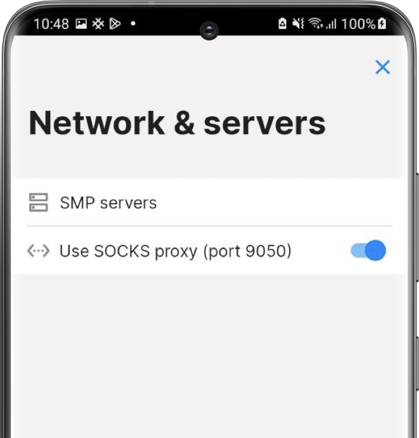

# Privacy and Security

SimpleX Chat default configuration aims to balance privacy, security and convenience. You may want to change the default options.

This page lists all the features and options that affect privacy and security.

## Privacy and Security settings

These settings are available in the [Privacy & Security settings](./app-settings.md#privacy-and-security).

## Security code verification

While SimpleX Chat always establishes connection via link passed via an independent channel, so it is already more protected than other apps, there are scenarios when the invitation links can be substituted in transit (MITM attack). To protect against such attacks, you should verify the security code with your contacts:

- open the conversation with the contact
- tap the contact name on top of the conversation
- tap "Verify security code"
- ask your contact to do the same
- the connection is secure if you and your contact have the same security code

This can be validated by one of the following:

- one of you can scan the security code from their device, if the codes match the contact will be marked as verified on the device that scanned the code.
- simply tap mark verified if you trust the confirmation from your contact that the code is verified.
- you can also read the contact over the voice call.

Read more in [this post](../../blog/20230103-simplex-chat-v4.4-disappearing-messages.md#connection-security-verification)

## Database passphrase

When installed, the app generates a random passphrase for the chat database and stores it securely in KeyChain (iOS) or using KeyStore (Android, TPM module is used when available). You can set your own passphrase and also remove it from the device, in which case you will need to enter it every time you start the app, and notifications may be limited, in the [Database passphrase & export](./managing-data.md#database-passphrase) settings.

## Incognito mode

This feature generates a random profile name for each new contact. Read more in [Incognito mode](./app-settings.md#incognito).

## Hidden profiles

This feature allows to hide some of your chat profiles with the password. Read more in [Hiding and muting chat profiles](./chat-profiles.md#hiding-and-muting-chat-profiles).

## Network settings

[Transport isolation (BETA)](./app-settings.md#transport-isolation-beta) allows to isolate you traffic with each contact in a different TCP connection (and Tor circuit).

## Using Tor

 &nbsp; 

To connect to SMP relays (messaging servers) via Tor you need to install Orbot app.

Android: use Orbot app as SOCKS proxy on port 9050 (default) and enable [Use SOCKS proxy](./app-settings.md#use-socks-proxy-android-only).

iOS: use Orbot app as VPN provider and enable VPN.

You can also change which server addresses are used with [Use .onion hosts option](./app-settings.md#use-onion-hosts).
