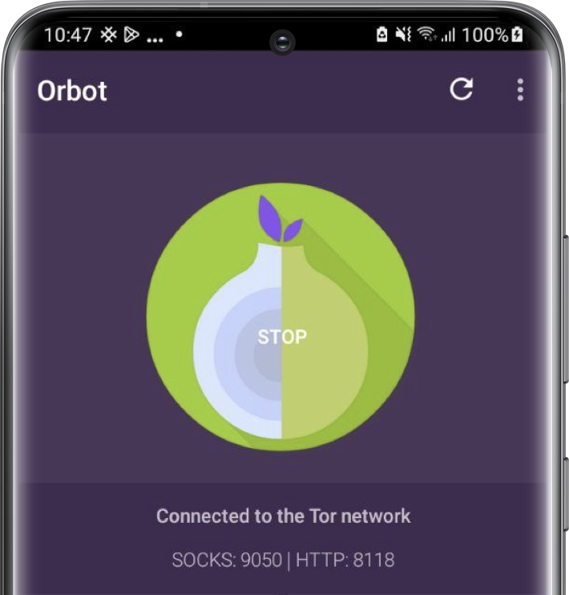

# Privacy and security

SimpleX Chat's default configuration aims to balance privacy, security and convenience. You may want to change the default options to suit your needs. This page lists all the features and options that affect privacy and security. Tap or click on the following sections to learn more:

- [Privacy and security settings](#privacy-and-security-settings)
- [Security code verification](#security-code-verification)
- [Database passphrase](#database-passphrase)
- [Incognito mode](#incognito-mode)
- [Hidden profiles](#hidden-profiles)
- [Network settings](#network-settings)

## Privacy and security settings

These settings are available in the app settings menu. 

### SimpleX Lock

This setting affects the ability to use SimpleX Lock - it's disabled by default. Depending on what type of lock you choose when you enable it, this feature will provide either device-level authentication or app-level authentication for the app. SimpleX Lock prompts you to confirm your device credentials (PIN, face, fingerprint, or pattern) or a passcode when you open the app, resume the app after a set amount of inactivity expires, or to use some security- or privacy-sensitive features. 

#### To enable it:

1. [Open the app settings menu](./app-settings.md#opening-the-app-settings-menu).

2. Tap or click **Privacy & security**.

3. Tap or click **SimpleX Lock**

4. From the **Lock mode** dropdown, choose one of the following options:
   
   - `System`
   - `Passcode`

5. Toggle **Enable lock** on. If you've set **Lock mode** to `System`, then you'll be prompted to confirm your device credentials. If you've set **Lock mode** to `Passcode`, then you'll be prompted to create a SimpleX Lock passcode.

6. From the **Lock after** dropdown, choose one of the following options:
   
   - `10 seconds`
   - `30 seconds`
   - `1 minute`
   - `3 minutes`
   - `10 minutes`
   - `Immediately`

#### To disable it:

1. [Open the app settings menu](#opening-the-app-settings-menu).
2. Tap or click **Privacy & security**.
3. Tap or click **SimpleX Lock**
4. Toggle **Enable lock** off.
5. Confirm your device credentials or SimpleX Lock passcode.

### Self-destruct passcode

This feature comes in handy when you're in distress and don't want to leave any trace of using SimpleX Chat on your device. 

#### To set a self-destruct passcode:

1. [Open the app settings menu](#opening-the-app-settings-menu).
2. Tap or click **Privacy & security**.
3. If using a mobile device, change lock mode from **System** to **Passcode**.
4. Toggle **SimpleX Lock** on, if disabled.
5. Create your SimpleX Lock passcode.
6. Toggle **Enable self-destruct** on.
7. (Optional) Enter a display name.
8. Confirm your SimpleX Lock passcode.
9. Create a self-destruct passcode.
10. Confirm your self-destruct passcode.

Now that you've set a self-destruct passcode. You can enter it at any time when the app prompts you to enter a passcode. When you do, all of your SimpleX Chat data will be wiped from your device and be replaced by a new empty chat profile with your chosen display name or a randomized name if you left it blank.

### Protect app screen (Mobile apps only)

This setting affects the ability to hide the app's screen in the recent apps list - it's enabled by default. It also prevents screenshots on Android.

### Send link previews

This setting affects the ability to send link previews to your contacts and groups - it's disabled by default. 

**Please note**: enabling link previews may reduce privacy, as the app will load the link preview from the website.

### Show last messages

This setting affects the visibility of your last messages on the **Chats** screen - it's enabled by default. If you want to protect this information from someone looking over your shoulder, for example, you can simply disable it.

### Message draft

This setting affects the ability to draft a message - it's enabled by default. However, you can only have one message draft at a time. This will last until you either:

- Compose another message draft to send to another contact or group.
- Close the app.
- Toggle the setting off.

### SimpleX links

This setting affects how SimpleX links used to connect with other SimpleX users or to join groups are displayed in the UI. You can choose between:

- `description (default)` - Only the link description and server host name are shown. The link won't be opened in the browser, however.
- `full link` - The full link is shown. The link will still not be opened in the browser, however.

### Encrypt local files

This setting affects encryption at rest for locally stored files and media on your device - it's toggled on by default. You can toggle it off, if you need to access the files from outside of the app, for example. 

### Auto-accept images

This setting affects how images are received from your contacts and groups - it's toggled on by default. However, auto-accepting images may reduce privacy because your contacts will know that you are online.

### Protect IP address

This setting affects the privacy of your IP address when downloading files and media from unknown file servers - it's toggled on by default. If you have this option toggled off, and you don't use Tor or a VPN, then your IP address will be exposed to unknown file servers.

### Send delivery receipts to contacts and small groups (max 20 members)

These settings affect the ability to send delivery receipts to contacts and small groups with a maximum number of 20 members. Both are toggled on by default.

**Please note**: These settings are applied on a per-chat-profile basis. They can be overridden in contact and group preferences. 

## Security code verification

Although SimpleX Chat always establishes connections via a link passed via an independent channel, there are scenarios when a link can be substituted with a malicious link in transit as part of a man-in-the-middle (MITM) attack. To protect against such attacks, you should verify the security of your connections with your contacts. 

#### To verify security code:

1. Tap or click on your contact. 
2. Tap or click on your contact's name at the top of the screen.
3. Tap or click **Verify security code**. 
4. Ask your contact to perform the first three steps. 

You and your contact should now see the security code on your screens. This can be verified by one of the following methods:

- `Scan code` - Scan each other's security code in person. If the codes match, then your contact will be marked verified on your device.
- `Mark verified` - Tap or click on this button if you trust the confirmation from your contact that the code is verified.

For more details on security code verification, please read [this blog post](../../blog/20230103-simplex-chat-v4.4-disappearing-messages.md#connection-security-verification).

## Database passphrase

A passphrase is used to encrypt the database.  For more details, please visit the [Managing Data page](./managing-data.md#database-passphrase).

## Incognito mode

This feature generates an incognito profile with a random name and empty profile for each new contact. For more details, please visit the [Chat profiles page](./chat-profiles.md#incognito-mode).

## Hidden profiles

This feature allows you to hide some of your chat profiles with a password. For more details, please visit the [Chat profiles page](./chat-profiles.md#hiding-chat-profiles).

## Network settings

### Transport isolation (BETA)

[Transport isolation](./network-and-servers.md#transport-isolation-beta) allows you to isolate your network traffic by using a different TCP connection and Tor circuit for each contact and group member, or for each chat profile in the app. 

### Using Tor

&nbsp;

To connect to SMP relays (messaging servers) and XFTP relays (file servers) via Tor, you need to install Orbot app.

**Android and Desktop**: use Orbot app as SOCKS proxy on port 9050 (default) and enable the [Use SOCKS option](./network-and-servers.md#use-socks-proxy-android-and-desktop-only).

**iOS**: use Orbot app as VPN provider and enable VPN.

You can also change which server addresses are used with the [Use .onion hosts option](./network-and-servers.md#use-onion-hosts).
