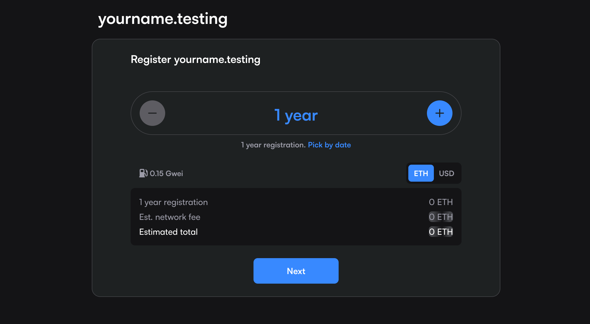
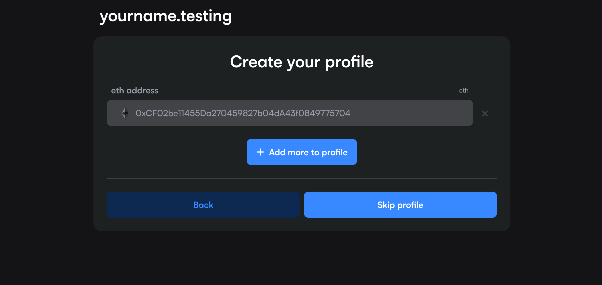
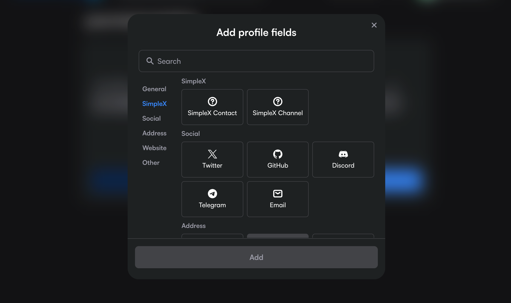
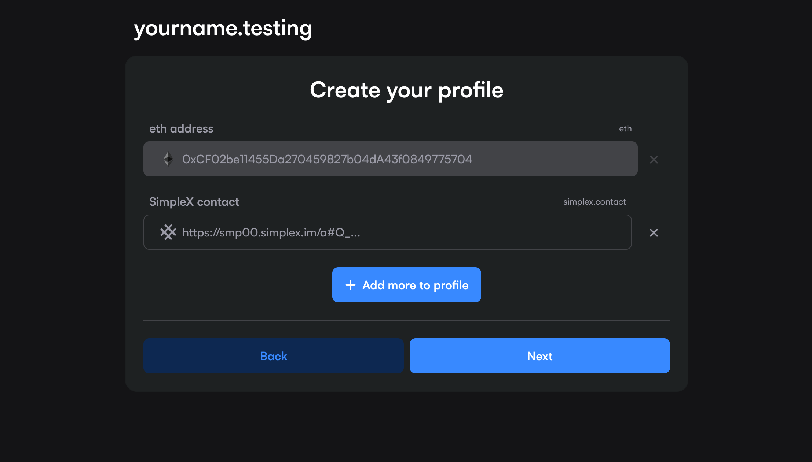
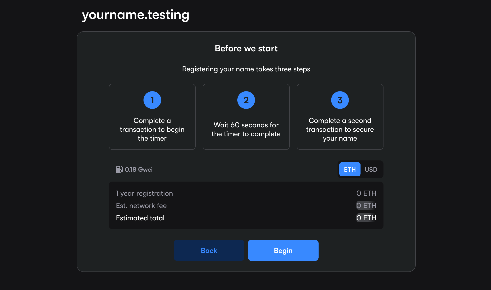

# Registering a SimpleX name

A SimpleX name lets people reach you by typing a short `@name` instead of pasting
a long link. You register the name on a website (it becomes an NFT in your
wallet) and add your SimpleX link to it, then claim the name in the app so it
shows as verified.

> Names currently run on a testing network. The registration website is
> [snrc-testing.pages.dev](https://snrc-testing.pages.dev/) and names end in
> `.testing`. The steps stay the same when the main network launches.

## What you need

- A crypto wallet such as MetaMask.
- The SimpleX app.
- A link for the name to open: your **contact address** (for one-to-one chats),
  your **channel link** (to join a channel), or both.

## How it works

Setting up a name takes two parts. On the website you register the name and add
your link, so people can find your link by name. In the app you set the same name
on your profile, so it shows as verified.

## Step 1. Create a wallet

Install MetaMask (browser extension or mobile app) and create a wallet. Write
down your recovery phrase somewhere safe and offline, as anyone with that phrase
controls your names.

On the testing network you need a small amount of test ETH to pay network fees.

## Step 2. Register the name and add your link

Open the registration website and tap **Connect** to link your wallet. Type the
name you want in **Search for a name** and open it. Choose how many years to
register for, then tap **Next**. Names are currently 6 characters or more, and
some names are reserved.

On **Create your profile**, tap **+ Add more to profile**.

In **Add profile fields**, open the **SimpleX** category (these fields appear as
**SimpleX Contact** and **SimpleX Channel** in the current app):

Add your link:

- **SimpleX Address** for one-to-one chats. Copy your address from the app
  (**Create SimpleX address**) and paste it here. People reach it with `@name`.
- **SimpleX Channel link** for a channel. Copy your **Channel link** and paste it
  here. People join it with `#name`.
- Add both to use one name for your chat (`@name`) and your channel (`#name`).

Then tap **Next**.

Finally, tap **Begin** and complete the three steps the site shows:

> Before we start. Registering your name takes three steps:
> 1. Complete a transaction to begin the timer.
> 2. Wait 60 seconds for the timer to complete.
> 3. Complete a second transaction to secure your name.

## Step 3. Check what the app sees

Copy your `@name`. In the app, open **New chat**, choose **Connect via link**,
and tap **Tap to paste link**.

The app reports that the name is registered but not yet added to your profile:

> Unconfirmed name. The SimpleX name is registered, but not added to profile.
> Please add it to your address or channel profile, if you are the owner.

This is expected, and confirms the name points at your link. The next step
finishes the setup.

## Step 4. Claim the name in the app

Set the name on the same profile the record points at.

- For your **contact address**, open your SimpleX address, tap **Your SimpleX
  name**, enter the name, and save.
- For your **channel**, open the channel information, tap **SimpleX name** (below
  **Channel link**), enter the name, and save.

This publishes proof inside your link that it is `@name`.

## Step 5. Connect by name

On another device, copy the `@name`, open **New chat**, choose **Connect via
link**, and tap **Tap to paste link**. This time the app connects, and the name
shows a check mark next to it.

Anyone can now reach you by name, and their app confirms it is really you.

## If something doesn't work

| Message | Meaning | Fix |
|---|---|---|
| Unconfirmed name | The name points at a link, but the link's profile does not claim the name yet. | Do step 4: set the name on the profile it points at. |
| Name not found | No name is registered. | Check the spelling, or register it (step 2). |
| No valid link | The name has no contact or channel link. | Add a link to the name on the website, on its **Records** tab. |
| Error saving name | You tried to claim a name that has no matching link on the website. | Add your contact address or channel link to the name, then set the name again. |
| None of your servers are set to resolve SimpleX names | No server in the app is set to resolve names. | In server settings, turn on **To resolve names** for a server. |

## See also

- [Making connections](./making-connections.md)
- [Chat profiles](./chat-profiles.md)
- [Channel webpage](./channel-webpage.md)
