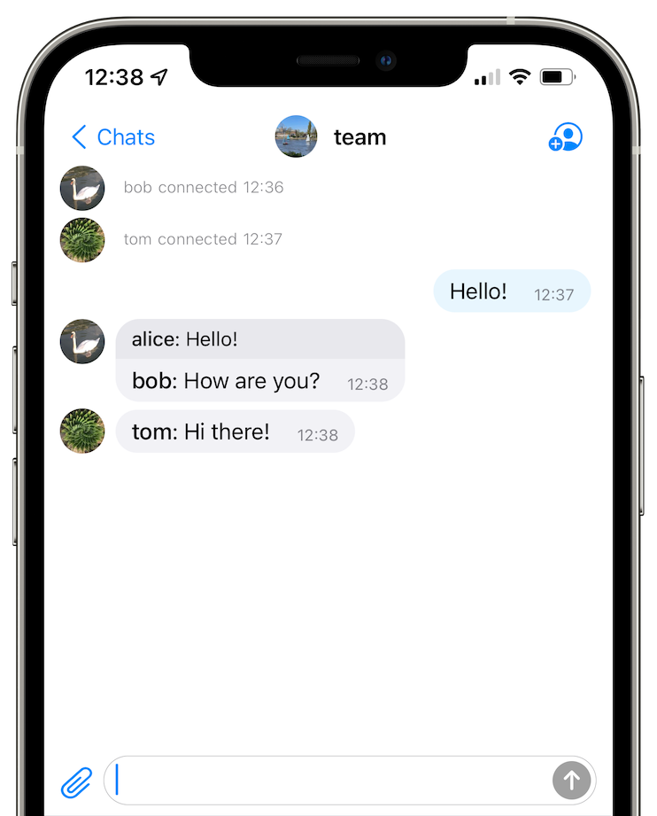
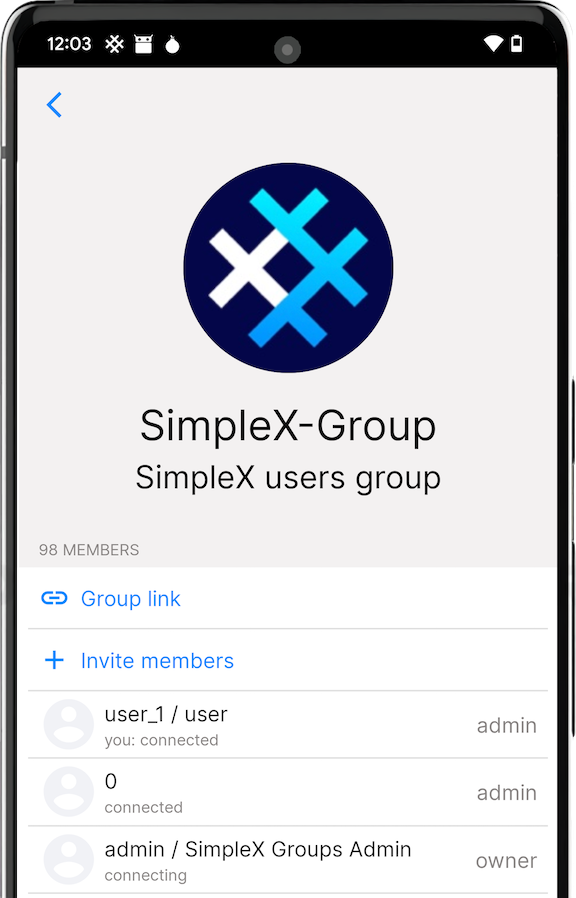

# Secret groups

Secret groups are anonymous and private; only group members know they exist. Every message and file gets sent separately to each member of the group, which makes secret groups only fit for smaller groups with less than 100 members. 

## Contents

- [Member roles and permissions](#member-roles-and-permissions)
- [Creating a secret group](#creating-a-secret-group)
- [Managing a secret group](#managing-a-secret-group)
- [Joining a secret group](#joining-a-secret-group)
- [Leaving a secret group](#leaving-a-secret-group)

## Member roles and permissions

| Permission            | Owner | Admin | Member | Observer |
|:---------------------:|:-----:|:-----:|:------:|:--------:|
| Edit group profile    | ✅     | ❌     | ❌      | ❌        |
| Add welcome message   | ✅     | ❌     | ❌      | ❌        |
| Set group preferences | ✅     | ❌     | ❌      | ❌        |
| Create group link     | ✅     | ✅     | ❌      | ❌        |
| Invite members        | ✅     | ✅     | ❌      | ❌        |
| Remove members        | ✅     | ✅     | ❌      | ❌        |
| Change member role    | ✅     | ✅     | ❌      | ❌        |
| Moderate messages     | ✅     | ✅     | ❌      | ❌        |
| Send messages         | ✅     | ✅     | ✅      | ❌        |
| Delete messages       | ✅     | ✅     | ✅      | ❌        |
| Read messages         | ✅     | ✅     | ✅      | ✅        |

## Creating a secret group

  

#### To create a secret group:

1. On Android, tap the 🖉 (pencil) button in the bottom-right corner of the screen. On iOS, tap the 🖉 (pencil) button in the top-right corner of the screen.
2. Tap **Create secret group**.
3. Enter a required group display name and an optional full name.
4. Tap **Create**.

## Managing a secret group

### Editing your group profile

As a group owner, you can edit your group profile.

#### To edit your group profile:

1. Tap on your group from your list of chats. 
2. Tap on your group's name at the top of the screen. 
3. Tap **Edit group profile**. 
4. Options:
   - Choose a new display name. 
   - Choose a new full name. 
   - Choose a new profile picture. 
5. Tap **Save group profile**.

### Adding a welcome message

As a group owner, you can add a welcome message that will be shown to new members when they join your group.

#### To add a welcome message:

1. Tap on your group from your list of chats. 
2. Tap on your group's name at the top of the screen. 
3. Tap **Add welcome message**. 
4. Compose your welcome message. 
5. Tap **Save and update group profile** when finished. 

### Setting group preferences

As a group owner, you can choose whether you want to allow disappearing messages, direct messages, delete for everyone, message reactions, and voice messages. 

#### To set group preferences:

1. Tap on your group from your list of chats. 
2. Tap on your group's name at the top of the screen.
3. Tap **Group preferences**. 
4. Set your group preferences. 
5. Tap **Save and notify group members**. 

### Creating a group link

 &nbsp;&nbsp; 

As a group owner or admin, you can choose to make your secret group public by creating a group link and sharing it as a link or QR code for anyone to join.

#### To create a group link:

1. Tap on your group from your list of chats. 
2. Tap on your group's name at the top of the screen.
3. Tap **Create group link**.
4. (Optional) Change **Initial role** to "observer".

**Please note**: deleting your group link won't remove members from your group. 

Want to take it a step further? You can add your public group to the SimpleX Directory service. 

#### To add your secret group to the SimpleX directory:

1. Invite SimpleX-Directory bot to your group as an admin.
2. SimpleX-Directory bot will create a public group link for new members to join even when you're offline.
3. You will then need to add this link to the group welcome message.
4. Once the link is added, the group will be sent to the service admins for manual approval. Please note that it can take up to 24 hours. 

### Inviting members

As a group owner or admin, you can invite members to your group. 

#### To invite a member to your group:

1. Tap on your group from your list of chats. 
2. Tap on the invite button at the top of the screen to the right of your group's name.
3. Select contacts you wish to invite.
4. Tap **Invite to group**.

### Removing members

As a group owner or admin, you can remove members from your group. 

#### To remove a member from your group:

1. Tap on your group from your list of chats. 
2. Tap on your group's name at the top of the screen. 
3. Tap on a member. 
4. Tap **Remove member**.

### Changing a member's role

As a group owner or admin, you can change a member's role. 

#### To change a member's role:

1. Tap on your group from your list of chats. 
2. Tap on your group's name at the top of the screen to view the list of members. 
3. Tap on a member to view their info.
4. Change the member's role to one of the following options:
   - observer
   - member
   - admin 
   - owner
  
### Making your secret group discoverable

As a group owner, you can add your secret group to the SimpleX directory. 

## Joining a secret group

When you receive an invitation to join a group, you can accept it both from your chat with your contact who invited you and from the list of chats.

## Leaving a secret group

Tap and hold (Android) or swipe (iOS) the group in the list of the conversations to leave the group.

Alternatively, you can also leave the group from the group info page:

1. Open a group chat.
2. Tap on your group's name at the top of the screen.
3. Scroll to the bottom and tap **Leave group**.