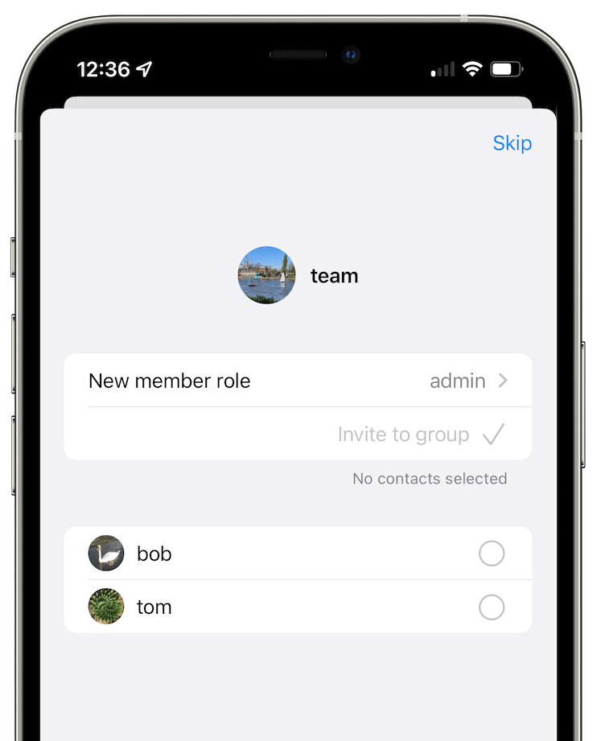

# Secret groups

Secret groups are anonymous and private, they are designed to be hard to track by outsiders. Every message and file gets sent separately to every member in the group, which makes secret groups only fit for smaller groups.

## Creating a group

  

- Tap on a button in the lower right-hand of the screen.
- Tap on "Create secret group".
- Enter group display name.
- Tap on "Create".

## Group preferences

Here you can choose whether you want to allow disappearing messages, direct messages, deleting for everyone and voice messages.

## Adding members

- Open a group.
- Tap on + button in the upper right-hand of the screen.
- Select contacts you wish to invite.
- Tap on "Invite to group".

## Joining a group

When you receive the invitation to join the group you can accept it both from the conversation with your contact and from the list of conversations.

## Leaving a group

Tap and hold (Android) or swipe (iOS) the group in the list of the conversations to leave the group.

You can also leave the group from the group page:

- Open a group conversation.
- Tap group name on top.
- Scroll to the bottom and tap "Leave group".

## Member permissions

Open a group and tap on group's name to view members list, there you can tap on a member and change their role.

- Observer: can only read messages (and delete or mark deleted the messages they sent before their role was changed).
- Member: can send messages and delete own messages.
- Admin: Same as member, but can delete the messages of others and remove members from the group.
- Owner: Same as admin, but can change group preferences.

## Link to join group

 &nbsp;&nbsp; 

If you are a group owner or admin, you can create a link that can be used by anyone to join the group, making a group more public.

- Open a group conversation.
- Tap group name.
- Tap on "Create group link.

Once the link is created, you can also change the role assigned to members when they join.

## Welcome message

If you are a group owner you can create a welcome message that will be shown to all new members joining group.
