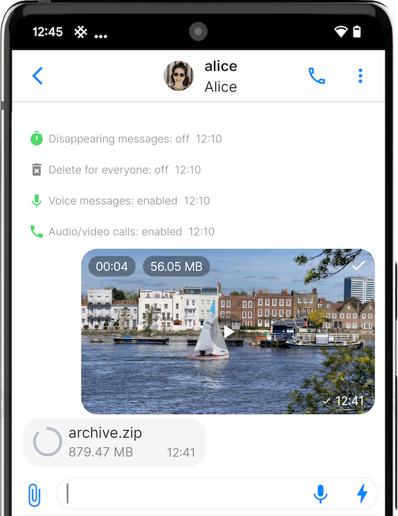
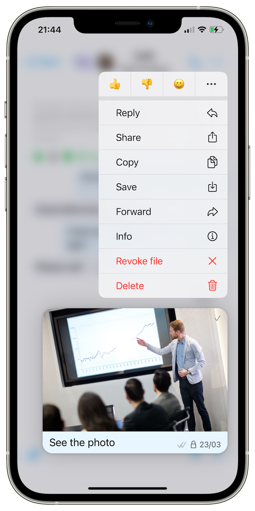
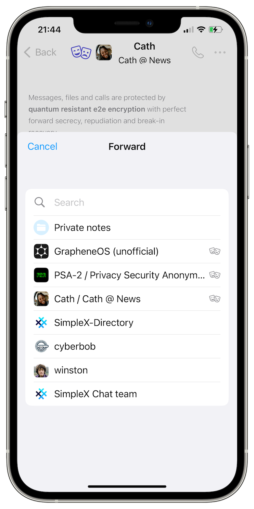

# Sending, editing, deleting, drafting, forwarding, replying and reacting to messages

After creating your first chat profile, you can start communicating privately with other SimpleX Chat users. Tap or click on the following sections to learn more:

- [Sending messages](#sending-messages)
- [Editing messages](#editing-messages)
- [Deleting messages](#deleting-messages)
- [Drafting messages](#drafting-messages)
- [Forwarding messages](#forwarding-messages)
- [Replying to messages](#replying-to-messages)
- [Reacting to messages](#reacting-to-messages)

## Sending messages

### Sending text messages

You can send text messages to your contacts and groups. 

#### To send a text message:

1. Tap or click on your contact or group in the main **Chats** screen.
2. Tap or click on the text area toward the bottom of the screen.
3. Type in your message.
4. On mobile, tap on the ⬆️ (send) button. On desktop, press `Enter`.

### Sending images, videos, and files

You can send images, videos, and files of up to 1GB in size.

#### To send an image, video, or file:

1. Tap or click on the 📎 (attach) button on the left of the text area.
2. Choose either **Camera**, **Image**, **Video**, or **File**.
3. Choose what you wish to send. 
4. On mobile, tap on the ⬆️ (send) button. On desktop, press `Enter`.

**Tip**: if you're using iOS, you can also paste images from the clipboard.

### Sending voice messages

You can record voice messages of up to 5 minutes.

#### To send a voice message:

1. Tap on the 🎙️ (microphone) button on the right of the text area.
2. Allow SimpleX Chat to record your voice, if prompted. You will have to tap on the 🎙️ (microphone) button again if this happens.
3. Speak.
4. Tap on the 🟦 (stop) button on the right-hand side of the text area to stop recording.
5. (Optional) You may listen to the recording before sending it, and re-record if necessary.
6. Tap on the ⬆️ (send) button to send your recorded voice message.

**Tip**: You can also tap and hold on the 🎙️ (microphone) button to record your voice message. In this case, the recording will stop once you release the button. You still need to tap on the ⬆️ (send) button or press `Enter` to send your recorded voice message.

**Please note**: 

1. If the 🎙️ (microphone) button is greyed out, that means voice messages are disabled in your chat. Ask your contact or group owner to enable them.
2. Voice messages are not supported on the desktop app at this time. 

### Sending disappearing messages

 &nbsp;&nbsp; 

You can send disappearing messages to your contacts and groups. But before you can send them, you must enable them first, as they are disabled by default.

#### To enable disappearing messages with your contact:

1. Tap or click on your contact in your list of chats.
2. Tap or click on your contact's name at the top of the screen.
3. Tap **Contact preferences**.
4. Toggle **Disappearing messages** on, if it's toggled off.
5. From the **Delete after** drop-down menu, choose how long until messages are deleted after being sent.
6. Tap or click **Save and notify contact**.

**Please note**: Disappearing messages require mutual consent between you and your contact to be enabled. If your contact doesn't have disappearing messages enabled, they will receive an offer from you to enable disappearing messages with your proposed timer. If they agree to it, then they must tap **Accept** to enable them. If your contact chooses to reject your offer, then disappearing messages will remain disabled until you both agree to a timer that works best for the nature of your conversation.

#### To enable disappearing messages in your group:

1. Tap or click on your group in your list of chats.
2. Tap or click on your group's name at the top of the screen.
3. Tap or click **Group preferences**.
4. Toggle **Disappearing messages** on, if it's toggled off.
5. From the **Delete after** drop-down menu, choose how long until messages are deleted after they're sent.
6. Tap or click **Save and notify group members**.

**Please note**: in a group, only the group owner can enable disappearing messages.

Now that you have disappearing messages enabled, all you have to do is send a message and it will disappear after the timer expires. That's it! But if for some reason you need to set a different timer for an individual message, you do have that option available to you.

#### To set a timer for an individual disappearing message:

1. Compose your message.
2. On mobile, tap and hold on the ⬆️ (send) button. On desktop, right-click on the ⬆️ (send) button.
3. Tap or click **Disappearing message**.
4. Choose a timer of your choice.

**Please note**: this option is not available if you have disappearing messages disabled in your conversation.

### Sending "live" messages

You can compose "live" messages for your contacts to see as you type them without having to tap or click on the ⬆️ (send) button until it's completed. It can be useful in the following scenarios:

- Having a real-time conversation with someone in person or participating in a discussion club. You can retract what you wrote. However, your recipients would still see it. Also, people don’t need to guess what you’re typing. This avoids interrupting the flow of conversation and still allows you to send longer messages.

- An activist is doing live reporting when there is a risk of losing their phone or connection at any moment. They can type as many words as possible without sending only short messages.

#### To send a "live" message:

1. Tap or click on the ⚡️ (lightning) button on the right of the text area. When you do it the first time, you will see a little popup explaining how the feature works.
2. Tap or click **OK**.
3. Tap or click on the ⚡️ (lightning) button again.

Done! Now you can start typing "live" messages. The app will periodically send updates to your contacts every few seconds as you type each word.

### Sending stickers and GIFs

 &nbsp;&nbsp; 

Although there are no stickers and GIFs available in the app itself, you can still send them using third-party keyboards (such as [GIPHY](https://apps.apple.com/us/app/giphy-the-gif-search-engine/id974748812) on iOS) or native (Android 13+) keyboards.

## Editing messages

You can edit your messages. 

#### To edit a message:

1. On mobile, tap and hold on your message. On desktop, right-click on your message.
2. Choose **Edit**.
3. Edit your message.
4. On mobile, tap on the ⬆️ (send) button (mobile). On desktop, press `Enter`.

**Please note**: you only have 24 hours to edit your message after it's sent.

## Deleting messages

 &nbsp;&nbsp; 

You can delete messages from your contacts and groups. 

#### To delete a message

1. On mobile, tap and hold on a message. On desktop, right-click on a message.
2. Tap or click **Delete**.

If you sent a message within the last 24 hours, you will be offered two options when you go to delete it:

- `delete for everyone` - The message will be marked as deleted for you and your contacts by default. If you don't want this, you can configure this feature to fully delete the message from your and the recipients' devices instead. 
- `delete for me` - This will only delete the message from your device.

**Please note**: after 24 hours have passed, the `delete for everyone` option will become unavailable and only the `delete for me` option will remain.

For more details on why we don't enable `delete for everyone` by default, please read [this blog post](../../blog/20221206-simplex-chat-v4.3-voice-messages.md#irreversible-message-deletion). TL;DR: data sovereignty.

## Drafting messages

 &nbsp;&nbsp; 

You can draft a message before sending it to your contact or group, or saving it in your private notes.

#### To draft a message:

1. Type your text message, attach any files or media, or record a voice message.

2. Go back to the main **Chats** screen.

**Please note**: For privacy and simplicity, we decided to allow only one message draft at a time and keep it until the app is stopped.

## Forwarding messages

  

You can forward messages to your contacts, groups, or your private notes. 

#### To forward a message:

1. On mobile, tap and hold on a message. On desktop, right-click on a message.
2. Tap or click **Forward**.
3. Choose a contact, group, or your private notes.
4. On mobile, tap on the ⬆️ (send) button. On desktop, press `Enter`.

## Replying to messages

You can reply directly to a message from your contact or group. 

#### To reply to a message:

1. On mobile, tap and hold on a message. On desktop, right-click on a message.
2. Tap or click **Reply**.
3. Type your message.
4. On mobile, tap on the ⬆️ (send) button. On desktop, press `Enter`.

**Tip**: if you're using Android, you can also swipe left on a message to make a reply.

## Reacting to messages

You can react to messages. 

#### To react to a message with an emoji:

1. On mobile, tap and hold on a message. On desktop, right-click on a message.
2. Choose from any of the six emojis available at the top of the context menu.

**Tip**: if you've mistakenly reacted to a message with the wrong emoji, you can just tap or click on it to remove it.
