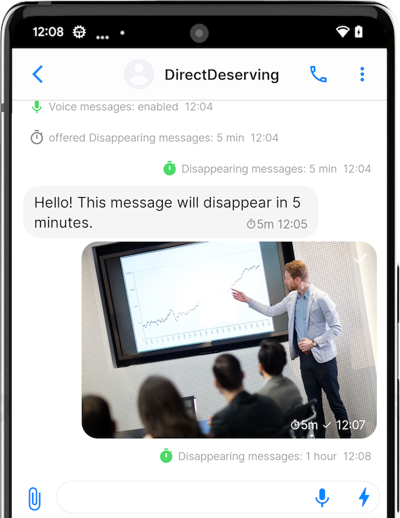

# Sending, editing and deleting messages

Sending text messages on SimpleX Chat is pretty straightforward, tap on your contact and then tap on text area, type in your message and tap on "Send" button.

You need to open a conversation to send messages.

## Sending messages

### Sending text messages

You can send, edit and quote messages in a conversation.

To send, simply type in the message in the entry box and tap "Send".

To edit or quote a message, tap and hold the message and choose the action.

### Sending images and files

- Tap 📎 (paperclip) button on the left of the message entry box.
- Choose between "Use Camera", "From Gallery" and "Choose file".
- Once you have chosen what you wish to send, tap on "Send" button.

On iOS you can also paste images from the clipboard.

### Sending voice messages

- Tap 🎤 (microphone) button on the right of the message entry box.
- Allow SimpleX Chat to record the voice if prompted. You will have to tap on the microphone button once again if this happens.
- Speak, once you've finished the recording, tap on the square stop icon on the right.
- You may listen to the recording before sending it, and re-record if necessary.
- Tap on "Send" button to send the recorded voice message.

You can also tap and hold the microphone button to record a voice message. In this case the recording will stop once you release the button. You still need to tap "Send" to send the message.

**Please note**: if the microphone button is gray, that means voice messages are disabled in this conversation. Ask your contact or group owner to enable them (they are enabled by default).

### How to use disappearing messages

 &nbsp;&nbsp; 

- Tap on name of the conversation.
- Toggle the slider next to "Disappearing messages".
- Choose how long until messages are deleted after being sent in "Delete after".

**Please note**: Your contact must also enable disappearing messages. In a group, only group owner can enable disappearing messages.

### Sending "live" messages

You can use "live" messages for your recipients to see the messages as you type them, without having to tap "Send" button until it's completed. It can be useful in these scenarios:

1. Real-time conversation, like talking in person or in a discussion club. You can retract what you wrote, but your recipients would see it. Also people don’t need to guess what you’re typing. This allows to avoid interrupting the flow of conversation and still send longer messages.
2. An activist doing live reporting when there is a risk to lose the phone or connection at any moment. This feature allows to send as much as possible, up to the last word, without having to send only very short messages.

To send a "live" message:

- Tap ⚡️ (lightning) button on the right of the message entry box.
- When you do it first time, you would see and alert explaining the feature. Tap "OK", and tap it again.
- Now you can start typing the messages, the app will be periodically sending the updates to your recipients, as you type (every few seconds, and only complete words).

### Sending stickers and animated messages

 &nbsp;&nbsp; 

While there are no stickers and GIFs in the app itself, you can send them using third-party (such as [GIPHY](https://apps.apple.com/us/app/giphy-the-gif-search-engine/id974748812) on iOS) or native (Android 13+) keyboards.

### Message drafts

 &nbsp;&nbsp; 

Messages are kept in the chat until they are sent, even if you leave the chat.

For privacy and simplicity, we decided to allow only one message draft and keep it only until the app is stopped.

Read more in [this post](../../blog/20230204-simplex-chat-v4-5-user-chat-profiles.md#message-draft).

## Deleting messages

 &nbsp;&nbsp; 

To delete a message, tap and hold the message and choose "Delete".

If you sent this message yourself within the last 24 hours, you will be offered two options:

- `delete for everyone` - this will either mark the message as deleted for you and the recipient(s) (this is the default) or fully delete the message on your and recipients' devices (if you have enabled "Delete for everyone" in the conversation preferences)
- `delete for me` - this will delete the message only locally.

Please read about [reasons for not allowing full deletion by default](../../blog/20221206-simplex-chat-v4.3-voice-messages.md#irreversible-message-deletion). TL;DR: data sovereignty.

## Moderating messages in the groups

Group admins can delete member messages that are inappropriate for the groups.

To remove a message of another member, tap and hold the message and choose "Moderate".

Please read about [group moderation](../../blog/20230328-simplex-chat-v4-6-hidden-profiles.md#community-moderation).
