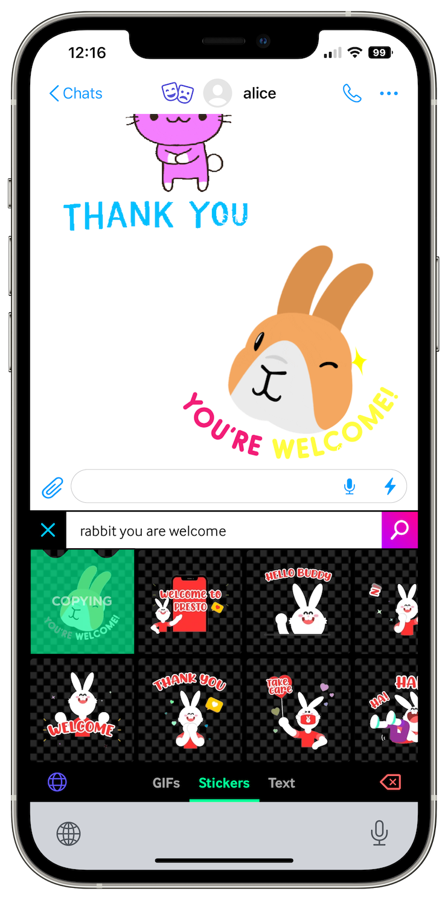

# Sending, editing and deleting messages

SimpleX Chat allows for sending, editing, quoting, and deleting messages.

## Sending messages

### Sending text messages

To send a text message, simply type your message into the text area and then tap the ⬆️ (send) button.

### Sending images and files

1. Tap the 📎 (paperclip) button on the left of the text area.
2. Choose between **Use Camera**, **From Gallery** and **Choose file**.
3. Once you have chosen what you wish to send, tap the ⬆️ (send) button.

**Tip:** if you're on iOS, you can also paste images from the clipboard.

### Sending voice messages

1. Tap the 🎙️ (microphone) button on the right of the text area.
2. Allow SimpleX Chat to record your voice, if prompted. You will have to tap the 🎙️ (microphone) button again if this happens.
3. Speak. 
4. Tap the 🟦 (stop) button on the right-hand side of the text area to stop recording.
5. (Optional) You may listen to the recording before sending it, and re-record if necessary.
6. Tap the ⬆️ (send) button to send your recorded voice message.

**Tip:** You can also tap and hold the 🎙️ (microphone) button to record your voice message. In this case, the recording will stop once you release the button. You still need to tap the ⬆️ (send) button to send your recorded voice message.

**Please note:** If the 🎙️ (microphone) button is grayed out, that means voice messages are disabled in this conversation. Ask your contact or group owner to enable them (they are enabled by default).

### How to use disappearing messages

 &nbsp;&nbsp; 

1. Tap on your contact's name.
2. Toggle **Disappearing messages** on, if it's toggled off.
3. From the **Delete after** dropdown menu, choose how long until messages are deleted after being sent.
4. Tap **Save and notify contact**. 

**Please note:** An offer will be sent to your contact. They must accept it to enable disappearing messages in your conversation with them. As for groups, only a group owner can enable them.

### Sending "live" messages

You can use "live" messages for your contacts to see as you type them without having to tap the ⬆️ (send) button until it's completed. It can be useful in these following scenarios:

1. Real-time conversation, like talking in person or in a discussion club. You can retract what you wrote, but your recipients would still see it. Also people don’t need to guess what you’re typing. This allows to avoid interrupting the flow of conversation and still send longer messages.
2. An activist doing live reporting when there is a risk of losing their phone or connection at any moment. This feature allows typing as many words as possible until the last word, without having to send only very short messages.

#### To send a "live" message:

1. Tap the ⚡️ (lightning) button on the right of the text area. When you do it the first time, you will see an alert explaining the feature.
2. Tap **OK**, and then tap the ⚡️ (lightning) button again.

Done! Now you can start typing "live" messages. The app will periodically send updates to your contacts every few seconds as you type only complete words. 

### Sending stickers and animated messages

 &nbsp;&nbsp; 

While there are no stickers and GIFs available in the app itself, you can send them using third-party (such as [GIPHY](https://apps.apple.com/us/app/giphy-the-gif-search-engine/id974748812) on iOS) or native (Android 13+) keyboards.

### Message drafts

 &nbsp;&nbsp; 

Messages are kept in the chat until they are sent, even if you leave the chat.

For privacy and simplicity, we decided to allow only one message draft and keep it only until the app is stopped.

Please read [this blog post](../../blog/20230204-simplex-chat-v4-5-user-chat-profiles.md#message-draft) for more details.

## Editing messages

1. Tap and hold (Android) or swipe (iOS) your message. 
2. Choose **Edit**.
3. Edit your message. 
4. Tap the ⬆️ (send) button.

**Please note:** you only have 24 hours to edit your message after it's sent. 

## Quoting messages

1. Tap and hold (Android) or swipe (iOS) a message. 
2. Choose **Quote**.
3. Type your message.
4. Tap the ⬆️ (send) button.

**Tip:** if you're on Android, you can also swipe left on a message to quickly quote it.

## Deleting messages

 &nbsp;&nbsp; 

To delete a message, tap and hold (Android) or swipe (iOS) the message and choose **Delete**. 

If you sent this message yourself within the last 24 hours, you will be offered two options:

- `delete for everyone` - this will either mark the message as deleted for you and your recipient(s) (this is the default setting) or fully delete the message on your and recipients' devices (if you have enabled "Delete for everyone" in the conversation preferences).
- `delete for me` - this will only delete the message from your device.

After 24 hours have passed, the `delete for everyone` option will become unavailable.

Please read [this blog post](../../blog/20221206-simplex-chat-v4.3-voice-messages.md#irreversible-message-deletion) for more details on the reasons for not allowing full deletion by default. TL;DR: data sovereignty.

## Moderating messages in groups

Group admins and owners can delete member messages that are inappropriate for groups.

To remove a message of another member, tap and hold (Android) or swipe (iOS) the message and choose **Moderate**.

Please read [this blog post](../../blog/20230328-simplex-chat-v4-6-hidden-profiles.md#community-moderation) for more details.
