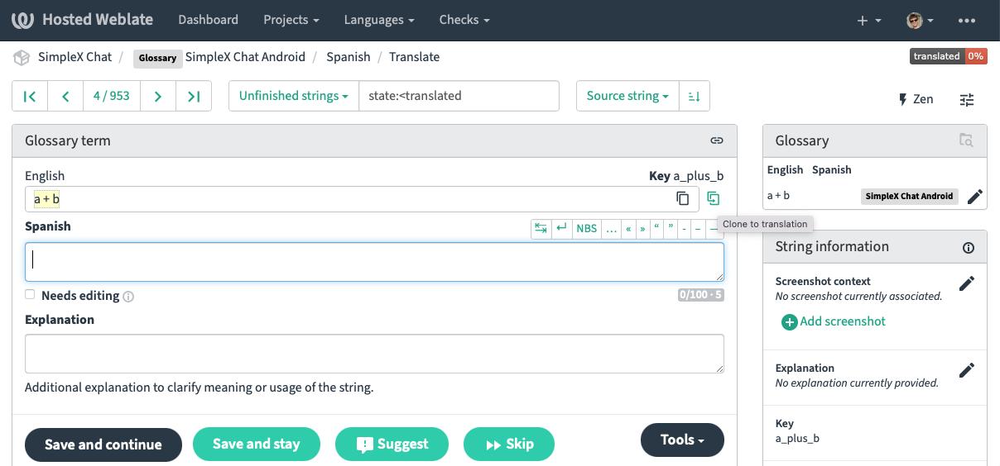

| 19.03.2023 | ZH_CN, EN, [CZ](/docs/lang/cs/TRANSLATIONS.md), [FR](/docs/lang/fr/TRANSLATIONS.md), [PL](/docs/lang/pl/TRANSLATIONS.md) |

# 为 SimpleX Chat 贡献翻译

非常感谢您对 SimpleX Chat 翻译的兴趣——这对让更多用户能够使用该应用帮助很大，我们非常感谢您的帮助。

这需要大量的时间投入——大多数人最初低估了这一点——并且随着我们开发应用程序需要持续维护。

本文档旨在加速这一过程，并分享一些我们在使用 Weblate（我们用于界面翻译的平台）时发现的重要注意事项。

## 在开始翻译之前

1. 在 Weblate 上创建一个账户，使用您在 GitHub 上使用的相同电子邮件地址——这将使您的贡献与您的 GitHub 账户相关联，并在某些情况下可能对您有所帮助。一旦翻译发布给用户，我们会将您的账户名添加到[翻译者列表](https://github.com/simplex-chat/simplex-chat#translate-the-apps)，除非您要求我们不要这样做。

2. 在开始翻译之前，需要通过 Weblate 签署一份简单的贡献者许可协议——这是为了避免与知识产权相关的任何冲突。该协议的副本也[可以在此处获取](https://github.com/simplex-chat/cla/blob/master/CLA.md)。

3. 我们还可以将您添加到翻译者组中，以便回答问题和提供更新——请通过聊天与开发人员联系（无论是刚安装应用时还是稍后通过应用设置中的“发送问题和想法”）。

## 翻译流程

建议先翻译 Android 应用，然后再翻译 iOS 应用，因为 Android 应用的字符串已设置为 iOS 的术语表。

步骤如下：

1. 在 Weblate 中[翻译 Android 应用](#translating-android-app)。
2. [我们审查并发布 Android 应用翻译](#releasing-android-app-translations)。
3. 您在应用中审查翻译并纠正任何错误。
4. 在 Weblate 中[翻译 iOS 应用](#translating-ios-app)。
5. 我们审查并发布 iOS 应用翻译。

### 翻译 Android 应用

1. 请从[Android 应用](https://hosted.weblate.org/projects/simplex-chat/android/)开始，无论是进行最耗时的初始翻译，还是稍后添加任何字符串。首先，iOS 字符串可能会延迟出现在 Weblate 中，因为它需要我们手动操作后才能可见。其次，Android 应用已设置为 iOS 应用的术语表，所有字符串中有 2/3 只需点击两次即可从 Android 转移到 iOS（这仍然需要一些时间，不幸的是 Weblate 并未自动化此过程）。

2. 某些字符串不需要翻译，但仍需要复制——Weblate 界面中有一个按钮可以完成此操作：

3. Weblate 还提供自动建议，可以加快翻译过程。有时可以直接使用，有时需要稍作编辑——点击即可在翻译中使用它们。

4. 另外，请注意字符串键（在屏幕右侧）——当不清楚时，它可能会提示您该字符串的含义。例如，“Additional accent”（不清楚）的键是“color_primary_variant”（稍微清楚一些，表明它指的是应用中使用的颜色）。

5. 一旦 Android 应用中的所有字符串都翻译完成，请审查以确保风格和语言一致性，以便在类似用户操作中始终使用相同的词汇，与英文一致。有时，您需要在英文只有一个词的情况下使用不同的词，请尝试在类似上下文中一致地使用这些选择，以便最终用户更容易理解。

请还使用 Chrome 浏览器的*翻译为英文*功能在 Weblate 的浏览模式中审查反向翻译——这是我们在发布翻译之前会审查的内容。修复任何错误，并在需要显著不同翻译的情况下添加注释——这将大大加快审查速度。

### 发布 Android 应用翻译

一旦 Android 应用翻译完成，请告知我们。

我们将：

- 审查所有翻译并提出任何修改建议——这也需要一些时间 :)
- 将它们合并到源代码中——在我们执行此操作时，Weblate 将被锁定以防更改。
- 创建 iOS 和 Android 应用的测试版——我们还可以将您添加到内部测试组中，以便您可以在其他人之前安装应用。
- 将其发布给我们的测试用户——有超过一千人使用我们的测试版。
- 发布应用并在公告中包含新语言。

### 翻译 iOS 应用

1. 当您翻译[iOS 应用](https://hosted.weblate.org/projects/simplex-chat/ios/)时，大部分字符串完全相同——可以在术语表部分一键复制。可以进行此操作的视觉提示是整个源字符串以黄色突出显示。许多其他字符串非常相似，仅在插值语法或加粗字体的使用上有所不同——它们需要最少的编辑。有些字符串是 iOS 平台独有的——需要单独翻译。

2. 请以与 Android 相同的方式审查 iOS 翻译，并在准备好审查时告知我们——我们将对 iOS 应用重复相同的流程。

非常感谢！这是一项巨大的努力，对 SimpleX 网络的成长帮助很大。

## 常见翻译错误

1. “chat”一词根据上下文有多种含义。它可以指“SimpleX Chat 应用”（例如在“开始/停止聊天”中）或“单个对话”。如果不清楚，请询问我们，我们会添加更多翻译注释。

2. 请使用原始字符串中的复数和单数，否则可能会改变含义。例如，某些设置适用于所有联系人，而某些设置仅适用于一个联系人，如果两种情况下都使用复数会令人困惑。

3. 应用使用“Passcode”来提供访问权限，而不是“password”——在许多语言中，它被翻译为“访问码”。数据库使用“Passphrase”——在许多语言中，它被翻译为“密码”。请一致地使用这些词。

4. 成员“role”。此词指用户拥有的权限集，可以是“owner”、“admin”、“member”或“observer”（最低权限，仅允许阅读消息和添加消息反应）。将其翻译为“身份”或“功能”可能不正确。

5. “Moderate”/“moderated”。这些词分别表示“删除其他成员的消息”和“由管理员删除”。当成员发送不适合群组的消息时会使用此功能。许多语言有类似的词。

## 我们如何审查翻译

为了验证翻译的正确性，我们通过在 Google Chrome 浏览器中以“翻译为英文”模式浏览 Weblate 页面来审查反向翻译。例如，为审查 Android 界面的德语翻译，我们团队中的某人浏览了[这 68 页内容](https://hosted.weblate.org/browse/simplex-chat/android/de/)。

我们并不要求反向翻译与原文完全相同，这很少发生，只需大致正确即可。

如果您能提前以相同方式审查并对反向翻译完全不同的情况发表评论（可能有合理的情况），将大大简化审查过程。

## 接下来是什么

1. 随着我们更新应用，我们会在翻译者组中发布更新。您完全没有义务翻译这些附加字符串。如果您愿意翻译，我们将非常感激，因为当用户依赖您的翻译时，体验会更好，而不是应用的某些新部分未被翻译。

2. 您还可以通过翻译[我们的网站](https://simplex.chat)（也可以通过[Weblate](https://hosted.weblate.org/projects/simplex-chat/website/)）和/或[GitHub 文档](https://github.com/simplex-chat/simplex-chat/tree/master/docs/lang)（仅通过 git 可能）进一步帮助 SimpleX 在您的国家/语言群体中的推广！

3. 此外，如果您希望成为您语言用户组的版主/管理员，一旦应用翻译完成，我们可以托管这样的群组——我们正在准备社区指南并为应用添加一些将在 3 月发布的 v4.6 中的管理工具。

再次感谢您帮助 SimpleX Chat 成长！

Evgeny，SimpleX Chat 创始人。
