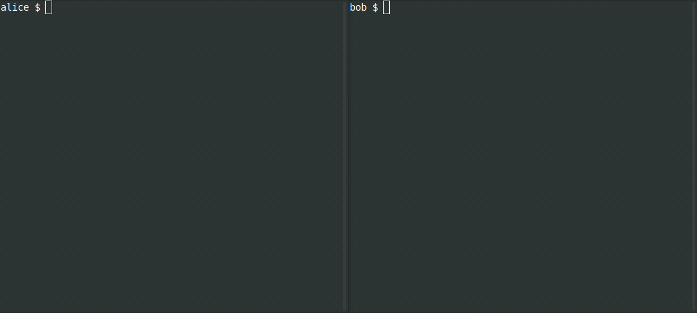

| Aktualizováno 07.02.2023 | Jazyky: CZ, [EN](/docs/README.md), [FR](/docs/lang/fr/README.md), [PL](/docs/lang/pl/README.md) |


# SimpleX - první platforma pro zasílání zpráv, která neobsahuje žádné identifikační údaje uživatelů - 100% soukromá!

[](https://github.com/simplex-chat/simplex-chat/actions/workflows/build.yml)
[](https://github.com/simplex-chat/simplex-chat/releases)
[](https://github.com/simplex-chat/simplex-chat/releases)
[](https://www.reddit.com/r/SimpleXChat)
[](https://mastodon.social/@simplex)

[](https://apps.apple.com/us/app/simplex-chat/id1605771084)
&nbsp;
[](https://play.google.com/store/apps/details?id=chat.simplex.app)
&nbsp;
[](https://app.simplex.chat)
&nbsp;
[](https://testflight.apple.com/join/DWuT2LQu)
&nbsp;
[](https://github.com/simplex-chat/simplex-chat/releases/latest/download/simplex.apk)

- 🖲 Chrání vaše zprávy a metadata - s kým a kdy mluvíte.
- 🔐 Koncové šifrování s další vrstvou šifrování.
- 📱 Mobilní aplikace pro Android ([Google Play](https://play.google.com/store/apps/details?id=chat.simplex.app), [APK](https://github.com/simplex-chat/simplex-chat/releases/latest/download/simplex.apk)) a [iOS](https://apps.apple.com/us/app/simplex-chat/id1605771084).
- 🚀 [TestFlight preview for iOS](https://testflight.apple.com/join/DWuT2LQu) s novými funkcemi o 1-2 týdny dříve - **omezeno na 10 000 uživatelů**!
- 🖥 K dispozici jako terminálová (konzolová) [aplikace / CLI](#zap-quick-installation-of-a-terminal-app) v systémech Linux, MacOS, Windows.

**NOVINKA**: Bezpečnostní audit od [Trail of Bits](https://www.trailofbits.com/about), [nové webové stránky](https://simplex.chat) a vydána verze 4.2! [Viz oznámení](./blog/20221108-simplex-chat-v4.2-security-audit-new-website.md).

## Obsah

- [Proč záleží na soukromí](#why-privacy-matters)
- [SimpleX přístup k soukromí a bezpečnosti](#simplex-aproach-to-privacy-and-security)
  - [Úplné soukromí](#complete-privacy-of-your-identity-profile-contacts-and-metadata)
  - [Ochrana před spamem a zneužitím](#nejlepší-ochrana-před-spamem-a-zneužitím)
  - [Vlastnictví a zabezpečení vašich dat](#complete-ownership-control-and-security-of-your-data)
  - [Uživatelé vlastní síť SimpleX](#users-own-simplex-network)
- [Často kladené otázky](#frequently-asked-questions)
- [Novinky a aktualizace](#news-and-updates)
- [Vytvoření soukromého připojení](#make-a-private-connection)
- [Rychlá instalace terminálové aplikace](#zap-quick-installation-of-a-terminal-app)
- [Návrh platformy SimpleX](#simplex-platform-design)
- [Soukromí: technické detaily a omezení](#privacy-technical-details-and-limitations)
- [Pro vývojáře](#for-developers)
- [Plán](#roadmap)
- [Join a user group](#join-a-user-group)
- [Přeložit aplikace](#translate-the-apps)
- [Přispívat](#contribute)
- [Pomozte nám s dary](#help-us-with-donations)
- [Prohlášení o vyloučení odpovědnosti, bezpečnostní kontakt, licence](#disclaimers)

## Proč záleží na ochraně osobních údajů

Každý by měl dbát na soukromí a bezpečnost své komunikace - nevinné konverzace vás mohou ohrozit, i když není co skrývat.

Jedním z nejvíce šokujících příběhů je zkušenost [Mohamedoua Oulda Salahiho](https://en.wikipedia.org/wiki/Mohamedou_Ould_Slahi), o které píše ve svých pamětech a která je uvedena ve filmu Mauretánec. Byl bez soudu umístěn do tábora na Guantánamu, kde byl 15 let mučen po telefonátu svému příbuznému do Afghánistánu, a to na základě podezření, že se podílel na útocích z 11. září, přestože deset let před útoky žil v Německu.

Nestačí používat end-to-end šifrovaný messenger, všichni bychom měli používat messengery, které chrání soukromí našich osobních sítí - s kým jsme ve spojení.

## Přístup SimpleX k ochraně soukromí a zabezpečení

### Úplné soukromí vaší identity, profilu, kontaktů a metadat.

**Na rozdíl od všech ostatních existujících platforem pro zasílání zpráv nemá SimpleX přiřazeny žádné identifikátory uživatelů** - dokonce ani náhodná čísla. To chrání soukromí toho, s kým komunikujete, a skrývá to před servery platformy SimpleX i před jakýmikoli pozorovateli. [Více informací](./docs/SIMPLEX.md#full-privacy-of-your-identity-profile-contacts-and-metadata).

### Nejlepší ochrana proti spamu a zneužití

Protože na platformě SimpleX nemáte žádný identifikátor, nelze vás kontaktovat, pokud nesdílíte odkaz na jednorázovou pozvánku nebo volitelnou dočasnou uživatelskou adresu. [Více informací](./docs/SIMPLEX.md#nejlepší-ochrana-před-spamem-a-zneužitím).

### Úplné vlastnictví, kontrola a zabezpečení vašich dat

SimpleX ukládá všechna uživatelská data na klientských zařízeních, zprávy jsou pouze dočasně uchovávány na relay serverech SimpleX, dokud nejsou přijaty. [Více informací](./docs/SIMPLEX.md#complete-ownership-control-and-security-of-your-data).

### Uživatelé vlastní síť SimpleX

Můžete používat SimpleX s vlastními servery a přitom komunikovat s lidmi, kteří používají servery předkonfigurované v aplikacích nebo jakékoli jiné servery SimpleX. [Více informací](./docs/SIMPLEX.md#users-own-simplex-network).

## Často kladené otázky

1. _Jak může SimpleX doručovat zprávy bez identifikátorů uživatelů?_ Viz [oznámení o vydání v2](./blog/20220511-simplex-chat-v2-images-files.md#prvni-platforma-zasilani-zpráv-bez-identifikátoru-uživatele), kde je vysvětleno, jak SimpleX funguje.

2. _Proč bych neměl používat jen Signal?_ Signal je centralizovaná platforma, která k identifikaci svých uživatelů a jejich kontaktů používá telefonní čísla. To znamená, že zatímco obsah vašich zpráv na službě Signal je chráněn robustním šifrováním end-to-end, pro službu Signal je viditelné velké množství metadat - s kým a kdy hovoříte.

3. _Jak se liší od platforem Matrix, Session, Ricochet, Cwtch atd. které také nevyžadují identitu uživatele?_ Ačkoli tyto platformy nevyžadují _skutečnou identitu_, při doručování zpráv se spoléhají na anonymní identitu uživatele - může to být například identifikační klíč nebo náhodné číslo. Používání trvalé identity uživatele, a to i anonymní, vytváří riziko, že se graf připojení uživatele stane známým pozorovatelům a/nebo poskytovatelům služeb, a může vést k deanonymizaci některých uživatelů. Pokud je stejný uživatelský profil použit pro připojení ke dvěma různým osobám prostřednictvím jakéhokoli messengeru jiného než SimpleX, mohou si tyto dvě osoby potvrdit, zda jsou připojeny ke stejné osobě - ve zprávách by použily stejný identifikátor uživatele. V systému SimpleX nejsou mezi konverzacemi s různými kontakty žádná společná metadata - to je vlastnost, kterou nemá žádná jiná platforma pro zasílání zpráv.

## Novinky a aktualizace

Poslední aktualizace: V současné době je k dispozici několik nových aplikací, např:

[Vydání verze 4.5 - s více uživatelskými profily, návrhem zpráv, izolací transportu a italským rozhraním](./blog/20230204-simplex-chat-v4-5-user-chat-profiles.md).

[03. 01. 2023. v4.4 vydána - s mizejícími zprávami, "živými" zprávami, bezpečnostním ověřováním spojení, GIFy a nálepkami a s francouzským jazykem rozhraní](./blog/20230103-simplex-chat-v4.4-disappearing-messages.md).

[prosinec 06, 2022. Listopadové recenze a vydána verze 4.3 - s okamžitými hlasovými zprávami, nevratným mazáním odeslaných zpráv a vylepšenou konfigurací serveru](./blog/20221206-simplex-chat-v4.3-hlasove-zpravy.md).

[Nov 08, 2022. Bezpečnostní audit Trail of Bits, vydány nové webové stránky a verze 4.2](./blog/20221108-simplex-chat-v4.2-security-audit-new-website.md).

[28. 9. 2022. v4.0: šifrovaná lokální databáze chatu a mnoho dalších změn](./blog/20220928-simplex-chat-v4-encrypted-database.md).

[Všechny aktualizace](./blog)

## Vytvoření soukromého připojení

Pro navázání spojení a zahájení zasílání zpráv je třeba sdílet odkaz nebo naskenovat QR kód (osobně nebo během videohovoru).

Kanál, jehož prostřednictvím odkaz sdílíte, nemusí být zabezpečený - stačí, když můžete potvrdit, kdo vám zprávu poslal, a že je navázáno spojení SimpleX.

    

## :zap: Rychlá instalace terminálové aplikace

```sh
curl -o- https://raw.githubusercontent.com/simplex-chat/simplex-chat/stable/install.sh | bash
```

Po instalaci chatovacího klienta jednoduše spusťte `simplex-chat` z terminálu.



Více informací o [instalaci a používání terminálové aplikace](./docs/CLI.md).

## Návrh platformy SimpleX

SimpleX je síť klient-server s unikátní topologií sítě, která využívá redundantní, jednorázové uzly pro předávání zpráv (relay nodes) k asynchronnímu předávání zpráv prostřednictvím jednosměrných (simplexních) front zpráv, což zajišťuje anonymitu příjemce i odesílatele.

Na rozdíl od sítí P2P jsou všechny zprávy předávány přes jeden nebo několik serverových uzlů, které ani nemusí mít perzistenci. Současná implementace [SMP serveru](https://github.com/simplex-chat/simplexmq#smp-server) ve skutečnosti používá ukládání zpráv v paměti a uchovává pouze záznamy o frontách. SimpleX poskytuje lepší ochranu metadat než návrhy P2P, protože k doručování zpráv se nepoužívají globální identifikátory účastníků, a vyhýbá se [problémům sítí P2P](./docs/SIMPLEX.md#comparison-with-p2p-messaging-protocols).

Na rozdíl od federativních sítí nemají uzly serveru **záznamy o uživatelích**, **nekomunikují mezi sebou** a **neukládají zprávy** po jejich doručení příjemcům. Neexistuje způsob, jak zjistit úplný seznam serverů účastnících se sítě SimpleX. Tato konstrukce se vyhýbá problému viditelnosti metadat, který mají všechny federované sítě, a lépe chrání před útoky na celou síť.

Informace o uživatelích, jejich kontaktech a skupinách mají pouze klientská zařízení.

Další informace o cílech a technickém návrhu platformy naleznete v dokumentu [SimpleX whitepaper](https://github.com/simplex-chat/simplexmq/blob/stable/protocol/overview-tjr.md).

Formát zpráv zasílaných mezi klienty chatu prostřednictvím [SimpleX Messaging Protocol](https://github.com/simplex-chat/simplexmq/blob/stable/protocol/simplex-messaging.md) viz [SimpleX Chat Protocol](./docs/protocol/simplex-chat.md).

## Soukromí: technické podrobnosti a omezení

SimpleX Chat je ve vývoji - vylepšení vydáváme, jakmile jsou hotová. Musíte se rozhodnout, zda je současný stav dostatečně dobrý pro váš scénář použití.

Co je již implementováno:

1. Místo identifikátorů uživatelského profilu, které používají všechny ostatní platformy, dokonce i ty nejprivátnější, používá SimpleX párové identifikátory pro jednotlivé fronty (2 adresy pro každou jednosměrnou frontu zpráv, s volitelnou 3. adresou pro push oznámení v systému iOS, 2 fronty v každém spojení mezi uživateli). To ztěžuje pozorování síťového grafu na úrovni aplikace, protože pro `n` uživatelů může existovat až `n * (n-1)` front zpráv.
2. Koncové šifrování v každé frontě zpráv pomocí [NaCl cryptobox](https://nacl.cr.yp.to/box.html). To je přidáno proto, aby byla v budoucnu umožněna redundance (předávání každé zprávy přes několik serverů), aby se zabránilo tomu, že v různých frontách bude stejný šifrový text (který by byl pro útočníka viditelný pouze v případě kompromitace TLS). Šifrovací klíče používané pro toto šifrování se nerotují, místo toho plánujeme rotaci front. Pro vyjednávání klíčů se používají klíče Curve25519.

3. [Dvojité šifrování](https://signal.org/docs/specifications/doubleratchet/) koncové šifrování v každé konverzaci mezi dvěma uživateli (nebo členy skupiny). Jedná se o stejný algoritmus, který se používá v aplikaci Signal a mnoha dalších aplikacích pro zasílání zpráv; zajišťuje OTR zasílání zpráv s dopředným utajením (každá zpráva je šifrována vlastním efemérním klíčem), obnovou po vloupání (klíče jsou často znovu vyjednávány v rámci výměny zpráv). Pro počáteční dohodu klíčů se používají dva páry klíčů Curve448, iniciující strana předává tyto klíče prostřednictvím spojení, přijímající strana - v záhlaví potvrzovací zprávy.
4. Další vrstva šifrování pomocí kryptoboxu NaCL pro zprávy doručované ze serveru příjemci. Tato vrstva zamezuje tomu, aby mezi odesílaným a přijímaným provozem serveru uvnitř TLS byl společný šifrový text (a společné nejsou ani identifikátory).
5. Několik úrovní výplně obsahu pro zmaření útoků na velikost zprávy.
6. Počínaje verzí v2 protokolu SMP (současná verze je v4) jsou všechna metadata zprávy včetně času, kdy byla zpráva přijata serverem (zaokrouhleno na sekundy), odesílána příjemcům uvnitř šifrované obálky, takže ani v případě kompromitace TLS je nelze pozorovat.
7. Pro spojení klient-server je povoleno pouze TLS 1.2/1.3, omezené na kryptografické algoritmy: CHACHA20POLY1305_SHA256, Ed25519/Ed448, Curve25519/Curve448.
8. Na ochranu proti útokům typu replay vyžadují servery SimpleX [tlsunique channel binding](https://www.rfc-editor.org/rfc/rfc5929.html) jako ID relace v každém klientském příkazu podepsaném efemérním klíčem per-queue.
9. Pro ochranu vaší IP adresy podporují všichni klienti SimpleX Chat přístup k serverům pro zasílání zpráv přes Tor - více informací najdete v [oznámení o vydání v3.1](./blog/20220808-simplex-chat-v3.1-chat-groups.md).
10. Šifrování místní databáze s přístupovou frází - kontakty, skupiny a všechny odeslané a přijaté zprávy jsou uloženy šifrovaně. Pokud jste používali SimpleX Chat před verzí 4.0, musíte šifrování povolit prostřednictvím nastavení aplikace.
11. Izolace transportu - pro provoz různých uživatelských profilů se používají různá spojení TCP a okruhy Tor, volitelně - pro různá spojení kontaktů a členů skupin.

Plánujeme brzy přidat:

1. Automatická rotace fronty zpráv. V současné době se používají fronty vytvořené mezi dvěma uživateli, dokud uživatel frontu ručně nezmění nebo kontakt nesmaže. Plánujeme přidat automatickou rotaci front, aby tyto identifikátory byly dočasné a rotovaly na základě nějakého plánu TBC (např. každých X zpráv nebo každých X hodin/dnů).
2. Šifrování místních souborů. V současné době jsou obrázky a soubory, které odesíláte a přijímáte, uloženy v aplikaci nezašifrované, můžete je odstranit prostřednictvím `Nastavení / Databáze hesla a export`.
3. "Míchání" zpráv - přidání zpoždění k doručování zpráv, ochrana proti korelaci provozu podle času zprávy.

## Pro vývojáře

Můžete:

- použít knihovnu SimpleX Chat k integraci funkcí chatu do svých mobilních aplikací.
- vytvářet chatovací boty a služby v jazyce Haskell - viz [simple](./apps/simplex-bot/) a více [advanced chat bot example](./apps/simplex-bot-advanced/).
- vytvářet chatovací boty a služby v libovolném jazyce se spuštěným terminálem SimpleX Chat CLI jako lokálním serverem WebSocket. Viz [TypeScript SimpleX Chat client](./packages/simplex-chat-client/) a [JavaScript chat bot example](./packages/simplex-chat-client/typescript/examples/squaring-bot.js).
- spustit [simplex-chat terminal CLI](./docs/CLI.md) pro provádění jednotlivých příkazů chatu, např. pro odesílání zpráv v rámci provádění shellových skriptů.

Pokud uvažujete o vývoji s platformou SimpleX, obraťte se na nás pro případné rady a podporu.

## Plán postupu

- ✅ Snadné nasazení serveru SimpleX s ukládáním zpráv v paměti, bez jakýchkoli závislostí.
- ✅ Terminálový (konzolový) klient s podporou skupin a souborů.
- ✅ Nasazení serveru SimpleX na Linode jedním kliknutím.
- ✅ Koncové šifrování pomocí protokolu double-ratchet s další vrstvou šifrování.
- ✅ Mobilní aplikace v1 pro Android a iOS.
- ✅ Soukromá okamžitá oznámení pro Android pomocí služby na pozadí.
- ✅ Šablony chatovacích botů v jazyce Haskell.
- ✅ Verze v2.0 - podpora obrázků a souborů v mobilních aplikacích.
- ✅ Ruční mazání historie chatu.
- ✅ Koncové šifrované zvukové a obrazové hovory WebRTC prostřednictvím mobilních aplikací.
- ✅ Okamžitá oznámení zachovávající soukromí pro iOS pomocí služby Apple Push Notification.
- ✅ Export a import databáze chatů.
- ✅ Chatovací skupiny v mobilních aplikacích.
- ✅ Připojení k serverům pro zasílání zpráv přes Tor.
- ✅ Duální adresy serverů pro přístup k serverům pro zasílání zpráv jako skryté služby v3.
- ✅ Chatovací server a TypeScript klient SDK pro vývoj chatovacích rozhraní, integrací a chatovacích botů (připraveno k oznámení).
- ✅ Režim inkognito pro sdílení nového náhodného jména s každým kontaktem.
- ✅ Šifrování databáze chatu.
- ✅ Automatické mazání historie chatu.
- ✅ Odkazy pro připojení ke skupinám a zlepšení stability skupin.
- ✅ Hlasové zprávy (s možností odhlášení příjemce na kontakt).
- ✅ Základní ověřování pro servery SMP (pro autorizaci vytváření nových front).
- ✅ Zobrazení smazaných zpráv, úplné odstranění zpráv odesílatelem (s možností opt-in příjemce na kontakt).
- ✅ Blokování snímků obrazovky a zobrazení v posledních aplikacích.
- ✅ Pokročilá konfigurace serveru.
- ✅ Zmizení zpráv (s možností opt-in příjemce na kontakt).
- ✅ "Živé" zprávy.
- ✅ Ověření kontaktu prostřednictvím samostatného mimopásmového kanálu.
- ✅ Více uživatelských profilů v jedné chatové databázi.
- ✅ Volitelně zamezení opakovaného používání stejné relace TCP pro více spojení.
- ✅ Zachování návrhů zpráv.
- 🏗 Souborový server pro optimalizaci efektivního a soukromého odesílání velkých souborů.
- 🏗 Vylepšené audio a video hovory.
- 🏗 Redundance a rotace fronty SMP (je podporováno ruční nastavení).
- 🏗 Snížení spotřeby baterie a provozu ve velkých skupinách.
- 🏗 Podpora starších operačních systémů Android a 32bitových procesorů.
- Efemérní/zmizelé/OTR konverzace se stávajícími kontakty.
- Přístupové heslo/pin (s volitelným alternativním přístupovým heslem).
- Šifrování místních souborů aplikace.
- Videozprávy.
- Vylepšená navigace a vyhledávání v konverzaci (rozbalení a posun na citovanou zprávu, posun na výsledky vyhledávání atd.)
- Potvrzení o doručení zprávy (s možností přihlášení nebo odhlášení odesílatele pro každý kontakt, TBC).
- Zprávy/rozhlasové vysílání.
- Webové widgety pro vlastní interaktivitu v chatech.
- Programovatelné automatizace/pravidla chatu (automatické odpovědi/přeposlání/odstranění/odeslání, připomenutí atd.)
- Podpora stejného profilu na více zařízeních.
- Klient pro stolní počítače.
- Server identity zachovávající soukromí pro volitelné adresy kontaktů/skupin založené na DNS pro zjednodušení připojení a zjišťování, ale nepoužívaný k doručování zpráv:
  - Zachovejte si všechny kontakty a skupiny, i když ztratíte doménu.
  - Server nemá informace o vašich kontaktech a skupinách.
- Hostitelský server pro velké skupiny, komunity a veřejné kanály.
- Relé pro doručování zpráv pro odesílatele (pro skrytí IP adresy před servery příjemců a snížení provozu).
- Vysokokapacitní víceuzlové relé SMP.

## Připojte se ke skupině uživatelů

Pokud se chcete na něco zeptat, můžete se připojit k anglicky mluvící skupině: [#SimpleX-Group-2](https://simplex.chat/contact#/?v=1-2&smp=smp%3A%2F%2Fhpq7_4gGJiilmz5Rf-CswuU5kZGkm_zOIooSw6yALRg%3D%40smp5.simplex.im%2FQP8zaGjjmlXV-ix_Er4JgJ0lNPYGS1KX%23%2F%3Fv%3D1-2%26dh%3DMCowBQYDK2VuAyEApAgBkRZ3x12ayZ7sHrjHQWNMvqzZpWUgM_fFCUdLXwo%253D%26srv%3Djjbyvoemxysm7qxap7m5d5m35jzv5qq6gnlv7s4rsn7tdwwmuqciwpid.onion&data=%7B%22type%22%3A%22group%22%2C%22groupLinkId%22%3A%22xWpPXEZZsQp_F7vwAcAYDw%3D%3D%22%7D)

Existuje také několik skupin v jiných jazycích než v angličtině, do kterých jsme nechali přeložit rozhraní aplikací. Tyto skupiny slouží k testování a pokládání otázek ostatním uživatelům SimpleX Chat. Ne vždy v nich odpovídáme na dotazy, proto je prosím pokládejte v některé z anglicky mluvících skupin.

- [\#SimpleX-DE](https://simplex.chat/contact#/?v=1-2&smp=smp%3A%2F%2FPQUV2eL0t7OStZOoAsPEV2QYWt4-xilbakvGUGOItUo%3D%40smp6.simplex.im%2FkIEl7OQzcp-J6aDmjdlQbRJwqkcZE7XR%23%2F%3Fv%3D1-2%26dh%3DMCowBQYDK2VuAyEAR16PCu02MobRmKAsjzhDWMZcWP9hS8l5AUZi-Gs8z18%253D%26srv%3Dbylepyau3ty4czmn77q4fglvperknl4bi2eb2fdy2bh4jxtf32kf73yd.onion&data=%7B%22type%22%3A%22group%22%2C%22groupLinkId%22%3A%22puYPMCQt11yPUvgmI5jCiw%3D%3D%22%7D) (German-speaking).
- [\#SimpleX-FR](https://simplex.chat/contact#/?v=1-2&smp=smp%3A%2F%2Fhpq7_4gGJiilmz5Rf-CswuU5kZGkm_zOIooSw6yALRg%3D%40smp5.simplex.im%2FvIHQDxTor53nwnWWTy5cHNwQQAdWN5Hw%23%2F%3Fv%3D1-2%26dh%3DMCowBQYDK2VuAyEAPdgK1eBnETmgiqEQufbUkydKBJafoRx4iRrtrC2NAGc%253D%26srv%3Djjbyvoemxysm7qxap7m5d5m35jzv5qq6gnlv7s4rsn7tdwwmuqciwpid.onion&data=%7B%22type%22%3A%22group%22%2C%22groupLinkId%22%3A%221FyUryBPza-1ZFFE80Ekbg%3D%3D%22%7D) (francouzsky mluvící).
- [\#SimpleX-RU](https://simplex.chat/contact#/?v=1-2&smp=smp%3A%2F%2FPQUV2eL0t7OStZOoAsPEV2QYWt4-xilbakvGUGOItUo%3D%40smp6.simplex.im%2FXZyt3hJmWsycpN7Dqve_wbrAqb6myk1R%23%2F%3Fv%3D1-2%26dh%3DMCowBQYDK2VuAyEAMFVIoytozTEa_QXOgoZFq_oe0IwZBYKvW50trSFXzXo%253D%26srv%3Dbylepyau3ty4czmn77q4fglvperknl4bi2eb2fdy2bh4jxtf32kf73yd.onion&data=%7B%22type%22%3A%22group%22%2C%22groupLinkId%22%3A%22xz05ngjA3pNIxLZ32a8Vxg%3D%3D%22%7D) (Russian-speaking).
- [\#SimpleX-IT](https://simplex.chat/contact#/?v=1-2&smp=smp%3A%2F%2Fu2dS9sG8nMNURyZwqASV4yROM28Er0luVTx5X1CsMrU%3D%40smp4.simplex.im%2F0weR-ZgDUl7ruOtI_8TZwEsnJP6UiImA%23%2F%3Fv%3D1-2%26dh%3DMCowBQYDK2VuAyEAq4PSThO9Fvb5ydF48wB0yNbpzCbuQJCW3vZ9BGUfcxk%253D%26srv%3Do5vmywmrnaxalvz6wi3zicyftgio6psuvyniis6gco6bp6ekl4cqj4id.onion&data=%7B%22type%22%3A%22group%22%2C%22groupLinkId%22%3A%22e-iceLA0SctC62eARgYDWg%3D%3D%22%7D) (Italian-speaking).

K těmto skupinám se můžete připojit buď otevřením těchto odkazů v aplikaci, nebo jejich otevřením v prohlížeči počítače a naskenováním QR kódu.

Připojte se prostřednictvím aplikace a sdílejte, co se děje, a pokládejte případné dotazy!

## Přeložit aplikace

Díky našim uživatelům a [Weblate](https://hosted.weblate.org/engage/simplex-chat/) jsou aplikace SimpleX Chat přeloženy do mnoha dalších jazyků. Přidejte se k našim překladatelům a pomozte SimpleX rychleji růst!

Aktuální jazyky rozhraní:

- Angličtina (vývojový jazyk)
- Němčina: [@mlanp](https://github.com/mlanp)
- Francouzština: [@ishi_sama](https://github.com/ishi-sama)
- Italština: [@unbranched](https://github.com/unbranched)
- Ruština: projektový tým

Jazyky ve vývoji: Čínština, hindština, čeština, japonština, holandština a [mnoho dalších](https://hosted.weblate.org/projects/simplex-chat/#languages). Další jazyky budeme přidávat, jakmile budou některé z již přidaných jazyků dokončeny - navrhněte prosím nové jazyky, projděte si [průvodce překladem](./docs/TRANSLATIONS.md) a kontaktujte nás!

## Přispívejte

Budeme rádi, když se zapojíte do vývoje! Do SimpleX Chat můžete přispívat pomocí:

- Přeložit domovskou stránku webu - je zde spousta obsahu, který bychom rádi sdíleli, pomohlo by to přivést nové uživatele.
- Napsáním návodu nebo receptů o hostování serverů, automatizaci chatbotů atd.
- Vývojem funkcí - spojte se s námi prostřednictvím chatu, abychom vám mohli pomoci začít.

## Pomozte nám s dary

Obrovské díky všem, kteří přispěli na SimpleX Chat!

Prioritou je pro nás soukromí a bezpečnost uživatelů - bez vaší podpory by to nebylo možné.

Naším závazkem vůči uživatelům je, že protokoly SimpleX jsou a zůstanou otevřené a ve veřejném vlastnictví - takže kdokoli může vytvářet budoucí implementace klientů a serverů. Platformu SimpleX budujeme na stejných principech jako e-mail a web, ale mnohem soukroměji a bezpečněji.

Vaše dary nám pomohou získat další finanční prostředky - jakákoli částka, dokonce i cena šálku kávy, by pro nás měla velký význam.

Přispět je možné prostřednictvím:

- [GitHub](https://github.com/sponsors/simplex-chat) - je to pro nás bez provize.
- OpenCollective](https://opencollective.com/simplex-chat) - účtuje si provizi a přijímá také dary v kryptoměnách.
- Adresa Monero: 8568eeVjaJ1RQ65ZUn9PRQ8ENtqeX9VVhcCYYhnVLxhV4JtBqw42so2VEUDQZNkFfsH5sXCuV7FN8VhRQ21DkNibTZP57Qt.
- Bitcoinová adresa: 1bpefFkzuRoMY3ZuBbZNZxycbg7NYPYTG
- BCH adresa: BCH: 1bpefFkzuRoMY3ZuBbZNZxycbg7NYPYTG
- Ethereum adresa: 0x83fd788f7241a2be61780ea9dc72d2151e6843e2
- Adresa Solana: 43tWFWDczgAcn4Rzwkpqg2mqwnQETSiTwznmCgA2tf1L
- dejte nám prosím vědět prostřednictvím GitHub issue nebo chatu, pokud chcete vytvořit příspěvek v nějaké jiné kryptoměně - přidáme adresu do seznamu.

Děkujeme,

Evgeny

Zakladatel SimpleX Chat

## Odmítnutí odpovědnosti

Protokoly a bezpečnostní model [SimpleX](https://github.com/simplex-chat/simplexmq/blob/master/protocol/overview-tjr.md) byly revidovány a ve verzi 1.0.0 došlo k mnoha zlomovým změnám a vylepšením.

Bezpečnostní audit provedla v říjnu 2022 společnost [Trail of Bits](https://www.trailofbits.com/about) a většina oprav byla vydána ve verzi 4.2.0 - viz [oznámení](./blog/20221108-simplex-chat-v4.2-security-audit-new-website.md).

SimpleX Chat je stále relativně ranou fází platformy (mobilní aplikace byly vydány v březnu 2022), takže můžete objevit některé chyby a chybějící funkce. Velmi oceníme, pokud nám dáte vědět o všem, co je třeba opravit nebo vylepšit.

Výchozí servery nakonfigurované v aplikaci jsou poskytovány na základě nejlepšího úsilí. V současné době negarantujeme žádné smlouvy SLA, ačkoli historicky měly naše servery každý více než 99,9% provozuschopnost.

Nikdy jsme neposkytli ani jsme nebyli požádáni o přístup k našim serverům nebo k jakýmkoli informacím z našich serverů žádnou třetí stranou. Pokud bychom někdy byli požádáni o poskytnutí takového přístupu nebo informací, budeme postupovat podle řádného právního postupu.

Nezaznamenáváme IP adresy uživatelů a na našich serverech neprovádíme žádnou korelaci provozu. Pokud je pro vás bezpečnost na úrovni přenosu kritická, musíte pro přístup k serverům pro zasílání zpráv používat Tor nebo jinou podobnou síť. Klientské aplikace budeme vylepšovat, abychom omezili možnosti korelace provozu.

Více informací naleznete v [Podmínky a zásady ochrany osobních údajů](./PRIVACY.md).

## Bezpečnostní kontakt

Chcete-li nahlásit bezpečnostní zranitelnost, pošlete nám e-mail na adresu chat@simplex.chat. Budeme koordinovat opravu a zveřejnění. Bezpečnostní zranitelnosti prosím NEHLAŠUJTE prostřednictvím issues GitHub.

Jakákoli zjištění možných útoků korelace provozu umožňujících korelovat dvě různé konverzace se stejným uživatelem, jiná než ta, která jsou zahrnuta v [modelu hrozeb](https://github.com/simplex-chat/simplexmq/blob/stable/protocol/overview-tjr.md#threat-model), považujte za bezpečnostní zranitelnosti a postupujte podle tohoto postupu zveřejnění.

## Licence

[AGPL v3](./LICENSE)

[](https://apps.apple.com/us/app/simplex-chat/id1605771084)
&nbsp;
[](https://play.google.com/store/apps/details?id=chat.simplex.app)
&nbsp;
[](https://app.simplex.chat)
&nbsp;
[](https://testflight.apple.com/join/DWuT2LQu)
&nbsp;
[](https://github.com/simplex-chat/simplex-chat/releases/latest/download/simplex.apk)
