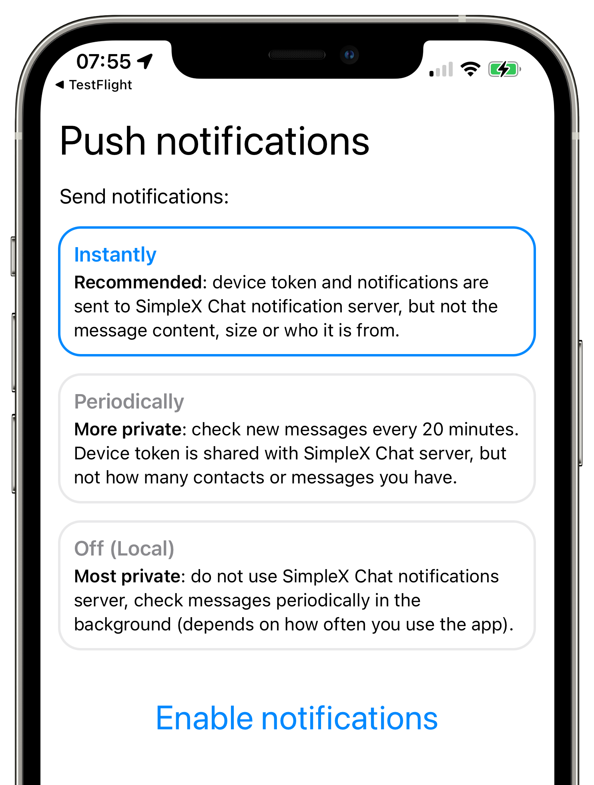

# SimpleX Chat käyttöopas

Ensimmäinen viestintäalusta, jolla ei ole lainkaan käyttäjätunnuksia - suunniteltu täysin yksityiseksi.

## Sisällys

- [Pika-aloitus](#pika-aloitus) - vieritä tätä sivua alaspäin
- [Viestien lähettäminen](./send-messages.md) 
- [Salaiset ryhmät](./secret-groups.md)
- [Keskusteluprofiilit](./chat-profiles.md)
- [Datan hallinta](./managing-data.md)
- [Ääni- & videopuhelut](./audio-video-calls.md)
- [Yksityisyys & turvallisuus](./privacy-security.md)
- [Sovelluksen asetukset](./app-settings.md)

## Pika-aloitus 

### Luo ensimmäinen keskusteluprofiilisi

Ladattuasi SimpleX Chatin linkkien kautta osoitteessa https://simplex.chat:

- Avaa sovellus.
- Luo uusi profiili syöttämällä haluamasi näyttönimi ja koko nimi (valinnainen).
- Napauta "Luo".

Tämä profiili on paikallinen laitteellesi, sitä ei tallenneta minnekään muualle.

### Valitse ilmoitusten tila 

Kun olet luonut keskusteluprofiilin, sovellus kysyy, minkä ilmoitustilan haluat valita.

Lue niiden kuvaus, koska iOS:lla on kyse käytännöllisyyden ja yksityisyyden välisestä kompromissista, jossa välitön ilmoitus jakaa enemmän metatietoja palvelimille, ja Androidilla kyse on ilmoitusten viiveen ja akun keston välisestä kompromissista.

Voit lukea lisää eroista, miten [ilmoitukset toimivat Androidilla ja iOS:lla](../../../../blog/20220404-simplex-chat-instant-notifications.md).

### Ota yhteyttä kehittäjiin

Kun aloitat sovelluksen käytön, voit napauttaa "keskustele kehittäjien kanssa" -painiketta esittääksesi kysymyksiä tai testataksesi sovellusta - lähetä rohkeasti testiviestejä. 

Tämä painike katoaa, kun muodostat ensimmäisen yhteyden. Ottaaksesi kehittäjiin yhteyttä myöhemmin:

- [Avaa sovelluksen asetukset](./app-settings.md#sovelluksen-asetusten-avaaminen).
- Napauta "Lähetä kysymyksiä ja ideoita".

### Liity joihinkin käyttäjäryhmiin

GitHub-sivullamme on linkkejä liittyä useisiin [käyttäjäryhmiin](../../../../README.md#join-user-groups) - liity ryhmiin esittääksesi kysymyksiä ja keskustellaksesi ideoista.

Voit myös löytää joitakin muita käyttäjien ylläpitämiä ryhmiä verkon kautta etsimällä.

Liittyäksesi ryhmään linkin kautta:

- Hanki linkki SimpleX-käyttäjäryhmään, jonka voit saada olemassa olevista SimpleX-keskusteluista tai etsimällä verkosta.
- Napauta painiketta näytön alaoikealla.
- Napauta "Yhdistä linkin / QR-koodin kautta" -painiketta.

### Yhdistä ystäviin

- Pyydä ystäviäsi lataamaan SimpleX Chat -sovellus jostakin näistä linkeistä: https://simplex.chat
- Luo kertakäyttöinen linkki kullekin ystävällesi napauttamalla uusi keskustelu -painiketta (Android: kelluva kynäpainike alaoikeassa kulmassa, iOS: kynäpainike yläoikeassa kulmassa)
- Napauta _Luo kertakutsulinkki_.
- Jaa jokainen linkki eri ystävän kanssa, tai vaihtoehtoisesti anna heidän skannata QR-koodi.
- Voit halutessasi määrittää eri aliaksen jokaista linkkiä varten, jotta tiedät ketä linkki koskee, jos he käyttävät incognito-tilaa. 
- Käyttääkseen linkkiäsi tai QR-koodia, kerro ystävillesi, että he napauttavat uusi keskustelu -painiketta ja sitten "Yhdistä linkin / QR-koodin kautta".
- He voivat joko skannata QR-koodin tai liittää linkin. Jos he avasivat linkin selaimessa, heidän on napautettava "Avaa mobiilisovelluksessa" -painiketta sivulla.

Katso video [verkkosivuiltamme](https://simplex.chat), joka näyttää, miten se toimii.

Voit myös luoda [pitkäaikaisen yhteystieto-osoitteen](./app-settings.md#simplex-yhteystietosi).

### Tutustu sovellukseen

Useimmat sovelluksen asetukset ovat yhteisiä kaikille profiileille, mutta jotkin asetukset ovat profiilikohtaisia.

Lue lisää sivulta [Sovelluksen asetukset](./app-settings.md).

Monia keskustelutoimintoja on käytettävissä pitkällä painalluksella tai pyyhkäisyllä - kokeile niitä!
