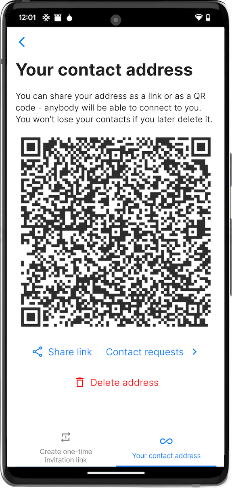
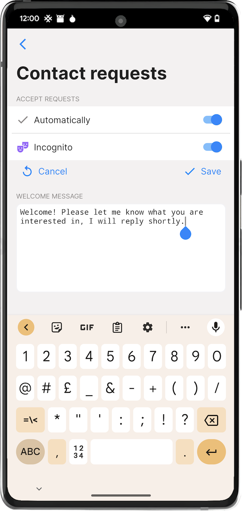
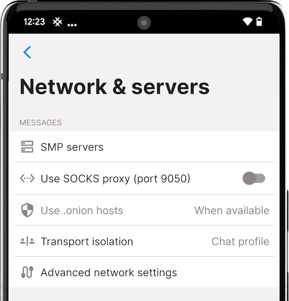
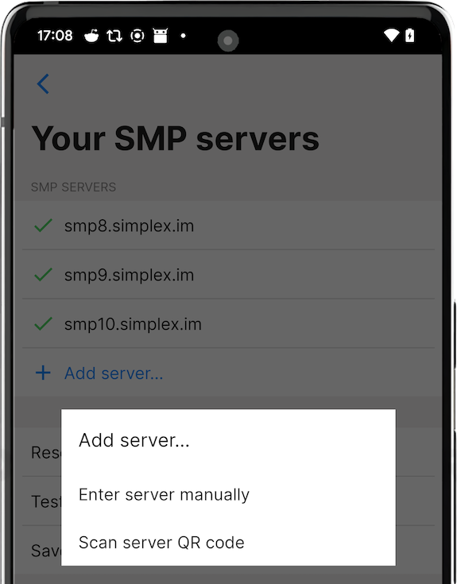
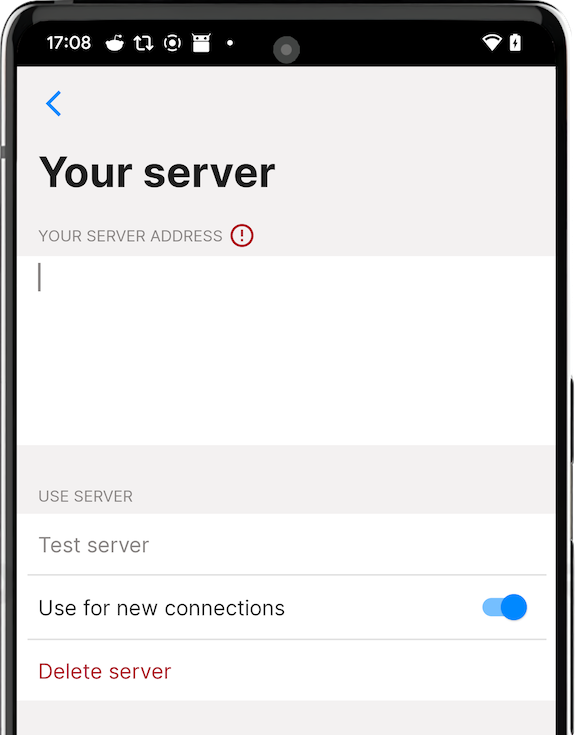
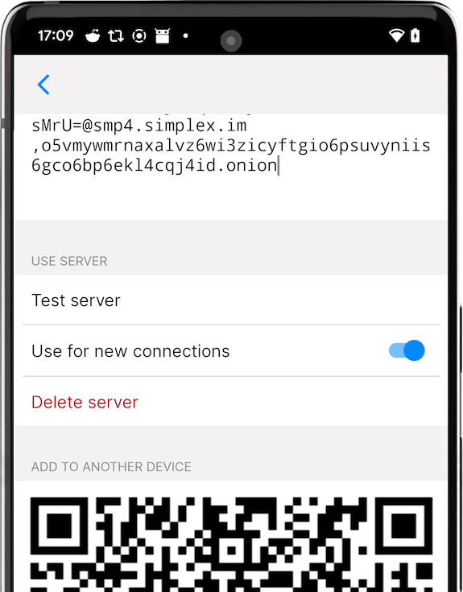
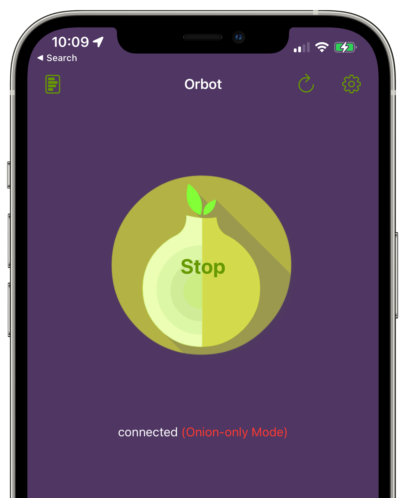
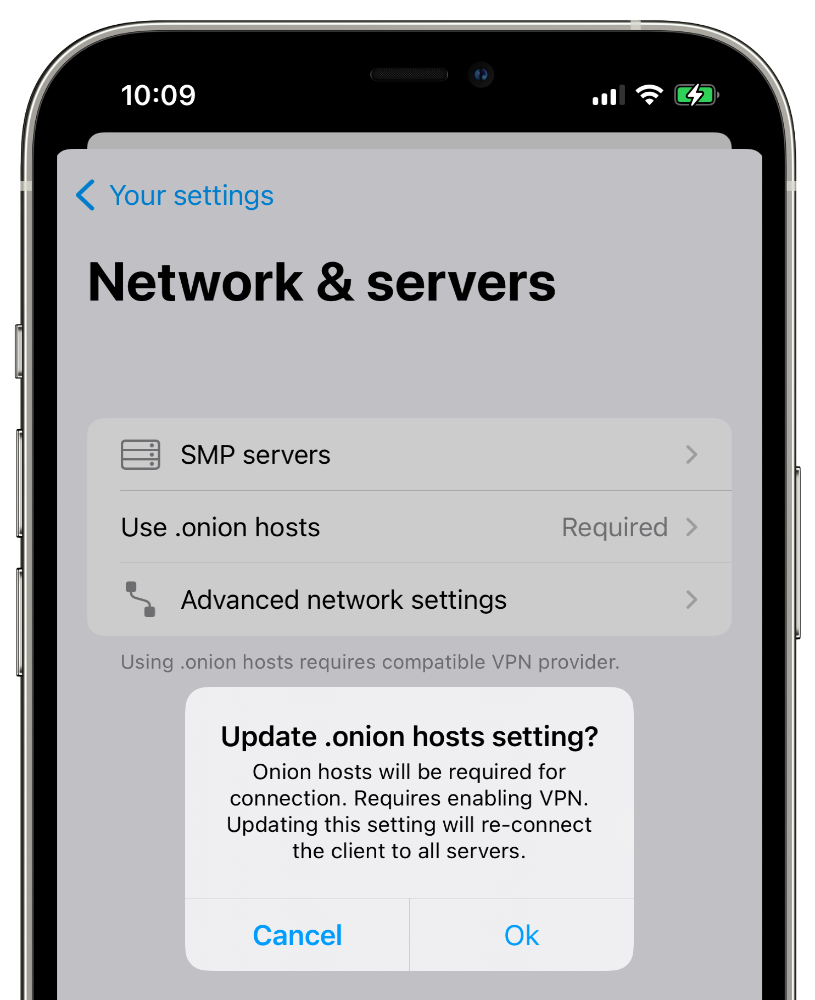
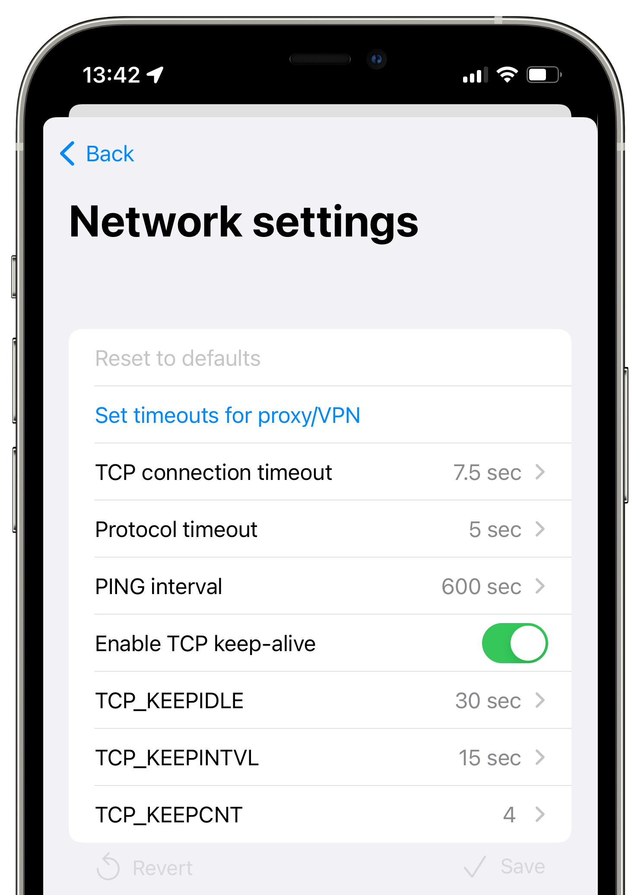
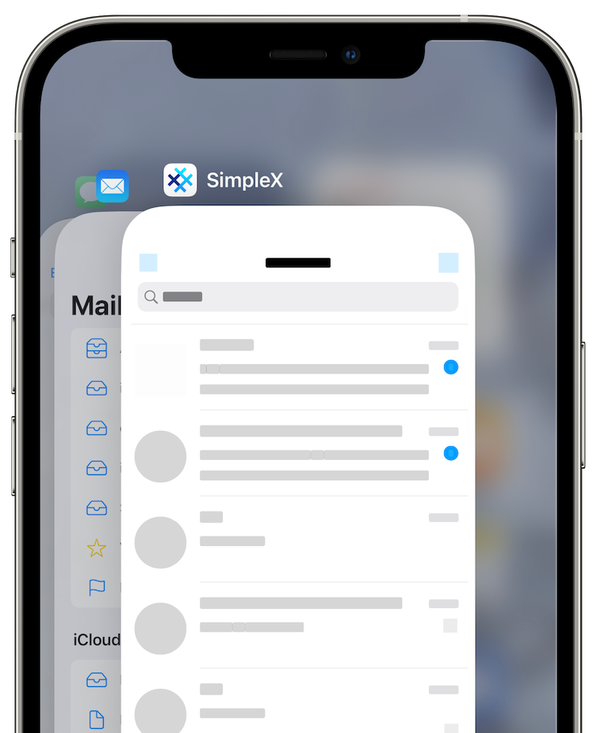

# Sovelluksen asetukset

## Sovelluksen asetusten avaaminen

Avataksesi sovelluksen asetukset:

- Avaa sovellus.
- Napauta käyttäjäprofiilikuvaasi näytön oikeassa ylänurkassa.
- Jos sinulla on useampia profiileja, napauta nykyistä profiilia uudelleen tai valitse Asetukset.

## Omat profiiliasetukset

Tämä osio on nimeltään **"Sinä"** sovelluksen asetuksissa.

### Aktiivinen profiilisi

Napauta avatartasi/nimeäsi päivittääksesi nykyisen profiilin nimet ja kuvan.

Näyttönimessä ei saa olla välilyöntejä ja on suositeltavaa käyttää latinalaisia merkkejä ja numeroita, jotta näiden nimien kirjoittaminen on helpompaa niille käyttäjille, jotka käyttävät [SimpleX Chattia terminaalissa](../../../CLI.md) (CLI).

**Huomautus**: Kun tallennat profiilisi, päivitys lähetetään kaikille kontakteillesi (lukuun ottamatta kontakteja, joiden kanssa olet jakanut incognito-profiilit). Jos sinulla on paljon kontakteja, tämä voi kestää useita sekunteja.

### Keskusteluprofiilisi

Tässä sivulla voit lisätä ja määrittää keskusteluprofiilejasi. Katso lisätietoja kohdasta [Keskusteluprofiilisi](./chat-profiles.md).

### Incognito 

Tämä ominaisuus on ainutlaatuinen SimpleX Chatille – se on riippumaton keskusteluprofiileista.

Kun "Incognito” on käytössä, nykyinen profiilin nimesi ja kuvasi EIVÄT ole jaettuina uusille kontakteillesi. Se mahdollistaa yhteyden muodostamisen muihin ihmisiin ilman jaettuja tietoja – kun muodostat uusia yhteyksiä tai liityt ryhmiin linkin kautta, kullekin kontaktille tai ryhmälle luodaan uusi satunnainen profiilinimi.

Lue lisää [tästä julkaisusta](../../../../blog/20220901-simplex-chat-v3.2-incognito-mode.md#incognito-tila).

### SimpleX-yhteystietosi

 &nbsp;&nbsp; 

Tässä sivulla voit luoda pitkäaikaisen osoitteen, jota muut voivat käyttää yhteyden muodostamiseen kanssasi. Toisin kuin kertakäyttöiset kutsulinkit, näitä osoitteita voi käyttää moneen kertaan, mikä tekee niistä hyviä jakaa verkossa, esim. muilla sosiaalisen median alustoilla.

Kun ihmiset ottavat sinuun yhteyttä tämän osoitteen kautta, saat yhteyspyynnön, jonka voit hyväksyä tai hylätä. Voit määrittää automaattisen yhteyspyyntöjen hyväksynnän ja automaattisen tervetuloviestin, joka lähetetään uusille kontakteille.

Jos alat saada liikaa pyyntöjä tämän osoitteen kautta, sen poistaminen on aina turvallista – kaikki tämän osoitteen kautta luodut yhteydet pysyvät aktiivisina, koska tätä osoitetta ei käytetä viestien toimittamiseen.

Lue lisää [tästä julkaisusta](../../../../blog/20221108-simplex-chat-v4.2-security-audit-new-website.md#auto-accept-contact-requests).

### Keskusteluasetukset

Tässä sivulla voit määrittää keskusteluasetukset, jotka koskevat kaikkia kontakteja - niitä voi muuttaa erikseen jokaiselle kontaktille:

- _katoavat viestit_ - salliaksesi katoavat viestit keskusteluissa kanssasi, vain jos kontaktisi sallivat ne.
- _poista kaikilta_ - salliaksesi peruuttamattoman viestien poiston (oletusarvoisesti viestit vain merkitään poistetuiksi, ei kokonaan poisteta). "Kyllä"-asetus sallii sen vain, jos he sallivat sen sinulle, ja "Aina" - silloinkin kun eivät salli.  
- _ääniviestit_ - salliaksesi ääniviestien lähettämisen.

Asettaaksesi keskusteluasetukset jokaiselle kontaktille, napauta keskustelun yläreunassa olevaa kontaktin nimeä ja valitse sitten "Kontaktin asetukset".

Ryhmän omistajat voivat asettaa vastaavia asetuksia ryhmilleen, kun ryhmä luodaan tai myöhemmin: napauta keskustelun yläreunassa olevaa ryhmän nimeä ja valitse sitten "Ryhmän asetukset".

## Omat sovellusasetukset

Tämä osio on nimeltään **"Asetukset"** sovelluksen asetuksissa.

### Ilmoitukset

Tässä sivulla voit määrittää ilmoitusten tilan: välitön, säännöllinen tai vain kun sovellus on käynnissä. Näiden asetusten toiminnassa on joitain eroja iOS:llä ja Androidilla. Lue lisää [tästä julkaisusta](../../../../blog/20220404-simplex-chat-instant-notifications.md) siitä, miten ilmoitukset toimivat.

Voit myös määrittää, näytetäänkö viestin esikatselu, kun viesti saapuu.

**Huomautus**: Jotta välitön ja säännöllinen ilmoitukset toimisivat Androidilla, sinun on poistettava virransäästö käytöstä, kun sovellus kehottaa siihen, tai myöhemmin asetusten kautta. Myös joissakin Android-järjestelmissä vaaditaan lisäasetuksia, esimerkiksi Xiaomin puhelimissa MIUI-järjestelmä vaatii "Automaattisen käynnistyksen" ottamista käyttöön sovellukselle, jotta ilmoituspalvelu toimisi. Lue [Don't kill my app](https://dontkillmyapp.com/) -opas mahdollisista laitteesi vaatimista asetuksista.

Myös välitön ilmoitus kuluttaa toistaiseksi eniten akkua - pyrimme vähentämään sitä, jotta se olisi vähemmän tai yhtä paljon kuin säännöllisissä ilmoituksissa.

### Verkko ja palvelimet

Tässä sivulla voit määrittää omia SMP-relejä ja muuttaa muita verkkoasetuksia. 

 

#### SMP-palvelimet

 &nbsp;&nbsp;  &nbsp;&nbsp; 

Oletusarvoisesti sovelluksessa on esimääritetyt releet - voit vaihtaa ne omiksesi.

Tämä sivu mahdollistaa myös yhteyden testaamisen palvelimiin.

Lue lisää [tästä julkaisusta](../../../../blog/20221206-simplex-chat-v4.3-voice-messages.md#smp-palvelinten-määrittäminen-ja-salasana).

#### Käytä SOCKS-välityspalvelinta (vain Android)

Tämä asetus saa sovelluksen muodostamaan yhteydet SOCKS-välityspalvelimen kautta, jonka jokin toinen sovellus tarjoaa laitteellasi. 

Tyypillisin käyttötarkoitus tälle on Orbot-sovelluksen käyttäminen, joka tarjoaa SOCKS-välityspalvelimen Tor-verkon käyttöön, mutta se voi olla jokin muukin sovellus ja se voi välittää yhteydet jonkin toisen päällysverkon kautta.

#### Käytä .onion-isäntiä 

##### Android

**.onion-isäntien käyttö** -vaihtoehto on käytettävissä vain, kun **Käytä SOCKS-välityspalvelinta** on käytössä. Voit valita:

- _ei_: älä koskaan käytä .onion-isäntiä. Valitse tämä vaihtoehto, jos SOCKS-välityspalvelimesi ei yhdistä Tor-verkon kautta.
- _kun saatavilla_ (oletusarvoisesti): kun SOCKS-välityspalvelin on käytössä, sovellus olettaa sen tarjoavan yhteydet Tor-verkon kautta ja käyttää .onion-isäntien osoitteita, kun SMP-releet sisällyttävät ne kokoonpanoonsa.
- _vaaditaan_: käytä aina .onion-isäntiä. Valitse tämä vaihtoehto, jos SOCKS-välityspalvelimesi yhdistää Tor-verkon kautta ja haluat välttää yhteydet ilman Tor-verkkoa. Tässä tapauksessa yhteys epäonnistuu, jos SMP-releen osoite ei sisällä .onion-isäntää.

##### iOS

 &nbsp; 

Vaikka iOS ei tue SOCKS-välityspalvelimia, voit asentaa Orbot-sovelluksen, joka toimii VPN-palveluntarjoajana. Voit valita:

- _ei_ (oletus): älä käytä .onion-isäntiä. Valitse tämä vaihtoehto, jos et käytä Orbotia tai jos käytät VPN:ää, joka välittää yhteydet jonkin muun päällysverkon kautta.
- _kun saatavilla_: käytä .onion-isäntien osoitteita, kun SMP-releet sisällyttävät ne kokoonpanoonsa. Orbot VPN:n on oltava käytössä, jotta tämä vaihtoehto toimii.
- _vaaditaan_: käytä aina .onion-isäntiä. Valitse tämä vaihtoehto, jos käytät Orbot VPN:ää ja haluat välttää yhteydet ilman Tor-verkkoa. Tässä tapauksessa yhteys epäonnistuu, jos SMP-releen osoite ei sisällä .onion-isäntää. Jos käytät tätä vaihtoehtoa, voit ottaa käyttöön "Disable Orbot for non-onion traffic" -vaihtoehdon Orbotin asetuksissa, jolloin laitteesi muu liikenne ei käytä Tor-verkkoa. 

**Huomautus** VPN iOS:lla voi lähettää jotain liikennettä tavalliseen verkkoon, jos esimerkiksi VPN-sovellus kaatuu. Voit määrittää aina päällä olevan VPN-tilan hallituille iOS-laitteille, mutta tämä ei sovellu useimpiin yksittäisiin laitteisiin.

#### Kuljetuksen eristystila (BETA)

Tämä asetus on käytettävissä vain, jos olet ottanut käyttöön kehittäjätyökalut.

Lue yksityiskohdat [tästä julkaisusta](../../../../blog/20230204-simplex-chat-v4-5-user-chat-profiles.md#kuljetuksen-eristystila). 

#### Lisäverkkoasetukset

Jos verkkoyhteytesi on hidas ja yhteydet palvelimiin epäonnistuvat jatkuvasti (näet pyörivän kiekon kontaktien kohdalla), lisää TCP- ja protokollan aikakatkaisuja tällä sivulla.

### Yksityisyys ja turvallisuus

#### SimpleX Lock 

Kun SimpleX Lock on käytössä, laitteen todentaminen vaaditaan, kun avaat sovelluksen tai käytät joitakin turvallisuuteen tai yksityisyyteen liittyviä ominaisuuksia.

Sinua tarjotaan ottamaan se käyttöön muutaman sovelluksen avaamisen jälkeen.

Ottaaksesi sen käyttöön myöhemmin:

- [Avaa sovelluksen asetukset](#sovelluksen-asetusten-avaaminen).
- Napauta "Yksityisyys ja turvallisuus".
- Ota "SimpleX Lock" liukukytkimellä käyttöön.  
- Vahvista puhelimesi tunnistetiedot.

Valmista! Nyt sinun on todennuttava, kun käynnistät sovelluksen tai jatkat sen käyttöä 30 sekunnin tauon jälkeen.

#### Suojaa sovellusnäyttö

 

Tämä asetus piilottaa sovellusnäytön viimeaikaisista sovelluksista - se on oletusarvoisesti käytössä. Androidilla se estää myös kuvakaappaukset.

#### Hyväksy kuvat automaattisesti

Kuvien automaattinen hyväksyntä voi heikentää yksityisyyttä – kontaktisi tietävät, että olet online-tilassa.

- [Avaa sovelluksen asetukset](#sovelluksen-asetusten-avaaminen).
- Napauta "Yksityisyys ja turvallisuus".
- Ota "Hyväksy kuvat automaattisesti" käyttöön.

#### Lähetä linkkien esikatselut 

Linkkien esikatselujen lähettämisen salliminen voi heikentää yksityisyyttä – sovelluksesi lataa esikatselun verkkosivulta.

- [Avaa sovelluksen asetukset](#sovelluksen-asetusten-avaaminen). 
- Napauta "Yksityisyys ja turvallisuus".
- Ota "Lähetä linkkien esikatselut" käyttöön.

#### SimpleX-linkit

Tämä asetus vaikuttaa siihen, miten linkit muiden SimpleX-käyttäjien yhdistämiseen tai ryhmiin liittymiseen näytetään keskusteluissa. Voit valita:

- _kuvaus_ (oletus): näytetään vain linkin kuvaus ja palvelimen isäntänimi. Linkkiä ei avata selaimessa.
- _täysi linkki_: näytetään koko linkki. Linkkiä ei silti avata selaimessa. 
- _selaimella_: näytetään koko linkki ja se avataan selaimessa. Tässä tapauksessa linkki näytetään punaisena, jos sen verkkotunnus on eri kuin simplex.chat, koska se saattaa olla haitallinen.

Lue lisää SimpleX-linkkien turvallisuudesta [tästä julkaisusta](../../../../blog/20221206-simplex-chat-v4.3-voice-messages.md#privacy-and-security-of-simplex-invitation-links).

### Ulkoasu

Tällä sivulla voit määrittää:

- käyttöliittymän kielen
- sovelluksen kuvakkeen
- korostusvärin

### Tietokannan tunnuslause & vienti

Tässä sivulla voit vaihtaa tietokannan tunnuslausetta, viedä ja tuoda tietokannan sekä määrittää viestien säilytysajan.

Lue lisää kohdasta [Oman datan hallinta](./managing-data.md).

## Ohje & palaute 

Tässä osiossa on tietoa sovelluksen käytöstä sekä linkit tiimin yhteystietoihin. Käytä [Lähetä kysymyksiä ja ideoita](https://simplex.chat/contact#/?v=1&smp=smp%3A%2F%2FPQUV2eL0t7OStZOoAsPEV2QYWt4-xilbakvGUGOItUo%3D%40smp6.simplex.im%2FK1rslx-m5bpXVIdMZg9NLUZ_8JBm8xTt%23%2F%3Fv%3D1%26dh%3DMCowBQYDK2VuAyEALDeVe-sG8mRY22LsXlPgiwTNs9dbiLrNuA7f3ZMAJ2w%253D%26srv%3Dbylepyau3ty4czmn77q4fglvperknl4bi2eb2fdy2bh4jxtf32kf73yd.onion) yhteydenottoon meihin chatin kautta esittääksesi kysymyksiä, tehdäksesi ehdotuksia ja ilmoittaaksesi ongelmista.

## Tue SimpleX Chattia

- osallistu - linkki tietoihin siitä, miten voit osallistua projektiin ja tukea sitä.
- arvioi sovellus - arvioi ja kirjoita arvostelu App Storessa tai Play Storessa - palautteesi auttaa paljon.
- tähtimerkintä GitHubissa - myös se auttaa meitä kasvussa.

Kiitos tuestasi!

## Kehittäjätyökalut

Tällä sivulla on vaihtoehtoja, joita tavallisesti tarvitsevat vain sovelluskehittäjät ja joita voidaan käyttää sovelluksen vianetsintään, jos jokin ei toimi.

### Chat-konsoli

Täällä voit nähdä ja käyttää konsolikomentoja chatin ytimessä. Mitään tätä tietoa ei lähetetä verkon yli, tämä on sovelluksen eri osien välistä sisäistä kommunikointia.

Ole varovainen - jotkin komennot voivat häiritä sovelluksen toimintaa, käytä niitä vain, jos tiedät mitä olet tekemässä tai jos tiimi on neuvonut sinua.

**Huomautus**: Konsolissa voi näkyä virheiltä vaikuttavia asioita. Ellei sovelluksen käyttöliittymässä ilmene ongelmia, näitä virheitä ei pidä pitää sovelluksen virhetoimintoina - ne ovat todennäköisesti normaalia ja odotettua toimintaa.

### Vahvista tietokannan päivitykset 

Tämä asetus on oletusarvoisesti pois päältä - sovelluksen tietokanta päivittyy uuteen versioon ilman vahvistuksia. Versiosta 4.6.2 lähtien nämä siirrot ovat kumottavissa - voit palata edelliseen versioon (ei aiempaan kuin 4.6.1). Jos haluat vahvistuksen aina tietokannan päivityksen yhteydessä, voit ottaa tämän asetuksen käyttöön - sitä ei suositella, koska se tapahtuu melkein joka päivityksessä eikä sen pitäisi aiheuttaa huolta.

### Näytä kehittäjäasetukset 

Tämä asetus mahdollistaa tällä hetkellä [Kuljetuksen eristystilan](#kuljetuksen-eristystila-beta) asetuksen ja myös mahdollistaa tietokantatunnusten näyttämisen kontakteissa, ryhmissä ja ryhmän jäsenissä konsolikomentojen vianetsinnän helpottamiseksi.
