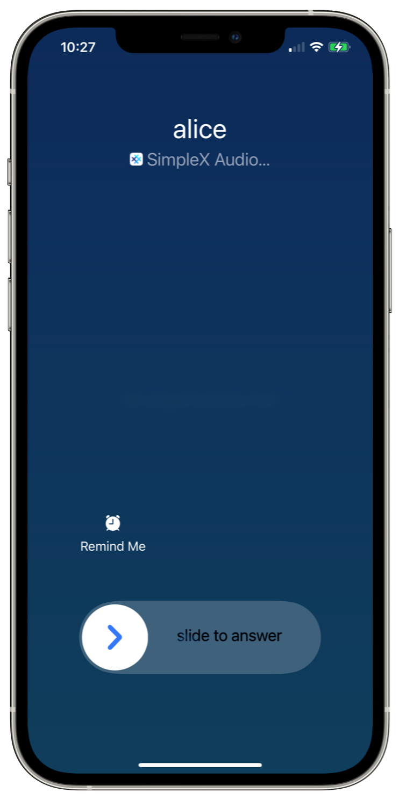
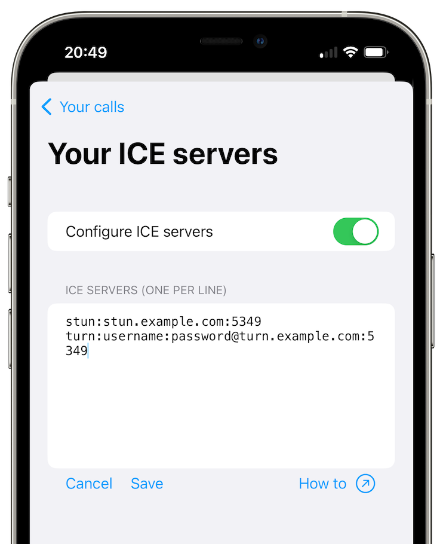

# Ääni- ja videopuhelut

SimpleX Chat mahdollistaa päästä päähän -salatut ääni- ja videopuhelut kontaktiesi kanssa WebRTC:n avulla. Huomautus: ryhmäpuhelut eivät ole tuettuja tällä hetkellä.

## Puheluiden soittaminen ja vastaanottaminen 

### Kuinka soitetaan äänipuhelu

1. Napauta kontaktia.
2. Napauta puhelinikonia kontaktin nimen vieressä näytön yläreunassa.

### Kuinka soitetaan videopuhelu

1. Napauta kontaktia. 
2. Napauta kolmea pystypistettä näytön oikeassa ylänurkassa päästäksesi lisäasetuksiin.
3. Valitse **Videopuhelu**.

### Puheluiden vastaanottaminen

Kun saapuva puhelu tulee, sinulla on kolme vaihtoehtoa:

- hyväksy: yhdistää puhelun
- hylkää: hylkää puhelu ILMAN, että soittajalle ilmoitetaan
- ohita: hylkää puhelu väliaikaisesti, mutta tavalla, jolla se voidaan hyväksyä myöhemmin, jos soittaja odottaa yhä, **Hyväksy puhelu** -viestin kautta keskustelussa tämän kontaktin kanssa.

Kutsun voimassaoloaikaa ei ole rajoitettu - niin kauan kuin soittaja odottaa, voit hyväksyä puhelun milloin tahansa myöhemmin.

Puhelun voi vastaanottaa lukitusnäytöltä, sekä Androidilla (se on otettava käyttöön asetuksista) että iOS:lla (oletusarvoisesti käyttäen iOS:n puhelurajapintaa, joka voidaan poistaa käytöstä).

### Puhelut lukitusnäytöllä Androidilla 

SimpleX Chat näyttää oletusarvoisesti saapuvan puhelun laitteesi lukitusnäytöllä. Voit kuitenkin muuttaa tätä käyttäytymistä sovelluksen asetusvalikossa.

1. Avaa sovelluksen asetusvalikko.
2. Napauta **Ääni- ja videopuhelut**.
3. Valitse **Puhelut lukitusnäytöllä** -pudotusvalikosta seuraavista kolmesta vaihtoehdosta:
   - Poista käytöstä - puhelu näkyy ilmoituksena.
   - Näytä - puhelu näkyy lukitusnäytöllä, sinun on avattava laite ja sovellus voidaksesi vastata siihen.
   - Hyväksy - puheluun voi vastata ja hylätä suoraan lukitusnäytöltä avaamatta sovellusta. 

**Huomautus**: jotkin Android-järjestelmät/laitteet kieltävät koko näytön näkymät lukitusnäytöllä - tässä tapauksessa puhelu näkyy tavallisena ilmoituksena.

### Puhelut lukitusnäytöllä iOS:lla 

Oletusarvoisesti SimpleX Chat käyttää iOS:n puhelurajapintaa, mikäli mahdollista, näyttääkseen saapuvat puhelut lukitusnäytöllä. Voit poistaa sen käytöstä:

1. Avaa sovelluksen asetusvalikko.
2. Napauta **Ääni- ja videopuhelut**.
3. Kytke **Käytä iOS:n puhelinkäyttöliittymää** -kytkin pois päältä. 

**Huomautus**: iOS:n puhelinkäyttöliittymä mahdollistaa puheluiden vastaanottamisen laitetta avaamatta. Jos tämä ei ole toivottavaa, poista se käytöstä - tässä tapauksessa puhelut näkyvät ilmoituksina.

Lue lisää [tästä julkaisusta](../../../../blog/20230328-simplex-chat-v4-6-hidden-profiles.md#improved-audiovideo-calls).

## Puhelujen lisäasetukset

### WebRTC ICE -palvelimet

SimpleX Chat käyttää oletusarvoisesti esimääritettyä relepalvelinta piilottaakseen IP-osoitteesi kontakteilta, mutta se voi myös tarkkailla puhelujesi kestoa. Jos et halua sitä, voit määrittää ja käyttää omia isännöimiäsi WebRTC-relepalvelimia puhelujesi hallitsemiseksi.

1. Avaa sovelluksen asetusvalikko.
2. Napauta **Ääni- ja videopuhelut**.
3. Napauta **WebRTC ICE -palvelimet**.
4. Ota **Määritä ICE-palvelimet** käyttöön.
5. Syötä ICE-palvelimiesi osoitteet (yksi per rivi).
6. Napauta **Tallenna**.

**Huomautus**: toisin kuin viestinvälityspalvelimet (SMP-palvelimet), WebRTC ICE -palvelimien määritys tallennetaan nykyiseen laitteeseen, ei keskustelutietokantaan. Jos siirrät keskustelutietokannan toiseen laitteeseen, sinun on päivitettävä tämä määritys.

### Käytä aina välityspalvelinta 

SimpleX Chatissa ääni- ja videopuhelut reititetään oletusarvoisesti TURN-välityspalvelimen kautta. Voit halutessasi poistaa tämän käytöstä ja käyttää vertaisverkkoa (P2P) sen sijaan, kun verkkosi tukee sitä. Tällöin kuitenkin IP-osoitteesi on kontaktien tiedossa.

1. Avaa sovelluksen asetusvalikko.
2. Napauta **Ääni- ja videopuhelut**.
3. Ota **Käytä aina välityspalvelinta** käyttöön välityspalvelimen käyttämiseksi tai poista se käytöstä P2P:tä varten. 

**Huomautus**: tämän asetuksen poistaminen käytöstä sallii P2P-puhelut, mutta se ei kiellä TURN-välityspalvelujen käyttöä - jos verkkoyhteytesi estää P2P-yhteydet, puhelu käyttää silti välityspalvelimia, jos ne ovat käytettävissä. Kieltääksesi välityspalvelimien käytön, sinun on muutettava WebRTC ICE -palvelinmääritys sisältämään vain STUN-palvelimia, esimerkiksi: