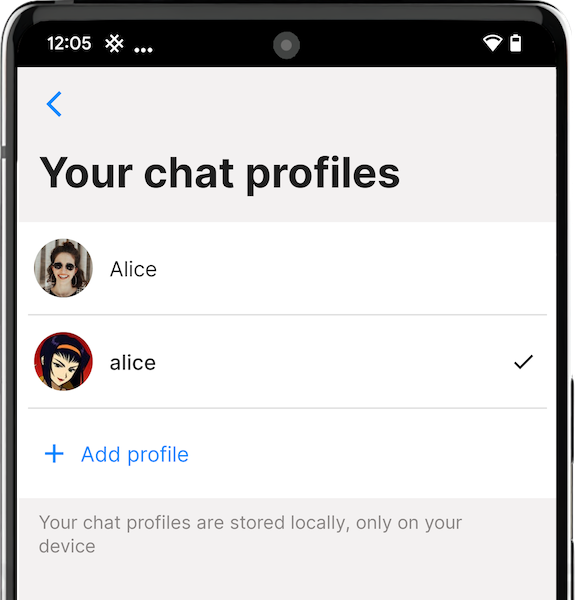
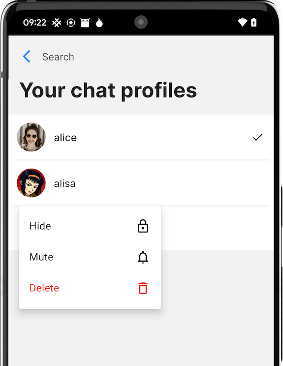
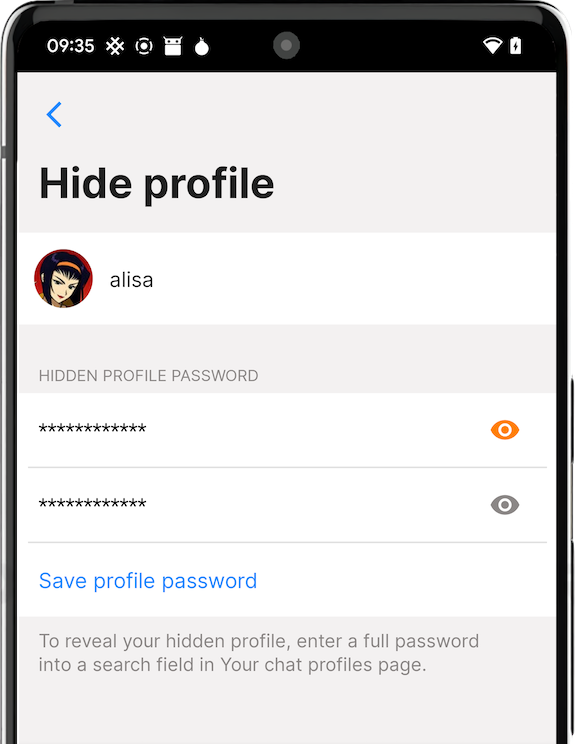
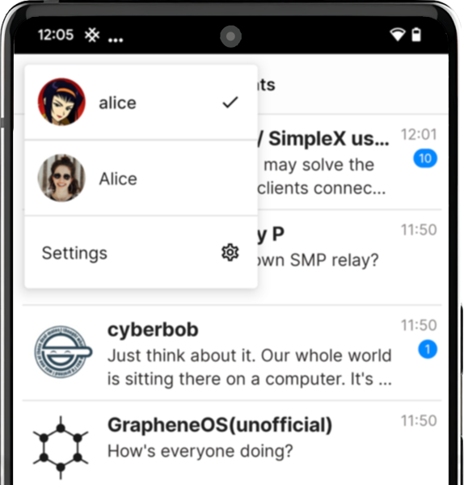
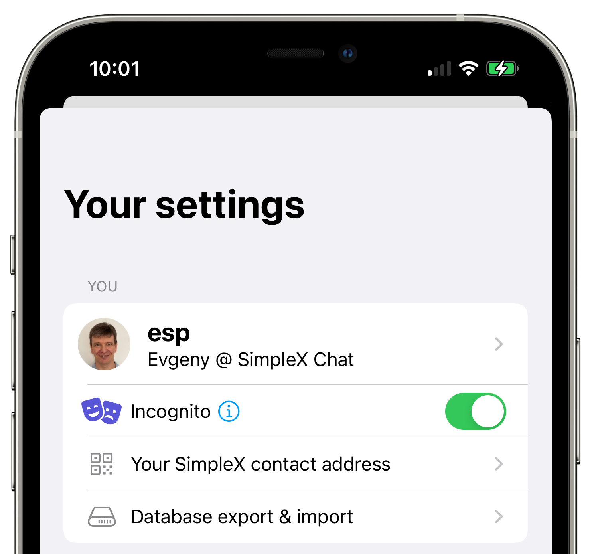
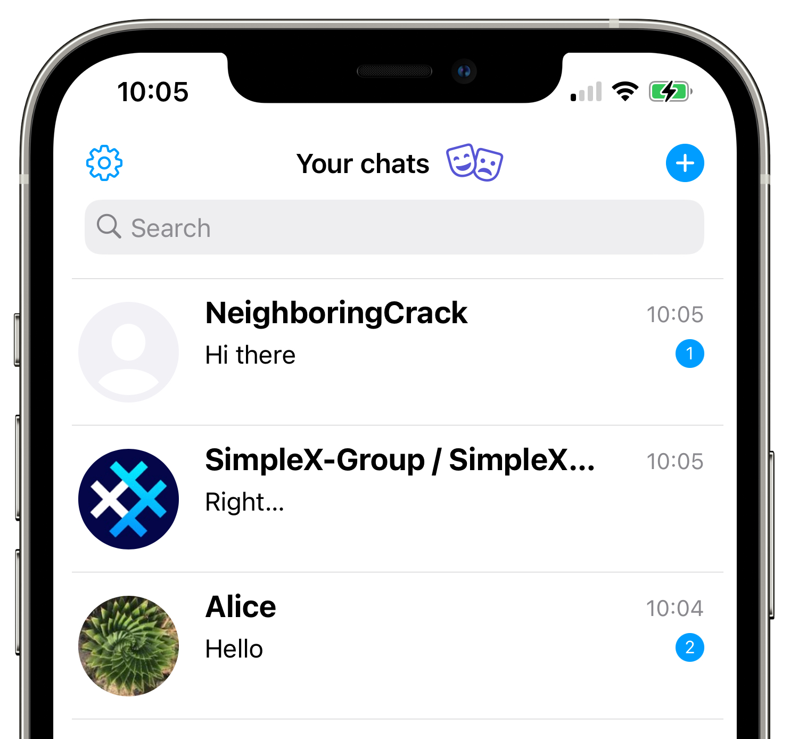
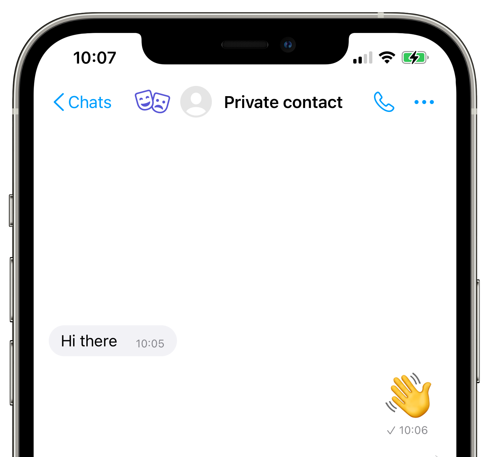

# Keskusteluprofiilisi

## Lisäkeskusteluprofiilien luominen

SimpleX Chat mahdollistaa niin monta keskusteluprofiilia kuin haluat luoda. Samoin kuin ensimmäinen profiili, ne tallennetaan vain paikallisesti laitteeseesi.

Luodaksesi lisä-SimpleX Chat -profiilin:

- [Avaa sovelluksen asetukset](./app-settings.md#sovelluksen-asetusten-avaaminen).
- Valitse "Keskusteluprofiilisi".
- Avaa asetus sormenjäljellä tai PIN-koodilla.  
- Napauta "+ Lisää profiili" -painiketta.
- Luo uusi profiili syöttämällä haluamasi näyttönimi ja koko nimi (valinnainen).
- Napauta "Luo".

## Keskusteluprofiilien piilottaminen ja mykistäminen

Versiossa 4.6 lisättiin mahdollisuus mykistää ja piilottaa keskusteluprofiileja.

 &nbsp;&nbsp;  &nbsp;&nbsp; 

Nämä toiminnot ovat käytettävissä pitkään painamalla (Android) tai pyyhkäisemällä (iOS) profiilia listassa.

Paljastaaksesi piilotetun profiilin, syötä koko salasana hakukenttään **Keskusteluprofiilisi** -sivulla. 

## Profiilien välillä vaihtaminen

- Napauta käyttäjäprofiilikuvaasi näytön oikeassa ylänurkassa.
- Valitse profiili, jota haluat käyttää.

Voit vaihtaa profiilia myös Keskusteluprofiilisi-asetusten kautta.

## Incognito-tila

  

Tämä ominaisuus on ainutlaatuinen SimpleX Chatille – se on riippumaton keskusteluprofiileista.

Kun "Incognito-tila" on käytössä, nykyinen profiilin nimesi ja kuvasi eivät ole näkyvillä uusille kontakteillesi. Se mahdollistaa nimettömät yhteydet muihin ihmisiin ilman jaettuja tietoja – kun luot uusia yhteyksiä tai liityt ryhmiin linkin kautta, kullekin kontaktille tai ryhmälle luodaan uusi satunnainen profiilinimi.

Ottaaksesi incognito-tilan käyttöön/pois käytöstä:

- [Avaa sovelluksen asetukset](./app-settings.md#sovelluksen-asetusten-avaaminen).
- Kytke incognito-tila päälle/pois päältä napauttamalla kytkintä kohdassa "Incognito".

Lue lisää [tästä julkaisusta](../../../../blog/20220901-simplex-chat-v3.2-incognito-mode.md#incognito-mode).

## Muokkaa profiiliasi

Muokataksesi profiiliasi:

- [Avaa sovelluksen asetukset](./app-settings.md#sovelluksen-asetusten-avaaminen).
- Valitse profiilisi.
- Napauta "Muokkaa".
- Syötä haluamasi profiilinimi ja/tai päivitä koko nimesi.  
- Voit myös asettaa ja vaihtaa profiilikuvan.
- Napauta "Tallenna ja ilmoita kontakteille".

## Siirrä keskusteluprofiilisi toiseen laitteeseen

SimpleX Chat tallentaa kaikki käyttäjätiedot vain asiakaslaitteisiin käyttäen siirrettävää salattua tietokantaformaattia, joka voidaan viedä ja siirtää mihin tahansa tuettuun laitteeseen.

Vie SimpleX Chat -tietosi:

- [Avaa sovelluksen asetukset](./app-settings.md#sovelluksen-asetusten-avaaminen).
- Valitse "Tietokannan tunnuslause & vienti".
- Pysäytä keskustelu kytkemällä "Keskustelu käynnissä" (napauta "Pysäytä" vahvistusikkunassa).  
- Vahvista sormenjäljellä tai PIN-koodilla, jos olet ottanut käyttöön [SimpleX Lockin](./app-settings.md#simplex-lock).
- Jos et ole asettanut sitä aiemmin, [aseta tunnuslause](./managing-data.md#tietokannan-tunnuslause) kohdassa "Tietokannan tunnuslause". Aluksi tietokanta on salattu satunnaisella tunnuslauseella, joka tallennetaan KeyChainiin (iOS) tai KeyStoreen (Android).
- Napauta "Vie tietokanta" - vienti ei onnistu, ellet ole asettanut tunnuslausetta.
- Tallenna tiedosto laitteeseesi tai jaa se käytettävissä olevalla tavalla.

Tuodaksesi SimpleX Chat -tietosi sovellukseen toisessa laitteessa:

- Siirrä tietokantatiedosto uuteen laitteeseen.
- Asenna SimpleX Chat -sovellus.
- Luo keskusteluprofiili millä tahansa nimellä noudattamalla ohjeita kohdassa [Luo ensimmäinen keskusteluprofiilisi](#create-your-first-chat-profile) - korvaat sen pian.
- Avaa sovelluksen asetukset.
- Valitse "Tietokannan tunnuslause & vienti".
- Pysäytä keskustelu napauttamalla "Keskustelu käynnissä" -kytkintä. 
- Napauta "Tuo tietokanta".
- Valitse viedyn keskusteludatan .zip-tiedosto.
- Napauta "Tuo" vahvistusikkunassa.
- Käynnistä keskustelu kytkimellä tai sulje ja käynnistä sovellus uudelleen – sinua pyydetään syöttämään keskustelutietokantasi tunnuslause.

**Huomautus**:

1. Tällä hetkellä vain koko tietokanta, joka sisältää kaikki profiilit, voidaan siirtää. Yksittäisten profiilien siirtäminen ei ole mahdollista.

2. Älä käytä vietyä tietokantaa useammalla laitteella samaan aikaan, sillä se voi häiritä joitakin yhteyksiä. Sinun on aina käytettävä keskustelutietokannan uusinta versiota - vanhan version käyttö todennäköisesti häiritsee yhteyksiäsi. 

3. Kadonnutta tunnuslausetta ei voi palauttaa - muista säilyttää se turvallisesti.