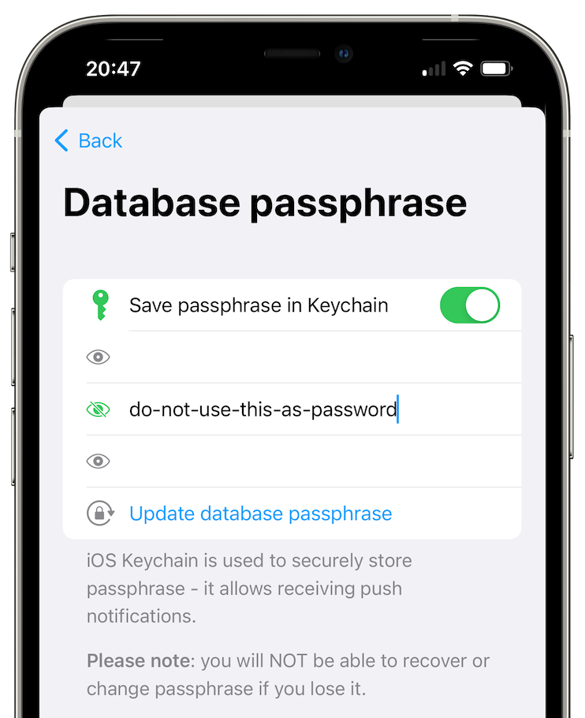
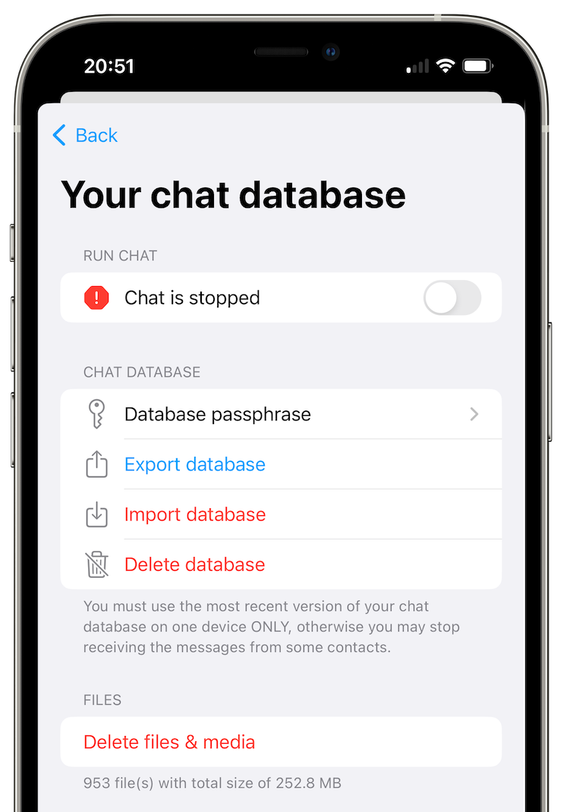

# Oman datan hallinta

## Viestien automaattinen poistaminen

Tässä voit valita viestien poistamisen paikallisesta keskustelutietokannasta tietyn ajan kuluttua.

**Huomautus**: Tämä vaihtoehto ei poista viestejä muilta käyttäjiltä, vain sinulta. Tämä asetus määritellään itsenäisesti jokaiselle keskusteluprofiilille.

## Keskustelutietokanta

Avataksesi keskustelutietokannan asetukset:

- [Avaa sovelluksen asetukset](./app-settings.md#sovelluksen-asetusten-avaaminen).
- Paina "Tietokannan tunnuslause & vienti" -nappia. 

### Tietokannan tunnuslause

Oletusarvoisesti tietokannan tunnuslause on satunnainen, sen on asetettava manuaalisesti voidaksesi viedä sen.

### Sovelluksen datan varmuuskopiointi 

Tässä voit sallia järjestelmän varmuuskopioida sovelluksen datan, jos se on määritetty. Tietokannan tunnuslause on asetettava voidaksesi käyttää tätä.

### Vie tietokanta

Tässä voit viedä keskustelutietokannan tiedostoon.

### Tuo tietokanta 

Tässä voit tuoda keskustelutietokannan tiedostosta.

### Poista tietokanta

Tässä voit poistaa keskustelutietokantasi. VAROITUS: Johtaa kaikkien SimpleX Chat -tietojesi menetykseen! Ellei keskustelutietokantaa ole juuri viety.

## Poista tiedostot ja media

Voit poistaa kaikki lähetetyt ja vastaanotetut sovellukseen tallennetut tiedostot ja median tällä asetuksella poistamatta viestejä.
