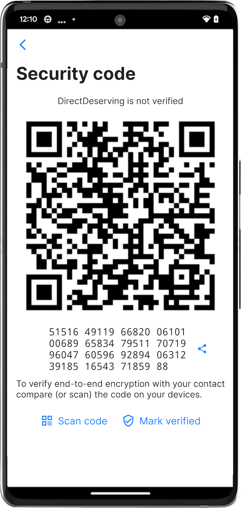
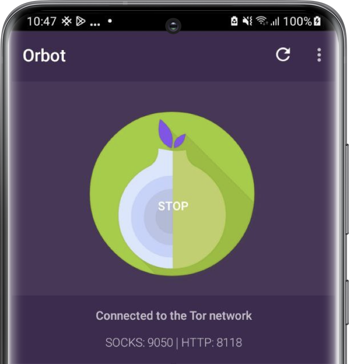
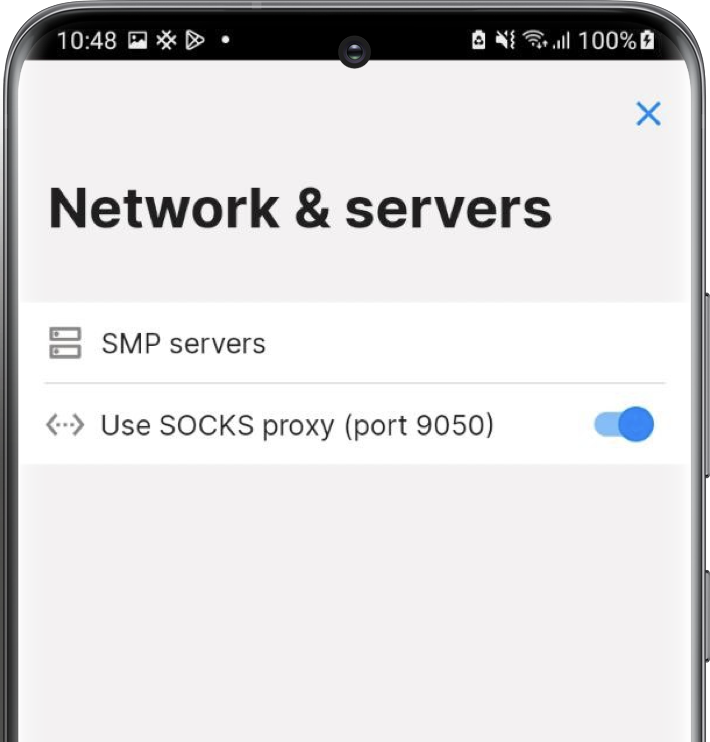

# Yksityisyys ja turvallisuus

SimpleX Chatin oletuskokoonpano pyrkii tasapainottamaan yksityisyyden, turvallisuuden ja helppokäyttöisyyden. Haluat ehkä muuttaa oletusasetuksia.

Tässä sivulla luetellaan kaikki ominaisuudet ja asetukset, jotka vaikuttavat yksityisyyteen ja turvallisuuteen.

## Yksityisyys- ja turvallisuusasetukset

Nämä asetukset ovat käytettävissä [Yksityisyys & Turvallisuus -asetuksissa](./app-settings.md#yksityisyys-ja-turvallisuus).

## Turvakoodin tarkistaminen

Vaikka SimpleX Chat muodostaa yhteyden aina riippumattoman kanavan kautta jaetun linkin avulla, mikä on jo suojattua muihin sovelluksiin verrattuna, on skenaarioita, joissa kutsulinkkejä voidaan korvata siirron aikana (MITM-hyökkäys). Suojautuaksesi tällaisilta hyökkäyksiltä sinun tulisi tarkistaa turvakoodi kontaktien kanssa:

- avaa keskustelu kontaktin kanssa
- napauta kontaktin nimeä keskustelun yläreunassa
- napauta "Tarkista turvakoodi"
- pyydä kontaktiasi tekemään sama
- yhteys on turvallinen, jos sinulla ja kontaktillasi on sama turvakoodi

Tämä voidaan vahvistaa jollakin seuraavista tavoista:

- toinen voi skannata turvakoodin laitteeltaan, jos koodit täsmäävät, kontakti merkitään vahvistetuksi laitteella, joka skannasi koodin
- napauta vain "merkitse vahvistetuksi", jos luotat kontaktin vahvistukseen koodin tarkistuksesta
- voit myös lukea koodin ääneen puhelussa.

Lue lisää [tästä julkaisusta](../../../../blog/20230103-simplex-chat-v4.4-disappearing-messages.md#connection-security-verification)

## Tietokannan tunnuslause

Asennettaessa sovellus luo satunnaisen tunnuslauseen keskustelutietokannalle ja tallentaa sen turvallisesti KeyChainiin (iOS) tai KeyStoreen (Android, TPM-moduuli käytetään kun saatavilla). Voit asettaa oman tunnuslauseen ja myös poistaa sen laitteelta, jolloin sinun on syötettävä se aina käynnistäessäsi sovelluksen ja ilmoitukset voivat olla rajoitettuja kohdassa [Tietokannan tunnuslause & vienti](./managing-data.md#tietokannan-tunnuslause) asetuksissa.

## Incognito-tila

Tämä ominaisuus luo satunnaisen profiilinimen jokaiselle uudelle kontaktille. Lue lisää kohdasta [Incognito-tila](./app-settings.md#incognito).

## Piilotetut profiilit

Tämä ominaisuus mahdollistaa joidenkin keskusteluprofiiliesi piilottamisen salasanalla. Lue lisää kohdasta [Keskusteluprofiilien piilottaminen ja mykistäminen](./chat-profiles.md#keskusteluprofiilien-piilottaminen-ja-mykistäminen).

## Verkkoasetukset

[Kuljetuksen eristystila (BETA)](./app-settings.md#kuljetuksen-eristystila-beta) mahdollistaa liikenteen eristämisen jokaisen kontaktin kanssa eri TCP-yhteydessä (ja Tor-piirissä).

## Tor-verkon käyttäminen

 &nbsp; 

Yhdistääksesi viestinvälityspalvelimiin (SMP-palvelimiin) Tor-verkon kautta, sinun on asennettava Orbot-sovellus.

Android: käytä Orbot-sovellusta SOCKS-välityspalvelimena portissa 9050 (oletusarvoisesti) ja ota käyttöön [Käytä SOCKS-välityspalvelinta](./app-settings.md#käytä-socks-välityspalvelinta-vain-android). 

iOS: käytä Orbot-sovellusta VPN-palveluntarjoajana ja ota VPN käyttöön.

Voit myös vaihtaa käytettäviä palvelinosoitteita asetuksella [Käytä .onion-isäntiä](./app-settings.md#käytä-onion-isäntiä).