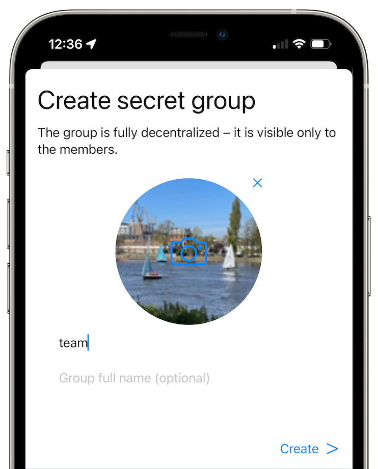

# Salaiset ryhmät

Salaiset ryhmät ovat nimettömiä ja yksityisiä, ne on suunniteltu vaikeiksi seurattaviksi ulkopuolisille. Jokainen viesti ja tiedosto lähetetään erikseen jokaiselle ryhmän jäsenelle, mikä rajoittaa salaiset ryhmät sopimaan vain pienempiin ryhmiin.

## Ryhmän luominen

   

- Napauta painiketta näytön alaoikealla.
- Napauta "Luo salainen ryhmä".
- Anna ryhmän näyttönimi.
- Napauta "Luo".

## Ryhmän asetukset

Tässä voit valita, haluatko sallia katoavat viestit, suoraviestit, poistamisen kaikilta ja ääniviestit.

## Jäsenten lisääminen

- Avaa ryhmä. 
- Napauta + painiketta näytön oikeassa ylänurkassa.
- Valitse kontaktit, jotka haluat kutsua.
- Napauta "Kutsu ryhmään".

## Ryhmään liittyminen

Kun saat kutsun liittyä ryhmään, voit hyväksyä sen sekä keskustelusta kontaktisi kanssa että keskusteluista.

## Ryhmästä poistuminen

Paina pitkään (Androidilla) tai pyyhkäise (iOS:lla) ryhmää keskustelulistassa poistuaksesi ryhmästä.

Voit myös poistua ryhmästä ryhmäsivulta:

- Avaa ryhmäkeskustelu.
- Napauta ryhmän nimeä ylhäällä.
- Vieritä alas ja napauta "Poistu ryhmästä".

## Jäsenten käyttöoikeudet

Avaa ryhmä ja napauta ryhmän nimeä nähdäksesi jäsenluettelon, siellä voit napauttaa jäsentä ja vaihtaa heidän rooliaan.

- Tarkkailija: voi vain lukea viestejä (ja poistaa tai merkitä poistetuiksi viestit, jotka on lähetetty ennen roolin muuttamista).
- Jäsen: voi lähettää viestejä ja poistaa omia viestejään.  
- Ylläpitäjä: Samat oikeudet kuin jäsenellä, mutta voi poistaa muiden viestejä ja poistaa jäseniä ryhmästä.
- Omistaja: Samat oikeudet kuin ylläpitäjällä, mutta voi muuttaa ryhmän asetuksia. 

## Linkki ryhmään liittymiseen

 &nbsp;&nbsp; 

Jos olet ryhmän omistaja tai ylläpitäjä, voit luoda linkin, jota kuka tahansa voi käyttää liittyäkseen ryhmään, mikä tekee ryhmästä julkisemman.

- Avaa ryhmäkeskustelu.
- Napauta ryhmän nimeä.
- Napauta "Luo ryhmälinkki".

Kun linkki on luotu, voit myös muuttaa roolia, joka määritetään jäsenille heidän liittyessään.

## Tervetuloviesti

Jos olet ryhmän omistaja, voit luoda tervetuloviestin, joka näytetään kaikille uusille ryhmään liittyville jäsenille.
