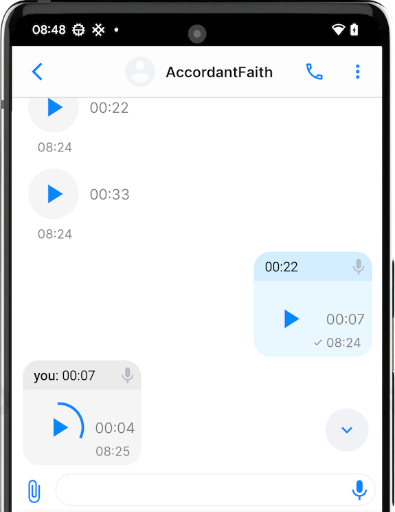
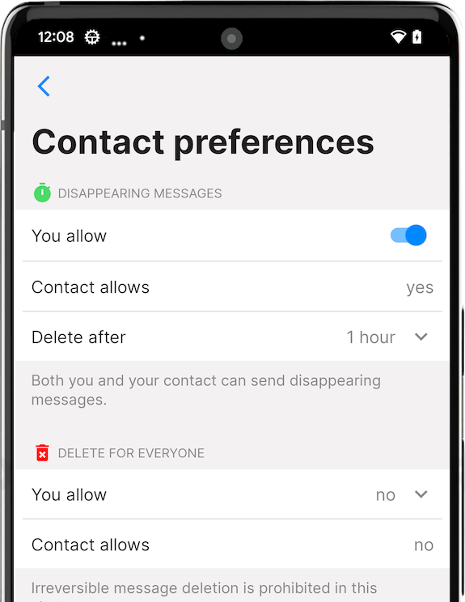
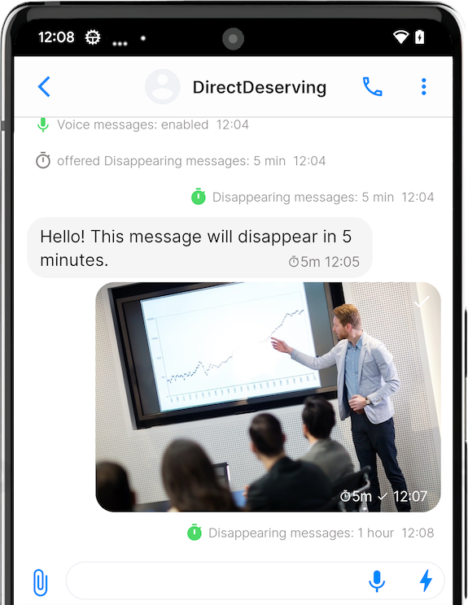
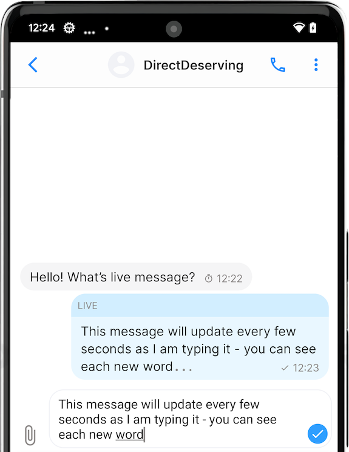
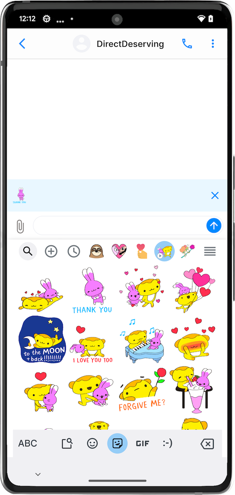
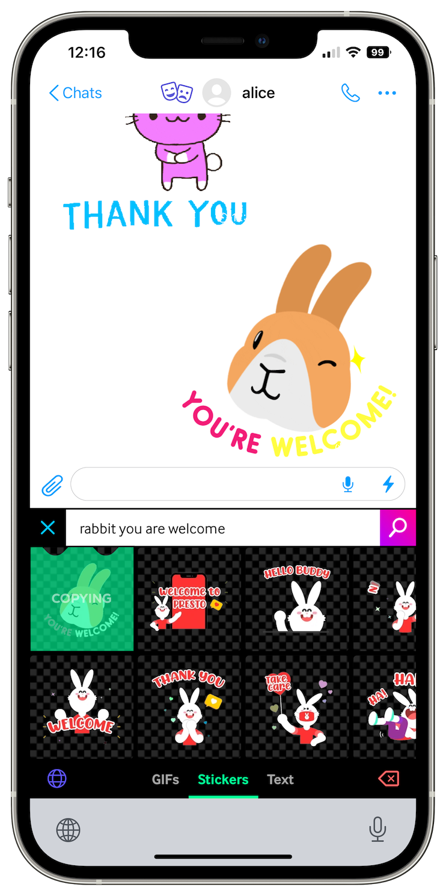
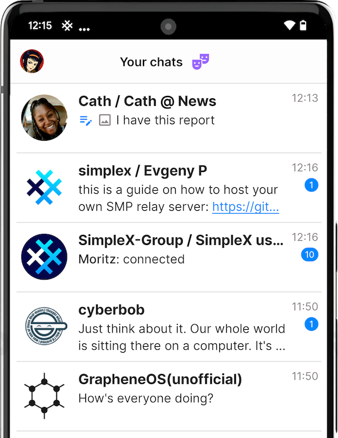
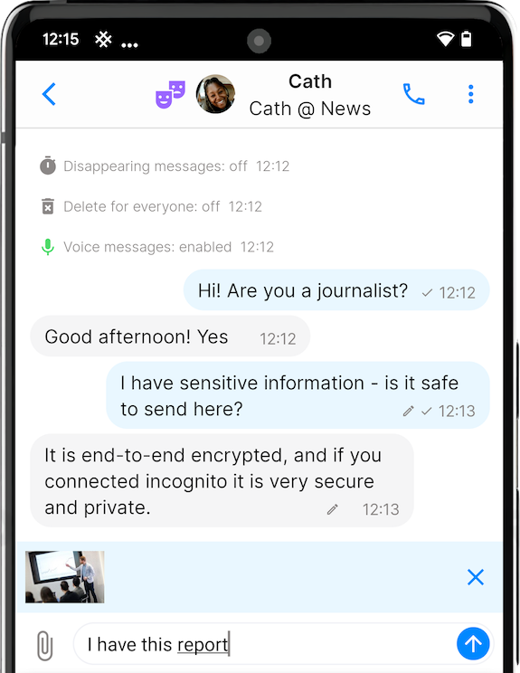
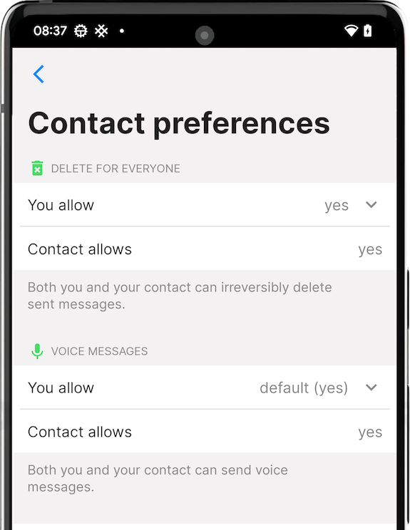

# Viestien lähettäminen, muokkaaminen ja poistaminen

Tekstiviestien lähettäminen SimpleX Chatissa on melko yksinkertaista, napauta kontaktia ja sitten tekstikenttää, kirjoita viestisi ja napauta "Lähetä"-painiketta.

Sinun on avattava keskustelu lähettääksesi viestejä.

## Viestien lähettäminen 

### Tekstiviestien lähettäminen

Voit lähettää, muokata ja lainata viestejä keskustelussa.

Lähettääksesi kirjoita viesti syöttökenttään ja napauta "Lähetä".

Muokataksesi tai lainataksesi viestiä, paina viestiä pitkään ja valitse toiminto.

### Kuvien ja tiedostojen lähettäminen

- Napauta 📎 (paperiliitin) -painiketta viestisyöttökentän vasemmalla puolella.
- Valitse "Käytä kameraa", "Galleriasta" tai "Valitse tiedosto".
- Kun olet valinnut mitä haluat lähettää, napauta "Lähetä"-painiketta. 

iOS:lla voit myös liittää kuvia leikepöydältä.

### Ääniviestien lähettäminen 

- Napauta 🎤 (mikrofoni) -painiketta viestisyöttökentän oikealla puolella.
- Salli SimpleX Chatin tallentaa ääntä, jos sitä pyydetään. Sinun on napautettava mikrofonipainiketta uudelleen, jos näin käy.
- Puhu, kun olet valmis nauhoituksen kanssa, napauta neliömäistä pysäytyspainiketta oikealla.
- Voit kuunnella tallennusta ennen lähettämistä ja nauhoittaa uudelleen tarvittaessa.
- Lähetä tallennettu ääniviesti napauttamalla "Lähetä"-painiketta. 

Voit myös painaa mikrofonipainiketta pitkään ääniviestin tallentamiseksi. Tässä tapauksessa nauhoitus pysähtyy, kun vapautat painikkeen. Sinun on silti napautettava "Lähetä" lähettääksesi viestin.

**Huomautus**: jos mikrofonipainike on harmaa, se tarkoittaa, että ääniviestit on pois käytöstä tässä keskustelussa. Pyydä kontaktiasi tai ryhmän omistajaa ottamaan ne käyttöön (ne ovat oletusarvoisesti käytössä).

### Katoavien viestien käyttäminen

 &nbsp;&nbsp; 

- Napauta keskustelun nimeä.
- Kytke liukukytkin kohdassa "Katoavat viestit".
- Valitse "Poista jälkeen", kuinka kauan viestit säilyvät lähetyksen jälkeen.

**Huomautus**: Myös kontaktisi täytyy ottaa katoavat viestit käyttöön. Ryhmässä vain ryhmän omistaja voi ottaa katoavat viestit käyttöön.

### "Live"-viestien lähettäminen 

Voit käyttää "live"-viestejä, jotta vastaanottajat näkevät viestit sitä mukaa kun kirjoitat ne, ilman että sinun tarvitsee napauttaa "Lähetä"-painiketta ennen valmistumista. Se voi olla hyödyllistä seuraavissa tilanteissa:

1. Reaaliaikainen keskustelu, kuten puhuminen kasvotusten tai keskustelukerhossa. Voit perua kirjoittamasi, mutta vastaanottajat näkisivät sen. Tämä välttää arvailun, mitä kirjoitat. Se mahdollistaa pidempien viestien lähettämisen keskeyttämättä keskustelun kulkua.
2. Aktivisti, joka raportoi reaaliajassa, kun on riski menettää puhelin tai yhteys milloin tahansa. Tämä ominaisuus mahdollistaa mahdollisimman paljon lähettämisen, viimeistä sanaa myöten, ilman että tarvitsee lähettää vain hyvin lyhyitä viestejä.

Lähettääksesi "live"-viestin:

- Napauta ⚡️ (salama) -painiketta viestin syöttökentän oikealla puolella.
- Kun teet sen ensimmäisen kerran, näet varoituksen, joka selittää ominaisuuden. Napauta "OK", ja napauta sitä uudelleen.
- Nyt voit aloittaa viestin kirjoittamisen, sovellus lähettää päivitykset vastaanottajille määräajoin muutaman sekunnin välein sitä mukaa kun kirjoitat (aina täydet sanat).

### Tarrojen ja animoitujen viestien lähettäminen

 &nbsp;&nbsp; 

Vaikka itse sovelluksessa ei ole tarroja ja GIF-animaatioita, voit lähettää niitä kolmannen osapuolen (kuten [GIPHY](https://apps.apple.com/us/app/giphy-the-gif-search-engine/id974748812) iOS:lla) tai natiivien (Android 13+) näppäimistöjen avulla. 

### Viestiluonnokset

 &nbsp;&nbsp; 

Viestit säilyvät keskustelussa, kunnes ne on lähetetty, vaikka poistuisit keskustelusta.

Yksityisyyden ja yksinkertaisuuden vuoksi päätimme sallia vain yhden viestiluonnoksen, joka säilytetään vain, kunnes sovellus pysäytetään.

Lue lisää [tästä julkaisusta](../../../../blog/20230204-simplex-chat-v4-5-user-chat-profiles.md#message-draft).

## Viestien poistaminen 

 &nbsp;&nbsp; 

Poistaaksesi viestin, paina viestiä pitkään ja valitse "Poista".

Jos olet itse lähettänyt tämän viestin viimeisten 24 tunnin aikana, sinulle tarjotaan kahta vaihtoehtoa:

- `poista kaikilta` - tämä joko merkitsee viestin poistetuksi sinulta ja vastaanottajalta/vastaanottajilta (oletus) tai poistaa viestin kokonaan laitteiltasi ja vastaanottajien laitteilta (jos olet ottanut käyttöön "Poista kaikilta" -asetuksen keskusteluasetuksissa)

- `poista minulta` - tämä poistaa viestin vain paikallisesti.

Lue syistä miksi [emme salli täydellistä poistoa oletuksena](../../../../blog/20221206-simplex-chat-v4.3-voice-messages.md#irreversible-message-deletion). 

## Viestien moderointi ryhmissä

Ryhmän ylläpitäjät voivat poistaa jäsenten sopimattomat viestit ryhmästä. 

Poistaaksesi toisen jäsenen viestin, paina viestiä pitkään ja valitse "Moderoin".

Lue lisää [ryhmän moderoinnista](../../../../blog/20230328-simplex-chat-v4-6-hidden-profiles.md#community-moderation).
