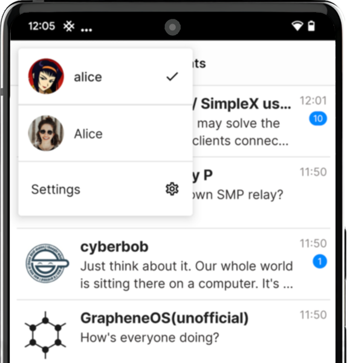

# Vos profils de chat

## Créer des profils de chat supplémentaires

SimpleX Chat vous permet de créer autant de profils de chat que vous le souhaitez. Comme votre premier profil, ils ne sont stockés que localement sur votre appareil.

Pour créer un profil SimpleX Chat supplémentaire :

- [Ouvrir les paramètres de l'application](./Guide_app-settings.md##ouvrir-les-paramètres-de-lapplication).
- Sélectionnez "Vos profils de chat".
- Déverrouillez l'option via l'empreinte digitale ou le code PIN.
- Tapez sur "+ Ajouter un profil".
- Créez un nouveau profil en saisissant votre nom d'affichage et votre nom complet (facultatif).
- Tapez sur "Créer".

## Masquer et mettre en sourdine les profils de chat

La v4.6 a ajouté la possibilité de mettre en sourdine et de masquer les profils de chat.

 &nbsp;&nbsp;  &nbsp;&nbsp; 

Ces actions sont disponibles via une longue pression (Android) ou un swipe (iOS) sur le profil dans la liste.

Pour masquer les profils cachés, saisissez le mot de passe complet dans la barre de recherche.

## Passer d'un profil à l'autre

- Tapez sur l'image de votre profil d'utilisateur en haut à droite de l'écran.
- Sélectionnez le profil que vous souhaitez utiliser.

Vous pouvez également changer de profil via Vos profils de chat dans les paramètres.

## Mode Incognito

   

Cette fonction est unique à SimpleX Chat - elle est indépendante des profils de chat.

Lorsque le "Mode Incognito" est activé, le nom et l'image de votre profil sont cachés à vos nouveaux contacts. Il permet des connexions anonymes avec d'autres personnes sans aucune donnée partagée - lorsque tu fais de nouvelles connexions ou que tu rejoins des groupes via un lien, un nouveau nom de profil aléatoire sera généré pour chaque connexion.

Pour activer/désactiver le mode incognito :

- Ouvrez les [paramètres de l'application](./Guide_app-settings.md#ouvrir-les-paramètres-de-lapplication).
- Activez/désactivez le mode incognito en appuyant sur le bouton "Incognito".

Pour en savoir plus, consultez [cet article](../../../blog/20220901-simplex-chat-v3.2-incognito-mode.md#incognito-mode).

## Modifier votre profil

Pour modifier votre profil :

- [Ouvrir les paramètres de l'application](./Guide_app-settings.md#ouvrir-les-paramètres-de-lapplication).
- Sélectionnez votre profil.
- Tapez sur "Modifier".
- Saisissez le nom de votre profil et/ou mettez à jour votre nom complet.
- Vous pouvez également définir et modifier l'image de votre profil.
- Tapez sur "Enregistrer et notifier les contacts".

## Déplacer vos profils de chat vers un autre appareil

SimpleX Chat stocke toutes les données des utilisateurs uniquement sur les appareils clients en utilisant un format de base de données crypté portable qui peut être exporté et transféré vers n'importe quel appareil pris en charge.

Pour exporter vos données SimpleX Chat :

- [Ouvrez les paramètres de l'application](./Guide_app-settings.md#ouvrir-les-paramètres-de-lapplication).
- Sélectionnez " Phrase secrète et exportation de la base de données ".
- Arrêtez le chat en désactivant la fonction "Chat en cours" (appuyez sur "Stop" dans la boîte de dialogue de confirmation).
- Confirmez avec l'empreinte digitale ou le code PIN, si vous avez activé le [SimpleX Lock](./Guide_app-settings.md#simplex-lock).
- Si vous ne l'avez pas défini auparavant, [définissez une phrase secrète](./Guide_managing-data.md#phrase-secrète-de-la-base-de-données) dans " Phrase secrète de la base de données ". Initialement, la base de données est chiffrée avec une phrase secrète aléatoire qui est stockée dans KeyChain (iOS) ou avec KeyStore (Android).
- Tapez sur "Exporter la base de données" - l'exportation ne sera pas autorisée si vous n'avez pas défini de phrase secrète.
- Enregistrez le fichier sur votre appareil ou partagez-le via l'une des options disponibles.

Pour importer vos données SimpleX Chat dans l'application sur un autre appareil :

- Transférez le fichier de la base de données vers le nouvel appareil.
- Installez l'application SimpleX Chat.
- Créez un profil de chat avec n'importe quel nom en suivant les étapes de [créer votre premier profil de chat](#create-yout-first-chat-profile) - vous le remplacerez bientôt.
- Ouvrez les paramètres de l'application
- Sélectionnez " Phrase secrète et exportation de la base de données ".
- Arrêtez le chat en appuyant sur l'interrupteur "Chat en cours".
- Appuyez sur "Importer la base de données".
- Sélectionnez le fichier .zip contenant les données exportées du chat.
- Appuyez sur "Importer" dans la boîte de dialogue de confirmation.
- Démarrez le chat via la bascule ou fermez et démarrez l'application - vous serez invité à saisir la phrase secrète de votre base de données de chat.

**Veuillez noter** :

1. Actuellement, vous ne pouvez pas déplacer certains profils, seule la base de données complète contenant tous les profils peut être déplacée.

2. Vous ne devez PAS utiliser la base de données exportée sur plus d'un appareil à la fois, car cela pourrait perturber certaines connexions. Vous devez également toujours utiliser la dernière version de la base de données de chat - l'utilisation de l'ancienne version est également susceptible de perturber vos connexions.

3. Il n'existe aucun moyen de récupérer une phrase secrète perdue - veillez à la conserver en toute sécurité.
