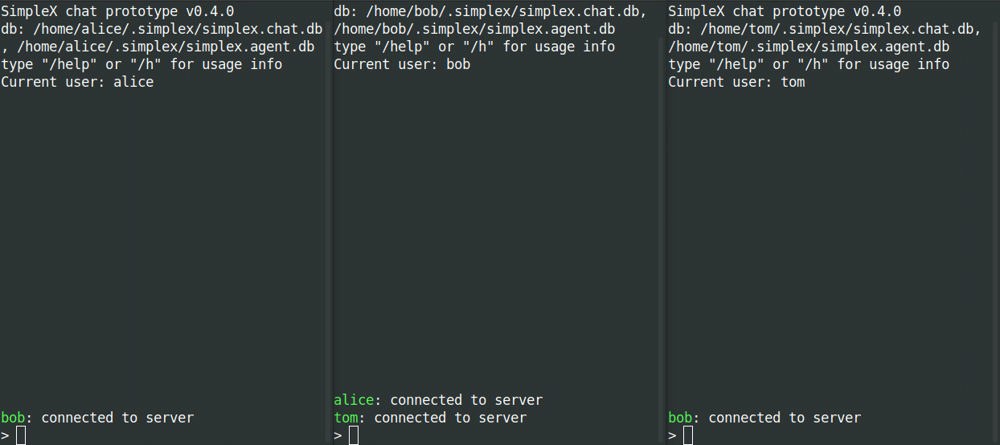

| Updated 31.01.2023 | Languages: [EN](/docs/CLI.md), [FR](/docs/lang/fr/CLI.md), [CZ](/docs/lang/cs/CLI.md) JA |

# Linux/MacOS/Windows用 SimpleX Chat ターミナル(コンソール)アプリ

## 目次

- [ターミナルチャット機能](#ターミナルチャット機能)
- [インストールガイド](#🚀-installation)
  - [クライアントのダウンロード](#クライアントのダウンロード)
    - [LinuxとMacOS](#LinuxとMacOS)
    - [Windows](#windows)
  - [ソースからビルドする](#ソースからビルドする)
    - [Dockerを使用する](#Dockerを使用する)
    - [任意のOSでHaskellを使用する](#任意のOSでHaskellを使用する)
- [使用方法](#使用方法)
  - [クライアントの実行](#クライアントの実行)
  - [Tor経由でメッセージングサーバーにアクセスする](#Tor経由でメッセージングサーバーにアクセスする)
  - [SimpleXチャットの使い方](#SimpleXチャットの使い方)
  - [グループ](#グループ)
  - [ファイルの送信](#ファイルの送信)
  - [ユーザーの連絡先アドレス](#ユーザーの連絡先アドレス)
  - [チャット履歴にアクセスする](#access-chat-history)

## ターミナルチャット機能

- 同じターミナルウィンドウで複数の人と1対1のチャット
- グループメッセージ
- 連絡先やグループへのファイル送信
- ユーザー連絡先アドレス - 複数使用可能な連絡先リンクによる接続の確立
- メッセージはローカルのSQLiteデータベースに保存
- 自動入力される受信者名 - 接続が確立されたら、メッセージを入力するだけで送信者に返信可能
- アプリ内で事前に構成されたデモ SMP サーバーが利用可能 - または[独自のサーバー](https://github.com/simplex-chat/simplexmq#using-smp-server-and-smp-agent)をデプロイすることも可能
- グローバルIDや名前がサーバーに表示されないため、連絡先や会話の完全なプライバシーを確保さ
- 2層のE2E暗号化（デュプレックス接続にはダブルラチェット、X3DH鍵共有とエフェメラルCurve448キーを使用、SMPキューにはNaCl crypto_box、Curve25519キーを使用）と受信者キーのアウトオブバンド受け渡し([SimpleXチャットの使い方を参照](#how-to-use-simplex-chat))
- メッセージの整合性検証(前のメッセージの内容を含む)
- 自動生成されたEd448キーによるSMPサーバーによる各コマンド/メッセージの認証
- TLS 1.3トランスポート暗号化
- SMPサーバーから受信者へのメッセージの追加暗号化により、トラフィックの相関性を低減

鍵共有に関与する公開鍵はIDとして使用されず、連絡先ごとにランダムに生成されます。

技術的な詳細については、[使用される暗号化プリミティブ](https://github.com/simplex-chat/simplexmq/blob/master/protocol/overview-tjr.md#encryption-primitives-used)を参照してください。

<a name="🚀-installation"></a>

## 🚀 インストールガイド

### クライアントのダウンロード

#### LinuxとMacOS

`simplex-chat`を**インストール**または**更新**するには、インストールスクリプトを実行する必要があります。そのためには、以下のcURLまたはWgetコマンドを使用してください:

```sh
curl -o- https://raw.githubusercontent.com/simplex-chat/simplex-chat/stable/install.sh | bash
```

```sh
wget -qO- https://raw.githubusercontent.com/simplex-chat/simplex-chat/stable/install.sh | bash
```

チャットクライアントがダウンロードできたら、ターミナルで`simplex-chat`コマンドを実行します。

または、以下のコマンドで、[最新の安定リリース](https://github.com/simplex-chat/simplex-chat/releases)からシステムのチャットバイナリを手動でダウンロードし、実行も可能です。

```sh
chmod +x <binary>
mv <binary> ~/.local/bin/simplex-chat
```

(または`PATH`上の任意の場所).

MacOSでは、[Gatekeeperの実行を許可](https://support.apple.com/en-us/HT202491)する必要があります。

#### Windows

```sh
move <binary> %APPDATA%/local/bin/simplex-chat.exe
```

### ソースからビルドする

> **注意:** アプリをビルドするには、[stableブランチ](https://github.com/simplex-chat/simplex-chat/tree/stable)のソースコードを使用してください。

#### Dockerを使用する

Linuxでは、[カスタム出力でdocker build](https://docs.docker.com/engine/reference/commandline/build/#custom-build-outputs)を使ってチャット実行可能ファイルをビルドできます。:

```shell
git clone git@github.com:simplex-chat/simplex-chat.git
cd simplex-chat
git checkout stable
DOCKER_BUILDKIT=1 docker build --output ~/.local/bin .
```

> **注意:** `` version `GLIBC_2.28' not found `` というエラーが発生した場合は、`haskell:8.10.7-stretch`ベースイメージで再ビルドしてください（ローカルの [Dockerfile](Dockerfile)で変更してください）。

#### 任意のOSでHaskellを使用する

1. [Haskell GHCup](https://www.haskell.org/ghcup/)、GHC 9.6.3、cabal 3.10.1.0 をインストールします:

```shell
curl --proto '=https' --tlsv1.2 -sSf https://get-ghcup.haskell.org | sh
```

`ghcup tui`を使用して、GHCおよびcabalのバージョンを確認または追加できます。

2. ソースコードのクローンを作成します:

```shell
git clone git@github.com:simplex-chat/simplex-chat.git
cd simplex-chat
git checkout stable
# 特定のバージョンをビルドする場合:
# git checkout v5.3.0-beta.8
```

`master`は開発ブランチであるため、不安定なコードが含まれている可能性があります。.

3. システムの準備:

Linux:

```shell
apt-get update && apt-get install -y build-essential libgmp3-dev zlib1g-dev
cp scripts/cabal.project.local.linux cabal.project.local
```

Mac:

```
brew install openssl@1.1
cp scripts/cabal.project.local.mac cabal.project.local
```

opensslの場所を指すように、cabal.project.localを修正する必要がある場合があります。

4. アプリをビルドする:

```shell
cabal update
cabal install simplex-chat
```

## 使用方法

### クライアントの実行

チャットクライアントを起動するには、ターミナルから`simplex-chat`を実行します。

デフォルトでは、アプリデータディレクトリはホームディレクトリ(`~/.simplex`または `%APPDATA%/simplex` on Windows)に作成され、2つの SQLite データベースファイル`simplex_v1_chat.db`と`simplex_v1_agent.db`が初期化されます。

データベースファイルに別のファイルパスの接頭辞を指定するには、`-d`コマンドラインオプションを使用します:

```shell
$ simplex-chat -d alice
```

例えば、上記を実行すると、カレントディレクトリに`alice_v1_chat.db`と`alice_v1_agent.db`データベースファイルが作成されます。

3つのデフォルトのSMPサーバーはLinodeでホストされており、[アプリ内で事前に構成](https://github.com/simplex-chat/simplex-chat/blob/stable/src/Simplex/Chat/Options.hs#L42)されています。

独自のSMPサーバーをデプロイした場合は、`-s`オプションを使用してクライアントを構成できます:

```shell
$ simplex-chat -s smp://LcJUMfVhwD8yxjAiSaDzzGF3-kLG4Uh0Fl_ZIjrRwjI=@smp.example.com
```

サーバーアドレスの前にあるBase64urlエンコードされた文字列は、TLSハンドシェイク中にクライアントによって検証されるサーバーのオフライン証明書フィンガープリントです。

デフォルトまたはその他のサーバーを使用して他のユーザーと会話することができます。これは、接続を開始するときのメッセージキューの場所にのみ影響します (また、応答キューは、相手のクライアントの設定に応じて、別のサーバー上に存在する可能性があります)。

`simplex-chat -h`を実行して、利用可能なオプションをすべて表示できます。

### Tor経由でメッセージングサーバーにアクセスする

Torをインストールし、ポート9050でSOCKS5プロキシとして実行します。Macで実行する場合は以下の通りです:

```
brew install tor
brew services start tor
```

Tor経由でサーバーにアクセスするには、`-x`オプションを使用します:

```
simplex-chat -x
```

他のホストまたはポートで実行している場合、`--socks-proxy=ipv4:port`または`--socks-proxy=:port`オプションを使用して、SOCKS5プロキシのホストとポートを構成することもできます。

### SimpleXチャットの使い方

チャットを開始すると、ローカルチャットのプロフィールを作成するための「表示名」とオプションの「フルネーム」を指定するプロンプトが表示されます。表示名は、あなたの連絡先があなたを参照するためのエイリアスです - これは一意ではなく、グローバルなIDとして機能するものではありません。あなたの連絡先の方が同じ表示名を選択した場合、チャットクライアントはそのローカル表示名に数字のサフィックスを追加します。

以下の図は、連絡先に接続してメッセージを送信する方法を示しています:

<div align="center">
  
</div>

ローカル プロファイルを設定したら、`/c` (または`/connect`)と入力して新しい接続を作成し、招待状を生成します。 この招待状を他のチャネル経由で連絡先に送信します。

`/connect`を複数回入力し、接続したい対応する連絡先にこれらの招待状を送信することで、複数の招待状を作成できます。

この招待状は一度しか使用することができず、仮にこの招待状が傍受されたとしても、あなたのコンタクト先が接続の確立を確認すれば、攻撃者はこの招待状を使用してこのキュー経由であなたにメッセージを送信することはできません。[招待フォーマット](https://github.com/simplex-chat/simplexmq/blob/master/protocol/agent-protocol.md#connection-request)については、エージェントプロトコルを参照してください。

招待を受け取った連絡先は、`/c <invitation>`と入力して接続を承諾する必要があります。これにより接続が確立され、双方に通知が送信されます。

その後、`@<name> <message>`コマンドを使用してメッセージを送信します。 メッセージの入力を開始して、最後に連絡した連絡先に送信することもできます。

使用可能なコマンドのリストを見るには`/help`を使用してください。

### グループ

グループを作成するには、`/g <group>`を使用し、`/a <group> <name>`で連絡先を追加します。`#<group> <message>`と入力することで、グループにメッセージを送ることができます。その他のコマンドについては`/help groups`を使用して確認してください。



> **注意**: グループはどのサーバーにも保存されず、メッセージの送信先となるアプリデータベース内のメンバーのリストとして維持されます。

### ファイルの送信

`/f @<contact> <file_path>`を使用してファイルを連絡先に送信できます。受信者は送信前にファイルを受け入れる必要があります。その他のコマンドは`/help files`を使用してください。


`/f #<group> <file_path>`を使用してファイルをグループに送信できます。

### ユーザーの連絡先アドレス

1回限りの招待リンクの代わりに、`/ad` (`/address`)で長期的なアドレスを作成することができます。作成されたアドレスはどのチャンネルでも共有でき、他のユーザーが`/c <user_contact_address>`で連絡先リクエストを行うためのリンクとして使用できます。

`/ac <name>`と`/rc <name>`コマンドを使用して、受信リクエストを承認または拒否できます。

ユーザーアドレスは、複数回使用可能な接続リンクという意味で "長期的 "に使用することができます。ユーザーが削除するまで使用することができ、その場合、確立された接続はすべてアクティブなままです（電子メールとは異なり、アドレスを変更するとメッセージを送ることができなくなります）。

その他のコマンドについては`/help address`を使用してください。


