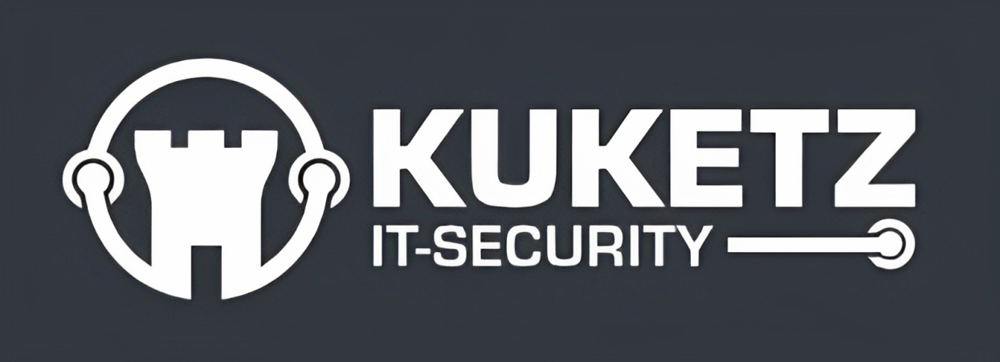
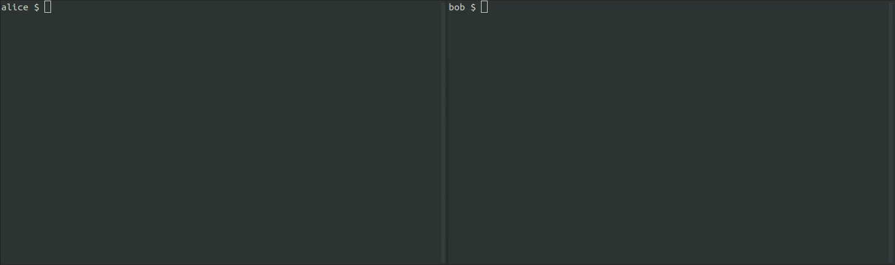

[](https://github.com/simplex-chat/simplex-chat/actions/workflows/build.yml)
[](https://github.com/simplex-chat/simplex-chat/releases)
[](https://github.com/simplex-chat/simplex-chat/releases)
[](https://www.reddit.com/r/SimpleXChat)
<a rel="me" href="https://mastodon.social/@simplex"></a>

| 30/03/2023 | [EN](/README.md), [FR](/docs/lang/fr/README.md), [CZ](/docs/lang/cs/README.md) JA |


# SimpleXはユーザーIDを持たない100%プライベートな設計のメッセージングプラットフォームです！

[](http://simplex.chat/blog/20221108-simplex-chat-v4.2-security-audit-new-website.html) &nbsp;&nbsp;&nbsp; [](https://www.privacyguides.org/en/real-time-communication/#simplex-chat) &nbsp;&nbsp;&nbsp; [](https://www.kuketz-blog.de/simplex-eindruecke-vom-messenger-ohne-identifier/)

## SimpleXチャットへようこそ！

1. 📲 [アプリをインストールする](#install-the-app)。
2. ↔️ [チームと繋がる](#connect-to-the-team)、 [ユーザーグループに参加](#join-user-groups) または [最新情報を確認する](#follow-our-updates)。
3. 🤝 友人と[プライベートな接続を確立する](#make-a-private-connection)。
4. 🔤 [SimpleX Chatの翻訳を手伝う](#help-translating-simplex-chat)。
5. ⚡️ [プロジェクトに貢献](#contribute) または [寄付する](#help-us-with-donations)。

[SimpleXチャットについてもっと知る](#contents)。

## アプリをインストールする

[](https://apps.apple.com/us/app/simplex-chat/id1605771084)
&nbsp;
[](https://play.google.com/store/apps/details?id=chat.simplex.app)
&nbsp;
[](https://app.simplex.chat)
&nbsp;
[](https://testflight.apple.com/join/DWuT2LQu)
&nbsp;
[](https://github.com/simplex-chat/simplex-chat/releases/latest/download/simplex.apk)

- 🖲 いつ誰と話そうとも、メッセージとメタデータは保護されます。
- 🔐 暗号化レイヤーを追加した上で、Double Ratchetアルゴリズムを使用したエンドツーエンド暗号化が行われます。
- 📱 Android ([Google Play](https://play.google.com/store/apps/details?id=chat.simplex.app), [APK](https://github.com/simplex-chat/simplex-chat/releases/latest/download/simplex.apk)) と [iOS](https://apps.apple.com/us/app/simplex-chat/id1605771084)のモバイル向けアプリがあります。
- 🚀 **10,000ユーザ限定**で新機能を含む[TestFlight (iOS向けベータ版)](https://testflight.apple.com/join/DWuT2LQu)がリリース1~2週間前に利用可能です。
- 🖥 Linux、MacOS、及びWindowsで、[コンソールアプリ(CLI)](#zap-quick-installation-of-a-terminal-app)が利用可能です。

## チームと繋がる

プロフィールに会話がない場合に表示される「開発者とチャット」ボタン、設定にある「質問やアイデアを送る」または[SimpleXのアドレス](https://simplex.chat/contact#/?v=1&smp=smp%3A%2F%2FPQUV2eL0t7OStZOoAsPEV2QYWt4-xilbakvGUGOItUo%3D%40smp6.simplex.im%2FK1rslx-m5bpXVIdMZg9NLUZ_8JBm8xTt%23%2F%3Fv%3D1%26dh%3DMCowBQYDK2VuAyEALDeVe-sG8mRY22LsXlPgiwTNs9dbiLrNuA7f3ZMAJ2w%253D%26srv%3Dbylepyau3ty4czmn77q4fglvperknl4bi2eb2fdy2bh4jxtf32kf73yd.onion)を使って、SimpleXチームに接続することができます。以下の場合に接続してください。

- 質問がある場合
- 改善の提案がある場合
- 上記に関連する情報などを共有する場合

質問には手動で対応しているため、すぐには返信されません。最大24時間掛かる場合があります。

オープンソース言語のモデル統合の支援と[SimpleXチームへの参加](./docs/JOIN_TEAM.md)に興味がある方は、ぜひご連絡ください。

## ユーザーグループに参加する

新しい[ディレクトリサービス](https://simplex.chat/contact#/?v=1-4&smp=smp%3A%2F%2Fu2dS9sG8nMNURyZwqASV4yROM28Er0luVTx5X1CsMrU%3D%40smp4.simplex.im%2FeXSPwqTkKyDO3px4fLf1wx3MvPdjdLW3%23%2F%3Fv%3D1-2%26dh%3DMCowBQYDK2VuAyEAaiv6MkMH44L2TcYrt_CsX3ZvM11WgbMEUn0hkIKTOho%253D%26srv%3Do5vmywmrnaxalvz6wi3zicyftgio6psuvyniis6gco6bp6ekl4cqj4id.onion)を通じて、他のユーザーが作成したグループに参加することができます。これらのグループで共有されるコンテンツについては、私たちは責任を負いません。

**注意**: このグループは、ユーザーがSimpleXチャットに関する質問、提案、疑問のみを共有できるように作成されています。

可能なこと:
- アプリの批判、他のメッセンジャーと比較すること。
- プライバシーのための興味深いメッセージアプリを共有すること（スパムを除く）。
- プライバシーに関連する書籍を共有すること。
- ダイレクトメッセージで管理者と事前に承認を得て、作成したグループにリンクを共有します。ただし、そのリンクは1回だけです。グループのメンバーが10人を超えたら、そのグループを[SimpleXディレクトリサービス](./docs/DIRECTORY.md)に送信して、新しいユーザーがそのグループを検出できるようにします。

厳守事項:
- 他のユーザーに対して礼儀正しくすること。
- スパムをしないこと（関連することでも、過度なメッセージ送信を行わないこと）。
- 個人への攻撃をしたり、敵意を示さないこと。
- 上記に関係しないコンテンツを共有しないこと（政治やプライバシー、セキュリティ、技術、コミュニケーション以外の社会的側面について議論すること、他のユーザーにとって不快と思われる可能性のあるコンテンツを共有することなどが含まれますが、これらに限るものではありません）。

これらのルールに従わないメッセージは削除され、メッセージ送信の権利を剥奪される場合があります。また、対象者が別名でグループへ再参加することを防ぐため、グループへの新メンバー追加が一時的に制限される場合があります。

質問があれば、英語圏のユーザーグループに参加することができます： [#SimpleX users group](https://simplex.chat/contact#/?v=1-4&smp=smp%3A%2F%2FPQUV2eL0t7OStZOoAsPEV2QYWt4-xilbakvGUGOItUo%3D%40smp6.simplex.im%2Fos8FftfoV8zjb2T89fUEjJtF7y64p5av%23%2F%3Fv%3D1-2%26dh%3DMCowBQYDK2VuAyEAQqMgh0fw2lPhjn3PDIEfAKA_E0-gf8Hr8zzhYnDivRs%253D%26srv%3Dbylepyau3ty4czmn77q4fglvperknl4bi2eb2fdy2bh4jxtf32kf73yd.onion&data=%7B%22type%22%3A%22group%22%2C%22groupLinkId%22%3A%22lBPiveK2mjfUH43SN77R0w%3D%3D%22%7D)

また、SimpleXプラットフォームでビルドするデベロッパー向けグループ [#simplex-devs](https://simplex.chat/contact#/?v=1-2&smp=smp%3A%2F%2Fu2dS9sG8nMNURyZwqASV4yROM28Er0luVTx5X1CsMrU%3D%40smp4.simplex.im%2F6eHqy7uAbZPOcA6qBtrQgQquVlt4Ll91%23%2F%3Fv%3D1-2%26dh%3DMCowBQYDK2VuAyEAqV_pg3FF00L98aCXp4D3bOs4Sxv_UmSd-gb0juVoQVs%253D%26srv%3Do5vmywmrnaxalvz6wi3zicyftgio6psuvyniis6gco6bp6ekl4cqj4id.onion&data=%7B%22type%22%3A%22group%22%2C%22groupLinkId%22%3A%22XonlixcHBIb2ijCehbZoiw%3D%3D%22%7D) もあります:

- チャットボットと自動化について
- 他のアプリとのインテグレーションについて
- ソーシャルアプリとサービスについて
- その他

アプリのUIを翻訳した他の言語グループもあります。これらのグループはテストや他のSimpleXチャットユーザーに質問するためのものです:

[\#SimpleX-DE](https://simplex.chat/contact#/?v=1-2&smp=smp%3A%2F%2FPQUV2eL0t7OStZOoAsPEV2QYWt4-xilbakvGUGOItUo%3D%40smp6.simplex.im%2FkIEl7OQzcp-J6aDmjdlQbRJwqkcZE7XR%23%2F%3Fv%3D1-2%26dh%3DMCowBQYDK2VuAyEAR16PCu02MobRmKAsjzhDWMZcWP9hS8l5AUZi-Gs8z18%253D%26srv%3Dbylepyau3ty4czmn77q4fglvperknl4bi2eb2fdy2bh4jxtf32kf73yd.onion&data=%7B%22type%22%3A%22group%22%2C%22groupLinkId%22%3A%22puYPMCQt11yPUvgmI5jCiw%3D%3D%22%7D) (ドイツ語圏)、 [\#SimpleX-ES](https://simplex.chat/contact#/?v=1-2&smp=smp%3A%2F%2FPQUV2eL0t7OStZOoAsPEV2QYWt4-xilbakvGUGOItUo%3D%40smp6.simplex.im%2FaJ8O1O8A8GbeoaHTo_V8dcefaCl7ouPb%23%2F%3Fv%3D1-2%26dh%3DMCowBQYDK2VuAyEA034qWTA3sWcTsi6aWhNf9BA34vKVCFaEBdP2R66z6Ao%253D%26srv%3Dbylepyau3ty4czmn77q4fglvperknl4bi2eb2fdy2bh4jxtf32kf73yd.onion&data=%7B%22type%22%3A%22group%22%2C%22groupLinkId%22%3A%22wiZ1v_wNjLPlT-nCSB-bRA%3D%3D%22%7D) (スペイン語圏)、 [\#SimpleX-FR](https://simplex.chat/contact#/?v=1-2&smp=smp%3A%2F%2Fhpq7_4gGJiilmz5Rf-CswuU5kZGkm_zOIooSw6yALRg%3D%40smp5.simplex.im%2FvIHQDxTor53nwnWWTy5cHNwQQAdWN5Hw%23%2F%3Fv%3D1-2%26dh%3DMCowBQYDK2VuAyEAPdgK1eBnETmgiqEQufbUkydKBJafoRx4iRrtrC2NAGc%253D%26srv%3Djjbyvoemxysm7qxap7m5d5m35jzv5qq6gnlv7s4rsn7tdwwmuqciwpid.onion&data=%7B%22type%22%3A%22group%22%2C%22groupLinkId%22%3A%221FyUryBPza-1ZFFE80Ekbg%3D%3D%22%7D) (フランス語圏)、 [\#SimpleX-RU](https://simplex.chat/contact#/?v=1-2&smp=smp%3A%2F%2FPQUV2eL0t7OStZOoAsPEV2QYWt4-xilbakvGUGOItUo%3D%40smp6.simplex.im%2FXZyt3hJmWsycpN7Dqve_wbrAqb6myk1R%23%2F%3Fv%3D1-2%26dh%3DMCowBQYDK2VuAyEAMFVIoytozTEa_QXOgoZFq_oe0IwZBYKvW50trSFXzXo%253D%26srv%3Dbylepyau3ty4czmn77q4fglvperknl4bi2eb2fdy2bh4jxtf32kf73yd.onion&data=%7B%22type%22%3A%22group%22%2C%22groupLinkId%22%3A%22xz05ngjA3pNIxLZ32a8Vxg%3D%3D%22%7D) (ロシア語圏)、 [\#SimpleX-IT](https://simplex.chat/contact#/?v=1-2&smp=smp%3A%2F%2Fu2dS9sG8nMNURyZwqASV4yROM28Er0luVTx5X1CsMrU%3D%40smp4.simplex.im%2F0weR-ZgDUl7ruOtI_8TZwEsnJP6UiImA%23%2F%3Fv%3D1-2%26dh%3DMCowBQYDK2VuAyEAq4PSThO9Fvb5ydF48wB0yNbpzCbuQJCW3vZ9BGUfcxk%253D%26srv%3Do5vmywmrnaxalvz6wi3zicyftgio6psuvyniis6gco6bp6ekl4cqj4id.onion&data=%7B%22type%22%3A%22group%22%2C%22groupLinkId%22%3A%22e-iceLA0SctC62eARgYDWg%3D%3D%22%7D) (イタリア語圏)

これらのグループに参加するには、リンクをアプリで開くか、デスクトップブラウザで開きQRコードをスキャンしてください。

## 最新情報を確認する

以下の方法で、アップデートとリリースをお知らせしています:

- [Reddit](https://www.reddit.com/r/SimpleXChat/)、[Twitter](https://twitter.com/SimpleXChat)、[Lemmy](https://lemmy.ml/c/simplex)、[Mastodon](https://mastodon.social/@simplex)、[Nostr](https://snort.social/p/npub1exv22uulqnmlluszc4yk92jhs2e5ajcs6mu3t00a6avzjcalj9csm7d828)
- SimpleX チャット [チームプロフィール](#connect-to-the-team)
- [ブログ](https://simplex.chat/blog/)と[RSS feed](https://simplex.chat/feed.rss)
- 稀に[メーリングリスト](https://simplex.chat/#join-simplex)

## プライベートな接続を確立する

メッセージのやり取りを開始するには、友人とリンクを共有するか、直接またはビデオ通話経由でスマートフォンからQRコードをスキャンする必要があります。

リンク共有を行う際のチャネルはセキュアである必要はありません。メッセージの送信者とSimpleXの接続が確立されていることが確認できれば問題ありません。

    

接続後、[接続検証用のセキュリティコード](./blog/20230103-simplex-chat-v4.4-disappearing-messages.md#connection-security-verification)を確認することができます。

## ユーザーガイド (NEW)

アプリの機能と設定については、新しい[ユーザーガイド](./docs/guide/README.md)をお読みください。

## SimpleX Chatの翻訳を手伝う

ユーザーの皆様と[Weblate](https://hosted.weblate.org/engage/simplex-chat/),によって、SimpleX Chatのアプリ、ウェブサイト、ドキュメントは多くの言語に翻訳されています。

翻訳者と一緒にSimpleXの成長をサポートしましょう！

|ロケール|言語 |コントリビュータ|[Android](https://play.google.com/store/apps/details?id=chat.simplex.app) / [iOS](https://apps.apple.com/us/app/simplex-chat/id1605771084)|[ウェブサイト](https://simplex.chat)|Github docs|
|:----:|:-------:|:---------:|:---------:|:---------:|:---------:|
|🇬🇧 en|English   | |✓|✓|✓|✓|
|ar|العربية   |[jermanuts](https://github.com/jermanuts)|[](https://hosted.weblate.org/projects/simplex-chat/android/ar/)<br>-|[](https://hosted.weblate.org/projects/simplex-chat/website/ar/)||
|🇧🇬 bg|Български | |[](https://hosted.weblate.org/projects/simplex-chat/android/bg/)<br>[](https://hosted.weblate.org/projects/simplex-chat/ios/bg/)|||
|🇨🇿 cs|Čeština   |[zen0bit](https://github.com/zen0bit)|[](https://hosted.weblate.org/projects/simplex-chat/android/cs/)<br>[](https://hosted.weblate.org/projects/simplex-chat/ios/cs/)|[](https://hosted.weblate.org/projects/simplex-chat/website/cs/)|[✓](https://github.com/simplex-chat/simplex-chat/tree/master/docs/lang/cs)|
|🇩🇪 de|Deutsch   |[mlanp](https://github.com/mlanp)|[](https://hosted.weblate.org/projects/simplex-chat/android/de/)<br>[](https://hosted.weblate.org/projects/simplex-chat/ios/de/)|[](https://hosted.weblate.org/projects/simplex-chat/website/de/)||
|🇪🇸 es|Español   |[Mateyhv](https://github.com/Mateyhv)|[](https://hosted.weblate.org/projects/simplex-chat/android/es/)<br>[](https://hosted.weblate.org/projects/simplex-chat/ios/es/)|[](https://hosted.weblate.org/projects/simplex-chat/website/es/)||
|🇫🇮 fi|Suomi     | |[](https://hosted.weblate.org/projects/simplex-chat/android/fi/)<br>[](https://hosted.weblate.org/projects/simplex-chat/ios/fi/)|[](https://hosted.weblate.org/projects/simplex-chat/website/fi/)||
|🇫🇷 fr|Français  |[ishi_sama](https://github.com/ishi-sama)|[](https://hosted.weblate.org/projects/simplex-chat/android/fr/)<br>[](https://hosted.weblate.org/projects/simplex-chat/ios/fr/)|[](https://hosted.weblate.org/projects/simplex-chat/website/fr/)|[✓](https://github.com/simplex-chat/simplex-chat/tree/master/docs/lang/fr)|
|🇮🇱 he|עִברִית     | |[](https://hosted.weblate.org/projects/simplex-chat/android/he/)<br>-|||
|🇭🇺 hu|Magyar    | |[](https://hosted.weblate.org/projects/simplex-chat/android/hu/)<br>-|||
|🇮🇹 it|Italiano  |[unbranched](https://github.com/unbranched)|[](https://hosted.weblate.org/projects/simplex-chat/android/it/)<br>[](https://hosted.weblate.org/projects/simplex-chat/ios/it/)|[](https://hosted.weblate.org/projects/simplex-chat/website/it/)||
|🇯🇵 ja|日本語     | |[](https://hosted.weblate.org/projects/simplex-chat/android/ja/)<br>[](https://hosted.weblate.org/projects/simplex-chat/ios/ja/)|[](https://hosted.weblate.org/projects/simplex-chat/website/ja/)||
|🇳🇱 nl|Nederlands|[mika-nl](https://github.com/mika-nl)|[](https://hosted.weblate.org/projects/simplex-chat/android/nl/)<br>[](https://hosted.weblate.org/projects/simplex-chat/ios/nl/)|[](https://hosted.weblate.org/projects/simplex-chat/website/nl/)||
|🇵🇱 pl|Polski    |[BxOxSxS](https://github.com/BxOxSxS)|[](https://hosted.weblate.org/projects/simplex-chat/android/pl/)<br>[](https://hosted.weblate.org/projects/simplex-chat/ios/pl/)|||
|🇧🇷 pt-BR|Português||[](https://hosted.weblate.org/projects/simplex-chat/android/pt_BR/)<br>-|[](https://hosted.weblate.org/projects/simplex-chat/website/pt_BR/)||
|🇷🇺 ru|Русский   ||[](https://hosted.weblate.org/projects/simplex-chat/android/ru/)<br>[](https://hosted.weblate.org/projects/simplex-chat/ios/ru/)|||
|🇹🇭 th|ภาษาไทย   |[titapa-punpun](https://github.com/titapa-punpun)|[](https://hosted.weblate.org/projects/simplex-chat/android/th/)<br>[](https://hosted.weblate.org/projects/simplex-chat/ios/th/)|||
|🇹🇷 tr|Türkçe   | |[](https://hosted.weblate.org/projects/simplex-chat/android/tr/)<br>[](https://hosted.weblate.org/projects/simplex-chat/ios/tr/)|||
|🇺🇦 uk|Українська| |[](https://hosted.weblate.org/projects/simplex-chat/android/uk/)<br>[](https://hosted.weblate.org/projects/simplex-chat/ios/uk/)|[](https://hosted.weblate.org/projects/simplex-chat/website/uk/)||
|🇨🇳 zh-CHS|简体中文|[sith-on-mars](https://github.com/sith-on-mars)<br><br>[Float-hu](https://github.com/Float-hu)|[](https://hosted.weblate.org/projects/simplex-chat/android/zh_Hans/)<br>[](https://hosted.weblate.org/projects/simplex-chat/ios/zh_Hans/)<br>&nbsp;|<br><br>[](https://hosted.weblate.org/projects/simplex-chat/website/zh_Hans/)||

翻訳中の言語：アラビア語、日本語、韓国語、ポルトガル語、[その他言語](https://hosted.weblate.org/projects/simplex-chat/#languages)。追加されている言語の一部が翻訳完了したため、更に言語を追加する予定です。新しい言語を提案したり、[翻訳ガイド](./docs/TRANSLATIONS.md)を確認して、お問い合わせください。

## プロジェクトへ貢献する

ぜひとも開発に参加して頂ければ幸いです。以下の点についてご協力ください:

- Androidアプリで使用される[カラーテーマの共有](./docs/THEMES.md)！
- サーバーのホスティング、チャットボットの自動化などに関するチュートリアルやレシピの作成
- SimpleX Chat ナレッジベースへの貢献
- 新機能の開発 - お手伝いしますのでチャットでご連絡ください。

## 寄付で協力する

SimpleX Chat に寄付してくださった皆様に心より感謝いたします。

私たちはユーザーのプライバシーとセキュリティを優先しています。これは皆様のご支援無しで成立するものではありません。

SimpleXプロトコルは今後もオープンであり、パブリックドメインであり続けることをユーザーの皆様にお約束します。そのため、誰でもクライアントやサーバーの実装を構築することができます。私たちはメールやウェブと同じ原理に基づいてSimpleXプラットフォームを構築していますが、よりプライベートでセキュアです。

寄付は、より多く資金を集めることに役に立ちます。たとえコーヒー1杯の金額であっても、それは私たちにとって大きな助けとなります。

寄付の方法は以下の通りです:

- [GitHub](https://github.com/sponsors/simplex-chat) - 私たちに手数料が掛かりません。
- [OpenCollective](https://opencollective.com/simplex-chat) - 手数料は掛かりますが、暗号通貨での寄付も受け付けています。
- Monero: 8568eeVjaJ1RQ65ZUn9PRQ8ENtqeX9VVhcCYYhnVLxhV4JtBqw42so2VEUDQZNkFfsH5sXCuV7FN8VhRQ21DkNibTZP57Qt
- Bitcoin: 1bpefFkzuRoMY3ZuBbZNZxycbg7NYPYTG
- BCH: 1bpefFkzuRoMY3ZuBbZNZxycbg7NYPYTG
- USDT:
  - BNB Smart Chain: 0x83fd788f7241a2be61780ea9dc72d2151e6843e2
  - Tron: TNnTrKLBmdy2Wn3cAQR98dAVvWhLskQGfW
- Ethereum: 0x83fd788f7241a2be61780ea9dc72d2151e6843e2
- Solana: 43tWFWDczgAcn4Rzwkpqg2mqwnQETSiTwznmCgA2tf1L

寄付に感謝します。

Evgeny

SimpleX Chat 創設者

## コンテンツ

- [プライバシーが重要である理由](#プライバシーが重要である理由)
- [プライバシーとセキュリティに対する SimpleX のアプローチ](#プライバシーとセキュリティに対するSimpleXのアプローチ)
  - [完全なるプライバシー](#ID、プロフィール、連絡先、メタデータの完全なプライバシー)
  - [スパムや悪用からの保護](#スパムと悪用からの最高の防御)
  - [データの所有権とセキュリティ](#データの完全な所有権、管理、セキュリティ)
  - [自分自身のSimpleX ネットワーク](#自分自身のSimpleXネットワーク)
- [よくある質問](#よくある質問)
- [ニュースとアップデート](#ニュースとアップデート)
- [ターミナルアプリのクイックインストール](#zap-ターミナルアプリのクイックインストール)
- [SimpleXプラットフォームデザイン](#SimpleXプラットフォームデザイン)
- [プライバシーとセキュリティ：技術的詳細と制限](#プライバシーとセキュリティ：技術的詳細と制限)
- [開発者向け](#開発者向け)
- [ロードマップ](#ロードマップ)
- [免責事項、セキュリティ連絡先、ライセンス](#免責事項)

## プライバシーが重要である理由

誰もが通信のプライバシーとセキュリティに気を配る必要があります。たとえ隠し事がないとしても、何でもない会話があなたを危険に晒すことがあります。

最もショッキングな話の1つは、[モハメドゥ・ウルド・スラヒ](https://en.wikipedia.org/wiki/Mohamedou_Ould_Slahi)の体験したことであり、彼の体験記や映画「モーリタニアン黒塗りの記録」が上映されています。彼は、アフガニスタンの親戚に電話した後、9.11テロに関与した疑いで、裁判を受けずにグアンタナモ収容所に入れられ、テロ発生前ドイツで10年間生活していたにも関わらず、そこで15年間の拷問を受けました。

エンドツーエンドで暗号化されたメッセンジャーを使用するだけでは不十分であり、私たちは皆、自分の個人ネットワーク、つまり誰と接続しているのかのプライバシーを保護するメッセンジャーを使用するべきです。

## プライバシーとセキュリティに対するSimpleXのアプローチ

### ID、プロフィール、連絡先、メタデータの完全なプライバシー

**他の既存のメッセージングプラットフォームとは異なり、SimpleXはユーザへ識別子を割り当てません、** 乱数さえありません。
そのため、SimpleXのプラットフォームサーバーや監視者から、誰と通信しているかは隠蔽されプライバシーが保護されます。 [続きを読む](./docs/SIMPLEX.md#full-privacy-of-your-identity-profile-contacts-and-metadata)

### スパムと悪用からの最高の防御

SimpleXプラットフォーム上では識別子がないため、1回限りの招待リンクやオプションである一時的なユーザーアドレスを共有しない限り、連絡を取ることはできません。 [続きを読む](./docs/SIMPLEX.md#the-best-protection-against-spam-and-abuse)

### データの完全な所有権、管理、セキュリティ

SimpleXは全てのユーザーデータをクライアント端末に保存し、メッセージは受信するまで一時的にSimpleXのリレーサーバーに保存されます。 [続きを読む](./docs/SIMPLEX.md#complete-ownership-control-and-security-of-your-data)

### 自分自身のSimpleXネットワーク

自分自身のSimpleXサーバーを用意して使っても、アプリにあらかじめ設定されているサーバーや他のSimpleXサーバーを使っている人と通信することができます。 [続きを読む](./docs/SIMPLEX.md#users-own-simplex-network).

## よくある質問

1. _なぜSimpleXはユーザ識別子を使わずにメッセージを配信できるのですか？_ [v2リリースのお知らせ](./blog/20220511-simplex-chat-v2-images-files.md#the-first-messaging-platform-without-user-identifiers)のSimpleXの仕組みについての説明をご覧ください。

2. _Signalだけを使用すべきではないのはなぜですか？_ Signalは、ユーザーとその連絡先を識別するために電話番号を使用する集中型プラットフォームです。つまり、Signal上のメッセージの内容は堅牢なエンドツーエンドの暗号化で保護されていますが、Signalからは大量のメタデータが見えることになります。

3. _同じようにユーザ識別子を必要としないMatrix、Session、Ricochet、Cwtch、その他サービスとどう違うのですか？_ これらのプラットフォームは実際のIDを必要としませんが、メッセージを配信するために匿名のユーザーID(IDやキー乱数など) に依存しています。たとえ匿名であっても、永続的なユーザーIDを使用すると、ユーザーの連結グラフがオブザーバーやサービスプロバイダーに知られるリスクが生じ、一部のユーザーが匿名化解除に繋がる恐れがあります。同じユーザープロファイルを使ってSimpleX以外のメッセンジャーで二人の異なるユーザーに接続した場合、その二人が同じ人物に接続しているかどうかを確認することができます。SimpleXでは、他のメッセージングプラットフォームにはない、異なるコンタクトとの会話に共通するメタデータがありません。

## ニュースとアップデート

最近の重要な更新:

[2024年3月23日 SimpleXネットワーク: 真のプライバシーと安定した利益、非営利プロトコル、v5.6リリース:量子耐性E2E暗号化とシンプルなプロファイル移行機能。](./blog/20240323-simplex-network-privacy-non-profit-v5-6-quantum-resistant-e2e-encryption-simple-migration.md)

[2024年3月14日 SimpleX Chat v5.6 ベータ版：Signalダブルラチェットアルゴリズムに量子耐性を追加。](./blog/20240314-simplex-chat-v5-6-quantum-resistance-signal-double-ratchet-algorithm.md)

[2024年1月24日 SimpleXチャット：Linodeの無料インフラ、v5.5リリース:プライベートノート、グループ履歴、よりシンプルな接続UXが追加。](./blog/20240124-simplex-chat-infrastructure-costs-v5-5-simplex-ux-private-notes-group-history.md)

[2023年11月25日 SimpleX Chat v5.4リリース: モバイルアプリとデスクトップアプリを耐量子プロトコルでリンクし、グループを大幅に改善。](./blog/20231125-simplex-chat-v5-4-link-mobile-desktop-quantum-resistant-better-groups.md)

[2023年9月25日 SimpleX Chat v5.3リリース: デスクトップアプリ、ローカルファイルの暗号化、グループとディレクトリサービスの改善。](./blog/20230925-simplex-chat-v5-3-desktop-app-local-file-encryption-directory-service.md)

[2023年7月22日 SimpleX Chat v5.2リリース: メッセージ配信確認機能。](./blog/20230722-simplex-chat-v5-2-message-delivery-receipts.md)

[2023年5月23日 SimpleX Chat v5.1リリース: メッセージのリアクションと自己破壊パスコードを追加。](./blog/20230523-simplex-chat-v5-1-message-reactions-self-destruct-passcode.md)

[2023年4月22日 SimpleX Chat: ビジョンと資金調達、v5.0 がリリース: 最大1GBのビデオとファイルのアップロード。](./blog/20230422-simplex-chat-vision-funding-v5-videos-files-passcode.md)

[2023年3月1日 SimpleXファイル転送プロトコル – 大容量ファイルを効率的、プライベートかつ安全に送信する機能が間もなくSimpleXチャットアプリに統合。](./blog/20230301-simplex-file-transfer-protocol.md)

[2022年11月8日 Trail of Bits によるセキュリティ監査、新しいWebサイトおよびv4.2 がリリース。](./blog/20221108-simplex-chat-v4.2-security-audit-new-website.md)

[2022年9月28日 v4.0リリース: 暗号化されたローカルチャットデータベースとその他の多くの変更。](./blog/20220928-simplex-chat-v4-encrypted-database.md)

[全てのアップデートを見る](./blog)

## :zap: ターミナルアプリのクイックインストール

```sh
curl -o- https://raw.githubusercontent.com/simplex-chat/simplex-chat/stable/install.sh | bash
```

チャットクライアントがインストールされたら、ターミナルから `simplex-chat` を実行するだけです。



[ターミナルアプリのインストールと使用方法](./docs/CLI.md)についての詳細はこちらです。

## SimpleXプラットフォームデザイン

SimpleXは独自のネットワークトポロジーを持つクライアントサーバネットワークで、冗長で使い捨てのメッセージリレーノードを使用し、一方向(シンプレクス)のメッセージキューを介して非同期にメッセージを受け渡し、受信者と送信者の匿名性を提供します。

P2Pネットワークとは異なり、すべてのメッセージは1つまたは複数のサーバーノードを経由して渡され、それは、永続性を持つ必要さえありません。 実際、現在の[SMPサーバの実装](https://github.com/simplex-chat/simplexmq#smp-server)では、メモリ内のメッセージストレージを使用しており、キューレコードのみを永続化しています。 SimpleXは、メッセージの配信にグローバルな参加者識別子が使用されないため、P2P設計より優れたメタデータ保護を提供し、[P2Pネットワークの問題](./docs/SIMPLEX.md#comparison-with-p2p-messaging-protocols)を回避することができます。

フェデレーションネットワークとは異なり、サーバーノードは**ユーザーの記録を持たず**、 **互いに通信せず**、受信者に配信された後の**メッセージを保存しません。** SimpleXネットワークに参加しているサーバーの完全なリストを検出する方法はありません。このデザインは、すべてのフェデレーションネットワークが持つメタデータの可視性の問題を回避し、ネットワーク全体の攻撃からの保護が強化されます。

ユーザーやその連絡先、グループに関する情報を持っているのはクライアントデバイスだけです。

プラットフォームの目的や詳細な技術設計については[SimpleXホワイトペーパー](https://github.com/simplex-chat/simplexmq/blob/stable/protocol/overview-tjr.md)を参照してください。

[SimpleX メッセージングプロトコル](https://github.com/simplex-chat/simplexmq/blob/stable/protocol/simplex-messaging.md)を介してチャットクライアント間で送信されるメッセージの形式については、[SimpleX チャットプロトコル](./docs/protocol/simplex-chat.md)を参照してください。

## プライバシーとセキュリティ：技術的詳細と制限

SimpleX Chatは開発中です。準備が整い次第、改良版をリリースします。現在の状態が使用シナリオにとって十分であるかどうかを判断する必要があります。

通信システムを説明するのに使われる[用語集](./docs/GLOSSARY.md)通信システムを説明するのに使われる用語集をまとめていますので、様々な通信システムの長所と短所を比較するのにお役立てください。

実装済みのものについて:

1. SimpleXでは、他のすべてのプラットフォームで（最もプライベートなものでさえも）使われているユーザプロファイル識別子の代わりに、[キューごとのペア識別子](./docs/GLOSSARY.md#pairwise-pseudonymous-identifier)を使用しています（各単一方向のメッセージキューに2つのアドレス、iOSのプッシュ通知用にオプションで3つ目のアドレス、ユーザー間の各接続に2つのキュー）。
`n`人のユーザーに対して最大 `n * (n-1)` 個のメッセージキューが存在する可能性があるため、アプリケーションレベルでネットワークグラフを監視することがより困難になります。
2. [NaCl cryptobox](https://nacl.cr.yp.to/box.html)を使用した各メッセージキューでの[エンドツーエンド暗号化](./docs/GLOSSARY.md#end-to-end-encryption)。これは将来的に冗長性を持たせるため（各メッセージを複数のサーバを経由させる）、異なるキューに同じ暗号文（TLSが侵害された場合にのみ攻撃者に見えることになる）が存在しないようにするために追加されました。この暗号化に使用される暗号化キーはローテーションされませんが、代わりにキューをローテーションする予定です。 Curve25519 キーはキーのネゴシエーションに使用されます。
3. 2人のユーザー（またはグループメンバー）間の各会話での[ダブルラチェット](./docs/GLOSSARY.md#double-ratchet-algorithm)エンドツーエンド暗号化。これは、Signalや他の多くのメッセージングアプリで使用されているアルゴリズムと同じもので、これにより、OTRメッセージングに[前方秘匿性](./docs/GLOSSARY.md#forward-secrecy)（各メッセージは独自のエフェメラルキーで暗号化される）と[侵入回復性](./docs/GLOSSARY.md#post-compromise-security)（キーはメッセージ交換の一部として頻繁に再ネゴシエートされる）が提供されます。最初の[鍵共有](./docs/GLOSSARY.md#key-agreement-protocol)には2組のCurve448鍵が使用され、開始側はこれらの鍵を接続リンク経由で渡し、受け入れ側は確認メッセージのヘッダーにこれらの鍵を記載します。
4. サーバーから受信者に配信されるメッセージに対して、NaCL cryptoboxを使用した暗号化の追加レイヤー。このレイヤーは、TLS内のサーバーの送受信トラフィック間で共通する暗号文を持たないようにします（同様に共通する識別子もありません）。
5. メッセージサイズ攻撃を阻止するための複数レベルの[コンテンツパディング](./docs/GLOSSARY.md#message-padding)。
6. サーバーがメッセージを受信した時刻 (秒単位で四捨五入) を含むすべてのメッセージメタデータは、暗号化されたエンベロープ内で受信者に送信されるため、たとえTLSが侵害されたとしても、観測されることはありません。
7. クライアント/サーバー接続ではTLS 1.2/1.3のみが許可され、暗号化アルゴリズム: CHACHA20POLY1305_SHA256、Ed25519/Ed448、Curve25519/Curve448に限定されます。
8. リプレイアタックから保護するために、SimpleXサーバは各クライアントコマンドのセッションIDとして、キューごとのエフェメラルキーで署名された[tlsunique チャネルバインディング](https://www.rfc-editor.org/rfc/rfc5929.html)を要求します。
9. IPアドレスを保護するために、すべてのSimpleX ChatクライアントはTor経由でのメッセージングサーバーへのアクセスをサポートしています。詳細は[v3.1リリースのお知らせ](./blog/20220808-simplex-chat-v3.1-chat-groups.md)を参照してください。
10. パスフレーズを使用したローカル データベース暗号化。連絡先、グループ、送受信されたメッセージは全て暗号化されて保存されます。v4.0以前のSimpleX Chatをご利用の場合は、アプリの設定で暗号化を有効にする必要があります。
11. トランスポートの分離 - 異なるユーザープロファイルのトラフィックには異なるTCP接続とTor回線が使用され、オプションで異なる連絡先やグループメンバーの接続にも使用されます。
12. メッセージングキューを手動でローテーションして、会話を別のSMPリレーに移動します。
13. [XFTPプロトコル](https://simplex.chat/blog/20230301-simplex-file-transfer-protocol.html)を使用してエンドツーエンドの暗号化ファイルを送信します。
14. ローカルファイルの暗号化が行われます。

追加予定:

1. 送信者のSMPリレーと受信者のXFTPリレーを使用して、トラフィックを削減し、別の当事者よって選択し制御されている可能性のあるリレーからIPアドレスを隠蔽します。
2. ダブルラチェットプロトコルにおけるポスト耐量子鍵交換。
3. メッセージキューの自動ローテーションと冗長化。現在、2人のユーザー間で作成されたキューは、ユーザーがキューを手動で変更するか連絡先が削除されるまで使用されます。これらの識別子を一時的なものにし、TBCのスケジュール（例えば、Xメッセージごと、またはX時間/日ごと）に基づいてローテーションする自動キューローテーションを追加する予定です。
4. メッセージの「ミキシング」 - メッセージ配信に遅延を加えることで、メッセージ時間によるトラフィックの相関を防ぎます。
5. 再現性のあるビルド - これは開発スタックの制限ですが、私たちはこの問題を解決するために投資するつもりです。ユーザーは、ソースコードからすべてのアプリケーションとサービスをビルドすることができます。

## 開発者向け

可能なこと:

- SimpleX Chatライブラリを使用して、チャット機能をあなたのモバイルアプリに統合すること
- Haskellでチャットボットとサービスを作成 - [簡単なチャットボットの例](./apps/simplex-bot/)と[高度なチャットボットの例](./apps/simplex-bot-advanced/)をご覧ください。
- SimpleX ChatターミナルCLIをローカルのWebSocketサーバとして実行し、任意の言語でチャットボットやサービスを作成できます。[TypeScript SimpleX Chat クライアント](./packages/simplex-chat-client/)と[JavaScript チャットボットの例](./packages/simplex-chat-client/typescript/examples/squaring-bot.js)を参照してください。
- [simplex-chatターミナルCLI](./docs/CLI.md)を実行し、シェルスクリプト実行の一部としてメッセージを送信するなど、個々のチャットコマンドを実行します。

SimpleX プラットフォームでの開発を検討している場合は、アドバイスやサポートをお受けいたしますので、お問い合わせください。

また、[#simplex-devs](https://simplex.chat/contact#/?v=1-2&smp=smp%3A%2F%2Fu2dS9sG8nMNURyZwqASV4yROM28Er0luVTx5X1CsMrU%3D%40smp4.simplex.im%2F6eHqy7uAbZPOcA6qBtrQgQquVlt4Ll91%23%2F%3Fv%3D1-2%26dh%3DMCowBQYDK2VuAyEAqV_pg3FF00L98aCXp4D3bOs4Sxv_UmSd-gb0juVoQVs%253D%26srv%3Do5vmywmrnaxalvz6wi3zicyftgio6psuvyniis6gco6bp6ekl4cqj4id.onion&data=%7B%22type%22%3A%22group%22%2C%22groupLinkId%22%3A%22XonlixcHBIb2ijCehbZoiw%3D%3D%22%7D)グループに参加して質問や成功談を共有してください。

## ロードマップ

- ✅ インメモリメッセージストレージを持つSimpleXサーバを依存関係なしに簡単にデプロイ。
- ✅ グループとファイルをサポートしたターミナル(コンソール)クライアント。
- ✅ LinodeへのワンクリックでのSimpleXサーバーのデプロイ。
- ✅ 追加の暗号化レイヤーを備えたダブルラチェットプロトコルを使用したエンドツーエンド暗号化。
- ✅ AndroidとiOS用のモバイルアプリv1。
- ✅ バックグラウンドサービスを使用したAndroid向けプライベートインスタント通知。
- ✅ Haskellチャットボットテンプレート。
- ✅ v2.0 - モバイルアプリで画像やファイルをサポート。
- ✅ チャット履歴を手動で削除。
- ✅ モバイルアプリ経由のエンドツーエンドの暗号化されたWebRTC音声およびビデオ通話。
- ✅ Apple Push Notificationサービスを使用したiOS向けプライバシー保護インスタント通知。
- ✅ チャットデータベースのエクスポートとインポート。
- ✅ モバイルアプリでのチャットグループ。
- ✅ Tor経由でのメッセージングサーバーへの接続。
- ✅ デュアルサーバーアドレスでv3隠しサービスとしてメッセージングサーバーにアクセス。
- ✅ チャットサーバーとTypeScriptクライアントSDKで、チャットインターフェイス、統合、チャットボットを開発(アナウンス準備中)。
- ✅ 各連絡先と新しいランダムな名前を共有するシークレットモード。
- ✅ チャットデータベースの暗号化。
- ✅ チャット履歴の自動削除。
- ✅ グループ参加のリンクとグループ機能の安定性向上。
- ✅ 音声メッセージ (連絡先ごとに受信者のオプトアウト)。
- ✅ SMPサーバーの基本認証(新しいキューの作成を許可)。
- ✅ 削除されたメッセージの閲覧、送信者によるメッセージの完全削除 (連絡先ごとに受信者のオプトインが可能)。
- ✅ スクリーンショットをブロック、最近のアプリで表示。
- ✅ 高度なサーバー設定。
- ✅ 消えるメッセージ(受信者が連絡先ごとにオプトイン)。
- ✅ ライブメッセージ機能。
- ✅ 帯域外の別チャネルを介して連絡先を確認。
- ✅ 同じチャットデータベース内の複数のユーザープロファイル。
- ✅ 複数の接続で同じ TCP セッションを再利用することを避けるためのオプション。
- ✅ メッセージの下書きを保存。
- ✅ ファイルサーバーによる、大容量ファイルの効率的かつプライベートな送信の最適化。
- ✅ オーディオ＆ビデオ通話の改善。
- ✅ 古いAndroid OSと32ビットCPUをサポート。
- ✅ 隠しチャットプロフィール。
- ✅ [XFTP protocol](./blog/20230301-simplex-file-transfer-protocol.md)による大容量ファイルの送受信。
- ✅ ビデオメッセージ。
- ✅ アプリのアクセスパスコード。
- ✅ AndroidアプリのUIデザインの改善。
- ✅ オプションの代替アクセスパスワード。
- ✅ メッセージのリアクション。
- ✅ メッセージ編集履歴。
- ✅ 大人数グループでのバッテリーとトラフィックの使用量を削減。
- ✅ メッセージ配信の確認 (連絡先ごとの送信者のオプトアウトあり)。
- ✅ デスクトップクライアント。
- ✅ アプリに保存されたローカルファイルの暗号化。
- ✅ デスクトップアプリでモバイルプロファイルを使用。
- ✅ プライベートメモ。
- ✅ ビデオ送信の改善（ローカルに保存されたビデオの暗号化を含む）。
- ✅ ダブルラチェットプロトコルでの量子耐性鍵交換。
- 🏗 安定性を改善し、バッテリー使用量を削減。
- 🏗 新規ユーザーのエクスペリエンスを向上。
- 🏗 大規模なグループ、コミュニティ、公開チャンネル。
- 🏗 送信者のためのメッセージ配信リレー(受信者のサーバーからIPアドレスを隠し、トラフィックを減らす)。
- プライバシー＆セキュリティスライダー - すべての設定を一度に設定する簡単な方法。
- SMPキューの冗長性とローテーション（手動もサポート）。
- 連絡先アドレス経由で送信される接続リクエストに、オプションのメッセージを含める。
- 会話中のナビゲーションと検索の改善（引用メッセージへの展開とスクロール、検索結果へのスクロールなど）。
- フィード/ブロードキャスト。
- 既存の連絡先との一時的/消滅/OTR会話。
- 位置情報を非公開で共有。
- ウェブウィジェットでチャットのインタラクティブ性をカスタマイズ。
- プログラム可能なチャット自動化/ルール（自動返信/転送/削除/送信、リマインダーなど）。
- オプションのDNSベースの連絡先/グループアドレスのためのプライバシー保護IDサーバーで、接続と検出を簡素化、メッセージを配信するために使用:
  - ドメインを失っても、すべての連絡先とグループは保持。
  - サーバーは連絡先やグループに関する情報を持たない。
- 大容量マルチノードSMPリレー。

## 免責事項

[SimpleXプロトコルとセキュリティモデル](https://github.com/simplex-chat/simplexmq/blob/master/protocol/overview-tjr.md)が見直され、v1.0.0では多くの変更と改善が行われました。

セキュリティ監査は[Trail of Bits](https://www.trailofbits.com/about)によって2022年10月に行われ、ほとんどの修正はv4.2.0でリリースされました。[発表を参照してください](./blog/20221108-simplex-chat-v4.2-security-audit-new-website.md)。

SimpleX Chatはまだ比較的初期段階のプラットフォームであるため（モバイルアプリは2022年3月にリリースされました）、バグや不足している機能が見つかる可能性があります。修正・改善が必要な点がありましたら、ぜひお知らせください。

アプリに設定されているデフォルトのサーバーは、ベストエフォートベースで提供されています。現在のところ、SLAは保証しておりませんが、これまでの稼働率は99.9%以上を記録しています。

私たちは、いかなる第三者からも、サーバーまたはサーバーからの情報へのアクセスを提供したり、アクセスを要求されたことはありません。万が一、そのようなアクセスや情報の提供を要求された場合は、正当な法的手続きに従います。

W私たちは、ユーザーのIPアドレスを記録せず、サーバー上でトラフィックの関連付けも行いません。トランスポートレベルのセキュリティが重要な場合は、Torまたは他の同様のネットワークを使用してメッセージングサーバーにアクセスする必要があります。トラフィック相関の機会を減らすためにクライアントアプリケーションを改善する予定です。

詳しくは[規約とプライバシーポリシー](./PRIVACY.md)ご覧ください。

## セキュリティ連絡先

セキュリティの脆弱性を報告するには、chat@simplex.chat まで電子メールにてご連絡ください。修正と公開を調整します。GitHub issuesでセキュリティ脆弱性を報告しないでください。

[脅威モデル](https://github.com/simplex-chat/simplexmq/blob/stable/protocol/overview-tjr.md#threat-model)でカバーされているもの以外で、2つの異なる会話を同じユーザーに関連付けることを可能にするトラフィック相関攻撃の可能性が発見された場合は、セキュリティ脆弱性として扱い、この開示プロセスに従ってください。

## ライセンス

[AGPL v3](./LICENSE)

[](https://apps.apple.com/us/app/simplex-chat/id1605771084)
&nbsp;
[](https://play.google.com/store/apps/details?id=chat.simplex.app)
&nbsp;
[](https://app.simplex.chat)
&nbsp;
[](https://testflight.apple.com/join/DWuT2LQu)
&nbsp;
[](https://github.com/simplex-chat/simplex-chat/releases/latest/download/simplex.apk)
