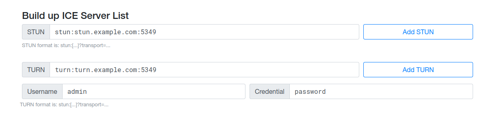
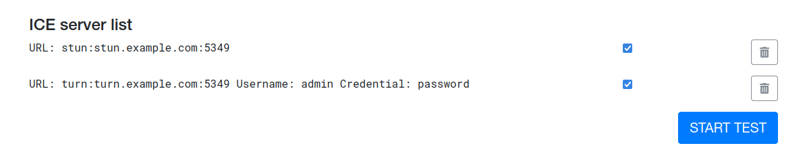
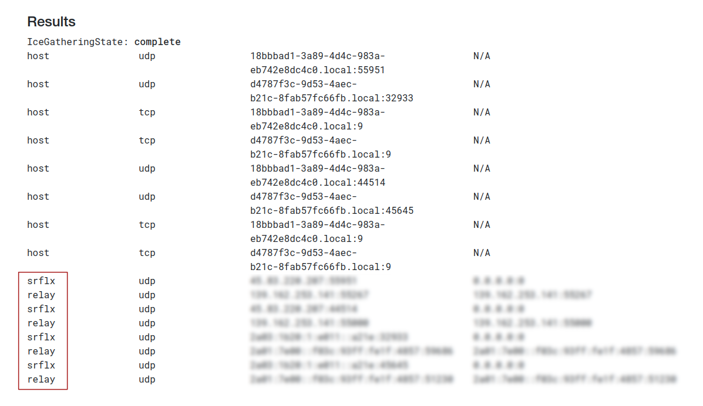

| Updated 31.01.2023 | Languages: [EN](/docs/WEBRTC.md), [FR](/docs/lang/fr/WEBRTC.md), [CZ](/docs/lang/cs/WEBRTC.md) JA |

# SimpleXチャットでカスタムWebRTC ICEサーバーを使用する

## STUN/TURNサーバーをデプロイする

このガイドでは、最も機能的で実績のあるSTUN/TURNサーバーを[`coturn`](https://github.com/coturn/coturn)と[`Ubuntu 20.04 LTS`](https://ubuntu.com/download/server) ディストリビューションを使用して実装します。

0. `stun.$YOUR_DOMAIN`と`turn.$YOUR_DOMAIN`の証明書を取得します。

   ここでは[Let's Encrypt](https://letsencrypt.org/getting-started/)を使用します。

1. リポジトリから`coturn`パッケージを取得してインストールします。

```sh
apt update && apt install coturn`
```

2.  `/etc/default/coturn`から`TURNSERVER_ENABLED=1`をコメントアウトします。

```sh
sed -i '/TURN/s/^#//g' /etc/default/coturn
```

3. `/etc/turnserver.conf`で`coturn`を設定します

   各オプションのコメントも参照してください。

```sh
# tls 用に 443 ポートもリッスンする 
alt-tls-listening-port=443
# TURNメッセージでフィンガープリントを使用する
fingerprint
# ロングターム認証メカニズムを使用する
lt-cred-mech
# クレデンシャル
user=$YOUR_LOGIN:$YOUR_PASSWORD
# サーバードメイン
server-name=$YOUR_DOMAIN
# 明示的なオリジン/レルムの関係が見つからなかった場合に、ユーザーに使用されるデフォルトのレルム 
realm=$YOUR_DOMAIN
# 証明書へのパス。cotunプロセスのユーザー/グループで読み取り可能か確認してください
cert=/var/lib/turn/cert.pem
pkey=/var/lib/turn/key.pem
# 2066ビットの定義済みDH TLSキーを使う
dh2066
# Journalctlにログを記録する
syslog
# coturnサービスを実行するユーザー/グループ
proc-user=turnserver
proc-group=turnserver
# 弱い暗号化を無効にする
no-tlsv1
no-tlsv1_1
no-tlsv1_2
```

4. `coturn`サービスを開始して有効にします:

```sh
systemctl enable coturn && systemctl start coturn
```

5. `ufw`を使用している場合は、必要に応じて関連するポートを開きます:

- **3478** – "plain" TURN/STUN;
- **5349** – TURN/STUN over TLS;
- **443** – TURN/STUN over TLS, ファイアウォールをバイパス;
- **49152:65535** – CoturnがデフォルトでTURNリレーに使用するポート範囲。

```sh
# Ubuntu向け
sudo ufw allow 3478 && \
sudo ufw allow 443 && \
sudo ufw allow 5349 && \
sudo ufw allow 49152:65535/tcp && \
sudo ufw allow 49152:65535/udp

# Fedora向け
sudo firewall-cmd --permanent --add-port=443/tcp && \
sudo firewall-cmd --permanent --add-port=443/udp && \
sudo firewall-cmd --permanent --add-port=5349/tcp && \
sudo firewall-cmd --permanent --add-port=5349/udp && \
sudo firewall-cmd --permanent --add-port=49152:65535/tcp && \
sudo firewall-cmd --permanent --add-port=49152:65535/udp && \
sudo firewall-cmd --reload
```

## モバイルアプリを構成する

サーバーを使用するようにモバイル アプリを設定します:

1. `設定 / ネットワークとサーバー / WebRTC ICE サーバー`を開き、`ICE サーバーの構成`に切り替えます。

2. フィールドにすべてのサーバーアドレスを1行に1つずつ入力します（例えば、サーバーがポート5349を使用している場合）:

```
stun:stun.example.com:5349
turn:username:password@turn.example.com:5349
```

これで、私たちのサーバーとデータを共有することなく (E2E 暗号化メッセージでの連絡先とのキー交換を除く)、独自のサーバーを介して音声通話やビデオ通話を行うことができるようになりました。

## トラブルシューティング

- **サーバーが利用可能かどうかを確認**:

  ターミナルで次のコマンドを実行します:

  ```sh
  ping <your_ip_or_domain>
  ```

  パケットが送信されていれば、サーバーは稼働しています。

- **ポートが開いているかどうかを確認**:

  ターミナルで次のコマンドを実行します:

  ```sh
  nc -zvw10 <your_ip_or_domain> 443 5349
  ```

  結果:

  ```
  Connection to <your_ip_or_domain> 443 port [tcp/https] succeeded!
  Connection to <your_ip_or_domain> 5349 port [tcp/*] succeeded!
  ```

- **STUN/TURN接続をテスト**:

  1. [IceTest](https://icetest.info/)へ移動します。

  2. **Build up ICE Server List**セクションで、次を追加します:

     

     - `STUN: stun:<your_ip_or_domain>:<port>`と入力し`Add STUN`を押す
     - `TURN: turn:<your_ip_or_domain>:<port>`, `Username: <your_login>`, `Credential: <your_pass>`と入力し`Add TURN`を押す

     ここでの`<port>`は443または5349です。

  3. **ICE server list**セクションにサーバーが表示されているはずです。すべてが正しく設定されている場合は、`Start test`をクリックします:

     

  4. **Results**セクションには、このように表示されるはずです：

     

     結果に`srflx`と`relay`の候補が表示されれば、すべてが正しく設定されています。

