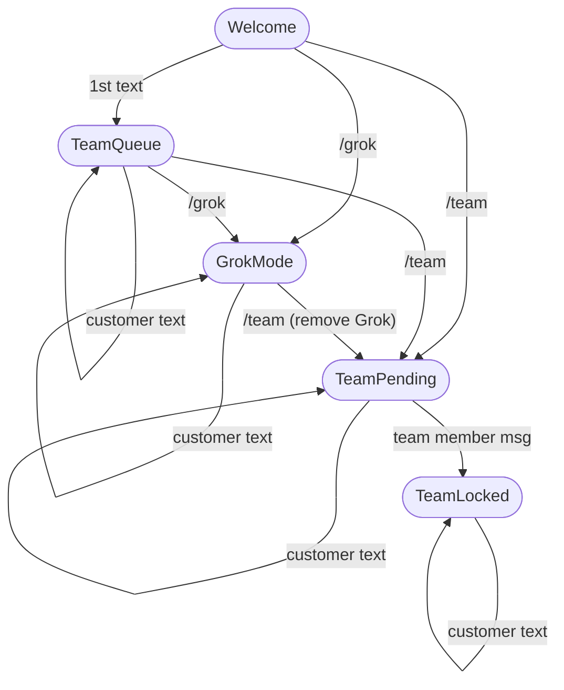
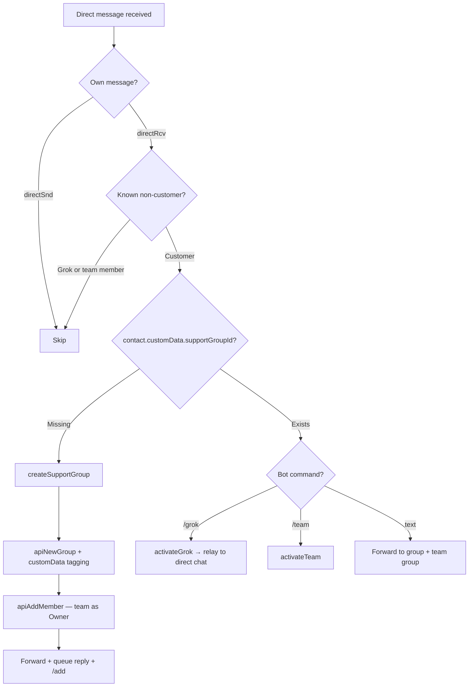
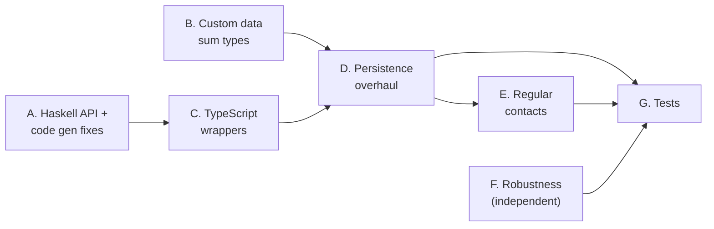

# Support Bot: Implementation Plan

## Table of Contents

- [1. Architecture](#1-architecture)
- [2. Plan](#2-plan)
  - [A. Haskell API & Code Generation](#a-haskell-api--code-generation)
  - [B. Custom Data Sum Types](#b-custom-data-sum-types)
  - [C. TypeScript API Wrappers](#c-typescript-api-wrappers)
  - [D. Persistence Overhaul](#d-persistence-overhaul)
  - [E. Regular Contact Support](#e-regular-contact-support)
  - [F. Robustness](#f-robustness)
  - [G. Tests](#g-tests)
- [3. Implementation Order](#3-implementation-order)

---

## 1. Architecture

Two SimpleX Chat instances (separate databases) in one process:
- **Main bot** (`data/bot_*`): Accepts customers via business address or regular contact address, manages groups, forwards messages
- **Grok agent** (`data/grok_*`): Separate identity, joins customer groups to send AI responses

### Source Files

| File | Purpose |
|------|---------|
| `src/index.ts` | Entry point, dual ChatApi init, startup, event wiring, shutdown |
| `src/bot.ts` | `SupportBot` class: event handlers, message routing, Grok/team activation |
| `src/grok.ts` | `GrokApiClient`: xAI API wrapper, system prompt with docs context |
| `src/config.ts` | CLI arg parsing, `GROK_API_KEY` env var |
| `src/startup.ts` | `resolveDisplayNameConflict()`: direct SQLite access (to be removed) |
| `src/messages.ts` | User-facing message templates |
| `src/state.ts` | `GrokMessage` type |
| `src/util.ts` | `isWeekend()`, `log()`, `logError()` |

### State Machine



State is derived from group composition + chat history — not stored explicitly. The code uses 3 internal labels (`GROK`, `TEAM`, `QUEUE`) in prefixed headers on messages forwarded to the team group; Welcome/TeamPending/TeamLocked are implicit from message history. Note: there is no transition from GrokMode back to TeamQueue — the only commands are `/grok` and `/team`, so once Grok is active, the customer either continues with Grok or moves to team. TeamLocked is terminal (once a team member engages, the group stays locked).

**Bug:** `activateTeam` (bot.ts:933) accepts `_grokMember` but ignores it — never calls `apiRemoveMembers`. Grok stays in the group until a team member sends a message, which reactively triggers removal (bot.ts:647-659). See section F for the fix.

### Business Address Flow (existing)

1. Customer connects → platform auto-creates business group with welcome message
2. Customer sends first message → bot forwards to team group (prefixed), sends queue reply, sends `/add` to team group
3. `/grok` → bot invites Grok agent, calls xAI API, Grok responds as group member
4. `/team` → bot should remove Grok, invites team member (Grok removal currently broken — see bug callout above)
5. Team member messages → "team locked"

### Regular Contact Flow (target)

1. Customer connects → `contactConnected` → bot sends welcome
2. Customer sends direct message → bot creates support group, invites team member as **owner**
3. Bot forwards customer messages into group (as `groupSnd` with prefix)
4. Team member replies in group → bot relays to customer's direct chat
5. `/grok` in direct chat → bot invites Grok into support group, relays responses to direct chat
6. `/team` in direct chat → bot removes Grok, invites team member

| Aspect | Business Address | Regular Contact |
|--------|-----------------|-----------------|
| Group creation | Platform auto-creates | Bot creates via `apiNewGroup` |
| Customer in group | Yes (member) | No (direct chat only) |
| Team sees customer | Directly in group | Bot forwards (prefixed) |
| Team replies | Customer sees in group | Bot relays to direct chat |
| Team member role | Owner | Owner |
| Grok responses | Customer sees in group | Bot relays to direct chat |
| Customer identification | `businessChat.customerId` | `customData.contactId` on group |
| State derivation | `groupRcv` from customer | `groupSnd` from bot (forwarded) |

### Grok Join Protocol

Two-phase confirmation using protocol-level `memberId` (same across both databases):

1. Main bot: `apiAddMember(groupId, grokContactId, GroupMemberRole.Member)` → returns `GroupMember`
2. Stores `pendingGrokJoins.set(member.memberId, mainGroupId)` (`memberId` is a protocol-level `string`, distinct from `groupMemberId` which is a DB-local `number`)
3. Grok receives `receivedGroupInvitation` → matches `memberId` → `apiJoinGroup` → sets bidirectional maps
4. Grok receives `connectedToGroupMember` → resolves waiter
5. Main bot gathers customer messages, calls xAI API, Grok sends response

Race condition guard: after API call, re-checks group composition — if team member appeared, removes Grok. See section F for the fix to a related race in the join protocol.

---

## 2. Plan

### A. Haskell API & Code Generation

**Why:** The bot currently uses raw `sendChatCmd` strings for several operations because typed API wrappers don't exist. This is fragile — command strings aren't type-checked, and changes to the Haskell parser silently break them. Additionally, two bugs in the auto-generation pipeline (`APIListGroups` parser missing a space, `ChatRef.cmdString` using `.toString()` instead of `.cmdString()`) produce broken command strings.

#### New commands

**`APISetGroupCustomData`** — `/_set custom #<groupId> [<json>]`

Calls existing `setGroupCustomData` (Store/Groups.hs). Returns `CRCmdOk`. Omit JSON to clear.

**`APISetContactCustomData`** — `/_set custom @<contactId> [<json>]`

Calls existing `setContactCustomData` (Store/Direct.hs). Returns `CRCmdOk`. Omit JSON to clear.

Implementation follows the `APISetChatUIThemes` pattern:

**Controller.hs** — add to `ChatCommand`:
```haskell
| APISetGroupCustomData GroupId (Maybe CustomData)
| APISetContactCustomData ContactId (Maybe CustomData)
```

**Commands.hs** — parsers:
```haskell
"/_set custom #" *> (APISetGroupCustomData <$> A.decimal <*> optional (A.space *> jsonP))
"/_set custom @" *> (APISetContactCustomData <$> A.decimal <*> optional (A.space *> jsonP))
```

**Commands.hs** — processors:
```haskell
APISetGroupCustomData groupId customData_ -> withUser $ \user -> do
  withFastStore $ \db -> do
    g <- getGroupInfo db vr user groupId
    liftIO $ setGroupCustomData db user g customData_
  ok user
APISetContactCustomData contactId customData_ -> withUser $ \user -> do
  withFastStore $ \db -> do
    ct <- getContact db vr user contactId
    liftIO $ setContactCustomData db user ct customData_
  ok user
```

**chatCommandsDocsData** (bots/src/API/Docs/Commands.hs) — add for TypeScript auto-generation. The first two are for the new commands above. `APISetUserAutoAcceptMemberContacts` already exists in Haskell (Controller.hs:274) but is missing from the docs data, so the bot uses raw `sendChatCmd` (index.ts:136):
```haskell
("APISetGroupCustomData", [], "Set group custom data.", ["CRCmdOk", "CRChatCmdError"], [], Nothing,
  "/_set custom #" <> Param "groupId" <> Optional "" (" " <> Json "$0") "customData"),
("APISetContactCustomData", [], "Set contact custom data.", ["CRCmdOk", "CRChatCmdError"], [], Nothing,
  "/_set custom @" <> Param "contactId" <> Optional "" (" " <> Json "$0") "customData"),
("APISetUserAutoAcceptMemberContacts", [], "Set auto-accept member contacts.", ["CRCmdOk", "CRChatCmdError"], [], Nothing,
  "/_set accept member contacts " <> Param "userId" <> " " <> OnOff "autoAccept")
```

#### Bug fixes

**`APIListGroups` parser space bug** (Commands.hs:4647): The parser expects `/_groups<userId>` (no space), but the docs syntax generates `/_groups <userId>` (with space). The auto-generated `cmdString` produces the space-separated form, so `apiListGroups` fails at the parser level — the bot currently works around this with a raw `sendChatCmd("/_groups${userId}")` that omits the space (index.ts:178). Fixing the parser to require the space aligns it with the generated `cmdString`, letting the typed wrapper work. Fix:
```diff
- "/_groups" *> (APIListGroups <$> A.decimal <*> ...
+ "/_groups " *> (APIListGroups <$> A.decimal <*> ...
```

**`ChatRef.cmdString` `.toString()` bug** (Syntax.hs:114-116): The auto-generation pipeline produces TypeScript `cmdString` functions that build command strings like `/_get chat #123 count=10`. When a type like `ChatType` has its own syntax (e.g., `#` for group, `@` for direct), the code generator needs to emit `ChatType.cmdString(chatType)` which returns `"#"`. Instead, `toStringSyntax` emits `.toString()`, which returns the human-readable enum string `"group"` — producing broken commands like `/_get chat group123 count=10` instead of `/_get chat #123 count=10`. This breaks any auto-generated wrapper that references a type with syntax (`ChatRef`, `ChatType`, `ChatDeleteMode`, `CreatedConnLink`, `GroupChatScope`). Fix:
```diff
  toStringSyntax (APITypeDef typeName _)
-   | typeHasSyntax typeName = paramName' useSelf param p <> ".toString()"
+   | typeHasSyntax typeName = typeName <> ".cmdString(" <> paramName' useSelf param p <> ")"
    | otherwise = paramName' useSelf param p
```

#### APIGetChat

Currently commented out in `chatCommandsDocsData`. The bot uses raw `sendChatCmd("/_get chat #${groupId} count=${count}")`. Two options:

1. **Uncomment** in docs with full syntax + dependent types (`ChatPagination`, `NavigationInfo`, `CRApiChat`)
2. **Manual wrapper** in ChatApi/ChatClient that constructs the command string directly (bot only needs `count=N`)

**Decision: option 2** — manual wrapper, simpler, avoids uncommenting a full dependency chain. The wrapper constructs `/_get chat ${ChatType.cmdString(chatType)}${chatId} count=${count}` and parses the `CRApiChat` response.

---

### B. Custom Data Sum Types

**Why:** `customData` on `GroupInfo` and `Contact` is typed as `object | undefined` — opaque JSON with no compile-time guarantees. The bot needs to store structured routing data (which group belongs to which contact, which group is the team group, etc.) and read it back safely after restarts. Discriminated unions give: exhaustive `switch` matching, compile-time field access checks, and self-documenting JSON schemas.

These types are specific to the support bot — they live in `apps/simplex-support-bot/src/types.ts`, not in the shared library. The library's `customData` stays as generic `object | undefined`.

#### TypeScript definitions

```typescript
// SupportGroupData — stored in GroupInfo.customData

export type SupportGroupData =
  | SupportGroupData.Customer
  | SupportGroupData.CustomerContact
  | SupportGroupData.Team

export namespace SupportGroupData {
  export type Tag = "customer" | "customerContact" | "team"

  interface Interface {
    type: Tag
  }

  export interface Customer extends Interface {
    type: "customer"
    agentLocalGroupId?: number
    lastProcessedItemId?: number
  }

  export interface CustomerContact extends Interface {
    type: "customerContact"
    contactId: number
    agentLocalGroupId?: number
    lastProcessedItemId?: number
  }

  export interface Team extends Interface {
    type: "team"
  }
}

// SupportContactData — stored in Contact.customData

export type SupportContactData =
  | SupportContactData.Agent
  | SupportContactData.Customer

export namespace SupportContactData {
  export type Tag = "agent" | "customer"

  interface Interface {
    type: Tag
  }

  export interface Agent extends Interface {
    type: "agent"
  }

  export interface Customer extends Interface {
    type: "customer"
    supportGroupId: number
  }
}
```

#### JSON in DB — what each field is for

Group — **business customer** (`"customer"`):
```json
{"type": "customer", "agentLocalGroupId": 200, "lastProcessedItemId": 1234}
```
- `type: "customer"` — marks this group as a customer support group (vs team or unmanaged). Startup scans all groups for this to rebuild maps.
- `agentLocalGroupId` — the corresponding group ID in the AI agent's database. Needed to route the agent's responses back to the correct main group. Set when the agent is activated, absent otherwise.
- `lastProcessedItemId` — the last chat item the bot successfully forwarded from this group. On restart, the bot fetches items after this ID and forwards any it missed. See section D for rationale.

Group — **regular contact customer** (`"customerContact"`):
```json
{"type": "customerContact", "contactId": 42, "agentLocalGroupId": 200, "lastProcessedItemId": 1234}
```
- `type: "customerContact"` — same as `"customer"` but for regular contacts (no `businessChat` field). The bot created this group, not the platform.
- `contactId` — the direct-chat contact this group was created for. Needed for reverse forwarding: when a team member replies in this group, the bot relays the message to this contact's direct chat.
- `agentLocalGroupId` — same as above.
- `lastProcessedItemId` — same as above.

Group — **team**:
```json
{"type": "team"}
```
- `type: "team"` — identifies the single team coordination group. Startup finds this to know where to forward customer notifications. Replaces `teamGroupId` from `_state.json`.

Contact — **AI agent**:
```json
{"type": "agent"}
```
- `type: "agent"` — identifies which contact is the AI agent. Needed on startup to rebuild the agent contact reference, and to filter out the agent from customer routing (don't create support groups for infrastructure contacts). Replaces `grokContactId` from `_state.json`.

Contact — **regular customer**:
```json
{"type": "customer", "supportGroupId": 100}
```
- `type: "customer"` — marks this contact as a customer (tag is unambiguous — `SupportContactData` is only stored on contacts, `SupportGroupData` on groups).
- `supportGroupId` — the support group created for this contact. Needed to route incoming direct messages to the correct group without scanning all groups.

#### Type-safe access

```typescript
function isSupportGroupData(cd: object | undefined): cd is SupportGroupData {
  const d = cd as SupportGroupData | undefined
  if (!d?.type) return false
  switch (d.type) {
    case "customer":
    case "customerContact":
    case "team":
      return true
    default: {
      const _: never = d // compile error if a variant is added without updating this switch
      return false
    }
  }
}
```

The `never` assertion in `default` ensures exhaustiveness — adding a variant without updating this switch causes a compile error.

---

### C. TypeScript API Wrappers

**Why:** Raw `sendChatCmd` calls are string-based — no type checking, break silently when command syntax changes. Every bot operation should go through a typed wrapper.

The bot uses native `ChatApi` from the `simplex-chat` npm package. New wrappers to add:

| Method | Status | Notes |
|--------|--------|-------|
| `apiGetChat(chatType, chatId, count)` | Missing | Manual wrapper (constructs `/_get chat` string, per section A) |
| `apiSetGroupCustomData(groupId, data?: object)` | Missing | Auto-generated from step A. Bot passes `SupportGroupData` (subtype of `object`) |
| `apiSetContactCustomData(contactId, data?: object)` | Missing | Auto-generated from step A. Bot passes `SupportContactData` |
| `apiSetAutoAcceptMemberContacts(userId, onOff)` | Missing | Auto-generated from step A |
| `apiListGroups(userId)` | Broken | Parser bug (step A fix) |

Raw commands to replace:

| Current | Replacement |
|---------|-------------|
| `sendChatCmd("/_get chat #${groupId} count=${count}")` (bot.ts:316, bot.ts:1222) | `apiGetChat(ChatType.Group, groupId, count)` |
| `sendChatCmd("/_groups${userId}")` (index.ts:178) | `apiListGroups(userId)` |
| `sendChatCmd("/_set accept member contacts ${userId} on")` (index.ts:136) | `apiSetAutoAcceptMemberContacts(userId, true)` |
| `sendChatCmd("/_create member contact #${groupId} ${memberId}")` (bot.ts:526) | Keep raw — low priority |
| `sendChatCmd("/_invite member contact @${contactId}")` (bot.ts:536) | Keep raw — low priority |

---

### D. Persistence Overhaul

**Why:** The bot currently persists state in two places: `_state.json` (team group ID, Grok contact ID, Grok group mappings) and in-memory maps (forwarded items, join resolvers). Both are problematic:
- `_state.json` uses non-atomic `writeFileSync` — crash during write corrupts state
- If the DB is restored from backup but `_state.json` isn't (or vice versa), IDs desync and the bot silently breaks
- In-memory maps (`grokGroupMap`, `reverseGrokMap`) are lost on restart — Grok sessions in progress fail

The fix: store all persistent state in the SimpleX DB itself via `customData` on groups and contacts. The DB is already backed up, replicated, and crash-safe. `_state.json` is eliminated entirely.

#### What changes

- **Delete** `_state.json` support — the full `BotState` interface (index.ts:12-20) and all its fields:
  - `teamGroupId`, `grokContactId` → derived from `customData` on startup
  - `grokGroupMap` → derived from `customData.agentLocalGroupId` on startup
  - `newItems` (team notification tracking) → ephemeral, rebuilt from chat history or dropped
  - `groupLastActive` → ephemeral, rebuilt from chat history timestamps
  - `groupMetadata` (`firstContact`, `msgCount`, `customerName`) → derivable from chat history + group member info on startup
  - `groupPendingInfo` (`lastEventType`, `lastEventFrom`, `lastEventTimestamp`, `lastMessageFrom`) → ephemeral notification state, rebuilt from recent chat history on startup
- **Delete** `readState`/`writeState` functions and all `on*Changed` callbacks (`onGrokMapChanged`, `onNewItemsChanged`, `onGroupLastActiveChanged`, `onGroupMetadataChanged`, `onGroupPendingInfoChanged`)
- **Delete** `startup.ts` (direct SQLite access via `execSync`/`sqlite3` CLI) — `bot.run()` with `useBotProfile: true` handles display name conflicts natively
- **Tag on creation:** team group → `{type: "team"}`, agent contact → `{type: "agent"}`, customer groups → `{type: "customer"}` or `{type: "customerContact", contactId}`
- **Store** `agentLocalGroupId` in group `customData` on agent join
- **Track** `lastProcessedItemId` in group `customData` — updated after each successful forward. On restart, the bot fetches items after this ID and forwards any it missed. This avoids needing a `customData` column on `ChatItem` (which would require a DB migration on every SimpleX Chat client, not just the bot) and avoids per-item write pairs (marking pending before send, clearing after). One write per forwarded message is enough — if the bot crashes mid-forward, it just re-forwards from the last checkpoint.

#### Startup recovery (replaces _state.json)

Run steps 1-7 before wiring event handlers — all maps must be fully populated before events fire.

Note: `apiListGroups` returns `GroupInfoSummary[]` (properties nested under `.groupInfo`). `apiListContacts` returns `Contact[]` directly.

1. `apiListGroups(userId)` → find team group by `.groupInfo.customData.type === "team"`
2. `apiListContacts(userId)` → find agent contact by `.customData.type === "agent"`
3. Build `grokGroupMap` from groups where `.groupInfo.customData.agentLocalGroupId` is set
4. Build `reverseGrokMap` as inverse of `grokGroupMap`
5. Build `contactToGroupMap` from contacts where `customData.type === "customer"` (has `supportGroupId`)
6. Validate all maps — remove entries where the referenced group/contact no longer exists. Downgrade stale `customData` rather than clearing it: a `customerContact` group whose `contactId` points to a deleted contact gets downgraded to `{type: "customer"}` via `apiSetGroupCustomData(groupId, {type: "customer"})` — this preserves the group as a known support group while removing the dangling reference. A `customer` contact whose `supportGroupId` points to a deleted group gets its `customData` cleared via `apiSetContactCustomData(contactId)`. Covers entities deleted while bot was offline.
7. For each customer group, `apiGetChat(ChatType.Group, groupId, 100)`:
   - Forward any items after `lastProcessedItemId` that were missed (crash recovery)
   - Rebuild `welcomeCompleted`, `groupLastActive`, `groupMetadata`, and `groupPendingInfo`
   - Best-effort: if a group has no recent history, maps start empty (first new message repopulates)

#### Ephemeral state (RAM only)

| Map | Purpose | Recovery |
|-----|---------|----------|
| `pendingGrokJoins` | In-flight Grok invitations | User retries `/grok` |
| `grokJoinResolvers` | Promise callbacks for Grok join | Timeout after 30s |
| `grokGroupMap` | `mainGroupId → agentLocalGroupId` | Rebuilt on startup |
| `reverseGrokMap` | `agentLocalGroupId → mainGroupId` | Rebuilt on startup |
| `contactToGroupMap` | `contactId → supportGroupId` | Rebuilt on startup |
| `grokFullyConnected` | `Set<groupId>` — groups where Grok's `connectedToGroupMember` has fired | User retries `/grok` |
| `pendingTeamDMs` | `Map<contactId, string>` — pending DMs for newly-created team member contacts | Ephemeral, safe to lose |
| `pendingOwnerRole` | `Set<"groupId:groupMemberId">` — pending owner role assignments | Ephemeral, safe to lose |
| `pendingGroupCreations` | `Set<contactId>` guard against duplicates (new — section E) | Ephemeral, safe to lose (clean up contactId on success or failure) |
| `welcomeCompleted` | `Set<groupId>` — tracks groups past welcome state | Ephemeral, rebuilt from chat history on startup |
| `groupLastActive` | `Map<groupId, timestamp>` — last activity per customer group | Rebuilt from chat history timestamps on startup |
| `groupMetadata` | `Map<groupId, GroupMetadata>` — `{firstContact, msgCount, customerName}` per group | Rebuilt from chat history + group member info on startup |
| `groupPendingInfo` | `Map<groupId, GroupPendingInfo>` — `{lastEventType, lastEventFrom, lastEventTimestamp, lastMessageFrom}` | Rebuilt from recent chat history on startup |

---

### E. Regular Contact Support

**Why:** The bot currently only works with business address groups where the platform auto-creates a group and the customer is a group member. For regular contacts (legacy or non-business address), the customer sends direct messages — there's no group, no `businessChat` field, and all the existing guards silently drop the message. Supporting regular contacts requires a parallel message flow where the bot creates a support group itself and relays messages between the customer's direct chat and the group.

Note: The codebase already has partial support (`onContactConnected` handler, `processChatItem` routing for direct messages, `addOrFindTeamMember` using `Owner` role). The work below builds on that foundation.

#### `processDirectMessage(contact, chatItem)`



1. Skip `directSnd` (bot's own messages)
2. Skip non-customer contacts (Grok agent, team members) — prevents creating support groups for infrastructure contacts
3. Look up `contact.customData` as `SupportContactData` → find existing `supportGroupId`
4. If no group → `createSupportGroup(contact)`:
   - Guard first: if `contactId` already in `pendingGroupCreations`, return (another handler is creating it). Otherwise add `contactId` to `pendingGroupCreations` before any async work.
   - `apiNewGroup(userId, {displayName: "Direct chat with <name>", fullName: "", groupPreferences: {files: {enable: GroupFeatureEnabled.On}, directMessages: {enable: GroupFeatureEnabled.On}}})`
   - `apiSetGroupCustomData(groupId, {type: "customerContact", contactId})`
   - `apiSetContactCustomData(contactId, {type: "customer", supportGroupId: groupId})`
   - `apiAddMember(groupId, teamMembers[0].id, GroupMemberRole.Owner)`
   - Remove `contactId` from `pendingGroupCreations` in a `finally` block (clean up on success or failure)
5. Forward to support group (prefixed `groupSnd`) + team group
6. First message → send queue reply to direct chat, send `/add` to team group
7. `/grok` → `activateGrok(supportGroupId)` — sets `agentLocalGroupId` in group `customData` on agent join (per section D), relay response to direct chat
8. `/team` → `activateTeam(supportGroupId)`

#### Reverse forwarding (group → direct chat)

When a `groupRcv` message arrives in a group with `customData.type === "customerContact"`:
- The customer isn't in this group — they're in a direct chat with the bot
- Team member or Grok message → bot relays to customer's direct chat via `apiSendTextMessage([ChatType.Direct, contactId], text)`. The customer sees all relayed messages from the bot — this is correct, the bot is the intermediary.
- Bot's own `groupSnd` messages (forwarded customer messages) are skipped to prevent echo loops

#### Code changes

**Business-only guards to replace** (4 sites — each currently returns early for non-business groups):
- `onLeftMember` (bot.ts:355): `if (!bc) return`
- `onChatItemUpdated` (bot.ts:397): `if (!groupInfo.businessChat) return`
- `onChatItemReaction` (bot.ts:437): `if (!groupInfo?.businessChat) return`
- `processChatItem` (bot.ts:610): `if (!groupInfo.businessChat) return`

Replace each with `customData`-based routing using `isSupportGroupData` type guard. After the guard, `businessChat.customerId` is used at 5 additional sites (bot.ts:358, 445, 616, 809, 857) — replace with `customData`-based identification. The downstream helpers `getCustomerMessages` (bot.ts:296) and `getGrokHistory` (bot.ts:280) also compare `memberId === customerId` internally — these are adapted in the dual-mode section below.

**Direct message handler** (bot.ts:584-598): Currently sends "use my business address" rejection to ALL direct messages, including from Grok and team members. Replace entire block with `processDirectMessage` flow.

**Adapt `getCustomerMessages`/`getGrokHistory`** for dual mode:
  - Business: filter `groupRcv` where `ci.chatDir.groupMember.memberId === customerId` (customer is in the group, `memberId` is the protocol-level string on `GroupMember`)
  - Regular: filter `groupSnd` (bot's forwarded messages with prefix), strip prefix (customer isn't in the group — bot forwarded their messages)
  - Note: `getGrokHistory` in regular mode must handle mixed `groupRcv` (Grok's messages) + `groupSnd` (bot's forwarded customer messages) in the same loop

**Event handlers to extend:**
- `contactConnected` (bot.ts:495): Currently only handles pending team DMs. Add: if contact is not team/Grok, send welcome message (reuse `welcomeMessage` from messages.ts)
- `newChatItems` + `chatItemUpdated`: Handle direct chats (not just groups)
- `leftMember` (bot.ts:351): Add cleanup for regular contact groups — clear `customData` on the associated contact when its support group is disbanded

**Event handlers to add:**
- `groupDeleted`: Clean up maps (`grokGroupMap`, `contactToGroupMap`). For `customerContact` groups, extract `contactId` from `customData` and clear the contact's `customData` via `apiSetContactCustomData(contactId)`. For `customer` (business) groups, no contact cleanup needed — the customer is identified by `businessChat.customerId` (a group member), not a direct contact.
- `contactDeletedByContact` (CEvt, not CRResp): If the contact has `customData.type === "customer"`, remove its `contactToGroupMap` entry and delete the orphaned support group via `apiDeleteChat(ChatType.Group, supportGroupId)` (prevents both stale map entries and orphaned groups with a `contactId` pointing at a deleted contact — symmetric with `groupDeleted` which clears the contact's `customData`)

---

### F. Robustness

**Why:** The Grok API call (`grok.ts:23-30`) has no timeout — if xAI hangs, the bot blocks indefinitely, the customer sees nothing, and the support group stays in limbo. The model name is hardcoded (`grok-3`, line 29), requiring a code change to switch. The Grok join protocol has a subtle race: `connectedToGroupMember` can fire before `onGrokGroupInvitation` populates the maps, silently dropping the join confirmation. `activateTeam` has a bug where Grok is not removed (see Architecture section). Stale map entries on restart are handled by section D's startup validation (step 6).

- **Grok API timeout**: `fetch()` has no `AbortController`. Add 30s timeout:
  ```typescript
  const controller = new AbortController()
  const timer = setTimeout(() => controller.abort(), 30000)
  try {
    const resp = await fetch(url, {...opts, signal: controller.signal})
  } finally {
    clearTimeout(timer)
  }
  ```
- **Fix `activateTeam` Grok removal** (bot.ts:933): Currently ignores `_grokMember` parameter — Grok stays in the group until a team member reactively triggers removal (bot.ts:647-659). Fix: call `apiRemoveMembers(groupId, [grokMember.groupMemberId])` immediately in `activateTeam`.
- **Configurable Grok model**: `grok-3` is hardcoded at `grok.ts:29`. Add `--grok-model` CLI arg to `config.ts`, pass to `GrokApiClient` constructor.
- **Grok join race**: If `connectedToGroupMember` fires before `onGrokGroupInvitation` sets maps, use `pendingGrokJoins` as fallback.
- **Add try/catch to `onChatItemReaction`** (bot.ts:432): Unlike `onNewChatItems`, this handler has no error wrapping — a bad cast at line 437 can throw unhandled.

---

### G. Tests

**Why:** The bot has zero tests today. Every change (persistence overhaul, regular contact support, Grok race fixes) modifies core routing logic — without tests, regressions are invisible until a customer reports them. The test list targets the highest-risk paths: persistence recovery (data loss on restart), message routing (wrong recipient), and race conditions (Grok join timing).

- Persistence recovery from `customData` (simulate restart, rebuild maps from group/contact listing)
- Regular contact flow end-to-end (direct message → group creation → forward → team reply → relay back)
- `/grok` and `/team` commands in direct chat (not just group)
- `contactConnected` sends welcome message to new non-team/non-Grok contacts
- Contact filtering (team member / Grok direct messages → ignored, not routed as customer)
- Team member added as Owner in regular contact groups (not Member)
- Both modes coexisting (business address + regular contact customers simultaneously)
- Grok join race conditions (`connectedToGroupMember` before maps are set)
- `customData` tagging on creation (group and contact custom data set atomically with creation)
- `/team` removes Grok immediately (not deferred until team member sends message)
- `groupDeleted` event cleans up maps and clears `customData` on associated contact
- `contactDeletedByContact` event cleans up `contactToGroupMap` and deletes orphaned support group
- `leftMember` event clears `customData` on associated contact for regular contact groups
- Reverse forwarding: team/Grok messages in `customerContact` groups relayed to direct chat; bot's own `groupSnd` skipped (echo-loop prevention)
- Grok API timeout: fetch aborts after 30s, customer receives error message (not indefinite hang)

---

## 3. Implementation Order



| Order | Section | Depends on | Files |
|-------|---------|------------|-------|
| 1 | A. Haskell API | — | Controller.hs, Commands.hs, Docs/Commands.hs, Syntax.hs |
| 2 | B. Sum types | — | types.ts (new, in support bot) |
| 3 | C. Wrappers | A | simplex-chat (npm) |
| 4 | D. Persistence | B, C | index.ts, bot.ts; delete startup.ts |
| 5 | E. Regular contacts | D | bot.ts, index.ts |
| — | F. Robustness | — | grok.ts, bot.ts, config.ts |
| 6 | G. Tests | D, E, F | bot.test.ts |
