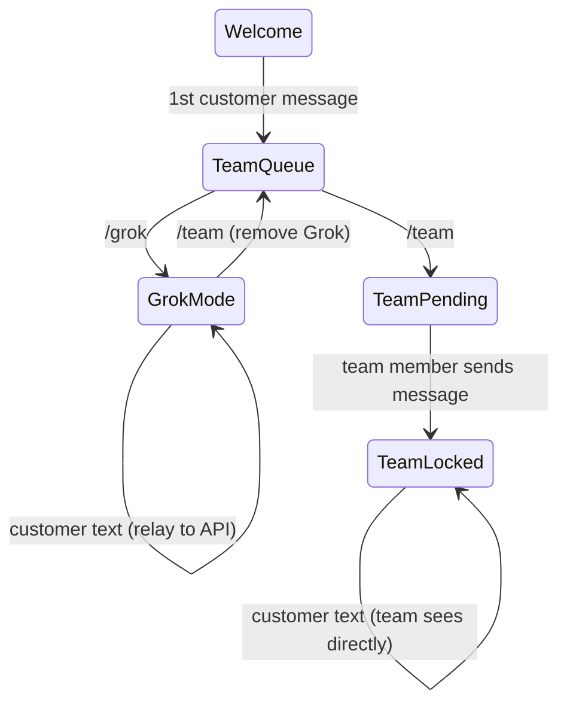
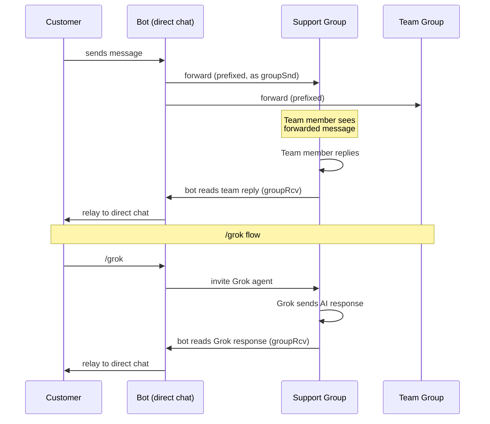
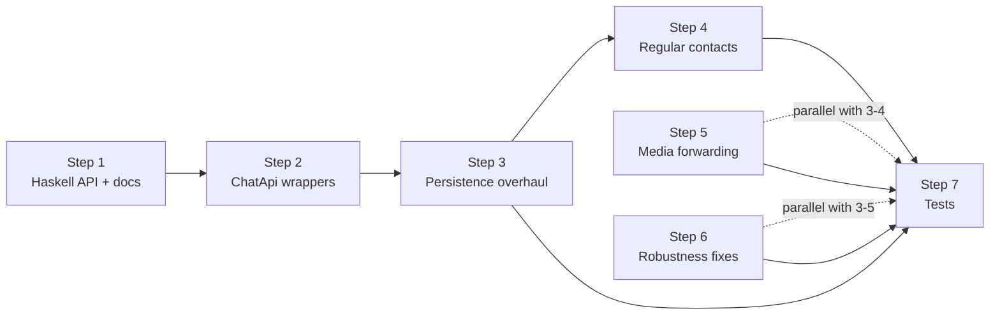

# Support Bot: Analysis & Implementation Plan

## Table of Contents

- [1. Architecture](#1-architecture)
  - [Source Files](#source-files)
  - [State Machine](#state-machine-both-modes)
  - [Business Address Flow](#business-address-flow-existing)
  - [Regular Contact Flow](#regular-contact-flow-not-yet-implemented)
  - [Grok Join Protocol](#grok-join-protocol)
  - [Current In-Memory State](#current-in-memory-state)
  - [Current Event Handlers](#current-event-handlers)
  - [Current Commands](#current-commands)
  - [Startup Sequence](#startup-sequence-indexts)
- [2. Issues](#2-issues)
  - [Functional Gaps](#functional-gaps)
  - [Business-Only Guards](#business-only-guards-block-regular-contact-support)
  - [Persistence](#persistence)
  - [Missing API Methods / Bugs](#missing-api-methods--bugs)
  - [Robustness](#robustness)
- [3. Required API Changes](#3-required-api-changes)
  - [3.1 Haskell Chat Core — New Commands](#31-haskell-chat-core--new-commands)
  - [3.2 Bot API Docs — Auto-Generation Pipeline](#32-bot-api-docs--auto-generation-pipeline)
  - [3.3 ChatApi / ChatClient Wrapper Methods](#33-chatapi--chatclient-wrapper-methods)
  - [3.4 No Raw Commands](#34-no-raw-commands)
- [4. Persistent State via customData](#4-persistent-state-via-customdata)
  - [TypeScript Interfaces](#typescript-interfaces)
  - [Schema](#schema)
  - [Startup Recovery](#startup-recovery)
  - [customData Write Pattern](#customdata-write-pattern)
  - [Ephemeral State](#ephemeral-state-ram-only)
- [5. Regular Contact Support](#5-regular-contact-support)
  - [Message Flow](#message-flow)
  - [processDirectMessage](#processdirectmessagecontact-chatitem)
  - [Reverse Forwarding](#reverse-forwarding-group--direct-chat)
  - [Direct Chat Edit Propagation](#direct-chat-edit-propagation-customer--group)
  - [Group Edit Propagation](#group-edit-propagation-teamgrok--customer-direct-chat)
  - [activateGrok Adaptations](#activategrok-adaptations-for-regular-contacts)
  - [Code Changes Required](#code-changes-required)
- [6. Implementation Plan](#6-implementation-plan)
  - [Step 1: Haskell API](#step-1-haskell-api--customdata-write-commands--bug-fixes)
  - [Step 2: ChatApi / ChatClient wrappers](#step-2-chatapi--chatclient-wrapper-methods)
  - [Step 3: Bot persistence overhaul](#step-3-bot-persistence-overhaul)
  - [Step 4: Regular contact support](#step-4-regular-contact-support)
  - [Step 5: Media forwarding](#step-5-media-forwarding)
  - [Step 6: Robustness fixes](#step-6-robustness-fixes)
  - [Step 7: Tests](#step-7-tests)
  - [Dependency Graph](#dependency-graph)

---

## 1. Architecture

Two SimpleX Chat instances (separate databases) in one process:
- **Main bot** (`data/bot_*`): Accepts customers via business address or regular contact address, manages groups, forwards messages
- **Grok agent** (`data/grok_*`): Separate identity, joins customer groups to send AI responses

### Source Files

| File | Purpose |
|------|---------|
| `src/index.ts` | Entry point: CLI parsing, dual ChatApi init, startup sequence, event wiring, graceful shutdown |
| `src/bot.ts` | Core logic: `SupportBot` class with state derivation, event handlers, message routing, Grok/team activation |
| `src/grok.ts` | `GrokApiClient`: xAI API wrapper (`grok-3` model), system prompt construction with injected docs context |
| `src/config.ts` | `Config` interface and `parseConfig()`: CLI arg parsing, `GROK_API_KEY` env var validation |
| `src/startup.ts` | `resolveDisplayNameConflict()`: direct SQLite access to rename conflicting display names (to be removed) |
| `src/messages.ts` | All user-facing message templates: welcome, queue, grok activated, team added, team locked |
| `src/state.ts` | `GrokMessage` interface (`{role: "user"|"assistant", content: string}`) |
| `src/util.ts` | `isWeekend(timezone)`, `log()`, `logError()` helpers |

### State Machine (both modes)



State is derived from group composition + chat history — not stored explicitly.

| State | Condition |
|-------|-----------|
| Welcome | No "forwarded to the team" in bot's `groupSnd` messages |
| TeamQueue | No Grok/team member present, bot has sent queue reply |
| GrokMode | Grok contact is active member (Connected/Complete/Announced) |
| TeamPending | Team member present, hasn't sent any message |
| TeamLocked | Team member present, has sent at least one message |

### Business Address Flow (existing)

1. Customer connects to business address → platform auto-creates business group
2. Platform sends welcome message (auto-reply)
3. Customer sends first message → bot forwards to team group with `CustomerName:groupId:` prefix, sends queue reply, sends `/add` command to team group
4. `/grok` → bot invites Grok agent into group, calls xAI API, Grok sends response as group member
5. `/team` → bot removes Grok, invites team member
6. Team member messages in customer group → bot forwards to team group
7. Team member sends message → "team locked" (no more `/grok`)

### Regular Contact Flow (not yet implemented)

1. Customer connects to bot's regular address → `contactConnected` event
2. Customer sends direct message → bot creates group "Direct chat with CustomerName"
3. Bot invites team member as **owner**
4. Bot forwards customer direct messages into the group (as bot's own `groupSnd` messages with customer prefix)
5. Team member replies in group → bot forwards back to customer's direct chat
6. `/grok` in direct chat → bot invites Grok into support group, gathers forwarded customer messages, calls API, Grok sends response to group, bot relays to direct chat
7. `/team` in direct chat → bot removes Grok if present, invites team member into support group

| Aspect | Business Address | Regular Contact |
|--------|-----------------|-----------------|
| Group creation | Platform auto-creates | Bot creates via `apiNewGroup` |
| Customer in group | Yes (member) | No (direct chat only) |
| Team sees customer | Directly in group | Bot forwards to group (prefixed) |
| Team replies | Customer sees in group | Bot forwards to direct chat |
| Central team group | Messages forwarded there | Messages forwarded there |
| Team member role | Member | Owner |
| Grok responses | Sent to group directly (customer sees as member) | Bot relays from group to direct chat |
| Customer identification | `businessChat.customerId` (protocol field) | `customData.contactId` on group |
| File upload prefs | Set via `onBusinessRequest` event | Set during `createSupportGroup()` |
| State derivation | `groupRcv` from customer member | `groupSnd` from bot (forwarded msgs) |

### Grok Join Protocol

Two-phase confirmation using protocol-level `memberId` (same value across both databases):

1. Main bot: `apiAddMember(groupId, grokContactId, "member")` → gets `member.memberId`
2. Stores `pendingGrokJoins.set(memberId, mainGroupId)`
3. Grok receives `receivedGroupInvitation` → matches `memberId` → `apiJoinGroup(localGroupId)` → sets bidirectional maps
4. Grok receives `connectedToGroupMember` → resolves waiter via `reverseGrokMap`
5. Main bot continues: gathers customer messages, calls xAI API, Grok sends response

Race condition guard: after API call, re-checks group composition — if team member appeared, removes Grok and aborts.

### Current In-Memory State

| Map | Type | Persisted |
|-----|------|-----------|
| `pendingGrokJoins` | `memberId → mainGroupId` | No |
| `grokGroupMap` | `mainGroupId → grokLocalGroupId` | `_state.json` |
| `reverseGrokMap` | `grokLocalGroupId → mainGroupId` | No (derived from `grokGroupMap`) |
| `grokJoinResolvers` | `mainGroupId → () => void` | No |
| `forwardedItems` | `"groupId:itemId" → {teamItemId, prefix}` | No |

### Current Event Handlers

**Main bot:** `acceptingBusinessRequest`, `newChatItems`, `chatItemUpdated`, `leftMember`, `connectedToGroupMember`, `newMemberContactReceivedInv`

**Grok bot:** `receivedGroupInvitation`, `connectedToGroupMember`

### Current Commands

| Command | Where | Effect |
|---------|-------|--------|
| `/grok` | Customer group (teamQueue) | Invite Grok, gather messages, call API, send response |
| `/team` | Customer group (teamQueue/grokMode) | Remove Grok if present, add team member |
| `/add groupId:name` | Team group | Add sender to customer group |

### Startup Sequence (index.ts)

1. Parse config from CLI args + `GROK_API_KEY` env var
2. Read persisted state from `{dbPrefix}_state.json` (`teamGroupId`, `grokContactId`, `grokGroupMap`)
3. Init Grok agent: `ChatApi.init(grokDbPrefix)` → get/create user → `startChat()`
4. Init main bot: `bot.run()` with business address, auto-accept, commands, event handlers
5. `resolveDisplayNameConflict()` — direct SQLite access (problematic, see issue #21)
6. `sendChatCmd("/_set accept member contacts ${userId} on")` — raw command
7. Resolve Grok contact from state or auto-establish via invitation link
8. `sendChatCmd("/_groups${userId}")` — raw command workaround for parser space bug (Commands.hs:4647)
9. Resolve/create team group, ensure `directMessages: On`
10. Create ephemeral team group invite link (10-min TTL, scheduled deletion)
11. Validate team member contacts against CLI args
12. Load Grok context docs from `docs/simplex-context.md`
13. Create `SupportBot` instance, restore `grokGroupMap` from state, wire persistence callback
14. Subscribe Grok event handlers, set up graceful shutdown (SIGINT/SIGTERM)

---

## 2. Issues

### Functional Gaps

1. **No regular contact support**: `chatInfo.type !== "group"` → return (bot.ts:259). Non-business groups ignored: `if (!groupInfo.businessChat) return` (bot.ts:269). Any direct message or non-business group message is silently dropped.

2. **Text-only forwarding**: Files, images, voice silently dropped — only `ciContentText` used. Both `forwardToTeam` and `forwardToGrok` extract text only. `ComposedMessage` with `fileSource` never used.

3. **Team member selection**: Always picks `teamMembers[0]` (bot.ts:513 in `activateTeam`, bot.ts:564 in `addReplacementTeamMember`). No round-robin, load-based, or random distribution.

### Business-Only Guards (block regular contact support)

4. **`onLeftMember` business-only**: `if (!bc) return` (bot.ts:146) — member leave events for non-business groups silently ignored. Grok cleanup and team replacement won't trigger.

5. **`onChatItemUpdated` business-only**: `if (!groupInfo.businessChat) return` (bot.ts:179) — edits in non-business groups won't forward to team group.

6. **`onBusinessRequest` not applicable to regular contacts**: `acceptingBusinessRequest` event only fires for business address connections. For bot-created regular contact groups, file upload preferences must be set during `createSupportGroup()` via `apiNewGroup`/`apiUpdateGroupProfile`.

7. **`activateGrok` uses `businessChat!.customerId`** (bot.ts:414): Non-null assertion on `businessChat` — crashes if called for non-business groups. Same issue in `forwardToGrok` (bot.ts:459).

8. **`getGrokHistory`/`getCustomerMessages` assume customer is group member**: These methods filter by `groupMember.memberId === customerId` (bot.ts:80, 92). For regular contacts, customer messages are forwarded by the bot as `groupSnd` messages (with prefix), not sent directly by the customer. These methods need a separate code path for regular contacts.

9. **`isCustomer` check assumes `businessChat`** (bot.ts:275): `sender.memberId === groupInfo.businessChat.customerId` — fails for non-business groups.

### Persistence

10. **Fragile file-based persistence**: `_state.json` uses non-atomic `writeFileSync` (index.ts:24). Crash during write = corruption. No temp-file + rename pattern.

11. **State lost on restart**: `forwardedItems` (edit tracking) is in-memory only (bot.ts:28). Edits after restart silently fail — the `onChatItemUpdated` handler returns early because the forwarded item lookup misses.

12. **`forwardedItems` unbounded**: Every forward adds an entry (bot.ts:490), never removed. Memory grows linearly with conversation volume.

13. **`grokGroupMap` not validated on restore**: Stale entries (deleted groups) are loaded from `_state.json` (index.ts:256). Operations on deleted groups cause silent API failures.

14. **`_state.json` stores infrastructure IDs**: `teamGroupId` and `grokContactId` are persisted outside the DB (index.ts:37-38). If the DB is restored from backup but the state file isn't, or vice versa, they desync.

### Missing API Methods / Bugs

15. **`apiGetChat` missing from `ChatApi`**: Uses raw `sendChatCmd("/_get chat #${groupId} count=${count}")` with `as any` cast (bot.ts:107). The Haskell command exists (`APIGetChat` in Controller.hs:313, parser in Commands.hs:4489): `/_get chat <chatRef> [content=<tag>] <pagination> [search=<term>]` → `CRApiChat`. No typed wrapper available.

16. **`apiListGroups` broken — space bug in Haskell parser**: The Haskell parser (Commands.hs:4647) is `"/_groups" *> A.decimal` — missing a space after `/_groups`. The docs syntax (Commands.hs:144) correctly has `"/_groups " <> Param "userId"`, which auto-generates TypeScript `cmdString` as `'/_groups ' + self.userId` (commands.ts:541), producing `/_groups 1`. But the parser rejects this because it expects `/_groups1` (no space). **Root cause is in the Haskell parser, not the docs.** Bot works around with raw `sendChatCmd("/_groups${userId}")` (index.ts:156).

17. **No `customData` write API**: `customData` field exists on `GroupInfo` (types.ts:2445) and `Contact` (types.ts:1882). Haskell store functions exist — `setGroupCustomData` (Store/Groups.hs:2844), `setContactCustomData` (Store/Direct.hs:1015) — but no chat command wires them to the API. Already used by `simplex-directory-service` (Service.hs:790) via direct DB access — wiring to a chat command would expose it to all bots.

18. **Raw `sendChatCmd` for member contact auto-accept**: `/_set accept member contacts ${userId} on` (index.ts:114). Haskell command `APISetUserAutoAcceptMemberContacts` exists (Controller.hs:274, Commands.hs:4432) but is NOT in `chatCommandsDocsData` (only listed in the all-commands validation list at Commands.hs:395). No TypeScript interface or `ChatApi` wrapper exists.

19. **`ChatRef.cmdString()` code generator bug**: Auto-generated `ChatRef.cmdString` (types.ts:1551-1553) produces `self.chatType.toString() + self.chatId` which yields `"group123"` instead of `"#123"`. The root cause is in the TypeScript code generator (`bots/src/API/Docs/Syntax.hs:114-116`): `toStringSyntax` emits `.toString()` for types with syntax, but TypeScript enum `.toString()` returns the enum value string (`"group"`), not the command prefix (`"#"`). Should call `ChatType.cmdString(self.chatType)` instead. The `ChatRef` type syntax expression (Types.hs:217) uses `Param "chatType"` which triggers this code path. Affects `APISendMessages.cmdString` (commands.ts:99), `APIUpdateChatItem.cmdString` (commands.ts:116), `APIDeleteChatItem.cmdString` (commands.ts:132), `APIChatItemReaction.cmdString` (commands.ts:164), `APIDeleteChat.cmdString` (commands.ts:556) — all latent because the native addon `ChatApi` constructs commands internally, not via `cmdString`.

### Robustness

20. **No Grok API timeout**: `fetch()` (grok.ts:23) has no `AbortController` — hangs indefinitely on network issues. Should timeout after 30s.

21. **Direct SQLite access**: `startup.ts` shells out to `sqlite3` CLI for `resolveDisplayNameConflict` (startup.ts:15-36). SQL injection risk from display name (mitigated by single-quote escaping only). Must be removed — no direct DB access, only through API. `bot.run()` with `useBotProfile: true` already handles display name conflicts by retrying with suffixed names.

22. **Grok join race**: If `connectedToGroupMember` fires before `onGrokGroupInvitation` sets maps (bot.ts:243-252), `reverseGrokMap.get(grokGroupId)` returns `undefined` → resolver not found → 30s timeout. This can happen if the Grok agent processes events out of order.

23. **Grok model hardcoded**: `grok-3` is hardcoded in `grok.ts:29`. Should be configurable via CLI arg or env var for switching to different models.

---

## 3. Required API Changes

### 3.1 Haskell Chat Core — New Commands

**`APISetGroupCustomData`**
```
/_set custom #<groupId> [<json>]
```
Calls existing `setGroupCustomData` (Store/Groups.hs:2844). Returns `CRCmdOk`. Local DB only — no network. Omit JSON to clear (`Nothing`).

**`APISetContactCustomData`**
```
/_set custom @<contactId> [<json>]
```
Calls existing `setContactCustomData` (Store/Direct.hs:1015). Returns `CRCmdOk`. Local DB only — no network. Omit JSON to clear (`Nothing`).

**Implementation pattern** (following existing `APISetChatUIThemes` / `APISetUserUIThemes` pattern):

1. **Controller.hs** — Add constructors to `ChatCommand`:
   ```haskell
   | APISetGroupCustomData GroupId (Maybe CustomData)
   | APISetContactCustomData ContactId (Maybe CustomData)
   ```

2. **Commands.hs** — Add parser cases (using `optional` to support clearing):
   ```haskell
   "/_set custom #" *> (APISetGroupCustomData <$> A.decimal <*> optional (A.space *> jsonP))
   "/_set custom @" *> (APISetContactCustomData <$> A.decimal <*> optional (A.space *> jsonP))
   ```

   `optional (A.space *> jsonP)` matches the UIThemes pattern (Commands.hs:4534-4535):
   - `/_set custom #123` → `APISetGroupCustomData 123 Nothing` (clear)
   - `/_set custom #123 {"bot":"support"}` → `APISetGroupCustomData 123 (Just (CustomData {...}))` (set)

   `CustomData` is `newtype CustomData = CustomData J.Object` (Types.hs:249) — only parses JSON objects, not `null`. The `optional` wrapper handles clearing by omitting the JSON arg entirely.

3. **Commands.hs** — Add processor cases:
   ```haskell
   APISetGroupCustomData groupId customData_ -> withUser $ \user -> do
     g <- withFastStore $ \db -> getGroupInfo db vr user groupId
     withFastStore' $ \db -> setGroupCustomData db user g customData_
     ok user
   APISetContactCustomData contactId customData_ -> withUser $ \user -> do
     ct <- withFastStore $ \db -> getContact db vr user contactId
     withFastStore' $ \db -> setContactCustomData db user ct customData_
     ok user
   ```

   Pattern follows `APISetChatUIThemes` (Commands.hs:1364-1382): fetch entity with `withFastStore`, write with `withFastStore'` (IO, no `StoreError`), return `ok user`.

**Notes:**
- `setGroupCustomData :: DB.Connection -> User -> GroupInfo -> Maybe CustomData -> IO ()`
- `setContactCustomData :: DB.Connection -> User -> Contact -> Maybe CustomData -> IO ()`
- No new response type needed — `CRCmdOk` already exists

### 3.2 Bot API Docs — Auto-Generation Pipeline

The TypeScript types package (`packages/simplex-chat-client/types/typescript/src/`) is **auto-generated** from Haskell definitions via `bots/src/API/Docs/Generate/TypeScript.hs`. The files `commands.ts`, `responses.ts`, `events.ts`, and `types.ts` must NOT be edited manually — changes go in the Haskell doc sources:

| TypeScript file | Generated from |
|----------------|----------------|
| `commands.ts` | `bots/src/API/Docs/Commands.hs` → `chatCommandsDocsData` |
| `responses.ts` | `bots/src/API/Docs/Responses.hs` → `chatResponsesDocs` |
| `events.ts` | `bots/src/API/Docs/Events.hs` → `chatEventsDocs` |
| `types.ts` | `bots/src/API/Docs/Types.hs` → `chatTypesDocs` |

The syntax expressions in `chatCommandsDocsData` drive `cmdString` generation via `jsSyntaxText` (Syntax.hs:102). The `funcCode` function (Generate/TypeScript.hs:131-143) transforms syntax to TypeScript. The type system (`API/TypeInfo.hs`) maps Haskell types to TypeScript types (e.g., `CustomData` → `JSONObject` → `object`, TypeInfo.hs:181).

**Required changes to bot API docs:**

#### 1. Add new commands to `chatCommandsDocsData` (Commands.hs)

Add to the "Chat commands" category (or create a "Custom data commands" category):

```haskell
("APISetGroupCustomData", [], "Set group custom data.", ["CRCmdOk", "CRChatCmdError"], [], Nothing,
  "/_set custom #" <> Param "groupId" <> Optional "" (" " <> Json "$0") "customData"),
("APISetContactCustomData", [], "Set contact custom data.", ["CRCmdOk", "CRChatCmdError"], [], Nothing,
  "/_set custom @" <> Param "contactId" <> Optional "" (" " <> Json "$0") "customData")
```

The `Optional "" (" " <> Json "$0") "customData"` syntax expression generates:
```typescript
export function cmdString(self: APISetGroupCustomData): string {
  return '/_set custom #' + self.groupId + (self.customData ? ' ' + JSON.stringify(self.customData) : '')
}
```

When `customData` is undefined (omitted), no JSON arg is sent → Haskell `optional` parses as `Nothing` → clears.

#### 2. Add `APISetUserAutoAcceptMemberContacts` to `chatCommandsDocsData` (Commands.hs)

Currently only in the all-commands validation list (Commands.hs:395), not in the documented commands. Add:

```haskell
("APISetUserAutoAcceptMemberContacts", [], "Set auto-accept member contacts.", ["CRCmdOk", "CRChatCmdError"], [], Nothing,
  "/_set accept member contacts " <> Param "userId" <> " " <> OnOff "autoAccept")
```

#### 3. Fix `APIListGroups` space bug (Commands.hs:4647)

```diff
- "/_groups" *> (APIListGroups <$> A.decimal <*> ...
+ "/_groups " *> (APIListGroups <$> A.decimal <*> ...
```

Add a space after `"/_groups"` in the Haskell parser. The docs syntax (Commands.hs:144) is correct: `"/_groups " <> Param "userId"` — the space belongs there for readability. The parser must match.

#### 4. Fix code generator `.toString()` bug (Syntax.hs:114-116)

The `toStringSyntax` function in `jsSyntaxText` generates `.toString()` for `Param` references to types with their own syntax. For enum types like `ChatType`, `.toString()` returns the enum value string (`"group"`) instead of the command prefix (`"#"`).

```diff
  toStringSyntax (APITypeDef typeName _)
-   | typeHasSyntax typeName = paramName' useSelf param p <> ".toString()"
+   | typeHasSyntax typeName = typeName <> ".cmdString(" <> paramName' useSelf param p <> ")"
    | otherwise = paramName' useSelf param p
```

This changes the generated `ChatRef.cmdString` from:
```typescript
return self.chatType.toString() + self.chatId + ...  // "group123" ✗
```
to:
```typescript
return ChatType.cmdString(self.chatType) + self.chatId + ...  // "#123" ✓
```

Fixes issue #19 for `ChatRef.cmdString` and all commands that use `chatRefP` (`APIUpdateChatItem`, `APIDeleteChatItem`, `APIDeleteChat`, etc.).

#### 5. Uncomment `APIGetChat` in `chatCommandsDocsData` (Commands.hs:150)

Currently commented out with empty syntax. Uncomment and add syntax:

```haskell
("APIGetChat", [], "Get chat.", ["CRApiChat", "CRChatCmdError"], [], Nothing,
  "/_get chat " <> Param "chatRef" <> Optional "" (" content=" <> Param "$0") "contentTag"
    <> " " <> Param "chatPagination" <> Optional "" (" search=" <> Param "$0") "search")
```

This requires uncommenting the dependent types:

- **Responses.hs:93** — Uncomment `("CRApiChat", "Chat and messages")`
- **Types.hs:367** — Uncomment `NavigationInfo` type definition and its `Generic` deriving (Types.hs:560)
- **Types.hs:361** — Uncomment `ChatPagination` type definition and its `Generic` deriving (Types.hs:553)

**Alternative (simpler):** Keep `APIGetChat` out of the docs and add `apiGetChat` as a manual wrapper in `simplex-chat-nodejs` that constructs the command string directly — like existing `apiListMembers`, `apiAddMember`, etc. This avoids uncommenting the full dependency chain. The bot only needs `count=N` pagination anyway.

### 3.3 ChatApi / ChatClient Wrapper Methods

Two TypeScript API clients exist:
- **Native addon `ChatApi`** (`simplex-chat-nodejs`, published as `simplex-chat`) — source in [simplex-chat repo](https://github.com/simplex-chat/simplex-chat/tree/master/packages/simplex-chat-nodejs). Used by the support bot.
- **WebSocket `ChatClient`** (`packages/simplex-chat-client/typescript/src/client.ts`) — in this repo.

Both need matching wrappers for new commands. Some existing methods are already available on one but not the other.

| Method | Native `ChatApi` | WebSocket `ChatClient` | Action needed |
|--------|-----------------|----------------------|---------------|
| `apiGetChat(chatType, chatId, count)` | Missing (uses raw `sendChatCmd`) | Missing | Add to both — constructs `/_get chat <prefix><chatId> count=<count>`, parses `CRApiChat`, returns `AChat` |
| `apiSetGroupCustomData(groupId, data?)` | Missing (new command) | Missing | Add to both — uses auto-generated `APISetGroupCustomData.cmdString` |
| `apiSetContactCustomData(contactId, data?)` | Missing (new command) | Missing | Add to both — uses auto-generated `APISetContactCustomData.cmdString` |
| `apiSetAutoAcceptMemberContacts(userId, onOff)` | Missing (uses raw `sendChatCmd`) | Missing | Add to both — uses auto-generated `APISetUserAutoAcceptMemberContacts.cmdString` |
| `apiListContacts(userId)` | Already exists (index.ts:118) | Missing | Add to `ChatClient` only |
| `apiListGroups(userId)` | Exists but broken (parser space bug) | Exists but broken (parser space bug) | Fix parser (step 1), then existing wrappers work |

### 3.4 No Raw Commands

The bot must not use `sendChatCmd` directly. All current raw command calls must be replaced with typed API wrappers:

| Current raw call | Location | Replacement |
|------------------|----------|-------------|
| `sendChatCmd("/_get chat #${groupId} count=${count}")` | bot.ts:107 | `apiGetChat(ChatType.Group, groupId, count)` |
| `sendChatCmd("/_groups${userId}")` | index.ts:156 | `apiListGroups(userId)` (after parser fix) |
| `sendChatCmd("/_set accept member contacts ${userId} on")` | index.ts:114 | `apiSetAutoAcceptMemberContacts(userId, true)` |

---

## 4. Persistent State via `customData`

No backward compatibility with `_state.json`. Clean start from `customData`.

### TypeScript Interfaces

`customData` is typed as `object | undefined` on `GroupInfo` and `Contact` in the auto-generated TypeScript. The bot must define typed interfaces for type-safe access:

```typescript
interface SupportGroupData {
  bot: "support"
  type: "customer" | "team"
  contactId?: number          // regular contact groups only: direct contact ID for reverse forwarding
  grokLocalGroupId?: number   // Grok agent's local group ID (replaces grokGroupMap)
  forwardedItems?: Record<string, {teamItemId: number; prefix: string; supportGroupItemId?: number}>  // edit tracking
  reverseForwardedItems?: Record<string, {directChatItemId: number}>  // regular contacts only: group→direct tracking
}

interface SupportContactData {
  bot: "support"
  role?: "grok"               // Grok contact identification
  supportGroupId?: number     // regular contacts: group ID of their support group
}

function asSupportGroupData(cd: object | undefined): SupportGroupData | undefined {
  const d = cd as SupportGroupData | undefined
  return d?.bot === "support" ? d : undefined
}

function asSupportContactData(cd: object | undefined): SupportContactData | undefined {
  const d = cd as SupportContactData | undefined
  return d?.bot === "support" ? d : undefined
}
```

The `bot: "support"` discriminator ensures the bot only reads its own `customData` and ignores data written by other bots sharing the same database.

### Schema

**Customer group** (`GroupInfo.customData`) — for business address groups:
```json
{
  "bot": "support",
  "type": "customer",
  "grokLocalGroupId": 200,
  "forwardedItems": {
    "15": {"teamItemId": 88, "prefix": "Alice:100: "}
  }
}
```

**Customer group** (`GroupInfo.customData`) — for regular contact groups:
```json
{
  "bot": "support",
  "type": "customer",
  "contactId": 42,
  "grokLocalGroupId": 200,
  "forwardedItems": {
    "15": {"teamItemId": 88, "prefix": "Alice:100: ", "supportGroupItemId": 55}
  },
  "reverseForwardedItems": {
    "70": {"directChatItemId": 20}
  }
}
```
- `contactId`: direct contact ID for reverse forwarding (regular contacts only, omitted for business)
- `grokLocalGroupId`: Grok agent's local group ID (replaces `grokGroupMap`)
- `forwardedItems`: customer edit tracking (replaces in-memory map). Maps customer source item ID → forwarded targets. For regular contacts, includes `supportGroupItemId` (the forwarded message in the support group). Max 100 entries — evict oldest on overflow.
- `reverseForwardedItems`: team/Grok edit tracking (regular contacts only). Maps support group item ID → customer direct chat item ID. When team member or Grok edits a message in the support group, the bot uses this to find and edit the corresponding message in the customer's direct chat. Max 100 entries — evict oldest on overflow.

**Team group** (`GroupInfo.customData`):
```json
{"bot": "support", "type": "team"}
```

**Grok contact** (`Contact.customData`):
```json
{"bot": "support", "role": "grok"}
```

**Regular customer contact** (`Contact.customData`):
```json
{"bot": "support", "supportGroupId": 100}
```
- `supportGroupId`: group ID of the support group created for this contact

### Startup Recovery

1. `apiListGroups(userId)` → iterate all groups, find team group by `customData.type === "team"`
2. `apiListContacts(userId)` → find Grok contact by `customData.role === "grok"`
3. Build `grokGroupMap` (RAM) from groups where `customData.grokLocalGroupId` is set
4. Build `reverseGrokMap` (RAM) as inverse of `grokGroupMap`
5. Build `contactToGroupMap` (RAM) from contacts where `customData.supportGroupId` is set
6. `forwardedItems` loaded lazily per-group from `customData.forwardedItems` on first edit event

Eliminates `_state.json` — crash recovery is automatic from DB.

### `customData` Write Pattern

Every mutation goes through `apiSetGroupCustomData`/`apiSetContactCustomData`:

```typescript
// Read current customData from GroupInfo (already in memory from event or apiGetChat)
const cd: SupportGroupData = asSupportGroupData(groupInfo.customData) ?? {bot: "support", type: "customer"}
// Mutate
cd.grokLocalGroupId = grokLocalGroupId
// Write back
await mainChat.apiSetGroupCustomData(groupId, cd)
```

For `forwardedItems` and `reverseForwardedItems`, the write happens on every forward and edit. To keep both bounded:
```typescript
function evictOldest(map: Record<string, unknown>, max: number) {
  const keys = Object.keys(map)
  if (keys.length >= max) {
    const oldest = keys.sort((a, b) => Number(a) - Number(b))[0]
    delete map[oldest]
  }
}

// Customer message forward (business or regular contact)
const items = cd.forwardedItems ?? {}
evictOldest(items, 100)
items[sourceItemId] = {teamItemId, prefix, supportGroupItemId}  // supportGroupItemId only for regular contacts
cd.forwardedItems = items

// Team/Grok message reverse forward (regular contacts only)
if (cd.contactId) {
  const reverse = cd.reverseForwardedItems ?? {}
  evictOldest(reverse, 100)
  reverse[groupItemId] = {directChatItemId}
  cd.reverseForwardedItems = reverse
}

await mainChat.apiSetGroupCustomData(groupId, cd)
```

### Ephemeral State (RAM only)

| Map | Purpose | Recovery |
|-----|---------|----------|
| `pendingGrokJoins` | In-flight Grok invitations | User retries `/grok` if lost |
| `grokJoinResolvers` | Promise callbacks for Grok join | Timeout after 30s |
| `reverseGrokMap` | `grokLocalGroupId → mainGroupId` | Rebuilt from `grokGroupMap` on startup |
| `contactToGroupMap` | `contactId → supportGroupId` | Rebuilt from contact `customData` on startup |
| `pendingGroupCreations` | `Set<contactId>` — guards against duplicate group creation from concurrent messages | None needed — ephemeral, worst case is a dropped message |

---

## 5. Regular Contact Support

### Message Flow



### `processDirectMessage(contact, chatItem)`

New code path in `processChatItem`:
```
chatInfo.type === "direct" → processDirectMessage(contact, chatItem)
```

1. Skip bot's own sent messages (`chatDir.type === "directSnd"`)
2. Skip non-customer contacts: `contact.contactId === config.grokContactId` or `config.teamMembers.some(tm => tm.id === contact.contactId)` — prevents creating support groups for team members or the Grok agent messaging the bot directly
3. Check `contact.customData?.supportGroupId` — determines if support group already exists
4. If no group → `createSupportGroup(contact)`:
   - Guard: check `pendingGroupCreations` set to prevent duplicate creation from concurrent messages (add `contactId` before async operations, remove after `apiSetContactCustomData` completes)
   - `apiNewGroup(userId, {displayName: "Direct chat with <displayName>", groupPreferences: {files: {enable: On}, directMessages: {enable: On}}})` → get `groupId`
   - `apiSetGroupCustomData(groupId, {bot: "support", type: "customer", contactId: contact.contactId})`
   - `apiSetContactCustomData(contact.contactId, {bot: "support", supportGroupId: groupId})`
   - `apiAddMember(groupId, teamMembers[0].id, Owner)` → invite team member as owner
   - Update local `contactToGroupMap`, remove from `pendingGroupCreations`
5. Extract text from `chatItem`
6. If group was just created (step 4 was executed → first message):
   - Forward to support group with prefix
   - Forward to team group with prefix
   - Send queue reply to **direct chat** (not the group)
   - Send `/add` command to team group
7. If group already existed (step 3 found existing group → subsequent message):
   - `/grok` → `activateGrok(supportGroupId, ...)` then relay Grok response to direct chat
   - `/team` → `activateTeam(supportGroupId, ...)`
   - Text → forward to support group + team group

**Why not `isFirstCustomerMessage`?** The business group version checks for "forwarded to the team" text in `groupSnd` messages. For regular contacts, this text is in the queue message sent to the **direct chat**, not the support group — so the check would always return `true`, treating every message as the first message. Using "was the group just created" is both simpler and correct. On restart, if the group already exists (found via `customData`), the customer has already received the queue message in the previous session, so subsequent messages are handled correctly.

### Reverse Forwarding (group → direct chat)

When a message arrives in a group with `customData.type === "customer"` and `customData.contactId`:
- **Team member message** → bot forwards to customer's direct chat via `apiSendTextMessage([ChatType.Direct, contactId], text)`, records in `reverseForwardedItems` (mapping `groupItemId → directChatItemId`) for edit tracking
- **Grok response** (detected by `sender.memberContactId === grokContactId`) → bot relays to customer's direct chat, records in `reverseForwardedItems` for edit tracking

### Direct Chat Edit Propagation (customer → group)

When `onChatItemUpdated` fires with `chatInfo.type === "direct"`:
1. Check `contact.customData?.supportGroupId` — if not set, ignore
2. Look up the forwarded item in the support group's `customData.forwardedItems` by source item ID
3. If found, update the forwarded message in the support group (using `supportGroupItemId`) and the team group (using `teamItemId`)
4. This mirrors the existing business group edit propagation but operates on direct chat → group direction instead of group → team group

### Group Edit Propagation (team/Grok → customer direct chat)

When `onChatItemUpdated` fires with `chatInfo.type === "group"` and `customData.contactId` is set (regular contact group):
1. Identify the sender — skip if it's the bot's own message (`groupSnd`)
2. Look up the edited item in the support group's `customData.reverseForwardedItems` by group item ID
3. If found, update the corresponding message in the customer's direct chat (using `directChatItemId`)
4. This only applies to regular contact groups — in business groups, the customer is in the group and sees edits directly

### `activateGrok` Adaptations for Regular Contacts

For regular contacts, customer messages in the support group are the bot's own forwarded messages (`groupSnd` with prefix). The `getCustomerMessages` method needs to:
- For business groups: filter `groupRcv` by `memberId === customerId` (existing behavior)
- For regular contact groups: filter `groupSnd` messages from bot, strip the `name:groupId: ` prefix using `/^[^:]+:\d+: /` regex, exclude known bot messages (queue reply, grok activated, team added, etc.)

Similarly, `getGrokHistory` needs:
- For business groups: user messages from customer member, assistant messages from Grok member
- For regular contact groups: user messages from bot's forwarded messages (stripped prefix via same regex), assistant messages from Grok member

### Code Changes Required

1. **Remove early returns**: bot.ts:259 (`chatInfo.type !== "group"`) and bot.ts:269 (`!groupInfo.businessChat`)
2. **Add direct message routing**: `chatInfo.type === "direct"` → `processDirectMessage(contact, chatItem)`
3. **Remove business-only guard in `onLeftMember`**: bot.ts:146 (`if (!bc) return`) → check `customData.type === "customer"` instead
4. **Remove business-only guard in `onChatItemUpdated`**: bot.ts:179 (`if (!groupInfo.businessChat) return`) → check `customData.type === "customer"` instead
5. **Replace `businessChat.customerId`** everywhere with `customData`-based identification:
   - bot.ts:275: `sender.memberId === groupInfo.businessChat.customerId` → for business groups use `businessChat.customerId`, for regular contact groups the concept of "customer member" doesn't apply (customer isn't in the group)
   - bot.ts:414: `groupInfo.businessChat!.customerId` in `activateGrok` → get from `customData` or `businessChat`
   - bot.ts:459: `groupInfo.businessChat!.customerId` in `forwardToGrok` → same
6. **Add `processDirectMessage()` method** — filter out team/grok contacts, create support group, forward, handle commands
7. **Add `createSupportGroup()` method** — group creation + customData tagging + file upload preferences (files: On, directMessages: On) + team member invitation as Owner
8. **Modify `addOrFindTeamMember()` to accept a `role` parameter** — currently hardcoded to `T.GroupMemberRole.Member` (bot.ts:573); for regular contact groups, team members must be added as `Owner`. Default to `Member` for backward compatibility with business group callers.
9. **Add reverse forwarding handler**: detect messages in groups with `customData.contactId`, forward to direct chat, track in `reverseForwardedItems` (mapping `groupItemId → directChatItemId`) for edit propagation
10. **Adapt `getCustomerMessages`/`getGrokHistory`**: dual code path for business vs regular contact groups
11. **Add `contactConnected` event subscription** (index.ts) — send welcome message to regular contacts on connection
12. **Add `newChatItems` handling for direct chats** — currently only group messages are processed
13. **Add `chatItemUpdated` handling for direct chats** — propagate customer edits from direct chat to support group (using `supportGroupItemId`) and team group (using `teamItemId`)
14. **Add `chatItemUpdated` handling for regular contact group edits** — when team member or Grok edits a message in a group with `customData.contactId`, propagate to customer's direct chat (using `reverseForwardedItems`)

---

## 6. Implementation Plan

### Step 1: Haskell API — `customData` write commands + bug fixes

**Files:**
- `src/Simplex/Chat/Controller.hs` — command type constructors
- `src/Simplex/Chat/Library/Commands.hs` — parser + processor cases
- `bots/src/API/Docs/Commands.hs` — add to `chatCommandsDocsData` for TypeScript auto-generation
- `bots/src/API/Docs/Syntax.hs` — fix `.toString()` code generator bug

**Changes:**
- Add `APISetGroupCustomData GroupId (Maybe CustomData)` to `ChatCommand` (Controller.hs)
- Add `APISetContactCustomData ContactId (Maybe CustomData)` to `ChatCommand` (Controller.hs)
- Add parsers: `"/_set custom #" *> ... <*> optional (A.space *> jsonP)` (Commands.hs)
- Add processors: fetch entity → call store function → `ok user` (Commands.hs)
- Add `APISetGroupCustomData`, `APISetContactCustomData` entries to `chatCommandsDocsData` (Commands.hs) with syntax: `"/_set custom #" <> Param "groupId" <> Optional "" (" " <> Json "$0") "customData"`
- Add `APISetUserAutoAcceptMemberContacts` entry to `chatCommandsDocsData` (Commands.hs) — currently missing from documented commands
- Fix `APIListGroups` parser: add missing space `"/_groups"` → `"/_groups "` (Commands.hs:4647)
- Fix code generator `toStringSyntax`: `.toString()` → `TypeName.cmdString(...)` (Syntax.hs:114-116)
- Regenerate TypeScript types (run the code generator)

**Blocked by:** nothing
**Blocks:** steps 2, 3

### Step 2: ChatApi / ChatClient wrapper methods

**Files:** `simplex-chat-nodejs` ([simplex-chat repo](https://github.com/simplex-chat/simplex-chat/tree/master/packages/simplex-chat-nodejs)) + `packages/simplex-chat-client/typescript/src/client.ts` (this repo)

- Add `apiGetChat(chatType, chatId, count)` to both `ChatApi` and `ChatClient` → constructs `/_get chat <prefix><chatId> count=<count>`, returns `AChat`
- Add `apiSetGroupCustomData(groupId, data | undefined)` to both → uses auto-generated `cmdString`
- Add `apiSetContactCustomData(contactId, data | undefined)` to both → uses auto-generated `cmdString`
- Add `apiSetAutoAcceptMemberContacts(userId, onOff)` to both → uses auto-generated `cmdString`
- Add `apiListContacts(userId)` to `ChatClient` only (already exists on native `ChatApi`, confirmed by index.ts:118)
- Verify `apiListGroups(userId)` works correctly on both after parser fix in step 1 (no new wrapper needed)

**Blocked by:** step 1 (for auto-generated TypeScript types)
**Blocks:** step 3

### Step 3: Bot persistence overhaul

**Files:** `apps/simplex-support-bot/src/index.ts`, `bot.ts`
**Delete:** `startup.ts`, `_state.json` support

- Add typed `customData` interfaces (`SupportGroupData`, `SupportContactData`) and discriminator helpers to bot source
- Remove `_state.json` entirely: delete `readState`/`writeState` functions, `BotState` interface, `stateFilePath` variable
- Remove `onGrokMapChanged` callback — `grokGroupMap` now persisted in each group's `customData.grokLocalGroupId`
- Remove `startup.ts` — no direct DB access. `bot.run()` with `useBotProfile: true` already handles display name conflicts
- Remove `import {resolveDisplayNameConflict}` and its call in index.ts:81
- Replace all `sendChatCmd` calls with typed API wrappers (see section 3.4):
  - bot.ts:107 `sendChatCmd("/_get chat ...")` → `apiGetChat(ChatType.Group, groupId, count)`
  - index.ts:156 `sendChatCmd("/_groups...")` → `apiListGroups(userId)` (parser fixed in step 1)
  - index.ts:114 `sendChatCmd("/_set accept member contacts ...")` → `apiSetAutoAcceptMemberContacts(userId, true)`
- Startup recovery from `customData` (see section 4: Startup Recovery):
  - Find team group by `customData.type === "team"` (replaces state file lookup)
  - Find Grok contact by `customData.role === "grok"` (replaces state file lookup)
  - Build `grokGroupMap`/`reverseGrokMap` from groups with `customData.grokLocalGroupId`
- Tag team group with `customData` on creation: `apiSetGroupCustomData(teamGroupId, {bot: "support", type: "team"})`
- Tag Grok contact with `customData` on establishment: `apiSetContactCustomData(grokContactId, {bot: "support", role: "grok"})`
- Store `grokLocalGroupId` in group `customData` on Grok join (in `onGrokGroupInvitation`)
- Store `forwardedItems` in group `customData` on forward (max 100 entries, evict oldest on overflow)
- Update `forwardedItems` read in `onChatItemUpdated` — fetch from group's `customData` instead of in-memory map

**Blocked by:** step 2
**Blocks:** step 4

### Step 4: Regular contact support

**Files:** `apps/simplex-support-bot/src/bot.ts`, `index.ts`

- Remove early returns for non-group / non-business messages (bot.ts:259, 269)
- Remove business-only guards: `onLeftMember` (bot.ts:146), `onChatItemUpdated` (bot.ts:179)
- Replace `businessChat.customerId` checks with `customData`-based routing throughout (bot.ts:275, 414, 459)
- Add `contactConnected` event handler (index.ts: subscribe to `contactConnected` event)
- Add `processDirectMessage(contact, chatItem)` — filter out team/grok contacts, create support group, forward, handle commands
- Add `createSupportGroup(contact)` — group creation + customData tagging + file upload preferences (files: On, directMessages: On) + team member invitation as Owner
- Modify `addOrFindTeamMember(groupId, contactId, role)` — accept `role` parameter (default `Member`) so `createSupportGroup` can pass `Owner`
- Add reverse forwarding: group messages in regular contact groups → customer direct chat, with `reverseForwardedItems` tracking (mapping `groupItemId → directChatItemId`) for edit propagation
- Add `chatItemUpdated` handling for direct chats: propagate customer edits from direct chat to support group (using `supportGroupItemId` from `forwardedItems`) + team group (using `teamItemId`)
- Add `chatItemUpdated` handling for regular contact group edits: when team/Grok edits in a group with `customData.contactId`, propagate to customer's direct chat (using `reverseForwardedItems`)
- Adapt `getCustomerMessages`/`getGrokHistory` for dual mode:
  - Business: filter `groupRcv` by `memberId === customerId`
  - Regular: filter `groupSnd` (bot's forwarded messages), strip prefix
- Adapt `customerForwardPrefix` for regular contacts: use contact's `displayName` directly instead of group profile name
- Add `contactToGroupMap` (RAM) for fast contact→group lookup, rebuilt on startup from contact `customData`

**Blocked by:** step 3
**Blocks:** nothing

### Step 5: Media forwarding

**Files:** `apps/simplex-support-bot/src/bot.ts`

- Handle file/image/voice in `processChatItem` — check `chatItem.file` for received files
- Accept incoming files: subscribe to `rcvFileAccepted` event, call `apiReceiveFile(fileId)` to download
- Forward media via `apiSendMessages` with `ComposedMessage` containing `fileSource` for the received file
- Both business and regular contact modes

**Blocked by:** nothing (can parallel with step 4)
**Blocks:** nothing

### Step 6: Robustness fixes

**Files:** `apps/simplex-support-bot/src/grok.ts`, `bot.ts`, `config.ts`

- Add `AbortController` with 30s timeout to Grok API `fetch()`:
  ```typescript
  const controller = new AbortController()
  const timer = setTimeout(() => controller.abort(), 30000)
  try {
    const resp = await fetch(url, {...opts, signal: controller.signal})
    ...
  } finally {
    clearTimeout(timer)
  }
  ```
- Make Grok model configurable via `--grok-model` CLI arg (default `"grok-3"`)
- Validate `grokGroupMap` entries on restore: verify groups still exist via `apiListMembers`, remove stale entries
- Fix Grok join race (issue #22): in `onGrokMemberConnected`, if `reverseGrokMap` lookup fails, check `pendingGrokJoins` as fallback — the events may arrive out of order

**Blocked by:** nothing (can parallel with steps 4-5)
**Blocks:** nothing

### Step 7: Tests

**Files:** `apps/simplex-support-bot/bot.test.ts`

- Update existing tests for persistence changes (mock `apiSetGroupCustomData`/`apiSetContactCustomData`, remove `_state.json` mocks)
- Update mock infrastructure: add `apiGetChat` mock, `customData`-based group/contact factories
- Regular contact flow end-to-end:
  - Direct message → group creation → forward → team reply → relay to direct chat
  - `/grok` in direct chat → Grok invite → response relayed to direct chat
  - `/team` in direct chat → team member added to group
  - Customer edit in direct chat → propagated to support group + team group (via `forwardedItems`)
  - Team member edit in support group → propagated to customer direct chat (via `reverseForwardedItems`)
  - Grok edit in support group → propagated to customer direct chat (via `reverseForwardedItems`)
  - Team member added as Owner (not Member) in regular contact groups
- Contact filtering in `processDirectMessage`:
  - Team member direct message → ignored (no support group created)
  - Grok contact direct message → ignored (no support group created)
- Persistence recovery from `customData`:
  - Simulate restart: rebuild `grokGroupMap`, `contactToGroupMap` from `customData`
  - `forwardedItems` recovery: customer edit after restart should work
  - `reverseForwardedItems` recovery: team/Grok edit after restart should work
  - `forwardedItems` eviction: verify max 100 entries, oldest evicted
  - `reverseForwardedItems` eviction: verify max 100 entries, oldest evicted
- Media forwarding (both modes)
- Both modes coexisting: business + regular contact sessions simultaneously
- Grok join race conditions: out-of-order `receivedGroupInvitation`/`connectedToGroupMember` events
- `customData` tagging: verify team group, Grok contact, customer groups all tagged correctly on creation

**Blocked by:** steps 3-6

### Dependency Graph


