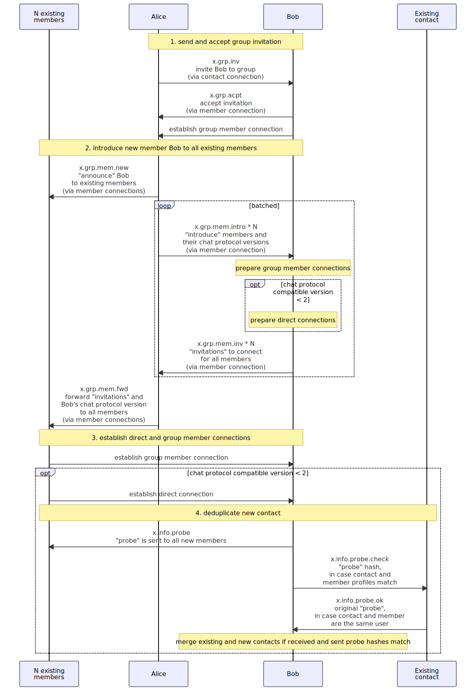

Revision 2, 2024-06-24

Evgeny Poberezkin

# SimpleX Chat Protocol

## Abstract

SimpleX Chat Protocol is a protocol used by SimpleX Chat clients to exchange messages. This protocol relies on lower level SimpleX protocols - SimpleX Messaging Protocol (SMP) and SimpleX Messaging Agent protocol. SimpleX Chat Protocol describes the format of messages and the client operations that should be performed when receiving such messages.

## Scope

The scope of SimpleX Chat Protocol is application level messages, both for chat functionality, related to the conversations between the clients, and extensible for any other application functions. Currently supported chat functions:

- direct and group messages,
- message replies (quoting), message editing, forwarded messages and message deletions,
- message attachments: images, videos, voice messages and files,
- creating and managing chat groups,
- invitation and signalling for audio/video WebRTC calls.

## General message format

SimpleX Chat protocol supports these message formats:

- JSON-based format for chat and application messages.
- compressed format for adapting larger messages to reduced size of message envelope, caused by addition of PQ encryption keys to SMP agent message envelope.
- binary format for sending files or any other binary data.

JSON-based message format supports batching inside a single container message, by encoding list of messages as JSON array.

Current implementation of chat protocol in SimpleX Chat uses SimpleX File Transfer Protocol (XFTP) for file transfer, with passing file description as chat protocol messages, instead passing files in binary format via SMP connections.

### JSON format for chat and application messages

This document uses JTD schemas [RFC 8927](https://www.rfc-editor.org/rfc/rfc8927.html) to define the properties of chat messages, with some additional restrictions on message properties included in metadata member of JTD schemas. In case of any contradiction between JSON examples and JTD schema the latter MUST be considered correct.

Whitespace is used in JSON examples for readability, SimpleX Chat Protocol clients MUST avoid using whitespace when encoding JSON messages.

General message format is defined by this JTD schema:

```JSON
{
  "properties": {
    "event": {
      "type": "string"
    },
    "msgId": {
      "type": "string",
      "metadata": {
        "format": "base64url-encoded 12 bytes random message ID"
      }
    },
    "params": {
      "optionalProperties": {}
    }
  }
}
```

For example, this message defines a simple text message `"hello!"`:

```JSON
{
  "event": "x.msg.new",
  "msgId": "abcd",
  "params": {
    "content": {
      "type": "text",
      "text": "hello!"
    }
  }
}
```

`msgId` property is a 12 bytes base64url-encoded random message ID that the clients can use to reference the message in the future, e.g. when editing, quoting or deleting it.

`event` property is the type of the message that defines the semantics of the message and the allowed format of `params` property.

`params` property includes message data, depending on `event`, as defined below and in [JTD schema](./simplex-chat.schema.json).

### Compressed format

The syntax of compressed message is defined by the following ABNF notation:

```abnf
compressedMessage = %s"X" 1*15780 OCTET; compressed message data
```

Compressed message is required to fit into 13388 bytes, accounting for agent overhead (see Protocol's maxCompressedMsgLength).

The actual JSON message is required to fit into 15610 bytes, accounting for group message forwarding (x.grp.msg.forward) overhead (see Protocol's maxEncodedMsgLength).

### Binary format for sending files

> Note: Planned to be deprecated. No longer used for file transfer in SimpleX Chat implementation of chat protocol.

SimpleX Chat clients use separate connections to send files using a binary format. File chunk size send in each message MUST NOT be bigger than 15,780 bytes to fit into 16kb (16384 bytes) transport block.

The syntax of each message used to send files is defined by the following ABNF notation:

```abnf
fileMessage = fileChunk / cancelFile
fileChunk = %s"F" chunkNo chunk
cancelFile = %s"C"
chunkNo = 4*4 OCTET ; 32bit word sequential chunk number, starting from 1, in network byte order
chunk = 1*15780 OCTET ; file data, up to 15,780 bytes
```

The first chunk number MUST be 1.

## Messages and chat items

While users usually use the term "message" to refer to the objects presented in the conversation, the expected functionality of these objects makes it a wrong term. "Messages" are supposed to be immutable; they cannot be modified or deleted once sent. The objects in the conversation are expected to be mutable. This document and implementation use the term "chat item" to refer to these objects to differentiate them from the messages sent between the clients.

## Supported JSON message types and SimpleX Chat sub-protocols

Message types are sent as a string in `event` property of JSON messages. General syntax of event string is defined by this ABNF:

```abnf
event = namespace "." subprotocol *("." eventWord)
namespace = eventWord ; 1-letter recommended
subprotocol = eventWord
eventWord = 1* ALPHA
```

All SimpleX Chat Protocol messages related to chat functions are defined in `x` namespace.

Sub-protocol is a group of messages for related message functions - e.g. sending files, managing groups or negotiating WebRTC calls.

SimpleX Chat Protocol supports the following message types passed in `event` property:

- `x.contact` - contact profile and additional data sent as part of contact request to a long-term contact address.
- `x.info*` - messages to send, update and de-duplicate contact profiles.
- `x.msg.*` - messages to create, update and delete content chat items.
- `x.msg.file.descr` - message to transfer XFTP file description.
- `x.file.*` - messages to accept and cancel sending files (see files sub-protocol).
- `x.direct.del` - message to notify about contact deletion.
- `x.grp.*` - messages used to manage groups and group members (see group sub-protocol).
- `x.call.*` - messages to invite to WebRTC calls and send signalling messages.
- `x.ok` - message sent during connection handshake.

JTD schema defining messages for all chat functions is available in [this file](./simplex-chat.schema.json) – please refer to this document for all properties of the message `params`.

## x.contact - sending connection request

The message is sent as part of the connection request to the long-term user address. `contactReqId` property is used to identify a duplicate contact request - the receiving client MAY put repeated request on top of the list in the UI.

## Sub-protocol for contact profile

### x.info - contact profile

This message is sent by both sides of the connection during the connection handshake, and can be sent later as well when contact profile is updated.

### Probing for duplicate contacts

As there are no globally unique user identifiers, when the contact a user is already connected to is added to the group by some other group member, this contact will be added to user's list of contacts as a new contact. To allow merging such contacts, "a probe" (random base64url-encoded 32 bytes) SHOULD be sent to all new members as part of `x.info.probe` message and, in case there is a contact with the same profile, the hash of the probe MAY be sent to it as part of `x.info.probe.check` message. In case both the new member and the existing contact are the same user (they would receive both the probe and its hash), the contact would send back the original probe as part of `x.info.probe.ok` message via the previously existing contact connection – proving to the sender that this new member and the existing contact are the same user, in which case the sender SHOULD merge these two contacts.

Sending clients MAY disable this functionality, and receiving clients MAY ignore probe messages.

If the sending client uses `x.info.probe` messages, it MUST send them to all new members, rather than only when there is a matching contact profile. This is to avoid leaking information that the matching contact profile exists.

## Sub-protocol for content messages

### x.msg.new - a new content message

When chat clients receive or send this message, they MUST create a new chat item in the conversation. Top level `msgId` property is defined to allow referencing this chat item or message in the future, e.g. to delete, update or quote chat item, or to accept file.

This message uses `params` property of the message as content message container, without any top level properties for the container. Message container (`params`) includes message `content` property, an optional "invitation" to receive file or image attachment in `file` property (that is interpreted depending on message content type) and optional indication whether this message is forwarded (`"forward": true` property of container) or sent in reply to other message (`"quote": {<quoted message>}`). See `/definition/msgContainer` in [JTD schema](./simplex-chat.schema.json) for message container format.

Message content can be one of four types:

- `text` - no file attachment is expected for this format, `text` property MUST be non-empty.
- `file` - attached file is required, `text` property MAY be empty.
- `image` - attached file is required, `text` property MAY be empty.
- `video` - attached file is required, `text` property MAY be empty.
- `voice` - attached file is required, `text` property MAY be empty.
- `link` - no file attachment is expected, `text` property MUST be non-empty. `preview` property contains information about link preview.

See `/definition/msgContent` in [JTD schema](./simplex-chat.schema.json) for message container format.

### x.msg.update - update of the previously sent message

This message is used to update previously created chat item. Its `params` property contains `msgId` of the previously sent message that this one is updating and `content` with the message content that the clients must use to replace the content of the original chat item.

If the referenced message does not exist, the clients MUST create a new chat item with the ID of the referenced message. If the referenced message is not a content message, the clients MUST ignore this message.

### x.msg.del - request to delete previously sent message

This message is used to delete previously sent chat items. Receiving clients MUST implement it as soft-delete, replacing the original chat item with a special chat item indicating that "message is deleted" that can be fully deleted by the user. If the referenced message does not exist or was sent by the different user than the one sending `x.msg.del`, the receiving clients MUST ignore this message. Clients are also RECOMMENDED to limit the time during which message deletion is allowed, both for senders and for the recipients.

## Sub-protocol for sending and receiving files

When content message `x.msg.new` contains file attachment (the invitation to receive the file), this sub-protocol is used to accept this file or to notify the recipient that sending the file was cancelled.

File attachment can optionally include connection address to receive the file - clients MUST include it when sending files to direct connections, and MUST NOT include it when sending file attachment to the group (as different members would need different connections to receive the file).

`x.file.acpt` message is used to accept the file in case when file connection address was included in the message (that is the case when the file invitation was sent in direct message). It is sent as part of file connection handshake via file connection, that is why this message contains no reference to the file - the used connection provides sufficient context for the sender.

`x.file.acpt.inv` message is used to accept the file in group conversations, it includes the connection address. It is sent in the same connection where the file was offered and must reference the original message.

`x.file.cancel` message is sent to notify the recipient that sending of the file was cancelled. It is sent in response to accepting the file with `x.file.acpt.inv` message. It is sent in the same connection where the file was offered.

`x.msg.file.descr` message is used to send XFTP file description. File descriptions that don't fit into a single chat protocol message are sent in parts, with messages including part number (`fileDescrPartNo`) and description completion marker (`fileDescrComplete`). Recipient client accumulates description parts and starts file download upon completing file description.

## Sub-protocol for chat groups

### Decentralized design for chat groups

SimpleX Chat groups are fully decentralized and do not have any globally unique group identifiers - they are only defined on client devices as a group profile and a set of bi-directional SimpleX connections with other group members. When a new member accepts group invitation or joins via group link, the inviting member introduces a new member to all existing members and forwards the connection addresses so that they can establish direct and group member connections.

There is a possibility of the attack here: as the introducing member forwards the addresses, they can substitute them with other addresses, performing MITM attack on the communication between existing and introduced members - this is similar to the communication operator being able to perform MITM on any connection between the users. To mitigate this attack this group sub-protocol will be extended to allow validating security of the connection by sending connection verification out-of-band.

Clients are RECOMMENDED to indicate in the UI whether the connection to a group member or contact was made directly or via another user.

Each member in the group is identified by a group-wide unique identifier used by all members in the group. This is to allow referencing members in the messages and to allow group message integrity validation.

The diagram below shows the sequence of messages sent between the users' clients to add the new member to the group.

While introduced members establish connection inside group, inviting member forwards messages between them by sending `x.grp.msg.forward` messages. When introduced members finalize connection, they notify inviting member to stop forwarding via `x.grp.mem.con` message.



### Member roles

Currently members can have one of three roles - `owner`, `admin`, `member` and `observer`. The user that created the group is self-assigned owner role, the new members are assigned role by the member who adds them - only `owner` and `admin` members can add new members; only `owner` members can add members with `owner` role. `Observer` members only receive messages and aren't allowed to send messages.

### Messages to manage groups and add members

`x.grp.inv` message is sent to invite contact to the group via contact's direct connection and includes group member connection address. This message MUST only be sent by members with `admin` or `owner` role. Optional `groupLinkId` is included when this message is sent to contacts connected via the user's group link. This identifier is a random byte sequence, with no global or even local uniqueness - it is only used for the user's invitations to a given group to provide confirmation to the contact that the group invitation is for the same group the contact was connecting to via the group link, so that the invitation can be automatically accepted by the contact - the contact compares it with the group link id contained in the group link uri's data field.

`x.grp.acpt` message is sent as part of group member connection handshake, only to the inviting user.

`x.grp.link.inv` message is sent as part of connection handshake to member joining via group link, and contains group profile and initial information about inviting and joining member.

`x.grp.link.mem` message is sent as part of connection handshake to member joining via group link, and contains remaining information about inviting member.

`x.grp.mem.new` message is sent by the inviting user to all connected members (and scheduled as pending to all announced but not yet connected members) to announce a new member to the existing members. This message MUST only be sent by members with `admin` or `owner` role. Receiving clients MUST ignore this message if it is received from member with `member` role.

`x.grp.mem.intro` messages are sent by the inviting user to the invited member, via their group member connection, one message for each existing member. When this message is sent by any other member than the one who invited the recipient it MUST be ignored.

`x.grp.mem.inv` messages are sent by the invited user to the inviting user, one message for each existing member previously introduced with `x.grp.mem.intro` message. When this message is sent by any other member than the one who was invited by the recipient it MUST be ignored.

`x.grp.mem.fwd` message is used by the inviting user to forward the invitations received from invited member in `x.grp.mem.inv` messages to all other members. This message can only be sent by the member who previously announced the new member, otherwise the recipients MUST ignore it.

`x.grp.mem.info` this message is sent as part of member connection handshake - it includes group member profile.

`x.grp.mem.role` message is sent to update group member role - it is sent to all members by the member who updated the role of the member referenced in this message. This message MUST only be sent by members with `admin` or `owner` role. Receiving clients MUST ignore this message if it is received from member with role less than `admin`.

`x.grp.mem.restrict` message is sent to group members to communicate group member restrictions, such as member being blocked for sending messages.

`x.grp.mem.con` message is sent by members connecting inside group to inviting member, to notify the inviting member they have completed the connection and no longer require forwarding messages between them.

`x.grp.mem.del` message is sent to delete a member - it is sent to all members by the member who deletes the member referenced in this message. This message MUST only be sent by members with `admin` or `owner` role. Receiving clients MUST ignore this message if it is received from member with `member` role.

`x.grp.leave` message is sent to all members by the member leaving the group. If the only group `owner` leaves the group, it will not be possible to delete it with `x.grp.del` message - but all members can still leave the group with `x.grp.leave` message and then delete a local copy of the group.

`x.grp.del` message is sent to all members by the member who deletes the group. Clients who received this message SHOULD keep a local copy of the deleted group, until it is deleted by the user. This message MUST only be sent by members with `owner` role. Receiving clients MUST ignore this message if it is received from member other than with `owner` role.

`x.grp.info` message is sent to all members by the member who updated group profile. Only group owners can update group profiles. Clients MAY implement some conflict resolution strategy - it is currently not implemented by SimpleX Chat client. This message MUST only be sent by members with `owner` role. Receiving clients MUST ignore this message if it is received from member other than with `owner` role.

`x.grp.direct.inv` message is sent to a group member to propose establishing a direct connection between members, thus creating a contact with another member.

`x.grp.msg.forward` message is sent by inviting member to forward messages between introduced members, while they are connecting.

## Sub-protocol for WebRTC audio/video calls

This sub-protocol is used to send call invitations and to negotiate end-to-end encryption keys and pass WebRTC signalling information.

These message are used for WebRTC calls:

1. `x.call.inv`: the client initiating the call sends `x.call.inv` message in direct connection to invite another client to the call. At this point WebRTC session is not initialized yet, this message only contains call type and DH key for key agreement.

2. `x.call.offer`: to accept the call, the receiving client sends `x.call.offer` message. This message contains WebRTC offer and collected ICE candidates. Additional ICE candidates can be sent in `x.call.extra` message.

3. `x.call.answer`: to continue with call connection the initiating clients must reply with `x.call.answer` message. This message contains WebRTC answer and collected ICE candidates. Additional ICE candidates can be sent in `x.call.extra` message.

4. `x.call.end` message is sent to notify the other party that the call is terminated.

## Threat model

This threat model compliments SMP, XFTP, push notifications and XRCP protocols threat models:

- [SimpleX Messaging Protocol threat model](https://github.com/simplex-chat/simplexmq/blob/master/protocol/overview-tjr.md#threat-model);
- [SimpleX File Transfer Protocol threat model](https://github.com/simplex-chat/simplexmq/blob/master/protocol/xftp.md#threat-model);
- [Push notifications threat model](https://github.com/simplex-chat/simplexmq/blob/master/protocol/push-notifications.md#threat-model);
- [SimpleX Remote Control Protocol threat model](https://github.com/simplex-chat/simplexmq/blob/master/protocol/xrcp.md#threat-model).

#### A user's contact

*can:*

- send messages prohibited by user's preferences or otherwise act non-compliantly with user's preferences (for example, if message with updated preferences was lost or failed to be processed, or with modified client), in which case user client should treat such messages and actions as prohibited.

- by exchanging special messages with user's client, match user's contact with existing group members and/or contacts that have identical user profile (see [Probing for duplicate contacts](#probing-for-duplicate-contacts)).

- identify that and when a user is using SimpleX, in case user has delivery receipts enabled, or based on other automated client responses.

*cannot:*

- match user's contact with existing group members and/or contacts with different or with incognito profiles.

- match user's contact without communicating with the user's client.

#### A group member

*can:*

- send messages prohibited by group's preferences and member restrictions or otherwise act non-compliantly with preferences and restrictions (for example, if decentralized group state diverged, or with modified client), in which case user client should treat such messages and actions as prohibited.

- create a direct contact with a user if group permissions allow it.

- by exchanging special messages with user's client, match user's group member record with the existing group members and/or contacts that have identical user profile.

- undetectably send different messages to different group members, or selectively send messages to some members and not send to others.

- identify that and when a user is using SimpleX, in case user has delivery receipts enabled, or based on other automated client responses.

- join the same group several times, from the same or from different user profile, and pretend to be different members.

*cannot:*

- match user's contact with existing group members and/or contacts with different or with incognito profiles.

- match user's group member record with existing group members and/or contacts without communication of user's client.

- determine whether two group members with different or with incognito profiles are the same user.

#### A group admin

*can:*

- carry out MITM attack between user and other group member(s) when forwarding invitations for group connections (user can detect such attack by verifying connection security codes out-of-band).

- undetectably forward different messages to different group members, selectively adding, modifying, and dropping forwarded messages.

- disrupt decentralized group state by sending different messages that change group state (such as adding or removing members, member role changes, etc.) to different group members, or sending such messages selectively.

*cannot:*

- prove that two group members with incognito profiles is the same user.
