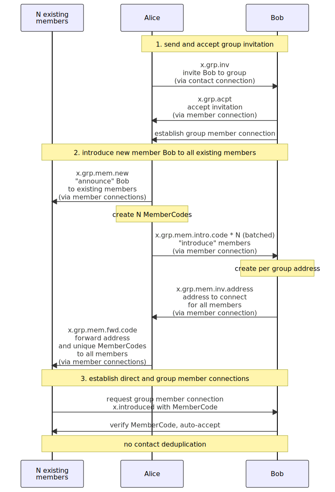

# Groups improvements

See also:
- [Group contacts management](./2022-10-19-group-contacts-management.md).
- [Create groups without establishing direct connections](./2023-08-10-groups-wt-contacts.md).

## Problem

Establishing connections in groups is unstable and uses a lot of traffic. There are several areas for improvement that that could help optimize it:

- Joining group member prematurely creates direct and group connections for each member.

  Some members may never come online, and that traffic would be completely wasted.

  Instead of creating direct connections, we could allow to send direct messages inside group, and optionally have a separate protocol for automating establishing direct connection with member via them.

- Host sends N introduction messages (XGrpMemIntro) to joining member. Instead they could be batched.

## Possible solutions

### Improved group handshake protocol

Below are proposed changes to group handshake protocol to reduce traffic and improve stability.

Each joining member would create a new temporary per group address for introduced members to connect via.

Host to include transient per member identifier (MemberCode) to send in XGrpMemIntro. Joining member would then use them to verify contact requests from introduced members.

How is it different from MemberId? - MemberId is known to all group members and is constant per member per group. This identifier would be known only to host and to introduced member (of existing members), so other members wouldn't be able to impersonate one another when requesting connection with joining member. An introduced member can still pass their identifier + joining member address to another member or outside of group, but it is no different to passing currently shared invitation links.

```haskell
newtype MemberCode = MemberCode {unMemberCode :: ByteString}

XGrpMemIntro :: MemberInfo -> MemberCode -> ChatMsgEvent 'Json -- Maybe MemberCode or XGrpMemIntroV2 / XGrpMemIntroCode
```

New protocol message containing unique to group address for joinee to send to host instead of sending N XGrpMemInv messages:

```haskell
XGrpMemInvAddress :: ConnReqContact -> ChatMsgEvent 'Json
```

Host to include joining member address and code (unique for each introduced member) into XGrpMemFwd messages instead of invitation links:

```haskell
XGrpMemFwd :: MemberInfo -> ConnReqContact -> MemberCode -> ChatMsgEvent 'Json -- XGrpMemFwdV2 / XGrpMemFwdCode
```

Introduced members to send contact requests with a new message XGroupMember / XIntroduced (similar to XInfo or XContact, see `processUserContactRequest`):

```haskell
XIntroduced :: MemberInfo -> MemberCode -> ChatMsgEvent 'Json
```

Joinee verifies profile and code and automatically accepts contact request. They both assign resulting connection to respective group member record, without creating contact.



#### Clients compatibility

We have a [proposed mechanism](https://github.com/simplex-chat/simplex-chat/pull/2886) for communicating "chat protocol version" between clients.

Sending and processing new protocol messages would only be supported by updated clients.

Trying to support both protocols across different members in the same group would require complex logic:

Host would have to send introduced members versions, joining member would provide both address or invitation links depending on each members' versions, host would forward accordingly.

Instead we could assign "chat protocol version" per group and share it with members as part of group profile, and make a two-stage release when members would first be able to update and get new processing logic, but have it disabled until next release.

After group switching to new processing logic old clients wouldn't be able to connect in groups.

How should existing groups be switched?
- Owner user action?
- Owner client deciding automatically?
- In case group has multiple owners - which owner(s) can / should decide?
- Prohibited until all / part of existing members don't update? How to request members to update?
- Old clients will not be able to process and save group chat version from group profile update.

### Sending direct messages inside group

Group messages are sent by broadcasting them to all group member connections. As a replacement for creating additional direct connections in group we can allow to send message directly to members via group member connections. The UX would be to choose whether to send to group or to a specific member via compose view.

Possible approach is to extend ExtMsgContent with `direct :: Maybe Bool` field, which would only be considered for group messages.

Chat items should store information of receiving member database ID (for sending member) and of message being direct (for receiving member). Perhaps it could be a single field `direct_member_id`, which would be the same as `group_member_id` for received messages.

TODO - consider whether `connection_id` or `group_id` or both should be assigned in `messages` table.
