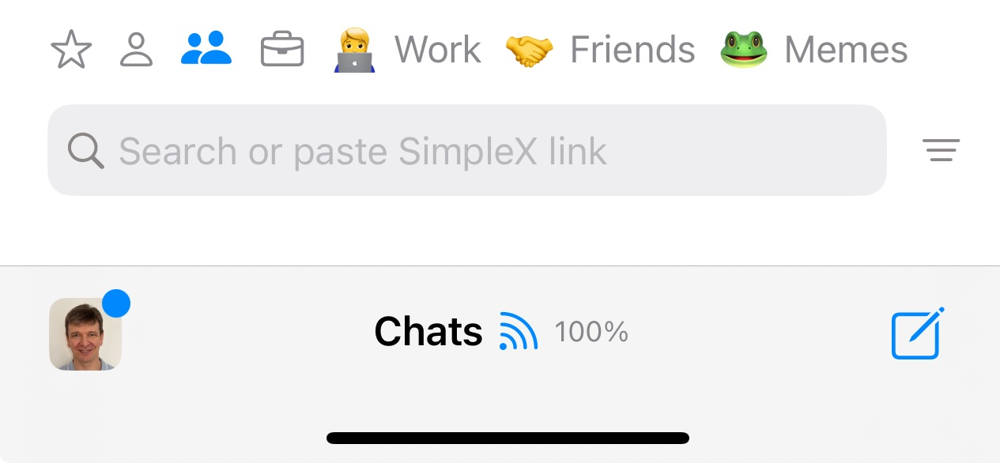

# Chat tags, emoji entry

## Problem

Organize chats.

Stop users from using chat profiles to organize chats.

More fun as we solve groups problem.

## Solution

This is a simple "quality of life" improvement that's long due, as the number of users and conversations grows, that would probably take just a week to ship.

Proposed UX:
- tags are per profile.
- preset tags for favourites, contacts, groups and business chats.
- user defined tags *must* have text and emoji.
- if some conversation tag (preset or user defined) is not present in the conversation, the tag will not show in the bar, but would still allow selecting it when tagging.
- there should be some way to delete tag completely, maybe on long-press on tab bar or maybe in the list of tags?
- tagging conversation will be done via the context menu that will open a second menu allowing to choose from existing tag or add a new type and select emoji (which means we need to add our embedded emoji keyboard on desktop and on android, and that should be used in compose too, as many desktop platforms and older android do not allow choosing emoji easily). We could also switch android to emoji font we use on desktop, if it's not too large, as default Android emoji are quite ugly.
- on iOS it would be a third "..." button on the trailing swipe area, which will consume Delete button for groups. If there is only Tag button, we don't need "...", we should use Tag directly.
- it also needs some removable notice, once there are conversations, so there will be some preset tag(s), but no user-defined tags (tappable "Tag your chats" with info on how to tag with X to remove and maybe alert if info was not opened).

