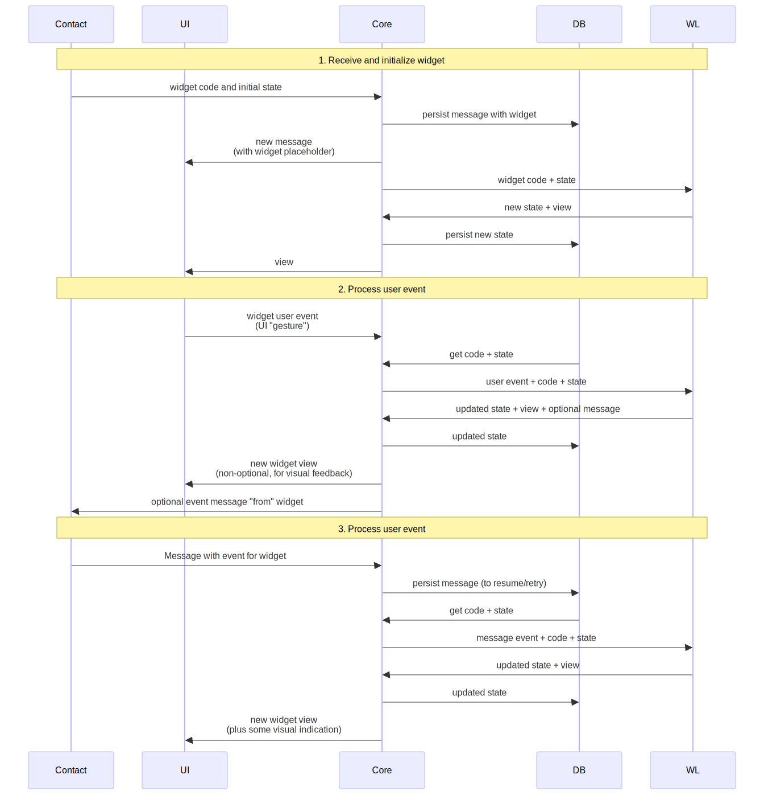

# Chat widgets and activities

## Problems

A short-term problem is to decide and implement support for bots in the apps UI. Just released v6.4.3 includes support for bot commands, but the most commonly used UI approach for Telegram bots is inline buttons.

They are, effectively, simple widgets constructed as multiple lines of buttons. While currently Telegram offers web apps for bots, they are much more complex to develop for both ourselves and for bot owners, and they have many issues with security model.

Inline buttons "pros":
- super simple to develop for bot owners - they are just a 2D array of buttons with configuration, where a button can send a visible or invisible message to a bot, which in turn can update buttons however it wants.
- allow for quite advanced interfaces, with multiple layers of navigation.
- relatively simple to implement in the app.

Inline buttons "cons":
- very bad visual design.
- very limiting, compared with full inline widgets.

A longer-term problem is more advanced user activities with the bot and between each other, that could include:
- polls,
- "doodles" (see doodle.com),
- more advanced bot UIs,
- mini-games,
- etc.

## Solution

A general UX pattern that may solve both problems is "inline chat widgets".

For the examples of the possible use cases for inline chat widgets see https://webxdc.org/apps/

Problems with web apps/webxdc.
- JavaScript/Web have large binary size, that is hard to justify unless an app is a browser as well (which is not impossible),
- JavaScript has a complex security model,
- Widget size are likely to be larger than our usual message size (~15kb after compression), so they have to be sent either as files or as multiple messages.

Irrespective of what technology is used to implement widgets, there are likely to be two kinds of widgets:
- Bot UI. These widgets do not necessarily need to be "an activity" (see the next), as there is no much scrolling in the chat with the bot, but they may also benefit from being marked as "active" in the same way.
- Widgets sent by users. In this case widget once sent cannot be replaced, but it can react to events, both from the sender and from the recipients. In this case, widgets have to be linked with "chat activities", so they can be easily discovered and accessed from any place in the chat while they are active, without scrolling to the point where they were started, and with an additional message posted to the chat once they complete.

This RFC describes both the widget security and execution model, and also a possible implementation approach.

## Widget security and execution models

Widgets are code that is sent by untrusted parties (or parties with the limited trust) to the users devices, so it should not be treated as trusted code.

Rather than defining what widgets code should be prevented from doing, we should define what it can do, its execution model and lifecycle.

At any point in time widget has:
- code - this is fixed, and cannot be changed. While this may seem as a limitation for inline buttons UI, but it can be overcome by putting the button definitions into the state, if that's what the bot wants.
- state - this is variable, and can be changed as described below. State can be anything, other than executable code, and it can be changed by events in the way widget code allows - including full state replacement (that would allow completely changing inline buttons)

Widget can react to user and message, as shown on the diagram.



WL stands for "Widget Library", more on that below.

There are should be the following restrictions to widget events/processing:
- only user events (actions) can trigger sending messages, to prevent different instances of the same widget in the chat endlessly "talking" to each other.
- only one message from each remote chat peer can be sent "to the widget" to update its state. "To the widget" means that the message with event would reference the message with the widget by shared message ID that all peers in the chat have. If the widget already processed a state update it would update further state updates from this peer until user action is processed.
- once user performs some actions on the widget, further events can be processed from the same participants who previously sent events.

This execution model prevents abuse when widget state update can be requested multiple times. At the same time, this execution model allows for all necessary interactions, including UI updates by bot in response to user actions, polls (each user would only be able to send one poll event), and two- or multi-party games where "moves" have to be made in turns - each client would know that it should not send any events until it receives moves from all parties, and other parties won't be sending events too.

That all raises several questions:
- which layer should be enforcing this execution model. It can't be widget "code", as this is what we are defending from. It can be either core, or widget library, or maybe both. Probably enforcing it in widget library makes most sense.
- for direct chats, both peers can participate and send message events "to widget". While each party has its own instance of widget, with its own state, they would arrive to consistent state (not necessarily the same state, as it can be programmed to be different - as would be the case for games), once they process events. But for groups, there probably needs to be two options - 1. any party can participate (e.g., doodle or poll). 2. only pre-defined peers (by group member ID) can participate. This model works for business chat where bot, customer and multiple business agents can participate, but only customer and the bot would interact with the UI widget. 3. up to a certain number of peers can participate, but it's not defined in advance who they are. This model can work for multi-party games that can be entered by a certain number of members, but it's not defined in advance which ones. Once they enter, they would be fixed and will have to send events in turn.
- another question about execution model is access to any client data. On one hand, it may be used to improve user experience. On another hand, we have to ensure that data that is received from client device can participate in view computation, but cannot participate in computation of sent message. There have been ideas of data tainting (when each piece from client device is "tainted", and result of any computation where tainted data participates becomes tainted too, and tainted messages cannot be sent), but if we go this it has to be enforced outside of bot code, so that bot code cannot remove "tainting". Such client data could be dark or light color scheme, app and system language to localize UI, timezone, screen size. Asking user permission to access this data is a bad idea, as even if it is granted it can still be used to fingerprint users.

## Proposed implementation model

### Widget programming language

Using JavaScript or any other traditional language is problematic, as they are all general purpose languages that cannot be sufficiently constrained to ensure that they comply with the execution model. Data tainting idea would be particularly hard to implement. One language that can achieve what is required is the language where code is data that can be analyzed, sanitized and constrained in its execution, and where tainted data cannot be untainted by untrusted code - Lisp. One variant of Lisp particularly stands out - PicoLisp, due to its simplicity, maturity and the existence of very advanced libraries.

While in its current state [PicoLisp](https://picolisp.com/) can only be run as a standalone process, it is feasible to change to execute it as a library. Even though it is not multithreaded, it is not required as widget execution can be queued, and Lisp execution environment will be stateless - it receives widget state, participation state (who can participate and who already sent events - not in diagram) and events, computes new state, view and an optional message to send, and stops. In addition to that PicoLisp can be "hardened" to prevent it from crashing, from accessing files and sensors, etc., even in the library code, not only in widget code.

To achieve the required security, it is might be that Widget code needs to be interpreted by Lisp library that in its turn needs to be interpreted by PicoLisp, but possibly there can be more efficient approaches for secure code execution - e.g., it could analyze some part of the expressions and decide if to continue execution on the boundaries of some functions (e.g., those that can be called recursively, to protect against endless recursion of widget code).

The design of this "framework"/widget library is not sufficiently clear, and some bottom-up exploration is needed.

### Widget UI rendering

PicoLisp has libraries to render on canvas, HTML and SVG.

We considered using a UI library to render UI primitives without them being part of widget code. One possible option is [Nuklear](https://immediate-mode-ui.github.io/Nuklear/) - a self-contained C library that renders UI elements with event handlers in a platform-independent way, without any specific platform adapters. It can either return its own commands or OpenGL instructions that can then be converted to bitmaps.

A simpler option, particularly to get to MVP sooner, seems an ad-hoc rendering of buttons and UX elements either to SVG or to bitmap - TBC.

### A possible example of widget definition for inline buttons

Widget function definition:

```lisp
( de Activity (widget state) () # library code implementing activity from its definition
  # where
  # - widget a function without parameters evaluating to (render receive version), where:
  #   - render: function defined as '((state0) (...)), and evaluating to view medium,
  #             whatever we choose to use - e.g., SVG or bitmap, and any activity attributes
  #             (e.g., name, icon, enabled status, duration, etc.), e.g. as (view activity'),
  #             or maybe be as a single object value.
  #             Any user event/gesture handlers would be defined as part of this function,
  #             as they should be local to UI definition, and probably the event handlers
  #             would be required to return (state1 view message),
  #             where message can be NIL or it will be sent as visible message or invisible event.
  #   - receive: function defined as '((sender message state0) (...)) that will be
  #              invoked when message to widget is received, and evaluate to (state1 view)
  #   - ver: minimal library version that the activity requires to work
  #          (library would expose supported version range).
  # - state: the initial widget state, can be updated by event handlers and receive function
  # We don't explicitly include participants as parameter, they can be included in state.
)
```

Inline buttons widget:

```lisp
( Activity
    # ButtonGrid is a pre-defined widget function that returns:
    # - render: converts buttons state to view
    # - receive: simply replaces state with the message content, e.g. `((_sender message _state) message)`
    # - version: (version 1)
    # Bundling these things together results in better UX for widget developers, allowing us
    # (and widget developers) to supply a single pre-defined symbol that combines
    # rendering, message handling and required library version

    ButtonGrid

    # widget state is buttons, so they can be updated by bot in response to user actions
    ( ( ("Reply" (reply "message")) # visible reply message (replying to widget)
        ("Menu" (event ":menu")) # invisible message
        ("Help" (send "/help")) # visible message
      ) # a row of 3 buttons
      ( ("Site" (link "https://example.com))
        ("Call" (link "+447777777777"))
        ("Email" (link "info@example.com"))
        ("Connect" (link "https://smp5.simplex.im/a#abcd))
        ("Copy" (copy "text to copy))
      ) # a row of 5 buttons
    )
)
```

Poll widget:

```lisp
( Activity
    # Poll is a predefined widget function.
    # Note that the question and the poll options are part of the widget function,
    # so they cannot be changed via events.
    # Its receive function updates counts.
    ( Poll
        "Do you agree?" # could be NIL, to put question in widget's message text
        "Yes"
        "No"
    )

    # initial widget state is poll counts, questions could not be changed
    (0 0)
    # but we probably can just default missing counts to 0s,
    # so the initial state would be just () or NIL
    # Or we could even use variable arguments to allow omitting empty list as the initial state.
)
```

If we can achieve that these functions (ButtonGrid, Poll) can be implemented in PicoLisp using the library, without any special hacks, so that they can be used as examples, and yet they would also would be available as predefined, it will be a sufficient confirmation that the framework does what we need it to do,
and can be used in more advanced scenarios.

Also, given that widgets that use predefined functions can be very concise, as shown in above examples, they can be attached not only to text messages, but to images, videos and link previews.

Even `Activity` itself doesn't need to be part of widget message, we can treat widget code as the list of parameters passed to activity, so the poll would be as simple as:

```lisp
((Poll "Do you agree?" "Yes" "No")) # the second absent parameter is interpreted as empty initial state
```

and the button grid as:

```lisp
( ButtonGrid
  ( ( ("Reply" (reply "message"))
      ("Menu" (event ":menu"))
      ("Help" (send "/help"))
    )
    ( ("Site" (link "https://example.com))
      ("Call" (link "+447777777777"))
      ("Email" (link "info@example.com"))
      ("Connect" (link "https://smp5.simplex.im/a#abcd))
      ("Copy" (copy "text to copy))
    )
  )
)
```

with the buttons definitions (the second parameter) being the initial state, that allows to have them fully replaced via bot's message.

This is somehow similar to PicoLisp design itself where three core types are derived from a single root type - cell, here we have two distinct UX problems - bot UI and user activities, such as polls, - implemented via the same underlying abstraction.
