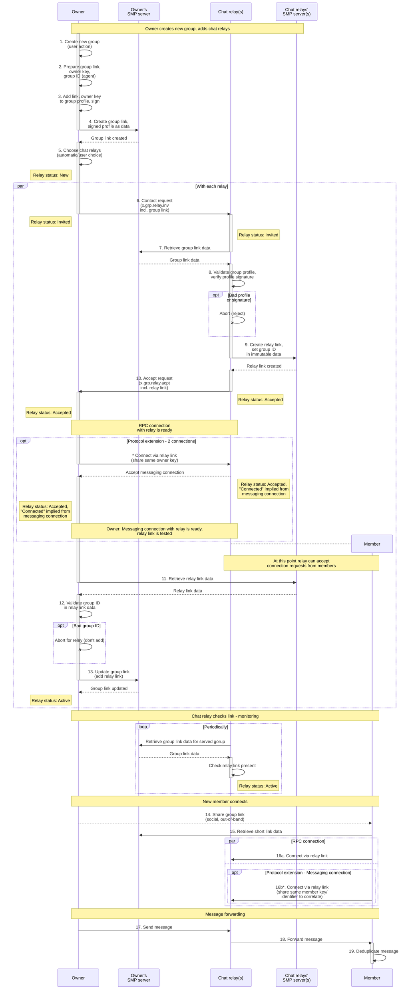
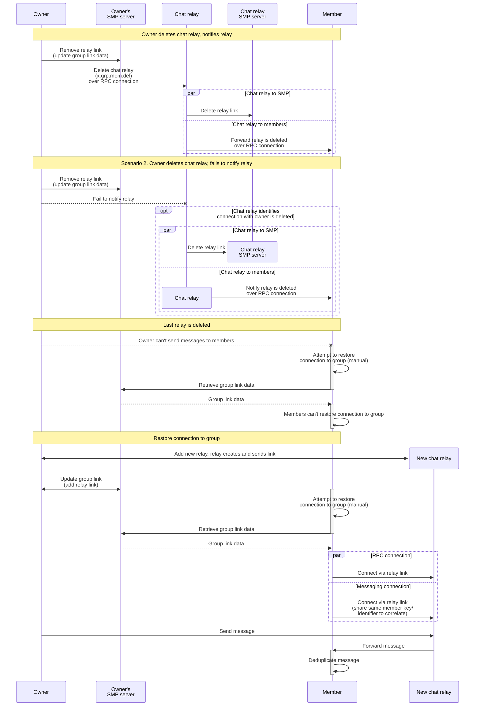

# Chat relays

## Security objectives

Group relay protocol should achieve following objectives:
1. Stable message delivery between group members.
2. No possibility for relay to substitute group.
3. No possibility for relay to impersonate owner(s).
4. Prevent relay from altering member roster (member removal, role change, etc.).
5. Prevent relay from terminally destabilizing group by stopping to serve it. At the same time, allow owner to remove (last) relay with possibility to restore group functionality.
6. Allow owner(s) to send messages as "message from channel", hiding specific sender out of multiple owners from members.
7. Prevent relays from altering/dropping messages.

## Protocol for adding chat relays to group

Activations (execution bars) with looped arrows indicate internal calls/steps.

Notes:

- Group ID - unique group identifier (not globally unique) baked in immutable part of group link data, and repeated by chat relays in immutable parts of respective relay links.

  Owner can validate they're adding relay link to the group link specifically for their group.

  Members can validate they join relay links corresponding to group link they connected to.

- Protocol extension: Create connections pairs between relay and members with different priority for passing regular messages and for relay responding to member requests.

  Invitation sent in step 12 should contain same key as in group link, for relay to match connection to the same owner and "active" relay link (add to `XContact` message).

  Add new connection entity, special for groups with relay, referencing member record - parallel to first member connection.

- Client can "know" link that will be created before creating it on server - so we can add it to profile before adding profile to group short link data.

  Agent to return link that will be created upon preparing connection record.

- On adding group short link to group profile.

  Strengthens association between link and profile. Link already contains profile in attached data, but from perspective of group profile link itself is detached. All members "see" the same link they joined via in group profile. Chat relays "see" the same link they created relay links for, and can check it for presence of their relay link at any point.

  Link is recoverable from profile, e.g. for purpose of restoring connection with group via new chat relays.

  Overall it just seems a natural and convenient way to store group link for all members, rather than having it separately.

- On updating group link data with one relay link at a time vs waiting for all links.

  Overhead is minimal - one request to owner's SMP server per relay.

  Waiting for a relay to send relay link can take indefinitely long.

  In proposed protocol owner doesn't have to wait for links from all relays for simplicity and to minimize wait time - it allows owner to conclude group creation potentially earlier, in case some relays are stuck or offline (owner can add their links later, once they successfully send it).

- Lock owner group link from accepting connection on SMP server, possibly has some implementation gaps.

  Reject in owner code for foolproofing.

- What should be in relay link user data:

  - Relay key for group.
  - Relay identity if provided.
    Operator relays want to provide identity for trust.
    User relays may not want to provide identity.
    Relay identity: profile, certificate, relay identity key (global across groups).

## Protocol for removing chat relay from group, restoring connection to group

Notes:

- New relay doesn't have group history.

  - We can prohibit to remove last relay without adding new one.
  - Relays can synchronize history.
  - Can be considered after MVP.

## Correlation of design objectives with design elements

1. Redundant delivery by multiple relays. High availability of relay clients.
2. Same group ID baked in immutable data of group link and relay links.
3. Owner public key in group link.
4. Actions altering member roster can be signed by owner key, verified by members.
5. Protocol for restoring connection to group by checking group link for new relays.
6. XMsgNew protocol extension - "message from channel" flag - see [channels forwarding rfc](./2025-08-11-channels-forwarding.md).
7. Redundant delivery by multiple relays, highlighting deduplicated messages differences - see [channels forwarding rfc](./2025-08-11-channels-forwarding.md).

## Threat model

**Single compromised chat relay / Colluding chat relays**

can:
- effectively substitute group bar group ID and signed profile, by sending unsigned content from other group (or any arbitrary content), that doesn't require signature verification, such as regular messages.
  - one way this could be further mitigated is requiring owner to sign all messages.
- selectively drop any content or service messages from owner, including actions altering member roster.
- selectively drop messages for some of members.

cannot:
- technically, redirect newly joining member to a different group.
- substitute group profile.
- impersonate owner, send arbitrary messages that require signing by owner (actions altering member roster).

**Compromised chat relay (in situation where not all relays are compromised/colluding)**

can:
- in case number of compromised relays is same as number of uncompromised ones, compromised relay(s) can drop messages or send arbitrary unsigned messages, misleading members from identifying which relays are compromised.
- ignore "message from channel" directive from owner, revealing which owner sent message.
  - this can be revealed to owner by members out-of-band.

**Member**

can:
- infer which owner sent message as "message from channel", if group has a single owner.
  - owner client should prohibit this option if group has a single owner.

## TODO list

- Chat commands for creating group with relays.
- Protocol events processing.
- Recovery for both owner and relay when adding relay to group.
- On each subscription retrieve group link data for all groups, actualize connections for present relay links.
- Agent `prepareConnectionToJoin` api to return link that will be created.
- Asynchronous version of agent `setConnShortLink` api, correlation in chat.
- Agent to support adding relays to link (it has stub `relays :: [ConnShortLink 'CMContact]`).
- New connection entity for secondary member-in-relayed-group connection - priority/messages connections.
- Differentiate connection usage by priority in chat logic (receiving messages vs sending requests to relay).
- Finalize model - statuses, schema.
- UI for relay management (user level, similar to list of servers).
- UI for creating group with relays.
- UI for managing relays in group.
- Relay status updates events on adding relays for UI integration.
- Relay removal.
- Relay periodic checks for monitoring relay link presence.
