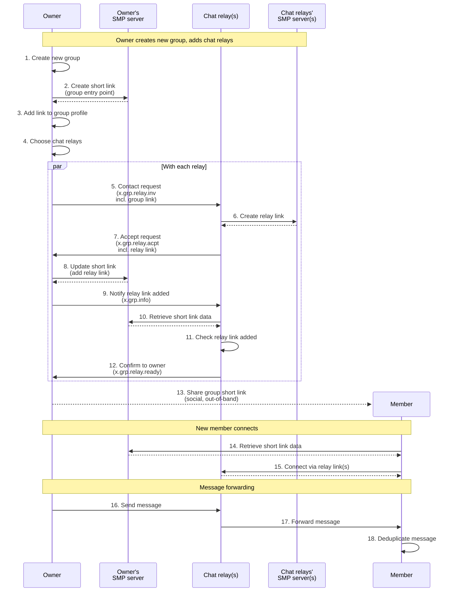
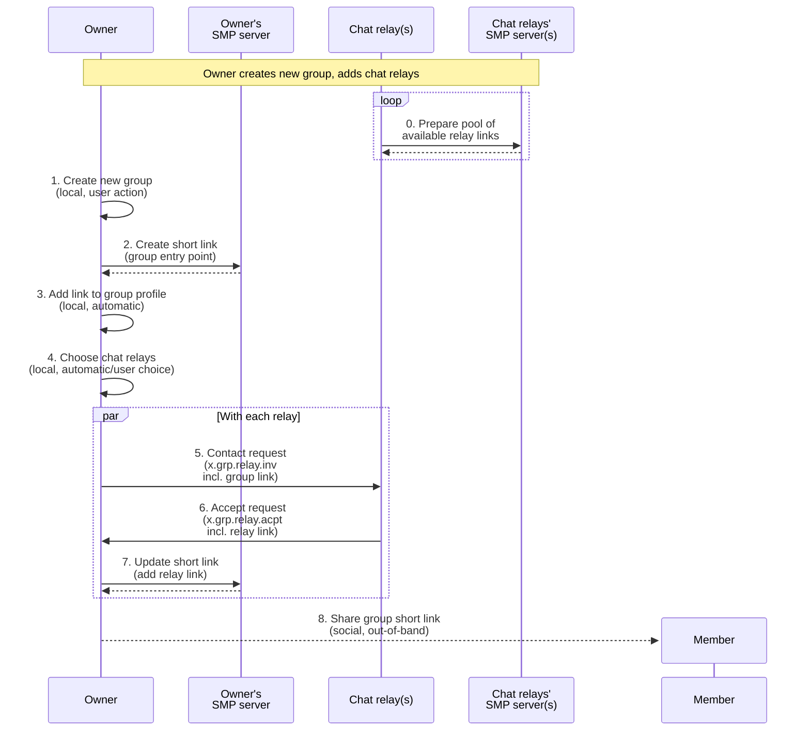
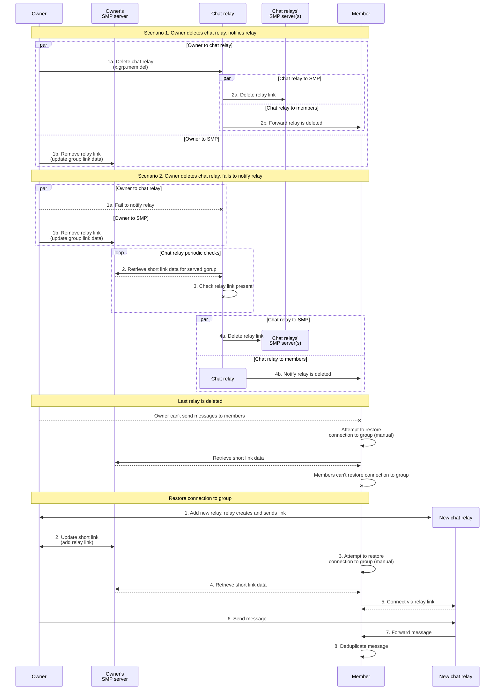

# Chat relays

## Protocol for adding chat relays to group

Notes:

- On creating group short link beforehand (step 2).

  We do it for protocol simplicity - to have same logic of updating link data with each relay's link.

  Alternatively owner client could create group link with first relay's link, saving a network request. This would require owner client to track state of creating the link to avoid race on receiving multiple relay links.

- On adding group short link to group profile (step 3).

  For protocol purposes it's only a means of informing chat relays about it in step 9 (x.grp.info).

  Alternatively it could be sent as a standalone object in initial contact request to relay (step 5, x.grp.relay.inv), or in step 9 in special event.

  However, there are other arguments for having group link in profile:

  - Strengthening association between link and profile. Link already contains profile in attached data, but from perspective of group profile link itself is detached. All members "see" the same link they joined via in group profile. Chat relays "see" the same link they created relay links for, and can check it for presence of their relay link at any point.

  - Link is recoverable from profile, e.g. for purpose of restoring connection with group via new chat relays.

  Overall it just seems a natural and convenient way to store group link for all members, rather than having it separately.

- On updating group link data with one relay link at a time vs waiting for all links.

  - Overhead is minimal - one request to owner's SMP server per relay.
  - Waiting for a relay to send relay link can take indefinitely long.
  - In proposed protocol owner doesn't have to wait for links from all relays for simplicity and to minimize wait time - it allows owner to conclude group creation potentially earlier, in case some relays are stuck or offline (owner can add their links later, once they successfully send it).
  - Alternatively owner could collect all relay links first and make a single update of group link data, then notify all relays at once.

- Owner should reject contact requests to their group link.

- Chat relay should reject contact requests to its relay link until chat relay confirms it is attached to the group link data. Can be based on `GroupRelayOwnStatus`, see below.

- Owner public key for signing group actions and messages can be stored as part of group short link data (`GroupShortLinkData`).

- Relays public keys can be stored as part of relay info in link data (`ChatRelayInfo`), sent to owner in `x.grp.relay.acpt`.

- Recovery.

  - For owner:

    - Owner should be able to continue creating group from any step.
    - Step 1. Create new group - initial.
    - Step 2. Create short link - first real step, can be synchronous, if it fails can restart (requires user action).
    - Step 3. Add link to group profile - local, automatic upon synchronous response from step 2. No recovery needed.
    - Step 4. Choose chat relays - TBC automatic or user action? User action: confirm to auto-select, or let user choose?
      This action is local but user action should be remembered - at this point `group_relays` records should be created and associated with group, in status `CRSNew`.
      Further recovery can be done per relay record based on status:
      - Step 5. Contact request to relay. Contact request should be done via asynchronous agent action. New connection (for contact request) should be associated with relay, relay status moves to `CRSInvited`.
        - Member connection, link `group_members` to `group_relays`.
        Recovery from `CRSInvited` status is not needed, at this point owner waits for relay response.
      - Step 7. Receive `x.grp.relay.acpt` to relay connection. Save relay link on relay record, relay status moves to `CRSAccepted`.
      - Step 8. Collect all relay links for relays with status `CRSAccepted` and greater (further down protocol), update short link data. Update of link data should be done via asynchronous agent action. Relay status moves to `CRSAdded`.
      - Step 9. Upon receiving response for link data update, send `x.grp.info` to relay, relay status moves to `CRSNotified`.
        - Response is received asynchronously in receive loop - need to introduce correlation between link and events.
        - Alternatively could use synchronous agent api with retry.
        - `x.grp.info` doesn't have to contain actual group profile update in this case, here it's only a trigger for relay to check link data. (Relay should know based on its state to not dismiss even if profile doesn't change). Could be a special protocol event, but not necessary.
      - Step 12. Receive confirmation from relay, relay status moves to `CRSConfirmed`. At this point owner knows relay is functional for the group and can advertise link with it, or wait for remaining relays.
    - Relay status updates can be displayed to owner in UI via events.
    - Owner should have an ability to cancel adding relay mid-progress (remove relay), and to retry from start (relay is stuck in `CRSInvited` or `CRSNotified` status).
    - TBC recovery mechanism for initial steps and per relay.
      - Maintenance process on start, spawning forks per group and per relay?
      - Workers? Doesn't seem justified for the case.
    - TODO Asynchronous version of `setConnShortLink`.

  - For relay:

    - Relay tracks its own status in group (`GroupRelayOwnStatus`).
    - Step 6. Upon receiving invitation from group owner, initial relay status is `GROSInvited`.
      Relay should create its link for the group, should be done via asynchronous agent action, status moves to `GROSLinkCreated`.
      Continuation is to save and associate relay link with group record, send `x.grp.relay.acpt`,
      status moves to `GROSAccepted`.
      - Relay link connection is a user contact link, more specifically group link - we can re-use group link machinery that links `user_contact_links` to `groups`.
    - Step 10, 11. Upon receiving `x.grp.info` from owner, if relay is in `GROSAccepted` status, status moves to `GROSNotified`.
      Retrieve short link (asynchronous agent action? synchronous with retry?). If relay link is present send confirmation to owner `x.grp.relay.ready`, status moves to `GROSConfirmed`. Otherwise break (recovery for owner is to re-add relay).
    - Should recover in `GROSInvited`, `GROSLinkCreated`, `GROSNotified` statuses.
    - Similar to owner recovery mechanism - maintenance process on start?

- On decreasing number of protocol steps.

  - In proposed protocol main steps for adding a chat relay are:
    - 5. Group owner: Contact request to relay.
    - 6. Chat relay: Create relay link.
    - 7. Chat relay: Accept request to be relay, send relay link to owner.
    - 8. Group owner: Update group link data with relay link.
    - 9. Group owner: Notify relay.
    - 10, 11. Chat relay: Retrieve group link data and check presence of relay link.
    - 12. Chat relay: Confirm to owner.

  - Steps 5, 6, 7, 8 are fundamental to group functioning. Owner has to request a relay to serve group (contact request), relay has to provide a relay link for the group, for new members to join directly and only to relay.

  - Step 6 could be circumvented: by maintaining a pool of readily available links, relay could immediately provide one. Rather than decreasing number of steps in protocol, it moves this step as a side activity of a relay, overall making it slightly more complex. The advantage to this approach is decrease in wait time for the owner. However, as group setup is a one-time activity it seems an unnecessary complication at this stage.

  - Steps 9, 10, 11, 12 are notifying/acknowledging and not as crucial to group functioning in happy path. However, without these assurances, some edge cases arise.

    For relay, without receiving notification from owner and checking presence of relay link in group link data, it would have to always accept requests to relay link, even if it was obtained illegitimately (wasn't properly shared by owner in group link data). It could cause a race with owner cancelling adding relay to the group. It may have a potential for an exploit of relay, however, with relay checking for group link periodically/on start and removing itself from group on absence of relay link, it may be acceptable to omit these steps from protocol. (See below - Protocol for removing chat relay from group, scenario 2).

    For owner, not waiting for relay confirmation can lead to preemptively sharing group link and new members trying to connect to relay before it confirmed presence of relay link and is ready to accept requests, resulting in rejections. It's not a problem if relay notification step is also omitted (as above) and relay always accepts requests.

    In practice, the only normal way to learn a relay link would be after it is added to the group link, so there shouldn't be a race. So, relay can consider all requests to relay link as legitimate as soon as they come, before checking group link data and discovering relay link is not present, in which case relay proceed to remove itself from group as below.

  - Steps 9-11 could be replaced by relay polling group link data.

  - Step 12 could be replaced by owner checking that relay link is active, or simply doing nothing in case relay notification is omitted as above - owner considers that, since provided, relay link is working.

Simplified protocol (with reduced number of steps):

## Protocol for removing chat relay from group, restoring connection to group

Notes:

- New relay doesn't have group history.

  - We can prohibit to remove last relay without adding new one.
  - Relays can synchronize history.
  - Can be considered after MVP.
