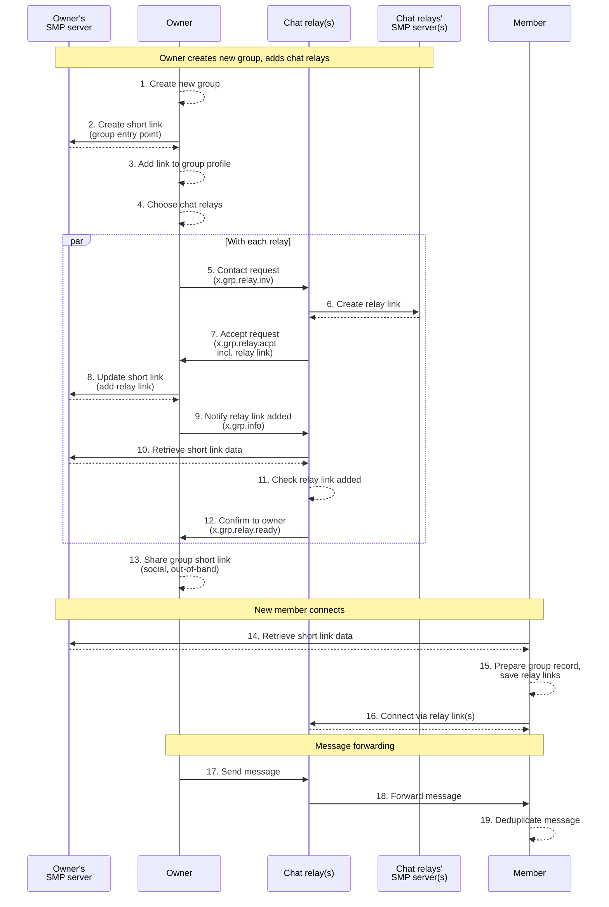
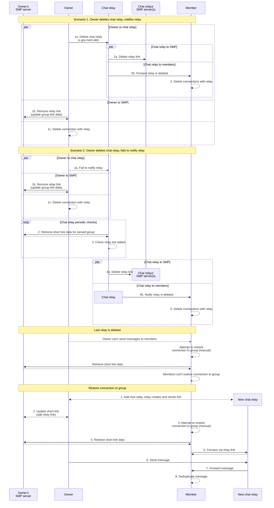

# Chat relays

## Protocol for adding chat relays to group

Notes:

- On creating group short link beforehand (step 2).

  We do it for protocol simplicity - to have same logic of updating link data with each relay's link.

  Alternatively owner client could create group link with first relay's link, saving a network request. This would require owner client to track state of creating the link to avoid race on receiving multiple relay links.

- On adding group short link to group profile (step 3).

  For protocol purposes it's only a means of informing chat relays about it in step 9 (x.grp.info).

  Alternatively it could be sent as a standalone object in initial contact request to relay (step 5, x.grp.relay.inv), or in step 9 in special event.

  However, there are other arguments for having group link in profile:

  - Strengthening association between link and profile. Link already contains profile in attached data, but from perspective of group profile link itself is detached. All members "see" the same link they joined via in group profile. Chat relays "see" the same link they created relay links for, and can check it for presence of their relay link at any point.

  - Link is recoverable from profile, e.g. for purpose of restoring connection with group via new chat relays.

  Overall it just seems a natural and convenient way to store group link for all members, rather than having it separately.

- Owner should reject contact requests to their group link.

- Chat relay should reject contact requests to its relay link until chat relay confirms it is attached to the group link data.

## Protocol for removing chat relay from group, restoring connection to group

Notes:

- New relay doesn't have group history.
  - We can prohibit to remove last relay without adding new one.
  - Relays can synchronize history.
  - Can be considered after MVP.
