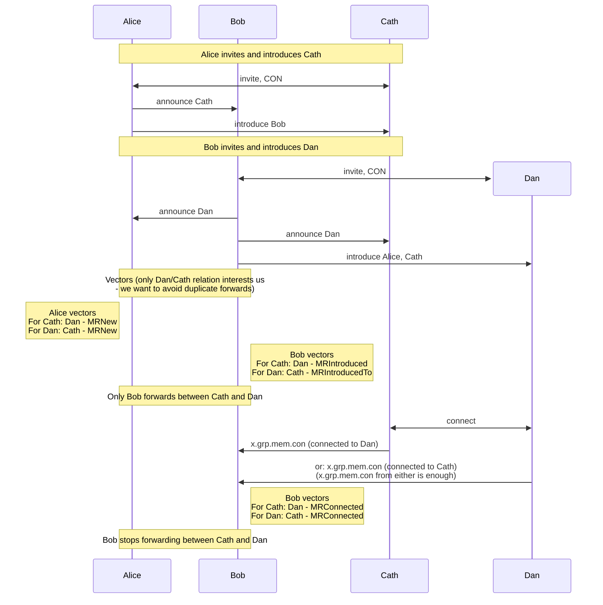

# Member relations vectors

## Problem

Maintaining member introduction records takes N^2 space.

## Solution

Migrate to member relations byte vector, with per member relation encoded by member index.

Requires:

1. Per group member index (Done).
2. Primitives to work with byte vector (Done).
3. Rework forwarding logic to use relations vector.
4. Rework introductions logic to use relations vector (avoid duplicate introductions).
5. Migration from introductions to vector.

Migration is 2-stage:

1. Live migration to accommodate large volume of introductions data, with admin client choosing mode of operation based on presence of relation vector for member.
2. Offline migration of remaining introduction records. Drop mode of operation based on introductions.

### Forwarding

When new invitee connects (CON) -> host makes introductions:

1. For this invitee: set member relations to 'MRIntroduced' for respective members. _**(Take member lock)**_
2. For pre-members:
    - Member has vector: Set relation to 'MRIntroducedTo' for invitee member - N updates. _**(Take member locks/take group lock?)**_
    - No vector: Create introduction record (Transitional mode of operation based on introductions).

When member reports XGrpMemCon ("connected with another member"), for both reporting and referenced members:

1. Member has vector: Set relation to 'MRConnected'. _**(Take member lock)**_
2. No vector: Update introduction record status (Transitional).

When member sends message -> host forwards:

1. Member has vector: Get recipients based on sender relations vector ('MRIntroduced' + 'MRIntroducedTo' members).
2. No vector: Get recipients based on introduction records (Transitional), set sender's vector. _**(Take member lock)**_
    - Compiled list of recipients to be marked as introduced; differentiate 'MRIntroduced'/'MRIntroducedTo'? (Complication of splitting introduced into 2 relations).
    - Additionally get Connected members, currently they are filtered out as not requiring forward. (It is necessary to make a complete computation of vector in one go, as this member will then be skipped in background updates)

#### Avoid duplicate forwards

N updates approach allows us to avoid duplicate forwards:

- Admin only forwards based on introductions embedded into relations vector: 'MRIntroduced', 'MRIntroducedTo'.

- Admin doesn't forward to 'MRNew' members.

Following diagram illustrates that in multi-admin scenario only host of "later" invitee (Bob) will forward messages between his and other admin's invitees.

### Avoid duplicate introductions

Scenario 1. Pending member is accepted to group -> avoid repeat introductions to moderators and above.

Scenario 2. Two invitees connect to host concurrently -> avoid introductions race.

Both can be solved by excluding already introduced members:
- Member (new invitee) has vector: filter out 'MRIntroduced', 'MRIntroducedTo' members from list of members to introduce.
- No vector: filter out based on introduction records (Transitional; `introduceToRemaining` + restore `checkInverseIntro` logic).

### Live migration (Stage 1)

Background process to set members' vectors based on introductions.

Goes over members with NULL relation vector. Logic to determine relations is same as when setting sender's vector on forwarding. The latter is optimization -> faster migration of hot paths. _**(Take member locks)**_

TBC report when done - for directory service. Or we can track remaining member records with NULL vector.

### Offline migration (Stage 2)

TBC SQL to set relations vectors based on remaining introductions records.

### Other considerations

#### 1. Introductions race - missed introductions

We may have identified race where some pairs of members may never become introduced to each other. It can occur if 2 hosts concurrently invite (announce) and introduce their respective invitees based to their respective local member lists.

Consider such timeline:

  1. Admin 1 invites Invitee 1.

     Invitee 1 connects to Admin 1 (CON).

     Admin 1 announces (x.grp.mem.new) Invitee 1 and introduces him to known members (Admin 1 hasn't seen Invitee 2).

  2. Admin 2 invites Invitee 2.

     Invitee 2 connects to Admin 2 (CON).

     _Consider following scenario: Admin 2 hasn't received x.grp.mem.new for Invitee 1 from Admin 1._ Admin 2 announces (x.grp.mem.new) Invitee 2 and introduces him to known members (Admin 2 hasn't seen Invitee 1).

  3. Both admins receive (with delay) opposite x.grp.mem.new -> both admins already made introductions before and consider opposite admin would introduce "new" member to their "older" invitee.

This is status quo, this work will not improve it.

We will revert change of admins making decision of introductions lists based purely on member index, which may have made such race more likely. Instead they will determine introductions lists as following: all current members minus already introduced members (see "Avoid duplicate introductions" section).

#### 2. Double x.grp.mem.con notifications

As alternative to N updates for introduced members, we considered redundant forwarding in multi-admin scenario and modifying user clients (2-stage release) to send x.grp.mem.con notifications to both own host and host of connected member.

Not symmetrical: a "later" invitee doesn't know which member is the host of an "earlier" invitee.
