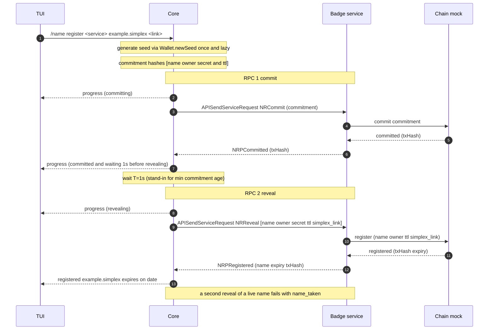

# In-app name purchase — buying and managing a name from the CLI

SimpleX names already ship: the app resolves `@name.testing` and claims a name on
a profile. What does *not* exist in the app is acquiring one — registration today
means a wallet, ETH and a browser. This moves buying and managing a name into the
app, from the TUI. It **targets the badges branch** and extends the existing badge
service into a registrar with an in-memory chain mock — no new bot, no new
transport. The wallet is real and signs: a seed per device, a key per name, and
EIP-712 intents a relayer submits.

## Scope

**In:** buying a name with a redemption code, pointing it at an address with a
signed record edit, listing what you own, and recovering it all from a phrase —
all from the TUI, against the badge service acting as registrar. Seeds and the
name → key map are persisted in the chat database, so a registered name stays
owned by an address the client can still derive after restart.

**Out (later):** transfers and stealth/gifting, subnames, renewal and expiry
reminders, in-app purchase, a real relayer and a deployed chain, GUIs, tx-hash
inclusion verification, anti-grief deposits.

## The happy path

`<svc>` is the registrar's SimpleX address. Every command that talks to it takes
one, so the CLI is not bound to a single service.

```
/name verify-code <svc> SMPX-4K2P-7TQW-9XRM
                                code verified: names of 6 letters or more, 2 years
                                use before 2027-07-01 - a code cannot be replaced

/name quote <svc> alice         alice.simplex - available ($20.00 for 2y)

/name buy <svc> alice SMPX-4K2P-7TQW-9XRM simplex:/contact#/abc
                                revealing -> registered
                                owner  0x9858EfFD232B4033E47d90003D41EC34EcaEda94
                                path   m/44'/60'/0'/0/0

/name link contact <svc> alice.simplex simplex:/contact#/xyz
                                alice.simplex: contact updated (tx 0x…)
                                9 relayed edits left
```

A second name on the same profile takes the next index — `m/44'/60'/0'/0/1`, a
different address — so the two are not publicly linked and their signing nonces
are independent.

No setup step: the seed is created by the first purchase that needs one.
`/name keys export` shows the phrases whenever the user asks.

Three things here are easy to conflate. The **code** is verified on the device
before anything is sent. **Buying** registers and writes the first link. **Link**
is the only step that spends a signature — and it is what makes a name
recoverable, because after a phrase-only restore it is how a name is re-pointed
at a new profile.

## The rest of the commands

Seeing what you own:

```
/names <svc>                    alice.simplex   -> simplex:/contact#/xyz
                                                   expires 2028-08-27, 9 edits left

/name info <svc> alice.simplex  owner   0x9858EfFD232B4033E47d90003D41EC34EcaEda94
                                path    m/44'/60'/0'/0/0
                                contact simplex:/contact#/xyz
                                expires 2028-08-27
                                9 relayed edits left
```

Recovery keys:

```
/name keys                      1:  (in use)
                                     account 0   alice.simplex
                                2:  (not written down)
                                     other       lucy.simplex (m)

/name keys export               every key's phrase, each labelled with the names
                                it controls - never just the one in use

/name keys import <phrase>      adds a key; never replaces one
/name keys init                 optional - create one before buying
/name keys use 2                which key the next purchase goes under
/name keys use 2 0              ...and which account this profile is
/name keys use 2 0 5            ...and where its next name sits
```

Names are listed under the account they were derived at, because that grouping
is the only surviving record of which profile owned what — see *Recovery*.

A new device, with nothing but the phrase:

```
/name keys import <phrase>
/name rescan <svc>              walks the known layouts and the bare root
                                found alice.simplex
                                and moves both marks past what it found

/name link contact <svc> alice.simplex simplex:/contact#/new
                                point it at this device's address
```

**Link before claiming, and only when the chat database is gone.** Attaching a
name to a profile resolves it and refuses unless it *already* carries that
profile's address. With only the phrase the profile is new and its address is
different, so the record has to be rewritten first. If the chat database was
restored too, the name already points at the restored profile and nothing extra is
needed.

That last block is the feature's whole argument: the chat database is gone, every
contact is unreachable, and the name is what lets people find the right person to
reconnect to.

## Core API

What a GUI client gets. **One command, one response**, progress on the event
channel, never a prompt — a blocking read would hang every non-terminal client.

```
APINameQuote      {target, label, years}   -> CRNameQuote {label, available, reserved,
                                                           priceUsdCents, years}
APINameVerifyCode {code}                   -> CRNameCode {minLength, years, expires, label}
APINameBuy        {target, label, code, link_}
                                           -> CRNameRegistered {name, owner, path, expiry, txHash}
APINameList       {target}                 -> CRNames [{name, points, expiry, editsLeft}]
APINameInfo       {target, name}           -> CRNameInfo {name, owner, path, contact,
                                                          channel, expiry, editsLeft}
APINameSetLink    {target, name, record, link}
                                           -> CRNameLinkSet {name, record, txHash}
APINameRescan     {target, more}           -> CRNameRescan [{name, path}]
APINameKeys       {}                       -> CRNameKeys [{n, byAccount, current, backedUp}]
APINameKeysExport {}                       -> CRNameKeyPhrases [{n, phrase, names}]
APINameKeysImport {phrase}                 -> CRNameKeys …
APINameKeysInit   {}                       -> CRNameKeys …
APINameKeysUse    {n, account?, name?}     -> CRNameKeys …
APINameRegister   {target, name, link}     -> CRNameRegistered …
```

`APINameRegister` is the original code-less path from the first revision:
commit/reveal with no payment. It stays for the mock and for tests; a real
registrar would not expose it.

Carried over: `CEvtNameRegistrationProgress {name, phase, waitMs}` and
`CENameRegistrationFailed {code, message, retryAfter}`. `APINameBuy` reuses both —
it is registration with a payment, not a new state machine.

`record` on `APINameSetLink` is `contact | channel`, not a free-form key: the CLI
splits it into two verbs for readability, but the API keeps one call so a GUI does
not grow a second code path for the same write.

**`priceUsdCents` is for mobile, not the CLI.** A terminal never needs it — a code
carries its own entitlement — but an IAP flow must show a price and pick a store
product before anything is bought, so the field is in the API from the start. Two
prices exist and should not be conflated: this is the name's list price by length
and term; what a user is *charged* under IAP is the store's own localised price
for the matching product.

## Service RPC

What the registrar answers, over the badge service-RPC transport.

Request travels in `APISendServiceRequest.request`, response in
`CRServiceResponse.responseData`; one response per request, per-call timeout. The
service's existing `handleServiceRequest` already decodes a `type`-discriminated
envelope and replies via `APISendServiceResponse` — names commands are added to
that dispatch.

Envelope: `version` and `request`, discriminated on `type`.

There is deliberately **no `ownerKey`** field, though the badge envelope has the
analogous `purchaseKey`. The service-RPC signing key is Ed25519, while a name
owner is a secp256k1 Ethereum address — two different keys — so an `ownerKey`
here would be a second public key that nothing verifies. The owner address
travels in the request instead. Where a request *does* need to prove ownership —
`NRRelayIntent` — it carries an EIP-712 signature the service verifies by
recovering the signer, which is stronger than a bare key field.

```
NamesRequest  = { version, request }

NamesCommand
  | NRCommit      { commitment }                     -- H(name, owner, secret, ttl)
  | NRReveal      { name, owner, secret, ttl, simplex_link }
  | NRQuote       { label, years }
  | NRBuy         { requestId, name, owner, code, simplex_link }
  | NRResolve     { name }
  | NROwnedBy     { address }
  | NRNonce       { address }
  | NRRelayIntent { requestId, name, recordKey, value, nonce, deadline, sig }

NamesResponse
  | NRPCommitted  { txHash }
  | NRPRegistered { name, expiry, txHash }
  | NRPQuote      { label, available, takenUntil?, reserved, priceUsdCents, years }
  | NRPRecord     { name, owner, contact[], channel[], expiry, editsLeft }
  | NRPNames      { names[] }
  | NRPNonce      { nonce }
  | NRPRelayed    { txHash }
  | NRPError      { code, message?, retryAfter? }
```

Error codes: `name_taken`, `bad_request`, `unsupported_version`, `internal`,
`name_reserved`, `name_too_short`, `payment_rejected`, `code_spent`,
`code_expired`, `bad_signature`, `bad_nonce`, `expired_intent`, `not_owner`,
`not_found`, `no_edit_credits`.

`simplex_link` is written as the name's resolver **text record** — the SMP contact
or channel a resolver reads back to turn `example.simplex` into a live address.
Registration therefore does two writes: the registration itself and this record.

Each response carries the transaction's **`txHash`**. Using it to verify block
inclusion is out of scope here; the field is returned now so that path needs no
protocol change later.

**Versioning.** The envelope's `version` stays 1: every addition above is a new
command, and an older service answers an unknown one with `unsupported_version`
rather than mis-handling it. Bump only when an existing command's shape changes.

## One key per name

A name is owned by a key derived at `m/44'/60'/i'/0/k` — the profile's BIP-44
account `i`, and the name at address index `k`. `k` is taken when the name is
registered, so a profile's second name lands on a different address.

```
seed (BIP-39)
└── profile account i
    └── m/44'/60'/i'/0/k        one key per name; k = 0 is the profile's first
```

Worked through, for a profile that buys two names and later imports a second
seed it had used in a dapp:

```
seed1                                  generated by the CLI
└── profile Alice = account 0
    ├── m/44'/60'/0'/0/0   0x9858EfFD…Da94  owns alice.simplex
    └── m/44'/60'/0'/0/1   0x6Fac4D18…b9C0  owns lizzy.simplex

seed2                                  imported later
└── m                     0x1D07a4bE…4bE9  owns lucy.simplex  (root, no derivation)
```

Nothing here is a custom layout: `account` and `address_index` are what BIP-44
has those levels for, and the addresses line up with wallets users already have.
Pinned in the tests against the standard `abandon … about` mnemonic:

```
m/44'/60'/0'/0/0   0x9858EfFD232B4033E47d90003D41EC34EcaEda94   MetaMask account 1
m/44'/60'/0'/0/1   0x6Fac4D18c912343BF86fa7049364Dd4E424Ab9C0   MetaMask account 2
m/44'/60'/1'/0/0   0x78839F6054d7ed13918bAe0473BA31b1Ca9D7265   Ledger Live account 2
```

So **profile 0's names are exactly MetaMask's account list, in order**, and each
profile's first name is the matching Ledger Live account. Moving a single name
between this wallet and another one is therefore a derivation question already
answered — but the commands to do it (recovery-phrase import, single-name key
export) are follow-up work, not in this PR.

**Why not one key per profile.** Exporting it would hand over every name that
profile owns, and `SimplexResolver` keeps one nonce per signer shared across
every node it owns — so a shared key would serialise every name's record edits
behind one counter. Both go away with an index per name.

**Which key owns which name is not on chain and not derivable**, so it is
recorded locally (`wallet_name_keys`). The path is stored literally rather than
as indices, because a name found on an imported seed may sit on a layout that is
not ours — `lucy.simplex` above stays at the root and is re-derived from `"m"`.

### Where stealth addresses will attach

Not in this PR, but the layout has to leave room. A profile publishes **one
meta-address**: a spend key and a viewing key, both hardened under purpose
`5564'` at the profile level, `m/5564'/60'/i'/0'/0` and `m/5564'/60'/i'/1'/0`.

A sender derives a fresh destination from it without any handshake — shared
secret `s = keccak256(r · P_view)` for a random ephemeral `r`, destination
`addr(P_spend + s·G)` — and the recipient recomputes `s` from the sender's
ephemeral public key `R` as `keccak256(p_view · R)`, holding the name with
`p_spend + s`.

So a received name's key is **not at a derivation path**: it is the spend key
plus a scalar, recoverable from `R` rather than from an index. One meta-address
per profile therefore serves any number of received names, which is why the
meta-address sits at the profile level while owned names sit at the address
level.

## Why two RPCs for one call

Registration splits into **commit** then **reveal** so the registrar cannot
front-run the name:

- **commit** publishes only `H(name, ownerAddr, secret, ttl)`. No one — the
  service included — can tell which name it is.
- **reveal** submits the plaintext once the commitment is on chain already binding
  it to *your* owner address. A service that tries to grab the name at reveal
  fails: the aged commitment names you, not it.

Between commit and reveal the core waits `commitWaitMs` (1 s), and the service
**enforces** a minimum commitment age rather than trusting the client to wait — a
reveal whose commitment is too new is refused. Both are short in the mock;
production is 60 s. Deposit hardening is still deferred.

## Sequence



## Progress events

Registration stays one command but streams `CEvt` progress to the UI as it
advances — the same async event channel the app already uses for XFTP transfer
and ratchet-sync progress. The TUI prints a live line per phase; the command's
final response returns at the end.

```
CEvtNameRegistrationProgress { name, phase, waitMs? }
phase = Committing | Committed | Revealing | Registered
```

`Committed` carries `waitMs = 1000` and the wait starts the moment it is emitted,
so the TUI renders it as one line — `committed. waiting 1s before revealing`.
There is no separate `Waiting` phase: nothing happens between the two, so it would
only print a second line and then sit there. No verification phases (out of
scope). Against a real chain the same `waitMs` carries the real
min-commitment-age unchanged.

**Idempotency.** `NRCommit` re-accepts an existing commitment, so re-committing is
free. `NRReveal` is *not* idempotent: once a name is live, any further reveal
fails with `name_taken`, including from its own owner — registering again is not
an edit.

Every *mutating* call — `NRBuy`, `NRRelayIntent` — carries a **`requestId`**, and
the service replays the stored response rather than executing twice. Matching
fields cannot distinguish a resent request from a user genuinely doing the same
thing again, which is why the id is there from the start rather than added when
retries arrive.

## Components and reuse

| Component | Built | Extends to |
|---|---|---|
| **Wallet** | `newSeed`, `deriveNameKey` / `deriveAtPath`, `accountAddress`, `signIntent`, recovery-phrase import and export. No digest signing is exported. | stealth keys hang off the same profile account; the wallet already holds the one-time-address table's shape. |
| **Wallet storage** | `wallet_seeds` (several per device, `backed_up`), `wallet_name_keys` (name → path, provenance), a `k` high-water mark per profile. | raw-key import writes `provenance = 'imported'`; the column exists, the path does not. |
| **Codes** | a table of pre-issued random values held by the registrar, looked up on `verify-code` and `buy`. | blind-signed codes, so the issuer cannot join a buyer to a name — its own branch. |
| **Intents** | `Names.Snrc`: namehash, `SetText` type string, `intentDigest`, `signSnrcIntent`. | `TransferName` when transfers land — the type string already changed for stealth. |
| **RPC transport** | badges' `APISendServiceRequest` / `APISendServiceResponse`, unchanged. | shared. |
| **Service** | registrar dispatch for all nine commands, readable chain, spent-code ledger, signature and nonce checks, edit accounting, real minimum commitment age. | swap the mock for a relayer to a deployed SNRC. |
| **Resolution** | the mock chain is the record; the client keeps the name → key map but no record cache. | a resolver read against a deployed SNRC. |
| **TUI** | the verbs listed in Scope, rendering `CEvt` progress then the result. | `primary`, transfers, subnames. |

## Redemption codes

A code authorises registering **one name of at least N characters for M years**,
and stops working after a fixed date. It names no particular name, and it is
bearer: whoever holds it can spend it.

A code is an **unguessable random value issued ahead of time**. Holding one *is*
the entitlement, so there is nothing to verify — the registrar looks it up in a
table it issued:

```
SMPX-4K2P-7TQW-9XRM
```

What a code is worth lives in its row, not in the code, so tiers and expiry dates
change by reissuing the table rather than by shipping anything to clients. The
registrar marks a row spent on redemption, which is what stops a second use.

`/name verify-code` asks the registrar what a code is worth before a name is
chosen. That is safe to expose precisely because codes are unguessable: it cannot
be used to hunt for one.

**What this does not do: unlink the purchase from the name.** The issuer holds the
table, so it can join "who was given this code" to "which name it registered".
That is a deliberate simplification for the first release. Removing the link needs
blind signatures — the code becomes a token the issuer signs without seeing, so
there is no table to join against — which is a separate change on its own branch,
not a variation on this one.

## Editing records

Pointing a name somewhere is a signed EIP-712 intent the relayer submits:

```
SetText(bytes32 node,string key,string value,uint256 nonce,uint256 deadline)
```

`simplex.contact` and `simplex.channel` are independent records, so the CLI takes
the record as a subcommand and setting one leaves the other alone. Each edit
spends one of the name's **10 relayed edits**, counted by the service — metering
is off chain, because the relayer is the only caller of the sponsored path and
pays the gas either way. That bounds what SimpleX relays, not what an owner may
do: anyone who exports their key can act on chain directly and without limit.

Deadlines are minutes, not days. A long-lived signed intent outlives a name
changing hands and could then be replayed against the new owner's name.

The wallet exposes no digest-signing function. `signIntent` takes a domain, a
type string and typed values, so a service-supplied 32 bytes cannot be coerced
into it — "the app never signs an opaque payload" is a property of the type
rather than a rule to remember.

## Several keys, and choosing between them

Importing a recovery phrase **adds** a key; it never replaces one, or the names
the existing key owns stop being derivable. With one key nothing needs choosing.
With several and none chosen, buying **fails with the list** rather than guessing.

Selection is a stored pointer (`/name keys use <n>`), not a prompt. No chat
command reads stdin — the interactive prompts in the codebase all run before the
controller starts — and a command that blocked on input could not be answered by
a GUI client over the JSON API, nor driven by the line-oriented tests.

Selecting a key moves the profile onto it: the next purchase is derived under
that seed, at an account index taken there. The names the profile already owns
are unaffected — `wallet_name_keys` stores the path literally, so they re-derive
from the seed that owns them regardless of where the profile now sits.

### Recovery: what the phrase does not carry

A phrase carries entropy and nothing else. Two things the client needs are not in
it, not on chain, and not derivable:

* **Which profile held which account.** Recreate two profiles on a new device and
  nothing says which was account 0. Only the user knows, so `/name keys` groups
  names by the account in their stored path and `/name keys use <n> <account>`
  pins a profile back to one.
* **Which indices are already taken.** Both high-water marks — `next_account_index`
  per seed, `wallet_next_name_index` per profile — start at 0 after an import,
  while accounts and names already exist under the phrase. A scan is the only
  thing that can restore them, so `/name rescan` moves both past every index it
  finds, and `/name keys use <n> <account> <name>` sets the second by hand.

A purchase re-checks the path against `wallet_name_keys` before spending
anything, and steps over one already taken. Discovering the clash from the UNIQUE
constraint instead would come too late: that insert runs after the registration
has gone through and the redemption code has been spent.

`/name keys export` prints **every** key's phrase, each labelled with the names it
controls. Exporting only the key in use would be a trap: a user with two keys who
writes down "the phrase" has not backed up the other, and finds out after losing
the device.

## What is verified

Each of these is a test, not a claim.

1. **Derivation is pinned.** The standard `abandon … about` mnemonic derives
   `0x9858EfFD…Da94` at `m/44'/60'/0'/0/0` and `0x6Fac4D18…b9C0` at `…/0/1` —
   MetaMask's account list — and `0x78839F60…7265` at `m/44'/60'/1'/0/0`, Ledger
   Live's account 2. These values can never change.
2. **A code round-trips and resists tampering.** A dev code verifies with the
   right tier and expiry; a byte flipped mid-payload does not verify; something
   that is not a code fails on the prefix rather than the maths.
3. **The purchase path works end to end.** Verify a code on the device, buy, read
   the record back, change it with a signed intent the service accepts only after
   recovering the signer, and watch the edit count fall by exactly one.
4. **Every refusal has its own message** — too short, reserved, code already
   spent — rather than a generic failure.
5. **One key per name, surviving restart.** Two names bought by one profile land
   on different addresses at consecutive indices, and both are still derivable in
   a later session.
6. **Commit/reveal still holds.** A reveal with no matching commitment is
   refused, and a live name cannot be re-registered.
7. **Recovery does not reuse a key.** A name registered on one device and
   recovered on another from the phrase alone does not have its key handed to
   the next purchase: after import and rescan the new name lands on a different
   account, not on the recovered name's path.

## Known gaps

- `/name primary` — claiming a name for a profile routes through the existing
  `/_set domain` path, which resolves the name and checks it carries this
  profile's address. The mock chain cannot answer that yet, so the verb is not
  wired.
- Raw-key import: `provenance` exists in the schema, nothing writes `'imported'`.
- The recovery scan walks a fixed set of layouts but has not been tested against a
  name planted at a foreign one.
- Redemption codes are a lookup table the issuer holds, so a code links the buyer
  to the name it bought. Unlinkable blind-signed codes are deferred to their own
  branch.
