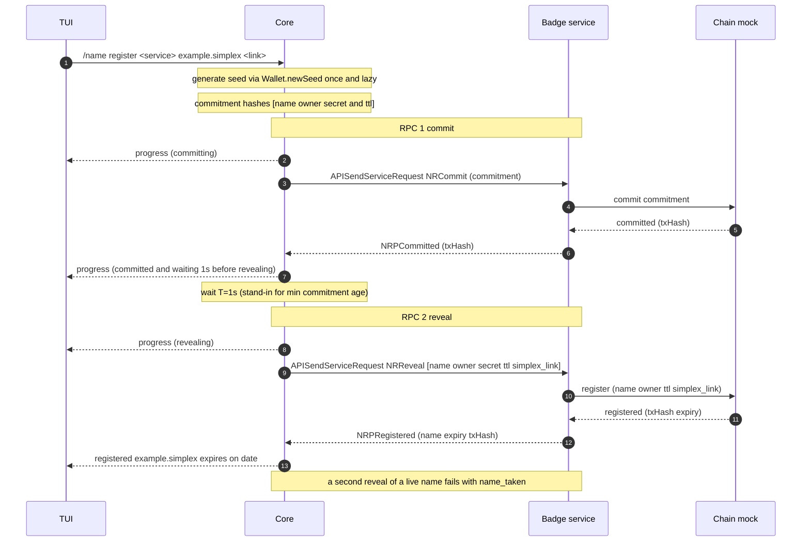

# In-app name purchase — buying and managing a name from the CLI

SimpleX names already ship: the app resolves `@name.testing` and claims a name on
a profile. What does *not* exist in the app is acquiring one — registration today
means a wallet, ETH and a browser. This moves buying and managing a name into the
app, from the TUI. It **targets the badges branch** and extends the existing badge
service into a registrar with an in-memory chain mock — no new bot, no new
transport. The wallet is real and signs: a seed per device, a key per name, and
EIP-712 intents a relayer submits.

## Scope

**In:** buying a name with a redemption code, pointing it at an address with a
signed record edit, listing what you own, and recovering it all from a phrase —
all from the TUI, against the badge service acting as registrar. Seeds and the
name → key map are persisted in the chat database, so a registered name stays
owned by an address the client can still derive after restart.

The CLI surface: `/name register`, `/name quote`, `/name verify-code`,
`/name buy`, `/names`, `/name info`, `/name link contact|channel`,
`/name rescan`, `/name address`, and `/name keys` with `export`, `import`, `init`
and `use`. Bare plural lists, the singular takes verbs — the convention `/users`
and `/db export` already set.

**Out (later):** transfers and stealth/gifting, subnames, renewal and expiry
reminders, in-app purchase, a real relayer and a deployed chain, GUIs, tx-hash
inclusion verification, anti-grief deposits.

## One key per name

A name is owned by a key derived at `m/44'/60'/i'/0/k` — the profile's BIP-44
account `i`, and the name at address index `k`. `k` is taken when the name is
registered, so a profile's second name lands on a different address.

```
seed (BIP-39)
└── profile account i
    └── m/44'/60'/i'/0/k        one key per name; k = 0 is the profile's first
```

Worked through, for a profile that buys two names and later imports a second
seed it had used in a dapp:

```
seed1                                  generated by the CLI
└── profile Alice = account 0
    ├── m/44'/60'/0'/0/0   0x9858EfFD…Da94  owns alice.simplex
    └── m/44'/60'/0'/0/1   0x6Fac4D18…b9C0  owns lizzy.simplex

seed2                                  imported later
└── m                     0x1D07a4bE…4bE9  owns lucy.simplex  (root, no derivation)
```

Nothing here is a custom layout: `account` and `address_index` are what BIP-44
has those levels for, and the addresses line up with wallets users already have.
Pinned in the tests against the standard `abandon … about` mnemonic:

```
m/44'/60'/0'/0/0   0x9858EfFD232B4033E47d90003D41EC34EcaEda94   MetaMask account 1
m/44'/60'/0'/0/1   0x6Fac4D18c912343BF86fa7049364Dd4E424Ab9C0   MetaMask account 2
m/44'/60'/1'/0/0   0x78839F6054d7ed13918bAe0473BA31b1Ca9D7265   Ledger Live account 2
```

So **profile 0's names are exactly MetaMask's account list, in order**, and each
profile's first name is the matching Ledger Live account. Moving a single name
between this wallet and another one is therefore a derivation question already
answered — but the commands to do it (recovery-phrase import, single-name key
export) are follow-up work, not in this PR.

**Why not one key per profile.** Exporting it would hand over every name that
profile owns, and `SimplexResolver` keeps one nonce per signer shared across
every node it owns — so a shared key would serialise every name's record edits
behind one counter. Both go away with an index per name.

**Which key owns which name is not on chain and not derivable**, so it is
recorded locally (`wallet_name_keys`). The path is stored literally rather than
as indices, because a name found on an imported seed may sit on a layout that is
not ours — `lucy.simplex` above stays at the root and is re-derived from `"m"`.

### Where stealth addresses will attach

Not in this PR, but the layout has to leave room. A profile publishes **one
meta-address**: a spend key and a viewing key, both hardened under purpose
`5564'` at the profile level, `m/5564'/60'/i'/0'/0` and `m/5564'/60'/i'/1'/0`.

A sender derives a fresh destination from it without any handshake — shared
secret `s = keccak256(r · P_view)` for a random ephemeral `r`, destination
`addr(P_spend + s·G)` — and the recipient recomputes `s` from the sender's
ephemeral public key `R` as `keccak256(p_view · R)`, holding the name with
`p_spend + s`.

So a received name's key is **not at a derivation path**: it is the spend key
plus a scalar, recoverable from `R` rather than from an index. One meta-address
per profile therefore serves any number of received names, which is why the
meta-address sits at the profile level while owned names sit at the address
level.

## Why two RPCs for one call

Registration splits into **commit** then **reveal** so the registrar cannot
front-run the name:

- **commit** publishes only `H(name, ownerAddr, secret, ttl)`. No one — the
  service included — can tell which name it is.
- **reveal** submits the plaintext once the commitment is on chain already binding
  it to *your* owner address. A service that tries to grab the name at reveal
  fails: the aged commitment names you, not it.

Between commit and reveal the core waits `commitWaitMs` (1 s), and the service
**enforces** a minimum commitment age rather than trusting the client to wait — a
reveal whose commitment is too new is refused. Both are short in the mock;
production is 60 s. Deposit hardening is still deferred.

## Sequence



## Protocol (same service-RPC transport as badges)

Request travels in `APISendServiceRequest.request`, response in
`CRServiceResponse.responseData`; one response per request, per-call timeout. The
service's existing `handleServiceRequest` already decodes a `type`-discriminated
envelope and replies via `APISendServiceResponse` — names commands are added to
that dispatch.

Envelope: `version` and `request`, discriminated on `type`.

There is deliberately **no `ownerKey`** field, though the badge envelope has the
analogous `purchaseKey`. The service-RPC signing key is Ed25519, while a name
owner is a secp256k1 Ethereum address — two different keys — so an `ownerKey`
here would be a second public key that nothing verifies. The owner address
travels in the request instead. Where a request *does* need to prove ownership —
`NRRelayIntent` — it carries an EIP-712 signature the service verifies by
recovering the signer, which is stronger than a bare key field.

```
NamesRequest  = { version, request }

NamesCommand
  | NRCommit      { commitment }                     -- H(name, owner, secret, ttl)
  | NRReveal      { name, owner, secret, ttl, simplex_link }
  | NRQuote       { label, years }
  | NRBuy         { requestId, name, owner, code, simplex_link }
  | NRResolve     { name }
  | NROwnedBy     { address }
  | NRNonce       { address }
  | NRRelayIntent { requestId, name, recordKey, value, nonce, deadline, sig }

NamesResponse
  | NRPCommitted  { txHash }
  | NRPRegistered { name, expiry, txHash }
  | NRPQuote      { label, available, takenUntil?, reserved, priceUsdCents, years }
  | NRPRecord     { name, owner, contact[], channel[], expiry, editsLeft }
  | NRPNames      { names[] }
  | NRPNonce      { nonce }
  | NRPRelayed    { txHash }
  | NRPError      { code, message?, retryAfter? }
```

Error codes: `name_taken`, `bad_request`, `unsupported_version`, `internal`,
`name_reserved`, `name_too_short`, `payment_rejected`, `code_spent`,
`code_expired`, `bad_signature`, `bad_nonce`, `expired_intent`, `not_owner`,
`not_found`, `no_edit_credits`.

`simplex_link` is written as the name's resolver **text record** — the SMP contact
or channel a resolver reads back to turn `example.simplex` into a live address.
Registration therefore does two writes: the registration itself and this record.

Each response carries the transaction's **`txHash`**. Using it to verify block
inclusion is out of scope here; the field is returned now so that path needs no
protocol change later.

**Versioning.** The envelope's `version` stays 1: every addition above is a new
command, and an older service answers an unknown one with `unsupported_version`
rather than mis-handling it. Bump only when an existing command's shape changes.

## Progress events

Registration stays one command but streams `CEvt` progress to the UI as it
advances — the same async event channel the app already uses for XFTP transfer
and ratchet-sync progress. The TUI prints a live line per phase; the command's
final response returns at the end.

```
CEvtNameRegistrationProgress { name, phase, waitMs? }
phase = Committing | Committed | Revealing | Registered
```

`Committed` carries `waitMs = 1000` and the wait starts the moment it is emitted,
so the TUI renders it as one line — `committed. waiting 1s before revealing`.
There is no separate `Waiting` phase: nothing happens between the two, so it would
only print a second line and then sit there. No verification phases (out of
scope). Against a real chain the same `waitMs` carries the real
min-commitment-age unchanged.

**Idempotency.** `NRCommit` re-accepts an existing commitment, so re-committing is
free. `NRReveal` is *not* idempotent: once a name is live, any further reveal
fails with `name_taken`, including from its own owner — registering again is not
an edit.

Every *mutating* call — `NRBuy`, `NRRelayIntent` — carries a **`requestId`**, and
the service replays the stored response rather than executing twice. Matching
fields cannot distinguish a resent request from a user genuinely doing the same
thing again, which is why the id is there from the start rather than added when
retries arrive.

## Components and reuse

| Component | Built | Extends to |
|---|---|---|
| **Wallet** | `newSeed`, `deriveNameKey` / `deriveAtPath`, `accountAddress`, `signIntent`, recovery-phrase import and export. No digest signing is exported. | stealth keys hang off the same profile account; the wallet already holds the one-time-address table's shape. |
| **Wallet storage** | `wallet_seeds` (several per device, `backed_up`), `wallet_name_keys` (name → path, provenance), a `k` high-water mark per profile. | raw-key import writes `provenance = 'imported'`; the column exists, the path does not. |
| **Codes** | `Names.Codes`: pinned-key verification, `SMPX1-` format, dev issuer behind the `dev_codes` flag. | production key schedule; the real blinding protocol lives in the web store, not here. |
| **Intents** | `Names.Snrc`: namehash, `SetText` type string, `intentDigest`, `signSnrcIntent`. | `TransferName` when transfers land — the type string already changed for stealth. |
| **RPC transport** | badges' `APISendServiceRequest` / `APISendServiceResponse`, unchanged. | shared. |
| **Service** | registrar dispatch for all nine commands, readable chain, spent-code ledger, signature and nonce checks, edit accounting, real minimum commitment age. | swap the mock for a relayer to a deployed SNRC. |
| **Resolution** | the mock chain is the record; the client keeps the name → key map but no record cache. | a resolver read against a deployed SNRC. |
| **TUI** | the verbs listed in Scope, rendering `CEvt` progress then the result. | `primary`, transfers, subnames. |

## Redemption codes

### The pitch

Two groups are promised a name of their choosing, above some minimum length. Both
have a reason not to want that name traced back to how they got it.

**Investors** taking a name as a perk may not want SimpleX to know which name is
theirs: the perk should not double as a register of who invested. (An investor who
registers before the public sale reveals it anyway — their choice to make.)
**Web-store buyers** do not want the name linked to how they paid. Monero protects
that end well, Bitcoin less so, a card not at all — and none of it helps if the
shop simply records "this card bought that name". (IAP buyers accept that
linkability and obtain no codes.)

A redemption code carries the entitlement from paying to registering. The usual
way to keep those apart is a promise: issue a code, note who got it, undertake not
to look. Here there is nothing to look at.

**The buyer's story**

1. Sign in to the web store — with a Wefunder email for a perk, or by paying in
   card, BTC or XMR. *The store learns who is asking and what they are owed, which
   is what it already knew.*
2. The browser generates a random 32-byte nonce and blinds it.
3. The store signs the blinded value under the key for that tier and expiry cohort
   (RFC 9474 blind RSA, as in Privacy Pass and Apple's Private Access Tokens).
   *It can count requests per account; it cannot tell two apart by content.*
4. The browser unblinds, leaving a valid signature over a number the store has
   never seen. *A bearer token: no account, no identity, nothing tying it to
   step 1.*
5. Minutes or months later the code is pasted into the app and a name is
   registered. *The registrar checks the signature against a pinned key, reads the
   tier and expiry from whichever key matched, and files the nonce so it cannot be
   spent twice.*

Nothing at step 5 can be joined to step 1 — not by us, not by an investor's
employer, not by anyone who later obtains both sets of records, because one of
those sets was never written.

**The key schedule.** Cohorts are yearly: the first runs to the end of 2027 and
expires at the end of 2028, so even the last buyer gets a clear year. Tiers grow as
registration opens for shorter names, so plan on **six tiers across three years —
about 18 public keys, under 5 KB** compiled into the app and the registrar. They
are generated ahead of time because a cohort opened after an app shipped could not
otherwise be verified by it.

**What it does not claim.** A code is anonymous *within the set sharing its issuer
key*, so the tier count and cohort length are the privacy parameters, not
administrative details. And it unlinks paying from registering, not registering
from SimpleX: the relayer still submits the transaction.

### What a code is

A code authorises registering **one name of at least N characters for M years**,
and stops working after a fixed date. It names no particular name, and it is
bearer: whoever holds it can spend it.

```
SMPX1-<base64url(payload)>            no padding
payload = nonce(32) ‖ RSA-PSS signature(256)
```

390 characters in full — pasted or scanned, never typed:

```
SMPX1-nyxxqAPVThi7YA834pFKxl2IAnsU-TptwEXoG5pzL1CK4b0cVuzmvL-jlPwVA58FzX5aZaCc
k-dBxQ4yxJ_0JpKLdagQwpTBOFz6pSh49IMAIK51LUnGfJJN61bkNZW-8iUPISYYC7fXPIWtJ_2GiT
yJm3gPb29pfEoBmN4BPK6JBdzzWBvYmBaFmlbPuMkR65Yh95U4rhXzACgmHZOUyhBsvnqxPLXBujGL
qHJaJxJthWQiF-YGLPVgvl7Uk448YJuaDFHL8edMW0cWyPO90GejQ8v2aSWmo9LRvkAfWIBOeCYOI9
b4PqCbBPWfM1Z58RRAtMXiN_nubjYmPIIw0rjPZ-Ex__Y4P5IMK-6tRe8GREtovnczgs1yXEY9xcym
```

(line-wrapped here for the page; the code itself is one unbroken string)

### Why the message is only a nonce

A blind issuer signs a value it cannot read, so it cannot check the content.
Anything carried inside the message would therefore be whatever the holder chose
to put there — a holder could grant themselves a ten-year term or an expiry in
the next century.

So the message carries no claims at all, and **everything the issuer attests is a
property of the key**: minimum name length, term, and expiry. A key exists per
**(tier, expiry cohort)**, and "which key verified this" is the entire meaning of
a code.

This is also why expiry is a cohort rather than per-buyer: a distinct expiry date
would identify its holder as precisely as a serial number.

### Does the key set grow without bound?

No — the **live** set is bounded, because a key retires when its cohort expires.

```
live keys  =  tiers  ×  ceil(code validity / cohort length)  +  1
```

Keys past their cohort's expiry (plus a grace window) are dropped from the client,
and R14's spent-code set retires with them, so that is bounded too.

What grows is the *cumulative* set over the product's life, and it matters for one
reason: **the client verifies against keys compiled into the build**, so a cohort
opened after an app shipped cannot be verified by it. Hence pinning a schedule
rather than a key (see the pitch for the numbers).

Two consequences worth building deliberately. A build whose schedule has run out
must say **"this code is newer than this build, update the app"** rather than
"invalid code" — indistinguishable to the maths, completely different to the user.
And if the schedule ever proves too rigid, the escape hatch is one long-lived root
key signing cohort keys, with the certificate carried inside the code: exactly one
pinned key forever, at roughly 500 extra bytes per code. Not needed at these
numbers, and noted so it is not rediscovered under pressure.

### How a code is checked

**On the device, before anything is sent.** There is deliberately no "is this
code valid" RPC: that would hand the service an oracle for probing codes. The
client tries each pinned key, and the tier comes from whichever one verifies — so
the tier cannot be forged by editing the code.

The service re-verifies, and separately keeps the **spent-code set**. Two details
there are load-bearing and are pinned by tests:

- **base64url, not base64.** `+` and `/` do not survive a URL, a path, or form
  encoding, and a code that arrives silently wrong is worse than one that fails.
- **The ledger keys on the decoded nonce, never the code string.** base64's final
  character carries unused bits, so one code can be written more than one way and
  a text-keyed ledger could be bypassed by changing a character. The nonce is also
  safer than the signature, since PSS is randomised and one message can yield more
  than one valid signature.

### Development codes

Production issuer keys are **deliberately not defined yet**. The format is fixed
so adding them is data rather than code, and a build with none says so plainly.

A fixed development key lives behind the `dev_codes` cabal flag — a compile-time
flag and not configuration, because a dev verification key in a release build
would be a forgery key for real codes, and no runtime setting should be able to
switch that on. The service mints and prints codes under it at startup so the
whole flow is runnable locally, and the nonces are fixed so the codes are
identical on every run and tests can hardcode them.

That signer works **unblinded**: it picks the nonce and sees the code, because
issuer and verifier are the same process. It exercises verification exactly, and
it is *not* the issuance model — a production issuer needs the blinding protocol
above.

## Editing records

Pointing a name somewhere is a signed EIP-712 intent the relayer submits:

```
SetText(bytes32 node,string key,string value,uint256 nonce,uint256 deadline)
```

`simplex.contact` and `simplex.channel` are independent records, so the CLI takes
the record as a subcommand and setting one leaves the other alone. Each edit
spends one of the name's **10 relayed edits**, counted by the service — metering
is off chain, because the relayer is the only caller of the sponsored path and
pays the gas either way. That bounds what SimpleX relays, not what an owner may
do: anyone who exports their key can act on chain directly and without limit.

Deadlines are minutes, not days. A long-lived signed intent outlives a name
changing hands and could then be replayed against the new owner's name.

The wallet exposes no digest-signing function. `signIntent` takes a domain, a
type string and typed values, so a service-supplied 32 bytes cannot be coerced
into it — "the app never signs an opaque payload" is a property of the type
rather than a rule to remember.

## Several keys, and choosing between them

Importing a recovery phrase **adds** a key; it never replaces one, or the names
the existing key owns stop being derivable. With one key nothing needs choosing.
With several and none chosen, buying **fails with the list** rather than guessing.

Selection is a stored pointer (`/name keys use <n>`), not a prompt. No chat
command reads stdin — the interactive prompts in the codebase all run before the
controller starts — and a command that blocked on input could not be answered by
a GUI client over the JSON API, nor driven by the line-oriented tests.

`/name keys export` prints **every** key's phrase, each labelled with the names it
controls. Exporting only the key in use would be a trap: a user with two keys who
writes down "the phrase" has not backed up the other, and finds out after losing
the device.

## What is verified

Each of these is a test, not a claim.

1. **Derivation is pinned.** The standard `abandon … about` mnemonic derives
   `0x9858EfFD…Da94` at `m/44'/60'/0'/0/0` and `0x6Fac4D18…b9C0` at `…/0/1` —
   MetaMask's account list — and `0x78839F60…7265` at `m/44'/60'/1'/0/0`, Ledger
   Live's account 2. These values can never change.
2. **A code round-trips and resists tampering.** A dev code verifies with the
   right tier and expiry; a byte flipped mid-payload does not verify; something
   that is not a code fails on the prefix rather than the maths.
3. **The purchase path works end to end.** Verify a code on the device, buy, read
   the record back, change it with a signed intent the service accepts only after
   recovering the signer, and watch the edit count fall by exactly one.
4. **Every refusal has its own message** — too short, reserved, code already
   spent — rather than a generic failure.
5. **One key per name, surviving restart.** Two names bought by one profile land
   on different addresses at consecutive indices, and both are still derivable in
   a later session.
6. **Commit/reveal still holds.** A reveal with no matching commitment is
   refused, and a live name cannot be re-registered.

## Known gaps

- `/name primary` — claiming a name for a profile routes through the existing
  `/_set domain` path, which resolves the name and checks it carries this
  profile's address. The mock chain cannot answer that yet, so the verb is not
  wired.
- Raw-key import: `provenance` exists in the schema, nothing writes `'imported'`.
- The recovery scan walks a fixed set of layouts but has not been tested against a
  name planted at a foreign one.
- Production issuer keys are undefined by design; a build with none refuses every
  code and must say so rather than reporting one invalid.
