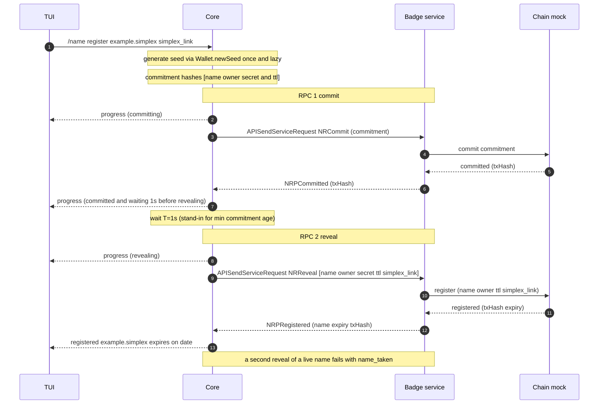

# SimpleX names MVP — register a name from the CLI

The smallest PR that registers a name for an SMP address or channel from the TUI.
It **targets the badges branch** and extends the existing badge service
with registrar commands plus an in-memory chain mock — no new bot, no new
transport. The wallet is real but read-only: generate a seed, derive the owner
address, no signing. Every piece extends into the full design already prototyped.

## Scope

**In:** `/name register <name> <simplex_link>` in the CLI → core `purchaseName` →
two RPCs to the (extended) badge service (commit, then reveal). The name then
resolves on the mock chain to that owner and SimpleX link. Real wallet key derivation
supplies the owner address, and **the seed is persisted in the chat database**, so a
registered name stays owned by an address the client can still derive after restart.
The client keeps no local names record.

**Out (later):** signing (edits, transfers, renewal), seed *backup and recovery*
(the recovery-phrase UI and the recovery scan — persistence itself is in), real
chain, payment, stealth/gifting, GUIs, min-commitment-age enforcement,
tx-hash inclusion verification, anti-grief deposits.

## Why two RPCs for one call

`purchaseName` splits into **commit** then **reveal** so the registrar cannot
front-run the name:

- **commit** publishes only `H(name, ownerAddr, secret, ttl)`. No one — the
  service included — can tell which name it is.
- **reveal** submits the plaintext once the commitment is on chain already binding
  it to *your* owner address. A service that tries to grab the name at reveal
  fails: the aged commitment names you, not it.

Between commit and reveal the core waits a hardcoded **T = 1 s**, standing in for
the on-chain minimum commitment age. Real aging (and deposit hardening) is
deferred; the two-step shape and the wait are what this MVP locks in.

## Sequence



## Protocol (same service-RPC transport as badges)

Request travels in `APISendServiceRequest.request`, response in
`CRServiceResponse.responseData`; one response per request, per-call timeout. The
service's existing `handleServiceRequest` already decodes a `type`-discriminated
envelope and replies via `APISendServiceResponse` — names commands are added to
that dispatch.

Envelope: `version` and `request`, discriminated on `type`.

There is deliberately **no `ownerKey`** field, though the badge envelope has the
analogous `purchaseKey`. The service-RPC signing key is Ed25519, while a name
owner is a secp256k1 Ethereum address — two different keys — so an `ownerKey`
here would be a second public key that nothing verifies. The owner address
travels in `NRReveal` instead, and the request is sent unsigned. Authenticating
the owner needs signing, which is out of scope; when it arrives it binds the
commitment to a signature rather than to a bare key field.

```
NamesRequest  = { version, request }
NamesCommand
  | NRCommit  { commitment }                          -- H(name, owner, secret, ttl)
  | NRReveal  { name, owner, secret, ttl, simplex_link } -- simplex_link: SMP contact or channel

NamesResponse
  | NRPCommitted  { txHash }
  | NRPRegistered { name, expiry, txHash }
  | NRPError      { code, message?, retryAfter? }       -- e.g. name_taken, bad_request
```

`simplex_link` is written on chain as the name's resolver **text record** — the SMP
contact or channel a resolver reads back to turn `example.simplex` into a live
address. `register` in RPC 2 therefore does two chain writes: the registration
(owner, ttl) and this text record.

Each response carries the transaction's **`txHash`**. Using it to verify block
inclusion is out of scope here (see above); the field is returned now so that
path needs no protocol change later.

## Progress events

`purchaseName` stays one command but streams `CEvt` progress to the UI as it
advances — the same async event channel the app already uses for XFTP transfer
and ratchet-sync progress. The TUI prints a live line per phase; the command's
final response returns at the end.

```
CEvtNameRegistrationProgress { name, phase, waitMs? }
phase = Committing | Committed | Revealing | Registered
```

`Committed` carries `waitMs = 1000` and the wait starts the moment it is emitted,
so the TUI renders it as one line — `committed. waiting 1s before revealing`.
There is no separate `Waiting` phase: nothing happens between the two, so it would
only print a second line and then sit there. No verification phases (out of
scope). Against a real chain the same `waitMs` carries the real
min-commitment-age unchanged.

**Idempotency.** `NRCommit` re-accepts an existing commitment, so re-committing
is free. `NRReveal` is *not* idempotent: once a name is registered any further
reveal of it fails with `name_taken`, including from its own owner — registering
again is not an edit, and edits need signing (out of scope).

This MVP has no automatic retry, so the only way to reach a repeat reveal is to
run the command twice, which is a duplicate registration and must say so rather
than silently report success. When retry-on-timeout is added, idempotency has to
key on a **request id**: matching fields cannot distinguish a resent request from
a user registering the same name again.

## Components and reuse

| Component | This PR | Extends to |
|---|---|---|
| **Wallet** | `Wallet.newSeed` + `deriveAccount` + `accountAddress`, already built. No signing. | `signIntent` (also built) unlocks edits/transfers with no shape change. |
| **Wallet storage** | the prototype's `wallet_seeds` migration and `Store.Wallets` verbatim: one seed per DB, one account index per profile, allocated from a stored high-water mark. | recovery import, `backed_up` reminder and the one-time-address table are already in the schema; they need code only. |
| **RPC transport** | badges' `APISendServiceRequest` / `APISendServiceResponse`, unchanged. | shared. |
| **Service** | extend `BadgeService/Service.hs` `handleServiceRequest` to dispatch `NRCommit`/`NRReveal`; add an in-memory chain mock (a `TVar (Map name entry)`, like `Names.Service.Mock`). | swap the mock for a relayer to a deployed SNRC. |
| **Resolution** | the mock chain is the record: the name resolves there to owner and SimpleX link. No client-side names store. | a resolver read against a deployed SNRC; add a local cache only if a listing UX needs it. |
| **TUI** | `/name register <name> <simplex_link>`; renders `CEvt` progress lines including the 1 s wait, then the result. | further `/name …` verbs; richer progress once the chain is real. |

## Milestones (each ends with passing tests)

1. **Envelope + types** — `NamesRequest`/`NamesResponse` in the shared service
   module; JSON roundtrip test. No behaviour yet.
2. **Service dispatch + chain mock** — `handleServiceRequest` recognises the names
   commands; the in-memory chain answers commit/reveal and rejects a taken name.
3. **Core `purchaseName` + progress** — derive owner from a lazily-generated
   seed persisted in the chat DB; commit, wait 1 s, reveal against the mock chain; stream
   `CEvtNameRegistrationProgress` at each phase. `/name register` renders the
   progress lines, the announced wait, and the result. No local names record.
4. **End-to-end CLI test** — `/name register example.simplex <simplex_link>` emits the
   phase progress (including the 1 s wait on `Committed`) and resolves the name to the
   derived owner with the given SimpleX link; a second registration of the same name
   fails with `name_taken`; and a restarted client derives the same owner address.

## Success criterion

The milestone-4 test passes: one name registered through commit+reveal against the
in-service chain mock, owned by a real derived address, with `name_taken` on
repeat.
