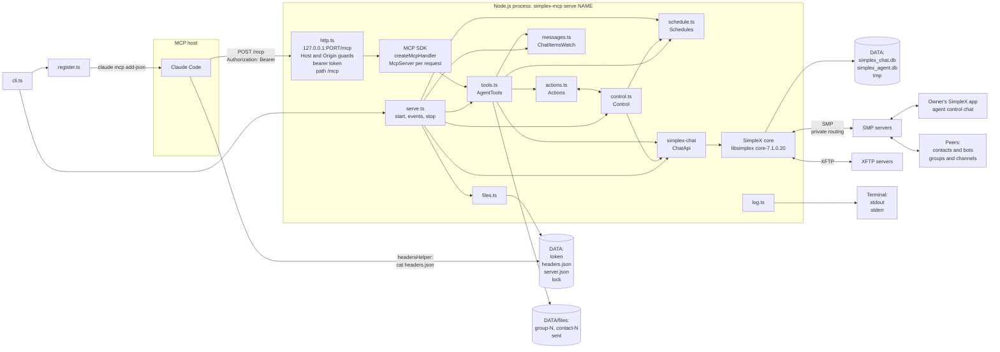
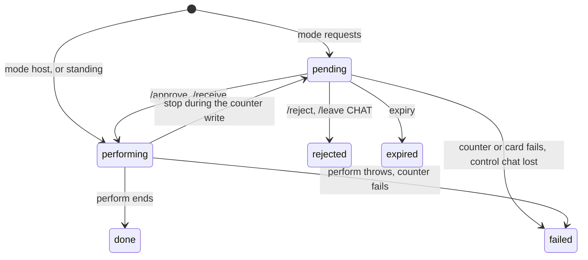

# SimpleX MCP server: architecture

> System structure, modules, state, process lifecycle, approval model and security boundaries of `@simplex-chat/mcp` 0.2.0.
>
> Related specs: [README](README.md) | [Flows](flows.md) | [API](api.md)
> Related docs: [README](../README.md) | [Reference](../REFERENCE.md) | [PLAN](../PLAN.md)

**Source:** [`cli.ts`](../src/cli.ts) | [`serve.ts`](../src/serve.ts) | [`http.ts`](../src/http.ts) | [`tools.ts`](../src/tools.ts) | [`actions.ts`](../src/actions.ts) | [`control.ts`](../src/control.ts) | [`messages.ts`](../src/messages.ts) | [`files.ts`](../src/files.ts) | [`register.ts`](../src/register.ts) | [`log.ts`](../src/log.ts) | [`schedule.ts`](../src/schedule.ts)

---

## Table of contents

1. [System diagram](#1-system-diagram)
2. [Modules](#2-modules)
3. [State](#3-state)
4. [Process lifecycle](#4-process-lifecycle)
5. [Approval model](#5-approval-model)
6. [Security boundaries](#6-security-boundaries)
7. [Limits](#7-limits)

---

## 1. System diagram


```mermaid
flowchart LR
  subgraph host["MCP host"]
    cc["Claude Code"]
  end
  subgraph proc["Node.js process: simplex-mcp serve NAME"]
    http["http.ts<br/>127.0.0.1:PORT/mcp<br/>Host and Origin guards<br/>bearer token<br/>path /mcp"]
    sdk["MCP SDK<br/>createMcpHandler<br/>McpServer per request"]
    tools["tools.ts<br/>AgentTools"]
    actions["actions.ts<br/>Actions"]
    control["control.ts<br/>Control"]
    schedule["schedule.ts<br/>Schedules"]
    messages["messages.ts<br/>ChatItemsWatch"]
    serve["serve.ts<br/>start, events, stop"]
    files["files.ts"]
    log["log.ts"]
    lib["simplex-chat<br/>ChatApi"]
    core["SimpleX core<br/>libsimplex core-7.1.0.20"]
  end
  cli["cli.ts"] --> serve
  cli --> register["register.ts"]
  register -->|"claude mcp add-json"| cc
  cc -->|"headersHelper:<br/>cat headers.json"| data
  cc -->|"POST /mcp<br/>Authorization: Bearer"| http
  http --> sdk --> tools
  tools --> actions
  actions <--> control
  tools --> messages
  serve --> control
  serve --> tools
  serve --> messages
  serve --> files
  serve --> schedule
  control --> schedule
  tools --> schedule
  files --> data[("DATA:<br/>token<br/>headers.json<br/>server.json<br/>lock")]
  tools --> folder[("DATA/files:<br/>group-N, contact-N<br/>sent")]
  tools --> lib
  control --> lib
  serve --> lib
  lib --> core
  core --> db[("DATA:<br/>simplex_chat.db<br/>simplex_agent.db<br/>tmp")]
  core <-->|"SMP<br/>private routing"| smp["SMP servers"]
  core <-->|"XFTP"| xftp["XFTP servers"]
  smp <--> owner["Owner's SimpleX app<br/>agent control chat"]
  smp <--> peers["Peers:<br/>contacts and bots<br/>groups and channels"]
  log --> term["Terminal:<br/>stdout<br/>stderr"]
```

Data flow of a tool call:

1. Claude Code runs the `headersHelper` command of its entry ([`register.ts:50`](../src/register.ts#L50)) and sends the `Authorization` header it prints ([Reference](../REFERENCE.md#add-the-agent-to-claude-code)).
2. The server checks Host, Origin, token, path and readiness, then passes the request to the SDK handler ([`http.ts:19-28`](../src/http.ts#L19-L28)).
3. An `McpServer` is built from the factory for each request, and the arguments are validated against the input schema by the SDK ([`serve.ts:113-117`](../src/serve.ts#L113-L117), [`mcp-BumlNux0.cjs:1812-1817`](../node_modules/@modelcontextprotocol/server/dist/mcp-BumlNux0.cjs#L1812-L1817)).
4. The handler result is returned by `AgentTools.call` as `structuredContent` and as JSON text ([`tools.ts:508-515`](../src/tools.ts#L508-L515)).
5. The server calls `ChatApi` methods of the core ([`messages.ts:267-283`](../src/messages.ts#L267-L283)); actions are created in `Actions` and shown to the owner by `Control` ([`actions.ts:155-186`](../src/actions.ts#L155-L186)).
6. The core emits events; the server dispatches them in one handler of `serve.ts` to the tools, the item watch and the agent control chat ([`serve.ts:132-168`](../src/serve.ts#L132-L168)).

---

## 2. Modules

### [2.1 `cli.ts`](../src/cli.ts)

Entry point of the `simplex-mcp` binary.

| Symbol | Line | Contents |
|---|---|---|
| `helpText` | [10](../src/cli.ts#L10) | `--help` output |
| `Command` | [40](../src/cli.ts#L40) | `help`, `serve` with `ServeOptions`, `register` with `RegisterOptions` |
| `parseCommand` | [45](../src/cli.ts#L45) | command, NAME and options to a `Command` |
| `serveOptions` | [54](../src/cli.ts#L54) | defaults and option switch of `serve` |
| `registerOptions` | [110](../src/cli.ts#L110) | defaults and option switch of `register` |
| `OptionReader` | [127](../src/cli.ts#L127) | `value`: the next argument, required<br>`optionalValue`: the next argument, absent when missing or starting with `--` |
| `validAgentName` | [149](../src/cli.ts#L149) | `^[a-z0-9](-?[a-z0-9])*-?$`, at most 32 characters |
| `usageError` | [194](../src/cli.ts#L194) | `ExitError` with code 2 |
| `main` | [198](../src/cli.ts#L198) | `help` to stdout, `serve`, `register` |
| top-level catch | [211-220](../src/cli.ts#L211-L220) | `ExitError`: message on stderr, its code; other errors: `logError`, code 1 |

### [2.2 `serve.ts`](../src/serve.ts)

Start sequence, event dispatch and stop sequence of one agent.

| Symbol | Line | Contents |
|---|---|---|
| `version` | [16](../src/serve.ts#L16) | the package version |
| `OwnerEntry` | [20](../src/serve.ts#L20) | `{memberId, name}` of `--owners` |
| `ServeOptions` | [25](../src/serve.ts#L25) | name, data folder and its `dataGiven` flag, display name, mode, owners, expiry, reset and token flags, port, QR code size, stop wait |
| `RunningServer` | [40](../src/serve.ts#L40) | token, `ChatApi`, user, `Actions`, `stop` |
| `serve` | [48](../src/serve.ts#L48) | `startServer`, then SIGINT and SIGTERM handlers: the first signal stops, a second ends the stop wait |
| `startServer` | [66](../src/serve.ts#L66) | data folder, lock, token, headers file, `ChatApi.init`, `startAgent`; cleanup on error |
| `startAgent` | [89](../src/serve.ts#L89) | user, network config, temp folder, control group, wiring of `Actions`, `Schedules`, `AgentTools`, `Control`, HTTP, schedule timer, event handler, `stop` |
| `registerHint` | [189](../src/serve.ts#L189) | the `register` command line printed after the owner setup |
| `waitForCancelledCards` | [193](../src/serve.ts#L193) | the fixed wait at stop for cards edited or posted at the stop |
| `setTempFolder` | [209](../src/serve.ts#L209) | `DATA/tmp`, mode 0700, as the core's temp folder |
| `updatedUser` | [215](../src/serve.ts#L215) | display name and peer type `agent` of the profile |
| `controlGroup` | [222](../src/serve.ts#L222) | found, created or reset agent control chat |
| `listen` | [229](../src/serve.ts#L229) | `startHttp`; `EADDRINUSE` to `ExitError` code 1 |
| `bufferEvents` | [238](../src/serve.ts#L238) | events received before the handler is installed are queued and replayed in order |

### [2.3 `http.ts`](../src/http.ts)

| Symbol | Line | Contents |
|---|---|---|
| `HttpOptions` | [7](../src/http.ts#L7) | port, token, `McpServerFactory`, readiness |
| `startHttp` | [14](../src/http.ts#L14) | `http.Server` on `127.0.0.1:port`: guards, SDK handler, timeouts |
| `authorized` | [34](../src/http.ts#L34) | length check and `timingSafeEqual` against `Bearer <token>` |
| `stopHttp` | [48](../src/http.ts#L48) | `server.close` and `closeAllConnections` |

### [2.4 `tools.ts`](../src/tools.ts)

Tool definitions, call handlers, connect plans, perform steps, files.

| Symbol | Line | Contents |
|---|---|---|
| `ConnectInput`, `SendInput`, `ReceiveInput`, `LeaveInput`, `DownloadInput` | [47-81](../src/tools.ts#L47-L81) | tool inputs |
| `PlanSummary` | [87](../src/tools.ts#L87) | card kind, chat type, name, SimpleX name, peer type, description, welcome, commands, `takesMessage` |
| `ChatFields` | [99](../src/tools.ts#L99) | chat fields of `connect` and `list` results |
| `Agent` | [113](../src/tools.ts#L113) | `ChatApi`, user, `Actions`, `ChatItemsWatch`, control chat reference, standing approver lookup, refused file post, data folder, `Schedules` |
| `JoinMethod` | [125](../src/tools.ts#L125) | `prepared`, `prepareChannel`, `viaAddress`, `prepareContact`, `connect` |
| schemas | [180-408](../src/tools.ts#L180-L408) | input and output JSON schemas |
| descriptions, `instructions` | [410-449](../src/tools.ts#L410-L449) | tool descriptions and server instructions |
| `definitions` | [459](../src/tools.ts#L459) | name, description, schemas and action flag of the six tools |
| `Download` | [470](../src/tools.ts#L470) | one download: its promise, chat, item, file ID, size, path, the last fileSource seen, received bytes and their time, check timer |
| `AgentTools.register` | [496](../src/tools.ts#L496) | `registerTool` for each definition; `_meta` in mode `host` |
| `AgentTools.call` | [508](../src/tools.ts#L508) | handler result to `CallToolResult`; errors to `isError` |
| `AgentTools.perform` | [517](../src/tools.ts#L517) | perform step of an approved action |
| `downloadFile`, `forwardFile`, `downloadTo` | [530-557](../src/tools.ts#L530-L557) | one download per file ID, shared by `download` and `/forward`; a forwarded file moved to the download path for `download` |
| file events | [559-596](../src/tools.ts#L559-L596) | `onNewItems`, `onFile`, `onFileComplete`, `onFileError`, `onFileCancelled`, `onFileDescription` |
| `onContactConnected`, `onUserJoinedGroup` | [598-606](../src/tools.ts#L598-L606) | completion of connect actions by events |
| `actionResult` | [644](../src/tools.ts#L644) | wait for the decision, result fields, removal |
| `attachment`, `isRefused`, `fileToSend`, `resizedCopy` | [868-904](../src/tools.ts#L868-L904) | the file of a `send` |
| `copyForSending`, `chatFiles`, `deleteChatFiles` | [906-935](../src/tools.ts#L906-L935) | `/forward` copies; the files of a chat, forwarded ones included; its downloads cancelled, also those the core continues after a restart |
| `leaveChat` | [958](../src/tools.ts#L958) | perform step of `leave` and `/leave`; the chat's forwarded files deleted, its schedules dropped |
| `download`, `fileServers`, `unknownServers` | [969-1015](../src/tools.ts#L969-L1015) | the `download` call before its action |
| `startDownload`, `checkDownload`, `currentFile`, `settleFile`, `settleReceived`, `moveReceived` | [1033-1100](../src/tools.ts#L1033-L1100) | a download's steps |
| `agentChats`, `knownChat` | [1173-1190](../src/tools.ts#L1173-L1190) | the agent's chats; a checked chat reference |
| `classifyPlan` | [1273](../src/tools.ts#L1273) | `apiConnectPlan` response to a join plan or a known chat |
| `chatSubject`, `isConnected`, `isActive`, `memberCurrent` | [1369-1422](../src/tools.ts#L1369-L1422) | chat and member predicates shared with `control.ts` |
| `fitsMessage`, `quoteContent` | [1446-1462](../src/tools.ts#L1446-L1462) | the message as the core sends it, within 15602 bytes; for `send` and the post of `/forward` |
| `realFile` | [1478](../src/tools.ts#L1478) | real path, size, inode and change time of a file |
| `attachmentMedia`, `videoFrame`, `videoDuration` | [1525-1559](../src/tools.ts#L1525-L1559) | previews and durations |
| `toolCall` | [1575](../src/tools.ts#L1575) | `ServerContext` to `ToolCall`: abort signal and progress notifications |

### [2.5 `actions.ts`](../src/actions.ts)

| Symbol | Line | Contents |
|---|---|---|
| `Mode` | [5](../src/actions.ts#L5) | `requests`, `host` |
| `State` | [6](../src/actions.ts#L6) | `pending`, `performing`, `done`, `failed`, `rejected`, `expired` |
| `Standing` | [7](../src/actions.ts#L7) | `messages`, `files` |
| `ToolError` | [19](../src/actions.ts#L19) | errors the model can correct; text returned as is |
| `Subject` | [21](../src/actions.ts#L21) | kind, name, SimpleX name, incognito flag of a card |
| `ConnRef` | [28](../src/actions.ts#L28) | pending connection, contact or group of a connect action |
| `ActionRecord` | [34](../src/actions.ts#L34) | number, key, times, change signal, standing flag, state, card, decider, open calls, interrupted flag, error, card image |
| `ConnectAction`, `SendAction`, `LeaveAction`, `DownloadAction` | [51-110](../src/actions.ts#L51-L110) | per-tool fields; `Attachment`, the file of a send |
| `ActionHooks` | [116](../src/actions.ts#L116) | `refusal`, `saveCounter`, `postCard`, `perform`, `outcome` |
| `Actions` | [124](../src/actions.ts#L124) | action map, expiry timer, posting and outcome promises |
| `create` | [155](../src/actions.ts#L155) | refusal checks, number, log line, counter write, card |
| `decided` | [206](../src/actions.ts#L206) | wait with progress until a decided state, `until`, or the abort signal |
| `stop` | [240](../src/actions.ts#L240) | cancellation of pending and performing actions |
| `summary`, `performedText`, `progressText` | [315-354](../src/actions.ts#L315-L354) | log and progress texts |

Hooks are bound in [`serve.ts:101-107`](../src/serve.ts#L101-L107): `refusal`, `saveCounter`, `postCard` and `outcome` to `Control`; `perform` to `AgentTools`.

### [2.6 `control.ts`](../src/control.ts)

| Symbol | Line | Contents |
|---|---|---|
| `controlCommands` | [11](../src/control.ts#L11) | the command menu |
| `standings` | [26](../src/control.ts#L26) | custom data key and reply words of the approvals of messages and files |
| `helpTexts` | [95](../src/control.ts#L95) | the `/help` text of each topic: the commands for an empty topic, how to use a command for its keyword |
| `ControlData` | [112](../src/control.ts#L112) | `{control: true, nextAction}` |
| `ChatApproval` | [129](../src/control.ts#L129) | `{approvedBy, approvedById, approvedAt}` |
| `OwnerRequest` | [135](../src/control.ts#L135) | parsed owner command |
| `Control.load` | [175](../src/control.ts#L175) | lost check, group profile and menu, member list, schedules of the agent's chats |
| `Control.start` | [185](../src/control.ts#L185) | owner setup per `--owners` |
| `Control.refusal` | [193](../src/control.ts#L193) | bytes left for the link texts of a connect card, card size of a send, connect or download, approver presence |
| `Control.standingApprover` | [204](../src/control.ts#L204) | approver name of a chat's standing approval of messages or files |
| `Control.hasApprover` | [209](../src/control.ts#L209) | whether a member ID is a current approver and the control chat is not lost; for standing approvals and schedules |
| `Control.saveCounter` | [213](../src/control.ts#L213) | queued counter writes |
| `Control.postCard`, `Control.outcome` | [219-230](../src/control.ts#L219-L230) | card post and card edit; the kept-files message after a done leave |
| `Control.refusedFile`, `Control.fileNotSent` | [232-247](../src/control.ts#L232-L247) | posts about files |
| `Control.onMessage` | [249](../src/control.ts#L249) | owner commands, queued one at a time |
| `Control.onEvent` | [261](../src/control.ts#L261) | membership changes and loss of the control chat |
| `Control.ownerCommand` | [278](../src/control.ts#L278) | command dispatch and replies |
| `approveChat`, `revoke`, `addSchedule`, `removeSchedule`, `forward`, `leave`, `deleteFiles` | [328-420](../src/control.ts#L328-L420) | owner requests |
| `schedulesText` | [441](../src/control.ts#L441) | the `/schedules` reply |
| `cardContent`, `fittedImage` | [561-581](../src/control.ts#L561-L581) | image and video cards with the file's preview |
| `findControlGroup`, `createControlChat`, `resetControlChat` | [619-647](../src/control.ts#L619-L647) | control group lookup, creation, reset |
| `isControlEvent` | [649](../src/control.ts#L649) | membership events of the control group |
| `parseCommand` | [665](../src/control.ts#L665) | one-line `/keyword params` |
| `cardText`, `requestLines`, `commandsLine` | [672-736](../src/control.ts#L672-L736) | card text per tool, state and mode |
| `largestCard`, `encodedLength` | [742-750](../src/control.ts#L742-L750) | card size check |
| `serversLine`, `sizeText` | [784-793](../src/control.ts#L784-L793) | servers line and sizes of download cards |
| `codeSpan`, `safeName`, `mentionText` | [803-815](../src/control.ts#L803-L815) | quoting of peer text |
| `schedulesOf`, `utcOffset` | [830-839](../src/control.ts#L830-L839) | valid schedule entries of a chat's custom data; the server's UTC offset |
| `ownerRequest` | [841](../src/control.ts#L841) | command words to an `OwnerRequest` |
| `qrCodeText` | [860](../src/control.ts#L860) | terminal QR code |
| `losesControl`, `isLost` | [876-891](../src/control.ts#L876-L891) | loss of the control chat |
| `entryText`, `restartText` | [909-919](../src/control.ts#L909-L919) | `--owners` entries in restart lines |

### [2.7 `messages.ts`](../src/messages.ts)

| Symbol | Line | Contents |
|---|---|---|
| `Message`, `MessageFile`, `FileOffer` | [16-50](../src/messages.ts#L16-L50) | message item of tool results; its file; the file of a download |
| `ToolCall` | [57](../src/messages.ts#L57) | abort signal and progress callback of one call |
| `Collected` | [62](../src/messages.ts#L62) | collected items, change signal, IDs of the items over the first 100, time of the last change |
| `Changes` | [69](../src/messages.ts#L69) | set of wake callbacks |
| `ChatItemsWatch` | [86](../src/messages.ts#L86) | listeners per chat reference; received message items gathered by `collect` |
| `chatRef`, `anyScopeChatRef`, `isChatRef` | [135-152](../src/messages.ts#L135-L152) | `@N` and `#N` references: of the main conversation, or also of a group's member chat |
| `toMessage`, `messageFile`, `receivedFileError`, `receivedPath` | [174-213](../src/messages.ts#L174-L213) | chat item to `Message`; where a received file is: its download path or its forwarded path |
| `filePaths`, `chatFolder` | [215-223](../src/messages.ts#L215-L223) | `DATA/files/group-N`, `DATA/files/contact-N` or the same under `DATA/forwarded`; the download path and the forwarded path of a received file |
| `fileOffer`, `fileContent` | [225-250](../src/messages.ts#L225-L250) | file fields of an item; message content of a file |
| `getChat`, `receivingFiles`, `markRead` | [267-283](../src/messages.ts#L267-L283) | `apiGetChat` and `apiChatItemsRead` by chat reference; the IDs of a chat's files in status `rcvAccepted`, `rcvTransfer` or `rcvWarning`, paged |
| `unreadItems` | [285](../src/messages.ts#L285) | unread items of a chat after its `initial` read, paged |
| `reportProgress`, `nextChange`, `awaitResponses` | [301-331](../src/messages.ts#L301-L331) | waits |
| `validName`, `viewName` | [337-363](../src/messages.ts#L337-L363) | display name rules and `@name` form |

### [2.8 `files.ts`](../src/files.ts)

| Symbol | Line | Contents |
|---|---|---|
| `createDataFolder` | [12](../src/files.ts#L12) | `mkdir -p` mode 0700; `chmod 0700` except on Windows |
| `acquireLock`, `releaseLock` | [17-28](../src/files.ts#L17-L28) | `DATA/lock` with the PID |
| `serverToken` | [30](../src/files.ts#L30) | `DATA/token`: read, or 32 random bytes in base64url |
| `writeHeadersFile` | [42](../src/files.ts#L42) | `DATA/headers.json` |
| `writeServerFile`, `readServerFile` | [46-53](../src/files.ts#L46-L53) | `DATA/server.json` |

### [2.9 `register.ts`](../src/register.ts)

| Symbol | Line | Contents |
|---|---|---|
| `register` | [33](../src/register.ts#L33) | `claude mcp remove`, then `claude mcp add-json` |
| `registryEntry` | [46](../src/register.ts#L46) | `{type, url, headersHelper, timeout}` |
| `manualEntryText` | [55](../src/register.ts#L55) | entry text when `claude` is missing |
| `projectRoot` | [60](../src/register.ts#L60) | project key of `--scope local` |
| `runCommand` | [86](../src/register.ts#L86) | `spawnSync` with ENOENT detection; on Windows after ENOENT, once more through `cmd.exe` with `cmdArgument` quoting, and exit status 9009 as missing |

### [2.10 `log.ts`](../src/log.ts)

| Symbol | Line | Contents |
|---|---|---|
| `ExitError` | [18](../src/log.ts#L18) | message and exit code |
| `shellWord`, `shellPath` | [24-31](../src/log.ts#L24-L31) | POSIX single quotes or Windows double quotes |
| `oneLine` | [33](../src/log.ts#L33) | runs of `\p{Cc}`, `\p{Cf}`, `\p{Zl}`, `\p{Zp}` to one space |
| `log`, `logError` | [37-43](../src/log.ts#L37-L43) | stdout lines; stderr lines |
| `errorText`, `chatErrorText` | [45-53](../src/log.ts#L45-L53) | error text, folded to one line: the apps' wording for known error shapes, otherwise the type chain |
| `appErrorText` | [55-64](../src/log.ts#L55-L64) | wording of the apps' alerts for chat, agent and store errors |
| `fileError` | [197-201](../src/log.ts#L197-L201) | the error of a received file: the apps' words for its status, or the size limit of its sender |
| `serverHostname` | [246](../src/log.ts#L246) | host of a server address |
| `chainText`, `errorChain` | [250-262](../src/log.ts#L250-L262) | `SimpleX error: <type chain>: <scalar fields>`, details at most 500 characters |
| `fullDomainName` | [272](../src/log.ts#L272) | `SimplexDomain` to `name.simplex` or `name.testing` |

### [2.11 `schedule.ts`](../src/schedule.ts)

Scheduled prompts of the agent's chats.

| Symbol | Line | Contents |
|---|---|---|
| `cronRanges`, `cronItem` | [5-6](../src/schedule.ts#L5-L6) | value ranges of the 5 cron fields; the forms of a field's item |
| `ScheduleEntry` | [8](../src/schedule.ts#L8) | `{cron, prompt, by, byId, at}`: cron text, prompt, author's display name and member ID, ISO creation time |
| `Due` | [10](../src/schedule.ts#L10) | `{prompt, at}`: a due prompt and its due minute in UTC |
| `Schedules` | [12](../src/schedule.ts#L12) | entries per chat reference, each with its due prompt; wake listeners; timer; the approver check of `byId` |
| `set` | [19](../src/schedule.ts#L19) | a chat's entries replaced; the due prompt of an entry with the same creation time kept |
| `start`, `stop` | [24-30](../src/schedule.ts#L24-L30) | the first tick; the timer cleared |
| `listen` | [32](../src/schedule.ts#L32) | a wake callback for one chat, and its removal |
| `take`, `pending` | [38-47](../src/schedule.ts#L38-L47) | a chat's due prompts returned and cleared; their count |
| `tickAfter` | [49](../src/schedule.ts#L49) | an unreferenced timer to the next minute boundary; after the check, the next one |
| `markDue` | [57](../src/schedule.ts#L57) | each entry not due, of an approver, whose cron matches the boundary minute in local time: due, log line, wake of the chat's listeners |
| `cronError` | [71](../src/schedule.ts#L71) | refusal text of a cron |
| `cronMatches`, `fieldValues` | [78-96](../src/schedule.ts#L78-L96) | match against local time, day fields as in vixie cron; the values of a field, none when out of range |

---

## 3. State

### 3.1 Memory

| Item | Holder | Written by | Read by |
|---|---|---|---|
| Actions | `Actions.actions` map ([actions.ts:128](../src/actions.ts#L128)) | `create`, `remove`, `expireDue` | tools, `Control` |
| Open calls of an action | `ActionRecord.open` ([:44](../src/actions.ts#L44)) | `actionResult` ([tools.ts:645](../src/tools.ts#L645), [:654](../src/tools.ts#L654)) | `list`, `expireDue` |
| Collected replies | `ConnectAction.messages`, `SendAction.responses` ([:56](../src/actions.ts#L56), [:87](../src/actions.ts#L87)) | `ChatItemsWatch.collect` | `connect`, `send` results |
| Item listeners | `ChatItemsWatch.listeners` ([messages.ts:87](../src/messages.ts#L87)) | `collect` | event dispatch |
| Downloads | `AgentTools.downloads`, one per file ID ([tools.ts:488](../src/tools.ts#L488)) | `downloadTo` | file events, checks, `/delete CHAT files` |
| Forwards | `AgentTools.forwarding`, the copy for the post per file ID ([tools.ts:489](../src/tools.ts#L489)) | `forwardFile` | `downloadFile`, before it moves a forwarded file |
| Rejected files | `AgentTools.rejectedFiles` ([tools.ts:490](../src/tools.ts#L490)) | `downloadResult` ([:1022-1023](../src/tools.ts#L1022-L1023)) | the file field; `download`, which then skips the files approval ([:984](../src/tools.ts#L984)) |
| Count of file descriptions | `AgentTools.describedFiles` ([tools.ts:491-492](../src/tools.ts#L491-L492)) | `onFileDescription` | `fileServers` |
| Members of the control chat | `Control.members` ([control.ts:154](../src/control.ts#L154)) | `refreshMembers` ([:583-585](../src/control.ts#L583-L585)) | approver checks |
| Schedules and due prompts | `Schedules.chats`, per chat reference: the entries, each with at most one due prompt ([schedule.ts:13](../src/schedule.ts#L13)) | `set` at load, `/schedule`, `/unschedule` and `leaveChat`; `markDue`; `take` | timer, `receive` |
| Schedule listeners | `Schedules.listeners`, wake callbacks per chat reference ([schedule.ts:14](../src/schedule.ts#L14)) | `listen`, from `receive` | `markDue` |
| Mode, expiry, owners list, stop wait | `ServeOptions` of the run | CLI | all modules |

### 3.2 Chat database custom data

| Item | Entity | Value | Written by | Read by |
|---|---|---|---|---|
| Control marker and counter | agent control chat | `{simplexMcp: {control: true, nextAction: N}}` | [`createControlChat`](../src/control.ts#L629-L640), [`saveCounter`](../src/control.ts#L213) | [`findControlGroup`](../src/control.ts#L619), [`controlDataOf`](../src/control.ts#L624) |
| Standing approval of messages | contact or group of the agent | `{...other keys, simplexMcp: {approvedBy, approvedById, approvedAt}}` | [`approveChat`](../src/control.ts#L328), [`revoke`](../src/control.ts#L341) | [`standingApprover`](../src/control.ts#L204) |
| Files approval | contact or group of the agent | `{...other keys, simplexMcpFiles: {approvedBy, approvedById, approvedAt}}` | [`approveChat`](../src/control.ts#L328), [`revoke`](../src/control.ts#L341) | [`standingApprover`](../src/control.ts#L204) |
| Schedules | contact or group of the agent | `{...other keys, simplexMcpSchedules: [{cron, prompt, by, byId, at}, ...]}` | [`addSchedule`](../src/control.ts#L350), [`removeSchedule`](../src/control.ts#L366) | [`schedulesOf`](../src/control.ts#L830) |

The profile, chats, items, members and file transfers are stored by the core in `DATA/simplex_chat.db`; connections and queues in `DATA/simplex_agent.db` (file prefix `DATA/simplex`, [serve.ts:73](../src/serve.ts#L73)).

### 3.3 Files

| Path | Contents | Mode | Written | Read |
|---|---|---|---|---|
| `DATA/` | data folder | 0700, set at every start except on Windows | [files.ts:12-15](../src/files.ts#L12-L15) | |
| `DATA/token` | base64url of 32 random bytes | 0600, set again at every write except on Windows | first start, `--new-token` ([:30-36](../src/files.ts#L30-L36)) | every start |
| `DATA/headers.json` | `{"Authorization":"Bearer <token>"}` | 0600, set again at every write except on Windows | every start ([:42-44](../src/files.ts#L42-L44)) | Claude Code `headersHelper` |
| `DATA/server.json` | `{name, port, expireHours}` | 0600, set again at every write except on Windows | every start, after the HTTP listener is bound ([serve.ts:120](../src/serve.ts#L120)) | `register` |
| `DATA/lock` | PID and a newline | 0600 | start ([files.ts:64-72](../src/files.ts#L64-L72)) | next start |
| `DATA/tmp/` | the core's temp folder: files in transfer | 0700, set at every start | [serve.ts:94](../src/serve.ts#L94), [:209-213](../src/serve.ts#L209-L213) | the core |
| `DATA/files/group-N/`, `DATA/files/contact-N/` | downloaded files and files received without a download, named by file ID and extension | folder 0700 | the core at the download path ([tools.ts:1038-1039](../src/tools.ts#L1038-L1039)); moves ([:1513-1523](../src/tools.ts#L1513-L1523)) | `download` results, `/forward`, `/leave`, `/delete CHAT files` |
| `DATA/forwarded/group-N/`, `DATA/forwarded/contact-N/` | files `/forward` downloaded, named as above, until a download moves them to `DATA/files/` | folder 0700 | the core at the forwarded path ([tools.ts:540-547](../src/tools.ts#L540-L547), [:1038-1039](../src/tools.ts#L1038-L1039)) | `/forward`; moved by `download` ([:530-538](../src/tools.ts#L530-L538)); deleted by `leave`, `/leave` and `/delete CHAT files` ([:917-935](../src/tools.ts#L917-L935), [:958-967](../src/tools.ts#L958-L967)) |
| `DATA/files/sent/` | resized copies of sent images, and copies of the files `/forward` posts, one folder per copy | folder 0700; a resized copy 0600 | [tools.ts:893-910](../src/tools.ts#L893-L910), [:937-941](../src/tools.ts#L937-L941) | the core; deleted at `sndFileCompleteXFTP`, `sndFileError` and at start ([serve.ts:95](../src/serve.ts#L95), [:159-163](../src/serve.ts#L159-L163)) |

The core library is downloaded once into `CACHE/core-7.1.0.20/sqlite`, and the Node.js add-on into `CACHE/nodejs-addon-cce06d8/`, each with a `Downloading ...` line on stderr. CACHE is `$XDG_CACHE_HOME/simplex-chat` or `~/.cache/simplex-chat`; on macOS `~/Library/Caches/simplex-chat`; on Windows `%LOCALAPPDATA%\simplex-chat` ([libs.ts:41-48](../../simplex-chat-nodejs/src/libs.ts#L41-L48), [:89](../../simplex-chat-nodejs/src/libs.ts#L89), [:109](../../simplex-chat-nodejs/src/libs.ts#L109), [:116](../../simplex-chat-nodejs/src/libs.ts#L116), [:129](../../simplex-chat-nodejs/src/libs.ts#L129)).

---

## 4. Process lifecycle

### 4.1 Start

1. Data folder, lock, token and headers file are prepared ([serve.ts:68-72](../src/serve.ts#L68-L72)).
2. libsimplex for SQLite is loaded by `ChatApi.init`, and the databases are migrated with confirmation `yesUp` ([serve.ts:73](../src/serve.ts#L73), [api.ts:117-126](../../simplex-chat-nodejs/src/api.ts#L117-L126)).
3. Three log lines: version and NAME, data folder, mode ([serve.ts:74-76](../src/serve.ts#L74-L76)).
4. The active user is read, or created with display name `--display-name` or NAME, empty full name and peer type `agent` ([serve.ts:91](../src/serve.ts#L91)).
5. The network config is read and set with `smpProxyMode` `always` and `smpProxyFallback` `allowProtected` ([:92-93](../src/serve.ts#L92-L93)).
6. `DATA/tmp` is set as the core's temp folder, and `DATA/files/sent` is deleted ([:94-95](../src/serve.ts#L94-L95)).
7. Events are buffered, and the chat is started ([:96-97](../src/serve.ts#L96-L97)).
8. A `--display-name` different from the profile, or a peer type other than `agent`, is applied with one `apiUpdateProfile` ([:98](../src/serve.ts#L98), [:215-220](../src/serve.ts#L215-L220)).
9. The agent control chat is found by its marker, created with counter 1, or reset with `--reset-owners` ([:100](../src/serve.ts#L100), [:222-227](../src/serve.ts#L222-L227)).
10. `Actions`, `ChatItemsWatch`, `Schedules`, `AgentTools` and `Control` are created; the counter is taken from the marker ([:101-111](../src/serve.ts#L101-L111)).
11. `Control.load`: for a lost control chat, `Actions.lost` is set; otherwise the group name and command menu are updated when they differ, members are read, and the schedules of the agent's chats are read from their custom data with one `apiGetChats` ([control.ts:175-183](../src/control.ts#L175-L183)).
12. The HTTP server listens; with the port in use, the process exits with code 1 ([serve.ts:119](../src/serve.ts#L119), [:229-236](../src/serve.ts#L229-L236)). Until step 14 ends, requests to `/mcp` that pass the token check get 503 with `Retry-After: 1` ([http.ts:23](../src/http.ts#L23), [serve.ts:118-119](../src/serve.ts#L118-L119), [:127](../src/serve.ts#L127)).
13. `server.json` is written ([serve.ts:120](../src/serve.ts#L120)).
14. The server runs the owner setup, `Control.start`; after an error, HTTP is closed and the error is rethrown ([serve.ts:121-126](../src/serve.ts#L121-L126)).
15. The schedule timer is started; `Listening on http://127.0.0.1:PORT/mcp` ([:128-129](../src/serve.ts#L128-L129)).
16. Buffered events are replayed, then live events are dispatched ([:132](../src/serve.ts#L132), [:238-252](../src/serve.ts#L238-L252)).

After an error inside `startAgent` (steps 4-16) the chat is closed; after any error once the lock is taken, the lock is released ([serve.ts:70-86](../src/serve.ts#L70-L86)).

### 4.2 Event dispatch

Each `onAny` receiver is awaited by the library before the next event is read ([api.ts:195-202](../../simplex-chat-nodejs/src/api.ts#L195-L202)). The dispatcher in [`serve.ts:132-168`](../src/serve.ts#L132-L168):

| Event | Condition | Handler |
|---|---|---|
| `newChatItems` | item of the control group, main scope | [`Control.onMessage`](../src/control.ts#L249) |
| `newChatItems` | every item | [`AgentTools.onNewItems`](../src/tools.ts#L559), then [`ChatItemsWatch.deliver`](../src/messages.ts#L116) |
| `chatItemUpdated` | | [`AgentTools.onFile`](../src/tools.ts#L569), then [`ChatItemsWatch.update`](../src/messages.ts#L120) |
| `chatItemsDeleted` | | [`ChatItemsWatch.remove`](../src/messages.ts#L124) of each `deletedChatItem` |
| `contactConnected` | | [`AgentTools.onContactConnected`](../src/tools.ts#L598) |
| `userJoinedGroup` | | [`AgentTools.onUserJoinedGroup`](../src/tools.ts#L603) |
| `rcvFileComplete` | | [`AgentTools.onFileComplete`](../src/tools.ts#L574) |
| `rcvFileSndCancelled` | | [`AgentTools.onFileCancelled`](../src/tools.ts#L586) |
| `rcvFileError` | | [`AgentTools.onFileError`](../src/tools.ts#L581) |
| `rcvFileDescrReady` | | [`AgentTools.onFileDescription`](../src/tools.ts#L593) |
| `sndFileCompleteXFTP` | | [`AgentTools.onSentFile`](../src/tools.ts#L856) |
| `sndFileError` | | [`AgentTools.onSentFile`](../src/tools.ts#L856), then [`Control.fileNotSent`](../src/control.ts#L238) |
| `joinedGroupMember`<br>`joinedGroupMemberConnecting`<br>`connectedToGroupMember`<br>`memberRole`<br>`leftMember`<br>`deletedMember`<br>`deletedMemberUser`<br>`groupDeleted` | event of the control group | [`Control.onEvent`](../src/control.ts#L261), queued one at a time |
| any event | after `stop()` started | ignored |

Owner commands are queued in a second chain, independent of the membership chain ([control.ts:255-258](../src/control.ts#L255-L258)).

### 4.3 Stop

On `SIGINT` or `SIGTERM` the server runs one stop; a later signal ends its wait for cancelled cards ([serve.ts:48-64](../src/serve.ts#L48-L64)). `RunningServer.stop` ([serve.ts:174-185](../src/serve.ts#L174-L185)):

1. Events are ignored from now on, and the schedule timer is cleared.
2. `Actions.stop` starts: new actions are refused with `The server is stopping.`; the expiry timer is cleared; cards being posted are awaited; pending and performing actions are marked interrupted; the stop signal of the performs is aborted, which ends the wait of a `connect` for its connection; their cards are edited, or posted when they have no card; outcome edits already in progress are awaited ([actions.ts:240-250](../src/actions.ts#L240-L250)).
3. In parallel with step 2, the HTTP server is closed with all connections, and open calls are aborted ([http.ts:48-52](../src/http.ts#L48-L52)).
4. `Cancelled K action(s).` when K > 0 ([serve.ts:180](../src/serve.ts#L180)).
5. When cards were edited or posted at the stop and the control chat is not lost, the server waits `--stop-wait` seconds, 10 by default, for them to be sent; a second signal ends the wait ([serve.ts:181](../src/serve.ts#L181), [:193-207](../src/serve.ts#L193-L207)).
6. `chat.close()`: the chat is stopped, then the store is closed ([api.ts:165-170](../../simplex-chat-nodejs/src/api.ts#L165-L170)).
7. The lock is removed, `Stopped.` is logged, and the process exits with code 0, or 1 after an error ([serve.ts:183-184](../src/serve.ts#L183-L184), [:54-60](../src/serve.ts#L54-L60)).

Performs in progress are not awaited; when one ends, its card stays as edited at the stop and no line is logged, because the action is interrupted ([actions.ts:280](../src/actions.ts#L280)).

### 4.4 The lock

```
acquireLock(DATA):                                   files.ts:17
  create DATA/lock exclusively (flag wx), PID       :64-72
  exists:
    PID = number in the file                        :74-77
    PID valid, other than ours, running:            :21, :79-86
      exit 1 "Another server uses DATA (PID N). If no server runs, remove DATA/lock."
    remove the file; create it exclusively again    :22-23
      exists again: exit 1 with the same message
releaseLock(DATA): remove DATA/lock                  :26-28
```

`isRunning`: `true` when `kill(pid, 0)` succeeds or fails with `EPERM` ([files.ts:79-86](../src/files.ts#L79-L86)).

---

## 5. Approval model

### 5.1 Modes

The mode is set by `--approve` for one run ([cli.ts:76-78](../src/cli.ts#L76-L78)).

| Mode | State of a new action | Card | `_meta` of `connect`, `send`, `download`, `leave` |
|---|---|---|---|
| `requests` | `pending`<br>`performing` for a send under a standing approval, and for a download under a files approval | card with commands<br>outcome as a new message after a standing send; none after a download without a card | none |
| `host` | `performing` | outcome as a new message after the perform; none for a download | `{"anthropic/requiresUserInteraction": true}` |

Sources: [actions.ts:166](../src/actions.ts#L166), [tools.ts:502](../src/tools.ts#L502), [control.ts:223-230](../src/control.ts#L223-L230), [:615-617](../src/control.ts#L615-L617). In both modes a new action is refused unless the control chat has an approver ([control.ts:198-201](../src/control.ts#L198-L201)).

### 5.2 Owners and approvers

| Term | Rule | Code |
|---|---|---|
| human | member other than the agent's membership, status `connected` or `complete` | [control.ts:604-606](../src/control.ts#L604-L606), [tools.ts:1407-1409](../src/tools.ts#L1407-L1409) |
| human owner | human with role `owner` | [control.ts:591-593](../src/control.ts#L591-L593) |
| approver, `--owners` absent | member with role `owner` | [control.ts:608-612](../src/control.ts#L608-L612) |
| approver, `--owners` without a list | none | [control.ts:611](../src/control.ts#L611) |
| approver, `--owners ID:NAME,...` | member with role `owner` whose `groupMemberId` and `displayName`, folded to one line by `oneLine`, match an entry | [control.ts:611](../src/control.ts#L611), [:893-895](../src/control.ts#L893-L895) |

The command sender's member record from the chat item is checked ([control.ts:254](../src/control.ts#L254), [:283](../src/control.ts#L283)). The approver count for refusals, standing approvals and schedules is taken from `Control.members`, refreshed at load and at each membership event ([control.ts:265](../src/control.ts#L265), [:583-585](../src/control.ts#L583-L585)).

Owner setup at start ([control.ts:185-191](../src/control.ts#L185-L191)):

| `--owners` | Start | First join by the link |
|---|---|---|
| absent | a human owner exists: register hint<br>otherwise: `No owners in the agent control chat.` when humans exist, then a link with role `member` | link deleted, role `owner`, greeting, log line, register hint |
| without a list | no humans: link with role `observer`<br>humans exist: their IDs and the restart command, in the log and the chat | link deleted, the joined member and the restart command announced |
| `ID:NAME,...` | each entry matched to a human, or exit 2<br>role `owner` set where missing<br>other humans removed<br>link deleted<br>`Owners: ...` and register hint | |

Sources: [`startOwners`](../src/control.ts#L461), [`startObserver`](../src/control.ts#L467), [`startListed`](../src/control.ts#L472), [`ownerJoined`](../src/control.ts#L491), [`observerJoined`](../src/control.ts#L500).

Membership changes at run time ([control.ts:261-276](../src/control.ts#L261-L276)):

| Change | `--owners` | Server reaction |
|---|---|---|
| `deletedMemberUser`, `groupDeleted`, or the agent's role below `owner` | any | `Actions.loseControl`: pending actions set to `failed`; later cards left unedited; log line |
| approvers drop to zero after a human owner existed | absent | `No owners in the agent control chat.`, new link with role `member` |
| a human becomes owner outside the list | list | `<name> (member N) is now an owner and can't approve actions yet. Restart the server with --owners ...` |
| a listed owner stops being a human owner | list | `<name> (member N) is no longer an owner.` with the restart command, or `No owners remain: ...` |

### 5.3 Action state machine

Transitions, one per row:

| Event | From | To | Code |
|---|---|---|---|
| call creates the action, mode `requests` | | `pending` | [actions.ts:166](../src/actions.ts#L166) |
| call creates the action, mode `host` | | `performing` | [actions.ts:166](../src/actions.ts#L166) |
| `send` call under a standing approval, or `download` call under a files approval | | `performing` | [actions.ts:166](../src/actions.ts#L166) |
| counter write or card post fails | `pending`<br>`performing` | `failed` | [actions.ts:252-263](../src/actions.ts#L252-L263) |
| stop arrives while the counter of a `performing` action is written | `performing` | `pending`, interrupted | [actions.ts:265-270](../src/actions.ts#L265-L270) |
| control chat lost | `pending` | `failed` | [actions.ts:232-238](../src/actions.ts#L232-L238) |
| `/reject`, or `/leave CHAT` for a pending action of CHAT with a card | `pending` | `rejected` | [actions.ts:225-230](../src/actions.ts#L225-L230), [control.ts:404-406](../src/control.ts#L404-L406) |
| expiry time passes | `pending` | `expired` | [actions.ts:196-199](../src/actions.ts#L196-L199) |
| `/approve N`, `/approve CHAT N` and `/approve CHAT all` for other actions; `/receive N`, `/receive CHAT N` and `/receive CHAT N all` for downloads | `pending` | `performing` | [actions.ts:219-223](../src/actions.ts#L219-L223), [control.ts:314-323](../src/control.ts#L314-L323) |
| perform throws | `performing` | `failed` | [actions.ts:276-279](../src/actions.ts#L276-L279) |
| perform ends | `performing` | `done` | [actions.ts:274-275](../src/actions.ts#L274-L275) |

`create` ([actions.ts:155-186](../src/actions.ts#L155-L186)):

```
create(key, fields, standingApprover?):
  state = mode host or standing ? performing : pending
  refusal, first match:
    stopping                      "The server is stopping."
    control chat lost             lostMessage
    20 actions pending            pendingMessage
    20 actions performing         performingMessage
    connect: link texts cut to the bytes its largest card leaves
    send, connect or download card over 15000 bytes    cardTooLong
    no approver                   no-owner message
  refusal: throw ToolError        counter unchanged
  N = next; next += 1; store; log "Action N: ..."
  post:
    saveCounter(next)
    state pending: card = postCard()
    either fails: state failed; log "Action N: failed: ERROR."
  after post:
    posted and performing:
      stopping: state = pending
      otherwise: perform
```


```mermaid
stateDiagram-v2
  [*] --> pending: mode requests
  [*] --> performing: mode host, or standing
  pending --> performing: /approve, /receive
  pending --> rejected: /reject, /leave CHAT
  pending --> expired: expiry
  pending --> failed: counter or card fails, control chat lost
  performing --> done: perform ends
  performing --> failed: perform throws, counter fails
  performing --> pending: stop during the counter write
```

An action is removed from memory when its result is returned to a call ([tools.ts:651](../src/tools.ts#L651)), or at an expiry tick when it is decided, its open call count is 0 and its expiry time has passed ([actions.ts:200-201](../src/actions.ts#L200-L201)). A `download` still performing at the end of `wait` is returned as `performing` and kept ([tools.ts:648](../src/tools.ts#L648)).

### 5.4 Cards

The server posts a card when a `pending` action is created, and edits it with `apiUpdateChatItem` at the outcome ([actions.ts:255](../src/actions.ts#L255), [control.ts:223-230](../src/control.ts#L223-L230)). For a `connect`, `send` or `leave` without a card (mode `host`, standing sends) the server posts the outcome as a new message; a `download` without a card gets none ([control.ts:615-617](../src/control.ts#L615-L617)). The text per state is built by [`cardText`](../src/control.ts#L672-L691); a card of an image or video file is an image or video message with the file's preview ([control.ts:561-581](../src/control.ts#L561-L581)); forms are listed in [API: cards](api.md#22-cards).

Outcomes are posted after `done` and `failed` ([actions.ts:282](../src/actions.ts#L282)), after `rejected` and `expired` ([:229](../src/actions.ts#L229), [:199](../src/actions.ts#L199)), and at stop ([:247](../src/actions.ts#L247)). They are skipped after the control chat is lost ([:247](../src/actions.ts#L247), [:282](../src/actions.ts#L282), [:291](../src/actions.ts#L291)).

### 5.5 Standing approvals

| Aspect | Messages | Files | Code |
|---|---|---|---|
| grant | `/approve CHAT all` from an approver in mode `requests`; pending sends of CHAT with a card are approved | `/receive CHAT N all` from an approver, on the card of download N; N is performed, and the other pending downloads of CHAT stay pending | [control.ts:322](../src/control.ts#L322), [:328-339](../src/control.ts#L328-L339) |
| mode `host` | nothing stored; reply `Approvals apply in mode requests; this server runs in mode host.` | downloads get no card, so the command has none to act on | [control.ts:298](../src/control.ts#L298) |
| removal | `/revoke CHAT`: the `simplexMcp` key is removed, other keys kept | `/receive CHAT off`: the `simplexMcpFiles` key is removed | [control.ts:341-348](../src/control.ts#L341-L348) |
| use | mode `requests`, the control chat not lost, and `approvedById` equal to the `groupMemberId` of a current approver | the same | [control.ts:204-211](../src/control.ts#L204-L211) |
| scope | `send` | `download` of a file whose servers are all known | [tools.ts:804](../src/tools.ts#L804), [:984](../src/tools.ts#L984) |
| decider shown | `safeName(approvedBy)` | the same | [control.ts:206](../src/control.ts#L206) |
| storage | the chat's custom data; removed with the chat by `leave` | the same | [tools.ts:958-967](../src/tools.ts#L958-L967) |

### 5.6 Expiry

| Rule | Code |
|---|---|
| `expires = created + expireHours × 3600000`, `expireHours` 1 to 23, default 23 | [actions.ts:163](../src/actions.ts#L163), [cli.ts:59](../src/cli.ts#L59), [:82-84](../src/cli.ts#L82-L84) |
| check every 60 s on an unreferenced timer, and before each owner command | [actions.ts:129](../src/actions.ts#L129), [control.ts:279](../src/control.ts#L279) |
| pending and due: `expired`, log `Action N expired.`, card edited to `Expired.` | [actions.ts:196-199](../src/actions.ts#L196-L199) |
| decided, no open call, due: removed from memory | [actions.ts:200-201](../src/actions.ts#L200-L201) |
| connect wait for the other side: at most until `created + 24 h - 10 min` | [tools.ts:145](../src/tools.ts#L145), [:697](../src/tools.ts#L697) |

`Date.now()` is compared with `expires`, so due actions are expired at the first tick after a sleep of the computer.

### 5.7 Action counter

| Rule | Code |
|---|---|
| initial value: `nextAction` of the control marker, or 1 | [serve.ts:101](../src/serve.ts#L101) |
| a new action takes `next`, then `next` grows by 1 | [actions.ts:156](../src/actions.ts#L156), [:178](../src/actions.ts#L178) |
| the new `next` is written before the card is posted | [actions.ts:254-255](../src/actions.ts#L254-L255) |
| one write at a time, also after a failed write | [control.ts:213-217](../src/control.ts#L213-L217) |
| `--reset-owners` copies the value into the new control chat | [serve.ts:225-226](../src/serve.ts#L225-L226), [control.ts:642-647](../src/control.ts#L642-L647) |
| a refused call leaves the counter unchanged | [actions.ts:177](../src/actions.ts#L177) |

### 5.8 Scheduled prompts

| Rule | Code |
|---|---|
| add: `/schedule CHAT CRON PROMPT` from an approver, in both modes; the entry is appended to the custom data of CHAT, at most 10 per chat | [control.ts:350-364](../src/control.ts#L350-L364) |
| removal: `/unschedule CHAT N` from an approver; the later entries of CHAT are renumbered | [control.ts:366-376](../src/control.ts#L366-L376) |
| the entries in memory are set at load, at each add and removal, and to none when the agent leaves the chat | [control.ts:182](../src/control.ts#L182), [:361](../src/control.ts#L361), [:373](../src/control.ts#L373), [tools.ts:966](../src/tools.ts#L966) |
| at each minute boundary, an entry becomes due when it is not due already, member `byId` is an approver, the control chat is not lost, and its cron matches the boundary minute in local time; logged | [schedule.ts:49-68](../src/schedule.ts#L49-L68), [control.ts:209-211](../src/control.ts#L209-L211) |
| one due prompt per entry, with the minute it first became due; an entry set again with the same creation time keeps it; the due prompt of a removed entry is dropped | [schedule.ts:19-22](../src/schedule.ts#L19-L22), [:61-62](../src/schedule.ts#L61-L62) |
| `receive` of CHAT: a waiting call ends when a prompt of CHAT becomes due; the due prompts are taken after the messages are marked read, and returned in `scheduled` | [tools.ts:1128](../src/tools.ts#L1128), [:1139-1156](../src/tools.ts#L1139-L1156) |
| prompts due while the server is stopped are not delivered later: due prompts are kept in memory only, and the timer starts after the owner setup | [serve.ts:128](../src/serve.ts#L128), [:176](../src/serve.ts#L176) |

When a tick is delayed by a sleep of the computer, the minute it was set for is checked, and the minutes until the next boundary are skipped ([schedule.ts:49-55](../src/schedule.ts#L49-L55)).

---

## 6. Security boundaries

### 6.1 HTTP

Checks in order of the request listener ([http.ts:19-28](../src/http.ts#L19-L28)):

| Check | Rule | Failure | Code |
|---|---|---|---|
| bind address | `127.0.0.1` only | | [http.ts:41](../src/http.ts#L41) |
| Host | hostname `localhost`, `127.0.0.1` or `[::1]`, any port | 403, JSON-RPC error | [node index.cjs:26-48](../node_modules/@modelcontextprotocol/node/dist/index.cjs#L26-L48), [server index.cjs:1520-1558](../node_modules/@modelcontextprotocol/server/dist/index.cjs#L1520-L1558) |
| Origin | absent or empty passes; otherwise the same hostnames, any port | 403, JSON-RPC error | [node index.cjs:74-96](../node_modules/@modelcontextprotocol/node/dist/index.cjs#L74-L96), [server index.cjs:1599-1644](../node_modules/@modelcontextprotocol/server/dist/index.cjs#L1599-L1644) |
| token | `Authorization` equal to `Bearer <token>`, same length, `timingSafeEqual` | 401, empty body | [http.ts:34-37](../src/http.ts#L34-L37) |
| path | pathname `/mcp` | 404, empty body | [http.ts:22](../src/http.ts#L22) |
| start | the agent control chat is started | 503, `Retry-After: 1`, empty body | [http.ts:23](../src/http.ts#L23) |
| body size | 4 MiB | 413 | [node index.cjs:395-401](../node_modules/@modelcontextprotocol/node/dist/index.cjs#L395-L401) |
| content type of POST | `application/json` | 415 | [server index.cjs:1464-1467](../node_modules/@modelcontextprotocol/server/dist/index.cjs#L1464-L1467) |
| tool arguments | input schema | `isError: true` result | [mcp-BumlNux0.cjs:1812-1817](../node_modules/@modelcontextprotocol/server/dist/mcp-BumlNux0.cjs#L1812-L1817) |
| tool results | output schema | `isError: true` result | [mcp-BumlNux0.cjs:1822-1829](../node_modules/@modelcontextprotocol/server/dist/mcp-BumlNux0.cjs#L1822-L1829) |

Node limits: `requestTimeout` 0, `timeout` 0, `headersTimeout` 60 s, `keepAliveTimeout` 5 s ([http.ts:29-32](../src/http.ts#L29-L32)). When the client closes the response stream, the call is aborted: the request signal is aborted in `toNodeHandler` on `close`, the per-request transport is closed, and `ctx.mcpReq.signal` is aborted by the protocol layer ([node index.cjs:299-303](../node_modules/@modelcontextprotocol/node/dist/index.cjs#L299-L303), [server index.cjs:86-90](../node_modules/@modelcontextprotocol/server/dist/index.cjs#L86-L90), [src-BhnGYybN.cjs:6410-6427](../node_modules/@modelcontextprotocol/server/dist/src-BhnGYybN.cjs#L6410-L6427)). A result produced after the abort is discarded ([src-BhnGYybN.cjs:6536](../node_modules/@modelcontextprotocol/server/dist/src-BhnGYybN.cjs#L6536)).

### 6.2 Token and `headersHelper`

- The token is created once and kept in `DATA/token`; `--new-token` replaces it ([files.ts:30-36](../src/files.ts#L30-L36)).
- `DATA/headers.json` is rewritten at every start ([files.ts:42-44](../src/files.ts#L42-L44)).
- The Claude Code entry gets the command `cat <DATA>/headers.json`, or `type "<DATA>\headers.json"` on Windows, with the path quoted for the shell ([register.ts:50](../src/register.ts#L50), [log.ts:24-31](../src/log.ts#L24-L31)). Only this command is written to the entry and to the `claude mcp add-json` arguments ([register.test.ts:50-61](../test/unit/register.test.ts#L50-L61)).
- `token`, `headers.json` and `server.json` are set to mode 0600 at every write, and the data folder to 0700 at every start, except on Windows ([files.ts:12-15](../src/files.ts#L12-L15), [:55-58](../src/files.ts#L55-L58)).

### 6.3 Peer-written text

| Destination | Rule | Code |
|---|---|---|
| card and reply names | folded to one line; a valid display name is plain, others a code span | [`safeName`](../src/control.ts#L807-L810) |
| card text lines | one code span per line; backticks become `'`; a leading or trailing space becomes U+00A0; blank lines empty | [`codeLines`, `codeSpan`](../src/control.ts#L799-L805) |
| file names and paths on cards and posts | folded to one line, one code span | [control.ts:705](../src/control.ts#L705), [:718](../src/control.ts#L718), [:244-246](../src/control.ts#L244-L246) |
| reply quote on a send card | whitespace runs to one space, first 100 characters (code points), one code span | [control.ts:706](../src/control.ts#L706) |
| link texts on a connect card | code span lines in the bytes that the largest card form leaves; the line that does not fit is cut and ends in `…` inside its code span; later lines left out | [control.ts:764-778](../src/control.ts#L764-L778) |
| mention names | valid name: `@name` or `@'name'`; others a code span | [`mentionText`](../src/control.ts#L812-L815) |
| errors on cards | folded to one line, one code span | [control.ts:685](../src/control.ts#L685) |
| `--owners` part of restart lines in the chat | one code span | [control.ts:151](../src/control.ts#L151), [:917-919](../src/control.ts#L917-L919) |
| terminal names and errors of actions | folded to one line | [actions.ts:180-181](../src/actions.ts#L180-L181), [:333-341](../src/actions.ts#L333-L341), [control.ts:150](../src/control.ts#L150) |
| tool results | returned as data; schema descriptions and instructions mark `text`, `from`, `name`, file names, downloaded files, `description`, `welcome` and `commands` with their labels and params as data, not instructions; the instructions take a chat's messages as prompts only when the user said so in the session, and limit what the agent shares about its user | [tools.ts:186](../src/tools.ts#L186), [:190](../src/tools.ts#L190), [:195](../src/tools.ts#L195), [:220-221](../src/tools.ts#L220-L221), [:231-236](../src/tools.ts#L231-L236), [:404](../src/tools.ts#L404), [:447](../src/tools.ts#L447) |

The server writes the tappable form `/'...'` only in the card's command line ([control.ts:723-736](../src/control.ts#L723-L736)), in `/'revoke CHAT'` of standing cards and replies ([:683](../src/control.ts#L683), [:338](../src/control.ts#L338)), in `/'delete CHAT files'` of the kept-files message ([:414](../src/control.ts#L414)), in `/'unschedule CHAT N'` of the `/schedule` replies ([:357](../src/control.ts#L357), [:363](../src/control.ts#L363)), in the `/help` texts ([:50-94](../src/control.ts#L50-L94)), and in `/schedules` lines, where an approver's prompt is shown with its `/'...'` forms ([:442](../src/control.ts#L442)).

### 6.4 Chat references

| Rule | Code |
|---|---|
| `^[@#][1-9]\d{0,14}$`: 1 to 15 digits; the core reads `#(2^64 + N)` as `#N` | [messages.ts:150-152](../src/messages.ts#L150-L152), [scenarios.test.ts:491-503](../test/e2e/scenarios.test.ts#L491-L503) |
| the control chat is refused by `send`, `receive`, `download`, `leave` and the owner commands with CHAT, and left out of `list`, `/list` and `/schedules` | [tools.ts:1125](../src/tools.ts#L1125), [:1173-1190](../src/tools.ts#L1173-L1190), [control.ts:448-455](../src/control.ts#L448-L455) |
| a store error of the chat read is reported as `No chat CHAT.` | [tools.ts:1131](../src/tools.ts#L1131), [:1188](../src/tools.ts#L1188) |
| the agent's own links are refused by `connect` (`ownLink` plans) | [tools.ts:1292](../src/tools.ts#L1292), [:1310](../src/tools.ts#L1310), [:1332](../src/tools.ts#L1332) |

### 6.5 Owner commands

| Rule | Code |
|---|---|
| source: `groupRcv` text items in the main scope of the control group | [serve.ts:137](../src/serve.ts#L137), [control.ts:251](../src/control.ts#L251) |
| form: one line `/keyword params`, leading spaces allowed | [control.ts:665-670](../src/control.ts#L665-L670) |
| the commands reply and the `/help` replies are sent to any sender; other commands are accepted from approvers only | [control.ts:281-283](../src/control.ts#L281-L283) |
| commands run one at a time in arrival order | [control.ts:255-258](../src/control.ts#L255-L258) |
| `/approve`, `/reject`, `/receive` and `/forward` need a pending action with a card, and the action's chat when CHAT is given; `/receive` and `/forward` take downloads only, `/approve` the other actions only | [control.ts:312-322](../src/control.ts#L312-L322) |
| only the key `simplexMcpSchedules` of the custom data of CHAT is changed by `/schedule` and `/unschedule` | [control.ts:360](../src/control.ts#L360), [:372](../src/control.ts#L372) |
| a scheduled prompt is returned to the agent only in `scheduled` of `receive`, apart from the chat's messages, and marked as written by the owner in the output schema and the description of `receive` | [tools.ts:339-343](../src/tools.ts#L339-L343), [:424](../src/tools.ts#L424), [:1155-1156](../src/tools.ts#L1155-L1156) |

### 6.6 Files

| Rule | Code |
|---|---|
| `send` refuses files named `id_*`, `*.pem`, `*.key`, `*.p12` or `*.pfx`, and files under `~/.ssh`, `~/.gnupg`, the data folder and `~/.simplex-mcp` except the agent's own `DATA/files/`, each by its real path; the refusal is posted to the control chat and logged | [tools.ts:870-884](../src/tools.ts#L870-L884), [:1478-1497](../src/tools.ts#L1478-L1497), [control.ts:232-236](../src/control.ts#L232-L236) |
| the file of a `send` is sent only when its real path, size, inode and change time at the perform are those of the request | [tools.ts:886-891](../src/tools.ts#L886-L891) |
| a sent JPEG or PNG is a resized copy made by the core | [tools.ts:893-904](../src/tools.ts#L893-L904) |
| `ffmpeg` and `ffprobe` read a video as MP4 or QuickTime, local files only, without standard input, 30 s and 64 MiB of output each | [tools.ts:1547-1565](../src/tools.ts#L1547-L1565) |
| a download is saved only at `DATA/files/group-N/` or `DATA/files/contact-N/`, or for `/forward` at the same name under `DATA/forwarded/`, named by its file ID and an extension of 1 to 16 ASCII letters and digits | [messages.ts:215-223](../src/messages.ts#L215-L223) |
| a forwarded file is outside `DATA/files/`, so `send` refuses it; a download moves it into `DATA/files/` after the copy for the post is made | [tools.ts:530-547](../src/tools.ts#L530-L547), [:879-884](../src/tools.ts#L879-L884) |
| a file on unknown servers gets a card that names them, also under a files approval; relays are approved only for such a card, and for every other download, and in mode `host`, the core checks the complete description and downloads a file on unknown servers only when the IP address is protected | [tools.ts:984](../src/tools.ts#L984), [:553](../src/tools.ts#L553), [:1039](../src/tools.ts#L1039), [control.ts:731-734](../src/control.ts#L731-L734) |
| an accepted file that the core returns to `rcvInvitation` fails its download at the next check | [tools.ts:1052](../src/tools.ts#L1052) |
| a received file is moved into the chat's folder at its completion, unless it is at the forwarded path, also from a member chat of a group, which has a download in memory as the main conversation does; a file without a download in memory, such as one whose transfer started before a restart, only when it has its full size; a partial file is deleted only for a download in memory, when it is no larger than the file | [tools.ts:1091-1100](../src/tools.ts#L1091-L1100), [:1499-1505](../src/tools.ts#L1499-L1505) |

### 6.7 Link and network

- The join link is a group link of the control chat with role `member`, or `observer` with `--owners`; it is printed with a QR code on stdout and deleted at the first join event ([control.ts:526-536](../src/control.ts#L526-L536), [:492](../src/control.ts#L492), [:501](../src/control.ts#L501)).
- At every start the server sets private message routing: `smpProxyMode` `always`, `smpProxyFallback` `allowProtected` ([serve.ts:92-93](../src/serve.ts#L92-L93)).
- With `incognito: true` the join methods connect incognito ([tools.ts:729](../src/tools.ts#L729)); the core then uses a random profile for that chat ([PLAN, Participants](../PLAN.md#participants)).

---

## 7. Limits

| Limit | Value | Code |
|---|---|---|
| pending actions | 20 | [actions.ts:11](../src/actions.ts#L11) |
| actions being performed | 20 | [actions.ts:12](../src/actions.ts#L12) |
| expiry | 1 to 23 h, default 23 | [cli.ts:59](../src/cli.ts#L59), [:82-84](../src/cli.ts#L82-L84) |
| connect wait for the other side | `created + 23 h 50 min` | [tools.ts:145](../src/tools.ts#L145) |
| send, connect and download card | 15000 bytes JSON-escaped, in its largest form | [control.ts:30](../src/control.ts#L30), [:742-750](../src/control.ts#L742-L750) |
| error assumed in the largest card | 600 × `€` | [control.ts:37](../src/control.ts#L37) |
| message as the core sends it | 15602 bytes, counted with 600 bytes of envelope; `send` refuses a longer one, and the post of `/forward` leaves out its quote of the card | [tools.ts:155-156](../src/tools.ts#L155-L156), [:1446-1449](../src/tools.ts#L1446-L1449), [control.ts:378-394](../src/control.ts#L378-L394) |
| `send.text` | 1 to 12000 characters | [tools.ts:258](../src/tools.ts#L258) |
| `connect.message` | 1 to 2000 characters | [tools.ts:246](../src/tools.ts#L246) |
| `send.mention` | 1 to 3 unique member IDs | [tools.ts:262](../src/tools.ts#L262) |
| `wait` | 0 to 86400 s | [tools.ts:247](../src/tools.ts#L247), [:263](../src/tools.ts#L263), [:275](../src/tools.ts#L275), [:298](../src/tools.ts#L298) |
| `idle` | 1 to 300 s, default 30 | [tools.ts:248](../src/tools.ts#L248), [:264](../src/tools.ts#L264), [:151](../src/tools.ts#L151) |
| `limit` | 1 to 100, default 50 | [tools.ts:265](../src/tools.ts#L265), [:276](../src/tools.ts#L276), [:152](../src/tools.ts#L152) |
| `connect` snapshot | last 50 items | [tools.ts:153](../src/tools.ts#L153) |
| collected items per action or call | 100, then their IDs kept as overflow until deleted | [messages.ts:10](../src/messages.ts#L10), [:109-110](../src/messages.ts#L109-L110) |
| unread page | 100 items | [messages.ts:9](../src/messages.ts#L9) |
| chat list read | one read of 1000000 chats | [tools.ts:144](../src/tools.ts#L144) |
| `download` wait, default | 60 s | [tools.ts:148](../src/tools.ts#L148) |
| download check | every 60 s | [tools.ts:149](../src/tools.ts#L149) |
| download without progress | 30 min, then cancelled | [tools.ts:150](../src/tools.ts#L150) |
| `ffmpeg`, `ffprobe` | 30 s, 64 MiB of output | [tools.ts:154](../src/tools.ts#L154), [:158](../src/tools.ts#L158) |
| stop wait | 0 to 60 s, default 10 | [cli.ts:64](../src/cli.ts#L64), [:85-87](../src/cli.ts#L85-L87) |
| error details | 500 characters | [log.ts:4](../src/log.ts#L4) |
| progress interval | 60 s | [messages.ts:7](../src/messages.ts#L7) |
| expiry tick | 60 s | [actions.ts:10](../src/actions.ts#L10) |
| HTTP body | 4 MiB | [server index.cjs:254](../node_modules/@modelcontextprotocol/server/dist/index.cjs#L254) |
| SSE keep-alive | 15 s | [mcp-BumlNux0.cjs:64](../node_modules/@modelcontextprotocol/server/dist/mcp-BumlNux0.cjs#L64) |
| agent NAME | 1 to 32 characters | [cli.ts:150](../src/cli.ts#L150) |
| display name | 50 characters, `mkValidName` rules | [messages.ts:11-12](../src/messages.ts#L11-L12), [:337-359](../src/messages.ts#L337-L359) |
| port | 1 to 65535, default 5226 | [cli.ts:62](../src/cli.ts#L62), [:94-96](../src/cli.ts#L94-L96) |
| schedules per chat | 10 | [control.ts:34](../src/control.ts#L34), [:357](../src/control.ts#L357) |
| scheduled prompt | 1 to 2000 characters (code points), one line | [control.ts:35](../src/control.ts#L35), [:355](../src/control.ts#L355), [:665-670](../src/control.ts#L665-L670) |
| `/schedules` reply | 100 lines of at most 100 bytes, then a count of the others | [control.ts:32-33](../src/control.ts#L32-L33), [:441-446](../src/control.ts#L441-L446) |
| schedule tick | each minute boundary | [schedule.ts:4](../src/schedule.ts#L4), [:49-55](../src/schedule.ts#L49-L55) |
