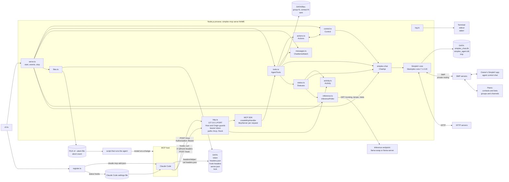
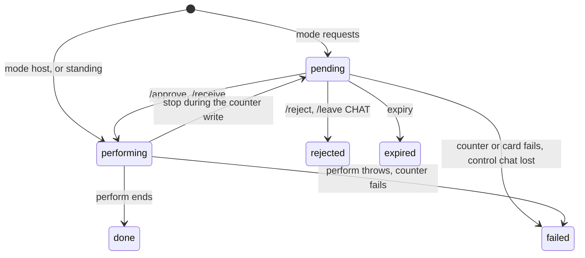

# SimpleX MCP server: architecture

> System structure, modules, state, process lifecycle, approval model and security boundaries of `@simplex-chat/mcp` 0.3.0.
>
> Related specs: [README](README.md) | [Flows](flows.md) | [API](api.md)
> Related docs: [README](../README.md) | [Reference](../REFERENCE.md) | [PLAN](../PLAN.md)

**Source:** [`cli.ts`](../src/cli.ts) | [`serve.ts`](../src/serve.ts) | [`http.ts`](../src/http.ts) | [`tools.ts`](../src/tools.ts) | [`actions.ts`](../src/actions.ts) | [`control.ts`](../src/control.ts) | [`messages.ts`](../src/messages.ts) | [`files.ts`](../src/files.ts) | [`register.ts`](../src/register.ts) | [`log.ts`](../src/log.ts) | [`status.ts`](../src/status.ts) | [`inference.ts`](../src/inference.ts) | [`activity.ts`](../src/activity.ts)

---

## Table of contents

1. [System diagram](#1-system-diagram)
2. [Modules](#2-modules)
3. [State](#3-state)
4. [Process lifecycle](#4-process-lifecycle)
5. [Approval model](#5-approval-model)
6. [Security boundaries](#6-security-boundaries)
7. [Limits](#7-limits)

---

## 1. System diagram


```mermaid
flowchart LR
  subgraph host["MCP host"]
    cc["Claude Code"]
  end
  subgraph proc["Node.js process: simplex-mcp serve NAME"]
    http["http.ts<br/>127.0.0.1:PORT<br/>Host and Origin guards<br/>bearer token<br/>paths /mcp, /hook"]
    sdk["MCP SDK<br/>createMcpHandler<br/>McpServer per request"]
    tools["tools.ts<br/>AgentTools"]
    status["status.ts<br/>Statuses"]
    inference["inference.ts<br/>inferencePoller"]
    activity["activity.ts<br/>Activity"]
    actions["actions.ts<br/>Actions"]
    control["control.ts<br/>Control"]
    messages["messages.ts<br/>ChatItemsWatch"]
    serve["serve.ts<br/>start, events, stop"]
    files["files.ts"]
    log["log.ts"]
    lib["simplex-chat<br/>ChatApi"]
    core["SimpleX core<br/>libsimplex core-7.1.0.20"]
  end
  cli["cli.ts"] --> serve
  cli --> register["register.ts"]
  register -->|"claude mcp add-json"| cc
  register -->|"status hooks"| settings[("Claude Code settings file")]
  settings --> cc
  cc -->|"headersHelper:<br/>cat headers.json"| data
  cc -->|"POST /mcp<br/>Authorization: Bearer"| http
  cc -->|"hooks: curl<br/>-H @hook-headers<br/>POST /hook"| http
  http --> sdk --> tools
  http --> activity
  status --> activity
  tools --> actions
  actions <--> control
  tools --> messages
  serve --> control
  serve --> tools
  serve --> messages
  serve --> files
  files --> data[("DATA:<br/>token<br/>headers.json<br/>hook-headers<br/>server.json<br/>lock")]
  files --> count[("FILE of --abort-file:<br/>abort count")]
  count --> runner["script that runs the agent"]
  runner -->|"restart at a change"| host
  tools --> folder[("DATA/files:<br/>group-N, contact-N<br/>sent")]
  tools --> lib
  control --> lib
  serve --> lib
  tools --> status
  status --> lib
  status --> inference
  serve --> inference
  inference -->|"GET /running, /props, /slots"| llm["Inference endpoint:<br/>llama-swap or llama-server"]
  lib --> core
  core --> db[("DATA:<br/>simplex_chat.db<br/>simplex_agent.db<br/>tmp")]
  core <-->|"SMP<br/>private routing"| smp["SMP servers"]
  core <-->|"XFTP"| xftp["XFTP servers"]
  smp <--> owner["Owner's SimpleX app<br/>agent control chat"]
  smp <--> peers["Peers:<br/>contacts and bots<br/>groups and channels"]
  log --> term["Terminal:<br/>stdout<br/>stderr"]
```

Data flow of a tool call:

1. Claude Code runs the `headersHelper` command of its entry ([`register.ts:58`](../src/register.ts#L58)) and sends the `Authorization` header it prints ([Reference](../REFERENCE.md#add-the-agent-to-claude-code)).
2. The server checks Host, Origin, token, path and readiness, then passes the request to the SDK handler ([`http.ts:23-37`](../src/http.ts#L23-L37)).
3. An `McpServer` is built from the factory for each request, and the arguments are validated against the input schema by the SDK ([`serve.ts:120-124`](../src/serve.ts#L120-L124), [`mcp-BumlNux0.cjs:1812-1817`](../node_modules/@modelcontextprotocol/server/dist/mcp-BumlNux0.cjs#L1812-L1817)).
4. The handler result is returned by `AgentTools.call` as `structuredContent` and as JSON text ([`tools.ts:519-529`](../src/tools.ts#L519-L529)).
5. The server calls `ChatApi` methods of the core ([`messages.ts:267-283`](../src/messages.ts#L267-L283)); actions are created in `Actions` and shown to the owner by `Control` ([`actions.ts:155-186`](../src/actions.ts#L155-L186)).
6. The core emits events; the server dispatches them in one handler of `serve.ts` to the tools, the item watch and the agent control chat ([`serve.ts:138-173`](../src/serve.ts#L138-L173)).

Data flow of a hook event:

1. Claude Code runs the status hook of the event; curl reads the `Authorization` header line from `DATA/hook-headers` and posts the event's JSON input to `/hook` ([`register.ts:63-66`](../src/register.ts#L63-L66)).
2. The server checks Host, Origin, token and path, then method, `Content-Length` and JSON, passes the event to `Activity.record` and answers 204 ([`http.ts:24-30`](../src/http.ts#L24-L30), [`:63-72`](../src/http.ts#L63-L72), [`serve.ts:126`](../src/serve.ts#L126)).
3. The fields of the event are kept for agent sessions only ([`activity.ts:34-81`](../src/activity.ts#L34-L81), [API 4.2](api.md#42-events)).
4. At each tick with a label read, `Activity.state` is read by `Statuses` ([`status.ts:164-169`](../src/status.ts#L164-L169), [`activity.ts:83-85`](../src/activity.ts#L83-L85)).

---

## 2. Modules

### [2.1 `cli.ts`](../src/cli.ts)

Entry point of the `simplex-mcp` binary.

| Symbol | Line | Contents |
|---|---|---|
| `helpText` | [10](../src/cli.ts#L10) | `--help` output |
| `Command` | [47](../src/cli.ts#L47) | `help`, `serve` with `ServeOptions`, `register` with `RegisterOptions` |
| `parseCommand` | [52](../src/cli.ts#L52) | command, NAME and options to a `Command` |
| `serveOptions` | [61](../src/cli.ts#L61) | defaults and option switch of `serve`; `--reset-owners` with an `--owners` list, `--inference` and `--abort-file` with `--approve host`, and `--abort-file` in a folder not disjoint from the data folder refused |
| `registerOptions` | [129](../src/cli.ts#L129) | defaults and option switch of `register` |
| `OptionReader` | [146](../src/cli.ts#L146) | `value`: the next argument, required<br>`optionalValue`: the next argument, absent when missing or starting with `--` |
| `validAgentName` | [168](../src/cli.ts#L168) | `^[a-z0-9](-?[a-z0-9])*-?$`, at most 32 characters |
| `inferenceUrl` | [193](../src/cli.ts#L193) | `--inference`: an `http` or `https` URL without user name and password, to its origin and path without trailing slashes |
| `usageError` | [219](../src/cli.ts#L219) | `ExitError` with code 2 |
| `main` | [223](../src/cli.ts#L223) | `help` to stdout, `serve`, `register` |
| top-level catch | [236-245](../src/cli.ts#L236-L245) | `ExitError`: message on stderr, its code; other errors: `logError`, code 1 |

### [2.2 `serve.ts`](../src/serve.ts)

Start sequence, event dispatch and stop sequence of one agent.

| Symbol | Line | Contents |
|---|---|---|
| `version` | [17](../src/serve.ts#L17) | the package version |
| `OwnerEntry` | [21](../src/serve.ts#L21) | `{memberId, name}` of `--owners` |
| `ServeOptions` | [26](../src/serve.ts#L26) | name, data folder and its `dataGiven` flag, display name, mode, owners, expiry, reset and token flags, port, QR code size, stop wait, inference URL, abort file |
| `RunningServer` | [43](../src/serve.ts#L43) | token, `ChatApi`, user, `Actions`, `stop` |
| `serve` | [51](../src/serve.ts#L51) | `startServer`, then SIGINT and SIGTERM handlers: the first signal stops, a second ends the stop wait |
| `startServer` | [69](../src/serve.ts#L69) | inference poller with its key, data folder, lock, token, headers files, abort counter, `ChatApi.init`, `startAgent`; cleanup on error |
| `startAgent` | [95](../src/serve.ts#L95) | user, network config, temp folder, control group, wiring of `Actions`, `Activity`, `AgentTools` with the inference poller, the activity and the abort counter, `Control`, leftover status messages, HTTP with `Activity.record` for `/hook`, event handler, `stop` |
| `registerHint` | [194](../src/serve.ts#L194) | the `register` command line printed after the owner setup |
| `waitForStopMessages` | [198](../src/serve.ts#L198) | the fixed wait at stop for cards edited or posted at the stop and for status deletions |
| `inferenceKey` | [216](../src/serve.ts#L216) | `SIMPLEX_MCP_INFERENCE_KEY`: visible ASCII characters, otherwise `ExitError` with code 2 |
| `setTempFolder` | [222](../src/serve.ts#L222) | `DATA/tmp`, mode 0700, as the core's temp folder |
| `updatedUser` | [228](../src/serve.ts#L228) | display name and peer type `agent` of the profile |
| `controlGroup` | [235](../src/serve.ts#L235) | found, created or reset agent control chat |
| `listen` | [242](../src/serve.ts#L242) | `startHttp` with the receiver of `/hook`; `EADDRINUSE` to `ExitError` code 1 |
| `bufferEvents` | [251](../src/serve.ts#L251) | events received before the handler is installed are queued and replayed in order |

### [2.3 `http.ts`](../src/http.ts)

| Symbol | Line | Contents |
|---|---|---|
| `HttpOptions` | [8](../src/http.ts#L8) | port, token, `McpServerFactory`, readiness, the receiver of `/hook` |
| `maxHookBody` | [16](../src/http.ts#L16) | 4 MiB, the largest `Content-Length` of `/hook` |
| `startHttp` | [18](../src/http.ts#L18) | `http.Server` on `127.0.0.1:port`: guards, `/hook` route, SDK handler, timeouts |
| `authorized` | [43](../src/http.ts#L43) | length check and `timingSafeEqual` against `Bearer <token>` |
| `stopHttp` | [57](../src/http.ts#L57) | `server.close` and `closeAllConnections` |
| `receiveHook` | [63](../src/http.ts#L63) | `/hook`: method, `Content-Length` and JSON checks; the event passed to the receiver; 204 |

### [2.4 `tools.ts`](../src/tools.ts)

Tool definitions, call handlers, connect plans, perform steps, files.

| Symbol | Line | Contents |
|---|---|---|
| `ConnectInput`, `SendInput`, `ReceiveInput`, `LeaveInput`, `DownloadInput` | [49-85](../src/tools.ts#L49-L85) | tool inputs |
| `PlanSummary` | [91](../src/tools.ts#L91) | card kind, chat type, name, SimpleX name, peer type, description, welcome, commands, `takesMessage` |
| `ChatFields` | [103](../src/tools.ts#L103) | chat fields of `connect` and `list` results |
| `Agent` | [117](../src/tools.ts#L117) | `ChatApi`, user, `Actions`, `ChatItemsWatch`, control chat reference, standing approver lookup, refused file post, data folder, inference poller, `Activity`, abort counter |
| `JoinMethod` | [131](../src/tools.ts#L131) | `prepared`, `prepareChannel`, `viaAddress`, `prepareContact`, `connect` |
| schemas | [187-412](../src/tools.ts#L187-L412) | input and output JSON schemas |
| descriptions, `instructions` | [414-454](../src/tools.ts#L414-L454) | tool descriptions and server instructions |
| `definitions` | [464](../src/tools.ts#L464) | name, description, schemas and action flag of the six tools |
| `Download` | [475](../src/tools.ts#L475) | one download: its promise, chat, item, file ID, size, path, the last fileSource seen, received bytes and their time, check timer |
| `AgentTools.leaving`, `AgentTools.typingChats`, `AgentTools.abortItems`, `AgentTools.statuses` | [498-505](../src/tools.ts#L498-L505) | the chats being left; the typing chats; the item IDs of recognized `/abort` messages; the `Statuses`, with the eligibility read `showsStatus` after `knownChat` |
| `AgentTools.register` | [507](../src/tools.ts#L507) | `registerTool` for each definition; `_meta` in mode `host` |
| `AgentTools.call` | [519](../src/tools.ts#L519) | the call registered as running in `Statuses` until it ends; handler result to `CallToolResult`; errors to `isError` |
| `AgentTools.perform` | [531](../src/tools.ts#L531) | perform step of an approved action |
| `downloadFile`, `forwardFile`, `downloadTo` | [544-571](../src/tools.ts#L544-L571) | one download per file ID, shared by `download` and `/forward`; a forwarded file moved to the download path for `download` |
| file events | [573-628](../src/tools.ts#L573-L628) | `onNewItems`, `abortAgent`, `onFile`, `onFileComplete`, `onFileError`, `onFileCancelled`, `onFileDescription`; in `onNewItems`, an `/abort` is recognized and handled by `abortAgent`, a status is queued at another message received in a typing chat, and the items other than a recognized `/abort` are returned for the item watch |
| `onContactConnected`, `onUserJoinedGroup` | [630-638](../src/tools.ts#L630-L638) | completion of connect actions by events |
| `actionResult` | [676](../src/tools.ts#L676) | wait for the decision, result fields, removal |
| `showNote`, `statusRefusal`, `showsStatus` | [842-862](../src/tools.ts#L842-L862) | the note of a `send` with `live: true` and its log line; the first refusal of a status message in a chat; eligibility: `postingRefusal` and `statusRefusal` both without a refusal |
| `attachment`, `isRefused`, `fileToSend`, `resizedCopy` | [925-961](../src/tools.ts#L925-L961) | the file of a `send` |
| `copyForSending`, `chatFiles`, `deleteChatFiles` | [963-992](../src/tools.ts#L963-L992) | `/forward` copies; the files of a chat, forwarded ones included; its downloads cancelled, also those the core continues after a restart |
| `leaveChat` | [1015](../src/tools.ts#L1015) | perform step of `leave` and `/leave`: the chat marked as being left, its status message deleted, then the chat; the chat's forwarded files deleted |
| `download`, `fileServers`, `unknownServers` | [1031-1077](../src/tools.ts#L1031-L1077) | the `download` call before its action |
| `startDownload`, `checkDownload`, `currentFile`, `settleFile`, `settleReceived`, `moveReceived` | [1095-1162](../src/tools.ts#L1095-L1162) | a download's steps |
| `deleteLeftoverStatuses` | [1185](../src/tools.ts#L1185) | at start, the leftover status messages of each eligible chat deleted |
| `agentChats`, `knownChat` | [1242-1259](../src/tools.ts#L1242-L1259) | the agent's chats; a checked chat reference |
| `classifyPlan` | [1342](../src/tools.ts#L1342) | `apiConnectPlan` response to a join plan or a known chat |
| `chatSubject`, `isConnected`, `isActive`, `memberCurrent` | [1438-1500](../src/tools.ts#L1438-L1500) | chat and member predicates shared with `control.ts` |
| `postingRefusal` | [1476](../src/tools.ts#L1476) | a chat that is not connected, or a group where the agent's role is `observer` or `relay`; used by `send` and by `showsStatus` |
| `fitsMessage`, `quoteContent` | [1524-1540](../src/tools.ts#L1524-L1540) | the message as the core sends it, within 15602 bytes; for `send` and the post of `/forward` |
| `realFile` | [1556](../src/tools.ts#L1556) | real path, size, inode and change time of a file |
| `attachmentMedia`, `videoFrame`, `videoDuration` | [1603-1637](../src/tools.ts#L1603-L1637) | previews and durations |
| `toolCall` | [1653](../src/tools.ts#L1653) | `ServerContext` to `ToolCall`: abort signal and progress notifications |

### [2.5 `actions.ts`](../src/actions.ts)

| Symbol | Line | Contents |
|---|---|---|
| `Mode` | [5](../src/actions.ts#L5) | `requests`, `host` |
| `State` | [6](../src/actions.ts#L6) | `pending`, `performing`, `done`, `failed`, `rejected`, `expired` |
| `Standing` | [7](../src/actions.ts#L7) | `messages`, `files` |
| `ToolError` | [19](../src/actions.ts#L19) | errors the model can correct; text returned as is |
| `Subject` | [21](../src/actions.ts#L21) | kind, name, SimpleX name, incognito flag of a card |
| `ConnRef` | [28](../src/actions.ts#L28) | pending connection, contact or group of a connect action |
| `ActionRecord` | [34](../src/actions.ts#L34) | number, key, times, change signal, standing flag, state, card, decider, open calls, interrupted flag, error, card image |
| `ConnectAction`, `SendAction`, `LeaveAction`, `DownloadAction` | [51-110](../src/actions.ts#L51-L110) | per-tool fields; `Attachment`, the file of a send |
| `ActionHooks` | [116](../src/actions.ts#L116) | `refusal`, `saveCounter`, `postCard`, `perform`, `outcome` |
| `Actions` | [124](../src/actions.ts#L124) | action map, expiry timer, posting and outcome promises |
| `create` | [155](../src/actions.ts#L155) | refusal checks, number, log line, counter write, card |
| `decided` | [206](../src/actions.ts#L206) | wait with progress until a decided state, `until`, or the abort signal |
| `stop` | [240](../src/actions.ts#L240) | cancellation of pending and performing actions |
| `summary`, `performedText`, `progressText` | [315-354](../src/actions.ts#L315-L354) | log and progress texts |

Hooks are bound in [`serve.ts:107-113`](../src/serve.ts#L107-L113): `refusal`, `saveCounter`, `postCard` and `outcome` to `Control`; `perform` to `AgentTools`.

### [2.6 `control.ts`](../src/control.ts)

| Symbol | Line | Contents |
|---|---|---|
| `controlCommands` | [10](../src/control.ts#L10) | the command menu |
| `standings` | [22](../src/control.ts#L22) | custom data key and reply words of the approvals of messages and files |
| `ControlData` | [43](../src/control.ts#L43) | `{control: true, nextAction}` |
| `ChatApproval` | [60](../src/control.ts#L60) | `{approvedBy, approvedById, approvedAt}` |
| `OwnerRequest` | [66](../src/control.ts#L66) | parsed owner command |
| `Control.load` | [102](../src/control.ts#L102) | lost check, group profile and menu, member list |
| `Control.start` | [111](../src/control.ts#L111) | owner setup per `--owners` |
| `Control.refusal` | [119](../src/control.ts#L119) | bytes left for the link texts of a connect card, card size of a send, connect or download, approver presence |
| `Control.standingApprover` | [130](../src/control.ts#L130) | approver name of a chat's standing approval of messages or files |
| `Control.saveCounter` | [135](../src/control.ts#L135) | queued counter writes |
| `Control.postCard`, `Control.outcome` | [141-152](../src/control.ts#L141-L152) | card post and card edit; the kept-files message after a done leave |
| `Control.refusedFile`, `Control.fileNotSent` | [154-169](../src/control.ts#L154-L169) | posts about files |
| `Control.onMessage` | [171](../src/control.ts#L171) | owner commands, queued one at a time |
| `Control.onEvent` | [183](../src/control.ts#L183) | membership changes and loss of the control chat |
| `Control.ownerCommand` | [200](../src/control.ts#L200) | command dispatch and replies |
| `approveChat`, `revoke`, `forward`, `leave`, `deleteFiles` | [243-307](../src/control.ts#L243-L307) | owner requests |
| `cardContent`, `fittedImage` | [441-461](../src/control.ts#L441-L461) | image and video cards with the file's preview |
| `findControlGroup`, `createControlChat`, `resetControlChat` | [499-527](../src/control.ts#L499-L527) | control group lookup, creation, reset |
| `isControlEvent` | [529](../src/control.ts#L529) | membership events of the control group |
| `parseCommand` | [545](../src/control.ts#L545) | one-line `/keyword params` |
| `cardText`, `requestLines`, `commandsLine` | [552-616](../src/control.ts#L552-L616) | card text per tool, state and mode |
| `largestCard`, `encodedLength` | [622-630](../src/control.ts#L622-L630) | card size check |
| `serversLine`, `sizeText` | [664-673](../src/control.ts#L664-L673) | servers line and sizes of download cards |
| `codeSpan`, `safeName`, `mentionText` | [683-695](../src/control.ts#L683-L695) | quoting of peer text |
| `ownerRequest` | [710](../src/control.ts#L710) | command words to an `OwnerRequest` |
| `qrCodeText` | [725](../src/control.ts#L725) | terminal QR code |
| `losesControl`, `isLost` | [741-756](../src/control.ts#L741-L756) | loss of the control chat |
| `entryText`, `restartText` | [774-784](../src/control.ts#L774-L784) | `--owners` entries in restart lines |

### [2.7 `messages.ts`](../src/messages.ts)

| Symbol | Line | Contents |
|---|---|---|
| `Message`, `MessageFile`, `FileOffer` | [16-50](../src/messages.ts#L16-L50) | message item of tool results; its file; the file of a download |
| `ToolCall` | [57](../src/messages.ts#L57) | abort signal and progress callback of one call |
| `Collected` | [62](../src/messages.ts#L62) | collected items, change signal, IDs of the items over the first 100, time of the last change |
| `Changes` | [69](../src/messages.ts#L69) | set of wake callbacks |
| `ChatItemsWatch` | [86](../src/messages.ts#L86) | listeners per chat reference; received message items gathered by `collect` |
| `chatRef`, `anyScopeChatRef`, `isChatRef` | [135-152](../src/messages.ts#L135-L152) | `@N` and `#N` references: of the main conversation, or also of a group's member chat |
| `toMessage`, `messageFile`, `receivedFileError`, `receivedPath` | [174-213](../src/messages.ts#L174-L213) | chat item to `Message`; where a received file is: its download path or its forwarded path |
| `filePaths`, `chatFolder` | [215-223](../src/messages.ts#L215-L223) | `DATA/files/group-N`, `DATA/files/contact-N` or the same under `DATA/forwarded`; the download path and the forwarded path of a received file |
| `fileOffer`, `fileContent` | [225-250](../src/messages.ts#L225-L250) | file fields of an item; message content of a file |
| `getChat`, `receivingFiles`, `markRead` | [267-283](../src/messages.ts#L267-L283) | `apiGetChat` and `apiChatItemsRead` by chat reference; the IDs of a chat's files in status `rcvAccepted`, `rcvTransfer` or `rcvWarning`, paged |
| `unreadItems` | [285](../src/messages.ts#L285) | unread items of a chat after its `initial` read, paged |
| `reportProgress`, `nextChange`, `awaitResponses` | [301-331](../src/messages.ts#L301-L331) | waits |
| `validName`, `viewName` | [337-363](../src/messages.ts#L337-L363) | display name rules and `@name` form |

### [2.8 `files.ts`](../src/files.ts)

| Symbol | Line | Contents |
|---|---|---|
| `createDataFolder` | [12](../src/files.ts#L12) | `mkdir -p` mode 0700; `chmod 0700` except on Windows |
| `acquireLock`, `releaseLock` | [17-28](../src/files.ts#L17-L28) | `DATA/lock` with the PID |
| `serverToken` | [30](../src/files.ts#L30) | `DATA/token`: read, or 32 random bytes in base64url |
| `headersFile`, `hookHeadersFile` | [38-44](../src/files.ts#L38-L44) | the paths `DATA/headers.json` and `DATA/hook-headers` |
| `writeHeadersFile` | [46](../src/files.ts#L46) | `DATA/headers.json` and `DATA/hook-headers` |
| `writeServerFile`, `readServerFile` | [51-58](../src/files.ts#L51-L58) | `DATA/server.json` |
| `abortCounter` | [60](../src/files.ts#L60) | FILE of `--abort-file`: the count from its first line, or `0` written; the returned function adds 1 and writes the count, to `FILE.part` with mode 0644, then renamed to FILE |

### [2.9 `register.ts`](../src/register.ts)

| Symbol | Line | Contents |
|---|---|---|
| `hookEvents` | [10](../src/register.ts#L10) | the 14 events of the status hooks |
| `register` | [35](../src/register.ts#L35) | `claude mcp remove`, then `claude mcp add-json`, then the status hooks merged into the settings file of the scope |
| `registryEntry` | [54](../src/register.ts#L54) | `{type, url, headersHelper, timeout}` |
| `statusHooks` | [63](../src/register.ts#L63) | one matcher group per event with the curl handler |
| `scopeLocations` | [68](../src/register.ts#L68) | the location of the manual entry and the settings file of a scope |
| `manualEntryText` | [74](../src/register.ts#L74) | entry text when `claude` is missing |
| `settingsOf`, `withStatusHooks`, `withoutHandlers`, `isObject` | [78-105](../src/register.ts#L78-L105) | the settings file parsed; the handlers with this agent's `@DATA/hook-headers` replaced; `undefined` for a file that is not a valid settings file |
| `projectRoot` | [107](../src/register.ts#L107) | project key of `--scope local` |
| `runCommand` | [133](../src/register.ts#L133) | `spawnSync` with ENOENT detection; on Windows after ENOENT, once more through `cmd.exe` with `cmdArgument` quoting, and exit status 9009 as missing |

### [2.10 `log.ts`](../src/log.ts)

| Symbol | Line | Contents |
|---|---|---|
| `ExitError` | [18](../src/log.ts#L18) | message and exit code |
| `shellWord`, `shellPath` | [24-31](../src/log.ts#L24-L31) | POSIX single quotes or Windows double quotes |
| `oneLine` | [33](../src/log.ts#L33) | runs of `\p{Cc}`, `\p{Cf}`, `\p{Zl}`, `\p{Zp}` to one space |
| `log`, `logError` | [37-43](../src/log.ts#L37-L43) | stdout lines; stderr lines |
| `errorText`, `chatErrorText` | [45-53](../src/log.ts#L45-L53) | error text, folded to one line: the apps' wording for known error shapes, otherwise the type chain |
| `appErrorText` | [55-64](../src/log.ts#L55-L64) | wording of the apps' alerts for chat, agent and store errors |
| `fileError` | [197-201](../src/log.ts#L197-L201) | the error of a received file: the apps' words for its status, or the size limit of its sender |
| `serverHostname` | [246](../src/log.ts#L246) | host of a server address |
| `chainText`, `errorChain` | [250-262](../src/log.ts#L250-L262) | `SimpleX error: <type chain>: <scalar fields>`, details at most 500 characters |
| `fullDomainName` | [272](../src/log.ts#L272) | `SimplexDomain` to `name.simplex` or `name.testing` |

### [2.11 `status.ts`](../src/status.ts)

Status messages: one per chat, owned by `AgentTools` ([tools.ts:501-505](../src/tools.ts#L501-L505)). Texts, labels and events are listed in [API 1.10](api.md#110-status-message), the end at an `/abort` in [API 1.11](api.md#111-abort).

| Symbol | Line | Contents |
|---|---|---|
| `Status` | [10](../src/status.ts#L10) | `LiveMessage`, creation time, render count, label, note, tick timer |
| constants | [19-30](../src/status.ts#L19-L30) | frames; 50 renders by ticks, 59 in all; gaps of 3 s, 20 s and 5 min; 30 min without calls; 23 h lifetime; 30 h − 10 min leftover window; the label of a waiting status; labels and verbs of Claude Code tools by name |
| `Statuses` | [32](../src/status.ts#L32) | statuses by chat, running calls, time of the last call start or end, deletions in progress, failed-poll flag, stop flag |
| `startCall` | [42](../src/status.ts#L42) | one running call registered, and removed by the returned function; the time of the last call set at both |
| `queue` | [52](../src/status.ts#L52) | a waiting status for a chat without one, before the stop; its first tick at once |
| `start` | [58](../src/status.ts#L58) | `queue`, with the label `thinking`; a waiting status taken: the label `thinking`, rendered at once from 1 to 58 renders |
| `show` | [66](../src/status.ts#L66) | a note: refused after the stop; a status 23 h old replaced; refused at 59 renders; rendered at once; a new status scheduled |
| `end` | [78](../src/status.ts#L78) | the status removed, its timer cleared, `LiveMessage.end(text)` kept among the deletions in progress; `text` is `""` by default |
| `offersAbort` | [88](../src/status.ts#L88) | `Agent.abort` set, and the chat's status with 1 or more renders |
| `abort` | [92](../src/status.ts#L92) | every status ended: with `◼ aborted` from 1 render, with `""` at 0 renders |
| `stop` | [96](../src/status.ts#L96) | every status ended, the deletions awaited; the count of statuses with a render returned |
| `deleteLeftovers` | [104](../src/status.ts#L104) | the agent's own live message items of a chat, younger than 30 h − 10 min, read in pages of 100 and deleted with mode `broadcast` |
| `created`, `isCurrent`, `failed` | [121-134](../src/status.ts#L121-L134) | a `LiveMessage` with interval 0, and a label, `thinking` by default; after its failed command, the error is logged and the status is ended while it is current; the identity check |
| `tick` | [136](../src/status.ts#L136) | eligibility read, end conditions, label, render, next tick |
| `render`, `schedule` | [153-162](../src/status.ts#L153-L162) | one `LiveMessage.update`, with the offer ` · /abort` when `Agent.abort` is set; the next tick on an unreferenced timer |
| `label`, `inferred` | [164-182](../src/status.ts#L164-L182) | the inference state, the pending actions with open calls, the latest running call other than `receive` and `Activity.state`; a failed poll logged unless the previous poll failed |
| `statusText`, `statusLabel`, `modelText`, `otherLabel`, `toolLabel`, `named` | [185-228](../src/status.ts#L185-L228) | the line, the offer after it, the note under it, the labels; a name in a code span, or the fallback text without a name |

States of one chat:

| State | `statuses` entry | Renders | `endings` |
|---|---|---|---|
| none | absent | | |
| active | present | 0 to 49 | |
| frozen | present | 50 to 59 | |
| ending | absent | | its `LiveMessage.end("")`, or `LiveMessage.end("◼ aborted")` at an `/abort` |

```
tick(chat, status):                                           status.ts:128
  shown = allowed(chat): knownChat, then showsStatus           :129, tools.ts:502
    a failure: shown false; logged while the status is current :129-132
  the status ended or replaced meanwhile: return               :133
  idle = renders ≥ 50, no running call other than receive,     :134
         30 min since the last call start or end
  not shown, 23 h since creation, or idle: end(chat); return   :135
  renders 1 to 48, not a waiting status: label read            :136-140
    the status ended or replaced meanwhile: return
  renders < 50: render                                         :141
  next tick: a tenth of the age, 3 s to 20 s; 5 min from 50     :142, :150-154
```

- Each await in `tick` is followed by the identity check, and the render is called after the check without an await between them ([status.ts:141](../src/status.ts#L141), [:146](../src/status.ts#L146)).
- In `end`, the status is removed from the map before `LiveMessage.end` is called; the library's pending update is cleared there, so the deletion is the last command of the item ([status.ts:78-86](../src/status.ts#L78-L86), [api.ts:1178-1185](../../simplex-chat-nodejs/src/api.ts#L1178-L1185)).
- Commands of one `LiveMessage` are run in one chain; after a failed command, the error is logged, the status is ended, and its deletion is queued after the commands already queued ([api.ts:1187-1189](../../simplex-chat-nodejs/src/api.ts#L1187-L1189), [status.ts:131-134](../src/status.ts#L131-L134)).
- At run time, `actions`, `log`, `messages`, `simplex-chat` and `@simplex-chat/types` are imported by `status.ts`; `activity`, `tools` and `inference` are imported as types only ([status.ts:1-8](../src/status.ts#L1-L8)).

### [2.12 `inference.ts`](../src/inference.ts)

The poller of `--inference`, created in `startServer` and passed to `AgentTools` in `Agent.inference` ([serve.ts:71](../src/serve.ts#L71), [:116](../src/serve.ts#L116)).

| Symbol | Line | Contents |
|---|---|---|
| `Endpoint` | [3](../src/inference.ts#L3) | URL and key |
| `InferenceState` | [8](../src/inference.ts#L8) | `loading` with a model; `prompt` with a model and the tokens read; `output` with a model and a rate; `idle` |
| `Slot` | [10](../src/inference.ts#L10) | proxy, model, slot ID, task ID, processing flag, tokens decoded, prompt tokens read, time of the answer |
| constants | [23-29](../src/inference.ts#L23-L29) | 1 s deadline, 1 MiB body, 4 proxies, 64 slots, model ID pattern, loopback host names |
| `inferencePoller` | [31](../src/inference.ts#L31) | the poll function; for a call within 3 s of the last poll's start, that poll is returned |
| `sample` | [51](../src/inference.ts#L51) | `/running` of llama-swap, or a plain llama-server at URL; the slots of the allowed proxies |
| `proxySlots` | [77](../src/inference.ts#L77) | `/props`, then `/slots` of one server |
| `slotOf`, `stateOf`, `rateOf` | [87-107](../src/inference.ts#L87-L107) | slot fields; the state of the processing slots; tokens per second |
| `get`, `bodyJson`, `failureText` | [109-141](../src/inference.ts#L109-L141) | one GET with `redirect: "error"`; the body as JSON within 1 MiB; the error text |
| `allowedProxy` | [143](../src/inference.ts#L143) | the origin of a proxy URL that may be polled |
| `textOf`, `fieldOf`, `listOf`, `countOf` | [150-165](../src/inference.ts#L150-L165) | a string field, kept when it matches an optional pattern; reads of untyped JSON; counts as non-negative safe integers; `textOf` and `fieldOf` are also imported by `activity.ts` |

```
poll():                                                        inference.ts:34
  the last poll started less than 3 s ago: its promise          :36
  sample, with one 1 s deadline for all its requests            :37
  a sample of slots: the state from these slots and the         :38-44
    previous ones; these slots become the previous ones
  another sample: the previous slots emptied; the sample is the state
  a failed sample: the previous slots kept; the poll fails
sample():                                                      :51
  GET URL/running with the key                                  :53
    404: proxySlots(URL, with the key, model unknown)           :54
  entries: model by the pattern, state, proxy                   :55
  a model starting: loading, that model                         :56-57
  no model ready: a model stopping ? loading : nothing known    :58-59
  proxies: allowed proxies of ready models, distinct, at most 4 :60-64
    none: nothing known                                         :65
  proxySlots of each proxy without the key, in parallel         :66
    every read fails: the first failure                         :68
    a read gives loading: loading                               :71
    otherwise: the slots of all reads                           :72-74
proxySlots(SERVER, model):                                     :77
  GET SERVER/props; 503: loading, model                         :78-79
  is_sleeping true: an empty slot list                          :80
  GET SERVER/slots; 503: loading, model                         :81-82
  the first 64 slots, with the time of the answer               :83-84
stateOf(slots, previous):                                      :92
  no slot processes: idle                                       :94
  model: the model of the processing slots when they share one  :95
  no processing slot decoded a token: prompt, the sum of tokens read   :96-97
  otherwise: output, rate                                       :98
rateOf(decoding, previous):                                    :101
  per decoding slot, the previous slot of the same proxy, ID and task that
    processed, had decoded tokens, no more than now, at an earlier time:
    tokens decoded since, per second
  the sum, when above 0                                         :106
```

### [2.13 `activity.ts`](../src/activity.ts)

Claude Code activity from the events of the status hooks, created in `startAgent` with the agent NAME, passed to `startHttp` for `/hook` and to `AgentTools` in `Agent.activity` ([serve.ts:115-116](../src/serve.ts#L115-L116), [:126](../src/serve.ts#L126)). Fields and events are listed in [API 4.2](api.md#42-events).

| Symbol | Line | Contents |
|---|---|---|
| `Running` | [4](../src/activity.ts#L4) | a running tool: session, `agent_id`, tool name, file name |
| `ActivityState` | [11](../src/activity.ts#L11) | permission flag, compaction flag, the latest running tool, the latest subagent |
| constants | [18-22](../src/activity.ts#L18-L22) | 16 sessions; 64 running tools and 64 subagents; 256 ended IDs; the name pattern `^[\w-]{1,64}$`; the file name pattern `^[\w.+@-]{1,64}$` |
| `Activity` | [24](../src/activity.ts#L24) | agent sessions; running tools by `tool_use_id`; subagents by `agent_id`; ended tool IDs; sessions with the permission flag; sessions with the compaction flag |
| `record` | [34](../src/activity.ts#L34) | one event: its fields read by type and pattern, the agent session joined, the effect of its `hook_event_name` |
| `state` | [83](../src/activity.ts#L83) | both flags over all agent sessions; the last entries of the running tools and of the subagents |
| `join`, `clear` | [87-100](../src/activity.ts#L87-L100) | an agent session added, the earliest one removed with its state beyond 16; the running tools, subagents and flags of one session removed |
| `fileName`, `keepNewest`, `deleteWhere` | [103-115](../src/activity.ts#L103-L115) | the base name of `file_path` or `notebook_path`, by its pattern; the earliest entry removed beyond a limit; entries removed by a predicate |

- `basename` of `path` and `fieldOf` and `textOf` of `inference.ts` are imported at run time ([activity.ts:1-2](../src/activity.ts#L1-L2)).
- One `Activity` is read for every status message, so the activity of every agent session is shown in every chat with a status message ([status.ts:164-169](../src/status.ts#L164-L169)).

---

## 3. State

### 3.1 Memory

| Item | Holder | Written by | Read by |
|---|---|---|---|
| Actions | `Actions.actions` map ([actions.ts:128](../src/actions.ts#L128)) | `create`, `remove`, `expireDue` | tools, `Control` |
| Open calls of an action | `ActionRecord.open` ([:44](../src/actions.ts#L44)) | `actionResult` ([tools.ts:677](../src/tools.ts#L677), [:686](../src/tools.ts#L686)) | `list`, `expireDue` |
| Collected replies | `ConnectAction.messages`, `SendAction.responses` ([:56](../src/actions.ts#L56), [:87](../src/actions.ts#L87)) | `ChatItemsWatch.collect` | `connect`, `send` results |
| Item listeners | `ChatItemsWatch.listeners` ([messages.ts:87](../src/messages.ts#L87)) | `collect` | event dispatch |
| Downloads | `AgentTools.downloads`, one per file ID ([tools.ts:493](../src/tools.ts#L493)) | `downloadTo` | file events, checks, `/delete CHAT files` |
| Forwards | `AgentTools.forwarding`, the copy for the post per file ID ([tools.ts:494](../src/tools.ts#L494)) | `forwardFile` | `downloadFile`, before it moves a forwarded file |
| Rejected files | `AgentTools.rejectedFiles` ([tools.ts:495](../src/tools.ts#L495)) | `downloadResult` ([:1084-1085](../src/tools.ts#L1084-L1085)) | the file field; `download`, which then skips the files approval ([:1046](../src/tools.ts#L1046)) |
| Count of file descriptions | `AgentTools.describedFiles` ([tools.ts:496-497](../src/tools.ts#L496-L497)) | `onFileDescription` | `fileServers` |
| Chats being left | `AgentTools.leaving` ([tools.ts:498](../src/tools.ts#L498)) | `leaveChat` ([:1016](../src/tools.ts#L1016), [:1026](../src/tools.ts#L1026)) | `statusRefusal` ([:852](../src/tools.ts#L852)) |
| Typing chats | `AgentTools.typingChats` ([tools.ts:499](../src/tools.ts#L499)) | `receive` ([:1195-1196](../src/tools.ts#L1195-L1196)) | `onNewItems`, `sendResult` ([:583](../src/tools.ts#L583), [:876](../src/tools.ts#L876)) |
| `/abort` items | `AgentTools.abortItems`, for the run ([tools.ts:500](../src/tools.ts#L500)) | `abortAgent` ([:589](../src/tools.ts#L589)) | `onNewItems`, `receive` ([:585](../src/tools.ts#L585), [:1204](../src/tools.ts#L1204)) |
| Abort count | the count of the function returned by `abortCounter` ([files.ts:62](../src/files.ts#L62)) | `abortCounter`, each `/abort` ([:63](../src/files.ts#L63), [:65](../src/files.ts#L65)) | the next write of FILE |
| Status messages | `Statuses.statuses`, one per chat ([status.ts:33](../src/status.ts#L33)) | `queue`, `start`, `show`, `end` | ticks, `queue`, `start`, `show`, `stop` |
| Running calls | `Statuses.calls` and `Statuses.lastCall` ([status.ts:34-35](../src/status.ts#L34-L35)) | `startCall`, from `AgentTools.call` ([tools.ts:520](../src/tools.ts#L520), [:527](../src/tools.ts#L527)) | labels, the idle check of ticks |
| Deletions in progress | `Statuses.endings` ([status.ts:36](../src/status.ts#L36)) | `end` | `stop` |
| Failed-poll flag | `Statuses.inferenceFailed` ([status.ts:37](../src/status.ts#L37)) | `inferred` | `inferred` |
| Last poll and previous slots | `latest` and `previous` of the poller ([inference.ts:32-33](../src/inference.ts#L32-L33)) | each poll | calls within 3 s; the rate of the next poll |
| Agent sessions | `Activity.sessions`, at most 16 ([activity.ts:25](../src/activity.ts#L25)) | `record` | `record` |
| Claude Code activity | `Activity.tools`, `subagents`, `ended`, `asking`, `compacting` ([activity.ts:26-30](../src/activity.ts#L26-L30)) | `record` | `record`; `state`, read by labels |
| Members of the control chat | `Control.members` ([control.ts:82](../src/control.ts#L82)) | `refreshMembers` ([:463-465](../src/control.ts#L463-L465)) | approver checks |
| Mode, expiry, owners list, stop wait, inference URL, abort file | `ServeOptions` of the run | CLI | all modules |

### 3.2 Chat database custom data

| Item | Entity | Value | Written by | Read by |
|---|---|---|---|---|
| Control marker and counter | agent control chat | `{simplexMcp: {control: true, nextAction: N}}` | [`createControlChat`](../src/control.ts#L509-L520), [`saveCounter`](../src/control.ts#L135) | [`findControlGroup`](../src/control.ts#L499), [`controlDataOf`](../src/control.ts#L504) |
| Standing approval of messages | contact or group of the agent | `{...other keys, simplexMcp: {approvedBy, approvedById, approvedAt}}` | [`approveChat`](../src/control.ts#L243), [`revoke`](../src/control.ts#L256) | [`standingApprover`](../src/control.ts#L130) |
| Files approval | contact or group of the agent | `{...other keys, simplexMcpFiles: {approvedBy, approvedById, approvedAt}}` | [`approveChat`](../src/control.ts#L243), [`revoke`](../src/control.ts#L256) | [`standingApprover`](../src/control.ts#L130) |

The profile, chats, items, members and file transfers are stored by the core in `DATA/simplex_chat.db`; connections and queues in `DATA/simplex_agent.db` (file prefix `DATA/simplex`, [serve.ts:78](../src/serve.ts#L78)).

### 3.3 Files

| Path | Contents | Mode | Written | Read |
|---|---|---|---|---|
| `DATA/` | data folder | 0700, set at every start except on Windows | [files.ts:12-15](../src/files.ts#L12-L15) | |
| `DATA/token` | base64url of 32 random bytes | 0600, set again at every write except on Windows | first start, `--new-token` ([:30-36](../src/files.ts#L30-L36)) | every start |
| `DATA/headers.json` | `{"Authorization":"Bearer <token>"}` | 0600, set again at every write except on Windows | every start ([:46-49](../src/files.ts#L46-L49)) | Claude Code `headersHelper` |
| `DATA/hook-headers` | `Authorization: Bearer <token>` and a newline | 0600, set again at every write except on Windows | every start ([:46-49](../src/files.ts#L46-L49)) | curl of the status hooks, `-H @DATA/hook-headers` |
| `DATA/server.json` | `{name, port, expireHours}` | 0600, set again at every write except on Windows | every start, after the HTTP listener is bound ([serve.ts:127](../src/serve.ts#L127)) | `register` |
| `DATA/lock` | PID and a newline | 0600 | start ([files.ts:83-91](../src/files.ts#L83-L91)) | next start |
| `DATA/tmp/` | the core's temp folder: files in transfer | 0700, set at every start | [serve.ts:100](../src/serve.ts#L100), [:222-226](../src/serve.ts#L222-L226) | the core |
| `DATA/files/group-N/`, `DATA/files/contact-N/` | downloaded files and files received without a download, named by file ID and extension | folder 0700 | the core at the download path ([tools.ts:1100-1101](../src/tools.ts#L1100-L1101)); moves ([:1591-1601](../src/tools.ts#L1591-L1601)) | `download` results, `/forward`, `/leave`, `/delete CHAT files` |
| `DATA/forwarded/group-N/`, `DATA/forwarded/contact-N/` | files `/forward` downloaded, named as above, until a download moves them to `DATA/files/` | folder 0700 | the core at the forwarded path ([tools.ts:554-561](../src/tools.ts#L554-L561), [:1100-1101](../src/tools.ts#L1100-L1101)) | `/forward`; moved by `download` ([:544-552](../src/tools.ts#L544-L552)); deleted by `leave`, `/leave` and `/delete CHAT files` ([:974-992](../src/tools.ts#L974-L992), [:1015-1029](../src/tools.ts#L1015-L1029)) |
| `DATA/files/sent/` | resized copies of sent images, and copies of the files `/forward` posts, one folder per copy | folder 0700; a resized copy 0600 | [tools.ts:950-967](../src/tools.ts#L950-L967), [:994-998](../src/tools.ts#L994-L998) | the core; deleted at `sndFileCompleteXFTP`, `sndFileError` and at start ([serve.ts:101](../src/serve.ts#L101), [:164-168](../src/serve.ts#L164-L168)) |
| `CONFIG/settings.json` (scope `user`), `PROJECT/.claude/settings.local.json` (scope `local`) | Claude Code settings, the status hooks included ([API 3.2](api.md#32-register)) | the mode of an existing file kept; a new file 0666 and new folders 0777, less the umask | `register` ([register.ts:46-50](../src/register.ts#L46-L50)) | Claude Code |
| FILE of `--abort-file`, in a folder disjoint from the data folder | the abort count in decimal and a newline | 0644, set again at every write except on Windows | at the start when its first line holds no count, and at each `/abort`; written to `FILE.part`, then renamed ([files.ts:60-77](../src/files.ts#L60-L77)) | the script that runs the agent ([Reference](../REFERENCE.md#abort)) |

The core library is downloaded once into `CACHE/core-7.1.0.20/sqlite`, and the Node.js add-on into `CACHE/nodejs-addon-cce06d8/`, each with a `Downloading ...` line on stderr. CACHE is `$XDG_CACHE_HOME/simplex-chat` or `~/.cache/simplex-chat`; on macOS `~/Library/Caches/simplex-chat`; on Windows `%LOCALAPPDATA%\simplex-chat` ([libs.ts:41-48](../../simplex-chat-nodejs/src/libs.ts#L41-L48), [:89](../../simplex-chat-nodejs/src/libs.ts#L89), [:109](../../simplex-chat-nodejs/src/libs.ts#L109), [:116](../../simplex-chat-nodejs/src/libs.ts#L116), [:129](../../simplex-chat-nodejs/src/libs.ts#L129)).

---

## 4. Process lifecycle

### 4.1 Start

1. With `--inference`, `SIMPLEX_MCP_INFERENCE_KEY` is checked and the poller is created; then the data folder, lock, token and headers files are prepared ([serve.ts:71-76](../src/serve.ts#L71-L76), [:216-220](../src/serve.ts#L216-L220)); with `--abort-file`, the abort counter is created ([serve.ts:77](../src/serve.ts#L77), [files.ts:60-66](../src/files.ts#L60-L66)).
2. libsimplex for SQLite is loaded by `ChatApi.init`, and the databases are migrated with confirmation `yesUp` ([serve.ts:78](../src/serve.ts#L78), [api.ts:117-126](../../simplex-chat-nodejs/src/api.ts#L117-L126)).
3. Three log lines: version and NAME, data folder, mode; with `--inference`, a fourth: `Inference endpoint: URL` ([serve.ts:79-82](../src/serve.ts#L79-L82)).
4. The active user is read, or created with display name `--display-name` or NAME, empty full name and peer type `agent` ([serve.ts:97](../src/serve.ts#L97)).
5. The network config is read and set with `smpProxyMode` `always` and `smpProxyFallback` `allowProtected` ([:98-99](../src/serve.ts#L98-L99)).
6. `DATA/tmp` is set as the core's temp folder, and `DATA/files/sent` is deleted ([:100-101](../src/serve.ts#L100-L101)).
7. Events are buffered, and the chat is started ([:102-103](../src/serve.ts#L102-L103)).
8. A `--display-name` different from the profile, or a peer type other than `agent`, is applied with one `apiUpdateProfile` ([:104](../src/serve.ts#L104), [:228-233](../src/serve.ts#L228-L233)).
9. The agent control chat is found by its marker, created with counter 1, or reset with `--reset-owners` ([:106](../src/serve.ts#L106), [:235-240](../src/serve.ts#L235-L240)).
10. `Actions`, `ChatItemsWatch`, `Activity`, `AgentTools` with the poller, the activity and its `Statuses`, and `Control` are created; the counter is taken from the marker ([:107-117](../src/serve.ts#L107-L117), [tools.ts:503-505](../src/tools.ts#L503-L505)).
11. `Control.load`: for a lost control chat, `Actions.lost` is set; otherwise the group name and command menu are updated when they differ, and members are read ([control.ts:102-109](../src/control.ts#L102-L109)).
12. Status messages left by an earlier run are deleted in each eligible chat; after the control chat is lost, every chat is ineligible. A failed chat list is logged as `status messages: ERROR`, and the start continues ([serve.ts:119](../src/serve.ts#L119), [tools.ts:1185-1190](../src/tools.ts#L1185-L1190), [:855](../src/tools.ts#L855), [status.ts:104-119](../src/status.ts#L104-L119)).
13. The HTTP server listens; with the port in use, the process exits with code 1 ([serve.ts:126](../src/serve.ts#L126), [:242-249](../src/serve.ts#L242-L249)). Until step 15 ends, requests to `/mcp` that pass the token check get 503 with `Retry-After: 1` ([http.ts:32](../src/http.ts#L32), [serve.ts:125-126](../src/serve.ts#L125-L126), [:134](../src/serve.ts#L134)); `/hook` is answered from this step on ([http.ts:26-30](../src/http.ts#L26-L30)).
14. `server.json` is written ([serve.ts:127](../src/serve.ts#L127)).
15. The server runs the owner setup, `Control.start`; after an error, HTTP is closed and the error is rethrown ([serve.ts:128-133](../src/serve.ts#L128-L133)).
16. `Listening on http://127.0.0.1:PORT/mcp` ([:135](../src/serve.ts#L135)).
17. Buffered events are replayed, then live events are dispatched ([:138](../src/serve.ts#L138), [:251-265](../src/serve.ts#L251-L265)).

After an error inside `startAgent` (steps 4-17) the chat is closed; after any error once the lock is taken, the lock is released ([serve.ts:74-92](../src/serve.ts#L74-L92)).

### 4.2 Event dispatch

Each `onAny` receiver is awaited by the library before the next event is read ([api.ts:195-202](../../simplex-chat-nodejs/src/api.ts#L195-L202)). The dispatcher in [`serve.ts:138-173`](../src/serve.ts#L138-L173):

| Event | Condition | Handler |
|---|---|---|
| `newChatItems` | item of the control group, main scope | [`Control.onMessage`](../src/control.ts#L171) |
| `newChatItems` | every item | [`AgentTools.onNewItems`](../src/tools.ts#L573), then [`ChatItemsWatch.deliver`](../src/messages.ts#L116) of the items it returns: all but a recognized `/abort` |
| `chatItemUpdated` | | [`AgentTools.onFile`](../src/tools.ts#L601), then [`ChatItemsWatch.update`](../src/messages.ts#L120) |
| `chatItemsDeleted` | | [`ChatItemsWatch.remove`](../src/messages.ts#L124) of each `deletedChatItem` |
| `contactConnected` | | [`AgentTools.onContactConnected`](../src/tools.ts#L630) |
| `userJoinedGroup` | | [`AgentTools.onUserJoinedGroup`](../src/tools.ts#L635) |
| `rcvFileComplete` | | [`AgentTools.onFileComplete`](../src/tools.ts#L606) |
| `rcvFileSndCancelled` | | [`AgentTools.onFileCancelled`](../src/tools.ts#L618) |
| `rcvFileError` | | [`AgentTools.onFileError`](../src/tools.ts#L613) |
| `rcvFileDescrReady` | | [`AgentTools.onFileDescription`](../src/tools.ts#L625) |
| `sndFileCompleteXFTP` | | [`AgentTools.onSentFile`](../src/tools.ts#L913) |
| `sndFileError` | | [`AgentTools.onSentFile`](../src/tools.ts#L913), then [`Control.fileNotSent`](../src/control.ts#L160) |
| `joinedGroupMember`<br>`joinedGroupMemberConnecting`<br>`connectedToGroupMember`<br>`memberRole`<br>`leftMember`<br>`deletedMember`<br>`deletedMemberUser`<br>`groupDeleted` | event of the control group | [`Control.onEvent`](../src/control.ts#L183), queued one at a time |
| any event | after `stop()` started | ignored |

Owner commands are queued in a second chain, independent of the membership chain ([control.ts:177-180](../src/control.ts#L177-L180)).

### 4.3 Stop

On `SIGINT` or `SIGTERM` the server runs one stop; a later signal ends its wait for cancelled cards and status deletions ([serve.ts:51-67](../src/serve.ts#L51-L67)). `RunningServer.stop` ([serve.ts:179-190](../src/serve.ts#L179-L190)):

1. Events are ignored from now on.
2. `Actions.stop` starts: new actions are refused with `The server is stopping.`; the expiry timer is cleared; cards being posted are awaited; pending and performing actions are marked interrupted; the stop signal of the performs is aborted, which ends the wait of a `connect` for its connection; their cards are edited, or posted when they have no card; outcome edits already in progress are awaited ([actions.ts:240-250](../src/actions.ts#L240-L250)).
3. In parallel with step 2, the HTTP server is closed with all connections, and open calls are aborted ([http.ts:57-61](../src/http.ts#L57-L61)).
4. `Cancelled K action(s).` when K > 0 ([serve.ts:184](../src/serve.ts#L184)).
5. `Statuses.stop`: later starts are ignored and notes refused; each status message is ended, and the deletion commands are awaited, with the endings of an `/abort` still in progress; the status messages with a render are counted, those ended by an `/abort` excluded ([serve.ts:185](../src/serve.ts#L185), [status.ts:96-102](../src/status.ts#L96-L102)).
6. When cards were edited or posted at the stop and the control chat is not lost, or status messages had a render, the server waits `--stop-wait` seconds, 10 by default, for them to be sent; a second signal ends the wait ([serve.ts:186](../src/serve.ts#L186), [:198-214](../src/serve.ts#L198-L214)).
7. `chat.close()`: the chat is stopped, then the store is closed ([api.ts:165-170](../../simplex-chat-nodejs/src/api.ts#L165-L170)).
8. The lock is removed, `Stopped.` is logged, and the process exits with code 0, or 1 after an error ([serve.ts:188-189](../src/serve.ts#L188-L189), [:57-63](../src/serve.ts#L57-L63)).

Performs in progress are not awaited; when one ends, its card stays as edited at the stop and no line is logged, because the action is interrupted ([actions.ts:280](../src/actions.ts#L280)).

### 4.4 The lock

```
acquireLock(DATA):                                   files.ts:17
  create DATA/lock exclusively (flag wx), PID       :69-77
  exists:
    PID = number in the file                        :79-82
    PID valid, other than ours, running:            :21, :84-91
      exit 1 "Another server uses DATA (PID N). If no server runs, remove DATA/lock."
    remove the file; create it exclusively again    :22-23
      exists again: exit 1 with the same message
releaseLock(DATA): remove DATA/lock                  :26-28
```

`isRunning`: `true` when `kill(pid, 0)` succeeds or fails with `EPERM` ([files.ts:98-105](../src/files.ts#L98-L105)).

---

## 5. Approval model

### 5.1 Modes

The mode is set by `--approve` for one run ([cli.ts:83-85](../src/cli.ts#L83-L85)).

| Mode | State of a new action | Card | `_meta` of `connect`, `send`, `download`, `leave` |
|---|---|---|---|
| `requests` | `pending`<br>`performing` for a send under a standing approval, and for a download under a files approval | card with commands<br>outcome as a new message after a standing send; none after a download without a card | none |
| `host` | `performing` | outcome as a new message after the perform; none for a download | `{"anthropic/requiresUserInteraction": true}` |

Sources: [actions.ts:166](../src/actions.ts#L166), [tools.ts:513](../src/tools.ts#L513), [control.ts:145-152](../src/control.ts#L145-L152), [:495-497](../src/control.ts#L495-L497). In both modes a new action is refused unless the control chat has an approver ([control.ts:124-127](../src/control.ts#L124-L127)).

### 5.2 Owners and approvers

| Term | Rule | Code |
|---|---|---|
| human | member other than the agent's membership, status `connected` or `complete` | [control.ts:484-486](../src/control.ts#L484-L486), [tools.ts:1485-1487](../src/tools.ts#L1485-L1487) |
| human owner | human with role `owner` | [control.ts:471-473](../src/control.ts#L471-L473) |
| approver, `--owners` absent | member with role `owner` | [control.ts:488-492](../src/control.ts#L488-L492) |
| approver, `--owners` without a list | none | [control.ts:491](../src/control.ts#L491) |
| approver, `--owners ID:NAME,...` | member with role `owner` whose `groupMemberId` and `displayName`, folded to one line by `oneLine`, match an entry | [control.ts:491](../src/control.ts#L491), [:758-760](../src/control.ts#L758-L760) |

The command sender's member record from the chat item is checked ([control.ts:176](../src/control.ts#L176), [:204](../src/control.ts#L204)). The approver count for refusals and standing approvals is taken from `Control.members`, refreshed at load and at each membership event ([control.ts:187](../src/control.ts#L187), [:463-465](../src/control.ts#L463-L465)).

Owner setup at start ([control.ts:111-117](../src/control.ts#L111-L117)):

| `--owners` | Start | First join by the link |
|---|---|---|
| absent | a human owner exists: register hint<br>otherwise: `No owners in the agent control chat.` when humans exist, then a link with role `member` | link deleted, role `owner`, greeting, log line, register hint |
| without a list | no humans: link with role `observer`<br>humans exist: their IDs and the restart command, in the log and the chat | link deleted, the joined member and the restart command announced |
| `ID:NAME,...` | each entry matched to a human, or exit 2<br>role `owner` set where missing<br>other humans removed<br>link deleted<br>`Owners: ...` and register hint | |

Sources: [`startOwners`](../src/control.ts#L341), [`startObserver`](../src/control.ts#L347), [`startListed`](../src/control.ts#L352), [`ownerJoined`](../src/control.ts#L371), [`observerJoined`](../src/control.ts#L380).

Membership changes at run time ([control.ts:183-198](../src/control.ts#L183-L198)):

| Change | `--owners` | Server reaction |
|---|---|---|
| `deletedMemberUser`, `groupDeleted`, or the agent's role below `owner` | any | `Actions.loseControl`: pending actions set to `failed`; later cards left unedited; log line |
| approvers drop to zero after a human owner existed | absent | `No owners in the agent control chat.`, new link with role `member` |
| a human becomes owner outside the list | list | `<name> (member N) is now an owner and can't approve actions yet. Restart the server with --owners ...` |
| a listed owner stops being a human owner | list | `<name> (member N) is no longer an owner.` with the restart command, or `No owners remain: ...` |

### 5.3 Action state machine

Transitions, one per row:

| Event | From | To | Code |
|---|---|---|---|
| call creates the action, mode `requests` | | `pending` | [actions.ts:166](../src/actions.ts#L166) |
| call creates the action, mode `host` | | `performing` | [actions.ts:166](../src/actions.ts#L166) |
| `send` call under a standing approval, or `download` call under a files approval | | `performing` | [actions.ts:166](../src/actions.ts#L166) |
| counter write or card post fails | `pending`<br>`performing` | `failed` | [actions.ts:252-263](../src/actions.ts#L252-L263) |
| stop arrives while the counter of a `performing` action is written | `performing` | `pending`, interrupted | [actions.ts:265-270](../src/actions.ts#L265-L270) |
| control chat lost | `pending` | `failed` | [actions.ts:232-238](../src/actions.ts#L232-L238) |
| `/reject`, or `/leave CHAT` for a pending action of CHAT with a card | `pending` | `rejected` | [actions.ts:225-230](../src/actions.ts#L225-L230), [control.ts:291-293](../src/control.ts#L291-L293) |
| expiry time passes | `pending` | `expired` | [actions.ts:196-199](../src/actions.ts#L196-L199) |
| `/approve N`, `/approve CHAT N` and `/approve CHAT all` for other actions; `/receive N`, `/receive CHAT N` and `/receive CHAT N all` for downloads | `pending` | `performing` | [actions.ts:219-223](../src/actions.ts#L219-L223), [control.ts:229-238](../src/control.ts#L229-L238) |
| perform throws | `performing` | `failed` | [actions.ts:276-279](../src/actions.ts#L276-L279) |
| perform ends | `performing` | `done` | [actions.ts:274-275](../src/actions.ts#L274-L275) |

`create` ([actions.ts:155-186](../src/actions.ts#L155-L186)):

```
create(key, fields, standingApprover?):
  state = mode host or standing ? performing : pending
  refusal, first match:
    stopping                      "The server is stopping."
    control chat lost             lostMessage
    20 actions pending            pendingMessage
    20 actions performing         performingMessage
    connect: link texts cut to the bytes its largest card leaves
    send, connect or download card over 15000 bytes    cardTooLong
    no approver                   no-owner message
  refusal: throw ToolError        counter unchanged
  N = next; next += 1; store; log "Action N: ..."
  post:
    saveCounter(next)
    state pending: card = postCard()
    either fails: state failed; log "Action N: failed: ERROR."
  after post:
    posted and performing:
      stopping: state = pending
      otherwise: perform
```


```mermaid
stateDiagram-v2
  [*] --> pending: mode requests
  [*] --> performing: mode host, or standing
  pending --> performing: /approve, /receive
  pending --> rejected: /reject, /leave CHAT
  pending --> expired: expiry
  pending --> failed: counter or card fails, control chat lost
  performing --> done: perform ends
  performing --> failed: perform throws, counter fails
  performing --> pending: stop during the counter write
```

An action is removed from memory when its result is returned to a call ([tools.ts:683](../src/tools.ts#L683)), or at an expiry tick when it is decided, its open call count is 0 and its expiry time has passed ([actions.ts:200-201](../src/actions.ts#L200-L201)). A `download` still performing at the end of `wait` is returned as `performing` and kept ([tools.ts:680](../src/tools.ts#L680)).

### 5.4 Cards

The server posts a card when a `pending` action is created, and edits it with `apiUpdateChatItem` at the outcome ([actions.ts:255](../src/actions.ts#L255), [control.ts:145-152](../src/control.ts#L145-L152)). For a `connect`, `send` or `leave` without a card (mode `host`, standing sends) the server posts the outcome as a new message; a `download` without a card gets none ([control.ts:495-497](../src/control.ts#L495-L497)). The text per state is built by [`cardText`](../src/control.ts#L552-L571); a card of an image or video file is an image or video message with the file's preview ([control.ts:441-461](../src/control.ts#L441-L461)); forms are listed in [API: cards](api.md#22-cards).

Outcomes are posted after `done` and `failed` ([actions.ts:282](../src/actions.ts#L282)), after `rejected` and `expired` ([:229](../src/actions.ts#L229), [:199](../src/actions.ts#L199)), and at stop ([:247](../src/actions.ts#L247)). They are skipped after the control chat is lost ([:247](../src/actions.ts#L247), [:282](../src/actions.ts#L282), [:291](../src/actions.ts#L291)).

### 5.5 Standing approvals

| Aspect | Messages | Files | Code |
|---|---|---|---|
| grant | `/approve CHAT all` from an approver in mode `requests`; pending sends of CHAT with a card are approved | `/receive CHAT N all` from an approver, on the card of download N; N is performed, and the other pending downloads of CHAT stay pending | [control.ts:237](../src/control.ts#L237), [:243-254](../src/control.ts#L243-L254) |
| mode `host` | nothing stored; reply `Approvals apply in mode requests; this server runs in mode host.` | downloads get no card, so the command has none to act on | [control.ts:213](../src/control.ts#L213) |
| removal | `/revoke CHAT`: the `simplexMcp` key is removed, other keys kept | `/receive CHAT off`: the `simplexMcpFiles` key is removed | [control.ts:256-263](../src/control.ts#L256-L263) |
| use | mode `requests`, and `approvedById` equal to the `groupMemberId` of a current approver | the same | [control.ts:130-133](../src/control.ts#L130-L133) |
| scope | `send`; status messages and notes in the chat ([API 1.10](api.md#110-status-message)), so after `/revoke` the chat's status message is deleted at its next tick | `download` of a file whose servers are all known | [tools.ts:836](../src/tools.ts#L836), [:856](../src/tools.ts#L856), [:1046](../src/tools.ts#L1046), [status.ts:143](../src/status.ts#L143) |
| decider shown | `safeName(approvedBy)` | the same | [control.ts:132](../src/control.ts#L132) |
| storage | the chat's custom data; removed with the chat by `leave` | the same | [tools.ts:1015-1029](../src/tools.ts#L1015-L1029) |

### 5.6 Expiry

| Rule | Code |
|---|---|
| `expires = created + expireHours × 3600000`, `expireHours` 1 to 23, default 23 | [actions.ts:163](../src/actions.ts#L163), [cli.ts:66](../src/cli.ts#L66), [:89-91](../src/cli.ts#L89-L91) |
| check every 60 s on an unreferenced timer, and before each owner command | [actions.ts:129](../src/actions.ts#L129), [control.ts:201](../src/control.ts#L201) |
| pending and due: `expired`, log `Action N expired.`, card edited to `Expired.` | [actions.ts:196-199](../src/actions.ts#L196-L199) |
| decided, no open call, due: removed from memory | [actions.ts:200-201](../src/actions.ts#L200-L201) |
| connect wait for the other side: at most until `created + 24 h - 10 min` | [tools.ts:151](../src/tools.ts#L151), [:729](../src/tools.ts#L729) |

`Date.now()` is compared with `expires`, so due actions are expired at the first tick after a sleep of the computer.

### 5.7 Action counter

| Rule | Code |
|---|---|
| initial value: `nextAction` of the control marker, or 1 | [serve.ts:107](../src/serve.ts#L107) |
| a new action takes `next`, then `next` grows by 1 | [actions.ts:156](../src/actions.ts#L156), [:178](../src/actions.ts#L178) |
| the new `next` is written before the card is posted | [actions.ts:254-255](../src/actions.ts#L254-L255) |
| one write at a time, also after a failed write | [control.ts:135-139](../src/control.ts#L135-L139) |
| `--reset-owners` copies the value into the new control chat | [serve.ts:238-239](../src/serve.ts#L238-L239), [control.ts:522-527](../src/control.ts#L522-L527) |
| a refused call leaves the counter unchanged | [actions.ts:177](../src/actions.ts#L177) |

---

## 6. Security boundaries

### 6.1 HTTP

Checks in order of the request listener ([http.ts:23-37](../src/http.ts#L23-L37)):

| Check | Rule | Failure | Code |
|---|---|---|---|
| bind address | `127.0.0.1` only | | [http.ts:50](../src/http.ts#L50) |
| Host | hostname `localhost`, `127.0.0.1` or `[::1]`, any port | 403, JSON-RPC error | [node index.cjs:26-48](../node_modules/@modelcontextprotocol/node/dist/index.cjs#L26-L48), [server index.cjs:1520-1558](../node_modules/@modelcontextprotocol/server/dist/index.cjs#L1520-L1558) |
| Origin | absent or empty passes; otherwise the same hostnames, any port | 403, JSON-RPC error | [node index.cjs:74-96](../node_modules/@modelcontextprotocol/node/dist/index.cjs#L74-L96), [server index.cjs:1599-1644](../node_modules/@modelcontextprotocol/server/dist/index.cjs#L1599-L1644) |
| token | `Authorization` equal to `Bearer <token>`, same length, `timingSafeEqual` | 401, empty body | [http.ts:43-46](../src/http.ts#L43-L46) |
| path | pathname `/hook` or `/mcp` | 404, empty body | [http.ts:26-31](../src/http.ts#L26-L31) |
| `/hook` method | `POST` | 405, `Allow: POST` | [http.ts:64](../src/http.ts#L64) |
| `/hook` body | `Content-Length` a number, at most 4 MiB; JSON | 411, 413, 400 | [http.ts:65-69](../src/http.ts#L65-L69) |
| start | `/mcp` only: the agent control chat is started | 503, `Retry-After: 1`, empty body | [http.ts:32](../src/http.ts#L32) |
| body size | 4 MiB | 413 | [node index.cjs:395-401](../node_modules/@modelcontextprotocol/node/dist/index.cjs#L395-L401) |
| content type of POST | `application/json` | 415 | [server index.cjs:1464-1467](../node_modules/@modelcontextprotocol/server/dist/index.cjs#L1464-L1467) |
| tool arguments | input schema | `isError: true` result | [mcp-BumlNux0.cjs:1812-1817](../node_modules/@modelcontextprotocol/server/dist/mcp-BumlNux0.cjs#L1812-L1817) |
| tool results | output schema | `isError: true` result | [mcp-BumlNux0.cjs:1822-1829](../node_modules/@modelcontextprotocol/server/dist/mcp-BumlNux0.cjs#L1822-L1829) |

Node limits: `requestTimeout` 0, `timeout` 0, `headersTimeout` 60 s, `keepAliveTimeout` 5 s ([http.ts:38-41](../src/http.ts#L38-L41)). When the client closes the response stream, the call is aborted: the request signal is aborted in `toNodeHandler` on `close`, the per-request transport is closed, and `ctx.mcpReq.signal` is aborted by the protocol layer ([node index.cjs:299-303](../node_modules/@modelcontextprotocol/node/dist/index.cjs#L299-L303), [server index.cjs:86-90](../node_modules/@modelcontextprotocol/server/dist/index.cjs#L86-L90), [src-BhnGYybN.cjs:6410-6427](../node_modules/@modelcontextprotocol/server/dist/src-BhnGYybN.cjs#L6410-L6427)). A result produced after the abort is discarded ([src-BhnGYybN.cjs:6536](../node_modules/@modelcontextprotocol/server/dist/src-BhnGYybN.cjs#L6536)).

### 6.2 Token and `headersHelper`

- The token is created once and kept in `DATA/token`; `--new-token` replaces it ([files.ts:30-36](../src/files.ts#L30-L36)).
- `DATA/headers.json` and `DATA/hook-headers` are rewritten at every start ([files.ts:46-49](../src/files.ts#L46-L49)).
- The Claude Code entry gets the command `cat <DATA>/headers.json`, or `type "<DATA>\headers.json"` on Windows, with the path quoted for the shell ([register.ts:58](../src/register.ts#L58), [log.ts:24-31](../src/log.ts#L24-L31)). Only this command is written to the entry and to the `claude mcp add-json` arguments ([register.test.ts:71-82](../test/unit/register.test.ts#L71-L82)).
- `-H @DATA/hook-headers` is passed to curl by the status hooks, so the settings file holds the path of `DATA/hook-headers` and not the token ([register.ts:64](../src/register.ts#L64), [register.test.ts:84-92](../test/unit/register.test.ts#L84-L92)).
- curl of the status hooks runs without a shell, with `-q` first, so no curlrc file is read, and with `--noproxy *`, so the proxy variables of its environment are ignored; the token is sent to `127.0.0.1:PORT` only ([register.ts:64](../src/register.ts#L64), [Claude Code hooks: exec form](https://code.claude.com/docs/en/hooks#exec-form-and-shell-form)).
- `token`, `headers.json`, `hook-headers` and `server.json` are set to mode 0600 at every write, and the data folder to 0700 at every start, except on Windows ([files.ts:12-15](../src/files.ts#L12-L15), [:68-71](../src/files.ts#L68-L71)).

### 6.3 Peer-written text

| Destination | Rule | Code |
|---|---|---|
| card and reply names | folded to one line; a valid display name is plain, others a code span | [`safeName`](../src/control.ts#L687-L690) |
| card text lines | one code span per line; backticks become `'`; a leading or trailing space becomes U+00A0; blank lines empty | [`codeLines`, `codeSpan`](../src/control.ts#L679-L685) |
| file names and paths on cards and posts | folded to one line, one code span | [control.ts:585](../src/control.ts#L585), [:598](../src/control.ts#L598), [:166-168](../src/control.ts#L166-L168) |
| reply quote on a send card | whitespace runs to one space, first 100 characters (code points), one code span | [control.ts:586](../src/control.ts#L586) |
| link texts on a connect card | code span lines in the bytes that the largest card form leaves; the line that does not fit is cut and ends in `…` inside its code span; later lines left out | [control.ts:644-658](../src/control.ts#L644-L658) |
| mention names | valid name: `@name` or `@'name'`; others a code span | [`mentionText`](../src/control.ts#L692-L695) |
| errors on cards | folded to one line, one code span | [control.ts:565](../src/control.ts#L565) |
| `--owners` part of restart lines in the chat | one code span | [control.ts:79](../src/control.ts#L79), [:782-784](../src/control.ts#L782-L784) |
| terminal names and errors of actions | folded to one line | [actions.ts:180-181](../src/actions.ts#L180-L181), [:333-341](../src/actions.ts#L333-L341), [control.ts:78](../src/control.ts#L78) |
| tool results | returned as data; schema descriptions and instructions mark `text`, `from`, `name`, file names, downloaded files, `description`, `welcome` and `commands` with their labels and params as data, not instructions; the instructions take a chat's messages as prompts only when the user said so in the session, and limit what the agent shares about its user | [tools.ts:193](../src/tools.ts#L193), [:197](../src/tools.ts#L197), [:202](../src/tools.ts#L202), [:227-228](../src/tools.ts#L227-L228), [:238-243](../src/tools.ts#L238-L243), [:408](../src/tools.ts#L408), [:452](../src/tools.ts#L452) |

The server writes the tappable form `/'...'` only in the card's command line ([control.ts:603-616](../src/control.ts#L603-L616)), in `/'revoke CHAT'` of standing cards and replies ([:563](../src/control.ts#L563), [:253](../src/control.ts#L253)), and in `/'delete CHAT files'` of the kept-files message ([:301](../src/control.ts#L301)).

### 6.4 Chat references

| Rule | Code |
|---|---|
| `^[@#][1-9]\d{0,14}$`: 1 to 15 digits; the core reads `#(2^64 + N)` as `#N` | [messages.ts:150-152](../src/messages.ts#L150-L152), [scenarios.test.ts:502-514](../test/e2e/scenarios.test.ts#L502-L514) |
| the control chat is refused by `send`, `receive`, `download`, `leave` and the owner commands with CHAT, and left out of `list` and `/list` | [tools.ts:1194](../src/tools.ts#L1194), [:1242-1259](../src/tools.ts#L1242-L1259), [control.ts:328-335](../src/control.ts#L328-L335) |
| a store error of the chat read is reported as `No chat CHAT.` | [tools.ts:1201](../src/tools.ts#L1201), [:1257](../src/tools.ts#L1257) |
| the agent's own links are refused by `connect` (`ownLink` plans) | [tools.ts:1361](../src/tools.ts#L1361), [:1379](../src/tools.ts#L1379), [:1401](../src/tools.ts#L1401) |

### 6.5 Owner commands

| Rule | Code |
|---|---|
| source: `groupRcv` text items in the main scope of the control group | [serve.ts:143](../src/serve.ts#L143), [control.ts:173](../src/control.ts#L173) |
| form: one line `/keyword params`, leading spaces allowed | [control.ts:545-550](../src/control.ts#L545-L550) |
| the help reply is sent to any sender; other commands are accepted from approvers only | [control.ts:203-204](../src/control.ts#L203-L204) |
| commands run one at a time in arrival order | [control.ts:177-180](../src/control.ts#L177-L180) |
| `/approve`, `/reject`, `/receive` and `/forward` need a pending action with a card, and the action's chat when CHAT is given; `/receive` and `/forward` take downloads only, `/approve` the other actions only | [control.ts:227-237](../src/control.ts#L227-L237) |

### 6.6 Files

| Rule | Code |
|---|---|
| `send` refuses files named `id_*`, `*.pem`, `*.key`, `*.p12` or `*.pfx`, and files under `~/.ssh`, `~/.gnupg`, the data folder and `~/.simplex-mcp` except the agent's own `DATA/files/`, each by its real path; the refusal is posted to the control chat and logged | [tools.ts:927-941](../src/tools.ts#L927-L941), [:1556-1575](../src/tools.ts#L1556-L1575), [control.ts:154-158](../src/control.ts#L154-L158) |
| the file of a `send` is sent only when its real path, size, inode and change time at the perform are those of the request | [tools.ts:943-948](../src/tools.ts#L943-L948) |
| a sent JPEG or PNG is a resized copy made by the core | [tools.ts:950-961](../src/tools.ts#L950-L961) |
| `ffmpeg` and `ffprobe` read a video as MP4 or QuickTime, local files only, without standard input, 30 s and 64 MiB of output each | [tools.ts:1625-1643](../src/tools.ts#L1625-L1643) |
| a download is saved only at `DATA/files/group-N/` or `DATA/files/contact-N/`, or for `/forward` at the same name under `DATA/forwarded/`, named by its file ID and an extension of 1 to 16 ASCII letters and digits | [messages.ts:215-223](../src/messages.ts#L215-L223) |
| a forwarded file is outside `DATA/files/`, so `send` refuses it; a download moves it into `DATA/files/` after the copy for the post is made | [tools.ts:544-561](../src/tools.ts#L544-L561), [:936-941](../src/tools.ts#L936-L941) |
| a file on unknown servers gets a card that names them, also under a files approval; relays are approved only for such a card, and for every other download, and in mode `host`, the core checks the complete description and downloads a file on unknown servers only when the IP address is protected | [tools.ts:1046](../src/tools.ts#L1046), [:567](../src/tools.ts#L567), [:1101](../src/tools.ts#L1101), [control.ts:611-614](../src/control.ts#L611-L614) |
| an accepted file that the core returns to `rcvInvitation` fails its download at the next check | [tools.ts:1114](../src/tools.ts#L1114) |
| a received file is moved into the chat's folder at its completion, unless it is at the forwarded path, also from a member chat of a group, which has a download in memory as the main conversation does; a file without a download in memory, such as one whose transfer started before a restart, only when it has its full size; a partial file is deleted only for a download in memory, when it is no larger than the file | [tools.ts:1153-1162](../src/tools.ts#L1153-L1162), [:1577-1583](../src/tools.ts#L1577-L1583) |

### 6.7 Link and network

- The join link is a group link of the control chat with role `member`, or `observer` with `--owners`; it is printed with a QR code on stdout and deleted at the first join event ([control.ts:406-416](../src/control.ts#L406-L416), [:372](../src/control.ts#L372), [:381](../src/control.ts#L381)).
- At every start the server sets private message routing: `smpProxyMode` `always`, `smpProxyFallback` `allowProtected` ([serve.ts:98-99](../src/serve.ts#L98-L99)).
- With `incognito: true` the join methods connect incognito ([tools.ts:761](../src/tools.ts#L761)); the core then uses a random profile for that chat ([PLAN, Participants](../PLAN.md#participants)).

### 6.8 Status message and inference endpoint

| Rule | Code |
|---|---|
| status messages and notes are sent only in eligible chats: the agent can post there; a chat with a person, a group or a business chat; mode `requests`; the control chat not lost; a standing approval of messages by a current approver ([API 1.10](api.md#110-status-message)) | [tools.ts:851-862](../src/tools.ts#L851-L862), [:1476-1483](../src/tools.ts#L1476-L1483) |
| eligibility is read at each tick, so after `/revoke`, a lost approver, a lost control chat, a lost connection or an `observer` or `relay` role the status message is deleted within one gap: at most 20 s, or 5 min from 50 renders | [status.ts:136-143](../src/status.ts#L136-L143), [:158-162](../src/status.ts#L158-L162) |
| in a group, the status message, its labels and its notes are sent to the group; a status is started for any message returned by `receive` with `typing: true` or by `send` in a typing chat, and queued for any message received in a typing chat, whatever its sender | [tools.ts:583](../src/tools.ts#L583), [:876](../src/tools.ts#L876), [:1225](../src/tools.ts#L1225) |
| labels are the same for every chat: running calls, waits for approval, the inference state and the Claude Code activity of other chats are shown in each status message | [status.ts:164-169](../src/status.ts#L164-L169) |
| a note is sent without an action, so without a card or an outcome in the control chat; it is text only, at most 2000 characters, and each note is printed in the terminal | [tools.ts:821-822](../src/tools.ts#L821-L822), [:842-849](../src/tools.ts#L842-L849) |
| a status message gets at most 59 renders and one deletion, or the final text `◼ aborted` | [status.ts:20-21](../src/status.ts#L20-L21), [:63](../src/status.ts#L63), [:71](../src/status.ts#L71), [:149](../src/status.ts#L149), [:93](../src/status.ts#L93) |
| with `--abort-file`, anyone who can post in a chat whose status message has a render stops the agent's work in all chats with `/abort`: the count in FILE is incremented, and every status message of the server is ended; each abort is logged with its sender, folded to one line, and its chat ([API 1.11](api.md#111-abort)) | [tools.ts:580-583](../src/tools.ts#L580-L583), [:588-599](../src/tools.ts#L588-L599), [status.ts:88-94](../src/status.ts#L88-L94) |
| an `/abort` is kept from the agent: it is left out of the items of the item watch and of the unread items of `receive`, and it is marked read; an `/abort` in a member chat of a group, or sent by the agent, is never recognized | [serve.ts:145](../src/serve.ts#L145), [tools.ts:581](../src/tools.ts#L581), [:585](../src/tools.ts#L585), [:590](../src/tools.ts#L590), [:1204](../src/tools.ts#L1204) |
| FILE lies in a folder disjoint from the data folder and holds only the count, with mode 0644 | [cli.ts:124-125](../src/cli.ts#L124-L125), [files.ts:73-77](../src/files.ts#L73-L77) |
| model IDs are kept only when they match `^[\w.:/+@-]{1,64}$`, and they are shown in a code span; counts are kept only as non-negative safe integers | [inference.ts:27](../src/inference.ts#L27), [:55](../src/inference.ts#L55), [:150-153](../src/inference.ts#L150-L153), [:163-165](../src/inference.ts#L163-L165), [status.ts:194](../src/status.ts#L194), [:207](../src/status.ts#L207), [:227](../src/status.ts#L227) |
| Claude Code activity is taken only from agent sessions, the sessions that called a tool of this server; the fields of [API 4.2](api.md#42-events) are read, and the rest of each body is discarded | [activity.ts:34-43](../src/activity.ts#L34-L43) |
| tool names and subagent types are kept only when they match `^[\w-]{1,64}$`, and file names only as base names that match `^[\w.+@-]{1,64}$`; each is shown in a code span, and a backtick matches neither pattern; the other Claude Code labels are fixed texts | [activity.ts:21-22](../src/activity.ts#L21-L22), [:36](../src/activity.ts#L36), [:64](../src/activity.ts#L64), [:103-106](../src/activity.ts#L103-L106), [status.ts:29-30](../src/status.ts#L29-L30), [:210-228](../src/status.ts#L210-L228) |
| the base names of the files that Claude Code reads and edits are shown in the status message, so in a group every member sees them | [status.ts:220-222](../src/status.ts#L220-L222) |
| `/hook` is guarded by the token of `/mcp`, so a local process without the token can't change the labels; a body is read only within 4 MiB by `Content-Length` | [http.ts:25-30](../src/http.ts#L25-L30), [:65-68](../src/http.ts#L65-L68) |
| a running tool whose end event is lost is removed at the next `PostToolBatch` of its agent; every entry of a session is removed at its `UserPromptSubmit`, `Stop`, `StopFailure` or `SessionEnd` | [activity.ts:56-58](../src/activity.ts#L56-L58), [:75-79](../src/activity.ts#L75-L79), [:95-100](../src/activity.ts#L95-L100) |
| poll error texts are folded to one line; the parser's text is replaced by `invalid JSON` | [inference.ts:116](../src/inference.ts#L116), [:129-133](../src/inference.ts#L129-L133) |
| URL is `http` or `https` without user name and password; the key is read from the environment, accepted with visible ASCII characters only, and sent to URL only | [cli.ts:193-197](../src/cli.ts#L193-L197), [serve.ts:216-220](../src/serve.ts#L216-L220), [inference.ts:111](../src/inference.ts#L111) |
| a proxy of `/running` is polled at its origin, without the key, only when its host name equals URL's, or when both are `localhost`, `127.0.0.1` or `[::1]`; at most 4 distinct proxies per poll | [inference.ts:60-66](../src/inference.ts#L60-L66), [:143-148](../src/inference.ts#L143-L148) |
| requests are GET of `/running`, `/props` and `/slots` only; redirects are refused; one 1 s deadline is set for a whole poll; a body over 1 MiB, by `Content-Length` or by the bytes read, is refused; at most 64 slots of a server are read | [inference.ts:37](../src/inference.ts#L37), [:53](../src/inference.ts#L53), [:78-84](../src/inference.ts#L78-L84), [:109-134](../src/inference.ts#L109-L134) |
| `/slots` is skipped when `is_sleeping` of `/props` is true | [inference.ts:80](../src/inference.ts#L80) |
| polls are made only for renders 2 to 49, at most one per 3 s for all status messages | [status.ts:144-148](../src/status.ts#L144-L148), [inference.ts:36](../src/inference.ts#L36) |

---

## 7. Limits

| Limit | Value | Code |
|---|---|---|
| pending actions | 20 | [actions.ts:11](../src/actions.ts#L11) |
| actions being performed | 20 | [actions.ts:12](../src/actions.ts#L12) |
| expiry | 1 to 23 h, default 23 | [cli.ts:66](../src/cli.ts#L66), [:89-91](../src/cli.ts#L89-L91) |
| connect wait for the other side | `created + 23 h 50 min` | [tools.ts:151](../src/tools.ts#L151) |
| send, connect and download card | 15000 bytes JSON-escaped, in its largest form | [control.ts:26](../src/control.ts#L26), [:622-630](../src/control.ts#L622-L630) |
| error assumed in the largest card | 600 × `€` | [control.ts:30](../src/control.ts#L30) |
| message as the core sends it | 15602 bytes, counted with 600 bytes of envelope; `send` refuses a longer one, and the post of `/forward` leaves out its quote of the card | [tools.ts:161-162](../src/tools.ts#L161-L162), [:1524-1527](../src/tools.ts#L1524-L1527), [control.ts:265-281](../src/control.ts#L265-L281) |
| `send.text` | 1 to 12000 characters | [tools.ts:265](../src/tools.ts#L265) |
| `send.text` with `live` | at most 2000 characters (code points) | [tools.ts:163](../src/tools.ts#L163), [:822](../src/tools.ts#L822) |
| `connect.message` | 1 to 2000 characters | [tools.ts:253](../src/tools.ts#L253) |
| `send.mention` | 1 to 3 unique member IDs | [tools.ts:269](../src/tools.ts#L269) |
| `wait` | 0 to 86400 s | [tools.ts:254](../src/tools.ts#L254), [:270](../src/tools.ts#L270), [:283](../src/tools.ts#L283), [:307](../src/tools.ts#L307) |
| `idle` | 1 to 300 s, default 30 | [tools.ts:255](../src/tools.ts#L255), [:271](../src/tools.ts#L271), [:157](../src/tools.ts#L157) |
| `limit` | 1 to 100, default 50 | [tools.ts:272](../src/tools.ts#L272), [:284](../src/tools.ts#L284), [:158](../src/tools.ts#L158) |
| `connect` snapshot | last 50 items | [tools.ts:159](../src/tools.ts#L159) |
| collected items per action or call | 100, then their IDs kept as overflow until deleted | [messages.ts:10](../src/messages.ts#L10), [:109-110](../src/messages.ts#L109-L110) |
| unread page, leftover status page | 100 items | [messages.ts:9](../src/messages.ts#L9), [status.ts:109-113](../src/status.ts#L109-L113) |
| chat list read | one read of 1000000 chats | [tools.ts:150](../src/tools.ts#L150) |
| `download` wait, default | 60 s | [tools.ts:154](../src/tools.ts#L154) |
| download check | every 60 s | [tools.ts:155](../src/tools.ts#L155) |
| download without progress | 30 min, then cancelled | [tools.ts:156](../src/tools.ts#L156) |
| `ffmpeg`, `ffprobe` | 30 s, 64 MiB of output | [tools.ts:160](../src/tools.ts#L160), [:165](../src/tools.ts#L165) |
| stop wait | 0 to 60 s, default 10 | [cli.ts:71](../src/cli.ts#L71), [:92-94](../src/cli.ts#L92-L94) |
| error details | 500 characters | [log.ts:4](../src/log.ts#L4) |
| progress interval | 60 s | [messages.ts:7](../src/messages.ts#L7) |
| expiry tick | 60 s | [actions.ts:10](../src/actions.ts#L10) |
| HTTP body | 4 MiB | [server index.cjs:254](../node_modules/@modelcontextprotocol/server/dist/index.cjs#L254) |
| SSE keep-alive | 15 s | [mcp-BumlNux0.cjs:64](../node_modules/@modelcontextprotocol/server/dist/mcp-BumlNux0.cjs#L64) |
| agent NAME | 1 to 32 characters | [cli.ts:169](../src/cli.ts#L169) |
| display name | 50 characters, `mkValidName` rules | [messages.ts:11-12](../src/messages.ts#L11-L12), [:337-359](../src/messages.ts#L337-L359) |
| port | 1 to 65535, default 5226 | [cli.ts:69](../src/cli.ts#L69), [:101-103](../src/cli.ts#L101-L103) |
| status renders by ticks | 50; the 50th shows the frozen line | [status.ts:20](../src/status.ts#L20), [:187](../src/status.ts#L187) |
| status renders in all, with notes | 59 | [status.ts:21](../src/status.ts#L21), [:71](../src/status.ts#L71) |
| status tick gap | a tenth of the age, 3 s to 20 s; 5 min from 50 renders | [status.ts:22-24](../src/status.ts#L22-L24), [:160](../src/status.ts#L160) |
| status without calls | 30 min, from 50 renders, then deleted | [status.ts:25](../src/status.ts#L25), [:142](../src/status.ts#L142) |
| status lifetime | 23 h | [status.ts:26](../src/status.ts#L26) |
| abort count kept at the start | 1 to 15 digits | [files.ts:63](../src/files.ts#L63) |
| leftover status age at start | below 30 h − 10 min | [status.ts:27](../src/status.ts#L27), [:106](../src/status.ts#L106) |
| inference poll deadline | 1 s for all requests of a poll | [inference.ts:23](../src/inference.ts#L23), [:37](../src/inference.ts#L37) |
| inference poll reuse | 3 s | [inference.ts:31](../src/inference.ts#L31), [:36](../src/inference.ts#L36) |
| inference answer body | 1 MiB | [inference.ts:24](../src/inference.ts#L24) |
| `/hook` body | 4 MiB, by `Content-Length` | [http.ts:16](../src/http.ts#L16), [:67](../src/http.ts#L67) |
| status hook request | 2 s, `curl -m 2` | [register.ts:64](../src/register.ts#L64) |
| agent sessions | 16 | [activity.ts:18](../src/activity.ts#L18) |
| running Claude Code tools, subagents | 64 each | [activity.ts:19](../src/activity.ts#L19) |
| ended tool IDs | 256 | [activity.ts:20](../src/activity.ts#L20) |
| Claude Code tool name, subagent type | 1 to 64 characters of `[\w-]` | [activity.ts:21](../src/activity.ts#L21) |
| file name in a label | 1 to 64 characters of `[\w.+@-]` | [activity.ts:22](../src/activity.ts#L22) |
| inference proxies | 4 per poll | [inference.ts:25](../src/inference.ts#L25) |
| inference slots | 64 per server | [inference.ts:26](../src/inference.ts#L26), [:84](../src/inference.ts#L84) |
| model ID | 1 to 64 characters of `[\w.:/+@-]` | [inference.ts:27](../src/inference.ts#L27) |
