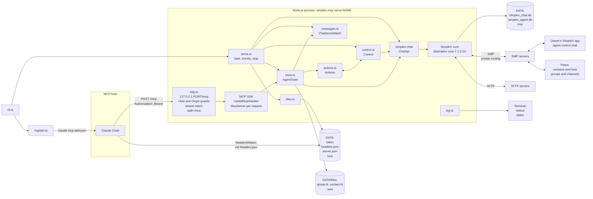
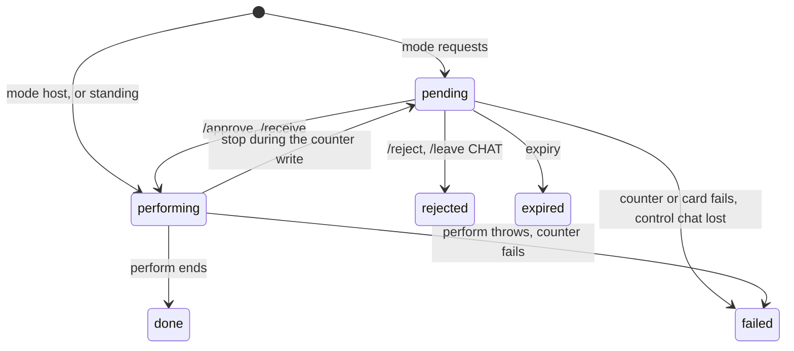
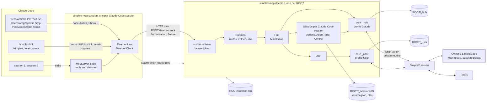
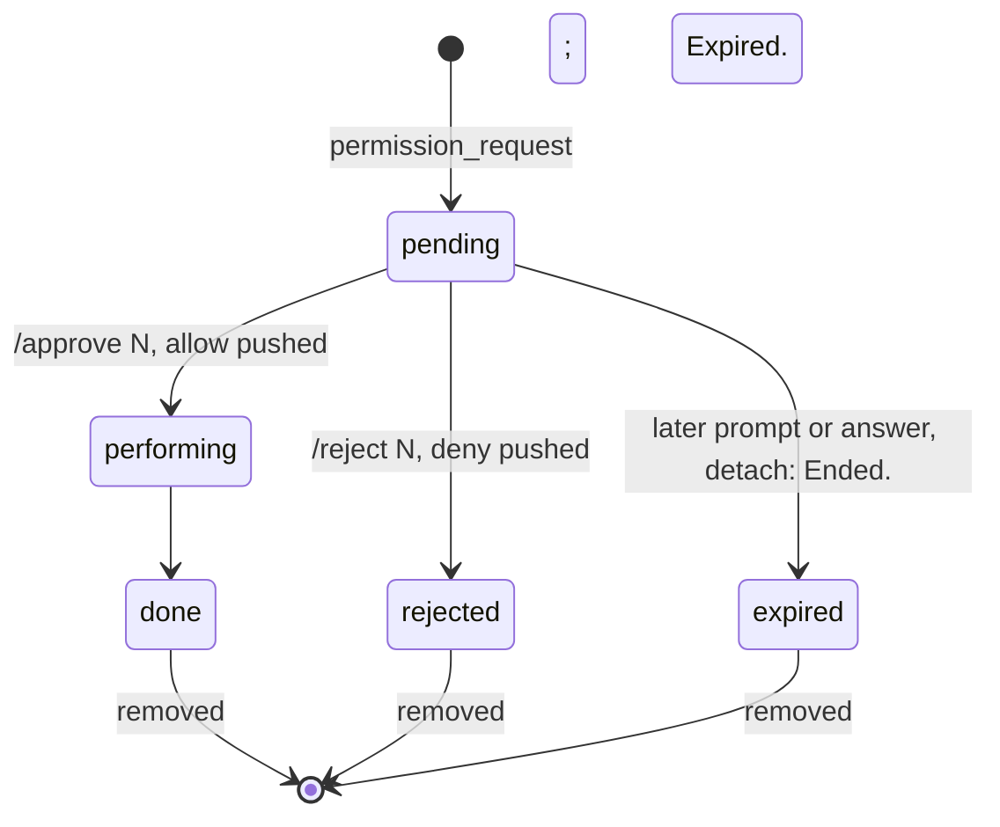

# SimpleX MCP server: architecture

> System structure, modules, state, process lifecycle, approval model and security boundaries of `@simplex-chat/mcp` 0.3.0: `serve` in sections 1-7, the Claude Code plugin in section 8.
>
> Related specs: [README](README.md) | [Flows](flows.md) | [API](api.md)
> Related docs: [README](../README.md) | [Reference](../REFERENCE.md) | [PLAN](../PLAN.md)

**Source:** [`cli.ts`](../src/cli.ts) | [`serve.ts`](../src/serve.ts) | [`http.ts`](../src/http.ts) | [`tools.ts`](../src/tools.ts) | [`actions.ts`](../src/actions.ts) | [`control.ts`](../src/control.ts) | [`messages.ts`](../src/messages.ts) | [`files.ts`](../src/files.ts) | [`register.ts`](../src/register.ts) | [`log.ts`](../src/log.ts) | [`core.ts`](../src/core.ts)
**Plugin source:** [`session.ts`](../src/session.ts) | [`client.ts`](../src/client.ts) | [`socket.ts`](../src/socket.ts) | [`protocol.ts`](../src/protocol.ts) | [`daemon.ts`](../src/daemon.ts) | [`hub.ts`](../src/hub.ts) | [`main-group.ts`](../src/main-group.ts) | [`user.ts`](../src/user.ts) | [`hook.ts`](../src/hook.ts) | [`owner.ts`](../src/owner.ts) | [`config.ts`](../src/config.ts) | [`qr.ts`](../src/qr.ts)

---

## Table of contents

1. [System diagram](#1-system-diagram)
2. [Modules](#2-modules)
3. [State](#3-state)
4. [Process lifecycle](#4-process-lifecycle)
5. [Approval model](#5-approval-model)
6. [Security boundaries](#6-security-boundaries)
7. [Limits](#7-limits)
8. [Claude Code plugin](#8-claude-code-plugin)

---

## 1. System diagram


```mermaid
flowchart LR
  subgraph host["MCP host"]
    cc["Claude Code"]
  end
  subgraph proc["Node.js process: simplex-mcp serve NAME"]
    http["http.ts<br/>127.0.0.1:PORT/mcp<br/>Host and Origin guards<br/>bearer token<br/>path /mcp"]
    sdk["MCP SDK<br/>createMcpHandler<br/>McpServer per request"]
    tools["tools.ts<br/>AgentTools"]
    actions["actions.ts<br/>Actions"]
    control["control.ts<br/>Control"]
    messages["messages.ts<br/>ChatItemsWatch"]
    serve["serve.ts<br/>start, events, stop"]
    files["files.ts"]
    log["log.ts"]
    lib["simplex-chat<br/>ChatApi"]
    core["SimpleX core<br/>libsimplex core-7.1.0.20"]
  end
  cli["cli.ts"] --> serve
  cli --> register["register.ts"]
  register -->|"claude mcp add-json"| cc
  cc -->|"headersHelper:<br/>cat headers.json"| data
  cc -->|"POST /mcp<br/>Authorization: Bearer"| http
  http --> sdk --> tools
  tools --> actions
  actions <--> control
  tools --> messages
  serve --> control
  serve --> tools
  serve --> messages
  serve --> files
  files --> data[("DATA:<br/>token<br/>headers.json<br/>server.json<br/>lock")]
  tools --> folder[("DATA/files:<br/>group-N, contact-N<br/>sent")]
  tools --> lib
  control --> lib
  serve --> lib
  lib --> core
  core --> db[("DATA:<br/>simplex_chat.db<br/>simplex_agent.db<br/>tmp")]
  core <-->|"SMP<br/>private routing"| smp["SMP servers"]
  core <-->|"XFTP"| xftp["XFTP servers"]
  smp <--> owner["Owner's SimpleX app<br/>agent control chat"]
  smp <--> peers["Peers:<br/>contacts and bots<br/>groups and channels"]
  log --> term["Terminal:<br/>stdout<br/>stderr"]
```

Data flow of a tool call:

1. Claude Code runs the `headersHelper` command of its entry ([`register.ts:50`](../src/register.ts#L50)) and sends the `Authorization` header it prints ([Reference](../REFERENCE.md#add-the-agent-to-claude-code)).
2. The server checks Host, Origin, token, path and readiness, then passes the request to the SDK handler ([`http.ts:19-28`](../src/http.ts#L19-L28)).
3. An `McpServer` is built from the factory for each request, and the arguments are validated against the input schema by the SDK ([`serve.ts:107-111`](../src/serve.ts#L107-L111), [`mcp-BumlNux0.cjs:1812-1817`](../node_modules/@modelcontextprotocol/server/dist/mcp-BumlNux0.cjs#L1812-L1817)).
4. The handler result is returned by `AgentTools.call` as `structuredContent` and as JSON text ([`tools.ts:547-554`](../src/tools.ts#L548-L555)).
5. The server calls `ChatApi` methods of the core ([`messages.ts:271-287`](../src/messages.ts#L271-L287)); actions are created in `Actions` and shown to the owner by `Control` ([`actions.ts:187-222`](../src/actions.ts#L187-L222)).
6. The core emits events; the handler of `serve.ts` passes them to the agent control chat and to `AgentTools.onEvent`, which passes them to the tools and the item watch ([`serve.ts:125-137`](../src/serve.ts#L125-L137), [`tools.ts:671-698`](../src/tools.ts#L672-L699)).

---

## 2. Modules

### [2.1 `cli.ts`](../src/cli.ts)

Entry point of the `simplex-mcp` binary.

| Symbol | Line | Contents |
|---|---|---|
| `helpText` | [14](../src/cli.ts#L14) | `--help` output |
| `pluginCommands` | [55](../src/cli.ts#L55) | `session`, `daemon`, `hook session-start`, `hook turn`, `link`, `reset-owners` |
| `Command` | [57](../src/cli.ts#L57) | `help`, `serve` with `ServeOptions`, `register` with `RegisterOptions`, the plugin commands |
| `parseCommand` | [63](../src/cli.ts#L63) | command, NAME and options to a `Command`; the joined arguments equal to a plugin command |
| `serveOptions` | [74](../src/cli.ts#L74) | defaults and option switch of `serve` |
| `registerOptions` | [130](../src/cli.ts#L130) | defaults and option switch of `register` |
| `OptionReader` | [147](../src/cli.ts#L147) | `value`: the next argument, required<br>`optionalValue`: the next argument, absent when missing or starting with `--` |
| `validAgentName` | [169](../src/cli.ts#L169) | `^[a-z0-9](-?[a-z0-9])*-?$`, at most 32 characters |
| `usageError` | [214](../src/cli.ts#L214) | `ExitError` with code 2 |
| `main` | [218](../src/cli.ts#L218) | `help` to stdout, `serve`, `register`; `session`, `daemon`; the hooks read stdin and print their JSON output; `link` and `reset-owners` print their text |
| top-level catch | [253-262](../src/cli.ts#L253-L262) | `ExitError`: message on stderr, its code; other errors: `logError`, code 1 |

### [2.2 `serve.ts`](../src/serve.ts)

Start sequence, event dispatch and stop sequence of one agent.

| Symbol | Line | Contents |
|---|---|---|
| `OwnerEntry` | [18](../src/serve.ts#L18) | `{memberId, name}` of `--owners` |
| `ServeOptions` | [23](../src/serve.ts#L23) | name, data folder and its `dataGiven` flag, display name, mode, owners, expiry, reset and token flags, port, QR code size, stop wait |
| `RunningServer` | [38](../src/serve.ts#L38) | token, `ChatApi`, user, `Actions`, `stop` |
| `serve` | [46](../src/serve.ts#L46) | `startServer`, then SIGINT and SIGTERM handlers: the first signal stops, a second ends the stop wait |
| `startServer` | [64](../src/serve.ts#L64) | data folder, lock, token, headers file, `ChatApi.init`, `startAgent`; cleanup on error |
| `startAgent` | [87](../src/serve.ts#L87) | user, `prepareCore`, control group, wiring of `Actions`, `AgentTools`, `Control`, HTTP, event handler, `stop` |
| `registerHint` | [157](../src/serve.ts#L157) | the `register` command line printed after the owner setup |
| `waitForCancelledCards` | [161](../src/serve.ts#L161) | the fixed wait at stop for cards edited or posted at the stop; also used by the plugin's hub |
| `controlGroup` | [177](../src/serve.ts#L177) | found, created or reset agent control chat |
| `listen` | [184](../src/serve.ts#L184) | `startHttp`; `EADDRINUSE` to `ExitError` code 1 |

Shared with the plugin, from [`core.ts`](../src/core.ts) and [`version.ts`](../src/version.ts):

| Symbol | Line | Contents |
|---|---|---|
| `prepareCore` | [core.ts:38](../src/core.ts#L38) | network config, `DATA/tmp` as the core's temp folder, mode 0700, and `DATA/files/sent` deleted |
| `updatedUser` | [core.ts:55](../src/core.ts#L55) | display name and peer type `agent` of the profile |
| `bufferEvents` | [core.ts:62](../src/core.ts#L62) | events received before the handler is installed are queued and replayed in order |
| `version` | [version.ts:1](../src/version.ts#L1) | the package version |

### [2.3 `http.ts`](../src/http.ts)

| Symbol | Line | Contents |
|---|---|---|
| `HttpOptions` | [7](../src/http.ts#L7) | port, token, `McpServerFactory`, readiness |
| `startHttp` | [14](../src/http.ts#L14) | `http.Server` on `127.0.0.1:port`: guards, SDK handler, timeouts |
| `authorized` | [34](../src/http.ts#L34) | length check and `timingSafeEqual` against `Bearer <token>` |
| `stopHttp` | [48](../src/http.ts#L48) | `server.close` and `closeAllConnections` |

### [2.4 `tools.ts`](../src/tools.ts)

Tool definitions, call handlers, connect plans, perform steps, files.

| Symbol | Line | Contents |
|---|---|---|
| `ConnectInput`, `SendInput`, `ReceiveInput`, `LeaveInput`, `DownloadInput` | [46-80](../src/tools.ts#L46-L80) | tool inputs |
| `PlanSummary` | [91](../src/tools.ts#L91) | card kind, chat type, name, SimpleX name, peer type, description, welcome, commands, `takesMessage` |
| `ChatFields` | [103](../src/tools.ts#L103) | chat fields of `connect` and `list` results |
| `Agent` | [117](../src/tools.ts#L117) | `ChatApi`, user, `Actions`, `ChatItemsWatch`, control chat reference, standing approver lookup, refused file post, data folder; for the plugin also the data root, the owning session ID, the group of `reply`, the check that its files are sent at once, the approver of all its files, the mode setter and the record of a pending connection |
| `JoinMethod` | [135](../src/tools.ts#L135) | `prepared`, `prepareChannel`, `viaAddress`, `prepareContact`, `connect` |
| schemas | [191-414](../src/tools.ts#L191-L414) | input and output JSON schemas |
| descriptions, `instructions` | [416-454](../src/tools.ts#L416-L454) | tool descriptions and server instructions; `instructions` names the host whose restart cancels actions, `server` by default |
| `replyTool` | [464](../src/tools.ts#L464) | the plugin's seventh tool, `reply` |
| `definitions` | [489](../src/tools.ts#L489) | name, description, schemas and action flag of the six tools |
| `registerTools` | [502](../src/tools.ts#L502) | `registerTool` for each definition and each extra one; `_meta` on action tools in mode `host` |
| `Download` | [514](../src/tools.ts#L514) | one download: its promise, chat, item, file ID, size, path, the last fileSource seen, received bytes and their time, check timer |
| `AgentTools` | [531](../src/tools.ts#L531) | constructor with the `Agent`, the mode or a function returning it, and the session number of the plugin; `mode` reads it at each use |
| `AgentTools.register` | [544](../src/tools.ts#L544) | `registerTools` with `AgentTools.call` |
| `AgentTools.call` | [548](../src/tools.ts#L548) | handler result to `CallToolResult`; errors to `isError` |
| `AgentTools.perform` | [557](../src/tools.ts#L557) | perform step of an approved action; for a `reply` action, the file sent; for a `mode` action, the mode setter |
| `giveChat`, `owns`, `claim` | [575-593](../src/tools.ts#L575-L593) | the plugin's chat owners: a chat is the session's when no session ID is set or the chat's owner is that ID; `claim` sets the owner of a chat without one, at a connection, at a `connect` to a known chat ([`ownChat`](../src/tools.ts#L761-L766)) and for a pending connection from the hub |
| `onEvent` | [672](../src/tools.ts#L672) | events to the file handlers, connect completions and the item watch; shared by `serve` and the plugin's sessions |
| `reply`, `replyResult`, `sendFile` | [720-741](../src/tools.ts#L720-L741) | a file to the group of the plugin's session, under the file rules of `send`: at once when the agent's `replyAtOnce` says so, otherwise as a `reply` action in mode `requests`, performed at once under the group's approval of all its files, else after the approval of its card; the action's result; the post of the file |
| `downloadFile`, `forwardFile`, `downloadTo` | [594-621](../src/tools.ts#L594-L621) | one download per file ID, shared by `download` and `/forward`; a forwarded file moved to the download path for `download` |
| file events | [623-660](../src/tools.ts#L623-L660) | `onNewItems`, `onFile`, `onFileComplete`, `onFileError`, `onFileCancelled`, `onFileDescription` |
| `onContactConnected`, `onUserJoinedGroup` | [662-670](../src/tools.ts#L662-L670) | completion of connect actions by events |
| `actionResult` | [772](../src/tools.ts#L772) | wait for the decision, result fields, removal |
| `attachment`, `isRefused`, `fileToSend`, `resizedCopy` | [998-1034](../src/tools.ts#L998-L1034) | the file of a `send` |
| `copyForSending`, `chatFiles`, `deleteChatFiles` | [1036-1065](../src/tools.ts#L1036-L1065) | `/forward` copies; the files of a chat, forwarded ones included; its downloads cancelled, also those the core continues after a restart |
| `leaveChat` | [1087](../src/tools.ts#L1087) | perform step of `leave` and `/leave`; the chat's forwarded files deleted |
| `download`, `fileServers`, `unknownServers` | [1097-1142](../src/tools.ts#L1097-L1142) | the `download` call before its action |
| `startDownload`, `checkDownload`, `currentFile`, `settleFile`, `settleReceived`, `moveReceived` | [1160-1227](../src/tools.ts#L1160-L1227) | a download's steps |
| `agentChats`, `knownChat` | [1297-1316](../src/tools.ts#L1297-L1316) | the agent's chats; a checked chat reference |
| `classifyPlan` | [1399](../src/tools.ts#L1399) | `apiConnectPlan` response to a join plan or a known chat |
| `chatSubject`, `isConnected`, `isActive`, `isGone`, `memberCurrent` | [1495-1565](../src/tools.ts#L1495-L1565) | chat and member predicates shared with `control.ts` and `hub.ts`; `isGone`: status `rejected`, `removed`, `left` or `deleted` |
| `customDataOf`, `setChatData`, `ownerOf` | [1528-1543](../src/tools.ts#L1528-L1543) | a chat's custom data; the plugin's owner key `simplexMcpOwner` |
| `fitsMessage`, `quoteContent` | [1589-1605](../src/tools.ts#L1589-L1605) | the message as the core sends it, within 15602 bytes; for `send`, the post of `/forward`, and the parts and quotes of the plugin's posts |
| `realFile` | [1621](../src/tools.ts#L1621) | real path, size, inode and change time of a file |
| `attachmentMedia`, `videoFrame`, `videoDuration` | [1668-1702](../src/tools.ts#L1668-L1702) | previews and durations |
| `toolCall` | [1718](../src/tools.ts#L1718) | `ServerContext` to `ToolCall`: abort signal and progress notifications |

### [2.5 `actions.ts`](../src/actions.ts)

| Symbol | Line | Contents |
|---|---|---|
| `Mode` | [5](../src/actions.ts#L5) | `requests`, `host` |
| `State` | [6](../src/actions.ts#L6) | `pending`, `performing`, `done`, `failed`, `rejected`, `expired` |
| `Standing` | [7](../src/actions.ts#L7) | `messages`, `files` |
| `ToolError` | [17](../src/actions.ts#L17) | errors the model can correct; text returned as is |
| `Subject` | [24](../src/actions.ts#L24) | kind, name, SimpleX name, incognito flag of a card |
| `ConnRef` | [31](../src/actions.ts#L31) | pending connection, contact or group of a connect action |
| `HostTexts` | [19](../src/actions.ts#L19) | refusal texts of a lost control chat and of a stop: `lostMessage` and `stoppingMessage` for `serve`, the hub's texts for the plugin |
| `ActionRecord` | [37](../src/actions.ts#L37) | number, session number of the plugin, mode, key, times, change signal, standing flag, state, card, decider, open calls, interrupted flag, ended flag, error, card image |
| `ConnectAction`, `SendAction`, `LeaveAction`, `DownloadAction` | [57-125](../src/actions.ts#L57-L125) | per-tool fields; `Attachment`, the file of a send |
| `ReplyAction`, `ModeAction`, `PermissionAction` | [98](../src/actions.ts#L98), [127-140](../src/actions.ts#L127-L140) | the plugin's actions: a file of `reply` to the session's group, with its item once sent; a switch to mode `host`; a tool use of Claude Code, with the bytes left for its input preview |
| `ActionHooks` | [146](../src/actions.ts#L146) | `refusal`, `saveCounter`, `postCard`, `perform`, `outcome` |
| `Actions` | [154](../src/actions.ts#L154) | action map, one expiry timer per action, posting and outcome promises |
| `create` | [187](../src/actions.ts#L187) | state by the action's mode, refusal checks, number, log line, counter write, card |
| `ofSession`, `remove`, `openCall`, `closeCall`, `end` | [224-248](../src/actions.ts#L224-L248) | the actions of one session; removal; open call count; an expiry before the expiry time, marked ended |
| `expireDue` | [250](../src/actions.ts#L250) | expiry of every action past its expiry time |
| `decided` | [256](../src/actions.ts#L256) | wait with progress until a decided state, `until`, or the abort signal |
| `stop` | [291](../src/actions.ts#L291) | cancellation of pending and performing actions |
| `scheduleExpiry`, `expire`, `forgetExpired` | [304-322](../src/actions.ts#L304-L322) | the expiry timer of one action; its expiry; its removal once decided, without open calls and past its expiry time |
| `summary`, `performedText`, `progressText` | [388-433](../src/actions.ts#L388-L433) | log and progress texts |

Hooks are bound in [`serve.ts:96-102`](../src/serve.ts#L96-L102): `refusal`, `saveCounter`, `postCard` and `outcome` to `Control`; `perform` to `AgentTools`.

### [2.6 `control.ts`](../src/control.ts)

| Symbol | Line | Contents |
|---|---|---|
| `controlCommands` | [11](../src/control.ts#L11) | the command menu |
| `standings` | [25](../src/control.ts#L25) | custom data key and reply words of the approvals of messages and files |
| `ControlData` | [41](../src/control.ts#L41) | `{control: true, nextAction}` |
| `ChatApproval` | [64](../src/control.ts#L64) | `{approvedBy, approvedById, approvedAt}` |
| `ControlOptions`, `SessionOptions` | [46-57](../src/control.ts#L46-L57) | display name, `--owners`, register hint, QR code size; for a group of the plugin's session, its approver check and the session IDs by number |
| `OwnerRequest` | [70](../src/control.ts#L70) | parsed owner command |
| `Control.load` | [108](../src/control.ts#L108) | lost check, group profile and menu, member list; the custom data in memory kept across the profile update |
| `Control.rename`, `Control.describe` | [117-125](../src/control.ts#L117-L125) | the plugin's group name; its short description, the custom data in memory kept |
| `Control.start` | [127](../src/control.ts#L127) | owner setup per `--owners` |
| `Control.refusal` | [135](../src/control.ts#L135) | bytes left for the link texts of a connect card and for the input preview of a tool-use card, card size of a send, reply, connect or download, approver presence |
| `Control.hasApprover` | [148](../src/control.ts#L148) | an approver is a member |
| `Control.onlyApprovers` | [152](../src/control.ts#L152) | the members read again; each one is the group's own membership, the member of the given contact, gone, or an approver |
| `Control.standingApprover` | [158](../src/control.ts#L158) | approver name of a chat's standing approval of messages or files |
| `Control.repliesApprover` | [163](../src/control.ts#L163) | approver name of the approval of all files of `reply` in a group of the plugin's session, `simplexMcpReplies` in the group's custom data, while that member is an approver |
| `Control.saveCounter`, `Control.saveData` | [168-180](../src/control.ts#L168-L180) | queued writes of the counter and of other keys of the group's custom data |
| `Control.postCard`, `Control.outcome` | [182-193](../src/control.ts#L182-L193) | card post and card edit; the kept-files message after a done leave |
| `Control.refusedFile`, `Control.fileNotSent` | [195-210](../src/control.ts#L195-L210) | posts about files |
| `Control.onMessage` | [212](../src/control.ts#L212) | owner commands, queued one at a time; in a group of the plugin's session, the session passes it the one-line `/` texts that do not start with `//` or `/!` |
| `Control.onEvent` | [224](../src/control.ts#L224) | membership changes and loss of the control chat |
| `Control.ownerCommand` | [242](../src/control.ts#L242) | command dispatch and replies; for a text outside the requests, the command list, or `Unknown command.` in a group of the plugin's session |
| `approveChat`, `revoke`, `approveReplies`, `revokeReplies`, `forward`, `leave`, `deleteFiles` | [295-376](../src/control.ts#L295-L376) | owner requests; `approveReplies` and `revokeReplies` in a group of the plugin's session |
| `give` | [378](../src/control.ts#L378) | `/give CHAT N` in a group of the plugin's session |
| `isApprover` | [571](../src/control.ts#L571) | the session's check in a group of the plugin's session; otherwise role `owner`, and the `--owners` list when given |
| `cardContent`, `fittedImage` | [524-544](../src/control.ts#L524-L544) | image and video cards with the file's preview |
| `findControlGroup`, `createControlChat`, `resetControlChat` | [583-613](../src/control.ts#L583-L613) | control group lookup, creation, reset |
| `createGroup`, `deleteGroup` | [604-618](../src/control.ts#L604-L618) | a group with its profile and custom data, shared with the plugin's groups; deletion for all members |
| `isGroupMessage` | [620](../src/control.ts#L620) | an item of one group's main scope |
| `isControlEvent` | [624](../src/control.ts#L624) | membership events of the control group |
| `parseCommand` | [640-645](../src/control.ts#L640-L645) | one-line `/keyword params` |
| `cardText`, `requestLines`, `commandsLine` | [647-724](../src/control.ts#L647-L724) | card text per tool, state and mode |
| `largestCard`, `encodedLength` | [730-738](../src/control.ts#L730-L738) | card size check |
| `truncatedLine`, `fittedLines` | [740-766](../src/control.ts#L740-L766) | a line cut with `…`; the code lines that fit a byte budget, the last one cut |
| `serversLine`, `sizeText` | [772-781](../src/control.ts#L772-L781) | servers line and sizes of download cards |
| `codeSpan`, `safeName`, `mentionText` | [791-803](../src/control.ts#L791-L803) | quoting of peer text |
| `ownerRequest` | [814](../src/control.ts#L814) | command words to an `OwnerRequest`; `approve N all` and a bare `revoke` only for a group of the plugin's session |
| `losesControl`, `isLost` | [832-847](../src/control.ts#L832-L847) | loss of the control chat, also of the plugin's groups |
| `joinedText` | [861](../src/control.ts#L861) | `NAME joined (member N)`, shared with the Main group |
| `entryText`, `restartText` | [865-875](../src/control.ts#L865-L875) | `--owners` entries in restart lines |

### [2.7 `messages.ts`](../src/messages.ts)

| Symbol | Line | Contents |
|---|---|---|
| `Message`, `MessageFile`, `FileOffer` | [16-50](../src/messages.ts#L16-L50) | message item of tool results; its file; the file of a download |
| `ToolCall` | [57](../src/messages.ts#L57) | abort signal and progress callback of one call |
| `Collected` | [62](../src/messages.ts#L62) | collected items, change signal, IDs of the items over the first 100, time of the last change |
| `Changes` | [69](../src/messages.ts#L69) | set of wake callbacks |
| `ChatItemsWatch` | [86](../src/messages.ts#L86) | listeners per chat reference; received message items gathered by `collect` |
| `chatRef`, `anyScopeChatRef`, `isChatRef` | [135-152](../src/messages.ts#L135-L152) | `@N` and `#N` references: of the main conversation, or also of a group's member chat |
| `toMessage`, `messageFile`, `receivedFileError`, `receivedPath` | [174-213](../src/messages.ts#L174-L213) | chat item to `Message`; where a received file is: its download path or its forwarded path |
| `filePaths`, `storedName`, `chatFolder` | [215-227](../src/messages.ts#L215-L227) | `DATA/files/group-N`, `DATA/files/contact-N` or the same under `DATA/forwarded`; the download path and the forwarded path of a received file; its name, the file ID and the extension, also for the files of the plugin's prompts |
| `fileOffer`, `fileContent` | [229-254](../src/messages.ts#L229-L254) | file fields of an item; message content of a file |
| `getChat`, `receivingFiles`, `markRead` | [271-287](../src/messages.ts#L271-L287) | `apiGetChat` and `apiChatItemsRead` by chat reference; the IDs of a chat's files in status `rcvAccepted`, `rcvTransfer` or `rcvWarning`, paged |
| `unreadItems` | [289](../src/messages.ts#L289) | unread items of a chat after its `initial` read, paged |
| `reportProgress`, `nextChange`, `awaitResponses` | [305-335](../src/messages.ts#L305-L335) | waits |
| `validName`, `viewName` | [341-367](../src/messages.ts#L341-L367) | display name rules and `@name` form |

### [2.8 `files.ts`](../src/files.ts)

| Symbol | Line | Contents |
|---|---|---|
| `createDataFolder` | [98](../src/files.ts#L98) | `mkdir -p` mode 0700; `chmod 0700` except on Windows |
| `acquireLock`, `releaseLock` | [103-117](../src/files.ts#L103-L117) | `DATA/lock` with the PID; `user`, `server` or `daemon`, names the holder in the error |
| `serverToken` | [119](../src/files.ts#L119) | `DATA/token`: read, made private when the user owns it, or 32 random bytes in base64url, created as the lock is |
| `saveHeldTitles`, `takeHeldTitles` | [148-162](../src/files.ts#L148-L162) | `ROOT/titles.json`, written at a daemon stop, read and removed at the next start; an unparsable file is skipped with a log line |
| `createLock`, `createExclusive` | [177-199](../src/files.ts#L177-L199) | a private temporary file with the text, linked into place, so that the file appears complete and once; where the file system refuses the link, written exclusively |
| `takeOver` | [201](../src/files.ts#L201) | the lock of a stopped process: claimed first by a link of the lock to `lock.PID.claim`, or where links fail by an exclusive write of `lock.PID.claim`, so that one starter claims it; when the lock still holds that PID, it is removed and created again; the claim removed |
| `writeHeadersFile` | [135](../src/files.ts#L135) | `DATA/headers.json` |
| `writeServerFile`, `readServerFile` | [139-146](../src/files.ts#L139-L146) | `DATA/server.json` |

### [2.9 `register.ts`](../src/register.ts)

| Symbol | Line | Contents |
|---|---|---|
| `register` | [33](../src/register.ts#L33) | `claude mcp remove`, then `claude mcp add-json` |
| `registryEntry` | [46](../src/register.ts#L46) | `{type, url, headersHelper, timeout}` |
| `manualEntryText` | [55](../src/register.ts#L55) | entry text when `claude` is missing |
| `projectRoot` | [60](../src/register.ts#L60) | project key of `--scope local` |
| `runCommand` | [86](../src/register.ts#L86) | `spawnSync` with ENOENT detection; on Windows after ENOENT, once more through `cmd.exe` with `cmdArgument` quoting, and exit status 9009 as missing |

### [2.10 `log.ts`](../src/log.ts)

| Symbol | Line | Contents |
|---|---|---|
| `ExitError` | [18](../src/log.ts#L18) | message and exit code |
| `shellWord`, `shellPath` | [24-31](../src/log.ts#L24-L31) | POSIX single quotes or Windows double quotes |
| `oneLine` | [33](../src/log.ts#L33) | runs of `\p{Cc}`, `\p{Cf}`, `\p{Zl}`, `\p{Zp}` to one space |
| `log`, `logError` | [37-43](../src/log.ts#L37-L43) | stdout lines; stderr lines |
| `errorText`, `chatErrorText` | [45-53](../src/log.ts#L45-L53) | error text, folded to one line: the apps' wording for known error shapes, otherwise the type chain |
| `appErrorText` | [55-64](../src/log.ts#L55-L64) | wording of the apps' alerts for chat, agent and store errors |
| `fileError` | [197-201](../src/log.ts#L197-L201) | the error of a received file: the apps' words for its status, or the size limit of its sender |
| `serverHostname` | [246](../src/log.ts#L246) | host of a server address |
| `chainText`, `errorChain` | [250-262](../src/log.ts#L250-L262) | `SimpleX error: <type chain>: <scalar fields>`, details at most 500 characters |
| `fullDomainName` | [272](../src/log.ts#L272) | `SimplexDomain` to `name.simplex` or `name.testing` |

---

## 3. State

### 3.1 Memory

| Item | Holder | Written by | Read by |
|---|---|---|---|
| Actions | `Actions.actions` map ([actions.ts:158](../src/actions.ts#L158)) | `create`, `remove`, `forgetExpired` | tools, `Control` |
| Expiry timers | `Actions.expiries`, one per action ([actions.ts:159](../src/actions.ts#L159)) | `scheduleExpiry`, `expire`, `remove` | |
| Open calls of an action | `ActionRecord.open` ([:49](../src/actions.ts#L49)) | `openCall` and `closeCall` from `actionResult` ([tools.ts:773](../src/tools.ts#L773), [:782](../src/tools.ts#L782)) | `list`, `forgetExpired` |
| Collected replies | `ConnectAction.messages`, `SendAction.responses` ([:62](../src/actions.ts#L62), [:93](../src/actions.ts#L93)) | `ChatItemsWatch.collect` | `connect`, `send` results |
| Item listeners | `ChatItemsWatch.listeners` ([messages.ts:87](../src/messages.ts#L87)) | `collect` | event dispatch |
| Downloads | `AgentTools.downloads`, one per file ID ([tools.ts:532](../src/tools.ts#L532)) | `downloadTo` | file events, checks, `/delete CHAT files` |
| Forwards | `AgentTools.forwarding`, the copy for the post per file ID ([tools.ts:533](../src/tools.ts#L533)) | `forwardFile` | `downloadFile`, before it moves a forwarded file |
| Rejected files | `AgentTools.rejectedFiles` ([tools.ts:534](../src/tools.ts#L534)) | `downloadResult` ([:1149-1150](../src/tools.ts#L1149-L1150)) | the file field; `download`, which then skips the files approval ([:1112](../src/tools.ts#L1112)) |
| Count of file descriptions | `AgentTools.describedFiles` ([tools.ts:535-536](../src/tools.ts#L535-L536)) | `onFileDescription` | `fileServers` |
| Members of the control chat | `Control.members` ([control.ts:88](../src/control.ts#L88)) | `refreshMembers` ([:546-548](../src/control.ts#L546-L548)) | approver checks |
| Mode, expiry, owners list, stop wait | `ServeOptions` of the run; the mode also in `Actions.mode` and in each action ([actions.ts:40](../src/actions.ts#L40)) | CLI | all modules |

### 3.2 Chat database custom data

| Item | Entity | Value | Written by | Read by |
|---|---|---|---|---|
| Control marker and counter | agent control chat | `{simplexMcp: {control: true, nextAction: N}}` | [`createControlChat`](../src/control.ts#L593-L608), [`saveCounter`](../src/control.ts#L168) | [`findControlGroup`](../src/control.ts#L583), [`controlDataOf`](../src/control.ts#L588) |
| Standing approval of messages | contact or group of the agent | `{...other keys, simplexMcp: {approvedBy, approvedById, approvedAt}}` | [`approveChat`](../src/control.ts#L295), [`revoke`](../src/control.ts#L308) | [`standingApprover`](../src/control.ts#L158) |
| Files approval | contact or group of the agent | `{...other keys, simplexMcpFiles: {approvedBy, approvedById, approvedAt}}` | [`approveChat`](../src/control.ts#L295), [`revoke`](../src/control.ts#L308) | [`standingApprover`](../src/control.ts#L158) |

The profile, chats, items, members and file transfers are stored by the core in `DATA/simplex_chat.db`; connections and queues in `DATA/simplex_agent.db` (file prefix `DATA/simplex`, [serve.ts:71](../src/serve.ts#L71)).

### 3.3 Files

| Path | Contents | Mode | Written | Read |
|---|---|---|---|---|
| `DATA/` | data folder | 0700, set at every start except on Windows | [files.ts:98-101](../src/files.ts#L98-L101) | |
| `DATA/token` | base64url of 32 random bytes | 0600, set again at every write except on Windows | first start, `--new-token` ([:119-129](../src/files.ts#L119-L129)) | every start |
| `DATA/headers.json` | `{"Authorization":"Bearer <token>"}` | 0600, set again at every write except on Windows | every start ([:135-137](../src/files.ts#L135-L137)) | Claude Code `headersHelper` |
| `DATA/server.json` | `{name, port, expireHours}` | 0600, set again at every write except on Windows | every start, after the HTTP listener is bound ([serve.ts:114](../src/serve.ts#L114)) | `register` |
| `DATA/lock` | PID and a newline | 0600 | start ([files.ts:177-216](../src/files.ts#L177-L216)) | next start |
| `DATA/tmp/` | the core's temp folder: files in transfer | 0700, set at every start | [core.ts:41](../src/core.ts#L41), [:78-82](../src/core.ts#L78-L82) | the core |
| `DATA/files/group-N/`, `DATA/files/contact-N/` | downloaded files and files received without a download, named by file ID and extension | folder 0700 | the core at the download path ([tools.ts:1165-1166](../src/tools.ts#L1165-L1166)); moves ([:1656-1666](../src/tools.ts#L1656-L1666)) | `download` results, `/forward`, `/leave`, `/delete CHAT files` |
| `DATA/forwarded/group-N/`, `DATA/forwarded/contact-N/` | files `/forward` downloaded, named as above, until a download moves them to `DATA/files/` | folder 0700 | the core at the forwarded path ([tools.ts:604-611](../src/tools.ts#L604-L611), [:1165-1166](../src/tools.ts#L1165-L1166)) | `/forward`; moved by `download` ([:594-602](../src/tools.ts#L594-L602)); deleted by `leave`, `/leave` and `/delete CHAT files` ([:1047-1065](../src/tools.ts#L1047-L1065), [:1087-1095](../src/tools.ts#L1087-L1095)) |
| `DATA/files/sent/` | resized copies of sent images, and copies of the files `/forward` posts, one folder per copy | folder 0700; a resized copy 0600 | [tools.ts:1023-1040](../src/tools.ts#L1023-L1040), [:1067-1071](../src/tools.ts#L1067-L1071) | the core; deleted at `sndFileCompleteXFTP`, `sndFileError` and at start ([core.ts:42](../src/core.ts#L42), [tools.ts:695-697](../src/tools.ts#L695-L697), [:986](../src/tools.ts#L986)) |

The core library is downloaded once into `CACHE/core-7.1.0.20/sqlite`, and the Node.js add-on into `CACHE/nodejs-addon-cce06d8/`, each with a `Downloading ...` line on stderr. CACHE is `$XDG_CACHE_HOME/simplex-chat` or `~/.cache/simplex-chat`; on macOS `~/Library/Caches/simplex-chat`; on Windows `%LOCALAPPDATA%\simplex-chat` ([libs.ts:41-48](../../simplex-chat-nodejs/src/libs.ts#L41-L48), [:89](../../simplex-chat-nodejs/src/libs.ts#L89), [:109](../../simplex-chat-nodejs/src/libs.ts#L109), [:116](../../simplex-chat-nodejs/src/libs.ts#L116), [:129](../../simplex-chat-nodejs/src/libs.ts#L129)).

---

## 4. Process lifecycle

### 4.1 Start

1. Data folder, lock, token and headers file are prepared ([serve.ts:66-70](../src/serve.ts#L66-L70)).
2. libsimplex for SQLite is loaded by `ChatApi.init`, and the databases are migrated with confirmation `yesUp` ([serve.ts:71](../src/serve.ts#L71), [api.ts:117-126](../../simplex-chat-nodejs/src/api.ts#L117-L126)).
3. Three log lines: version and NAME, data folder, mode ([serve.ts:72-74](../src/serve.ts#L72-L74)).
4. The active user is read, or created with display name `--display-name` or NAME, empty full name and peer type `agent` ([serve.ts:89](../src/serve.ts#L89)).
5. `prepareCore` reads the network config and sets it with `smpProxyMode` `always` and `smpProxyFallback` `allowProtected` ([serve.ts:90](../src/serve.ts#L90), [core.ts:39-40](../src/core.ts#L39-L40)).
6. `prepareCore` sets `DATA/tmp` as the core's temp folder and deletes `DATA/files/sent` ([core.ts:41-42](../src/core.ts#L41-L42)).
7. Events are buffered, and the chat is started ([serve.ts:91-92](../src/serve.ts#L91-L92)).
8. A `--display-name` different from the profile, or a peer type other than `agent`, is applied with one `apiUpdateProfile` ([serve.ts:93](../src/serve.ts#L93), [core.ts:55-60](../src/core.ts#L55-L60)).
9. The agent control chat is found by its marker, created with counter 1, or reset with `--reset-owners` ([:95](../src/serve.ts#L95), [:177-182](../src/serve.ts#L177-L182)).
10. `Actions`, `ChatItemsWatch`, `AgentTools` and `Control` are created; the counter is taken from the marker ([:96-105](../src/serve.ts#L96-L105)).
11. `Control.load`: for a lost control chat, `Actions.lost` is set; otherwise the group name and command menu are updated when they differ, and members are read ([control.ts:108-115](../src/control.ts#L108-L115)).
12. The HTTP server listens; with the port in use, the process exits with code 1 ([serve.ts:113](../src/serve.ts#L113), [:184-191](../src/serve.ts#L184-L191)). Until step 14 ends, requests to `/mcp` that pass the token check get 503 with `Retry-After: 1` ([http.ts:23](../src/http.ts#L23), [serve.ts:112-113](../src/serve.ts#L112-L113), [:121](../src/serve.ts#L121)).
13. `server.json` is written ([serve.ts:114](../src/serve.ts#L114)).
14. The server runs the owner setup, `Control.start`; after an error, HTTP is closed and the error is rethrown ([serve.ts:115-120](../src/serve.ts#L115-L120)).
15. `Listening on http://127.0.0.1:PORT/mcp` ([:122](../src/serve.ts#L122)).
16. Buffered events are replayed, then live events are dispatched ([serve.ts:125](../src/serve.ts#L125), [core.ts:62-76](../src/core.ts#L62-L76)).

After an error inside `startAgent` (steps 4-16) the chat is closed; after any error once the lock is taken, the lock is released ([serve.ts:68-84](../src/serve.ts#L68-L84)).

### 4.2 Event dispatch

Each `onAny` receiver is awaited by the library before the next event is read ([api.ts:195-202](../../simplex-chat-nodejs/src/api.ts#L195-L202)). The dispatcher in [`serve.ts:125-137`](../src/serve.ts#L125-L137) passes items of the control group to `Control`, then every event to [`AgentTools.onEvent`](../src/tools.ts#L672-L699), which runs the `AgentTools` and `ChatItemsWatch` handlers below, then file errors and membership events to `Control`:

| Event | Condition | Handler |
|---|---|---|
| `newChatItems` | item of the control group, main scope | [`Control.onMessage`](../src/control.ts#L212) |
| `newChatItems` | every item | [`AgentTools.onNewItems`](../src/tools.ts#L623), then [`ChatItemsWatch.deliver`](../src/messages.ts#L116) |
| `chatItemUpdated` | | [`AgentTools.onFile`](../src/tools.ts#L633), then [`ChatItemsWatch.update`](../src/messages.ts#L120) |
| `chatItemsDeleted` | | [`ChatItemsWatch.remove`](../src/messages.ts#L124) of each `deletedChatItem` |
| `contactConnected` | | [`AgentTools.onContactConnected`](../src/tools.ts#L662) |
| `userJoinedGroup` | | [`AgentTools.onUserJoinedGroup`](../src/tools.ts#L667) |
| `rcvFileComplete` | | [`AgentTools.onFileComplete`](../src/tools.ts#L638) |
| `rcvFileSndCancelled` | | [`AgentTools.onFileCancelled`](../src/tools.ts#L650) |
| `rcvFileError` | | [`AgentTools.onFileError`](../src/tools.ts#L645) |
| `rcvFileDescrReady` | | [`AgentTools.onFileDescription`](../src/tools.ts#L657) |
| `sndFileCompleteXFTP` | | [`AgentTools.onSentFile`](../src/tools.ts#L986) |
| `sndFileError` | | [`AgentTools.onSentFile`](../src/tools.ts#L986), then [`Control.fileNotSent`](../src/control.ts#L201) |
| `joinedGroupMember`<br>`joinedGroupMemberConnecting`<br>`connectedToGroupMember`<br>`memberRole`<br>`leftMember`<br>`deletedMember`<br>`deletedMemberUser`<br>`groupDeleted` | event of the control group | [`Control.onEvent`](../src/control.ts#L224), queued one at a time |
| any event | after `stop()` started | ignored |

Owner commands are queued in a second chain, independent of the membership chain ([control.ts:218-221](../src/control.ts#L218-L221)).

### 4.3 Stop

On `SIGINT` or `SIGTERM` the server runs one stop; a later signal ends its wait for cancelled cards ([serve.ts:46-62](../src/serve.ts#L46-L62)). `RunningServer.stop` ([serve.ts:143-153](../src/serve.ts#L143-L153)):

1. Events are ignored from now on.
2. `Actions.stop` starts: new actions are refused with `The server is stopping.`; the expiry timers are cleared; cards being posted are awaited; pending and performing actions are marked interrupted; the stop signal of the performs is aborted, which ends the wait of a `connect` for its connection; their cards are edited, or posted when they have no card; outcome edits already in progress are awaited ([actions.ts:291-322](../src/actions.ts#L291-L322)).
3. In parallel with step 2, the HTTP server is closed with all connections, and open calls are aborted ([http.ts:48-52](../src/http.ts#L48-L52)).
4. `Cancelled K action(s).` when K > 0 ([serve.ts:148](../src/serve.ts#L148)).
5. When cards were edited or posted at the stop and the control chat is not lost, the server waits `--stop-wait` seconds, 10 by default, for them to be sent; a second signal ends the wait ([serve.ts:149](../src/serve.ts#L149), [:161-175](../src/serve.ts#L161-L175)).
6. `chat.close()`: the chat is stopped, then the store is closed ([api.ts:165-170](../../simplex-chat-nodejs/src/api.ts#L165-L170)).
7. The lock is removed, `Stopped.` is logged, and the process exits with code 0, or 1 after an error ([serve.ts:151-152](../src/serve.ts#L151-L152), [:52-58](../src/serve.ts#L52-L58)).

Performs in progress are not awaited; when one ends, its card stays as edited at the stop and no line is logged, because the action is interrupted ([actions.ts:352](../src/actions.ts#L352)).

### 4.4 The lock

```
acquireLock(DATA, USER = server):                    files.ts:90
  create DATA/lock exclusively (flag wx), PID       :158-166
  exists:
    PID = number in the file                        :168-171
    PID valid, other than ours, running:            :94, :173-180
      exit 1 "Another USER uses DATA (PID N). If no USER runs, remove DATA/lock."
    remove the file; create it exclusively again    :95-96
      exists again: exit 1 with the same message
releaseLock(DATA): remove DATA/lock                  :99-105
```

`isRunning`: `true` when `kill(pid, 0)` succeeds or fails with `EPERM` ([files.ts:223-230](../src/files.ts#L223-L230)).

---

## 5. Approval model

### 5.1 Modes

The mode is set by `--approve` for one run ([cli.ts:96-98](../src/cli.ts#L96-L98)).

| Mode | State of a new action | Card | `_meta` of `connect`, `send`, `download`, `leave` |
|---|---|---|---|
| `requests` | `pending`<br>`performing` for a send under a standing approval, and for a download under a files approval | card with commands<br>outcome as a new message after a standing send; none after a download without a card | none |
| `host` | `performing` | outcome as a new message after the perform; none for a download | `{"anthropic/requiresUserInteraction": true}` |

An action keeps the mode it was created in, `ActionRecord.mode`; its card and its log line follow that mode ([actions.ts:187](../src/actions.ts#L187), [:200](../src/actions.ts#L200), [control.ts:136](../src/control.ts#L136)).

Sources: [actions.ts:200](../src/actions.ts#L200), [tools.ts:508](../src/tools.ts#L508), [control.ts:186-193](../src/control.ts#L186-L193), [:579-581](../src/control.ts#L579-L581). In both modes a new action is refused unless the control chat has an approver ([control.ts:141-145](../src/control.ts#L141-L145)).

### 5.2 Owners and approvers

| Term | Rule | Code |
|---|---|---|
| human | member other than the agent's membership, status `connected` or `complete` | [control.ts:567-569](../src/control.ts#L567-L569), [tools.ts:1545-1547](../src/tools.ts#L1545-L1547) |
| human owner | human with role `owner` | [control.ts:554-556](../src/control.ts#L554-L556) |
| approver, `--owners` absent | member with role `owner` | [control.ts:571-576](../src/control.ts#L571-L576) |
| approver, `--owners` without a list | none | [control.ts:575](../src/control.ts#L575) |
| approver, `--owners ID:NAME,...` | member with role `owner` whose `groupMemberId` and `displayName`, folded to one line by `oneLine`, match an entry | [control.ts:575](../src/control.ts#L575), [:849-851](../src/control.ts#L849-L851) |

The command sender's member record from the chat item is checked ([control.ts:217](../src/control.ts#L217), [:246](../src/control.ts#L246)). The approver count for refusals and standing approvals is taken from `Control.members`, refreshed at load and at each membership event ([control.ts:228](../src/control.ts#L228), [:546-548](../src/control.ts#L546-L548)).

Owner setup at start ([control.ts:127-133](../src/control.ts#L127-L133)):

| `--owners` | Start | First join by the link |
|---|---|---|
| absent | a human owner exists: register hint<br>otherwise: `No owners in the agent control chat.` when humans exist, then a link with role `member` | link deleted, role `owner`, greeting, log line, register hint |
| without a list | no humans: link with role `observer`<br>humans exist: their IDs and the restart command, in the log and the chat | link deleted, the joined member and the restart command announced |
| `ID:NAME,...` | each entry matched to a human, or exit 2<br>role `owner` set where missing<br>other humans removed<br>link deleted<br>`Owners: ...` and register hint | |

Sources: [`startOwners`](../src/control.ts#L424), [`startObserver`](../src/control.ts#L430), [`startListed`](../src/control.ts#L435), [`ownerJoined`](../src/control.ts#L454), [`observerJoined`](../src/control.ts#L463).

Membership changes at run time ([control.ts:224-240](../src/control.ts#L224-L240)):

| Change | `--owners` | Server reaction |
|---|---|---|
| `deletedMemberUser`, `groupDeleted`, or the agent's role below `owner` | any | `Actions.loseControl`: pending actions set to `failed`; later cards left unedited; log line |
| approvers drop to zero after a human owner existed | absent | `No owners in the agent control chat.`, new link with role `member` |
| a human becomes owner outside the list | list | `<name> (member N) is now an owner and can't approve actions yet. Restart the server with --owners ...` |
| a listed owner stops being a human owner | list | `<name> (member N) is no longer an owner.` with the restart command, or `No owners remain: ...` |

### 5.3 Action state machine

Transitions, one per row:

| Event | From | To | Code |
|---|---|---|---|
| call creates the action, mode `requests` | | `pending` | [actions.ts:200](../src/actions.ts#L200) |
| call creates the action, mode `host` | | `performing` | [actions.ts:200](../src/actions.ts#L200) |
| `send` call under a standing approval, or `download` call under a files approval | | `performing` | [actions.ts:200](../src/actions.ts#L200) |
| counter write or card post fails | `pending`<br>`performing` | `failed` | [actions.ts:324-335](../src/actions.ts#L324-L335) |
| stop arrives while the counter of a `performing` action is written | `performing` | `pending`, interrupted | [actions.ts:337-342](../src/actions.ts#L337-L342) |
| control chat lost | `pending` | `failed` | [actions.ts:283-289](../src/actions.ts#L283-L289) |
| `/reject`, or `/leave CHAT` for a pending action of CHAT with a card | `pending` | `rejected` | [actions.ts:276-281](../src/actions.ts#L276-L281), [control.ts:360-362](../src/control.ts#L360-L362) |
| expiry time passes | `pending` | `expired` | [actions.ts:309-318](../src/actions.ts#L309-L318) |
| `/approve N`, `/approve CHAT N` and `/approve CHAT all` for other actions; `/receive N`, `/receive CHAT N` and `/receive CHAT N all` for downloads | `pending` | `performing` | [actions.ts:270-274](../src/actions.ts#L270-L274), [control.ts:281-290](../src/control.ts#L281-L290) |
| perform throws | `performing` | `failed` | [actions.ts:348-351](../src/actions.ts#L348-L351) |
| perform ends | `performing` | `done` | [actions.ts:346-347](../src/actions.ts#L346-L347) |

`create` ([actions.ts:187-222](../src/actions.ts#L187-L222)):

```
create(key, fields, standingApprover?, session?, mode = Actions.mode):
  state = mode host or standing ? performing : pending
  refusal, first match:
    stopping                      texts.stopping: "The server is stopping."
    control chat lost             texts.lost: lostMessage
    20 actions of the session pending       pendingMessage
    20 actions of the session performing    performingMessage
    connect: link texts cut to the bytes its largest card leaves
    send, connect or download card over 15000 bytes    cardTooLong
    no approver                   no-owner message
  refusal: throw ToolError        counter unchanged
  N = next; next += 1; store; expiry timer; log "Action N: ..."
  post:
    saveCounter(next)
    state pending: card = postCard()
    either fails: state failed; log "Action N: failed: ERROR."
  after post:
    posted and performing:
      stopping: state = pending
      otherwise: perform
```


```mermaid
stateDiagram-v2
  [*] --> pending: mode requests
  [*] --> performing: mode host, or standing
  pending --> performing: /approve, /receive
  pending --> rejected: /reject, /leave CHAT
  pending --> expired: expiry
  pending --> failed: counter or card fails, control chat lost
  performing --> done: perform ends
  performing --> failed: perform throws, counter fails
  performing --> pending: stop during the counter write
```

An action is removed from memory when its result is returned to a call ([tools.ts:779](../src/tools.ts#L779)), or once it is decided, its open call count is 0 and its expiry time has passed: checked at each decision, at the close of each call and at its expiry timer ([actions.ts:320-322](../src/actions.ts#L320-L322), [:239-242](../src/actions.ts#L239-L242), [:357-361](../src/actions.ts#L357-L361)). `serve` has one session, `undefined`, so the limits of 20 count all its actions. A `download` still performing at the end of `wait` is returned as `performing` and kept ([tools.ts:776](../src/tools.ts#L776)).

### 5.4 Cards

The server posts a card when a `pending` action is created, and edits it with `apiUpdateChatItem` at the outcome ([actions.ts:327](../src/actions.ts#L327), [control.ts:186-193](../src/control.ts#L186-L193)). For a `connect`, `send` or `leave` without a card (mode `host`, standing sends) the server posts the outcome as a new message; a `download` without a card gets none ([control.ts:579-581](../src/control.ts#L579-L581)). The text per state is built by [`cardText`](../src/control.ts#L647-L666); a card of a `send`, `reply` or `download` of an image or video file is an image or video message with the file's preview ([control.ts:524-544](../src/control.ts#L524-L544)); forms are listed in [API: cards](api.md#22-cards).

Outcomes are posted after `done` and `failed` ([actions.ts:354](../src/actions.ts#L354)), after `rejected` and `expired` ([:280](../src/actions.ts#L280), [:317](../src/actions.ts#L317)), and at stop ([:299](../src/actions.ts#L299)). They are skipped after the control chat is lost ([:299](../src/actions.ts#L299), [:354](../src/actions.ts#L354), [:364](../src/actions.ts#L364)).

### 5.5 Standing approvals

| Aspect | Messages | Files | Code |
|---|---|---|---|
| grant | `/approve CHAT all` from an approver in mode `requests`; pending sends of CHAT with a card are approved | `/receive CHAT N all` from an approver, on the card of download N; N is performed, and the other pending downloads of CHAT stay pending | [control.ts:289](../src/control.ts#L289), [:295-306](../src/control.ts#L295-L306) |
| mode `host` | nothing stored; reply `Approvals apply in mode requests; this server runs in mode host.` | downloads get no card, so the command has none to act on | [control.ts:255](../src/control.ts#L255) |
| removal | `/revoke CHAT`: the `simplexMcp` key is removed, other keys kept | `/receive CHAT off`: the `simplexMcpFiles` key is removed | [control.ts:308-315](../src/control.ts#L308-L315) |
| use | mode `requests`, and `approvedById` equal to the `groupMemberId` of a current approver | the same | [control.ts:158-161](../src/control.ts#L158-L161) |
| scope | `send` | `download` of a file whose servers are all known | [tools.ts:935](../src/tools.ts#L935), [:1112](../src/tools.ts#L1112) |
| decider shown | `safeName(approvedBy)` | the same | [control.ts:160](../src/control.ts#L160) |
| storage | the chat's custom data; removed with the chat by `leave` | the same | [tools.ts:1087-1095](../src/tools.ts#L1087-L1095) |

The plugin's approval of all files of `reply` in a session group is described in [8.5](#85-approval-model).

### 5.6 Expiry

| Rule | Code |
|---|---|
| `expires = created + expireHours × 3600000`, `expireHours` 1 to 23, default 23 | [actions.ts:197](../src/actions.ts#L197), [cli.ts:79](../src/cli.ts#L79), [:102-104](../src/cli.ts#L102-L104) |
| one unreferenced timer per action, set at its creation for `expires - now`, at most `maxTimer` ms; all actions past `expires` are also expired before each owner command | [actions.ts:304-307](../src/actions.ts#L304-L307), [messages.ts:8](../src/messages.ts#L8), [control.ts:243](../src/control.ts#L243) |
| pending and due: `expired`, log `Action N expired.`, card edited to `Expired.` | [actions.ts:309-318](../src/actions.ts#L309-L318) |
| decided, no open call, due: removed from memory | [actions.ts:320-322](../src/actions.ts#L320-L322) |
| connect wait for the other side: at most until `created + 24 h - 10 min` | [tools.ts:155](../src/tools.ts#L155), [:825](../src/tools.ts#L825) |

A timer follows the monotonic clock and `expires` the wall clock: a timer that fires before `expires` is set again ([actions.ts:313](../src/actions.ts#L313)).

### 5.7 Action counter

| Rule | Code |
|---|---|
| initial value: `nextAction` of the control marker, or 1 | [serve.ts:96](../src/serve.ts#L96) |
| a new action takes `next`, then `next` grows by 1 | [actions.ts:188](../src/actions.ts#L188), [:213](../src/actions.ts#L213) |
| the new `next` is written before the card is posted | [actions.ts:326-327](../src/actions.ts#L326-L327) |
| one write at a time, also after a failed write | [control.ts:168-180](../src/control.ts#L168-L180) |
| `--reset-owners` copies the value into the new control chat | [serve.ts:180-181](../src/serve.ts#L180-L181), [control.ts:610-613](../src/control.ts#L610-L613) |
| a refused call leaves the counter unchanged | [actions.ts:212](../src/actions.ts#L212) |

---

## 6. Security boundaries

### 6.1 HTTP

Checks in order of the request listener ([http.ts:19-28](../src/http.ts#L19-L28)):

| Check | Rule | Failure | Code |
|---|---|---|---|
| bind address | `127.0.0.1` only | | [http.ts:41](../src/http.ts#L41) |
| Host | hostname `localhost`, `127.0.0.1` or `[::1]`, any port | 403, JSON-RPC error | [node index.cjs:26-48](../node_modules/@modelcontextprotocol/node/dist/index.cjs#L26-L48), [server index.cjs:1520-1558](../node_modules/@modelcontextprotocol/server/dist/index.cjs#L1520-L1558) |
| Origin | absent or empty passes; otherwise the same hostnames, any port | 403, JSON-RPC error | [node index.cjs:74-96](../node_modules/@modelcontextprotocol/node/dist/index.cjs#L74-L96), [server index.cjs:1599-1644](../node_modules/@modelcontextprotocol/server/dist/index.cjs#L1599-L1644) |
| token | `Authorization` equal to `Bearer <token>`, same length, `timingSafeEqual` | 401, empty body | [http.ts:34-37](../src/http.ts#L34-L37) |
| path | pathname `/mcp` | 404, empty body | [http.ts:22](../src/http.ts#L22) |
| start | the agent control chat is started | 503, `Retry-After: 1`, empty body | [http.ts:23](../src/http.ts#L23) |
| body size | 4 MiB | 413 | [node index.cjs:395-401](../node_modules/@modelcontextprotocol/node/dist/index.cjs#L395-L401) |
| content type of POST | `application/json` | 415 | [server index.cjs:1464-1467](../node_modules/@modelcontextprotocol/server/dist/index.cjs#L1464-L1467) |
| tool arguments | input schema | `isError: true` result | [mcp-BumlNux0.cjs:1812-1817](../node_modules/@modelcontextprotocol/server/dist/mcp-BumlNux0.cjs#L1812-L1817) |
| tool results | output schema | `isError: true` result | [mcp-BumlNux0.cjs:1822-1829](../node_modules/@modelcontextprotocol/server/dist/mcp-BumlNux0.cjs#L1822-L1829) |

Node limits: `requestTimeout` 0, `timeout` 0, `headersTimeout` 60 s, `keepAliveTimeout` 5 s ([http.ts:29-32](../src/http.ts#L29-L32)). When the client closes the response stream, the call is aborted: the request signal is aborted in `toNodeHandler` on `close`, the per-request transport is closed, and `ctx.mcpReq.signal` is aborted by the protocol layer ([node index.cjs:299-303](../node_modules/@modelcontextprotocol/node/dist/index.cjs#L299-L303), [server index.cjs:86-90](../node_modules/@modelcontextprotocol/server/dist/index.cjs#L86-L90), [src-BhnGYybN.cjs:6410-6427](../node_modules/@modelcontextprotocol/server/dist/src-BhnGYybN.cjs#L6410-L6427)). A result produced after the abort is discarded ([src-BhnGYybN.cjs:6536](../node_modules/@modelcontextprotocol/server/dist/src-BhnGYybN.cjs#L6536)).

### 6.2 Token and `headersHelper`

- The token is created once and kept in `DATA/token`; `--new-token` replaces it ([files.ts:119-129](../src/files.ts#L119-L129)).
- `DATA/headers.json` is rewritten at every start ([files.ts:135-137](../src/files.ts#L135-L137)).
- The Claude Code entry gets the command `cat <DATA>/headers.json`, or `type "<DATA>\headers.json"` on Windows, with the path quoted for the shell ([register.ts:50](../src/register.ts#L50), [log.ts:24-31](../src/log.ts#L24-L31)). Only this command is written to the entry and to the `claude mcp add-json` arguments ([register.test.ts:50-61](../test/unit/register.test.ts#L50-L61)).
- `token`, `headers.json` and `server.json` are set to mode 0600 at every write, and the data folder to 0700 at every start, except on Windows ([files.ts:98-101](../src/files.ts#L98-L101), [:168-171](../src/files.ts#L168-L171)).

### 6.3 Peer-written text

| Destination | Rule | Code |
|---|---|---|
| card and reply names | folded to one line; a valid display name is plain, others a code span | [`safeName`](../src/control.ts#L795-L798) |
| card text lines | one code span per line; backticks become `'`; a leading or trailing space becomes U+00A0; blank lines empty | [`codeLines`, `codeSpan`](../src/control.ts#L787-L793) |
| file names and paths on cards and posts | folded to one line, one code span | [control.ts:685](../src/control.ts#L685), [:692](../src/control.ts#L692), [:702](../src/control.ts#L702), [:207-209](../src/control.ts#L207-L209) |
| reply quote on a send card | whitespace runs to one space, first 100 characters (code points), one code span | [control.ts:686](../src/control.ts#L686) |
| link texts on a connect card, the input preview on a tool-use card of the plugin | code span lines in the bytes that the largest card form leaves; the line that does not fit is cut and ends in `…` inside its code span; later lines left out | [control.ts:752-766](../src/control.ts#L752-L766) |
| mention names | valid name: `@name` or `@'name'`; others a code span | [`mentionText`](../src/control.ts#L800-L803) |
| errors on cards | folded to one line, one code span | [control.ts:660](../src/control.ts#L660) |
| `--owners` part of restart lines in the chat | one code span | [control.ts:85](../src/control.ts#L85), [:873-875](../src/control.ts#L873-L875) |
| terminal names and errors of actions | folded to one line | [actions.ts:216-217](../src/actions.ts#L216-L217), [:410-420](../src/actions.ts#L410-L420), [control.ts:84](../src/control.ts#L84) |
| tool results | returned as data; schema descriptions and instructions mark `text`, `from`, `name`, file names, downloaded files, `description`, `welcome` and `commands` with their labels and params as data, not instructions; the instructions take a chat's messages as prompts only when the user said so in the session, and limit what the agent shares about its user | [tools.ts:197](../src/tools.ts#L197), [:201](../src/tools.ts#L201), [:206](../src/tools.ts#L206), [:231-232](../src/tools.ts#L231-L232), [:242-247](../src/tools.ts#L242-L247), [:410](../src/tools.ts#L410), [:452](../src/tools.ts#L452) |

The server writes the tappable form `/'...'` only in the card's command line ([control.ts:707-724](../src/control.ts#L707-L724)), in `/'revoke CHAT'` and, for files of `reply`, `/'revoke'` of standing cards and replies ([:658](../src/control.ts#L658), [:305](../src/control.ts#L305), [:325](../src/control.ts#L325)), and in `/'delete CHAT files'` of the kept-files message ([:370](../src/control.ts#L370)).

### 6.4 Chat references

| Rule | Code |
|---|---|
| `^[@#][1-9]\d{0,14}$`: 1 to 15 digits; the core reads `#(2^64 + N)` as `#N` | [messages.ts:150-152](../src/messages.ts#L150-L152), [scenarios.test.ts:491-503](../test/e2e/scenarios.test.ts#L491-L503) |
| the control chat is refused by `send`, `receive`, `download`, `leave` and the owner commands with CHAT, and left out of `list` and `/list` | [tools.ts:1252](../src/tools.ts#L1252), [:1297-1316](../src/tools.ts#L1297-L1316), [control.ts:411-418](../src/control.ts#L411-L418) |
| a store error of the chat read is reported as `No chat CHAT.` | [tools.ts:1257](../src/tools.ts#L1257), [:1314](../src/tools.ts#L1314) |
| the agent's own links are refused by `connect` (`ownLink` plans) | [tools.ts:1418](../src/tools.ts#L1418), [:1436](../src/tools.ts#L1436), [:1458](../src/tools.ts#L1458) |

### 6.5 Owner commands

| Rule | Code |
|---|---|
| source: `groupRcv` text items in the main scope of the control group | [serve.ts:129](../src/serve.ts#L129), [control.ts:214](../src/control.ts#L214), [:620-622](../src/control.ts#L620-L622) |
| form: one line `/keyword params`, leading spaces allowed | [control.ts:640-645](../src/control.ts#L640-L645) |
| the help reply is sent to any sender, with `/give` in a plugin session group; other commands are accepted from approvers only | [control.ts:247-248](../src/control.ts#L247-L248) |
| commands run one at a time in arrival order | [control.ts:218-221](../src/control.ts#L218-L221) |
| `/approve`, `/reject`, `/receive` and `/forward` need a pending action with a card, and the action's chat when CHAT is given; `/receive` and `/forward` take downloads only, `/approve` the other actions only | [control.ts:279-289](../src/control.ts#L279-L289) |

### 6.6 Files

| Rule | Code |
|---|---|
| `send` refuses files named `id_*`, `*.pem`, `*.key`, `*.p12` or `*.pfx`, and files under `~/.ssh`, `~/.gnupg`, the data folder and `~/.simplex-mcp` except the agent's own `DATA/files/`, each by its real path; the refusal is posted to the control chat and logged | [tools.ts:1000-1014](../src/tools.ts#L1000-L1014), [:1621-1640](../src/tools.ts#L1621-L1640), [control.ts:195-199](../src/control.ts#L195-L199) |
| the file of a `send` is sent only when its real path, size, inode and change time at the perform are those of the request | [tools.ts:1016-1021](../src/tools.ts#L1016-L1021) |
| a sent JPEG or PNG is a resized copy made by the core | [tools.ts:1023-1034](../src/tools.ts#L1023-L1034) |
| `ffmpeg` and `ffprobe` read a video as MP4 or QuickTime, local files only, without standard input, 30 s and 64 MiB of output each | [tools.ts:1690-1708](../src/tools.ts#L1690-L1708) |
| a download is saved only at `DATA/files/group-N/` or `DATA/files/contact-N/`, or for `/forward` at the same name under `DATA/forwarded/`, named by its file ID and an extension of 1 to 16 ASCII letters and digits | [messages.ts:215-227](../src/messages.ts#L215-L227) |
| a forwarded file is outside `DATA/files/`, so `send` refuses it; a download moves it into `DATA/files/` after the copy for the post is made | [tools.ts:594-611](../src/tools.ts#L594-L611), [:1009-1014](../src/tools.ts#L1009-L1014) |
| a file on unknown servers gets a card that names them, also under a files approval; relays are approved only for such a card, and for every other download, and in mode `host`, the core checks the complete description and downloads a file on unknown servers only when the IP address is protected | [tools.ts:1112](../src/tools.ts#L1112), [:617](../src/tools.ts#L617), [:1166](../src/tools.ts#L1166), [control.ts:719-722](../src/control.ts#L719-L722) |
| an accepted file that the core returns to `rcvInvitation` fails its download at the next check | [tools.ts:1179](../src/tools.ts#L1179) |
| a received file is moved into the chat's folder at its completion, unless it is at the forwarded path, also from a member chat of a group, which has a download in memory as the main conversation does; a file without a download in memory, such as one whose transfer started before a restart, only when it has its full size; a partial file is deleted only for a download in memory, when it is no larger than the file | [tools.ts:1218-1227](../src/tools.ts#L1218-L1227), [:1642-1648](../src/tools.ts#L1642-L1648) |

### 6.7 Link and network

- The join link is a group link of the control chat with role `member`, or `observer` with `--owners`; it is printed with a QR code on stdout and deleted at the first join event ([control.ts:489-499](../src/control.ts#L489-L499), [:455](../src/control.ts#L455), [:464](../src/control.ts#L464)).
- At every start the server sets private message routing: `smpProxyMode` `always`, `smpProxyFallback` `allowProtected` ([core.ts:39-40](../src/core.ts#L39-L40)).
- With `incognito: true` the join methods connect incognito ([tools.ts:859](../src/tools.ts#L859)); the core then uses a random profile for that chat ([PLAN, Participants](../PLAN.md#participants)).

---

## 7. Limits

| Limit | Value | Code |
|---|---|---|
| pending actions | 20 | [actions.ts:9](../src/actions.ts#L9) |
| actions being performed | 20 | [actions.ts:10](../src/actions.ts#L10) |
| expiry | 1 to 23 h, default 23 | [cli.ts:79](../src/cli.ts#L79), [:102-104](../src/cli.ts#L102-L104) |
| connect wait for the other side | `created + 23 h 50 min` | [tools.ts:155](../src/tools.ts#L155) |
| send, connect and download card | 15000 bytes JSON-escaped, in its largest form | [control.ts:29](../src/control.ts#L29), [:730-738](../src/control.ts#L730-L738) |
| error assumed in the largest card | 600 × `€` | [control.ts:33](../src/control.ts#L33) |
| message as the core sends it | 15602 bytes, counted with 600 bytes of envelope; `send` refuses a longer one, and the post of `/forward` leaves out its quote of the card | [tools.ts:165-166](../src/tools.ts#L165-L166), [:1589-1592](../src/tools.ts#L1589-L1592), [control.ts:334-350](../src/control.ts#L334-L350) |
| `send.text` | 1 to 12000 characters | [tools.ts:269](../src/tools.ts#L269) |
| `connect.message` | 1 to 2000 characters | [tools.ts:257](../src/tools.ts#L257) |
| `send.mention` | 1 to 3 unique member IDs | [tools.ts:273](../src/tools.ts#L273) |
| `wait` | 0 to 86400 s | [tools.ts:258](../src/tools.ts#L258), [:274](../src/tools.ts#L274), [:286](../src/tools.ts#L286), [:309](../src/tools.ts#L309) |
| `idle` | 1 to 300 s, default 30 | [tools.ts:259](../src/tools.ts#L259), [:275](../src/tools.ts#L275), [:161](../src/tools.ts#L161) |
| `limit` | 1 to 100, default 50 | [tools.ts:276](../src/tools.ts#L276), [:287](../src/tools.ts#L287), [:162](../src/tools.ts#L162) |
| `connect` snapshot | last 50 items | [tools.ts:163](../src/tools.ts#L163) |
| collected items per action or call | 100, then their IDs kept as overflow until deleted | [messages.ts:10](../src/messages.ts#L10), [:109-110](../src/messages.ts#L109-L110) |
| unread page | 100 items | [messages.ts:9](../src/messages.ts#L9) |
| chat list read | one read of 1000000 chats | [tools.ts:154](../src/tools.ts#L154) |
| `download` wait, default | 60 s | [tools.ts:158](../src/tools.ts#L158) |
| download check | every 60 s | [tools.ts:159](../src/tools.ts#L159) |
| download without progress | 30 min, then cancelled | [tools.ts:160](../src/tools.ts#L160) |
| `ffmpeg`, `ffprobe` | 30 s, 64 MiB of output | [tools.ts:164](../src/tools.ts#L164), [:168](../src/tools.ts#L168) |
| stop wait | 0 to 60 s, default 10 | [cli.ts:84](../src/cli.ts#L84), [:105-107](../src/cli.ts#L105-L107) |
| error details | 500 characters | [log.ts:4](../src/log.ts#L4) |
| progress interval | 60 s | [messages.ts:7](../src/messages.ts#L7) |
| longest expiry timer | 2147483647 ms, set again when it fires early | [messages.ts:8](../src/messages.ts#L8), [actions.ts:305](../src/actions.ts#L305) |
| HTTP body | 4 MiB | [server index.cjs:254](../node_modules/@modelcontextprotocol/server/dist/index.cjs#L254) |
| SSE keep-alive | 15 s | [mcp-BumlNux0.cjs:64](../node_modules/@modelcontextprotocol/server/dist/mcp-BumlNux0.cjs#L64) |
| agent NAME | 1 to 32 characters | [cli.ts:170](../src/cli.ts#L170) |
| display name | 50 characters, `mkValidName` rules | [messages.ts:11-12](../src/messages.ts#L11-L12), [:341-363](../src/messages.ts#L341-L363) |
| port | 1 to 65535, default 5226 | [cli.ts:82](../src/cli.ts#L82), [:114-116](../src/cli.ts#L114-L116) |

---

## 8. Claude Code plugin

The plugin runs the same tools, `Actions` and `Control` as `serve`, in other processes. ROOT is the plugin's data root, `~/.simplex-mcp` or `SIMPLEX_MCP_HOME` ([files.ts:32-35](../src/files.ts#L32-L35)).

### 8.1 System diagram


```mermaid
flowchart LR
  subgraph cc["Claude Code"]
    ses["session 1, session 2"]
    hk["SessionStart, PreToolUse,<br/>UserPromptSubmit, Stop,<br/>PostModelSwitch hooks"]
    sk["/simplex:link<br/>/simplex:reset-owners"]
  end
  subgraph ps["simplex-mcp session, one per Claude Code session"]
    mcp["McpServer, stdio<br/>tools and channel"]
    link["DaemonLink<br/>DaemonClient"]
  end
  subgraph pd["simplex-mcp daemon, one per ROOT"]
    sock["socket.ts listen<br/>bearer token"]
    dm["Daemon<br/>routes, entries, idle"]
    hub["Hub<br/>MainGroup"]
    sess["Session per Claude Code session<br/>Actions, AgentTools, Control"]
    user["User"]
    hcore["core _hub<br/>profile Claude"]
    ucore["core _user<br/>profile User"]
  end
  ses -->|stdio| mcp
  hk -->|"node dist/cli.js hook ..."| link
  sk -->|"node dist/cli.js link, reset-owners"| link
  mcp --> link
  link -->|"HTTP over ROOT/daemon.sock<br/>Authorization: Bearer"| sock
  link -.->|"spawn when not running"| pd
  sock --> dm --> hub
  hub --> sess
  hub --> user
  hub --> hcore
  sess --> hcore
  user --> ucore
  hcore --> hdb[("ROOT/_hub")]
  ucore --> udb[("ROOT/_user")]
  sess --> sdb[("ROOT/_sessions/ID<br/>session.json, files")]
  hcore <-->|"SMP, XFTP<br/>private routing"| net["SimpleX servers"]
  ucore <--> net
  net <--> owner["Owner's SimpleX app<br/>Main group, session groups"]
  net <--> peers["Peers"]
  pd --> logf[("ROOT/daemon.log")]
```

Data flow of a tool call:

1. Claude Code calls a tool of the MCP server `simplex`; the SDK validates the arguments ([session.ts:57](../src/session.ts#L57), [tools.ts:502-512](../src/tools.ts#L502-L512)).
2. Without a connection, the session process checks the daemon's status and version, spawns it when it is not running, sends `POST /session` and holds `POST /attach` open ([session.ts:162-187](../src/session.ts#L162-L187), [client.ts:35-47](../src/client.ts#L35-L47)).
3. The session process sends `POST /call` with the session ID, the tool and the input, relays each `{progress}` line as an MCP progress notification, and returns the `{result}` line ([session.ts:133-152](../src/session.ts#L133-L152)).
4. The daemon checks the token, finds or opens the entry of the session or of its alias, and runs the session's `AgentTools.call` with a signal tied to the request ([socket.ts:18-48](../src/socket.ts#L18-L48), [daemon.ts:326-345](../src/daemon.ts#L326-L345)).
5. `AgentTools` sends chat commands to the core `_hub`; actions are created in the session's `Actions` and posted as cards in the session's group by its `Control` ([hub.ts:75-107](../src/hub.ts#L75-L107)).
6. The core emits events to `Hub.onEvent`, which passes them to the Main group, to each session's `AgentTools.onEvent` and to the `Control` of the session group they belong to ([hub.ts:496-526](../src/hub.ts#L496-L526)).

Data flow of a prompt from the session group:

1. A message of a member in the group of session N reaches `Session.onMessage`: a one-line `/` command that does not start with `//` or `/!` goes to `Control`; another message is queued after the earlier ones, and `Session.prompt` drops a message of `User`, replies to `!` and to `/!` from a member who is not an owner of the Main group, and delivers the rest, `//` and `/!` without their first `/` ([hub.ts:500-505](../src/hub.ts#L500-L505), [:157-163](../src/hub.ts#L157-L163), [:239-245](../src/hub.ts#L239-L245)).
2. In the first 30 s after the hub opened, a delivery without an attachment waits for one. With an attachment, its file, when it has one, is received. Then, without an attachment, the hub replies `Session N is not running.`; with one, the prompt is pushed, and the line `{prompt}` is written to every `/attach` stream of the session ([hub.ts:247-261](../src/hub.ts#L247-L261), [daemon.ts:314](../src/daemon.ts#L314)).
3. The session process sends it to Claude Code as `notifications/claude/channel` ([session.ts:53-56](../src/session.ts#L53-L56), [:199-203](../src/session.ts#L199-L203)).
4. The hooks post the terminal prompts and the final answer of each turn with `POST /turn` ([hook.ts:74-93](../src/hook.ts#L74-L93), [hub.ts:183-202](../src/hub.ts#L183-L202)).

### 8.2 Modules

#### [`session.ts`](../src/session.ts)

| Symbol | Line | Contents |
|---|---|---|
| `unattendedRun`, `channelInstructions`, `permissionRequest` | [15-23](../src/session.ts#L15-L23) | the text of a run that is not interactive; instructions of the channel; schema of a permission request |
| `startSession` | [40](../src/session.ts#L40) | session ID check, the text of a run that is not interactive, options, `McpServer` with the instructions and the capabilities `claude/channel` and `claude/channel/permission`, tools with `reply`, the permission request handler, stdio transport, background connect unless a text of the run or the options answers every call |
| `DaemonLink.connect`, `start`, `close`, `reconnect` | [79-112](../src/session.ts#L79-L112) | one shared connect promise, refused at once after a 403 of `/session`; `start` logs a failure on stderr and, unless it is a `ProtocolError` or that refusal, connects again later; `close` ends the attachment and the retries; `reconnect` sets one timer that starts again after the delay, 1 s, and doubles it when it fires, up to 30 s |
| `DaemonLink.permission` | [114](../src/session.ts#L114) | `POST /permission` after the connect; nothing after the refusal |
| `DaemonLink.call` | [120](../src/session.ts#L120) | forward; one repeat after status 409; failures to tool errors, the text of a run that is not interactive after the refusal |
| `DaemonLink.forward` | [133](../src/session.ts#L133) | `/call` stream: progress lines, the result line; a broken stream drops the connection |
| `DaemonLink.disconnect` | [155](../src/session.ts#L155) | drops the connection only when it is the current one |
| `DaemonLink.open` | [162](../src/session.ts#L162) | `ensureDaemon`, `/session` with the parent process ID, a 403 of it recorded as the refusal, `/attach` until its first line; each line to the channel; the end of `/attach` to `reconnect` |
| `failureText` | [190](../src/session.ts#L190) | not running or status 503: `The SimpleX daemon stopped; repeat the call.` |
| `channelNotification` | [199](../src/session.ts#L199) | attach lines to `notifications/claude/channel` and `notifications/claude/channel/permission` |

#### [`client.ts`](../src/client.ts)

| Symbol | Line | Contents |
|---|---|---|
| `DaemonClient.forRoot` | [22](../src/client.ts#L22) | ROOT created, token, socket path |
| `DaemonClient.ensureDaemon` | [35](../src/client.ts#L35) | status; a daemon of a lower version is stopped; a spawn when none runs; protocol check |
| `spawnDaemon` | [71](../src/client.ts#L71) | detached child with stdout and stderr to `daemon.log`, a ready pipe on fd 3, and the environment variables of `daemonVariables` ([13](../src/client.ts#L13)) |
| `firstLine` | [94](../src/client.ts#L94) | first line of the ready pipe, a spawn error, or the 5-minute timeout |
| `compareVersions` | [120](../src/client.ts#L120) | numeric comparison of the first three version parts |

#### [`socket.ts`](../src/socket.ts)

| Symbol | Line | Contents |
|---|---|---|
| `SocketError` | [12](../src/socket.ts#L12) | message and HTTP status |
| `listen` | [18](../src/socket.ts#L18) | `http.Server` on the socket path: token check, route table, body read, error replies, timeouts; a stale socket file is removed |
| `sendJson`, `startLines` | [50-60](../src/socket.ts#L50-L60) | JSON reply; NDJSON stream |
| `isNotRunning` | [62](../src/socket.ts#L62) | `ENOENT` or `ECONNREFUSED` |
| `requestJson`, `streamLines` | [67-86](../src/socket.ts#L67-L86) | client request with a JSON reply; client request with NDJSON lines; a status other than 200 to `SocketError` |
| `send` | [88](../src/socket.ts#L88) | `http.request` on the socket path, without a connection pool, bearer header |

#### [`protocol.ts`](../src/protocol.ts)

| Symbol | Line | Contents |
|---|---|---|
| `protocolVersion`, `unattendedStatus` | [5-6](../src/protocol.ts#L5-L6) | `1`; 403, the status of `/session` from a process marked unattended |
| `Owners`, `OwnerState` | [13-19](../src/protocol.ts#L13-L19) | the owners' names; with the Main group link, for `/title` and `/link` only |
| `SessionRequest`, `TitleRequest` | [21-37](../src/protocol.ts#L21-L37) | `/session`, `/title`, with `unattended` for the mark of a process |
| `PermissionRequest`, `TurnRequest` | [39-55](../src/protocol.ts#L39-L55) | `/permission`, `/turn` |
| `AttachLine` | [57](../src/protocol.ts#L57) | `{prompt}` and `{permission}` lines of `/attach` |
| `TitleReply`, `SessionReply`, `AttachRequest`, `CallRequest`, `CallLine` | [62-83](../src/protocol.ts#L62-L83) | replies and `/call` |
| `StatusReply`, `ResetReply` | [85-93](../src/protocol.ts#L85-L93) | `/status`, `/reset-owners` |

#### [`daemon.ts`](../src/daemon.ts)

| Symbol | Line | Contents |
|---|---|---|
| `HubLike`, `SessionLike`, `DaemonDeps` | [26-56](../src/daemon.ts#L26-L56) | interfaces the daemon uses; tests replace the hub |
| `Entry` | [58](../src/daemon.ts#L58) | opening promise, session, open attachments, their writers, running calls, idle timer, the session server's parent process ID and the time it was last seen |
| `Daemon.start` | [93](../src/daemon.ts#L93) | lock, stored sessions with their aliases and the next number, listener before the hub opens, hub, stop timer, the titles held at the last stop, hourly log trim |
| `Daemon.routes`, `withHub`, `expiring` | [138-176](../src/daemon.ts#L138-L176) | the ten routes; requests wait for the hub; due actions expire first |
| `Daemon.shutdown` | [178](../src/daemon.ts#L178) | stop sequence; the held titles saved |
| `onSession`, `onTitle`, `markUnattended`, `refuseUnattended`, `applyTitle` | [203-262](../src/daemon.ts#L203-L262) | options checked; a title with `unattended` marks its process, ends a server's wait for the title of that process and opens nothing; a registration from a process marked in the last 10 s refused with 403, before and after its wait; registration with the parent process ID, named by a held title of its ID, and its signal; a title of a new ID from a process without a known session, or from a process whose title is held, held until the server of that process registers, 10 s at most, and applied only while the daemon runs; a session opened or created at its title, its name and model, and the process of the title recorded |
| `canonical`, `resolve`, `attachedSession`, `processSession`, `alias` | [264-295](../src/daemon.ts#L264-L295) | the session of an ID: its alias; for an ID with `session.json`, the ID, or for a hook the attached session of its Claude Code process, without an alias; else the session of the same Claude Code process, recorded as an alias in `session.json`; the wait of a session server for the title of its process |
| `rename` | [297](../src/daemon.ts#L297) | a new name of the session, written into `session.json` as read after the group's rename |
| `onAttach`, `onCall`, `hold` | [304-356](../src/daemon.ts#L304-L356) | attachment with the session's line writer; call stream; streams refused while stopping |
| `entry`, `refuseWhenStopping`, `folder`, `openAgent` | [358-403](../src/daemon.ts#L358-L403) | session registry; status 503 while stopping, 400 for an ID that is not a session ID, 409 for an unknown one without a request; a new number and name, and the aliases that already point to the new session |
| `scheduleIdle`, `scheduleStop` | [405-423](../src/daemon.ts#L405-L423) | idle close of a session, idle stop of the daemon |
| `runDaemon` | [431](../src/daemon.ts#L431) | process entry: ROOT, start, ready line, signal handlers; for a held lock, a new start once it is released, `running` when its holder answers |
| `productionDeps` | [457](../src/daemon.ts#L457) | token, `Hub.open` |
| `processEvent` | [467](../src/daemon.ts#L467) | the next event of a PID on `titled` or `registered`, 10 s at most |
| `lockHolder` | [479](../src/daemon.ts#L479) | up to 150 checks, 100 ms apart: `released` when ROOT/lock is gone, `answers` for any reply of the socket but ENOENT and ECONNREFUSED |
| `sessionName` | [494](../src/daemon.ts#L494) | session title, else the project folder name, else `Claude Code` |
| `validConfig` | [488](../src/daemon.ts#L488) | `config` of `/session` and `/title`: a valid Main group name, the mode, hours from 1 to 23, a boolean `approveGuestFiles`; else status 400 |
| `readyChannel` | [500](../src/daemon.ts#L500) | ready line to fd `SIMPLEX_MCP_READY_FD`, or stdout |

#### [`hub.ts`](../src/hub.ts)

| Symbol | Line | Contents |
|---|---|---|
| constants | [18-29](../src/hub.ts#L18-L29) | profile name `Claude`, session data key, first action number, 10 s stop wait, 60 s echo of a raw prompt, 20 pushed prompts, 10 minutes for a prompt's file, 1 day for a pending connection, 30 s of held prompts after the hub opens, the channel tags of this plugin, the replies to `!` and to `/!` |
| `hubTexts` | [31](../src/hub.ts#L31) | refusal texts of a lost session group and of a stop |
| `SessionGroupData`, `InvitedMember` | [38-48](../src/hub.ts#L38-L48) | session number; members invited through the Main group with their Main group member; pending connections of `connect` with their time; the approved mode |
| `Session` | [50](../src/hub.ts#L50) | one Claude Code session from its `session.json` and its group's data: `Actions` with the hub's texts and the mode of the group's data, `requests` without one, `AgentTools` with the session's ID and folder, the check that a file of `reply` is sent at once, with the option `approve_guest_files` off or while the group has no guest, and the approver of all files of `reply`, `Control` of the session group with the session's approver check, the stored model and effort |
| `Session.busy` | [123](../src/hub.ts#L123) | an action other than a `mode` card in memory |
| `Session.requestMode`, `askMode` | [136-155](../src/hub.ts#L136-L155) | `requests` at once, pending `mode` cards ended, `hostDeclined` cleared; `host` remembered and asked as a `mode` action while the group has an approver and `hostDeclined` is unset; a rejected or expired card forgets it, a rejected one sets `hostDeclined` |
| `Session.onLine` | [114-121](../src/hub.ts#L114-L121) | the writer of the session's attachments; a change wakes the held prompts |
| `Session.onMessage` | [157-163](../src/hub.ts#L157-L163) | one-line `/` texts that do not start with `//` or `/!` to `Control`; other messages to `prompt` on the `delivery` chain, in arrival order |
| `Session.claimPending` | [165](../src/hub.ts#L165) | a connection of `connect` recorded in the last day that completed: its record removed, its chat claimed |
| `Session.permission` | [172](../src/hub.ts#L172) | a `permission` action in mode `requests`; its verdict to the attachments; removal when decided |
| `Session.turn` | [183](../src/hub.ts#L183) | before any await: at a prompt or an answer, the end of the permissions created before the hook started; the quote of an answer and the latest answer's hook start; the turn record of a prompt whose hook started after it; a changed description and its record in `session.json`; then terminal prompts posted by `User` unless blank, made only of this plugin's channel tags, pushed or a command, the answer, and, also after a failed post, the short description |
| `Session.endPermissions`, `fileDone` | [204-215](../src/hub.ts#L204-L215) | the end of pending permissions created before a time; the end of a prompt's file |
| `Session.invite`, `announceJoin`, `removeOwners` | [217-237](../src/hub.ts#L217-L237) | invitation through the Main group and its record; at a member's join other than `User`'s, the post of the member's standing, from the Main group or a guest; removal of the invited members |
| `Session.prompt` | [239-245](../src/hub.ts#L239-L245) | a message of `User` dropped; the reply to `/!` from a member who is not an owner of the Main group, and to `!`; the rest delivered, `//` and `/!` without their first `/` |
| `Session.deliver`, `receive`, `turnQuote`, `answer`, `post`, `pushedIn` | [247-302](../src/hub.ts#L247-L302) | after the held prompts' wait, the file received while attached; then the prompt line with the file's path, or without it and a reply after a failure, or `Session N is not running.` without an attachment; the file received into the session's folder within 10 minutes; the newest turn record before an answer, else the oldest pushed prompt not quoted, marked quoted; the answer in parts, with its quote when the quote fits with the answer's first character; a post to the group, sent again without its quote when the core refuses it; the pushed prompts a turn's prompt contains |
| `Session.approves`, `isUser`, `mainOwner`, `setMode`, `declineHost`, `store`, `savePending` | [304-337](../src/hub.ts#L304-L337) | approver check of decision 17; the member of the hub's contact marked `simplexMcpUser`; an invited member whose member in the Main group is an owner there; the mode and its record in the group's custom data; `hostDeclined` and its record; fields written into `session.json`; a pending connection recorded, those older than a day dropped |
| `Hub.approveGuestFiles` | [349](../src/hub.ts#L349) | the option `approve_guest_files` for all sessions, the default until `Hub.open` sets it |
| `Hub.open` | [365](../src/hub.ts#L365) | core `_hub`, Main group found or created, the option `approve_guest_files`, `MainGroup` load and start, `User` unless it fails, the stored sessions, events |
| `Hub.configure`, `resetOwners` | [394-405](../src/hub.ts#L394-L405) | expiry of all sessions, the option `approve_guest_files`, Main group name; reset at once without owners, else a card |
| `Hub.session` | [407](../src/hub.ts#L407) | the open session renamed, or a new `Session` with its stored or new group; the owners invited to a new group |
| `Hub.sessionsText`, `join`, `inviteOwner`, `removeOwners` | [431-457](../src/hub.ts#L431-L457) | `SessionGroups` of the Main group |
| `Hub.stop` | [463](../src/hub.ts#L463) | actions stopped, events awaited, cancelled cards awaited up to 10 s, cores closed |
| `storedGroup`, `createSessionGroup` | [475-494](../src/hub.ts#L475-L494) | the group of `session.json` with a matching session number; a new group with `User` added |
| `Hub.onEvent` | [496](../src/hub.ts#L496) | event dispatch; pending connections claimed at `contactConnected` and `userJoinedGroup`; a session group's membership events to its `Control`, `announceJoin` and `askMode`, one at a time |
| `textParts` | [532](../src/hub.ts#L532) | the longest runs of whole characters that each fit one message by `fitsMessage`, the first with the given quote; a binary search per part |
| `isRefusedQuote` | [551](../src/hub.ts#L551) | `errorStore` `invalidQuote` or `chatItemNotFound` |

#### [`main-group.ts`](../src/main-group.ts)

| Symbol | Line | Contents |
|---|---|---|
| `mainCommands`, texts | [8-19](../src/main-group.ts#L8-L19) | command menu; greeting, help reply, reset card, log line; the statement of trust, the welcome message and the short description |
| `SessionGroups` | [21](../src/main-group.ts#L21) | what the Main group asks of the hub |
| `MainGroup.owners`, `isOwner` | [56-62](../src/main-group.ts#L56-L62) | human members with role `owner` while the group is not lost |
| `MainGroup.load`, `start` | [64-81](../src/main-group.ts#L64-L81) | lost check, name, short description, welcome message and menu, members; without owners, the existing link, or a new one |
| `MainGroup.onMessage`, `command` | [88-129](../src/main-group.ts#L88-L129) | `/sessions`, `/join N`, `/approve reset`, `/reject reset`, help |
| `MainGroup.onEvent`, `handleEvent`, `ownerJoined` | [100-166](../src/main-group.ts#L100-L166) | the members read again; the first human who joins becomes an owner; a new link when no owner remains; the statement of trust at each human's join; new owners invited to the open sessions |
| `MainGroup.askReset`, `replace`, `decideReset` | [104-141](../src/main-group.ts#L104-L141) | reset card; a new Main group, the invited members removed from the session groups, a new link |
| `openLink`, `deleteLink` | [173-186](../src/main-group.ts#L173-L186) | group link with role `member` |
| `findMainGroup`, `createMainGroup` | [212-232](../src/main-group.ts#L212-L232) | the newest group with `simplexMcpMain`; a new one with the short description and welcome message of trust, history, direct messages for owners and the menu |

#### [`user.ts`](../src/user.ts)

| Symbol | Line | Contents |
|---|---|---|
| `User.open` | [16](../src/user.ts#L16) | core `_user` with profile `User`, events, a connection to `Claude` when the hub has no contact marked `simplexMcpUser` |
| `User.post` | [29](../src/user.ts#L29) | messages to the group marked with the session number |
| `User.connect` | [38](../src/user.ts#L38) | a one-time invitation of the hub, joined by `User`; the `contactConnected` of that invitation's connection awaited 60 s; the hub's contact marked |
| `User.onEvent` | [50](../src/user.ts#L50) | the contact marked `simplexMcpClaude`; invitations of that contact to a group named `N · ...` joined and marked |
| `userContact` | [60](../src/user.ts#L60) | the hub's contact marked `simplexMcpUser` |

#### [`core.ts`](../src/core.ts)

| Symbol | Line | Contents |
|---|---|---|
| `openCore` | [20](../src/core.ts#L20) | folder, `ChatApi.init` with prefix `FOLDER/simplex`, active user or a new one with peer type `agent`, `prepareCore`, event buffer, `startChat`, preset contact deleted for a new user, profile update |
| `deletePresetContacts` | [45](../src/core.ts#L45) | the contact `Ask SimpleX Team`, deleted when it has no connection |

#### [`hook.ts`](../src/hook.ts), [`owner.ts`](../src/owner.ts), [`qr.ts`](../src/qr.ts)

| Symbol | Line | Contents |
|---|---|---|
| `sessionStart` | [hook.ts:41](../src/hook.ts#L41) | `{}` for a run that is not interactive, after the mark of its process when only `CLAUDE_CODE_SESSION_ATTENDED` makes it so; Node.js check, options, `ensureDaemon`, `POST /title` with the title, the folder and the model, the link message |
| `markUnattended` | [hook.ts:62](../src/hook.ts#L62) | with `CLAUDE_PID`: `ensureDaemon`, `POST /title` with `unattended`; a failure logged |
| `turn` | [hook.ts:74](../src/hook.ts#L74) | `{}` for a run that is not interactive; `ensureDaemon`, then `POST /turn` with `CLAUDE_PID`, the hook process's start time `performance.timeOrigin`, the prompt and the last answer, each cut to 250,000 characters, the new model and the effort level, repeated after status 409 up to 15 times 1 s apart; output `{}` |
| `linkCommand`, `resetCommand` | [owner.ts:7-8](../src/owner.ts#L7-L8) | `npx -y @simplex-chat/mcp@VERSION link` and `reset-owners`, VERSION of this package |
| `linkText`, `resetOwnersText` | [owner.ts:10-20](../src/owner.ts#L10-L20) | the Main group's name with the owners, or with the link and a QR code on a terminal only |
| `showLink`, `resetOwners` | [owner.ts:22-35](../src/owner.ts#L22-L35) | `link`, with the link from `GET /link` while the Main group has no owner; `reset-owners`, from a terminal only without owners |
| `qrCodeText` | [qr.ts:14](../src/qr.ts#L14) | `small` and `large` with ANSI colors for terminals, `plain` for the hook message |

#### [`config.ts`](../src/config.ts), [`files.ts`](../src/files.ts)

| Symbol | Line | Contents |
|---|---|---|
| `interactiveEntrypoint`, `interactive` | [config.ts:28-34](../src/config.ts#L28-L34) | `false` for `CLAUDE_CODE_ENTRYPOINT` `sdk-cli`, `sdk-ts` or `sdk-py`; `interactive` also `false` for `CLAUDE_CODE_SESSION_ATTENDED` `0` |
| `Config`, `defaultConfig`, `configVariables` | [config.ts:4-20](../src/config.ts#L4-L20) | the Main group name, the mode, the expiry hours and `approveGuestFiles`; their defaults `SimpleX MCP`, `requests`, 23 and `true`; their variables |
| `readConfig` | [config.ts:36](../src/config.ts#L36) | `CLAUDE_PLUGIN_OPTION_*` to `Config`, defaults for blank values, `ConfigError` texts; `approve_guest_files` `true` or `false` |
| `dataRoot`, `hubFolder`, `sessionFolder` | [files.ts:32-48](../src/files.ts#L32-L48) | ROOT, `ROOT/_hub`, `ROOT/_sessions/<lower-case ID>` |
| `SessionFile`, `readSessionFile`, `writeSessionFile`, `storedSessions` | [files.ts:12-73](../src/files.ts#L12-L73) | `session.json`: number, name, project, creation time, group, aliases, model, effort, a rejected mode `host`; an unparsable file is skipped with a log line; a write goes to `session.json.tmp`, renamed into place |
| `socketPath` | [files.ts:75](../src/files.ts#L75) | `ROOT/daemon.sock`; over 103 bytes `TMP/simplex-mcp-HASH.sock`; Windows `\\.\pipe\simplex-mcp-HASH` |
| `logFile`, `trimLog`, `openLog` | [files.ts:82-96](../src/files.ts#L82-L96) | `ROOT/daemon.log`, emptied when over 10 MB, mode 0600 |

#### Plugin files

| File | Contents |
|---|---|
| [`.claude-plugin/plugin.json`](../.claude-plugin/plugin.json) | plugin `simplex`, version, description, `userConfig` |
| [`.mcp.json`](../.mcp.json) | server `simplex`: `node dist/cli.js session` in the plugin's folder, tool call timeout, options as environment variables |
| [`hooks/hooks.json`](../hooks/hooks.json) | SessionStart: `dist/cli.js hook session-start`; PreToolUse: `allow.js`; UserPromptSubmit, Stop, PostModelSwitch: `dist/cli.js hook turn`, in the background |
| [`npm-shrinkwrap.json`](../npm-shrinkwrap.json) | the dependency tree that Claude Code installs into the plugin's folder; packed with the production dependencies only, by [`scripts/strip-dev.js`](../scripts/strip-dev.js) in `prepack` and `postpack` |
| [`plugin/allow.js`](../plugin/allow.js) | PreToolUse allow decision |
| [`skills/link/SKILL.md`](../skills/link/SKILL.md), [`skills/reset-owners/SKILL.md`](../skills/reset-owners/SKILL.md) | `/simplex:link`, `/simplex:reset-owners` |
| [`/.claude-plugin/marketplace.json`](../../../.claude-plugin/marketplace.json) | marketplace `simplex-chat`, plugin source npm `@simplex-chat/mcp` |

### 8.3 State

Memory of the daemon:

| Item | Holder | Written by | Read by |
|---|---|---|---|
| Entries of open sessions | `Daemon.entries` ([daemon.ts:70](../src/daemon.ts#L70)) | `entry`, idle close, stop | routes, `status` |
| Line writers of the attachments | `Entry.writers` ([daemon.ts:63](../src/daemon.ts#L63)) | `onAttach` | `Session.onLine` |
| Stored sessions, next number | `Daemon.stored`, `nextNumber` ([daemon.ts:72-79](../src/daemon.ts#L72-L79)) | `Daemon` constructor, `openAgent` | `openHub`, `openAgent` |
| Aliases of sessions | `Daemon.aliases`, ID to session ID ([daemon.ts:73](../src/daemon.ts#L73)) | `Daemon` constructor, `alias` | `canonical`, `resolve` |
| Titles by process | `Daemon.titles`, PID to session ID, time and the name of a held title, and the `titled` signal ([daemon.ts:74-75](../src/daemon.ts#L74-L75)) | `onTitle`, `applyTitle` | `processSession`, the wait of `resolve`, `onSession` |
| Registrations by process | `Daemon.registered`, the signal of a `/session` with that PID ([daemon.ts:76](../src/daemon.ts#L76)) | `onSession` | the wait of a held title |
| Held titles | `Daemon.held`, PID to its last held `/title` request ([daemon.ts:77](../src/daemon.ts#L77)) | `onTitle`, the end of its wait | `onTitle`, `shutdown` |
| Processes of unattended runs | `Daemon.unattended`, PID to the time of its mark ([daemon.ts:78](../src/daemon.ts#L78)) | `onTitle` with `unattended` | `onSession` |
| Process of a session server | `Entry.pid`, `Entry.seen` ([daemon.ts:65-66](../src/daemon.ts#L65-L66)) | `onSession`, the end of the last attachment | `processSession` |
| Sessions | `Hub.sessions`, by number ([hub.ts:350](../src/hub.ts#L350)) | `Hub.session` | events, Main group commands |
| End of the held prompts | `Hub.promptsHeldUntil`, 30 s after the stored sessions opened ([hub.ts:348](../src/hub.ts#L348), [:376](../src/hub.ts#L376)) | `Hub.open` | `Session.deliver` |
| Prompts in delivery | `Session.delivery`, a promise chain in arrival order ([hub.ts:66](../src/hub.ts#L66)) | `onMessage` | `deliver` |
| Actions of a session | `Session.actions`, numbered from 1 per session group ([hub.ts:52](../src/hub.ts#L52), [:81](../src/hub.ts#L81)) | tools, `permission`, `requestMode` | `Control`, `busy` |
| Pushed prompts | `Session.pushed`, at most 20, each until a turn's prompt matches it; `quoted` once an answer without a turn record quoted it ([hub.ts:57](../src/hub.ts#L57)) | `deliver`, `turnQuote` | `turn`, `turnQuote` |
| Files of prompts in transfer | `Session.receiving` ([hub.ts:58](../src/hub.ts#L58)) | `receive`, its 10-minute timer | `fileDone` |
| Model and effort | `Session.description`, also in `session.json` ([hub.ts:59](../src/hub.ts#L59)) | constructor, `turn` | `turn` |
| Turn records | `Session.turns`: the start time of each prompt hook that started after the latest answer's hook, with its pushed prompt, `null` for a terminal prompt or a command ([hub.ts:60-61](../src/hub.ts#L60-L61)) | `turn`; an answer removes those that started before its hook | `turnQuote` |
| A rejected mode `host` | `Session.hostDeclined`, also in `session.json` ([hub.ts:63](../src/hub.ts#L63)) | constructor, `declineHost` | `askMode`, `requestMode` |
| The requested mode | `Session.requested` ([hub.ts:62](../src/hub.ts#L62)) | `requestMode`, a rejected or expired `mode` card | `askMode` |
| Members of the Main group, its link, the reset card | `MainGroup` ([main-group.ts:30-34](../src/main-group.ts#L30-L34)) | `refreshMembers`, `openLink`, `askReset` | owner checks, the statement of trust at a join, `/status`, `/title`, `/link` |

Memory of a session process: one connection promise, one attachment, the refusal of the daemon, and the retry delay with its timer ([session.ts:69-77](../src/session.ts#L69-L77)).

Chat database custom data, all in the core `_hub` unless noted:

| Item | Entity | Value | Written by | Read by |
|---|---|---|---|---|
| Main group marker | Main group | `{simplexMcpMain: true}` | [`createMainGroup`](../src/main-group.ts#L222-L232) | [`findMainGroup`](../src/main-group.ts#L212-L215) |
| Session group | group of session N | `{simplexMcpSession: {session: N, invited: [{groupMemberId, mainMemberId}], pending?: [{connId, at}], mode?}}`, `mode` the approved mode | [`createSessionGroup`](../src/hub.ts#L482-L494), [`Session.invite`](../src/hub.ts#L217-L221), [`removeOwners`](../src/hub.ts#L233-L237), [`setMode`](../src/hub.ts#L317-L320), [`savePending`](../src/hub.ts#L333-L337), [`claimPending`](../src/hub.ts#L165-L170) | [`storedGroup`](../src/hub.ts#L475-L480), [`Session` constructor](../src/hub.ts#L81), [`Session.approves`](../src/hub.ts#L304-L306), [`claimPending`](../src/hub.ts#L165-L170) |
| Approval of all files of `reply` | group of session N | `{simplexMcpReplies: {approvedBy, approvedById, approvedAt}}`, merged with the other keys; removed by `/revoke` | [`approveReplies`, `revokeReplies`](../src/control.ts#L317-L332) | [`repliesApprover`](../src/control.ts#L163-L166) |
| Action counter | group of session N | `{simplexMcp: {control: true, nextAction}}`, merged with the other keys | [`saveCounter`, `saveData`](../src/control.ts#L168-L180) | [`Session` constructor](../src/hub.ts#L81) |
| Chat owner | contact or group of a peer | `{...other keys, simplexMcpOwner: {session: ID}}` | [`claim`](../src/tools.ts#L588-L592), [`giveChat`](../src/tools.ts#L575-L578) | [`owns`](../src/tools.ts#L584-L586) |
| Standing approvals | contact or group of a peer | as in [3.2](#32-chat-database-custom-data) | `Control` of the owning session's group | the same |
| User contact | the hub's contact of `User` | `{simplexMcpUser: true}` | [`User.connect`](../src/user.ts#L38-L48) | [`userContact`](../src/user.ts#L60-L62) |
| Claude contact | in `_user`: the contact of `Claude` | `{simplexMcpClaude: true}` | [`User.onEvent`](../src/user.ts#L51) | [`User.onEvent`](../src/user.ts#L52) |
| Session of a group | in `_user`: a session group | `{simplexMcpSession: N}` | [`User.onEvent`](../src/user.ts#L56) | [`User.post`](../src/user.ts#L29) |

Files:

| Path | Contents | Written | Read |
|---|---|---|---|
| `ROOT/` | data root, mode 0700 | every client and the daemon ([client.ts:23](../src/client.ts#L23), [daemon.ts:436](../src/daemon.ts#L436)) | |
| `ROOT/token` | the bearer token, 0600 | the first client or daemon ([files.ts:119-129](../src/files.ts#L119-L129)) | every client, the daemon |
| `ROOT/lock` | PID of the daemon, linked from `ROOT/lock.PID.HEX.tmp`; a stopped daemon's lock is claimed through `ROOT/lock.PID.claim`, removed after the takeover | `Daemon.start` ([daemon.ts:94](../src/daemon.ts#L94), [files.ts:177-216](../src/files.ts#L177-L216)) | the next daemon |
| `ROOT/titles.json` | the `/title` requests held at a stop, 0600 | `shutdown` ([daemon.ts:181](../src/daemon.ts#L181)) | the next `Daemon.start`, which removes it ([daemon.ts:107](../src/daemon.ts#L107)) |
| `ROOT/daemon.sock` | the socket | `listen` ([socket.ts:40-43](../src/socket.ts#L40-L43)) | clients |
| `ROOT/daemon.log` | the daemon's stdout and stderr, emptied over 10 MB at a spawn and every hour | `spawnDaemon` ([client.ts:71-79](../src/client.ts#L71-L79)), [`trimLog`](../src/files.ts#L86-L89) | people |
| `ROOT/_hub/`, `ROOT/_user/` | databases and `tmp/` of the profiles `Claude` and `User` | [`openCore`](../src/core.ts#L20-L36) | the cores |
| `ROOT/_sessions/ID/session.json` | `{number, name, project, created, group?, aliases?, model?, effort?, hostDeclined?}`, 0600, replaced whole through `session.json.tmp` | `openAgent`, `rename`, `alias`, `Hub.session`, `declineHost`, `store` ([daemon.ts:393-403](../src/daemon.ts#L393-L403), [:297-302](../src/daemon.ts#L297-L302), [:290-295](../src/daemon.ts#L290-L295), [hub.ts:417](../src/hub.ts#L417), [:322-331](../src/hub.ts#L322-L331)) | `Daemon` constructor, `resolve`, `Hub.session`, `alias`, `store` |
| `ROOT/_sessions/ID/files/` | downloads of the session's chats as in [3.3](#33-files); `group/` with the files of the prompts from the group; `sent/`, deleted when the session opens | the core ([hub.ts:263-271](../src/hub.ts#L263-L271), [:414](../src/hub.ts#L414)) | tools, Claude |

### 8.4 Process lifecycle

#### Session start

1. The SessionStart hook checks Node.js 22, reads the options, starts the daemon when it is not running, and sends `POST /title` with the session ID, `CLAUDE_PID`, title, project folder, model and options ([hook.ts:41-60](../src/hook.ts#L41-L60)). In a run that is not interactive, it returns `{}`; when only `CLAUDE_CODE_SESSION_ATTENDED` `0` makes the run so, it first sends `POST /title` with `unattended`, and `/session` from that `CLAUDE_PID` gets 403 for 10 s ([flow 30](flows.md#30-a-run-that-is-not-interactive)).
2. `/title` resolves the ID to a session as in [API 4.6](api.md#46-socket-protocol), so that `/clear`, `/resume` and `--continue` keep the session of the running Claude Code process, with an alias only for an ID without `session.json`; a new ID from a process without a known session waits, after the reply, for the server of that process to register, up to 10 s; then `/title` opens the session: from `session.json`, or with a new number and the name from the title or the folder; `Hub.session` finds the group of `session.json` or creates one, adds `User`, invites the Main group's owners, and loads its `Control` ([daemon.ts:220-262](../src/daemon.ts#L220-L262), [:393-403](../src/daemon.ts#L393-L403), [hub.ts:407-425](../src/hub.ts#L407-L425)).
3. A new title renames the group and `session.json`; the model is written to the group's short description ([daemon.ts:260-261](../src/daemon.ts#L260-L261)).
4. The hook prints the link message while the Main group has no owner, else `{}`.
5. The session process connects in the background: `/session` resolves its ID, waiting up to 10 s for the title of its process when the ID is new, registers the options and its parent process, and requests the mode; `/attach` sets the session's line writer ([daemon.ts:203-218](../src/daemon.ts#L203-L218), [:304-324](../src/daemon.ts#L304-L324)). When `/attach` ends or the connection fails, except with a `ProtocolError` or a 403 of `/session`, the session process connects again ([session.ts:88-112](../src/session.ts#L88-L112)).

#### Daemon spawn and version check

```
ensureDaemon(VERSION):                               client.ts:32
  GET /status
    not running: none
    version below VERSION: POST /stop; none
  none: spawn "node dist/cli.js daemon", wait for its ready line
    ready, running: GET /status
    error: TEXT: ExitError TEXT
    exit without a line: ExitError "The SimpleX daemon exited; see ROOT/daemon.log"
    5 minutes: ExitError "The SimpleX daemon did not start in 5 minutes."
  protocol other than 1: ProtocolError "Restart Claude Code to update the SimpleX plugin."
```

#### Daemon start

1. `ROOT` is created, the options are read, and the lock is taken. A lock held by another live process is checked for up to 15 s: when it is released, the start runs again; when the socket answers, the ready line is `running`; otherwise `error: Another daemon uses ROOT (PID N). If no daemon runs, remove ROOT/lock.` and exit code 1 ([daemon.ts:431-443](../src/daemon.ts#L431-L443), [:479-486](../src/daemon.ts#L479-L486), [:93-96](../src/daemon.ts#L93-L96)).
2. The stored sessions are read, with their aliases, and the next number set ([daemon.ts:87-91](../src/daemon.ts#L87-L91)).
3. The socket listens before the hub opens; requests wait for the hub ([daemon.ts:98-99](../src/daemon.ts#L98-L99), [:164-169](../src/daemon.ts#L164-L169)).
4. `Hub.open`: core `_hub` with profile `Claude`; the Main group found by its marker or created; the option `approve_guest_files`; `MainGroup.load` and `start`, with a link while it has no owner; core `_user` and its connection to `Claude` at the first start; a `Session` for each stored session; prompts held for 30 s; events ([hub.ts:365-383](../src/hub.ts#L365-L383), [daemon.ts:127-130](../src/daemon.ts#L127-L130)).
5. A failed hub open closes the listener and releases the lock; the requests that waited get status 500 ([daemon.ts:100-119](../src/daemon.ts#L100-L119)).
6. The stop timer and the hourly log trim start; the titles held at the last stop are read from `ROOT/titles.json` and taken as new `/title` requests; the log line `SimpleX MCP daemon VERSION, data folder ROOT`; the ready line `ready` ([daemon.ts:106-114](../src/daemon.ts#L106-L114), [:445-446](../src/daemon.ts#L445-L446)).

#### Event dispatch

`Hub.onEvent` ([hub.ts:496-526](../src/hub.ts#L496-L526)), after a stop: nothing; otherwise `expireDue` of every session first:

| Event | Condition | Handler |
|---|---|---|
| `newChatItems` | item of the Main group | [`MainGroup.onMessage`](../src/main-group.ts#L88) |
| `newChatItems` | item of a session group | [`Session.onMessage`](../src/hub.ts#L157) |
| `rcvFileComplete`, `rcvFileError` | | [`Session.fileDone`](../src/hub.ts#L210) of every session |
| `contactConnected`, `userJoinedGroup` | a connection ID | [`Session.claimPending`](../src/hub.ts#L165) of every session |
| any event | | [`AgentTools.onEvent`](../src/tools.ts#L672) of every session |
| `sndFileError` | a chat of the session, or its group | [`Control.fileNotSent`](../src/control.ts#L201) |
| membership events | of the Main group | [`MainGroup.onEvent`](../src/main-group.ts#L100), queued in the Main group, not awaited by the event loop; the statement of trust at a join ([flow 28](flows.md#28-a-member-joins-the-main-group-and-a-sessions-group-and-a-guest-joins)) |
| membership events | of a session group | [`Control.onEvent`](../src/control.ts#L224), then [`Session.announceJoin`](../src/hub.ts#L223) and [`Session.askMode`](../src/hub.ts#L144), queued |

#### Attach, idle close and idle stop

- An attachment cancels the session's idle timer; its end, when no other attachment remains, records the time, clears the line writer, ends the pending permissions and starts the timer ([daemon.ts:304-324](../src/daemon.ts#L304-L324)).
- The idle timer, 10 minutes, closes the entry when the session has no running call and no action in memory; otherwise it starts again ([daemon.ts:405-415](../src/daemon.ts#L405-L415)). A closed session keeps its `Session` in the hub, so its group answers `/list` and `/revoke` ([hub.ts:407-412](../src/hub.ts#L407-L412)).
- When no entry remains, the stop timer, 10 minutes, stops the daemon ([daemon.ts:417-423](../src/daemon.ts#L417-L423)).

#### Stop

On `SIGINT`, `SIGTERM`, `POST /stop` or the stop timer ([daemon.ts:178-201](../src/daemon.ts#L178-L201)):

1. Timers are cleared, the held titles are saved in `ROOT/titles.json`, the listener closes, and open streams are destroyed.
2. `Hub.stop`: the actions of every session are stopped, cards edited to `Cancelled: the server stopped.`; queued group events are awaited; cancelled cards get 10 s to be sent; the download checks stop; the cores `_user` and `_hub` close ([hub.ts:463-473](../src/hub.ts#L463-L473)).
3. `Cancelled K action(s).`, the lock is released, `Stopped.`; the process exits after the `/stop` reply.

### 8.5 Approval model

| Rule | Code |
|---|---|
| An approver in a session group is a member recorded in `invited`, invited through the Main group at the session's start or by `/join N`, whatever their role in the Main group then or later; approvals and tool-use decisions count only from approvers; a guest, added to the group directly, is not one | [hub.ts:304-306](../src/hub.ts#L304-L306), [:217-221](../src/hub.ts#L217-L221), [control.ts:571-573](../src/control.ts#L571-L573) |
| Prompts count from every member but `User`, guests included; a text starting with `!` reaches Claude only as `/!` from an approver whose member in the Main group is an owner there; other `!` and `/!` texts get a reply | [hub.ts:239-245](../src/hub.ts#L239-L245), [:312-315](../src/hub.ts#L312-L315), [main-group.ts:56-62](../src/main-group.ts#L56-L62) |
| A new action of a session is refused while its group has no approver | [control.ts:141-142](../src/control.ts#L141-L142) |
| Changes of membership or role in the Main group leave the session groups and their `invited` lists as they are | [main-group.ts:143-158](../src/main-group.ts#L143-L158) |
| The Main group states that everyone in it is trusted with all sessions, in its short description, its welcome message and a post at each join; a session group gets a post of each joiner's standing, from the Main group or a guest | [main-group.ts:17-19](../src/main-group.ts#L17-L19), [:67-68](../src/main-group.ts#L67-L68), [:153-154](../src/main-group.ts#L153-L154), [hub.ts:223-231](../src/hub.ts#L223-L231) |
| A file of `reply` is sent at once with the option `approve_guest_files` off, or while every member of the group is Claude, `User`, gone or an approver; otherwise, while the group has a guest, as a `reply` action in mode `requests`: at once under the group's approval of all its files, else after an approver approves its card; the card shows the caption, the file's type, path and size and its preview, as a card of `send` does; `/approve N all` stores that approval in the group's custom data, it counts while its approver is an approver, and `/revoke` removes it | [tools.ts:720-731](../src/tools.ts#L720-L731), [hub.ts:100](../src/hub.ts#L100), [control.ts:152-156](../src/control.ts#L152-L156), [:163-166](../src/control.ts#L163-L166), [:317-332](../src/control.ts#L317-L332), [:524-530](../src/control.ts#L524-L530), [:690-693](../src/control.ts#L690-L693) |
| The first human who joins the Main group while it has no owner becomes an owner, and the link is deleted | [main-group.ts:148](../src/main-group.ts#L148), [:160-166](../src/main-group.ts#L160-L166) |
| A session's mode `host` takes effect after an approver approves its `mode` card, posted once the group has an approver; after a rejection, the card is posted again only after `requests`; `requests` at once, ending a pending `mode` card; the mode is kept in the session group's custom data | [hub.ts:136-155](../src/hub.ts#L136-L155), [:322-325](../src/hub.ts#L322-L325), [:523](../src/hub.ts#L523), [tools.ts:570-571](../src/tools.ts#L570-L571) |
| While owners exist, a reset of the owners takes effect after an owner approves its card in the Main group | [hub.ts:401-405](../src/hub.ts#L401-L405), [main-group.ts:131-141](../src/main-group.ts#L131-L141) |
| A chat without an owner gets the session that connects it: at the perform, at the connection event of its action, at the connection of a pending connection the session recorded, or at a `connect` to it as a known chat; tools of other sessions don't show it; `/give CHAT N` moves it | [tools.ts:584-592](../src/tools.ts#L584-L592), [:761-766](../src/tools.ts#L761-L766), [:837](../src/tools.ts#L837), [:846](../src/tools.ts#L846), [:904](../src/tools.ts#L904), [hub.ts:165-170](../src/hub.ts#L165-L170), [:509-510](../src/hub.ts#L509-L510), [control.ts:378-390](../src/control.ts#L378-L390) |

Tool-use state machine, one action of tool `permission` per request:

| Event | From | To | Code |
|---|---|---|---|
| `permission_request` | | `pending`, card posted | [hub.ts:172-173](../src/hub.ts#L172-L173) |
| `/approve N` | `pending` | `performing`, `allow` pushed, then `done` | [hub.ts:175-176](../src/hub.ts#L175-L176), [tools.ts:557-573](../src/tools.ts#L557-L573) |
| `/reject N` | `pending` | `rejected`, `deny` pushed | [hub.ts:175-176](../src/hub.ts#L175-L176) |
| a prompt or an answer of a hook that started after the card's creation, end of the last attachment | `pending` | `expired`, card edited to `Ended.` | [hub.ts:184](../src/hub.ts#L184), [:204-208](../src/hub.ts#L204-L208), [daemon.ts:321](../src/daemon.ts#L321), [actions.ts:244-248](../src/actions.ts#L244-L248) |
| expiry | `pending` | `expired`, card edited to `Expired.` | [actions.ts:309-318](../src/actions.ts#L309-L318) |
| `done`, `rejected` or `expired` | | removed from the session's actions | [hub.ts:177-179](../src/hub.ts#L177-L179) |


```mermaid
stateDiagram-v2
  [*] --> pending: permission_request
  pending --> performing: /approve N, allow pushed
  performing --> done
  pending --> rejected: /reject N, deny pushed
  pending --> expired: later prompt or answer, detach: Ended.; expiry: Expired.
  done --> [*]: removed
  rejected --> [*]: removed
  expired --> [*]: removed
```

### 8.6 Channel and mirroring

| Direction | Message | Code |
|---|---|---|
| daemon to session | `{prompt: {text, from, item, file?}}`, `{permission: {requestId, behavior}}` on `/attach` | [protocol.ts:57-60](../src/protocol.ts#L57-L60) |
| session to Claude Code | `notifications/claude/channel` `{content, meta: {from, item, file?}}`; `notifications/claude/channel/permission` `{request_id, behavior}` | [session.ts:199-203](../src/session.ts#L199-L203) |
| Claude Code to session | `notifications/claude/channel/permission_request` `{request_id, tool_name, description, input_preview}` | [session.ts:58-62](../src/session.ts#L58-L62) |
| session to daemon | `POST /permission` | [session.ts:114-118](../src/session.ts#L114-L118) |
| hooks to daemon | `POST /turn` `{id, pid?, at?, prompt?, answer?, model?, effort?}`, `at` the hook's `performance.timeOrigin`, `prompt` and `answer` cut to 250,000 characters | [hook.ts:74-97](../src/hook.ts#L74-L97) |

```
on a message m in N:               one-line "/" text not starting with "//" or "/!": a command, not a prompt
                                   else: delivery = delivery then prompt(m), in arrival order
prompt(m):                         from User: nothing
                                   "/!" from a member who is not an owner of the Main group: reply "Only owners of the Main group ..."
                                   "!": reply "Messages starting with ! reach Claude only from owners, ..."
                                   else: deliver(m), its text "//..." or "/!..." without the first "/"
deliver(m):                        no attachment: wait for one until 30 s after the hub opened
                                   attached: receive its file within 10 minutes, or reply that it was not received
                                   no attachment now: reply "Session N is not running."
                                   else: pushed += (m.text, m.item, now), at most 20; push {prompt}
on /turn at time at, before any await:
  prompt p or answer a:            end pending permissions created before at
  answer a, also empty:            earlier = turns with at below at; quoted = the item of the newest earlier,
                                   or the oldest pushed not quoted, marked quoted, when earlier is empty; earlier leave turns
                                   answeredAt = max(answeredAt, at)
  prompt p:                        matched = pushed entries in this plugin's channel tags of p, or equal to p and pushed in the last 60 s
                                   at not below answeredAt: turns += (at, the oldest matched or null)
                                   matched leave pushed
  model or effort:                 a changed value: description, session.json
on /turn prompt p:                 nothing matched, p not blank, not only this plugin's channel tags, not a one-line "/" command:
                                   User posts parts(p) in the group marked N
on /turn answer a, not blank:      Claude posts parts(a), the first quoting quoted when the quote fits with the first character of a
then, also after a failed post, a changed value: short description "MODEL · effort LEVEL"
post with a quote:                 the core refuses the quote with invalidQuote or chatItemNotFound: the post again without it
```

```mermaid
sequenceDiagram
  participant S as Stop hook of turn N
  participant U as UserPromptSubmit hook of turn N+1
  participant D as daemon
  Note over S,U: S starts before U; at = performance.timeOrigin of each
  U->>D: /turn {at: 3, prompt}: turns += (3, prompt N+1)
  S->>D: /turn {at: 2, answer}: quotes the newest turn record before 2, prompt N
  Note over D: a later answer with at 4 quotes prompt N+1
```

Sources: [hub.ts:157-208](../src/hub.ts#L157-L208), [:239-302](../src/hub.ts#L239-L302), [:532-549](../src/hub.ts#L532-L549).

### 8.7 Security boundaries

| Rule | Code |
|---|---|
| The socket is in ROOT, mode 0700, or a named pipe on Windows; every request needs the token, compared with `timingSafeEqual` | [socket.ts:19-25](../src/socket.ts#L19-L25), [files.ts:75-80](../src/files.ts#L75-L80) |
| The Main group link is shown only in the hook's `systemMessage` and by `link` on a terminal; tool results, refusals and other output name the command instead; of the socket's routes, only `/title` and `/link` return it | [hook.ts:54-56](../src/hook.ts#L54-L56), [owner.ts:7-15](../src/owner.ts#L7-L15), [control.ts:37](../src/control.ts#L37), [daemon.ts:155](../src/daemon.ts#L155), [:217](../src/daemon.ts#L217), [:427](../src/daemon.ts#L427) |
| `reset-owners` without owners runs only on a terminal | [owner.ts:31](../src/owner.ts#L31) |
| The plugin runs its own `dist/cli.js`, and Node.js loads its modules from the plugin's folder, so the `node_modules` of a project can't replace them | [.mcp.json:5](../.mcp.json#L5), [hooks.json:3-7](../hooks/hooks.json#L3-L7) |
| The daemon gets only the environment variables of `daemonVariables` | [client.ts:13](../src/client.ts#L13), [:78](../src/client.ts#L78) |
| `send` and `reply` refuse the files of ROOT except `files/` of the session's own folder | [tools.ts:1009-1014](../src/tools.ts#L1009-L1014), [hub.ts:96-97](../src/hub.ts#L96-L97) |
| `User`'s messages are not prompts: `Session.prompt` drops the messages of the member of the hub's contact marked `simplexMcpUser`; `User` joins only groups its `Claude` contact invites it to | [hub.ts:240](../src/hub.ts#L240), [:308-310](../src/hub.ts#L308-L310), [user.ts:50-57](../src/user.ts#L50-L57), [:60-62](../src/user.ts#L60-L62) |
| The hub's own groups and the `User` contact have no owner key, so the tools of every session leave them out | [tools.ts:584-586](../src/tools.ts#L584-L586), [:1297-1305](../src/tools.ts#L1297-L1305) |
| The approved mode is kept in the chat database, not in a file of ROOT | [hub.ts:81](../src/hub.ts#L81), [:317-320](../src/hub.ts#L317-L320), [files.ts:12-22](../src/files.ts#L12-L22) |
| These rules hold against Claude's tools, not against a shell running as the same user: such a shell reads ROOT, with the token and the chat databases, and sends requests to the daemon | |

### 8.8 Limits

| Limit | Value | Code |
|---|---|---|
| socket request body | 1 MiB | [socket.ts:6](../src/socket.ts#L6) |
| idle close of a session, idle stop of the daemon | 10 min each | [daemon.ts:17-18](../src/daemon.ts#L17-L18) |
| daemon start wait | 5 min | [client.ts:10](../src/client.ts#L10) |
| `User` connection at the first start | 60 s | [user.ts:11](../src/user.ts#L11) |
| echo of a raw prompt | 60 s | [hub.ts:22](../src/hub.ts#L22) |
| pushed prompts of a session | 20 | [hub.ts:23](../src/hub.ts#L23) |
| file of a prompt | 10 min | [hub.ts:24](../src/hub.ts#L24) |
| prompts held for an attachment after the hub opens | 30 s | [hub.ts:26](../src/hub.ts#L26) |
| record of a pending connection | 1 day | [hub.ts:25](../src/hub.ts#L25) |
| wait of a session server for the title of its process; a detached session server's process kept; the mark of an unattended run's process | 10 s | [daemon.ts:19](../src/daemon.ts#L19) |
| attempts of a turn the daemon refuses with status 409 | 15, 1 s apart | [hook.ts:12-14](../src/hook.ts#L12-L14) |
| attachment retries of a session server | 1 s, doubled up to 30 s | [session.ts:19-20](../src/session.ts#L19-L20) |
| part of an answer or a terminal prompt | one message by `fitsMessage`: 15602 bytes with the 600-byte envelope; 14962 bytes of text without a quote | [hub.ts:532-549](../src/hub.ts#L532-L549), [tools.ts:165-166](../src/tools.ts#L165-L166), [:1589-1592](../src/tools.ts#L1589-L1592) |
| cancelled cards wait at stop | 10 s | [hub.ts:21](../src/hub.ts#L21) |
| `daemon.log` | emptied over 10 MB, at a spawn and every hour | [files.ts:10](../src/files.ts#L10), [:86-89](../src/files.ts#L86-L89), [daemon.ts:20](../src/daemon.ts#L20) |
| socket path | 103 bytes | [files.ts:9](../src/files.ts#L9) |
| actions per session | 20 pending, 20 performing | [actions.ts:9-10](../src/actions.ts#L9-L10), [:206-210](../src/actions.ts#L206-L210) |
