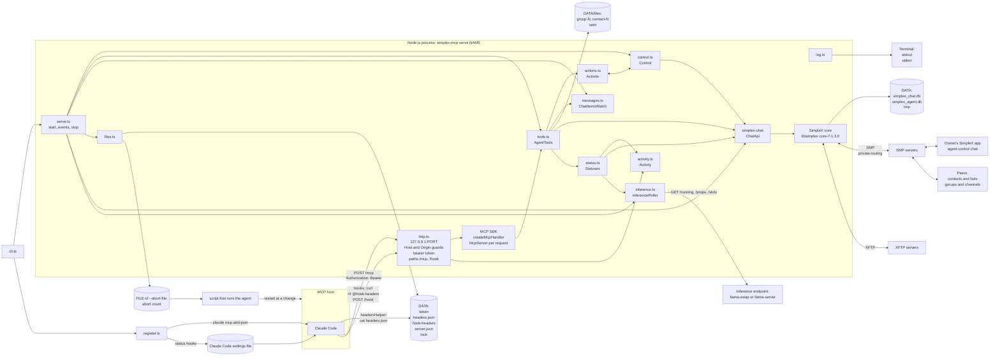
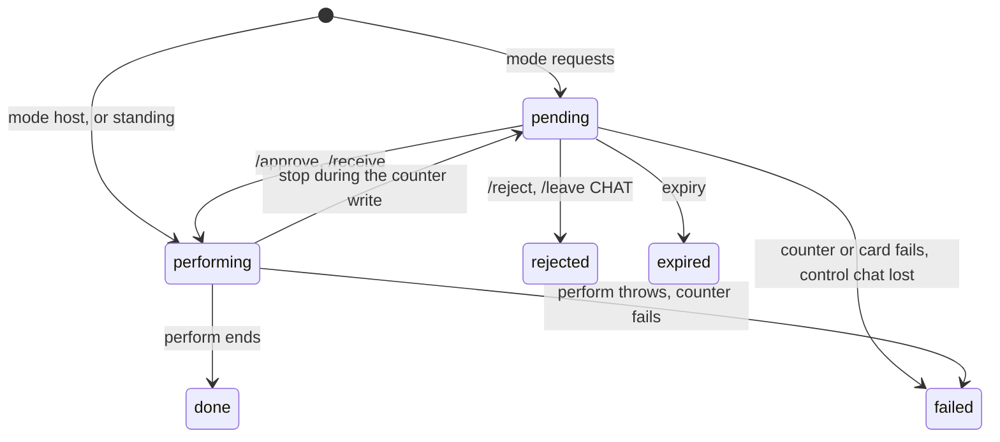
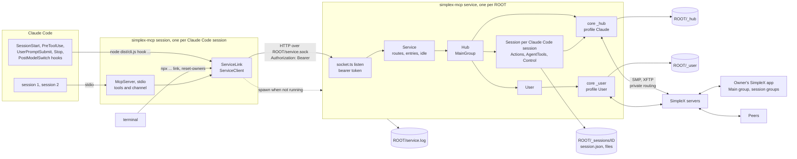
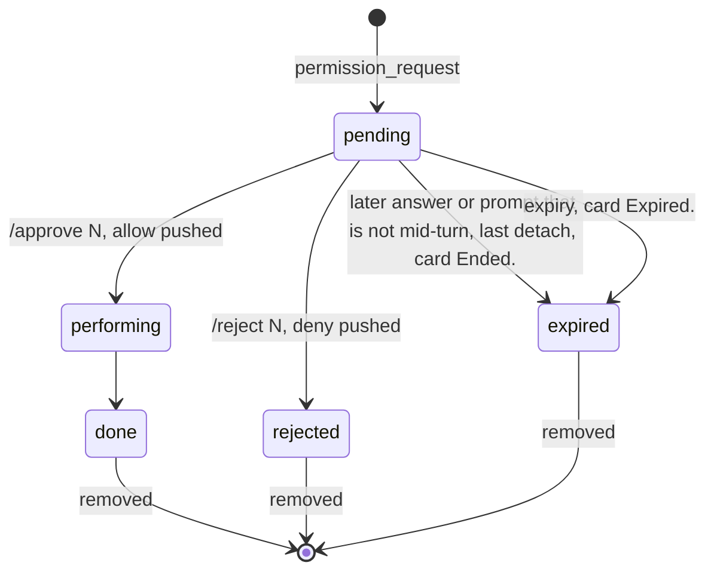
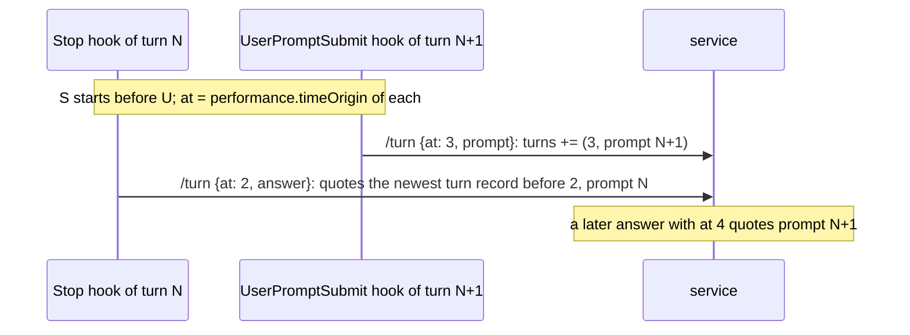

# SimpleX MCP server: architecture

> System structure, modules, state, process lifecycle, approval model and security boundaries of `@simplex-chat/mcp` 0.3.0. `serve` is described in sections 1-7, and the Claude Code plugin in section 8.
>
> Related specs: [README](README.md) | [Flows](flows.md) | [API](api.md)
> Related docs: [README](../README.md) | [Reference](../REFERENCE.md) | [PLAN](../../../plans/2026-10-19-mcp-server.md)

**Source:** [`cli.ts`](../src/cli.ts) | [`serve.ts`](../src/serve.ts) | [`http.ts`](../src/http.ts) | [`tools.ts`](../src/tools.ts) | [`actions.ts`](../src/actions.ts) | [`control.ts`](../src/control.ts) | [`messages.ts`](../src/messages.ts) | [`files.ts`](../src/files.ts) | [`register.ts`](../src/register.ts) | [`log.ts`](../src/log.ts) | [`core.ts`](../src/core.ts) | [`status.ts`](../src/status.ts) | [`inference.ts`](../src/inference.ts) | [`activity.ts`](../src/activity.ts)
**Plugin source:** [`session.ts`](../src/session.ts) | [`client.ts`](../src/client.ts) | [`socket.ts`](../src/socket.ts) | [`protocol.ts`](../src/protocol.ts) | [`service.ts`](../src/service.ts) | [`hub.ts`](../src/hub.ts) | [`main-group.ts`](../src/main-group.ts) | [`user.ts`](../src/user.ts) | [`hook.ts`](../src/hook.ts) | [`owner.ts`](../src/owner.ts) | [`config.ts`](../src/config.ts) | [`qr.ts`](../src/qr.ts)

---

## Table of contents

1. [System diagram](#1-system-diagram)
2. [Modules](#2-modules)
3. [State](#3-state)
4. [Process lifecycle](#4-process-lifecycle)
5. [Approval model](#5-approval-model)
6. [Security boundaries](#6-security-boundaries)
7. [Limits](#7-limits)
8. [Claude Code plugin](#8-claude-code-plugin)

---

## 1. System diagram


```mermaid
flowchart LR
  subgraph host["MCP host"]
    cc["Claude Code"]
  end
  subgraph proc["Node.js process: simplex-mcp serve NAME"]
    http["http.ts<br/>127.0.0.1:PORT<br/>Host and Origin guards<br/>bearer token<br/>paths /mcp, /hook"]
    sdk["MCP SDK<br/>createMcpHandler<br/>McpServer per request"]
    tools["tools.ts<br/>AgentTools"]
    status["status.ts<br/>Statuses"]
    inference["inference.ts<br/>inferencePoller"]
    activity["activity.ts<br/>Activity"]
    actions["actions.ts<br/>Actions"]
    control["control.ts<br/>Control"]
    messages["messages.ts<br/>ChatItemsWatch"]
    serve["serve.ts<br/>start, events, stop"]
    files["files.ts"]
    log["log.ts"]
    lib["simplex-chat<br/>ChatApi"]
    core["SimpleX core<br/>libsimplex core-7.1.3.0"]
  end
  cli["cli.ts"] --> serve
  cli --> register["register.ts"]
  register -->|"claude mcp add-json"| cc
  register -->|"status hooks"| settings[("Claude Code settings file")]
  settings --> cc
  cc -->|"headersHelper:<br/>cat headers.json"| data
  cc -->|"POST /mcp<br/>Authorization: Bearer"| http
  cc -->|"hooks: curl<br/>-H @hook-headers<br/>POST /hook"| http
  http --> sdk --> tools
  http --> activity
  status --> activity
  tools --> actions
  actions <--> control
  tools --> messages
  serve --> control
  serve --> tools
  serve --> messages
  serve --> files
  files --> data[("DATA:<br/>token<br/>headers.json<br/>hook-headers<br/>server.json<br/>lock")]
  files --> count[("FILE of --abort-file:<br/>abort count")]
  count --> runner["script that runs the agent"]
  runner -->|"restart at a change"| host
  tools --> folder[("DATA/files:<br/>group-N, contact-N<br/>sent")]
  tools --> lib
  control --> lib
  serve --> lib
  tools --> status
  status --> lib
  status --> inference
  serve --> inference
  inference -->|"GET /running, /props, /slots"| llm["Inference endpoint:<br/>llama-swap or llama-server"]
  lib --> core
  core --> db[("DATA:<br/>simplex_chat.db<br/>simplex_agent.db<br/>tmp")]
  core <-->|"SMP<br/>private routing"| smp["SMP servers"]
  core <-->|"XFTP"| xftp["XFTP servers"]
  smp <--> owner["Owner's SimpleX app<br/>agent control chat"]
  smp <--> peers["Peers:<br/>contacts and bots<br/>groups and channels"]
  log --> term["Terminal:<br/>stdout<br/>stderr"]
```

Data flow of a tool call:

1. Claude Code runs the `headersHelper` command of its entry ([`register.ts:58`](../src/register.ts#L58)) and sends the `Authorization` header it prints ([Reference](../REFERENCE.md#add-the-agent-to-claude-code)).
2. The server checks Host, Origin, token, path and readiness, then passes the request to the SDK handler ([`http.ts:23-37`](../src/http.ts#L23-L37)).
3. An `McpServer` is built from the factory for each request, and the arguments are validated against the input schema by the SDK ([`serve.ts:116-120`](../src/serve.ts#L116-L120), [`mcp-BumlNux0.cjs:1812-1817`](../node_modules/@modelcontextprotocol/server/dist/mcp-BumlNux0.cjs#L1812-L1817)).
4. The handler result is returned by `AgentTools.call` as `structuredContent` and as JSON text ([`tools.ts:560-570`](../src/tools.ts#L560-L570)).
5. The server calls `ChatApi` methods of the core ([`messages.ts:271-287`](../src/messages.ts#L271-L287)); actions are created in `Actions` and shown to the owner by `Control` ([`actions.ts:180-215`](../src/actions.ts#L180-L215)).
6. The core emits events. The handler of `serve.ts` passes them to the agent control chat and to `AgentTools.onEvent` ([`serve.ts:134-146`](../src/serve.ts#L134-L146)). `AgentTools.onEvent` then dispatches them to the tools and the item watch ([`tools.ts:702-728`](../src/tools.ts#L702-L728)).

Data flow of a hook event:

1. Claude Code runs the status hook of the event; curl reads the `Authorization` header line from `DATA/hook-headers` and posts the event's JSON input to `/hook` ([`register.ts:63-66`](../src/register.ts#L63-L66)).
2. The server checks Host, Origin, token and path, then method, `Content-Length` and JSON, passes the event to `Activity.record` and answers 204 ([`http.ts:24-30`](../src/http.ts#L24-L30), [`:63-72`](../src/http.ts#L63-L72), [`serve.ts:122`](../src/serve.ts#L122)).
3. The fields of the event are kept for agent sessions only ([`activity.ts:34-81`](../src/activity.ts#L34-L81), [API 5.2](api.md#52-events)).
4. At each tick with a label read, `Activity.state` is read by `Statuses` ([`status.ts:164-169`](../src/status.ts#L164-L169), [`activity.ts:83-85`](../src/activity.ts#L83-L85)).

---

## 2. Modules

### [2.1 `cli.ts`](../src/cli.ts)

Entry point of the `simplex-mcp` binary.

| Symbol | Line | Contents |
|---|---|---|
| `helpText` | [14](../src/cli.ts#L14) | `--help` output |
| `pluginCommands` | [62](../src/cli.ts#L62) | `session`, `service`, `hook session-start`, `hook turn`, `link`, `reset-owners` |
| `Command` | [64](../src/cli.ts#L64) | `help`, `serve` with `ServeOptions`, `register` with `RegisterOptions`, the plugin commands |
| `parseCommand` | [70](../src/cli.ts#L70) | command, NAME and options to a `Command`, or the plugin command equal to the joined arguments |
| `serveOptions` | [81](../src/cli.ts#L81) | defaults and option switch of `serve`; `--reset-owners` with an `--owners` list, `--inference` and `--abort-file` with `--approve host`, and `--abort-file` in a folder not disjoint from the data folder refused |
| `registerOptions` | [149](../src/cli.ts#L149) | defaults and option switch of `register` |
| `OptionReader` | [166](../src/cli.ts#L166) | `value`: the next argument, required<br>`optionalValue`: the next argument, absent when missing or starting with `--` |
| `validAgentName` | [188](../src/cli.ts#L188) | `^[a-z0-9](-?[a-z0-9])*-?$`, at most 32 characters |
| `inferenceUrl` | [213](../src/cli.ts#L213) | `--inference`: an `http` or `https` URL without user name and password, to its origin and path without trailing slashes |
| `usageError` | [239](../src/cli.ts#L239) | `ExitError` with code 2 |
| `main` | [243](../src/cli.ts#L243) | `help`, `serve`, `register`, `session`, `service`, the hooks, `link` and `reset-owners`. `help` prints to stdout. The hooks read stdin and print their JSON output. `link` and `reset-owners` print their text. |
| top-level catch | [278-287](../src/cli.ts#L278-L287) | `ExitError`: message on stderr, its code; other errors: `logError`, code 1 |

### [2.2 `serve.ts`](../src/serve.ts)

Start sequence, event dispatch and stop sequence of one agent.

| Symbol | Line | Contents |
|---|---|---|
| `OwnerEntry` | [20](../src/serve.ts#L20) | `{memberId, name}` of `--owners` |
| `ServeOptions` | [25](../src/serve.ts#L25) | name, data folder and its `dataGiven` flag, display name, mode, owners, expiry, reset and token flags, port, QR code size, stop wait, inference URL, abort file |
| `RunningServer` | [42](../src/serve.ts#L42) | token, `ChatApi`, user, `Actions`, `stop` |
| `serve` | [50](../src/serve.ts#L50) | `startServer`, then SIGINT and SIGTERM handlers: the first signal stops, a second ends the stop wait |
| `startServer` | [68](../src/serve.ts#L68) | inference poller with its key, data folder, lock, token, headers files, abort counter, `ChatApi.init`, `startAgent`; cleanup on error |
| `startAgent` | [94](../src/serve.ts#L94) | user, `prepareCore`, control group, wiring of `Actions`, `Activity`, `AgentTools` with the inference poller, the activity and the abort counter, `Control`, leftover status messages, HTTP with `Activity.record` for `/hook`, event handler, `stop` |
| `registerHint` | [167](../src/serve.ts#L167) | the `register` command line printed after the owner setup |
| `waitForStopMessages` | [171](../src/serve.ts#L171) | the fixed wait at stop for cards edited or posted at the stop and for status deletions, used by the plugin's hub as well |
| `inferenceKey` | [189](../src/serve.ts#L189) | `SIMPLEX_MCP_INFERENCE_KEY`: visible ASCII characters, otherwise `ExitError` with code 2 |
| `controlGroup` | [195](../src/serve.ts#L195) | found, created or reset agent control chat |
| `listen` | [202](../src/serve.ts#L202) | `startHttp` with the receiver of `/hook`; `EADDRINUSE` to `ExitError` code 1 |

These symbols of [`core.ts`](../src/core.ts) and [`version.ts`](../src/version.ts) are shared with the plugin:

| Symbol | Line | Contents |
|---|---|---|
| `prepareCore` | [core.ts:37](../src/core.ts#L37) | network config, `DATA/tmp` as the core's temp folder, mode 0700, and `DATA/files/sent` deleted |
| `updatedUser` | [core.ts:54](../src/core.ts#L54) | display name and peer type `agent` of the profile |
| `bufferEvents` | [core.ts:61](../src/core.ts#L61) | events received before the handler is installed are queued and replayed in order |
| `version` | [version.ts:1](../src/version.ts#L1) | the package version |

### [2.3 `http.ts`](../src/http.ts)

| Symbol | Line | Contents |
|---|---|---|
| `HttpOptions` | [8](../src/http.ts#L8) | port, token, `McpServerFactory`, readiness, the receiver of `/hook` |
| `maxHookBody` | [16](../src/http.ts#L16) | 4 MiB, the largest `Content-Length` of `/hook` |
| `startHttp` | [18](../src/http.ts#L18) | `http.Server` on `127.0.0.1:port`: guards, `/hook` route, SDK handler, timeouts |
| `authorized` | [43](../src/http.ts#L43) | length check and `timingSafeEqual` against `Bearer <token>` |
| `stopHttp` | [57](../src/http.ts#L57) | `server.close` and `closeAllConnections` |
| `receiveHook` | [63](../src/http.ts#L63) | `/hook`: method, `Content-Length` and JSON checks; the event passed to the receiver; 204 |

### [2.4 `tools.ts`](../src/tools.ts)

Tool definitions, call handlers, connect plans, perform steps, files.

| Symbol | Line | Contents |
|---|---|---|
| `ConnectInput`, `SendInput`, `ReceiveInput`, `LeaveInput`, `DownloadInput` | [49-84](../src/tools.ts#L49-L84) | tool inputs |
| `PlanSummary` | [95](../src/tools.ts#L95) | card kind, chat type, name, SimpleX name, peer type, description, welcome, commands, `takesMessage` |
| `ChatFields` | [107](../src/tools.ts#L107) | chat fields of `connect` and `list` results |
| `Agent` | [121](../src/tools.ts#L121) | `ChatApi`, user, `Actions`, `ChatItemsWatch`, control chat reference, standing approver lookup, refused file post, data folder, inference poller, `Activity`, abort counter. The plugin adds the data root, the owning session ID, the group of `reply`, the mode setter and the record of a pending connection. |
| `JoinMethod` | [140](../src/tools.ts#L140) | `prepared`, `prepareChannel`, `viaAddress`, `prepareContact`, `connect` |
| schemas | [197-421](../src/tools.ts#L197-L421) | input and output JSON schemas |
| descriptions, `instructions` | [423-463](../src/tools.ts#L423-L463) | tool descriptions and server instructions. `instructions` names the host at whose restart actions are cancelled, `server` by default. |
| `replyTool` | [473](../src/tools.ts#L473) | the plugin's seventh tool, `reply` |
| `definitions` | [496](../src/tools.ts#L496) | name, description, schemas and action flag of the six tools |
| `registerTools` | [509](../src/tools.ts#L509) | `registerTool` for each definition and each extra one, with `_meta` on action tools in mode `host` |
| `Download` | [521](../src/tools.ts#L521) | one download: its promise, chat, item, file ID, size, path, the last fileSource seen, received bytes and their time, check timer |
| `AgentTools` | [538](../src/tools.ts#L538) | constructor with the `Agent`, the mode or a function that returns it, and the session number of the plugin. The mode is read at each use of `mode`. |
| `AgentTools.leaving`, `AgentTools.abortItems`, `AgentTools.statuses` | [544-550](../src/tools.ts#L544-L550) | the chats being left; the item IDs of recognized `/abort` messages; the `Statuses`, with the eligibility read `showsStatus` after `knownChat` |
| `AgentTools.register` | [556](../src/tools.ts#L556) | `registerTools` with `AgentTools.call` |
| `AgentTools.call` | [560](../src/tools.ts#L560) | the call registered as running in `Statuses` until it ends; handler result to `CallToolResult`; errors to `isError` |
| `AgentTools.perform` | [572](../src/tools.ts#L572) | perform step of an approved action, which is the mode setter for a `mode` action |
| `giveChat`, `owns`, `claim` | [587-605](../src/tools.ts#L587-L605) | the plugin's chat owners. A chat is the session's when no session ID is set or the chat's owner is that ID. `claim` sets the owner of a chat without one. It is called at a connection, and when `connect` names a known chat ([`ownChat`](../src/tools.ts#L786-L791)). The hub calls it when a pending connection completes. |
| `onEvent` | [702](../src/tools.ts#L702) | events to the file handlers, connect completions and the item watch, for `serve` and the plugin's sessions |
| `reply`, `sendFile` | [749-766](../src/tools.ts#L749-L766) | `reply` sends a file to the group of the plugin's session at once, without an action, under the file rules of `send`. Its message with the caption and the preview is checked by `fitsMessage`. The core's refusal `feature not allowed NAME` is answered with the text with the preference's name. `sendFile` posts the file. |
| `refusedFeature`, `featureOff` | [1692-1699](../src/tools.ts#L1692-L1699) | the preference NAME of a command error `feature not allowed NAME`, and the text `NAME are off in the group of this session; its owners can turn them on in the group's preferences.` The text is used for `reply`, the cards, `/forward` and the answers of a session group. |
| `downloadFile`, `forwardFile`, `downloadTo` | [606-633](../src/tools.ts#L606-L633) | one download per file ID, shared by `download` and `/forward`; a forwarded file moved to the download path for `download` |
| file events | [635-690](../src/tools.ts#L635-L690) | `onNewItems`, `abortAgent`, `onFile`, `onFileComplete`, `onFileError`, `onFileCancelled`, `onFileDescription`; in `onNewItems`, an `/abort` is recognized and handled by `abortAgent`, a status is queued at another message received in an eligible chat, and the items other than a recognized `/abort` are returned for the item watch |
| `onContactConnected`, `onUserJoinedGroup` | [692-700](../src/tools.ts#L692-L700) | completion of connect actions by events |
| `actionResult` | [797](../src/tools.ts#L797) | wait for the decision, result fields, removal |
| `showNote`, `statusRefusal`, `showsStatus` | [963-983](../src/tools.ts#L963-L983) | the note of a `send` with `live: true` and its log line; the first refusal of a status message in a chat; eligibility: `postingRefusal` and `statusRefusal` both without a refusal |
| `attachment`, `isRefused`, `fileToSend`, `resizedCopy` | [1046-1082](../src/tools.ts#L1046-L1082) | the file of a `send` |
| `copyForSending`, `chatFiles`, `deleteChatFiles` | [1084-1113](../src/tools.ts#L1084-L1113) | `/forward` copies; the files of a chat, forwarded ones included; its downloads cancelled, also those the core continues after a restart |
| `leaveChat` | [1135](../src/tools.ts#L1135) | perform step of `leave` and `/leave`: the chat marked as being left, its status message deleted, then the chat; the chat's forwarded files deleted |
| `download`, `fileServers`, `unknownServers` | [1151-1196](../src/tools.ts#L1151-L1196) | the `download` call before its action |
| `startDownload`, `checkDownload`, `currentFile`, `settleFile`, `settleReceived`, `moveReceived` | [1214-1281](../src/tools.ts#L1214-L1281) | a download's steps |
| `deleteLeftoverStatuses` | [1304](../src/tools.ts#L1304) | at start, the leftover status messages of each eligible chat deleted |
| `agentChats`, `knownChat` | [1360-1379](../src/tools.ts#L1360-L1379) | the agent's chats; a checked chat reference |
| `classifyPlan` | [1462](../src/tools.ts#L1462) | `apiConnectPlan` response to a join plan or a known chat |
| `chatSubject`, `isConnected`, `isActive`, `memberCurrent`, `memberCurrentOrPending` | [1558-1636](../src/tools.ts#L1558-L1636) | chat and member predicates shared with `control.ts` and `hub.ts` |
| `postingRefusal` | [1608](../src/tools.ts#L1608) | a chat that is not connected, or a group where the agent's role is `observer` or `relay`; used by `send` and by `showsStatus` |
| `customDataOf`, `setChatData`, `ownerOf` | [1591-1606](../src/tools.ts#L1591-L1606) | a chat's custom data; the plugin's owner key `simplexMcpOwner` |
| `tooLongText`, `fitsMessage`, `quoteContent` | [1656-1676](../src/tools.ts#L1656-L1676) | the refusal text of `send` and `reply` for a message that is too long. `fitsMessage` checks that the message as the core sends it, with its quote, is within `maxMessageLength`, 15602 bytes ([170](../src/tools.ts#L170)). The check is used for `send`, `reply`, the post of `/forward`, and the parts and quotes of the plugin's posts. |
| `realFile` | [1701](../src/tools.ts#L1701) | real path, size, inode and change time of a file |
| `attachmentMedia`, `videoFrame`, `videoDuration` | [1748-1782](../src/tools.ts#L1748-L1782) | previews and durations |
| `toolCall` | [1798](../src/tools.ts#L1798) | `ServerContext` to `ToolCall`: abort signal and progress notifications |

### [2.5 `actions.ts`](../src/actions.ts)

| Symbol | Line | Contents |
|---|---|---|
| `Mode` | [5](../src/actions.ts#L5) | `requests`, `host` |
| `State` | [6](../src/actions.ts#L6) | `pending`, `performing`, `done`, `failed`, `rejected`, `expired` |
| `Standing` | [7](../src/actions.ts#L7) | `messages`, `files` |
| `ToolError` | [18](../src/actions.ts#L18) | errors the model can correct; text returned as is |
| `Subject` | [26](../src/actions.ts#L26) | kind, name, SimpleX name, incognito flag of a card |
| `ConnRef` | [33](../src/actions.ts#L33) | pending connection, contact or group of a connect action |
| `HostTexts` | [20](../src/actions.ts#L20) | refusal texts of a lost control chat, of a stop and of the limit of pending actions. `serve` uses `lostMessage`, `stoppingMessage` and `pendingMessage`, where the owner is named. The plugin uses the hub's texts. |
| `ActionRecord` | [39](../src/actions.ts#L39) | number, session number of the plugin, mode, key, times, change signal, standing flag, state, card, decider, open calls, interrupted flag, ended flag, error, card image |
| `ConnectAction`, `SendAction`, `LeaveAction`, `DownloadAction` | [59-118](../src/actions.ts#L59-L118) | per-tool fields; `Attachment`, the file of a send |
| `ModeAction`, `PermissionAction` | [120-133](../src/actions.ts#L120-L133) | the plugin's actions: a switch to mode `host`, and a tool use of Claude Code with the bytes left for its input preview |
| `ActionHooks` | [139](../src/actions.ts#L139) | `refusal`, `saveCounter`, `postCard`, `perform`, `outcome` |
| `Actions` | [147](../src/actions.ts#L147) | action map, one expiry timer per action, posting and outcome promises |
| `create` | [180](../src/actions.ts#L180) | state by the action's mode, refusal checks, number, log line, counter write, card |
| `ofSession`, `remove`, `openCall`, `closeCall`, `end` | [217-241](../src/actions.ts#L217-L241) | the actions of one session; removal; open call count; an expiry before the expiry time, marked ended |
| `expireDue` | [243](../src/actions.ts#L243) | expiry of every action past its expiry time |
| `decided` | [249](../src/actions.ts#L249) | wait with progress until a decided state, `until`, or the abort signal |
| `stop` | [284](../src/actions.ts#L284) | cancellation of pending and performing actions |
| `scheduleExpiry`, `expire`, `forgetExpired` | [297-316](../src/actions.ts#L297-L316) | the expiry timer of one action, at most 60 s. `expire` expires the action, or sets a new timer when the timer, on the monotonic clock, fires before the expiry time on the wall clock. `forgetExpired` removes an action once it is decided, without open calls and past its expiry time. An action of `serve` that expires is kept longer, see [5.6](#56-expiry). |
| `summary`, `performedText`, `progressText`, `sentence` | [382-429](../src/actions.ts#L382-L429) | log and progress texts. `sentence` ends a log line with a period. For an action of a session, the line ends with one period, even after an error that ends with one. For an action of `serve`, every error is followed by a period, as in 0.2. |

Hooks are bound in [`serve.ts:103-109`](../src/serve.ts#L103-L109): `refusal`, `saveCounter`, `postCard` and `outcome` to `Control`; `perform` to `AgentTools`.

### [2.6 `control.ts`](../src/control.ts)

| Symbol | Line | Contents |
|---|---|---|
| `qrCodeText` | [11](../src/control.ts#L11) | the function of `qr.ts` ([qr.ts:14](../src/qr.ts#L14)), exported from `control.ts` as in 0.2 |
| `controlCommands` | [13](../src/control.ts#L13) | the command menu |
| `standings` | [27](../src/control.ts#L27) | custom data key and reply words of the approvals of messages and files |
| `ControlData` | [46](../src/control.ts#L46) | `{control: true, nextAction}` |
| `ChatApproval` | [70](../src/control.ts#L70) | `{approvedBy, approvedById, approvedAt}` |
| `ControlOptions`, `SessionOptions` | [51-63](../src/control.ts#L51-L63) | display name, `--owners`, register hint and QR code size. For a group of the plugin's session, its approver check, the session IDs by number and the check of `User` are added. |
| `OwnerRequest` | [76](../src/control.ts#L76) | parsed owner command |
| `Control.load` | [115](../src/control.ts#L115) | lost check, group profile and menu through `updateProfile`, and member list |
| `Control.rename`, `Control.describe`, `updateProfile` | [124-140](../src/control.ts#L124-L140) | the plugin's group name, and its short description. `updateProfile` makes one profile update at a time, and keeps the custom data in memory. A session group is updated from its current profile in the chat database. The agent control chat of `serve` is updated from the profile held in memory since the start ([135](../src/control.ts#L135)). |
| `Control.start` | [142](../src/control.ts#L142) | owner setup per `--owners` |
| `Control.refusal` | [150](../src/control.ts#L150) | bytes left for the link texts of a connect card and for the input preview of a tool-use card, card size of a send, connect or download, approver presence |
| `Control.hasApprover` | [163](../src/control.ts#L163) | an approver is a member |
| `Control.standingApprover` | [167](../src/control.ts#L167) | approver name of a chat's standing approval of messages or files |
| `Control.saveCounter`, `Control.saveData` | [172-184](../src/control.ts#L172-L184) | queued writes of the counter and of other keys of the group's custom data |
| `Control.postCard`, `Control.outcome` | [186-197](../src/control.ts#L186-L197) | card post and card edit; the kept-files message after a done leave |
| `Control.refusedFile`, `Control.fileNotSent` | [199-214](../src/control.ts#L199-L214) | posts about files |
| `Control.onMessage` | [216](../src/control.ts#L216) | owner commands, queued one at a time. In a group of the plugin's session, the session passes it the one-line `/` texts, and the texts of `User` are dropped. |
| `Control.onEvent` | [228](../src/control.ts#L228) | membership changes and loss of the control chat |
| `Control.ownerCommand` | [246](../src/control.ts#L246) | command dispatch and replies. A text outside the requests is answered with the command list, or with `Unknown command.` in a group of the plugin's session. |
| `approveChat`, `revoke`, `forward`, `leave`, `deleteFiles` | [293-360](../src/control.ts#L293-L360) | owner requests |
| `give`, `setObserver` | [362-387](../src/control.ts#L362-L387) | `/give CHAT N` and `/observer #G ID` in a group of the plugin's session. `setObserver` replies `NAME's role can't be changed.` for a member with status `pending_approval` or `pending_review` ([381-382](../src/control.ts#L381-L382)). For a member who is neither current nor pending, such as an invited member who has not joined, the reply is `No member ID in this group.` ([379](../src/control.ts#L379), [`memberCurrentOrPending`](../src/tools.ts#L1634-L1636)). Only a current member's role is set to `observer`, when the sender's role is admin or owner and not below the member's role. The members are then read again, and the observer's rights are the reply. |
| `isApprover` | [593-598](../src/control.ts#L593-L598) | the session's check in a group of the plugin's session; otherwise role `owner`, and the `--owners` list when given |
| `roleOrder`, `roleRank`, `canSend` | [44](../src/control.ts#L44), [880-886](../src/control.ts#L880-L886) | the roles of SimpleX from `relay` to `owner`, in the order of the core; a role above `observer` |
| `sessionApproverRoles`, `rightsText` | [40-43](../src/control.ts#L40-L43), [888-891](../src/control.ts#L888-L891) | `admin` and `owner`, the approvers of a session group. `rightsText` is `NAME is a ROLE and RIGHTS.`, with the rights of the approvers, of the other roles that send, or of an observer. |
| `postCardContent`, `sessionRefusal`, `postRefusal`, `refusedCardSubject` | [521-544](../src/control.ts#L521-L544), [756-760](../src/control.ts#L756-L760) | the post of a card. In a plugin session group, a card that the core refuses with `feature not allowed Files and media` is posted again as text, and its later edits are text. A card or an edit refused for another preference before the decision or at a stop is replaced by `Action N: ` and the text with the preference's name. An action that waits for approval then fails with that text. After the decision, the replacement is `Action N OUTCOME; its card was not posted: ` or `...; its card was not updated: ` with that text, where OUTCOME is `was performed`, `failed`, `was rejected`, `expired` or `ended`. The action is kept as it was. |
| `cardContent`, `fittedImage` | [546-566](../src/control.ts#L546-L566) | image and video cards with the file's preview |
| `findControlGroup`, `createControlChat`, `resetControlChat` | [605-645](../src/control.ts#L605-L645) | control group lookup, creation, reset |
| `createGroup`, `updateGroupProfile`, `changeGroupProfile`, `deleteGroup` | [626-650](../src/control.ts#L626-L650) | a group with its profile and custom data, for `serve` and the plugin's groups. A session group or the Main group is updated from its current profile in the chat database. The agent control chat of `serve` is updated from the profile held in memory since the start, as in 0.2. Each update is made only when the change returns a profile. A group is deleted for all members. |
| `isGroupMessage` | [652](../src/control.ts#L652) | an item of one group's main scope |
| `isControlEvent` | [656](../src/control.ts#L656) | membership events of the control group |
| `parseCommand` | [672-677](../src/control.ts#L672-L677) | one-line `/keyword params` |
| `cardText`, `requestLines`, `commandsLine` | [679-750](../src/control.ts#L679-L750) | card text per tool, state and mode |
| `largestCard`, `encodedLength` | [762-770](../src/control.ts#L762-L770) | card size check |
| `truncatedLine`, `fittedLines` | [772-798](../src/control.ts#L772-L798) | a line cut with `…`; the code lines that fit a byte budget, the last one cut |
| `serversLine`, `sizeText` | [804-813](../src/control.ts#L804-L813) | servers line and sizes of download cards |
| `codeSpan`, `safeName`, `mentionText` | [823-835](../src/control.ts#L823-L835) | quoting of peer text |
| `ownerRequest` | [846](../src/control.ts#L846) | command words to an `OwnerRequest`, with `observer #G ID` only for a group of the plugin's session |
| `losesControl`, `isLost` | [863-878](../src/control.ts#L863-L878) | loss of the control chat or of a plugin group |
| `joinedText` | [905](../src/control.ts#L905) | `NAME joined (member N)`, shared with the Main group |
| `entryText`, `restartText` | [909-919](../src/control.ts#L909-L919) | `--owners` entries in restart lines |

### [2.7 `messages.ts`](../src/messages.ts)

| Symbol | Line | Contents |
|---|---|---|
| `Message`, `MessageFile`, `FileOffer` | [16-50](../src/messages.ts#L16-L50) | message item of tool results; its file; the file of a download |
| `ToolCall` | [57](../src/messages.ts#L57) | abort signal and progress callback of one call |
| `Collected` | [62](../src/messages.ts#L62) | collected items, change signal, IDs of the items over the first 100, time of the last change |
| `Changes` | [69](../src/messages.ts#L69) | set of wake callbacks |
| `ChatItemsWatch` | [86](../src/messages.ts#L86) | listeners per chat reference; received message items gathered by `collect` |
| `chatRef`, `anyScopeChatRef`, `isChatRef` | [135-152](../src/messages.ts#L135-L152) | `@N` and `#N` references: of the main conversation, or also of a group's member chat |
| `toMessage`, `messageFile`, `receivedFileError`, `receivedPath` | [174-213](../src/messages.ts#L174-L213) | chat item to `Message`; where a received file is: its download path or its forwarded path |
| `filePaths`, `storedName`, `chatFolder` | [215-227](../src/messages.ts#L215-L227) | `DATA/files/group-N`, `DATA/files/contact-N` or the same under `DATA/forwarded`, and the download path and the forwarded path of a received file in them. A stored file is named by its file ID and extension, and so are the files of the plugin's prompts. |
| `fileOffer`, `fileContent` | [229-254](../src/messages.ts#L229-L254) | file fields of an item; message content of a file |
| `getChat`, `receivingFiles`, `markRead` | [271-287](../src/messages.ts#L271-L287) | `apiGetChat` and `apiChatItemsRead` by chat reference; the IDs of a chat's files in status `rcvAccepted`, `rcvTransfer` or `rcvWarning`, paged |
| `unreadItems` | [289](../src/messages.ts#L289) | unread items of a chat after its `initial` read, paged |
| `reportProgress`, `nextChange`, `awaitResponses` | [305-335](../src/messages.ts#L305-L335) | waits |
| `validName`, `viewName` | [341-367](../src/messages.ts#L341-L367) | display name rules and `@name` form |

### [2.8 `files.ts`](../src/files.ts)

| Symbol | Line | Contents |
|---|---|---|
| `createDataFolder` | [103](../src/files.ts#L103) | `mkdir -p` mode 0700; `chmod 0700` except on Windows |
| `acquireLock`, `releaseLock` | [108-122](../src/files.ts#L108-L122) | `DATA/lock`, or the file of the given name, with the PID. The holder is named in the error by the `user` argument, `server` or `service`. |
| `serverToken` | [124](../src/files.ts#L124) | `DATA/token`, or the file of the given name. An existing file is read, and is made private when the user owns it. A new token is 32 random bytes in base64url, and its file is created as the lock is. |
| `saveHeldTitles`, `takeHeldTitles` | [166-180](../src/files.ts#L166-L180) | `ROOT/titles.json`, written at a service stop, and read and removed at the next start. An unparsable file is skipped with a log line. |
| `createLock`, `createExclusive` | [201-223](../src/files.ts#L201-L223) | A private temporary file with the text is linked into place, so that the file appears once and complete. Where the file system refuses the link, the file is written exclusively. |
| `takeOver` | [225](../src/files.ts#L225) | The lock of a stopped process is claimed first, so that only one starter takes it over. The claim is a link of the lock to `lock.PID.claim`, or an exclusive write of `lock.PID.claim` where links fail. When that PID is still in the lock, the lock is removed and created again. The claim is then removed. |
| `headersFile`, `hookHeadersFile` | [136-142](../src/files.ts#L136-L142) | the paths `DATA/headers.json` and `DATA/hook-headers` |
| `writeHeadersFile` | [144](../src/files.ts#L144) | `DATA/headers.json` and `DATA/hook-headers` |
| `writeServerFile`, `readServerFile` | [149-156](../src/files.ts#L149-L156) | `DATA/server.json` |
| `abortCounter` | [158](../src/files.ts#L158) | FILE of `--abort-file`: the count from its first line, or `0` written; the returned function adds 1 and writes the count, to `FILE.part` with mode 0644, then renamed to FILE |

### [2.9 `register.ts`](../src/register.ts)

| Symbol | Line | Contents |
|---|---|---|
| `hookEvents` | [10](../src/register.ts#L10) | the 14 events of the status hooks |
| `register` | [35](../src/register.ts#L35) | `claude mcp remove`, then `claude mcp add-json`, then the status hooks merged into the settings file of the scope |
| `registryEntry` | [54](../src/register.ts#L54) | `{type, url, headersHelper, timeout}` |
| `statusHooks` | [63](../src/register.ts#L63) | one matcher group per event with the curl handler |
| `scopeLocations` | [68](../src/register.ts#L68) | the location of the manual entry and the settings file of a scope |
| `manualEntryText` | [74](../src/register.ts#L74) | entry text when `claude` is missing |
| `settingsOf`, `withStatusHooks`, `withoutHandlers`, `isObject` | [78-105](../src/register.ts#L78-L105) | the settings file parsed; the handlers with this agent's `@DATA/hook-headers` replaced; `undefined` for a file that is not a valid settings file |
| `projectRoot` | [107](../src/register.ts#L107) | project key of `--scope local` |
| `runCommand` | [133](../src/register.ts#L133) | `spawnSync` with ENOENT detection; on Windows after ENOENT, once more through `cmd.exe` with `cmdArgument` quoting, and exit status 9009 as missing |

### [2.10 `log.ts`](../src/log.ts)

| Symbol | Line | Contents |
|---|---|---|
| `ExitError` | [18](../src/log.ts#L18) | message and exit code |
| `shellWord`, `shellPath` | [24-31](../src/log.ts#L24-L31) | POSIX single quotes or Windows double quotes |
| `oneLine` | [33](../src/log.ts#L33) | runs of `\p{Cc}`, `\p{Cf}`, `\p{Zl}`, `\p{Zp}` to one space |
| `log`, `logError` | [37-43](../src/log.ts#L37-L43) | stdout lines; stderr lines |
| `errorText`, `chatErrorText` | [45-53](../src/log.ts#L45-L53) | error text, folded to one line: the apps' wording for known error shapes, otherwise the type chain |
| `appErrorText` | [55-64](../src/log.ts#L55-L64) | wording of the apps' alerts for chat, agent and store errors |
| `fileError` | [197-201](../src/log.ts#L197-L201) | the error of a received file: the apps' words for its status, or the size limit of its sender |
| `serverHostname` | [246](../src/log.ts#L246) | host of a server address |
| `chainText`, `errorChain` | [250-262](../src/log.ts#L250-L262) | `SimpleX error: <type chain>: <scalar fields>`, details at most 500 characters |
| `fullDomainName` | [272](../src/log.ts#L272) | `SimplexDomain` to `name.simplex` or `name.testing` |

### [2.11 `status.ts`](../src/status.ts)

Status messages: one per chat, owned by `AgentTools` ([tools.ts:546-550](../src/tools.ts#L546-L550)). Texts, labels and events are listed in [API 1.10](api.md#110-status-message), the end at an `/abort` in [API 1.11](api.md#111-abort).

| Symbol | Line | Contents |
|---|---|---|
| `Status` | [10](../src/status.ts#L10) | `LiveMessage`, creation time, render count, label, note, tick timer |
| constants | [19-30](../src/status.ts#L19-L30) | frames; 50 renders by ticks, 59 in all; gaps of 3 s, 20 s and 5 min; 30 min without calls; 23 h lifetime; 30 h − 10 min leftover window; the label of a waiting status; labels and verbs of Claude Code tools by name |
| `Statuses` | [32](../src/status.ts#L32) | statuses by chat, running calls, time of the last call start or end, deletions in progress, failed-poll flag, stop flag |
| `startCall` | [42](../src/status.ts#L42) | one running call registered, and removed by the returned function; the time of the last call set at both |
| `queue` | [52](../src/status.ts#L52) | a waiting status for a chat without one, before the stop; its first tick at once |
| `start` | [58](../src/status.ts#L58) | `queue`, with the label `thinking`; a waiting status taken: the label `thinking`, rendered at once from 1 to 58 renders |
| `show` | [66](../src/status.ts#L66) | a note: refused after the stop; a status 23 h old replaced; refused at 59 renders; rendered at once; a new status scheduled |
| `end` | [78](../src/status.ts#L78) | the status removed, its timer cleared, `LiveMessage.end(text)` kept among the deletions in progress; `text` is `""` by default |
| `offersAbort` | [88](../src/status.ts#L88) | `Agent.abort` set, and the chat's status with 1 or more renders |
| `abort` | [92](../src/status.ts#L92) | every status ended: with `◼ aborted` from 1 render, with `""` at 0 renders |
| `stop` | [96](../src/status.ts#L96) | every status ended, the deletions awaited; the count of statuses with a render returned |
| `deleteLeftovers` | [104](../src/status.ts#L104) | the agent's own live message items of a chat, younger than 30 h − 10 min, read in pages of 100 and deleted with mode `broadcast` |
| `created`, `isCurrent`, `failed` | [121-134](../src/status.ts#L121-L134) | a `LiveMessage` with interval 0, and a label, `thinking` by default; after its failed command, the error is logged and the status is ended while it is current; the identity check |
| `tick` | [136](../src/status.ts#L136) | eligibility read, end conditions, label, render, next tick |
| `render`, `schedule` | [153-162](../src/status.ts#L153-L162) | one `LiveMessage.update`, with the offer ` · /abort` when `Agent.abort` is set; the next tick on an unreferenced timer |
| `label`, `inferred` | [164-182](../src/status.ts#L164-L182) | the inference state, the pending actions with open calls, the latest running call other than `receive` and `Activity.state`; a failed poll logged unless the previous poll failed |
| `statusText`, `statusLabel`, `modelText`, `otherLabel`, `toolLabel`, `named` | [185-228](../src/status.ts#L185-L228) | the line, the offer after it, the note under it, the labels; a name in a code span, or the fallback text without a name |

States of one chat:

| State | `statuses` entry | Renders | `endings` |
|---|---|---|---|
| none | absent | | |
| active | present | 0 to 49 | |
| frozen | present | 50 to 59 | |
| ending | absent | | its `LiveMessage.end("")`, or `LiveMessage.end("◼ aborted")` at an `/abort` |

```
tick(chat, status):                                           status.ts:128
  shown = allowed(chat): knownChat, then showsStatus           :129, tools.ts:502
    a failure: shown false; logged while the status is current :129-132
  the status ended or replaced meanwhile: return               :133
  idle = renders ≥ 50, no running call other than receive,     :134
         30 min since the last call start or end
  not shown, 23 h since creation, or idle: end(chat); return   :135
  renders 1 to 48, not a waiting status: label read            :136-140
    the status ended or replaced meanwhile: return
  renders < 50: render                                         :141
  next tick: a tenth of the age, 3 s to 20 s; 5 min from 50     :142, :150-154
```

- Each await in `tick` is followed by the identity check, and the render is called after the check without an await between them ([status.ts:141](../src/status.ts#L141), [:146](../src/status.ts#L146)).
- In `end`, the status is removed from the map before `LiveMessage.end` is called; the library's pending update is cleared there, so the deletion is the last command of the item ([status.ts:78-86](../src/status.ts#L78-L86), [api.ts:1178-1185](../../simplex-chat-nodejs/src/api.ts#L1178-L1185)).
- Commands of one `LiveMessage` are run in one chain; after a failed command, the error is logged, the status is ended, and its deletion is queued after the commands already queued ([api.ts:1187-1189](../../simplex-chat-nodejs/src/api.ts#L1187-L1189), [status.ts:131-134](../src/status.ts#L131-L134)).
- At run time, `actions`, `log`, `messages`, `simplex-chat` and `@simplex-chat/types` are imported by `status.ts`; `activity`, `tools` and `inference` are imported as types only ([status.ts:1-8](../src/status.ts#L1-L8)).

### [2.12 `inference.ts`](../src/inference.ts)

The poller of `--inference`, created in `startServer` and passed to `AgentTools` in `Agent.inference` ([serve.ts:70](../src/serve.ts#L70), [:112](../src/serve.ts#L112)).

| Symbol | Line | Contents |
|---|---|---|
| `Endpoint` | [3](../src/inference.ts#L3) | URL and key |
| `InferenceState` | [8](../src/inference.ts#L8) | `loading` with a model; `prompt` with a model and the tokens read; `output` with a model and a rate; `idle` |
| `Slot` | [10](../src/inference.ts#L10) | proxy, model, slot ID, task ID, processing flag, tokens decoded, prompt tokens read, time of the answer |
| constants | [23-29](../src/inference.ts#L23-L29) | 1 s deadline, 1 MiB body, 4 proxies, 64 slots, model ID pattern, loopback host names |
| `inferencePoller` | [31](../src/inference.ts#L31) | the poll function; for a call within 3 s of the last poll's start, that poll is returned |
| `sample` | [51](../src/inference.ts#L51) | `/running` of llama-swap, or a plain llama-server at URL; the slots of the allowed proxies |
| `proxySlots` | [77](../src/inference.ts#L77) | `/props`, then `/slots` of one server |
| `slotOf`, `stateOf`, `rateOf` | [87-107](../src/inference.ts#L87-L107) | slot fields; the state of the processing slots; tokens per second |
| `get`, `bodyJson`, `failureText` | [109-141](../src/inference.ts#L109-L141) | one GET with `redirect: "error"`; the body as JSON within 1 MiB; the error text |
| `allowedProxy` | [143](../src/inference.ts#L143) | the origin of a proxy URL that may be polled |
| `textOf`, `fieldOf`, `listOf`, `countOf` | [150-165](../src/inference.ts#L150-L165) | a string field, kept when it matches an optional pattern; reads of untyped JSON; counts as non-negative safe integers; `textOf` and `fieldOf` are also imported by `activity.ts` |

```
poll():                                                        inference.ts:34
  the last poll started less than 3 s ago: its promise          :36
  sample, with one 1 s deadline for all its requests            :37
  a sample of slots: the state from these slots and the         :38-44
    previous ones; these slots become the previous ones
  another sample: the previous slots emptied; the sample is the state
  a failed sample: the previous slots kept; the poll fails
sample():                                                      :51
  GET URL/running with the key                                  :53
    404: proxySlots(URL, with the key, model unknown)           :54
  entries: model by the pattern, state, proxy                   :55
  a model starting: loading, that model                         :56-57
  no model ready: a model stopping ? loading : nothing known    :58-59
  proxies: allowed proxies of ready models, distinct, at most 4 :60-64
    none: nothing known                                         :65
  proxySlots of each proxy without the key, in parallel         :66
    every read fails: the first failure                         :68
    a read gives loading: loading                               :71
    otherwise: the slots of all reads                           :72-74
proxySlots(SERVER, model):                                     :77
  GET SERVER/props; 503: loading, model                         :78-79
  is_sleeping true: an empty slot list                          :80
  GET SERVER/slots; 503: loading, model                         :81-82
  the first 64 slots, with the time of the answer               :83-84
stateOf(slots, previous):                                      :92
  no slot processes: idle                                       :94
  model: the model of the processing slots when they share one  :95
  no processing slot decoded a token: prompt, the sum of tokens read   :96-97
  otherwise: output, rate                                       :98
rateOf(decoding, previous):                                    :101
  per decoding slot, the previous slot of the same proxy, ID and task that
    processed, had decoded tokens, no more than now, at an earlier time:
    tokens decoded since, per second
  the sum, when above 0                                         :106
```

### [2.13 `activity.ts`](../src/activity.ts)

Claude Code activity from the events of the status hooks, created in `startAgent` with the agent NAME, passed to `startHttp` for `/hook` and to `AgentTools` in `Agent.activity` ([serve.ts:111-112](../src/serve.ts#L111-L112), [:122](../src/serve.ts#L122)). Fields and events are listed in [API 5.2](api.md#52-events).

| Symbol | Line | Contents |
|---|---|---|
| `Running` | [4](../src/activity.ts#L4) | a running tool: session, `agent_id`, tool name, file name |
| `ActivityState` | [11](../src/activity.ts#L11) | permission flag, compaction flag, the latest running tool, the latest subagent |
| constants | [18-22](../src/activity.ts#L18-L22) | 16 sessions; 64 running tools and 64 subagents; 256 ended IDs; the name pattern `^[\w-]{1,64}$`; the file name pattern `^[\w.+@-]{1,64}$` |
| `Activity` | [24](../src/activity.ts#L24) | agent sessions; running tools by `tool_use_id`; subagents by `agent_id`; ended tool IDs; sessions with the permission flag; sessions with the compaction flag |
| `record` | [34](../src/activity.ts#L34) | one event: its fields read by type and pattern, the agent session joined, the effect of its `hook_event_name` |
| `state` | [83](../src/activity.ts#L83) | both flags over all agent sessions; the last entries of the running tools and of the subagents |
| `join`, `clear` | [87-100](../src/activity.ts#L87-L100) | an agent session added, the earliest one removed with its state beyond 16; the running tools, subagents and flags of one session removed |
| `fileName`, `keepNewest`, `deleteWhere` | [103-115](../src/activity.ts#L103-L115) | the base name of `file_path` or `notebook_path`, by its pattern; the earliest entry removed beyond a limit; entries removed by a predicate |

- `basename` of `path` and `fieldOf` and `textOf` of `inference.ts` are imported at run time ([activity.ts:1-2](../src/activity.ts#L1-L2)).
- One `Activity` is read for every status message, so the activity of every agent session is shown in every chat with a status message ([status.ts:164-169](../src/status.ts#L164-L169)).

---

## 3. State

### 3.1 Memory

| Item | Holder | Written by | Read by |
|---|---|---|---|
| Actions | `Actions.actions` map ([actions.ts:151](../src/actions.ts#L151)) | `create`, `remove`, `forgetExpired` | tools, `Control` |
| Expiry timers | `Actions.expiries`, one per action ([actions.ts:152](../src/actions.ts#L152)) | `scheduleExpiry`, `expire`, `remove` | |
| Open calls of an action | `ActionRecord.open` ([:51](../src/actions.ts#L51)) | `openCall` and `closeCall` from `actionResult` ([tools.ts:798](../src/tools.ts#L798), [:807](../src/tools.ts#L807)) | `list`, `forgetExpired` |
| Collected replies | `ConnectAction.messages`, `SendAction.responses` ([:64](../src/actions.ts#L64), [:95](../src/actions.ts#L95)) | `ChatItemsWatch.collect` | `connect`, `send` results |
| Item listeners | `ChatItemsWatch.listeners` ([messages.ts:87](../src/messages.ts#L87)) | `collect` | event dispatch |
| Downloads | `AgentTools.downloads`, one per file ID ([tools.ts:539](../src/tools.ts#L539)) | `downloadTo` | file events, checks, `/delete CHAT files` |
| Forwards | `AgentTools.forwarding`, the copy for the post per file ID ([tools.ts:540](../src/tools.ts#L540)) | `forwardFile` | `downloadFile`, before it moves a forwarded file |
| Rejected files | `AgentTools.rejectedFiles` ([tools.ts:541](../src/tools.ts#L541)) | `downloadResult` ([:1203-1204](../src/tools.ts#L1203-L1204)) | the file field; `download`, which then skips the files approval ([:1166](../src/tools.ts#L1166)) |
| Count of file descriptions | `AgentTools.describedFiles` ([tools.ts:542-543](../src/tools.ts#L542-L543)) | `onFileDescription` | `fileServers` |
| Chats being left | `AgentTools.leaving` ([tools.ts:544](../src/tools.ts#L544)) | `leaveChat` ([:1136](../src/tools.ts#L1136), [:1146](../src/tools.ts#L1146)) | `statusRefusal` ([:973](../src/tools.ts#L973)) |
| `/abort` items | `AgentTools.abortItems`, for the run ([tools.ts:545](../src/tools.ts#L545)) | `abortAgent` ([:651](../src/tools.ts#L651)) | `onNewItems`, `receive` ([:647](../src/tools.ts#L647), [:1322](../src/tools.ts#L1322)) |
| Abort count | the count of the function returned by `abortCounter` ([files.ts:160](../src/files.ts#L160)) | `abortCounter`, each `/abort` ([:161](../src/files.ts#L161), [:163](../src/files.ts#L163)) | the next write of FILE |
| Status messages | `Statuses.statuses`, one per chat ([status.ts:33](../src/status.ts#L33)) | `queue`, `start`, `show`, `end` | ticks, `queue`, `start`, `show`, `stop` |
| Running calls | `Statuses.calls` and `Statuses.lastCall` ([status.ts:34-35](../src/status.ts#L34-L35)) | `startCall`, from `AgentTools.call` ([tools.ts:561](../src/tools.ts#L561), [:568](../src/tools.ts#L568)) | labels, the idle check of ticks |
| Deletions in progress | `Statuses.endings` ([status.ts:36](../src/status.ts#L36)) | `end` | `stop` |
| Failed-poll flag | `Statuses.inferenceFailed` ([status.ts:37](../src/status.ts#L37)) | `inferred` | `inferred` |
| Last poll and previous slots | `latest` and `previous` of the poller ([inference.ts:32-33](../src/inference.ts#L32-L33)) | each poll | calls within 3 s; the rate of the next poll |
| Agent sessions | `Activity.sessions`, at most 16 ([activity.ts:25](../src/activity.ts#L25)) | `record` | `record` |
| Claude Code activity | `Activity.tools`, `subagents`, `ended`, `asking`, `compacting` ([activity.ts:26-30](../src/activity.ts#L26-L30)) | `record` | `record`; `state`, read by labels |
| Members of the control chat | `Control.members` ([control.ts:94](../src/control.ts#L94)) | `refreshMembers` ([:568-570](../src/control.ts#L568-L570)) | approver checks |
| Mode, expiry, owners list, stop wait, inference URL, abort file | `ServeOptions` of the run. The mode is kept in `Actions.mode` and in each action as well ([actions.ts:42](../src/actions.ts#L42)). | CLI | all modules |

### 3.2 Chat database custom data

| Item | Entity | Value | Written by | Read by |
|---|---|---|---|---|
| Control marker and counter | agent control chat | `{simplexMcp: {control: true, nextAction: N}}` | [`createControlChat`](../src/control.ts#L615-L630), [`saveCounter`](../src/control.ts#L172) | [`findControlGroup`](../src/control.ts#L605), [`controlDataOf`](../src/control.ts#L610) |
| Standing approval of messages | contact or group of the agent | `{...other keys, simplexMcp: {approvedBy, approvedById, approvedAt}}` | [`approveChat`](../src/control.ts#L293), [`revoke`](../src/control.ts#L306) | [`standingApprover`](../src/control.ts#L167) |
| Files approval | contact or group of the agent | `{...other keys, simplexMcpFiles: {approvedBy, approvedById, approvedAt}}` | [`approveChat`](../src/control.ts#L293), [`revoke`](../src/control.ts#L306) | [`standingApprover`](../src/control.ts#L167) |

The profile, chats, items, members and file transfers are stored by the core in `DATA/simplex_chat.db`; connections and queues in `DATA/simplex_agent.db` (file prefix `DATA/simplex`, [serve.ts:77](../src/serve.ts#L77)).

### 3.3 Files

| Path | Contents | Mode | Written | Read |
|---|---|---|---|---|
| `DATA/` | data folder | 0700, set at every start except on Windows | [files.ts:103-106](../src/files.ts#L103-L106) | |
| `DATA/token` | base64url of 32 random bytes | 0600, set again at every write except on Windows | first start, `--new-token` ([:124-134](../src/files.ts#L124-L134)) | every start |
| `DATA/headers.json` | `{"Authorization":"Bearer <token>"}` | 0600, set again at every write except on Windows | every start ([:144-147](../src/files.ts#L144-L147)) | Claude Code `headersHelper` |
| `DATA/hook-headers` | `Authorization: Bearer <token>` and a newline | 0600, set again at every write except on Windows | every start ([:144-147](../src/files.ts#L144-L147)) | curl of the status hooks, `-H @DATA/hook-headers` |
| `DATA/server.json` | `{name, port, expireHours}` | 0600, set again at every write except on Windows | every start, after the HTTP listener is bound ([serve.ts:123](../src/serve.ts#L123)) | `register` |
| `DATA/lock` | PID and a newline | 0600 | start ([files.ts:201-240](../src/files.ts#L201-L240)) | next start |
| `DATA/tmp/` | the core's temp folder: files in transfer | 0700, set at every start | [core.ts:40](../src/core.ts#L40), [:77-81](../src/core.ts#L77-L81) | the core |
| `DATA/files/group-N/`, `DATA/files/contact-N/` | downloaded files and files received without a download, named by file ID and extension | folder 0700 | the core at the download path ([tools.ts:1219-1220](../src/tools.ts#L1219-L1220)); moves ([:1736-1746](../src/tools.ts#L1736-L1746)) | `download` results, `/forward`, `/leave`, `/delete CHAT files` |
| `DATA/forwarded/group-N/`, `DATA/forwarded/contact-N/` | files `/forward` downloaded, named as above, until a download moves them to `DATA/files/` | folder 0700 | the core at the forwarded path ([tools.ts:616-623](../src/tools.ts#L616-L623), [:1219-1220](../src/tools.ts#L1219-L1220)) | `/forward`; moved by `download` ([:606-614](../src/tools.ts#L606-L614)); deleted by `leave`, `/leave` and `/delete CHAT files` ([:1095-1113](../src/tools.ts#L1095-L1113), [:1135-1149](../src/tools.ts#L1135-L1149)) |
| `DATA/files/sent/` | resized copies of sent images, and copies of the files `/forward` posts, one folder per copy | folder 0700; a resized copy 0600 | [tools.ts:1071-1088](../src/tools.ts#L1071-L1088), [:1115-1119](../src/tools.ts#L1115-L1119) | the core; deleted at `sndFileCompleteXFTP`, `sndFileError` and at start ([core.ts:41](../src/core.ts#L41), [tools.ts:724-726](../src/tools.ts#L724-L726), [:1034](../src/tools.ts#L1034)) |
| `CONFIG/settings.json` (scope `user`), `PROJECT/.claude/settings.local.json` (scope `local`) | Claude Code settings, the status hooks included ([API 3.2](api.md#32-register)) | the mode of an existing file kept; a new file 0666 and new folders 0777, less the umask | `register` ([register.ts:46-50](../src/register.ts#L46-L50)) | Claude Code |
| FILE of `--abort-file`, in a folder disjoint from the data folder | the abort count in decimal and a newline | 0644, set again at every write except on Windows | at the start when its first line holds no count, and at each `/abort`; written to `FILE.part`, then renamed ([files.ts:158-164](../src/files.ts#L158-L164), [:191-195](../src/files.ts#L191-L195)) | the script that runs the agent ([Reference](../REFERENCE.md#abort)) |

The core library is downloaded once into `CACHE/core-7.1.3.0/sqlite`, and the Node.js add-on into `CACHE/nodejs-addon-cce06d8/`, each with a `Downloading ...` line on stderr. CACHE is `$XDG_CACHE_HOME/simplex-chat` or `~/.cache/simplex-chat`; on macOS `~/Library/Caches/simplex-chat`; on Windows `%LOCALAPPDATA%\simplex-chat` ([libs.ts:41-48](../../simplex-chat-nodejs/src/libs.ts#L41-L48), [:89](../../simplex-chat-nodejs/src/libs.ts#L89), [:109](../../simplex-chat-nodejs/src/libs.ts#L109), [:116](../../simplex-chat-nodejs/src/libs.ts#L116), [:129](../../simplex-chat-nodejs/src/libs.ts#L129)).

---

## 4. Process lifecycle

### 4.1 Start

1. With `--inference`, `SIMPLEX_MCP_INFERENCE_KEY` is checked and the poller is created; then the data folder, lock, token and headers files are prepared ([serve.ts:70-75](../src/serve.ts#L70-L75), [:189-193](../src/serve.ts#L189-L193)); with `--abort-file`, the abort counter is created ([serve.ts:76](../src/serve.ts#L76), [files.ts:158-164](../src/files.ts#L158-L164)).
2. libsimplex for SQLite is loaded by `ChatApi.init`, and the databases are migrated with confirmation `yesUp` ([serve.ts:77](../src/serve.ts#L77), [api.ts:117-126](../../simplex-chat-nodejs/src/api.ts#L117-L126)).
3. Three log lines: version and NAME, data folder, mode; with `--inference`, a fourth: `Inference endpoint: URL` ([serve.ts:78-81](../src/serve.ts#L78-L81)).
4. The active user is read, or created with display name `--display-name` or NAME, empty full name and peer type `agent` ([serve.ts:96](../src/serve.ts#L96)).
5. `prepareCore` reads the network config and sets it with `smpProxyMode` `always` and `smpProxyFallback` `allowProtected` ([serve.ts:97](../src/serve.ts#L97), [core.ts:38-39](../src/core.ts#L38-L39)).
6. `prepareCore` sets `DATA/tmp` as the core's temp folder and deletes `DATA/files/sent` ([core.ts:40-41](../src/core.ts#L40-L41)).
7. Events are buffered, and the chat is started ([serve.ts:98-99](../src/serve.ts#L98-L99)).
8. A `--display-name` different from the profile, or a peer type other than `agent`, is applied with one `apiUpdateProfile` ([serve.ts:100](../src/serve.ts#L100), [core.ts:54-59](../src/core.ts#L54-L59)).
9. The agent control chat is found by its marker, created with counter 1, or reset with `--reset-owners` ([:102](../src/serve.ts#L102), [:195-200](../src/serve.ts#L195-L200)).
10. `Actions`, `ChatItemsWatch`, `Activity`, `AgentTools` with the poller, the activity and its `Statuses`, and `Control` are created; the counter is taken from the marker ([:103-113](../src/serve.ts#L103-L113), [tools.ts:548-550](../src/tools.ts#L548-L550)).
11. `Control.load` sets `Actions.lost` for a lost control chat. Otherwise it updates the group name and command menu when they differ in the control chat's profile read at the start, as in 0.2, and reads the members ([control.ts:115-122](../src/control.ts#L115-L122), [:133-140](../src/control.ts#L133-L140), [:637-640](../src/control.ts#L637-L640)).
12. Status messages left by an earlier run are deleted in each eligible chat; after the control chat is lost, every chat is ineligible. A failed chat list is logged as `status messages: ERROR`, and the start continues ([serve.ts:115](../src/serve.ts#L115), [tools.ts:1304-1309](../src/tools.ts#L1304-L1309), [:976](../src/tools.ts#L976), [status.ts:104-119](../src/status.ts#L104-L119)).
13. The HTTP server listens; with the port in use, the process exits with code 1 ([serve.ts:122](../src/serve.ts#L122), [:202-209](../src/serve.ts#L202-L209)). Until step 15 ends, requests to `/mcp` that pass the token check get 503 with `Retry-After: 1` ([http.ts:32](../src/http.ts#L32), [serve.ts:121-122](../src/serve.ts#L121-L122), [:130](../src/serve.ts#L130)); `/hook` is answered from this step on ([http.ts:26-30](../src/http.ts#L26-L30)).
14. `server.json` is written ([serve.ts:123](../src/serve.ts#L123)).
15. The server runs the owner setup, `Control.start`; after an error, HTTP is closed and the error is rethrown ([serve.ts:124-129](../src/serve.ts#L124-L129)).
16. `Listening on http://127.0.0.1:PORT/mcp` ([:131](../src/serve.ts#L131)).
17. Buffered events are replayed, then live events are dispatched ([serve.ts:134](../src/serve.ts#L134), [core.ts:61-75](../src/core.ts#L61-L75)).

After an error inside `startAgent` (steps 4-17) the chat is closed; after any error once the lock is taken, the lock is released ([serve.ts:73-91](../src/serve.ts#L73-L91)).

### 4.2 Event dispatch

Each `onAny` receiver is awaited by the library before the next event is read ([api.ts:195-202](../../simplex-chat-nodejs/src/api.ts#L195-L202)). The dispatcher in [`serve.ts:134-146`](../src/serve.ts#L134-L146) passes items of the control group to `Control` first. Every event then goes to [`AgentTools.onEvent`](../src/tools.ts#L702-L728), which runs the `AgentTools` and `ChatItemsWatch` handlers below. Finally, `Control` receives file errors and membership events:

| Event | Condition | Handler |
|---|---|---|
| `newChatItems` | item of the control group, main scope | [`Control.onMessage`](../src/control.ts#L216) |
| `newChatItems` | every item | [`AgentTools.onNewItems`](../src/tools.ts#L635), then [`ChatItemsWatch.deliver`](../src/messages.ts#L116) of the items it returns: all but a recognized `/abort` |
| `chatItemUpdated` | | [`AgentTools.onFile`](../src/tools.ts#L663), then [`ChatItemsWatch.update`](../src/messages.ts#L120) |
| `chatItemsDeleted` | | [`ChatItemsWatch.remove`](../src/messages.ts#L124) of each `deletedChatItem` |
| `contactConnected` | | [`AgentTools.onContactConnected`](../src/tools.ts#L692) |
| `userJoinedGroup` | | [`AgentTools.onUserJoinedGroup`](../src/tools.ts#L697) |
| `rcvFileComplete` | | [`AgentTools.onFileComplete`](../src/tools.ts#L668) |
| `rcvFileSndCancelled` | | [`AgentTools.onFileCancelled`](../src/tools.ts#L680) |
| `rcvFileError` | | [`AgentTools.onFileError`](../src/tools.ts#L675) |
| `rcvFileDescrReady` | | [`AgentTools.onFileDescription`](../src/tools.ts#L687) |
| `sndFileCompleteXFTP` | | [`AgentTools.onSentFile`](../src/tools.ts#L1034) |
| `sndFileError` | | [`AgentTools.onSentFile`](../src/tools.ts#L1034), then [`Control.fileNotSent`](../src/control.ts#L205) |
| `joinedGroupMember`<br>`joinedGroupMemberConnecting`<br>`connectedToGroupMember`<br>`memberRole`<br>`leftMember`<br>`deletedMember`<br>`deletedMemberUser`<br>`groupDeleted` | event of the control group | [`Control.onEvent`](../src/control.ts#L228), queued one at a time |
| any event | after `stop()` started | ignored |

Owner commands are queued in a second chain, independent of the membership chain ([control.ts:222-225](../src/control.ts#L222-L225)).

### 4.3 Stop

On `SIGINT` or `SIGTERM` the server runs one stop; a later signal ends its wait for cancelled cards and status deletions ([serve.ts:50-66](../src/serve.ts#L50-L66)). `RunningServer.stop` ([serve.ts:152-163](../src/serve.ts#L152-L163)):

1. Events are ignored from now on.
2. `Actions.stop` starts: new actions are refused with `The server is stopping.`; the expiry timers are cleared; cards being posted are awaited; pending and performing actions are marked interrupted; the stop signal of the performs is aborted, which ends the wait of a `connect` for its connection; their cards are edited, or posted when they have no card; outcome edits already in progress are awaited ([actions.ts:284-316](../src/actions.ts#L284-L316)).
3. In parallel with step 2, the HTTP server is closed with all connections, and open calls are aborted ([http.ts:57-61](../src/http.ts#L57-L61)).
4. `Cancelled K action(s).` when K > 0 ([serve.ts:157](../src/serve.ts#L157)).
5. `Statuses.stop`: later starts are ignored and notes refused; each status message is ended, and the deletion commands are awaited, with the endings of an `/abort` still in progress; the status messages with a render are counted, those ended by an `/abort` excluded ([serve.ts:158](../src/serve.ts#L158), [status.ts:96-102](../src/status.ts#L96-L102)).
6. When cards were edited or posted at the stop and the control chat is not lost, or status messages had a render, the server waits `--stop-wait` seconds, 10 by default, for them to be sent; a second signal ends the wait ([serve.ts:159](../src/serve.ts#L159), [:171-187](../src/serve.ts#L171-L187)).
7. `chat.close()`: the chat is stopped, then the store is closed ([api.ts:165-170](../../simplex-chat-nodejs/src/api.ts#L165-L170)).
8. The lock is removed, `Stopped.` is logged, and the process exits with code 0, or 1 after an error ([serve.ts:161-162](../src/serve.ts#L161-L162), [:56-62](../src/serve.ts#L56-L62)).

Performs in progress are not awaited; when one ends, its card stays as edited at the stop and no line is logged, because the action is interrupted ([actions.ts:346](../src/actions.ts#L346)).

### 4.4 The lock

```
acquireLock(DATA, USER = server):                    files.ts:90
  create DATA/lock exclusively (flag wx), PID       :158-166
  exists:
    PID = number in the file                        :168-171
    PID valid, other than ours, running:            :94, :173-180
      exit 1 "Another USER uses DATA (PID N). If no USER runs, remove DATA/lock."
    remove the file; create it exclusively again    :95-96
      exists again: exit 1 with the same message
releaseLock(DATA): remove DATA/lock                  :99-105
```

`isRunning`: `true` when `kill(pid, 0)` succeeds or fails with `EPERM` ([files.ts:247-254](../src/files.ts#L247-L254)).

---

## 5. Approval model

### 5.1 Modes

The mode is set by `--approve` for one run ([cli.ts:103-105](../src/cli.ts#L103-L105)).

| Mode | State of a new action | Card | `_meta` of `connect`, `send`, `download`, `leave` |
|---|---|---|---|
| `requests` | `pending`<br>`performing` for a send under a standing approval, and for a download under a files approval | card with commands<br>outcome as a new message after a standing send; none after a download without a card | none |
| `host` | `performing` | outcome as a new message after the perform; none for a download | `{"anthropic/requiresUserInteraction": true}` |

The mode in which an action is created is kept in `ActionRecord.mode`. The action's card and log line are written for that mode ([actions.ts:180](../src/actions.ts#L180), [:193](../src/actions.ts#L193), [control.ts:151](../src/control.ts#L151)).

Sources: [actions.ts:193](../src/actions.ts#L193), [tools.ts:515](../src/tools.ts#L515), [control.ts:190-197](../src/control.ts#L190-L197), [:601-603](../src/control.ts#L601-L603). In both modes a new action is refused unless the control chat has an approver ([control.ts:156-160](../src/control.ts#L156-L160)).

### 5.2 Owners and approvers

| Term | Rule | Code |
|---|---|---|
| human | member other than the agent's membership, status `connected` or `complete` | [control.ts:589-591](../src/control.ts#L589-L591), [tools.ts:1617-1619](../src/tools.ts#L1617-L1619) |
| human owner | human with role `owner` | [control.ts:576-578](../src/control.ts#L576-L578) |
| approver, `--owners` absent | member with role `owner` | [control.ts:593-598](../src/control.ts#L593-L598) |
| approver, `--owners` without a list | none | [control.ts:597](../src/control.ts#L597) |
| approver, `--owners ID:NAME,...` | member with role `owner` whose `groupMemberId` and `displayName`, folded to one line by `oneLine`, match an entry | [control.ts:597](../src/control.ts#L597), [:893-895](../src/control.ts#L893-L895) |

The command sender's member record from the chat item is checked ([control.ts:220](../src/control.ts#L220), [:250](../src/control.ts#L250)). The approver count for refusals and standing approvals is taken from `Control.members`, refreshed at load and at each membership event ([control.ts:232](../src/control.ts#L232), [:568-570](../src/control.ts#L568-L570)).

Owner setup at start ([control.ts:142-148](../src/control.ts#L142-L148)):

| `--owners` | Start | First join by the link |
|---|---|---|
| absent | a human owner exists: register hint<br>otherwise: `No owners in the agent control chat.` when humans exist, then a link with role `member` | link deleted, role `owner`, greeting, log line, register hint |
| without a list | no humans: link with role `observer`<br>humans exist: their IDs and the restart command, in the log and the chat | link deleted, the joined member and the restart command announced |
| `ID:NAME,...` | each entry matched to a human, or exit 2<br>role `owner` set where missing<br>other humans removed<br>link deleted<br>`Owners: ...` and register hint | |

Sources: [`startOwners`](../src/control.ts#L421), [`startObserver`](../src/control.ts#L427), [`startListed`](../src/control.ts#L432), [`ownerJoined`](../src/control.ts#L451), [`observerJoined`](../src/control.ts#L460).

Membership changes at run time ([control.ts:228-244](../src/control.ts#L228-L244)):

| Change | `--owners` | Server reaction |
|---|---|---|
| `deletedMemberUser`, `groupDeleted`, or the agent's role below `owner` | any | `Actions.loseControl`: pending actions set to `failed`; later cards left unedited; log line |
| approvers drop to zero after a human owner existed | absent | `No owners in the agent control chat.`, new link with role `member` |
| a human becomes owner outside the list | list | `<name> (member N) is now an owner and can't approve actions yet. Restart the server with --owners ...` |
| a listed owner stops being a human owner | list | `<name> (member N) is no longer an owner.` with the restart command, or `No owners remain: ...` |

### 5.3 Action state machine

Transitions, one per row:

| Event | From | To | Code |
|---|---|---|---|
| call creates the action, mode `requests` | | `pending` | [actions.ts:193](../src/actions.ts#L193) |
| call creates the action, mode `host` | | `performing` | [actions.ts:193](../src/actions.ts#L193) |
| `send` call under a standing approval, or `download` call under a files approval | | `performing` | [actions.ts:193](../src/actions.ts#L193) |
| counter write or card post fails | `pending`<br>`performing` | `failed` | [actions.ts:318-329](../src/actions.ts#L318-L329) |
| stop arrives while the counter of a `performing` action is written | `performing` | `pending`, interrupted | [actions.ts:331-336](../src/actions.ts#L331-L336) |
| control chat lost | `pending` | `failed` | [actions.ts:276-282](../src/actions.ts#L276-L282) |
| `/reject`, or `/leave CHAT` for a pending action of CHAT with a card | `pending` | `rejected` | [actions.ts:269-274](../src/actions.ts#L269-L274), [control.ts:344-346](../src/control.ts#L344-L346) |
| expiry time passes | `pending` | `expired` | [actions.ts:302-312](../src/actions.ts#L302-L312) |
| `/approve N`, `/approve CHAT N` and `/approve CHAT all` for other actions; `/receive N`, `/receive CHAT N` and `/receive CHAT N all` for downloads | `pending` | `performing` | [actions.ts:263-267](../src/actions.ts#L263-L267), [control.ts:279-288](../src/control.ts#L279-L288) |
| perform throws | `performing` | `failed` | [actions.ts:342-345](../src/actions.ts#L342-L345) |
| perform ends | `performing` | `done` | [actions.ts:340-341](../src/actions.ts#L340-L341) |

`create` ([actions.ts:180-215](../src/actions.ts#L180-L215)):

```
create(key, fields, standingApprover?, session?, mode = Actions.mode):
  state = mode host or standing ? performing : pending
  refusal, first match:
    stopping                      texts.stopping: "The server is stopping."
    control chat lost             texts.lost: lostMessage
    20 actions of the session pending       pendingMessage
    20 actions of the session performing    performingMessage
    connect: link texts cut to the bytes its largest card leaves
    send, connect or download card over 15000 bytes    cardTooLong
    no approver                   no-owner message
  refusal: throw ToolError        counter unchanged
  N = next; next += 1; store; expiry timer; log "Action N: ..."
  post:
    saveCounter(next)
    state pending: card = postCard()
    either fails: state failed; log "Action N: failed: ERROR."
  after post:
    posted and performing:
      stopping: state = pending
      otherwise: perform
```


```mermaid
stateDiagram-v2
  [*] --> pending: mode requests
  [*] --> performing: mode host, or standing
  pending --> performing: /approve, /receive
  pending --> rejected: /reject, /leave CHAT
  pending --> expired: expiry
  pending --> failed: counter or card fails, control chat lost
  performing --> done: perform ends
  performing --> failed: perform throws, counter fails
  performing --> pending: stop during the counter write
```

An action is removed from memory when its result is returned to a call ([tools.ts:804](../src/tools.ts#L804)). An action that is decided, without open calls and past its expiry time, is removed as well. This is checked at each decision, at the close of each call and at the action's expiry timer ([actions.ts:314-316](../src/actions.ts#L314-L316), [:232-235](../src/actions.ts#L232-L235), [:351-355](../src/actions.ts#L351-L355)). `serve` has one session, `undefined`, so all its actions are counted against the limits of 20. A pending action of `serve` that expires is kept longer, see [5.6](#56-expiry). A repeated call before its removal is therefore answered with `expired`, as in 0.2 ([actions.ts:307-309](../src/actions.ts#L307-L309), [:243-247](../src/actions.ts#L243-L247), [control.ts:247](../src/control.ts#L247)). A `download` still performing at the end of `wait` is returned as `performing` and kept ([tools.ts:801](../src/tools.ts#L801)).

### 5.4 Cards

The server posts a card when a `pending` action is created, and edits it with `apiUpdateChatItem` at the outcome ([actions.ts:321](../src/actions.ts#L321), [control.ts:190-197](../src/control.ts#L190-L197)). For a `connect`, `send` or `leave` without a card (mode `host`, standing sends) the server posts the outcome as a new message; a `download` without a card gets none ([control.ts:601-603](../src/control.ts#L601-L603)). The text per state is built by [`cardText`](../src/control.ts#L679-L698). A card of a `send` or `download` of an image or video file is an image or video message with the file's preview. In a plugin session group where files and media are refused by the group's preference, the card is text ([control.ts:521-566](../src/control.ts#L521-L566)). The forms are listed in [API: cards](api.md#22-cards).

Outcomes are posted after `done` and `failed` ([actions.ts:348](../src/actions.ts#L348)), after `rejected` and `expired` ([:273](../src/actions.ts#L273), [:311](../src/actions.ts#L311)), and at stop ([:292](../src/actions.ts#L292)). They are skipped after the control chat is lost ([:292](../src/actions.ts#L292), [:348](../src/actions.ts#L348), [:358](../src/actions.ts#L358)).

### 5.5 Standing approvals

| Aspect | Messages | Files | Code |
|---|---|---|---|
| grant | `/approve CHAT all` from an approver in mode `requests`; pending sends of CHAT with a card are approved | `/receive CHAT N all` from an approver, on the card of download N; N is performed, and the other pending downloads of CHAT stay pending | [control.ts:287](../src/control.ts#L287), [:293-304](../src/control.ts#L293-L304) |
| mode `host` | nothing stored; reply `Approvals apply in mode requests; this server runs in mode host.` | downloads get no card, so the command has none to act on | [control.ts:259](../src/control.ts#L259) |
| removal | `/revoke CHAT`: the `simplexMcp` key is removed, other keys kept | `/receive CHAT off`: the `simplexMcpFiles` key is removed | [control.ts:306-313](../src/control.ts#L306-L313) |
| use | mode `requests`, and `approvedById` equal to the `groupMemberId` of a current approver | the same | [control.ts:167-170](../src/control.ts#L167-L170) |
| scope | `send`; status messages and notes in the chat ([API 1.10](api.md#110-status-message)), so after `/revoke` the chat's status message is deleted at its next tick | `download` of a file whose servers are all known | [tools.ts:958](../src/tools.ts#L958), [:977](../src/tools.ts#L977), [:1166](../src/tools.ts#L1166), [status.ts:143](../src/status.ts#L143) |
| decider shown | `safeName(approvedBy)` | the same | [control.ts:169](../src/control.ts#L169) |
| storage | the chat's custom data; removed with the chat by `leave` | the same | [tools.ts:1135-1149](../src/tools.ts#L1135-L1149) |

Files of `reply` in a session group are sent without approval, and no standing approval applies to them. They are allowed or refused by the group's preference for files and media ([8.5](#85-approval-model)).

### 5.6 Expiry

| Rule | Code |
|---|---|
| `expires = created + expireHours × 3600000`, `expireHours` 1 to 23, default 23 | [actions.ts:190](../src/actions.ts#L190), [cli.ts:86](../src/cli.ts#L86), [:109-111](../src/cli.ts#L109-L111) |
| one unreferenced timer per action, set at its creation for `expires - now`, at most 60 s, and set again until the expiry time. Before each owner command, all actions past `expires` are expired. | [actions.ts:11](../src/actions.ts#L11), [:297-300](../src/actions.ts#L297-L300), [control.ts:247](../src/control.ts#L247) |
| pending and due: `expired`, log `Action N expired.`, card edited to `Expired.` | [actions.ts:302-312](../src/actions.ts#L302-L312) |
| decided, no open call, due: removed from memory. A pending action of `serve` that expires stays until the next owner command or its check 60 s later, as in 0.2. | [actions.ts:314-316](../src/actions.ts#L314-L316), [:307-309](../src/actions.ts#L307-L309), [:243-247](../src/actions.ts#L243-L247) |
| connect wait for the other side: at most until `created + 24 h - 10 min` | [tools.ts:160](../src/tools.ts#L160), [:850](../src/tools.ts#L850) |

A timer runs on the monotonic clock, while `expires` is a time on the wall clock. A timer that fires before `expires` is set again. So an action whose expiry time passes while the computer sleeps expires within 60 s after the computer wakes ([actions.ts:305](../src/actions.ts#L305)).

### 5.7 Action counter

| Rule | Code |
|---|---|
| initial value: `nextAction` of the control marker, or 1 | [serve.ts:103](../src/serve.ts#L103) |
| a new action takes `next`, then `next` grows by 1 | [actions.ts:181](../src/actions.ts#L181), [:206](../src/actions.ts#L206) |
| the new `next` is written before the card is posted | [actions.ts:320-321](../src/actions.ts#L320-L321) |
| one write at a time, also after a failed write | [control.ts:172-184](../src/control.ts#L172-L184) |
| `--reset-owners` copies the value into the new control chat | [serve.ts:198-199](../src/serve.ts#L198-L199), [control.ts:642-645](../src/control.ts#L642-L645) |
| a refused call leaves the counter unchanged | [actions.ts:205](../src/actions.ts#L205) |

---

## 6. Security boundaries

### 6.1 HTTP

Checks in order of the request listener ([http.ts:23-37](../src/http.ts#L23-L37)):

| Check | Rule | Failure | Code |
|---|---|---|---|
| bind address | `127.0.0.1` only | | [http.ts:50](../src/http.ts#L50) |
| Host | hostname `localhost`, `127.0.0.1` or `[::1]`, any port | 403, JSON-RPC error | [node index.cjs:26-48](../node_modules/@modelcontextprotocol/node/dist/index.cjs#L26-L48), [server index.cjs:1520-1558](../node_modules/@modelcontextprotocol/server/dist/index.cjs#L1520-L1558) |
| Origin | absent or empty passes; otherwise the same hostnames, any port | 403, JSON-RPC error | [node index.cjs:74-96](../node_modules/@modelcontextprotocol/node/dist/index.cjs#L74-L96), [server index.cjs:1599-1644](../node_modules/@modelcontextprotocol/server/dist/index.cjs#L1599-L1644) |
| token | `Authorization` equal to `Bearer <token>`, same length, `timingSafeEqual` | 401, empty body | [http.ts:43-46](../src/http.ts#L43-L46) |
| path | pathname `/hook` or `/mcp` | 404, empty body | [http.ts:26-31](../src/http.ts#L26-L31) |
| `/hook` method | `POST` | 405, `Allow: POST` | [http.ts:64](../src/http.ts#L64) |
| `/hook` body | `Content-Length` a number, at most 4 MiB; JSON | 411, 413, 400 | [http.ts:65-69](../src/http.ts#L65-L69) |
| start | `/mcp` only: the agent control chat is started | 503, `Retry-After: 1`, empty body | [http.ts:32](../src/http.ts#L32) |
| body size | 4 MiB | 413 | [node index.cjs:395-401](../node_modules/@modelcontextprotocol/node/dist/index.cjs#L395-L401) |
| content type of POST | `application/json` | 415 | [server index.cjs:1464-1467](../node_modules/@modelcontextprotocol/server/dist/index.cjs#L1464-L1467) |
| tool arguments | input schema | `isError: true` result | [mcp-BumlNux0.cjs:1812-1817](../node_modules/@modelcontextprotocol/server/dist/mcp-BumlNux0.cjs#L1812-L1817) |
| tool results | output schema | `isError: true` result | [mcp-BumlNux0.cjs:1822-1829](../node_modules/@modelcontextprotocol/server/dist/mcp-BumlNux0.cjs#L1822-L1829) |

Node limits: `requestTimeout` 0, `timeout` 0, `headersTimeout` 60 s, `keepAliveTimeout` 5 s ([http.ts:38-41](../src/http.ts#L38-L41)). When the client closes the response stream, the call is aborted: the request signal is aborted in `toNodeHandler` on `close`, the per-request transport is closed, and `ctx.mcpReq.signal` is aborted by the protocol layer ([node index.cjs:299-303](../node_modules/@modelcontextprotocol/node/dist/index.cjs#L299-L303), [server index.cjs:86-90](../node_modules/@modelcontextprotocol/server/dist/index.cjs#L86-L90), [src-BhnGYybN.cjs:6410-6427](../node_modules/@modelcontextprotocol/server/dist/src-BhnGYybN.cjs#L6410-L6427)). A result produced after the abort is discarded ([src-BhnGYybN.cjs:6536](../node_modules/@modelcontextprotocol/server/dist/src-BhnGYybN.cjs#L6536)).

### 6.2 Token and `headersHelper`

- The token is created once and kept in `DATA/token`; `--new-token` replaces it ([files.ts:124-134](../src/files.ts#L124-L134)).
- `DATA/headers.json` and `DATA/hook-headers` are rewritten at every start ([files.ts:144-147](../src/files.ts#L144-L147)).
- The Claude Code entry gets the command `cat <DATA>/headers.json`, or `type "<DATA>\headers.json"` on Windows, with the path quoted for the shell ([register.ts:58](../src/register.ts#L58), [log.ts:24-31](../src/log.ts#L24-L31)). Only this command is written to the entry and to the `claude mcp add-json` arguments ([register.test.ts:71-82](../test/unit/register.test.ts#L71-L82)).
- `-H @DATA/hook-headers` is passed to curl by the status hooks, so the settings file holds the path of `DATA/hook-headers` and not the token ([register.ts:64](../src/register.ts#L64), [register.test.ts:84-92](../test/unit/register.test.ts#L84-L92)).
- curl of the status hooks runs without a shell, with `-q` first, so no curlrc file is read, and with `--noproxy *`, so the proxy variables of its environment are ignored; the token is sent to `127.0.0.1:PORT` only ([register.ts:64](../src/register.ts#L64), [Claude Code hooks: exec form](https://code.claude.com/docs/en/hooks#exec-form-and-shell-form)).
- `token`, `headers.json`, `hook-headers` and `server.json` are set to mode 0600 at every write, and the data folder to 0700 at every start, except on Windows ([files.ts:103-106](../src/files.ts#L103-L106), [:186-189](../src/files.ts#L186-L189)).

### 6.3 Peer-written text

| Destination | Rule | Code |
|---|---|---|
| card and reply names | folded to one line; a valid display name is plain, others a code span | [`safeName`](../src/control.ts#L827-L830) |
| card text lines | one code span per line; backticks become `'`; a leading or trailing space becomes U+00A0; blank lines empty | [`codeLines`, `codeSpan`](../src/control.ts#L819-L825) |
| file names and paths on cards and posts | folded to one line, one code span | [control.ts:717](../src/control.ts#L717), [:702](../src/control.ts#L702), [:730](../src/control.ts#L730), [:211-213](../src/control.ts#L211-L213) |
| reply quote on a send card | whitespace runs to one space, first 100 characters (code points), one code span | [control.ts:718](../src/control.ts#L718) |
| link texts on a connect card, the input preview on a tool-use card of the plugin | code span lines in the bytes that the largest card form leaves; the line that does not fit is cut and ends in `…` inside its code span; later lines left out | [control.ts:784-798](../src/control.ts#L784-L798) |
| mention names | valid name: `@name` or `@'name'`; others a code span | [`mentionText`](../src/control.ts#L832-L835) |
| errors on cards | folded to one line, one code span | [control.ts:692](../src/control.ts#L692) |
| `--owners` part of restart lines in the chat | one code span | [control.ts:91](../src/control.ts#L91), [:917-919](../src/control.ts#L917-L919) |
| terminal names and errors of actions | folded to one line | [actions.ts:209-210](../src/actions.ts#L209-L210), [:402-412](../src/actions.ts#L402-L412), [control.ts:90](../src/control.ts#L90) |
| tool results | returned as data; schema descriptions and instructions mark `text`, `from`, `name`, file names, downloaded files, `description`, `welcome` and `commands` with their labels and params as data, not instructions; the instructions take a chat's messages as prompts only when the user said so in the session, and limit what the agent shares about its user | [tools.ts:203](../src/tools.ts#L203), [:207](../src/tools.ts#L207), [:212](../src/tools.ts#L212), [:237-238](../src/tools.ts#L237-L238), [:248-253](../src/tools.ts#L248-L253), [:417](../src/tools.ts#L417), [:461](../src/tools.ts#L461) |

The server writes the tappable form `/'...'` only in the card's command line ([control.ts:735-750](../src/control.ts#L735-L750)), in `/'revoke CHAT'` of standing cards and replies ([:690](../src/control.ts#L690), [:303](../src/control.ts#L303)), and in `/'delete CHAT files'` of the kept-files message ([:354](../src/control.ts#L354)).

### 6.4 Chat references

| Rule | Code |
|---|---|
| `^[@#][1-9]\d{0,14}$`: 1 to 15 digits; the core reads `#(2^64 + N)` as `#N` | [messages.ts:150-152](../src/messages.ts#L150-L152), [scenarios.test.ts:493-505](../test/e2e/scenarios.test.ts#L493-L505) |
| the control chat is refused by `send`, `receive`, `download`, `leave` and the owner commands with CHAT, and left out of `list` and `/list` | [tools.ts:1313](../src/tools.ts#L1313), [:1360-1379](../src/tools.ts#L1360-L1379), [control.ts:408-415](../src/control.ts#L408-L415) |
| a store error of the chat read is reported as `No chat CHAT.` | [tools.ts:1318](../src/tools.ts#L1318), [:1377](../src/tools.ts#L1377) |
| the agent's own links are refused by `connect` (`ownLink` plans) | [tools.ts:1481](../src/tools.ts#L1481), [:1499](../src/tools.ts#L1499), [:1521](../src/tools.ts#L1521) |

### 6.5 Owner commands

| Rule | Code |
|---|---|
| source: `groupRcv` text items in the main scope of the control group | [serve.ts:138](../src/serve.ts#L138), [control.ts:218](../src/control.ts#L218), [:652-654](../src/control.ts#L652-L654) |
| form: one line `/keyword params`, leading spaces allowed | [control.ts:672-677](../src/control.ts#L672-L677) |
| A text outside the requests from any sender is answered with the help reply of `serve`, or with `Unknown command.` in a plugin session group. Other commands are accepted only from approvers. A command from another sender is answered in `serve`, and left without a reply in a plugin session group. | [control.ts:249-250](../src/control.ts#L249-L250) |
| commands run one at a time in arrival order | [control.ts:222-225](../src/control.ts#L222-L225) |
| `/approve`, `/reject`, `/receive` and `/forward` need a pending action with a card, and the action's chat when CHAT is given; `/receive` and `/forward` take downloads only, `/approve` the other actions only | [control.ts:277-287](../src/control.ts#L277-L287) |

### 6.6 Files

| Rule | Code |
|---|---|
| `send` refuses files named `id_*`, `*.pem`, `*.key`, `*.p12` or `*.pfx`, and files under `~/.ssh`, `~/.gnupg`, the data folder and `~/.simplex-mcp` except the agent's own `DATA/files/`, each by its real path; the refusal is posted to the control chat and logged | [tools.ts:1048-1062](../src/tools.ts#L1048-L1062), [:1701-1720](../src/tools.ts#L1701-L1720), [control.ts:199-203](../src/control.ts#L199-L203) |
| the file of a `send` is sent only when its real path, size, inode and change time at the perform are those of the request | [tools.ts:1064-1069](../src/tools.ts#L1064-L1069) |
| a sent JPEG or PNG is a resized copy made by the core | [tools.ts:1071-1082](../src/tools.ts#L1071-L1082) |
| `ffmpeg` and `ffprobe` read a video as MP4 or QuickTime, local files only, without standard input, 30 s and 64 MiB of output each | [tools.ts:1770-1788](../src/tools.ts#L1770-L1788) |
| a download is saved only at `DATA/files/group-N/` or `DATA/files/contact-N/`, or for `/forward` at the same name under `DATA/forwarded/`, named by its file ID and an extension of 1 to 16 ASCII letters and digits | [messages.ts:215-227](../src/messages.ts#L215-L227) |
| a forwarded file is outside `DATA/files/`, so `send` refuses it; a download moves it into `DATA/files/` after the copy for the post is made | [tools.ts:606-623](../src/tools.ts#L606-L623), [:1057-1062](../src/tools.ts#L1057-L1062) |
| a file on unknown servers gets a card that names them, also under a files approval; relays are approved only for such a card, and for every other download, and in mode `host`, the core checks the complete description and downloads a file on unknown servers only when the IP address is protected | [tools.ts:1166](../src/tools.ts#L1166), [:629](../src/tools.ts#L629), [:1220](../src/tools.ts#L1220), [control.ts:745-748](../src/control.ts#L745-L748) |
| an accepted file that the core returns to `rcvInvitation` fails its download at the next check | [tools.ts:1233](../src/tools.ts#L1233) |
| a received file is moved into the chat's folder at its completion, unless it is at the forwarded path, also from a member chat of a group, which has a download in memory as the main conversation does; a file without a download in memory, such as one whose transfer started before a restart, only when it has its full size; a partial file is deleted only for a download in memory, when it is no larger than the file | [tools.ts:1272-1281](../src/tools.ts#L1272-L1281), [:1722-1728](../src/tools.ts#L1722-L1728) |

### 6.7 Link and network

- The join link is a group link of the control chat with role `member`, or `observer` with `--owners`; it is printed with a QR code on stdout and deleted at the first join event ([control.ts:486-496](../src/control.ts#L486-L496), [:452](../src/control.ts#L452), [:461](../src/control.ts#L461)).
- At every start the server sets private message routing: `smpProxyMode` `always`, `smpProxyFallback` `allowProtected` ([core.ts:38-39](../src/core.ts#L38-L39)).
- With `incognito: true` the join methods connect incognito ([tools.ts:884](../src/tools.ts#L884)); the core then uses a random profile for that chat ([PLAN, Participants](../../../plans/2026-10-19-mcp-server.md#participants)).

### 6.8 Status message and inference endpoint

| Rule | Code |
|---|---|
| status messages and notes are sent only in eligible chats: the agent can post there; a chat with a person, a group or a business chat; mode `requests`; the control chat not lost; a standing approval of messages by a current approver ([API 1.10](api.md#110-status-message)) | [tools.ts:972-983](../src/tools.ts#L972-L983), [:1608-1615](../src/tools.ts#L1608-L1615) |
| eligibility is read at each tick, so after `/revoke`, a lost approver, a lost control chat, a lost connection or an `observer` or `relay` role the status message is deleted within one gap: at most 20 s, or 5 min from 50 renders | [status.ts:136-143](../src/status.ts#L136-L143), [:158-162](../src/status.ts#L158-L162) |
| in a group, the status message, its labels and its notes are sent to the group; a status is started for any message returned by `receive` or by `send` as a response, and queued for any message received in an eligible chat, whatever its sender | [tools.ts:645](../src/tools.ts#L645), [:997](../src/tools.ts#L997), [:1343](../src/tools.ts#L1343) |
| labels are the same for every chat: running calls, waits for approval, the inference state and the Claude Code activity of other chats are shown in each status message | [status.ts:164-169](../src/status.ts#L164-L169) |
| a note is sent without an action, so without a card or an outcome in the control chat; it is text only, at most 2000 characters, and each note is printed in the terminal | [tools.ts:945-946](../src/tools.ts#L945-L946), [:963-970](../src/tools.ts#L963-L970) |
| a status message gets at most 59 renders and one deletion, or the final text `◼ aborted` | [status.ts:20-21](../src/status.ts#L20-L21), [:63](../src/status.ts#L63), [:71](../src/status.ts#L71), [:149](../src/status.ts#L149), [:93](../src/status.ts#L93) |
| with `--abort-file`, anyone who can post in a chat whose status message has a render stops the agent's work in all chats with `/abort`: the count in FILE is incremented, and every status message of the server is ended; each abort is logged with its sender, folded to one line, and its chat ([API 1.11](api.md#111-abort)) | [tools.ts:642-645](../src/tools.ts#L642-L645), [:650-661](../src/tools.ts#L650-L661), [status.ts:88-94](../src/status.ts#L88-L94) |
| an `/abort` is kept from the agent: it is left out of the items of the item watch and of the unread items of `receive`, and it is marked read; an `/abort` in a member chat of a group, or sent by the agent, is never recognized | [tools.ts:643](../src/tools.ts#L643), [:647](../src/tools.ts#L647), [:706](../src/tools.ts#L706), [:652](../src/tools.ts#L652), [:1322](../src/tools.ts#L1322) |
| FILE lies in a folder disjoint from the data folder and holds only the count, with mode 0644 | [cli.ts:144-145](../src/cli.ts#L144-L145), [files.ts:191-195](../src/files.ts#L191-L195) |
| model IDs are kept only when they match `^[\w.:/+@-]{1,64}$`, and they are shown in a code span; counts are kept only as non-negative safe integers | [inference.ts:27](../src/inference.ts#L27), [:55](../src/inference.ts#L55), [:150-153](../src/inference.ts#L150-L153), [:163-165](../src/inference.ts#L163-L165), [status.ts:194](../src/status.ts#L194), [:207](../src/status.ts#L207), [:227](../src/status.ts#L227) |
| Claude Code activity is taken only from agent sessions, the sessions that called a tool of this server; the fields of [API 5.2](api.md#52-events) are read, and the rest of each body is discarded | [activity.ts:34-43](../src/activity.ts#L34-L43) |
| tool names and subagent types are kept only when they match `^[\w-]{1,64}$`, and file names only as base names that match `^[\w.+@-]{1,64}$`; each is shown in a code span, and a backtick matches neither pattern; the other Claude Code labels are fixed texts | [activity.ts:21-22](../src/activity.ts#L21-L22), [:36](../src/activity.ts#L36), [:64](../src/activity.ts#L64), [:103-106](../src/activity.ts#L103-L106), [status.ts:29-30](../src/status.ts#L29-L30), [:210-228](../src/status.ts#L210-L228) |
| the base names of the files that Claude Code reads and edits are shown in the status message, so in a group every member sees them | [status.ts:220-222](../src/status.ts#L220-L222) |
| `/hook` is guarded by the token of `/mcp`, so a local process without the token can't change the labels; a body is read only within 4 MiB by `Content-Length` | [http.ts:25-30](../src/http.ts#L25-L30), [:65-68](../src/http.ts#L65-L68) |
| a running tool whose end event is lost is removed at the next `PostToolBatch` of its agent; every entry of a session is removed at its `UserPromptSubmit`, `Stop`, `StopFailure` or `SessionEnd` | [activity.ts:56-58](../src/activity.ts#L56-L58), [:75-79](../src/activity.ts#L75-L79), [:95-100](../src/activity.ts#L95-L100) |
| poll error texts are folded to one line; the parser's text is replaced by `invalid JSON` | [inference.ts:116](../src/inference.ts#L116), [:129-133](../src/inference.ts#L129-L133) |
| URL is `http` or `https` without user name and password; the key is read from the environment, accepted with visible ASCII characters only, and sent to URL only | [cli.ts:213-217](../src/cli.ts#L213-L217), [serve.ts:189-193](../src/serve.ts#L189-L193), [inference.ts:111](../src/inference.ts#L111) |
| a proxy of `/running` is polled at its origin, without the key, only when its host name equals URL's, or when both are `localhost`, `127.0.0.1` or `[::1]`; at most 4 distinct proxies per poll | [inference.ts:60-66](../src/inference.ts#L60-L66), [:143-148](../src/inference.ts#L143-L148) |
| requests are GET of `/running`, `/props` and `/slots` only; redirects are refused; one 1 s deadline is set for a whole poll; a body over 1 MiB, by `Content-Length` or by the bytes read, is refused; at most 64 slots of a server are read | [inference.ts:37](../src/inference.ts#L37), [:53](../src/inference.ts#L53), [:78-84](../src/inference.ts#L78-L84), [:109-134](../src/inference.ts#L109-L134) |
| `/slots` is skipped when `is_sleeping` of `/props` is true | [inference.ts:80](../src/inference.ts#L80) |
| polls are made only for renders 2 to 49, at most one per 3 s for all status messages | [status.ts:144-148](../src/status.ts#L144-L148), [inference.ts:36](../src/inference.ts#L36) |

---

## 7. Limits

| Limit | Value | Code |
|---|---|---|
| pending actions | 20 | [actions.ts:9](../src/actions.ts#L9) |
| actions being performed | 20 | [actions.ts:10](../src/actions.ts#L10) |
| expiry | 1 to 23 h, default 23 | [cli.ts:86](../src/cli.ts#L86), [:109-111](../src/cli.ts#L109-L111) |
| connect wait for the other side | `created + 23 h 50 min` | [tools.ts:160](../src/tools.ts#L160) |
| send, connect and download card | 15000 bytes JSON-escaped, in its largest form | [control.ts:31](../src/control.ts#L31), [:762-770](../src/control.ts#L762-L770) |
| error assumed in the largest card | 600 × `€` | [control.ts:35](../src/control.ts#L35) |
| message as the core sends it | 15602 bytes, counted with 600 bytes of envelope; `send` refuses a longer one, and the post of `/forward` leaves out its quote of the card | [tools.ts:170-171](../src/tools.ts#L170-L171), [:1660-1663](../src/tools.ts#L1660-L1663), [control.ts:315-334](../src/control.ts#L315-L334) |
| `send.text` | 1 to 12000 characters | [tools.ts:275](../src/tools.ts#L275) |
| `send.text` with `live` | at most 2000 characters (code points) | [tools.ts:172](../src/tools.ts#L172), [:946](../src/tools.ts#L946) |
| `connect.message` | 1 to 2000 characters | [tools.ts:263](../src/tools.ts#L263) |
| `send.mention` | 1 to 3 unique member IDs | [tools.ts:279](../src/tools.ts#L279) |
| `wait` | 0 to 86400 s | [tools.ts:264](../src/tools.ts#L264), [:280](../src/tools.ts#L280), [:293](../src/tools.ts#L293), [:316](../src/tools.ts#L316) |
| `idle` | 1 to 300 s, default 30 | [tools.ts:265](../src/tools.ts#L265), [:281](../src/tools.ts#L281), [:166](../src/tools.ts#L166) |
| `limit` | 1 to 100, default 50 | [tools.ts:282](../src/tools.ts#L282), [:294](../src/tools.ts#L294), [:167](../src/tools.ts#L167) |
| `connect` snapshot | last 50 items | [tools.ts:168](../src/tools.ts#L168) |
| collected items per action or call | 100, then their IDs kept as overflow until deleted | [messages.ts:10](../src/messages.ts#L10), [:109-110](../src/messages.ts#L109-L110) |
| unread page, leftover status page | 100 items | [messages.ts:9](../src/messages.ts#L9), [status.ts:109-113](../src/status.ts#L109-L113) |
| chat list read | one read of 1000000 chats | [tools.ts:159](../src/tools.ts#L159) |
| `download` wait, default | 60 s | [tools.ts:163](../src/tools.ts#L163) |
| download check | every 60 s | [tools.ts:164](../src/tools.ts#L164) |
| download without progress | 30 min, then cancelled | [tools.ts:165](../src/tools.ts#L165) |
| `ffmpeg`, `ffprobe` | 30 s, 64 MiB of output | [tools.ts:169](../src/tools.ts#L169), [:174](../src/tools.ts#L174) |
| stop wait | 0 to 60 s, default 10 | [cli.ts:91](../src/cli.ts#L91), [:112-114](../src/cli.ts#L112-L114) |
| error details | 500 characters | [log.ts:4](../src/log.ts#L4) |
| progress interval | 60 s | [messages.ts:7](../src/messages.ts#L7) |
| expiry timer | at most 60 s, set again until the expiry time | [actions.ts:11](../src/actions.ts#L11), [:298](../src/actions.ts#L298) |
| HTTP body | 4 MiB | [server index.cjs:254](../node_modules/@modelcontextprotocol/server/dist/index.cjs#L254) |
| SSE keep-alive | 15 s | [mcp-BumlNux0.cjs:64](../node_modules/@modelcontextprotocol/server/dist/mcp-BumlNux0.cjs#L64) |
| agent NAME | 1 to 32 characters | [cli.ts:189](../src/cli.ts#L189) |
| display name | 50 characters, `mkValidName` rules | [messages.ts:11-12](../src/messages.ts#L11-L12), [:341-363](../src/messages.ts#L341-L363) |
| port | 1 to 65535, default 5226 | [cli.ts:89](../src/cli.ts#L89), [:121-123](../src/cli.ts#L121-L123) |
| status renders by ticks | 50; the 50th shows the frozen line | [status.ts:20](../src/status.ts#L20), [:187](../src/status.ts#L187) |
| status renders in all, with notes | 59 | [status.ts:21](../src/status.ts#L21), [:71](../src/status.ts#L71) |
| status tick gap | a tenth of the age, 3 s to 20 s; 5 min from 50 renders | [status.ts:22-24](../src/status.ts#L22-L24), [:160](../src/status.ts#L160) |
| status without calls | 30 min, from 50 renders, then deleted | [status.ts:25](../src/status.ts#L25), [:142](../src/status.ts#L142) |
| status lifetime | 23 h | [status.ts:26](../src/status.ts#L26) |
| abort count kept at the start | 1 to 15 digits | [files.ts:161](../src/files.ts#L161) |
| leftover status age at start | below 30 h − 10 min | [status.ts:27](../src/status.ts#L27), [:106](../src/status.ts#L106) |
| inference poll deadline | 1 s for all requests of a poll | [inference.ts:23](../src/inference.ts#L23), [:37](../src/inference.ts#L37) |
| inference poll reuse | 3 s | [inference.ts:31](../src/inference.ts#L31), [:36](../src/inference.ts#L36) |
| inference answer body | 1 MiB | [inference.ts:24](../src/inference.ts#L24) |
| `/hook` body | 4 MiB, by `Content-Length` | [http.ts:16](../src/http.ts#L16), [:67](../src/http.ts#L67) |
| status hook request | 2 s, `curl -m 2` | [register.ts:64](../src/register.ts#L64) |
| agent sessions | 16 | [activity.ts:18](../src/activity.ts#L18) |
| running Claude Code tools, subagents | 64 each | [activity.ts:19](../src/activity.ts#L19) |
| ended tool IDs | 256 | [activity.ts:20](../src/activity.ts#L20) |
| Claude Code tool name, subagent type | 1 to 64 characters of `[\w-]` | [activity.ts:21](../src/activity.ts#L21) |
| file name in a label | 1 to 64 characters of `[\w.+@-]` | [activity.ts:22](../src/activity.ts#L22) |
| inference proxies | 4 per poll | [inference.ts:25](../src/inference.ts#L25) |
| inference slots | 64 per server | [inference.ts:26](../src/inference.ts#L26), [:84](../src/inference.ts#L84) |
| model ID | 1 to 64 characters of `[\w.:/+@-]` | [inference.ts:27](../src/inference.ts#L27) |

---

## 8. Claude Code plugin

The plugin runs the same tools, `Actions` and `Control` as `serve`, in other processes. ROOT is the plugin's data root, `~/.simplex-mcp` or `SIMPLEX_MCP_HOME` ([files.ts:31-34](../src/files.ts#L31-L34)).

### 8.1 System diagram


```mermaid
flowchart LR
  subgraph cc["Claude Code"]
    ses["session 1, session 2"]
    hk["SessionStart, PreToolUse,<br/>UserPromptSubmit, Stop,<br/>PostModelSwitch hooks"]
  end
  subgraph ps["simplex-mcp session, one per Claude Code session"]
    mcp["McpServer, stdio<br/>tools and channel"]
    link["ServiceLink<br/>ServiceClient"]
  end
  subgraph pd["simplex-mcp service, one per ROOT"]
    sock["socket.ts listen<br/>bearer token"]
    dm["Service<br/>routes, entries, idle"]
    hub["Hub<br/>MainGroup"]
    sess["Session per Claude Code session<br/>Actions, AgentTools, Control"]
    user["User"]
    hcore["core _hub<br/>profile Claude"]
    ucore["core _user<br/>profile User"]
  end
  ses -->|stdio| mcp
  hk -->|"node dist/cli.js hook ..."| link
  term["terminal"] -->|"npx ... link, reset-owners"| link
  mcp --> link
  link -->|"HTTP over ROOT/service.sock<br/>Authorization: Bearer"| sock
  link -.->|"spawn when not running"| pd
  sock --> dm --> hub
  hub --> sess
  hub --> user
  hub --> hcore
  sess --> hcore
  user --> ucore
  hcore --> hdb[("ROOT/_hub")]
  ucore --> udb[("ROOT/_user")]
  sess --> sdb[("ROOT/_sessions/ID<br/>session.json, files")]
  hcore <-->|"SMP, XFTP<br/>private routing"| net["SimpleX servers"]
  ucore <--> net
  net <--> owner["Owner's SimpleX app<br/>Main group, session groups"]
  net <--> peers["Peers"]
  pd --> logf[("ROOT/service.log")]
```

Data flow of a tool call:

1. Claude Code calls a tool of the MCP server `simplex` ([session.ts:57](../src/session.ts#L57)). The SDK validates the arguments ([tools.ts:509-519](../src/tools.ts#L509-L519)).
2. Without a connection, the session process checks the service's status and version, and spawns the service when it is not running. It then sends `POST /session` and holds `POST /attach` open ([session.ts:160-185](../src/session.ts#L160-L185), [client.ts:40-52](../src/client.ts#L40-L52)).
3. The session process sends `POST /call` with the session ID, the tool and the input. It relays each `{progress}` line as an MCP progress notification, and returns the `{result}` line ([session.ts:132-151](../src/session.ts#L132-L151)).
4. The service checks the token ([socket.ts:18-48](../src/socket.ts#L18-L48)). It finds or opens the entry of the session or of its alias, and runs the session's `AgentTools.call` with a signal tied to the request ([service.ts:326-345](../src/service.ts#L326-L345)).
5. `AgentTools` sends chat commands to the core `_hub`. Actions are created in the session's `Actions`, and the session's `Control` posts them as cards in the session's group ([hub.ts:69-103](../src/hub.ts#L69-L103)).
6. The core emits events to `Hub.onEvent`. The hub passes them to the Main group, each session's `AgentTools.onEvent`, and the `Control` of the session group they belong to ([hub.ts:492-522](../src/hub.ts#L492-L522)).

Data flow of a prompt from the session group:

1. `Session.onMessage` receives a message of a member in the group of session N ([hub.ts:496-501](../src/hub.ts#L496-L501)). A one-line `/` command goes to `Control`. Another message is queued after the earlier ones ([:153-160](../src/hub.ts#L153-L160)). `Session.prompt` drops a message of `User` and delivers the rest ([:230-233](../src/hub.ts#L230-L233)).
2. In the first 30 s after the hub opened, a delivery without an attachment waits for one. With an attachment, the file of the message, if any, is received. Then, if the session is not attached, the hub replies `Session N is not running.` Otherwise the prompt is pushed, and the line `{prompt}` is written to every `/attach` stream of the session ([hub.ts:235-249](../src/hub.ts#L235-L249), [service.ts:314](../src/service.ts#L314)).
3. The session process sends it to Claude Code as `notifications/claude/channel` ([session.ts:53-56](../src/session.ts#L53-L56), [:197-201](../src/session.ts#L197-L201)).
4. The hooks post the terminal prompts and the final answer of each turn with `POST /turn` ([hook.ts:114-135](../src/hook.ts#L114-L135), [hub.ts:180-202](../src/hub.ts#L180-L202)).

### 8.2 Modules

#### [`session.ts`](../src/session.ts)

| Symbol | Line | Contents |
|---|---|---|
| `unattendedRun`, `channelInstructions`, `permissionRequest` | [15-23](../src/session.ts#L15-L23) | the text of a run that is not interactive; instructions of the channel; schema of a permission request |
| `startSession` | [40](../src/session.ts#L40) | The session ID and the options are checked. Every call is answered with a text when the run is not interactive or the options are invalid. The `McpServer` gets the instructions, the capabilities `claude/channel` and `claude/channel/permission`, the tools with `reply`, the permission request handler and a stdio transport. Without such a text, the session process connects to the service in the background. |
| `ServiceLink.connect`, `start`, `close`, `reconnect` | [79-112](../src/session.ts#L79-L112) | one shared connect promise, refused at once after a 403 of `/session`. After that refusal, and after `close`, `start` neither logs nor reconnects ([88-97](../src/session.ts#L88-L97)). Otherwise `start` logs a failure on stderr, and connects again later unless the failure is a `ProtocolError`. `close` ends the attachment and the retries. `reconnect` sets one timer that starts the connection again after the delay. The delay is 1 s at first, and doubles each time the timer fires, up to 30 s. |
| `ServiceLink.permission` | [114](../src/session.ts#L114) | `POST /permission` after the connect, and nothing after the refusal |
| `ServiceLink.call` | [120](../src/session.ts#L120) | `forward`, repeated once after status 409. The service returns 409 for an unknown session before it runs the call. Failures are returned as tool errors, with the text of a run that is not interactive after the refusal. |
| `ServiceLink.forward` | [132](../src/session.ts#L132) | the `/call` stream of progress lines and the result line. The connection is dropped when the stream breaks. |
| `ServiceLink.disconnect` | [153](../src/session.ts#L153) | drops the connection only when it is the current one |
| `ServiceLink.open` | [160](../src/session.ts#L160) | `ensureService`, then `/session` with the parent process ID. A 403 of `/session` is recorded as the refusal. `/attach` is awaited until its first line, and each line goes to the channel. When `/attach` ends, `reconnect` is called. |
| `failureText` | [188](../src/session.ts#L188) | not running or status 503: `The SimpleX service stopped; repeat the call.` |
| `channelNotification` | [197](../src/session.ts#L197) | attach lines to `notifications/claude/channel` and `notifications/claude/channel/permission` |

#### [`client.ts`](../src/client.ts)

| Symbol | Line | Contents |
|---|---|---|
| `ServiceClient.forRoot` | [27](../src/client.ts#L27) | ROOT created, token, socket path |
| `ServiceClient.ensureService` | [40](../src/client.ts#L40) | The status is read. A service of a lower version is stopped, and a new one is spawned when none runs. The protocol is checked. |
| `spawnService` | [76](../src/client.ts#L76) | the detached launcher `node -e` [`launcher`](../src/client.ts#L14-L18) with stdout and stderr to `service.log`, a ready pipe on fd 3, and the environment variables of `serviceVariables` ([13](../src/client.ts#L13)). The launcher spawns the service detached with its fd 1, 2 and 3, writes `error: TEXT` on fd 3 when that spawn fails, and exits at once, so the service is no descendant of the caller. |
| `firstLine` | [99](../src/client.ts#L99) | first line of the ready pipe, a spawn error, or the 5-minute timeout |
| `compareVersions` | [125](../src/client.ts#L125) | numeric comparison of the first three version parts |

#### [`socket.ts`](../src/socket.ts)

| Symbol | Line | Contents |
|---|---|---|
| `SocketError` | [12](../src/socket.ts#L12) | message and HTTP status |
| `listen` | [18](../src/socket.ts#L18) | `http.Server` on the socket path, with the token check, route table, body read, error replies and timeouts. A stale socket file is removed. |
| `sendJson`, `startLines` | [50-60](../src/socket.ts#L50-L60) | JSON reply; NDJSON stream |
| `isNotRunning` | [62](../src/socket.ts#L62) | `ENOENT` or `ECONNREFUSED` |
| `requestJson`, `streamLines` | [67-86](../src/socket.ts#L67-L86) | client request with a JSON reply; client request with NDJSON lines; a status other than 200 to `SocketError` |
| `send` | [88](../src/socket.ts#L88) | `http.request` on the socket path, without a connection pool, bearer header |

#### [`protocol.ts`](../src/protocol.ts)

| Symbol | Line | Contents |
|---|---|---|
| `protocolVersion`, `unattendedStatus` | [5-6](../src/protocol.ts#L5-L6) | `1`; 403, the status of `/session` from a process marked unattended |
| `Owners`, `OwnerState` | [13-19](../src/protocol.ts#L13-L19) | the owners' names; with the Main group link, for `/title` and `/link` only |
| `SessionRequest`, `TitleRequest` | [21-38](../src/protocol.ts#L21-L38) | `/session`, `/title`, with `unattended` for the mark of a process |
| `PermissionRequest`, `TurnRequest` | [40-57](../src/protocol.ts#L40-L57) | `/permission`, `/turn` |
| `AttachLine` | [59](../src/protocol.ts#L59) | `{prompt}` and `{permission}` lines of `/attach` |
| `TitleReply`, `SessionReply`, `AttachRequest`, `CallRequest`, `CallLine` | [64-85](../src/protocol.ts#L64-L85) | replies and `/call` |
| `StatusReply`, `ResetReply` | [87-95](../src/protocol.ts#L87-L95) | `/status`, `/reset-owners` |

#### [`service.ts`](../src/service.ts)

| Symbol | Line | Contents |
|---|---|---|
| `HubLike`, `SessionLike`, `ServiceDeps` | [26-56](../src/service.ts#L26-L56) | interfaces that the service uses, so that tests can replace the hub |
| `Entry` | [58](../src/service.ts#L58) | opening promise, session, open attachments, their writers, running calls, idle timer, the session server's parent process ID and the time it was last seen |
| `Service.start` | [93](../src/service.ts#L93) | The lock is taken, and the stored sessions are read with their aliases and the next number. The listener starts before the hub opens, so that a starter that lost the lock race gets an answer to `/status` right after `running`. After the hub opens, the stop timer starts, the titles held at the last stop are taken as new `/title` requests, and the hourly log trim starts. |
| `Service.routes`, `withHub`, `expiring` | [137-175](../src/service.ts#L137-L175) | the ten routes. Requests wait for the hub, and due actions expire first. |
| `Service.shutdown` | [177](../src/service.ts#L177) | stop sequence; the held titles saved |
| `onSession`, `onTitle`, `markUnattended`, `refuseUnattended`, `applyTitle` | [201-262](../src/service.ts#L201-L262) | The options are checked. For a title with `unattended`, the service removes the marks of 10 s ago and older, marks the title's process, and ends a server's wait for the title of that process. It opens no session for such a title. The service refuses a registration from a process marked in the last 10 s with 403, before and after its wait. At a registration, the service records the parent process ID, names the session by a held title of its ID, and signals the registration. The service holds a title of a new ID that comes from a process without a known session, or from a process whose title is held. The title is held until the server of that process registers, 10 s at most, and is applied only while the service runs. When a title is applied, the service opens or creates the session, sets its name, passes its model with the title's `at`, and records the process of the title. |
| `canonical`, `resolve`, `attachedSession`, `processSession`, `alias` | [264-295](../src/service.ts#L264-L295) | An alias is resolved to its session. With `session.json`, an ID is resolved to itself, or, for a hook, to the session attached by its Claude Code process, without an alias. For any other ID, a session server first waits for the title of its process. The ID is then resolved to the session of the same Claude Code process, when the process has one, and recorded as its alias in `session.json`. |
| `rename` | [297](../src/service.ts#L297) | A new name of the session is written into `session.json`, as read after the group's rename. |
| `onAttach`, `onCall`, `hold` | [304-356](../src/service.ts#L304-L356) | attachment with the session's line writer; call stream; streams refused while stopping |
| `entry`, `refuseWhenStopping`, `folder`, `openAgent` | [357-402](../src/service.ts#L357-L402) | the session registry. The status is 503 while the service stops, and 400 for an ID that is not a session ID. The status is 409 for an unknown session on the routes other than `/session` and `/title`. A new session is given a new number and name, and the aliases that already point to it. |
| `scheduleIdle`, `scheduleStop` | [404-422](../src/service.ts#L404-L422) | idle close of a session, idle stop of the service |
| `runService` | [430](../src/service.ts#L430) | the process entry: ROOT, start, ready line and signal handlers. For a held lock, the start runs again once the lock is released, and the ready line is `running` when its holder answers. |
| `productionDeps` | [456](../src/service.ts#L456) | token, `Hub.open` |
| `processEvent` | [466](../src/service.ts#L466) | the next event of a PID on `titled` or `registered`, 10 s at most |
| `lockHolder` | [478](../src/service.ts#L478) | up to 150 checks, 100 ms apart. The result is `released` when ROOT/service.lock is gone, and `answers` for any result of a socket request other than ENOENT and ECONNREFUSED. |
| `sessionName` | [493](../src/service.ts#L493) | session title, else the project folder name, else `Claude Code` |
| `validConfig` | [487](../src/service.ts#L487) | the check of `config` in `/session` and `/title`: a valid Main group name, the mode, and hours from 1 to 23. Other values are refused with status 400. |
| `readyChannel`, `writeReady` | [499](../src/service.ts#L499), [507](../src/service.ts#L507) | ready line to fd `SIMPLEX_MCP_READY_FD`, or stdout. A ready line to a reader that is gone, `EPIPE`, is dropped, and the service keeps running. |

#### [`hub.ts`](../src/hub.ts)

| Symbol | Line | Contents |
|---|---|---|
| constants | [18-28](../src/hub.ts#L18-L28) | profile name `Claude`, session data key, first action number, 10 s stop wait, 60 s echo of a raw prompt, 20 pushed prompts, 10 minutes for a prompt's file, 1 day for a pending connection, 30 s of held prompts after the hub opens, the channel tags of this plugin, the one reply to the `/` commands of a member who is not an admin or owner |
| `hubTexts` | [30](../src/hub.ts#L30) | refusal texts of a lost session group, of a stop and of the limit of pending actions, which names the approvers |
| `SessionGroupData` | [37-41](../src/hub.ts#L37-L41) | session number; pending connections of `connect` with their time; the approved mode |
| `Session` | [43](../src/hub.ts#L43) | one Claude Code session, built from its `session.json` and its group's data. `Actions` get the hub's texts and the mode of the group's data, or `requests` without one. `AgentTools` get the session's ID and folder and the group for `reply`. `Control` of the session group gets the session's approver checks. The stored model and effort are kept as well. |
| `Session.busy` | [119](../src/hub.ts#L119) | an action other than a `mode` card in memory |
| `Session.requestMode`, `askMode` | [132-151](../src/hub.ts#L132-L151) | `requests` applies at once. The hub then ends pending `mode` cards and clears `hostDeclined`. `host` is remembered and asked as a `mode` action while an approver is in the group and `hostDeclined` is unset. The request is forgotten after a rejected or expired card, and `hostDeclined` is set after a rejection. |
| `Session.onLine` | [110-117](../src/hub.ts#L110-L117) | the writer of the session's attachments. The held prompts are woken at each change. |
| `Session.onMessage` | [153-160](../src/hub.ts#L153-L160) | The hub answers a `/` command from a member who is not an approver with the one refusal, found by `refusesCommand` and posted on the `delivery` chain. The remaining one-line `/` texts go to `Control`, and other messages go to `prompt` on the `delivery` chain, in arrival order. |
| `Session.claimPending` | [162](../src/hub.ts#L162) | When a connection of `connect` recorded in the last day completes, its record is removed and its chat is claimed. |
| `Session.permission` | [169](../src/hub.ts#L169) | a `permission` action in mode `requests`. Its verdict is written to the attachments, and the action is removed when decided. |
| `Session.turn` | [180](../src/hub.ts#L180) | Before any await, at an answer or a prompt that is not mid-turn, the permissions created before its hook started are ended. An answer's quote is chosen, and its hook's start is recorded as the latest answer's hook start. A turn record is added for a prompt whose hook started no earlier than the latest answer's hook, unless the prompt is mid-turn and matched no pushed prompt. The model and the effort level of the request are taken only when its `at` is not older than the `at` of the value taken last, kept apart for each ([`newer`](../src/hub.ts#L261-L265)). A `/title` passes its model with the `at` of its SessionStart hook. A request without `at` counts as the current time. A changed description is recorded in `session.json`. After these steps, Claude posts the request's `note` without a quote, and `User` posts the terminal prompt unless its `typed` is false, or it is blank, made only of this plugin's channel tags, pushed or a command. A prompt without `typed` is posted as typed. The turn record of a prompt is kept whatever its `typed`. Claude posts the answer unless it is blank. The changed short description is set, even after a failed post. A prompt, a note or an answer that the core refuses for a group preference is replaced by Claude's post with the preference's name. |
| `Session.endPermissions`, `fileDone` | [204-215](../src/hub.ts#L204-L215) | the end of pending permissions created before a time; the end of a prompt's file |
| `Session.invite`, `announceRights` | [217-228](../src/hub.ts#L217-L228) | invitation through the Main group. At a member's join or role change, other than `User`'s, the rights of the member's role are posted. The `/observer` command is added only for a role that can send, other than owner ([226](../src/hub.ts#L226)). |
| `Session.prompt` | [230-233](../src/hub.ts#L230-L233) | a message of `User` dropped; the rest delivered |
| `Session.deliver`, `receive`, `turnQuote`, `answer`, `postRefusal`, `post`, `pushedIn` | [235-302](../src/hub.ts#L235-L302) | `deliver` waits for the held prompts, and then receives the file while the session is attached. It writes the prompt line with the file's path. After a failure of the file, the line is written without the path, and a reply is posted. Without an attachment, the reply is `Session N is not running.` `receive` receives the file into the session's folder within 10 minutes. `turnQuote` returns the newest turn record before an answer, or else the oldest pushed prompt not quoted yet, which it marks quoted. `answer` posts the answer in parts, with its quote when the quote fits with the answer's first character. `postRefusal` replaces a post that the core refuses with `feature not allowed NAME` by the subject and the text with the preference's name. The text is made by `featureOff` for an answer, and by `notAllowedForUser` for a prompt of `User`. `post` sends a post to the group, and sends it again without its quote when the core refuses the quote. `pushedIn` returns the pushed prompts contained in a turn's prompt. |
| `Session.queue`, `refusesCommand` | [304-310](../src/hub.ts#L304-L310) | the `delivery` chain; a one-line `/` text of a member other than `User` who is not an approver |
| `Session.approves`, `isUser`, `setMode`, `declineHost`, `store`, `savePending` | [312-340](../src/hub.ts#L312-L340) | approver check: not `User`, the role `admin` or `owner` in the session group; the member of the contact `Hub.userContactId`; the mode and its record in the group's custom data; `hostDeclined` and its record; fields written into `session.json`; a pending connection recorded, those older than a day dropped |
| `Hub.userContactId` | [351](../src/hub.ts#L351) | the hub's contact marked `simplexMcpUser`, read at the start |
| `Hub.open` | [368](../src/hub.ts#L368) | core `_hub`, Main group found or created, `MainGroup` load and start, `User` unless it fails, the contact of `User`, the stored sessions, events |
| `Hub.configure`, `resetOwners` | [397-405](../src/hub.ts#L397-L405) | expiry of all sessions and the Main group name. The Main group is replaced at once, even while owners exist. |
| `Hub.session` | [407](../src/hub.ts#L407) | the open session, renamed when its name changed, or a new `Session` with its stored or new group. The owners are invited to a new group. |
| `Hub.sessionsText`, `join`, `inviteOwner` | [431-453](../src/hub.ts#L431-L453) | `SessionGroups` of the Main group |
| `Hub.stop` | [459](../src/hub.ts#L459) | actions stopped, events awaited, cancelled cards awaited up to 10 s, cores closed |
| `storedGroup`, `createSessionGroup` | [471-490](../src/hub.ts#L471-L490) | the group of `session.json` with a matching session number; a new group with `User` added |
| `Hub.onEvent` | [492](../src/hub.ts#L492) | event dispatch. Pending connections are claimed at `contactConnected` and `userJoinedGroup`. A session group's membership events go to its `Control`, `announceRights` and `askMode`, one at a time. |
| `notAllowedForUser` | [524](../src/hub.ts#L524) | `NAME are not allowed for User in the group of this session; its owners can allow them in the group's preferences.` It is posted for a prompt of `User` refused by a group preference, including one that is on only for roles above that of `User`. |
| `textParts` | [532](../src/hub.ts#L532) | the longest runs of whole characters that each fit in one message by `fitsMessage`, the first with the given quote. Each part is found by a binary search among the next `maxMessageLength` characters. |
| `isRefusedQuote` | [551](../src/hub.ts#L551) | `errorStore` `invalidQuote`, `chatItemNotFound` or `largeMsg` |

#### [`main-group.ts`](../src/main-group.ts)

| Symbol | Line | Contents |
|---|---|---|
| `mainCommands`, texts | [8-18](../src/main-group.ts#L8-L18) | command menu; greeting, reply to an unknown command, log line; the welcome message, the text of the join post and the short description |
| `SessionGroups` | [20](../src/main-group.ts#L20) | what the Main group asks of the hub |
| `MainGroup.owners` | [53-55](../src/main-group.ts#L53-L55) | human members with role `owner` while the group is not lost |
| `MainGroup.load`, `start` | [57-76](../src/main-group.ts#L57-L76) | lost check, name and menu from the group's current profile, and members. The short description and welcome message are kept. Without owners, `start` takes the existing link, or creates a new one. |
| `MainGroup.onMessage`, `command` | [83-115](../src/main-group.ts#L83-L115) | `/sessions`, `/join N`; `Unknown command.` for another |
| `MainGroup.onEvent`, `handleEvent`, `ownerJoined` | [95-140](../src/main-group.ts#L95-L140) | The members are read again. The first human who joins becomes an owner. A new link is created when no owner remains. The statement of trust is posted at each human's join. New owners are invited to the open sessions. |
| `MainGroup.replace` | [99-109](../src/main-group.ts#L99-L109) | The Main group is deleted for all its members, and a new one is created with a new link. The session groups are kept. |
| `openLink`, `deleteLink` | [147-160](../src/main-group.ts#L147-L160) | group link with role `member` |
| `findMainGroup`, `createMainGroup` | [185-205](../src/main-group.ts#L185-L205) | the newest group with `simplexMcpMain`; a new one with the short description and welcome message of trust, history, direct messages for owners and the menu |

#### [`user.ts`](../src/user.ts)

| Symbol | Line | Contents |
|---|---|---|
| `User.open` | [16](../src/user.ts#L16) | core `_user` with profile `User`, events, a connection to `Claude` when the hub has no contact marked `simplexMcpUser` |
| `User.post` | [29](../src/user.ts#L29) | messages to the group marked with the session number |
| `User.connect` | [38](../src/user.ts#L38) | a one-time invitation of the hub, joined by `User`. The `contactConnected` of that invitation's connection is awaited for 60 s, and the hub's contact is then marked. |
| `User.onEvent` | [50](../src/user.ts#L50) | The contact is marked `simplexMcpClaude`. Invitations of that contact to a group named `N · ...` are joined and marked. |
| `userContact` | [60](../src/user.ts#L60) | the hub's contact marked `simplexMcpUser` |

#### [`core.ts`](../src/core.ts)

| Symbol | Line | Contents |
|---|---|---|
| `openCore` | [19](../src/core.ts#L19) | folder, `ChatApi.init` with prefix `FOLDER/simplex`, active user or a new one with peer type `agent`, `prepareCore`, event buffer, `startChat`, preset contact deleted for a new user, profile update |
| `deletePresetContacts` | [44](../src/core.ts#L44) | the contact `Ask SimpleX Team`, deleted when it has no connection |

#### [`hook.ts`](../src/hook.ts), [`owner.ts`](../src/owner.ts), [`qr.ts`](../src/qr.ts)

| Symbol | Line | Contents |
|---|---|---|
| `sessionStart` | [hook.ts:81](../src/hook.ts#L81) | `{}` for a run that is not interactive. When the run is not interactive only because of `CLAUDE_CODE_SESSION_ATTENDED`, its process is marked first. In an interactive run, the hook checks Node.js, reads the options, calls `ensureService`, sends `POST /title` with the title, the folder, the model and its own start time `performance.timeOrigin`, and returns the link message. |
| `markUnattended` | [hook.ts:102](../src/hook.ts#L102) | When `CLAUDE_PID` is set, the hook calls `ensureService` and sends `POST /title` with `unattended`. A failure is logged. |
| `turn` | [hook.ts:114](../src/hook.ts#L114) | The output is `{}`. In a run that is not interactive, the hook sends nothing. Otherwise it calls `ensureService`, then sends `POST /turn` with the fields of [8.6](#86-channel-and-mirroring). The request is tried up to 15 times, 1 s apart, while the service returns status 409. |
| `answerModel`, `promptKind`, `findInTranscript`, `readTail`, `lastAnswer`, `promptRecord`, `isPrompt`, `recordText`, `recordKind` | [hook.ts:137-222](../src/hook.ts#L137-L222) | `answerModel` finds the model of Stop's answer. It is the `message.model` of the last entry of type `assistant` without `isSidechain` in the tail of `transcript_path`, once that entry's text is the answer. No model is sent for `<synthetic>`, an answer without text, an empty path, an unreadable transcript, or an entry not written within the reads. `promptKind` finds whether a person typed the prompt of UserPromptSubmit, its note and whether it is mid-turn. Its record, found by `promptRecord`, is the newest user entry or `queued_command` attachment whose text is the prompt, without subagent entries and tool results: the entry with the hook's `prompt_id` as `promptId`, or a record after the first user entry with that ID, a tool result included. Until such an entry is in the tail, `promptRecord` waits; at the last read, and at once without `prompt_id`, it takes any record with the prompt's text. It also waits while an `enqueue` entry with the prompt's text follows the record. The prompt is typed when the record's `origin.kind` is `human`, and mid-turn when the record is not the entry with `prompt_id`. A `queued_command` attachment without origin and with the `commandMode` `task-notification` is a task notification. At the last read, a record with an `enqueue` entry after it is classified by its origin, and a typed one is mid-turn. Without a record, an `enqueue` entry with the prompt's text makes the prompt typed and mid-turn; otherwise an entry with `prompt_id` and the origin `human` makes it typed. `findInTranscript` reads the tail, the last 1 MiB plus twice the bytes of the answer or the prompt, 100 ms apart: at most 20 times for an answer and 600 times for a prompt, and it tells its search which read is the last. It treats a failed read, as of a missing file, as an empty tail. |
| `noteOf`, `taskNote`, `teammateNote`, `idleNotification`, `peerName`, `firstLine`, `decoded`, `stringOf`, `shortened` | [hook.ts:224-290](../src/hook.ts#L224-L290) | `noteOf` makes the note of a record from its origin, its `turnOrigin` and the prompt, as [api.md](api.md#48-plugin-options-files-and-hook-output) lists the lines. `taskNote` reads `<summary>`, `<event>` and `<status>` of the first `<task-notification>` block, and takes the first line of a prompt without one. `teammateNote` reads the sender, the `summary` and the message of the first `<teammate-message>` tag of a prompt without origin whose message is not an idle notification; `idleNotification` checks whether a message's JSON `type` is `idle_notification`. `firstLine`, `peerName` and `teammateNote` replace control and format characters with spaces in each first line and in the sender's name, as `oneLine` does, so a note is one line. `shortened` cuts a note to 200 characters, counted in code points. |
| `linkCommand`, `resetCommand` | [owner.ts:7-8](../src/owner.ts#L7-L8) | `npx -y @simplex-chat/mcp@VERSION link` and `reset-owners`, VERSION of this package |
| `linkText`, `resetOwnersText` | [owner.ts:10-20](../src/owner.ts#L10-L20) | the Main group's name with the owners, or with the link and a QR code on a terminal only |
| `showLink`, `resetOwners` | [owner.ts:22-33](../src/owner.ts#L22-L33) | `link` takes the link from `GET /link` while no owner is in the Main group. `reset-owners` replaces the Main group at once, and shows the new link on a terminal only. |
| `qrCodeText` | [qr.ts:14](../src/qr.ts#L14) | `small` and `large` with ANSI colors for terminals, `plain` for the hook message |

#### [`config.ts`](../src/config.ts), [`files.ts`](../src/files.ts)

| Symbol | Line | Contents |
|---|---|---|
| `interactiveEntrypoint`, `interactive` | [config.ts:27-33](../src/config.ts#L27-L33) | `false` for `CLAUDE_CODE_ENTRYPOINT` `sdk-cli`, `sdk-ts` or `sdk-py`. `interactive` is `false` for `CLAUDE_CODE_SESSION_ATTENDED` `0` as well. |
| `Config`, `defaultConfig`, `configVariables` | [config.ts:4-18](../src/config.ts#L4-L18) | the Main group name, the mode and the expiry hours; their defaults `Claude Control`, `requests` and 23; their variables |
| `readConfig` | [config.ts:35](../src/config.ts#L35) | `CLAUDE_PLUGIN_OPTION_*` to `Config`, defaults for blank values, `ConfigError` texts |
| `withMachine` | [config.ts:50](../src/config.ts#L50) | ` - MACHINE` from `SIMPLEX_MCP_MACHINE` after the Main group name, checked by `validName`, with the `ConfigError` texts of the variable |
| `dataRoot`, `hubFolder`, `sessionFolder` | [files.ts:31-47](../src/files.ts#L31-L47) | ROOT, `ROOT/_hub`, `ROOT/_sessions/<lower-case ID>` |
| `SessionFile`, `readSessionFile`, `writeSessionFile`, `storedSessions` | [files.ts:11-72](../src/files.ts#L11-L72) | `session.json` with number, name, project, creation time, group, aliases, model, effort and a rejected mode `host`. An unparsable file is skipped with a log line. Each write goes to `session.json.tmp`, which is renamed into place. |
| `socketPath` | [files.ts:74](../src/files.ts#L74) | `ROOT/service.sock`. A path over 103 bytes is replaced by `TMP/simplex-mcp-HASH.sock`, and Windows uses `\\.\pipe\simplex-mcp-HASH`. |
| `logFile`, `trimLog`, `openLog` | [files.ts:81-101](../src/files.ts#L81-L101) | `ROOT/service.log`, emptied when over 10 MB, mode 0600 |
| `serviceLock`, `serviceToken` | [files.ts:85-89](../src/files.ts#L85-L89) | `service.lock` and `ROOT/service.token`, the plugin's lock and token. Both names are written with a dot, which `serve` refuses in agent names, so the folders of agents in `~/.simplex-mcp` are not touched. |

#### Plugin files

| File | Contents |
|---|---|
| [`.claude-plugin/plugin.json`](../.claude-plugin/plugin.json) | plugin `simplex`, version, description, `userConfig` |
| [`.mcp.json`](../.mcp.json) | server `simplex`: `node dist/cli.js session` in the plugin's folder, tool call timeout, options as environment variables |
| [`hooks/hooks.json`](../hooks/hooks.json) | SessionStart: `dist/cli.js hook session-start`; PreToolUse: `allow.js`; UserPromptSubmit, Stop, PostModelSwitch: `dist/cli.js hook turn`, in the background |
| [`package.json`](../package.json) | `bundleDependencies: true`. The production packages are bundled in the package's `node_modules`, without a lockfile, so Claude Code installs nothing in the plugin's folder. [`package-lock.json`](../package-lock.json), the tree of `npm ci`, is not packed. |
| [`plugin/allow.js`](../plugin/allow.js) | PreToolUse allow decision |
| [`/.claude-plugin/marketplace.json`](../../../.claude-plugin/marketplace.json) | marketplace `simplex-chat`, plugin source npm `@simplex-chat/mcp` |

### 8.3 State

Memory of the service:

| Item | Holder | Written by | Read by |
|---|---|---|---|
| Entries of open sessions | `Service.entries` ([service.ts:70](../src/service.ts#L70)) | `entry`, idle close, stop | routes, `status` |
| Line writers of the attachments | `Entry.writers` ([service.ts:63](../src/service.ts#L63)) | `onAttach` | `Session.onLine` |
| Stored sessions, next number | `Service.stored`, `nextNumber` ([service.ts:72-79](../src/service.ts#L72-L79)) | `Service` constructor, `openAgent` | `openHub`, `openAgent` |
| Aliases of sessions | `Service.aliases`, ID to session ID ([service.ts:73](../src/service.ts#L73)) | `Service` constructor, `alias` | `canonical`, `resolve` |
| Titles by process | `Service.titles`, PID to session ID, time and the name of a held title, and the `titled` signal ([service.ts:74-75](../src/service.ts#L74-L75)) | `onTitle`, `applyTitle` | `processSession`, the wait of `resolve`, `onSession` |
| Registrations by process | `Service.registered`, the signal of a `/session` with that PID ([service.ts:76](../src/service.ts#L76)) | `onSession` | the wait of a held title |
| Held titles | `Service.held`, PID to its last held `/title` request ([service.ts:77](../src/service.ts#L77)) | `onTitle`, the end of its wait | `onTitle`, `shutdown` |
| Processes of unattended runs | `Service.unattended`, PID to the time of its mark ([service.ts:78](../src/service.ts#L78)) | `onTitle` with `unattended` | `onSession` |
| Process of a session server | `Entry.pid`, `Entry.seen` ([service.ts:65-66](../src/service.ts#L65-L66)) | `onSession`, the end of the last attachment | `processSession` |
| Sessions | `Hub.sessions`, by number ([hub.ts:353](../src/hub.ts#L353)) | `Hub.session` | events, Main group commands |
| End of the held prompts | `Hub.promptsHeldUntil`, 30 s after the stored sessions opened ([hub.ts:352](../src/hub.ts#L352), [:379](../src/hub.ts#L379)) | `Hub.open` | `Session.deliver` |
| Prompts in delivery | `Session.delivery`, a promise chain in arrival order ([hub.ts:60](../src/hub.ts#L60)) | `onMessage` | `deliver` |
| Actions of a session | `Session.actions`, numbered from 1 per session group ([hub.ts:45](../src/hub.ts#L45), [:75](../src/hub.ts#L75)) | tools, `permission`, `requestMode` | `Control`, `busy` |
| Pushed prompts | `Session.pushed`, at most 20, each kept until it is matched by a turn's prompt. An entry is marked `quoted` once it is quoted by an answer without a turn record ([hub.ts:50](../src/hub.ts#L50)). | `deliver`, `turnQuote` | `turn`, `turnQuote` |
| Files of prompts in transfer | `Session.receiving` ([hub.ts:51](../src/hub.ts#L51)) | `receive`, its 10-minute timer | `fileDone` |
| Model and effort | `Session.description`, also in `session.json` ([hub.ts:52](../src/hub.ts#L52)) | constructor, `turn` | `turn` |
| Turn records | `Session.turns`, the start time of each prompt hook that started after the latest answer's hook, with its pushed prompt, or `null` for a terminal prompt or a command ([hub.ts:54-55](../src/hub.ts#L54-L55)) | `turn`. At an answer, the records that started before its hook are removed. | `turnQuote` |
| A rejected mode `host` | `Session.hostDeclined`, also in `session.json` ([hub.ts:57](../src/hub.ts#L57)) | constructor, `declineHost` | `askMode`, `requestMode` |
| The requested mode | `Session.requested` ([hub.ts:56](../src/hub.ts#L56)) | `requestMode`, a rejected or expired `mode` card | `askMode` |
| Members of the Main group, its link | `MainGroup` ([main-group.ts:28-31](../src/main-group.ts#L28-L31)) | `refreshMembers`, `openLink` | owner checks, the statement of trust at a join, `/status`, `/title`, `/link` |

A session process keeps one connection promise, one attachment, the refusal of the service, and the retry delay with its timer in memory ([session.ts:69-77](../src/session.ts#L69-L77)).

Chat database custom data is in the core `_hub` unless noted:

| Item | Entity | Value | Written by | Read by |
|---|---|---|---|---|
| Main group marker | Main group | `{simplexMcpMain: true}` | [`createMainGroup`](../src/main-group.ts#L195-L205) | [`findMainGroup`](../src/main-group.ts#L185-L188) |
| Session group | group of session N | `{simplexMcpSession: {session: N, pending?: [{connId, at}], mode?}}`, where `mode` is the approved mode | [`createSessionGroup`](../src/hub.ts#L478-L490), [`setMode`](../src/hub.ts#L320-L323), [`savePending`](../src/hub.ts#L336-L340), [`claimPending`](../src/hub.ts#L162-L167) | [`storedGroup`](../src/hub.ts#L471-L476), [`Session` constructor](../src/hub.ts#L75), [`claimPending`](../src/hub.ts#L162-L167) |
| Action counter | group of session N | `{simplexMcp: {control: true, nextAction}}`, merged with the other keys | [`saveCounter`, `saveData`](../src/control.ts#L172-L184) | [`Session` constructor](../src/hub.ts#L75) |
| Chat owner | contact or group of a peer | `{...other keys, simplexMcpOwner: {session: ID}}` | [`claim`](../src/tools.ts#L600-L604), [`giveChat`](../src/tools.ts#L587-L590) | [`owns`](../src/tools.ts#L596-L598) |
| Standing approvals | contact or group of a peer | as in [3.2](#32-chat-database-custom-data) | `Control` of the owning session's group | the same |
| User contact | the hub's contact of `User` | `{simplexMcpUser: true}` | [`User.connect`](../src/user.ts#L38-L48) | [`userContact`](../src/user.ts#L60-L62) |
| Claude contact | in `_user`: the contact of `Claude` | `{simplexMcpClaude: true}` | [`User.onEvent`](../src/user.ts#L51) | [`User.onEvent`](../src/user.ts#L52) |
| Session of a group | in `_user`: a session group | `{simplexMcpSession: N}` | [`User.onEvent`](../src/user.ts#L56) | [`User.post`](../src/user.ts#L29) |

Files:

| Path | Contents | Written | Read |
|---|---|---|---|
| `ROOT/` | data root, mode 0700 | every client and the service ([client.ts:28](../src/client.ts#L28), [service.ts:435](../src/service.ts#L435)) | |
| `ROOT/service.token` | the bearer token, 0600 | the first client or service ([files.ts:87-89](../src/files.ts#L87-L89), [:124-134](../src/files.ts#L124-L134)) | every client, the service |
| `ROOT/service.lock` | PID of the service, linked from `ROOT/service.lock.PID.HEX.tmp`. A stopped service's lock is claimed through `ROOT/service.lock.PID.claim`, which is removed after the takeover. | `Service.start` ([service.ts:94](../src/service.ts#L94), [files.ts:201-240](../src/files.ts#L201-L240)) | the next service |
| `ROOT/titles.json` | the `/title` requests held at a stop, each with its `at`, 0600 | `shutdown` ([service.ts:180](../src/service.ts#L180)) | the next `Service.start`, which removes it ([service.ts:106](../src/service.ts#L106)) |
| `ROOT/service.sock` | the socket | `listen` ([socket.ts:40-43](../src/socket.ts#L40-L43)) | clients |
| `ROOT/service.log` | the service's stdout and stderr, emptied over 10 MB at a spawn and every hour | `spawnService` ([client.ts:76-84](../src/client.ts#L76-L84)), [`trimLog`](../src/files.ts#L91-L94) | people |
| `ROOT/_hub/`, `ROOT/_user/` | databases and `tmp/` of the profiles `Claude` and `User` | [`openCore`](../src/core.ts#L19-L35) | the cores |
| `ROOT/_sessions/ID/session.json` | `{number, name, project, created, group?, aliases?, model?, effort?, hostDeclined?}`, 0600, replaced whole through `session.json.tmp` | `openAgent`, `rename`, `alias`, `Hub.session`, `declineHost`, `store` ([service.ts:392-402](../src/service.ts#L392-L402), [:297-302](../src/service.ts#L297-L302), [:290-295](../src/service.ts#L290-L295), [hub.ts:417](../src/hub.ts#L417), [:325-334](../src/hub.ts#L325-L334)) | `Service` constructor, `resolve`, `Hub.session`, `alias`, `store` |
| `ROOT/_sessions/ID/files/` | downloads of the session's chats as in [3.3](#33-files). The files of the prompts from the group are in `group/`. `sent/` is deleted when the session opens. | the core ([hub.ts:251-259](../src/hub.ts#L251-L259), [:414](../src/hub.ts#L414)) | tools, Claude |

### 8.4 Process lifecycle

#### Session start

1. The SessionStart hook checks Node.js 22, reads the options, starts the service when it is not running, and sends `POST /title` with the session ID, `CLAUDE_PID`, its start time `at`, title, project folder, model and options ([hook.ts:81-100](../src/hook.ts#L81-L100)). In a run that is not interactive, the hook returns `{}`. When the run is not interactive only because `CLAUDE_CODE_SESSION_ATTENDED` is `0`, the hook first sends `POST /title` with `unattended`. Then the service refuses `/session` from that `CLAUDE_PID` with 403 for 10 s ([flow 30](flows.md#30-a-run-that-is-not-interactive)).
2. `/title` resolves the ID to a session as in [API 4.6](api.md#46-socket-protocol). So `/clear`, `/resume` and `--continue` keep the session of the running Claude Code process. The service gives an alias only to an ID without `session.json`. For a new ID from a process without a known session, `/title` replies first, and then waits up to 10 s for the server of that process to register. `/title` then opens the session from `session.json`, or with a new number and the name from the title or the folder. `Hub.session` finds the group of `session.json` or creates one. It adds `User`, invites the Main group's owners and loads the group's `Control` ([service.ts:218-262](../src/service.ts#L218-L262), [:392-402](../src/service.ts#L392-L402), [hub.ts:407-425](../src/hub.ts#L407-L425)).
3. At a new title, the service renames the group and `session.json`. The model, when Claude Code passes it, is written to the group's short description with the hook's `at`, so a model of a hook that started later stays ([service.ts:260-261](../src/service.ts#L260-L261)). The Stop hook of each turn sends the model of its answer from the transcript. So the model is shown in the short description from the first answer, even when the SessionStart hook has none ([hook.ts:118](../src/hook.ts#L118), [:137-145](../src/hook.ts#L137-L145)).
4. The hook prints the link message while no owner is in the Main group, and `{}` otherwise.
5. The session process connects in the background. `/session` resolves its ID, and waits up to 10 s for the title of its process when the ID is new. It then registers the options and the parent process, and requests the mode ([service.ts:201-216](../src/service.ts#L201-L216)). `/attach` sets the session's line writer ([:304-324](../src/service.ts#L304-L324)). When `/attach` ends or the connection fails, the session process connects again, except after a `ProtocolError` or a 403 of `/session` ([session.ts:88-112](../src/session.ts#L88-L112)).

#### Service spawn and version check

```
ensureService(VERSION):                               client.ts:32
  GET /status
    not running: none
    version below VERSION: POST /stop; none
  none: spawn "node dist/cli.js service", wait for its ready line
    ready, running: GET /status
    error: TEXT: ExitError TEXT
    exit without a line: ExitError "The SimpleX service exited; see ROOT/service.log"
    5 minutes: ExitError "The SimpleX service did not start in 5 minutes."
  protocol other than 1: ProtocolError "Restart Claude Code to update the SimpleX plugin."
```

#### Service start

1. `ROOT` is created, and the lock is taken. When another running process holds the lock, the service checks the lock for up to 15 s ([service.ts:430-442](../src/service.ts#L430-L442), [:478-485](../src/service.ts#L478-L485), [:93-96](../src/service.ts#L93-L96)):
   - After the lock is released, the start runs again.
   - If the socket answers, the ready line is `running`.
   - Otherwise the ready line is `error: Another service uses ROOT (PID N). If no service runs, remove ROOT/service.lock.`, and the process exits with code 1.
2. The stored sessions are read with their aliases, and the next number is set ([service.ts:87-91](../src/service.ts#L87-L91)).
3. The service listens on the socket before the hub opens, and requests wait for the hub ([service.ts:97-98](../src/service.ts#L97-L98), [:163-168](../src/service.ts#L163-L168)).
4. The service reads the options in `openHub` ([service.ts:126-129](../src/service.ts#L126-L129)). `Hub.open` then opens the core `_hub` with profile `Claude`, and finds the Main group by its marker or creates it. It runs `MainGroup.load` and `start`, with a link while no owner is in the Main group. The core `_user` opens, and connects to `Claude` at the first start. A `Session` opens for each stored session, prompts are held for 30 s, and events are dispatched ([hub.ts:368-386](../src/hub.ts#L368-L386)).
5. When the hub fails to open, the listener closes and the lock is released. The service answers the requests that waited with status 500 ([service.ts:99-118](../src/service.ts#L99-L118)).
6. The stop timer and the hourly log trim start. The titles held at the last stop are read from `ROOT/titles.json` and taken as new `/title` requests. The service logs `SimpleX MCP service VERSION, data folder ROOT` and writes the ready line `ready` ([service.ts:105-113](../src/service.ts#L105-L113), [:444-445](../src/service.ts#L444-L445)).

#### Event dispatch

After a stop, `Hub.onEvent` ignores events ([hub.ts:492-522](../src/hub.ts#L492-L522)). Otherwise it runs `expireDue` of every session first, and then dispatches the event:

| Event | Condition | Handler |
|---|---|---|
| `newChatItems` | item of the Main group | [`MainGroup.onMessage`](../src/main-group.ts#L83) |
| `newChatItems` | item of a session group | [`Session.onMessage`](../src/hub.ts#L153) |
| `rcvFileComplete`, `rcvFileError` | | [`Session.fileDone`](../src/hub.ts#L210) of every session |
| `contactConnected`, `userJoinedGroup` | a connection ID | [`Session.claimPending`](../src/hub.ts#L162) of every session |
| any event | | [`AgentTools.onEvent`](../src/tools.ts#L702) of every session |
| `sndFileError` | a chat of the session, or its group | [`Control.fileNotSent`](../src/control.ts#L205) |
| membership events | of the Main group | [`MainGroup.onEvent`](../src/main-group.ts#L95), queued in the Main group and not awaited by the event loop. It posts the statement of trust at a join ([flow 28](flows.md#28-a-member-joins-the-main-group-and-a-sessions-group-and-a-person-is-added-to-it)). |
| membership events | of a session group | [`Control.onEvent`](../src/control.ts#L228), then [`Session.announceRights`](../src/hub.ts#L221) and [`Session.askMode`](../src/hub.ts#L140), queued |

#### Attach, idle close and idle stop

- The service cancels the session's idle timer at each attachment. When the last attachment ends, the service records the time, clears the line writer, ends the pending permissions and starts the timer ([service.ts:304-324](../src/service.ts#L304-L324)).
- After 10 minutes, the idle timer closes the entry when no call of the session runs and none of its actions is in memory. Otherwise the timer starts again ([service.ts:404-414](../src/service.ts#L404-L414)). The hub keeps the `Session` of a closed session, so Claude still answers `/list` and `/revoke` in its group ([hub.ts:407-412](../src/hub.ts#L407-L412)).
- When no entry remains, the stop timer stops the service after 10 minutes. The timer is cleared when a new entry opens ([service.ts:416-422](../src/service.ts#L416-L422), [:362](../src/service.ts#L362)).

#### Stop

On `SIGINT`, `SIGTERM`, `POST /stop` or the stop timer ([service.ts:177-199](../src/service.ts#L177-L199)):

1. Timers are cleared, the held titles are saved in `ROOT/titles.json`, the listener closes, and open streams are destroyed.
2. `Hub.stop` stops the actions of every session, and edits their cards to `Cancelled: the server stopped.` It awaits the queued group events, and gives the cancelled cards 10 s to be sent. Then the download checks stop, and the cores `_user` and `_hub` close ([hub.ts:459-469](../src/hub.ts#L459-L469)).
3. The service logs `Cancelled K action(s).`, releases the lock and logs `Stopped.` The process exits after the `/stop` reply is sent, or after its client disconnects before the reply is written.

### 8.5 Approval model

| Rule | Code |
|---|---|
| Rights in a session group are set by the member's role there, however the member joined. An approver is an active member other than Claude and `User`, with the role `admin` or `owner`. Approvals and tool-use decisions are accepted only from approvers. | [hub.ts:312-318](../src/hub.ts#L312-L318), [control.ts:43](../src/control.ts#L43), [:580-582](../src/control.ts#L580-L582), [:589-598](../src/control.ts#L589-L598) |
| Prompts are accepted from every member except `User`, and the group's `/` commands only from approvers. The other members get one reply to each one-line `/` text. | [hub.ts:153-160](../src/hub.ts#L153-L160), [:230-233](../src/hub.ts#L230-L233), [:308-314](../src/hub.ts#L308-L314) |
| With `/join N`, a member of the Main group is invited as `admin`, and an owner of the Main group as `owner`. Owners invited at a session start or at an owner's join get the role `owner`. | [hub.ts:440](../src/hub.ts#L440), [:422](../src/hub.ts#L422), [:451](../src/hub.ts#L451) |
| With `/observer #G ID`, the sender sets the role `observer` of a current member. The sender's role must be admin or owner, and not below the member's role, as SimpleX requires. For a member with status `pending_approval` or `pending_review`, Claude replies `NAME's role can't be changed.` For a member who is neither current nor pending, such as an invited member who has not joined, the reply is `No member ID in this group.` An observer neither prompts nor approves. From the reply on, the standing approvals that the observer gave are not used while that member is not an admin or owner. | [control.ts:375-387](../src/control.ts#L375-L387), [:880-882](../src/control.ts#L880-L882), [:167-170](../src/control.ts#L167-L170), [tools.ts:1634-1636](../src/tools.ts#L1634-L1636) |
| A new action of a session is refused while its group has no approver | [control.ts:156-157](../src/control.ts#L156-L157) |
| Changes of membership or role in the Main group, and its replacement by a reset of the owners, leave the session groups as they are | [main-group.ts:117-132](../src/main-group.ts#L117-L132), [:99-109](../src/main-group.ts#L99-L109) |
| Everyone in the Main group is trusted with all sessions. This is stated in the group's short description and welcome message, set when the group is created, and in Claude's post at each join. In a session group, Claude posts the member's rights at each join and each role change, with the `/observer` command only for a role that can send, other than owner. The observer's rights are stated in Claude's reply to `/observer`. | [main-group.ts:16-18](../src/main-group.ts#L16-L18), [:195-205](../src/main-group.ts#L195-L205), [:127-128](../src/main-group.ts#L127-L128), [hub.ts:221-228](../src/hub.ts#L221-L228), [control.ts:386](../src/control.ts#L386), [:888-891](../src/control.ts#L888-L891) |
| A file of `reply` is sent at once, in both modes. It can be refused by the group's preference for files and media, which owners set and the core enforces. A post of Claude or `User` in a session group, when refused by a group preference, is replaced by Claude's post with the preference's name, and is never dropped without one ([tools.ts:1692-1699](../src/tools.ts#L1692-L1699)). Claude updates a group's profile from its current profile in the chat database, and changes only its own fields, so the owners' preferences are kept. | [tools.ts:749-766](../src/tools.ts#L749-L766), [hub.ts:93](../src/hub.ts#L93), [control.ts:115-140](../src/control.ts#L115-L140), [:632-640](../src/control.ts#L632-L640), [main-group.ts:57-66](../src/main-group.ts#L57-L66) |
| The first human who joins the Main group while it has no owner becomes an owner, and the link is deleted | [main-group.ts:122](../src/main-group.ts#L122), [:134-140](../src/main-group.ts#L134-L140) |
| A session runs in mode `host` after an approver approves its `mode` card. The card is posted once an approver is in the group. After a rejection, the card is posted again only after `requests`. `requests` applies at once, and the hub ends a pending `mode` card. The mode is kept in the session group's custom data. | [hub.ts:132-151](../src/hub.ts#L132-L151), [:325-328](../src/hub.ts#L325-L328), [:519](../src/hub.ts#L519), [tools.ts:582-583](../src/tools.ts#L582-L583) |
| At a reset of the owners from the computer that runs Claude Code, the service replaces the Main group at once, even while owners exist. No owner's approval is needed for `reset-owners` and `POST /reset-owners`. | [hub.ts:403-405](../src/hub.ts#L403-L405), [owner.ts:28-33](../src/owner.ts#L28-L33), [main-group.ts:99-109](../src/main-group.ts#L99-L109) |
| A chat without an owner is given to the session that connects it. The owner is set at one of four points: the perform, the connection event of its action, the completion of a pending connection that the session recorded, or a `connect` to the chat as a known chat. The tools of other sessions don't show the chat. With `/give CHAT N`, an approver moves the chat to session N. | [tools.ts:596-604](../src/tools.ts#L596-L604), [:786-791](../src/tools.ts#L786-L791), [:862](../src/tools.ts#L862), [:871](../src/tools.ts#L871), [:929](../src/tools.ts#L929), [hub.ts:162-167](../src/hub.ts#L162-L167), [:505-506](../src/hub.ts#L505-L506), [control.ts:362-373](../src/control.ts#L362-L373) |

Tool-use state machine, one action of tool `permission` per request:

| Event | From | To | Code |
|---|---|---|---|
| `permission_request` | | `pending`, card posted | [hub.ts:169-170](../src/hub.ts#L169-L170) |
| `/approve N` | `pending` | `performing`, `allow` pushed, then `done` | [hub.ts:172-173](../src/hub.ts#L172-L173), [tools.ts:572-585](../src/tools.ts#L572-L585) |
| `/reject N` | `pending` | `rejected`, `deny` pushed | [hub.ts:172-173](../src/hub.ts#L172-L173) |
| an answer, or a prompt that is not mid-turn, of a hook that started after the card's creation; end of the last attachment | `pending` | `expired`, card edited to `Ended.` | [hub.ts:181](../src/hub.ts#L181), [:204-208](../src/hub.ts#L204-L208), [service.ts:321](../src/service.ts#L321), [actions.ts:237-241](../src/actions.ts#L237-L241) |
| expiry | `pending` | `expired`, card edited to `Expired.` | [actions.ts:302-312](../src/actions.ts#L302-L312) |
| `done`, `rejected` or `expired` | | removed from the session's actions | [hub.ts:174-176](../src/hub.ts#L174-L176) |


```mermaid
stateDiagram-v2
  [*] --> pending: permission_request
  pending --> performing: /approve N, allow pushed
  performing --> done
  pending --> rejected: /reject N, deny pushed
  pending --> expired: later answer or prompt that is not mid-turn, last detach, card Ended.
  pending --> expired: expiry, card Expired.
  done --> [*]: removed
  rejected --> [*]: removed
  expired --> [*]: removed
```

### 8.6 Channel and mirroring

| Direction | Message | Code |
|---|---|---|
| service to session | `{prompt: {text, from, item, file?}}`, `{permission: {requestId, behavior}}` on `/attach` | [protocol.ts:59-62](../src/protocol.ts#L59-L62) |
| session to Claude Code | `notifications/claude/channel` `{content, meta: {from, item, file?}}`; `notifications/claude/channel/permission` `{request_id, behavior}` | [session.ts:197-201](../src/session.ts#L197-L201) |
| Claude Code to session | `notifications/claude/channel/permission_request` `{request_id, tool_name, description, input_preview}` | [session.ts:58-62](../src/session.ts#L58-L62) |
| session to service | `POST /permission` | [session.ts:114-118](../src/session.ts#L114-L118) |
| hooks to service | `POST /turn` `{id, pid?, at?, prompt?, typed?, note?, midTurn?, answer?, model?, effort?}`. `pid` is `CLAUDE_PID`, and `at` is the hook's `performance.timeOrigin`. `prompt` and `answer`, the last answer, are cut to 250,000 characters. `typed` of UserPromptSubmit is true when a person typed the prompt. `note` is the line about one of Claude Code's own prompts. `midTurn` is true for a prompt that Claude Code added to a running turn. `model` is the new model of PostModelSwitch, or the model of Stop's answer in the transcript. `effort` is the effort level. | [hook.ts:114-309](../src/hook.ts#L114-L309) |

```
on a message m in N:               one-line "/" text from a member who is neither an admin, an owner nor User:
                                   delivery = delivery then reply "Only admins and owners of this group can send / commands."
                                   one-line "/" text: a command, not a prompt
                                   else: delivery = delivery then prompt(m), in arrival order
prompt(m):                         from User: nothing
                                   else: deliver(m)
deliver(m):                        no attachment: wait for one until 30 s after the hub opened
                                   attached: receive its file within 10 minutes, or reply that it was not received
                                   no attachment now: reply "Session N is not running."
                                   else: pushed += (m.text, m.item, now), at most 20; push {prompt}
on /turn at time at, before any await:
  prompt p not midTurn, or answer a:   end pending permissions created before at
  answer a, also empty:            earlier = turns with at below at; quoted = the item of the newest earlier,
                                   or the oldest pushed not quoted, marked quoted, when earlier is empty; earlier leave turns
                                   answeredAt = max(answeredAt, at)
  prompt p:                        matched = pushed entries in this plugin's channel tags of p, or equal to p and pushed in the last 60 s
                                   at not below answeredAt, and not midTurn or matched not empty:
                                   turns += (at, the oldest matched or null)
                                   matched leave pushed
  model or effort:                 skipped when at is older than modelAt or effortAt, the at of the value taken last
                                   else: modelAt or effortAt = at; a changed value: description, session.json
on /turn note:                     Claude posts note, without a quote; refused for NAME: Claude posts
                                   "A note on Claude Code's prompt was not posted: " and the preference's text
on /turn prompt p:                 typed not false, nothing matched, p not blank, not only this plugin's channel tags,
                                   not a one-line "/" command:
                                   User posts parts(p) in the group marked N
on /turn answer a, not blank:      Claude posts parts(a), the first quoting quoted when the quote fits with the first character of a
then, also after a failed post, a changed value: short description "MODEL · effort LEVEL"
post with a quote:                 the core refuses it with invalidQuote, chatItemNotFound or largeMsg: the post again without the quote
```


```mermaid
sequenceDiagram
  participant S as Stop hook of turn N
  participant U as UserPromptSubmit hook of turn N+1
  participant D as service
  Note over S,U: S starts before U#59; at = performance.timeOrigin of each
  U->>D: /turn {at: 3, prompt}: turns += (3, prompt N+1)
  S->>D: /turn {at: 2, answer}: quotes the newest turn record before 2, prompt N
  Note over D: a later answer with at 4 quotes prompt N+1
```

Sources: [hub.ts:153-208](../src/hub.ts#L153-L208), [:230-302](../src/hub.ts#L230-L302), [:532-549](../src/hub.ts#L532-L549).

### 8.7 Security boundaries

| Rule | Code |
|---|---|
| The socket is in ROOT, mode 0700. For a path over 103 bytes, the socket is `TMP/simplex-mcp-HASH.sock`, and on Windows it is a named pipe. The service accepts a request only with the token, compared with `timingSafeEqual`. | [socket.ts:19-25](../src/socket.ts#L19-L25), [files.ts:74-79](../src/files.ts#L74-L79) |
| The Main group link is shown only in the hook's `systemMessage`, and on a terminal with `link`. In tool results, refusals and other output, the command is named instead. Of the socket's routes, only `/title`, `/link` and `/reset-owners` return a Main group link. `/reset-owners` returns the link of the new group. | [hook.ts:94-96](../src/hook.ts#L94-L96), [owner.ts:7-15](../src/owner.ts#L7-L15), [control.ts:39](../src/control.ts#L39), [service.ts:154-155](../src/service.ts#L154-L155), [:215](../src/service.ts#L215), [:426](../src/service.ts#L426), [hub.ts:403-405](../src/hub.ts#L403-L405) |
| `reset-owners` shows the new link only on a terminal | [owner.ts:17-20](../src/owner.ts#L17-L20), [:28-33](../src/owner.ts#L28-L33) |
| The plugin runs its own `dist/cli.js`. Node.js loads its modules, bundled in the package, from the plugin's folder, so they can't be replaced by the `node_modules` of a project. | [.mcp.json:5](../.mcp.json#L5), [hooks.json:3-7](../hooks/hooks.json#L3-L7), [package.json:35](../package.json#L35) |
| The service gets only the environment variables of `serviceVariables` | [client.ts:13](../src/client.ts#L13), [:83](../src/client.ts#L83) |
| `send` and `reply` refuse the files of ROOT except `files/` of the session's own folder | [tools.ts:1057-1062](../src/tools.ts#L1057-L1062), [hub.ts:90-91](../src/hub.ts#L90-L91) |
| `User`'s messages are neither prompts nor commands. `Session.prompt` and `Control.onMessage` drop the messages of the member of the hub's contact marked `simplexMcpUser`, which is read at the hub's start. `User` joins only the groups to which it is invited by its `Claude` contact. | [hub.ts:231](../src/hub.ts#L231), [:316-318](../src/hub.ts#L316-L318), [:377](../src/hub.ts#L377), [control.ts:221](../src/control.ts#L221), [user.ts:50-57](../src/user.ts#L50-L57), [:60-62](../src/user.ts#L60-L62) |
| The hub's own groups and the `User` contact have no owner key, so the tools of every session leave them out | [tools.ts:596-598](../src/tools.ts#L596-L598), [:1360-1368](../src/tools.ts#L1360-L1368) |
| The approved mode is kept in the chat database, not in a file of ROOT | [hub.ts:75](../src/hub.ts#L75), [:320-323](../src/hub.ts#L320-L323), [files.ts:11-21](../src/files.ts#L11-L21) |
| These rules hold against Claude's tools, but not against a shell running as the same user. Such a shell can read ROOT, with the token and the chat databases, and send requests to the service. | |

### 8.8 Limits

| Limit | Value | Code |
|---|---|---|
| socket request body | 1 MiB | [socket.ts:6](../src/socket.ts#L6) |
| idle close of a session, idle stop of the service | 10 min each | [service.ts:17-18](../src/service.ts#L17-L18) |
| service start wait | 5 min | [client.ts:10](../src/client.ts#L10) |
| `User` connection at the first start | 60 s | [user.ts:11](../src/user.ts#L11) |
| echo of a raw prompt | 60 s | [hub.ts:22](../src/hub.ts#L22) |
| pushed prompts of a session | 20 | [hub.ts:23](../src/hub.ts#L23) |
| file of a prompt | 10 min | [hub.ts:24](../src/hub.ts#L24) |
| prompts held for an attachment after the hub opens | 30 s | [hub.ts:26](../src/hub.ts#L26) |
| record of a pending connection | 1 day | [hub.ts:25](../src/hub.ts#L25) |
| wait of a session server for the title of its process, the time a detached session server's process is kept, and the mark of an unattended run's process, removed at a later mark | 10 s | [service.ts:19](../src/service.ts#L19), [:237-243](../src/service.ts#L237-L243) |
| attempts of a turn the service refuses with status 409 | 15, 1 s apart | [hook.ts:13-15](../src/hook.ts#L13-L15) |
| reads of the transcript for the model of Stop's answer and the origin of a prompt | 20 for the answer and 600 for the prompt, 100 ms apart, each of the last 1 MiB and twice the bytes of the answer or the prompt | [hook.ts:17-20](../src/hook.ts#L17-L20), [:153-174](../src/hook.ts#L153-L174) |
| length of a note of Claude Code's own prompt | 200 characters, the last one `…` when cut | [hook.ts:22](../src/hook.ts#L22), [:287-290](../src/hook.ts#L287-L290) |
| attachment retries of a session server | 1 s, doubled up to 30 s | [session.ts:19-20](../src/session.ts#L19-L20) |
| part of an answer or a terminal prompt | one message by `fitsMessage`: 15602 bytes with the 600-byte envelope; 14962 bytes of text without a quote | [hub.ts:532-549](../src/hub.ts#L532-L549), [tools.ts:170-171](../src/tools.ts#L170-L171), [:1660-1663](../src/tools.ts#L1660-L1663) |
| cancelled cards wait at stop | 10 s | [hub.ts:21](../src/hub.ts#L21) |
| `service.log` | emptied over 10 MB, at a spawn and every hour | [files.ts:9](../src/files.ts#L9), [:91-94](../src/files.ts#L91-L94), [service.ts:20](../src/service.ts#L20) |
| socket path | 103 bytes: `sun_path` of `sockaddr_un` holds 104 bytes on macOS and 108 on Linux, with the terminating NUL | [files.ts:8](../src/files.ts#L8) |
| actions per session | 20 pending, 20 performing | [actions.ts:9-10](../src/actions.ts#L9-L10), [:199-203](../src/actions.ts#L199-L203) |
