# SimpleX MCP server: flows

> Sequence diagrams of the main flows of `@simplex-chat/mcp` 0.3.0, each with notes and source locations. `serve` is shown in flows 1-16, 32 and 33, and the Claude Code plugin in flows 17-31.
>
> Related specs: [README](README.md) | [Architecture](architecture.md) | [API](api.md)

Participants:

| Letter | Participant |
|---|---|
| P | the person at the terminal |
| A | the agent in Claude Code |
| H | the HTTP listener with the MCP SDK |
| T | `AgentTools` |
| X | `Actions` |
| K | `Control` |
| C | the SimpleX core behind `ChatApi` |
| O | the owner in the SimpleX app |
| D | a peer |
| L | `Statuses`, the status messages |
| I | the inference endpoint of `--inference` |
| Y | `Activity`, the Claude Code activity |

In flows 1-16, 32 and 33, `#G` is the agent control chat, `USER` the agent's user ID, `DATA` the data folder. Calls to the core are shown as the `ChatApi` methods the server calls, with their arguments in short. Card and progress texts with a semicolon are shown with a comma in the diagrams; the exact texts are in [API](api.md).

---

## Table of contents

1. [First start and the owner joins](#1-first-start-and-the-owner-joins)
2. [`register`](#2-register)
3. [`connect` with approval](#3-connect-with-approval)
4. [`send` with responses](#4-send-with-responses)
5. [`receive` with `wait`](#5-receive-with-wait)
6. [`send` under a standing approval, and `/revoke`](#6-send-under-a-standing-approval-and-revoke)
7. [`leave`](#7-leave)
8. [Mode `host`](#8-mode-host)
9. [Expiry](#9-expiry)
10. [A lost call and its re-attachment](#10-a-lost-call-and-its-re-attachment)
11. [Shutdown with pending actions](#11-shutdown-with-pending-actions)
12. [`--owners` setup](#12---owners-setup)
13. [`download` with approval](#13-download-with-approval)
14. [`/forward`](#14-forward)
15. [`send` with a file](#15-send-with-a-file)
16. [`/leave` and `/delete CHAT files`](#16-leave-and-delete-chat-files)

Claude Code plugin ([participants](#claude-code-plugin-flows)):

17. [First session start and the owner joins](#17-first-session-start-and-the-owner-joins)
18. [Session process start and attach](#18-session-process-start-and-attach)
19. [A tool call with approval in the session group](#19-a-tool-call-with-approval-in-the-session-group)
20. [A prompt from the session group](#20-a-prompt-from-the-session-group)
21. [A terminal prompt and the answer](#21-a-terminal-prompt-and-the-answer)
22. [A tool use approved in the session group](#22-a-tool-use-approved-in-the-session-group)
23. [Mode `host` for a session](#23-mode-host-for-a-session)
24. [`/give`](#24-give)
25. [`reset-owners`](#25-reset-owners)
26. [Idle close, idle stop and a newer version](#26-idle-close-idle-stop-and-a-newer-version)
27. [`/clear`, `--continue` and `/resume` in one session](#27-clear---continue-and-resume-in-one-session)
28. [A member joins the Main group and a session's group, and a person is added to it](#28-a-member-joins-the-main-group-and-a-sessions-group-and-a-person-is-added-to-it)
29. [`reply`](#29-reply)
30. [A run that is not interactive](#30-a-run-that-is-not-interactive)
31. [A prompt of Claude Code](#31-a-prompt-of-claude-code)

`serve`, continued:

32. [Status message while the agent works](#32-status-message-while-the-agent-works)
33. [Claude Code activity in the status message](#33-claude-code-activity-in-the-status-message)

---

## 1. First start and the owner joins

```mermaid
sequenceDiagram
  participant P as Person
  participant S as serve.ts
  participant C as Core
  participant K as Control
  participant O as Owner
  P->>S: simplex-mcp serve my-agent --display-name "My Agent"
  S->>S: DATA mode 0700, lock, token, headers.json, hook-headers
  S->>C: ChatApi.init DATA/simplex
  S->>P: version line, data folder, approval mode
  S->>C: apiGetActiveUser (none)
  S->>C: apiCreateActiveUser {displayName: "My Agent", fullName: "", peerType: agent}
  S->>C: apiSetNetworkConfig smpProxyMode always, smpProxyFallback allowProtected
  S->>C: /_temp_folder DATA/tmp
  S->>S: DATA/files/sent deleted
  S->>C: startChat, events buffered
  S->>C: apiListGroups USER (no control marker)
  S->>C: apiNewGroup USER {My Agent, history on, menu pending, list and leave}
  S->>C: apiSetGroupCustomData #35;G {"simplexMcp":{"control":true,"nextAction":1}}
  S->>P: Agent control chat "My Agent" created.
  S->>K: load
  K->>C: apiListMembers #35;G
  S->>C: apiGetChats USER: leftover status messages, none at the first start
  S->>S: HTTP listens on 127.0.0.1:5226, /mcp answers 503 until the control chat is started
  S->>S: server.json
  K->>C: apiDeleteGroupLink #35;G (groupLinkNotFound ignored)
  K->>C: apiCreateGroupLink #35;G member
  K->>P: join line, QR code, link, QR hint, owner line
  S->>P: Listening on http://127.0.0.1:5226/mcp
  O->>C: joins by the link
  C->>S: joinedGroupMember
  S->>K: onEvent, queued
  K->>C: apiListMembers #35;G
  K->>C: apiDeleteGroupLink #35;G
  K->>C: apiSetMembersRole #35;G [3] owner
  K->>C: apiListMembers #35;G
  K->>O: I'm your agent. I ask here before I connect, send, download a file or leave a chat.
  K->>P: Alice joined (member 3) and is now an owner. The link is deleted.
  K->>P: Add the agent to Claude Code: npx -y @simplex-chat/mcp register my-agent
```

Notes:

- At first use, libsimplex and the Node.js add-on are downloaded, with one `Downloading ...` line each on stderr ([libs.ts:114-135](../../simplex-chat-nodejs/src/libs.ts#L114-L135)).
- With `--data`, `--data <folder>` is appended to the register hint, shell-quoted ([serve.ts:165-167](../src/serve.ts#L165-L167)).
- With `--qr-code small`, the line `If the QR code does not scan, ...` is printed after the link ([control.ts:492](../src/control.ts#L492)).
- Events that arrive before the HTTP listener starts are buffered and handled in order ([core.ts:61-75](../src/core.ts#L61-L75)).
- The server runs `ownerJoined` for every `joinedGroupMember` event of a human without `--owners`, and the link is deleted in that handler ([control.ts:235-236](../src/control.ts#L235-L236), [:451-458](../src/control.ts#L451-L458)).

Source: [cli.ts:234-267](../src/cli.ts#L234-L267), [serve.ts:67-129](../src/serve.ts#L67-L129), [core.ts:37-81](../src/core.ts#L37-L81), [files.ts:103-151](../src/files.ts#L103-L151), [http.ts:18-55](../src/http.ts#L18-L55), [control.ts:115-148](../src/control.ts#L115-L148), [:421-425](../src/control.ts#L421-L425), [:486-505](../src/control.ts#L486-L505), [:605-630](../src/control.ts#L605-L630), [tools.ts:1287-1292](../src/tools.ts#L1287-L1292), [:1343-1351](../src/tools.ts#L1343-L1351).

---

## 2. `register`

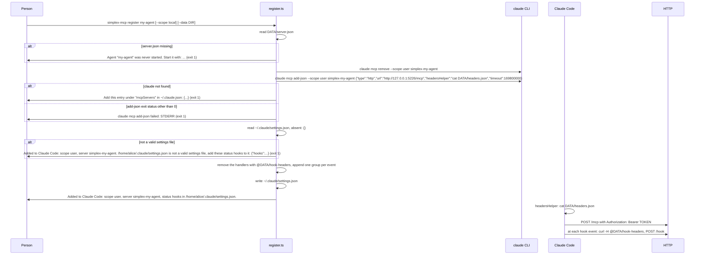
```mermaid
sequenceDiagram
  participant P as Person
  participant R as register.ts
  participant L as claude CLI
  participant CC as Claude Code
  participant H as HTTP
  P->>R: simplex-mcp register my-agent [--scope local] [--data DIR]
  R->>R: read DATA/server.json
  alt server.json missing
    R->>P: Agent "my-agent" was never started. Start it with: ... (exit 1)
  end
  R->>L: claude mcp remove --scope user simplex-my-agent
  R->>L: claude mcp add-json --scope user simplex-my-agent {"type":"http","url":"http://127.0.0.1:5226/mcp","headersHelper":"cat DATA/headers.json","timeout":169800000}
  alt claude not found
    R->>P: Add this entry under "mcpServers" in ~/.claude.json: {...} (exit 1)
  else add-json exit status other than 0
    R->>P: claude mcp add-json failed: STDERR (exit 1)
  end
  R->>R: read ~/.claude/settings.json, absent: {}
  alt not a valid settings file
    R->>P: Added to Claude Code: scope user, server simplex-my-agent. /home/alice/.claude/settings.json is not a valid settings file, add these status hooks to it: {"hooks":...} (exit 1)
  end
  R->>R: remove the handlers with @DATA/hook-headers, append one group per event
  R->>R: write ~/.claude/settings.json
  R->>P: Added to Claude Code: scope user, server simplex-my-agent, status hooks in /home/alice/.claude/settings.json.
  CC->>CC: headersHelper: cat DATA/headers.json
  CC->>H: POST /mcp with Authorization: Bearer TOKEN
  CC->>H: at each hook event: curl -H @DATA/hook-headers, POST /hook
```

Notes:

- `simplex-mcp` ignores the exit status of `claude mcp remove` and stops at that step only when the `claude` binary is missing ([register.ts:41-42](../src/register.ts#L41-L42)).
- On Windows, a missing `claude` is run again through `cmd.exe`, with each argument quoted for it ([register.ts:133-148](../src/register.ts#L133-L148)).
- `timeout` is `(expireHours + 24) × 3600000 + 600000` ms from `server.json` ([register.ts:59](../src/register.ts#L59)).
- With `--scope local`, the project folder in the manual entry and in the path of the settings file is the git repository root, the main repository of a worktree, or the current folder outside a repository ([register.ts:70-71](../src/register.ts#L70-L71), [:107-131](../src/register.ts#L107-L131)).
- The settings file is `CONFIG/settings.json`, with CONFIG `CLAUDE_CONFIG_DIR`, or `~/.claude` when it is unset or empty; with `--scope local`, `PROJECT/.claude/settings.local.json` ([register.ts:35](../src/register.ts#L35), [:68-72](../src/register.ts#L68-L72)).
- The hooks are written after `claude mcp add-json` succeeds; at a repeated `register`, the handlers of the same data folder are replaced, so a changed port is applied ([register.ts:46-50](../src/register.ts#L46-L50), [:87-101](../src/register.ts#L87-L101)).
- The hooks and the merge rules are listed in [API 3.2](api.md#32-register), and the use of their events in [33](#33-claude-code-activity-in-the-status-message).

Source: [cli.ts:140-155](../src/cli.ts#L140-L155), [:243](../src/cli.ts#L243), [register.ts:35-105](../src/register.ts#L35-L105), [files.ts:140-142](../src/files.ts#L140-L142), [:153-156](../src/files.ts#L153-L156).

---

## 3. `connect` with approval

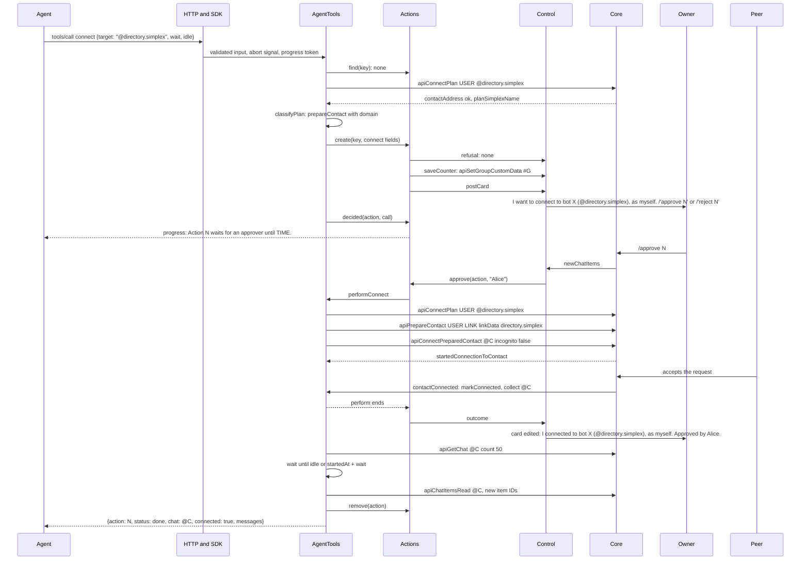
```mermaid
sequenceDiagram
  participant A as Agent
  participant H as HTTP and SDK
  participant T as AgentTools
  participant X as Actions
  participant K as Control
  participant C as Core
  participant O as Owner
  participant D as Peer
  A->>H: tools/call connect {target: "@directory.simplex", wait, idle}
  H->>T: validated input, abort signal, progress token
  T->>X: find(key): none
  T->>C: apiConnectPlan USER @directory.simplex
  C-->>T: contactAddress ok, planSimplexName
  T->>T: classifyPlan: prepareContact with domain
  T->>X: create(key, connect fields)
  X->>K: refusal: none
  X->>K: saveCounter: apiSetGroupCustomData #35;G
  X->>K: postCard
  K->>O: I want to connect to bot X (@directory.simplex), as myself. /'approve N' or /'reject N'
  T->>X: decided(action, call)
  X-->>A: progress: Action N waits for an approver until TIME.
  O->>C: /approve N
  C->>K: newChatItems
  K->>X: approve(action, "Alice")
  X->>T: performConnect
  T->>C: apiConnectPlan USER @directory.simplex
  T->>C: apiPrepareContact USER LINK linkData directory.simplex
  T->>C: apiConnectPreparedContact @C incognito false
  C-->>T: startedConnectionToContact
  D->>C: accepts the request
  C->>T: contactConnected: markConnected, collect @C
  T-->>X: perform ends
  X->>K: outcome
  K->>O: card edited: I connected to bot X (@directory.simplex), as myself. Approved by Alice.
  T->>C: apiGetChat @C count 50
  T->>T: wait until idle or startedAt + wait
  T->>C: apiChatItemsRead @C, new item IDs
  T->>X: remove(action)
  T-->>A: {action: N, status: done, chat: @C, connected: true, messages}
```

Notes:

- The plan is read again in the perform step ([tools.ts:834](../src/tools.ts#L834)).
- Join methods per plan ([tools.ts:865-893](../src/tools.ts#L865-L893), [:1445-1508](../src/tools.ts#L1445-L1508)):

| Plan | Methods |
|---|---|
| known prepared contact or group | `apiConnectPreparedContact(C, incognito, message)` `apiConnectPreparedGroup(G, incognito, message)` |
| channel link (`direct` false, with link data) | `apiPrepareGroup(USER, LINK, false, linkData, domain)` `apiConnectPreparedGroup(G, incognito)` |
| contact address with link data, and a SimpleX name or a message | `apiPrepareContact(USER, LINK, linkData, domain)` `apiConnectPreparedContact(C, incognito, message)`, or `apiConnectPreparedGroup` for a business |
| `contactViaAddress` | `apiConnectContactViaAddress(USER, incognito, CONTACT_ID)` |
| other links | `apiConnectPreparedLink(USER, incognito, LINK)` |

- After a failed prepared connect, the server deletes the prepared chat without notifying ([tools.ts:895-902](../src/tools.ts#L895-L902)).
- The connection is matched by `contactConnected` or `userJoinedGroup`: by contact or group ID, or by the pending connection ID ([tools.ts:674-682](../src/tools.ts#L674-L682), [:904-909](../src/tools.ts#L904-L909)). In the plugin, the pending connection ID is also recorded in the session group's custom data. When the connection completes after the call returned, within a day of the record, its chat becomes the session's ([tools.ts:845](../src/tools.ts#L845), [hub.ts:162-167](../src/hub.ts#L162-L167), [:505-506](../src/hub.ts#L505-L506)).
- In the perform step the server waits for the other side until `startedAt + wait`, at most until `created + 23 h 50 min`, and then reports `connected: false` ([tools.ts:159](../src/tools.ts#L159), [:833](../src/tools.ts#L833), [:859-862](../src/tools.ts#L859-L862)).
- Without `message`, the idle time is counted from the connection; with `message`, from the first reply ([tools.ts:916](../src/tools.ts#L916), [messages.ts:327-335](../src/messages.ts#L327-L335)).
- For a target the agent is connected to, the result is `status: known` with its chat fields, and no action is created ([tools.ts:756](../src/tools.ts#L756)). In the plugin, the chat becomes the session's when it has no owner ([tools.ts:769-774](../src/tools.ts#L769-L774)).
- Exact progress texts: `Action N waits for an approver until TIME.`, then `Action N waits for the connection until TIME.`, then `K messages in CHAT; waiting until TIME.` ([actions.ts:414-425](../src/actions.ts#L414-L425), [tools.ts:802](../src/tools.ts#L802)).

Source: [tools.ts:751-816](../src/tools.ts#L751-L816), [:830-919](../src/tools.ts#L830-L919), [actions.ts:180-215](../src/actions.ts#L180-L215), [:249-267](../src/actions.ts#L249-L267), [control.ts:186-197](../src/control.ts#L186-L197).

---

## 4. `send` with responses

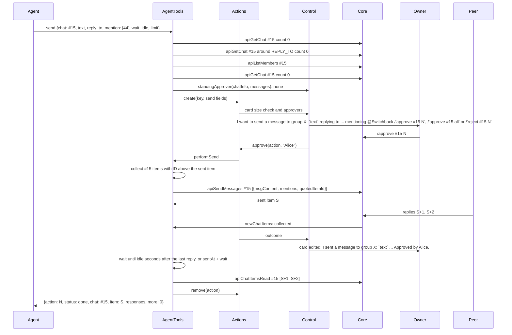
```mermaid
sequenceDiagram
  participant A as Agent
  participant T as AgentTools
  participant X as Actions
  participant K as Control
  participant C as Core
  participant O as Owner
  participant D as Peer
  A->>T: send {chat: #35;15, text, reply_to, mention: [44], wait, idle, limit}
  T->>C: apiGetChat #35;15 count 0
  T->>C: apiGetChat #35;15 around REPLY_TO count 0
  T->>C: apiListMembers #35;15
  T->>C: apiGetChat #35;15 count 0
  T->>K: standingApprover(chatInfo, messages): none
  T->>X: create(key, send fields)
  X->>K: card size check and approvers
  K->>O: I want to send a message to group X: `text` replying to ... mentioning @Switchback /'approve #35;15 N', /'approve #35;15 all' or /'reject #35;15 N'
  O->>C: /approve #35;15 N
  K->>X: approve(action, "Alice")
  X->>T: performSend
  T->>T: collect #35;15 items with ID above the sent item
  T->>C: apiSendMessages #35;15 [{msgContent, mentions, quotedItemId}]
  C-->>T: sent item S
  D->>C: replies S+1, S+2
  C->>T: newChatItems: collected
  X->>K: outcome
  K->>O: card edited: I sent a message to group X: `text` ... Approved by Alice.
  T->>T: wait until idle seconds after the last reply, or sentAt + wait
  T->>C: apiChatItemsRead #35;15 [S+1, S+2]
  T->>X: remove(action)
  T-->>A: {action: N, status: done, chat: #35;15, item: S, responses, more: 0}
```

Notes:

- Checks before the action: `text` or `file`, the chat connected, role `observer` or `relay` refused, `reply_to` item a message, mentioned members present and the chat a group, and the message length with its quote ([tools.ts:926-937](../src/tools.ts#L926-L937)).
- The server starts collecting before the send and, after it, drops items with IDs up to the sent item ([tools.ts:993](../src/tools.ts#L993), [:1007-1009](../src/tools.ts#L1007-L1009)).
- Mentioned names missing from the text are prefixed as `@name` ([tools.ts:1630-1633](../src/tools.ts#L1630-L1633)).
- While a collected message is live, the server waits for its final update; live items are left out of `responses` and counted in `more` ([messages.ts:327-335](../src/messages.ts#L327-L335), [tools.ts:977](../src/tools.ts#L977), [:985](../src/tools.ts#L985)).
- At most 100 replies are kept per action; later ones are counted as overflow ([messages.ts:10](../src/messages.ts#L10), [:109-110](../src/messages.ts#L109-L110)).
- With `live: true`, the call is never attached to an action, and after the role check its text is shown in the status message of the chat ([tools.ts:924](../src/tools.ts#L924), [:933](../src/tools.ts#L933), [32](#32-status-message-while-the-agent-works)).

Source: [tools.ts:921-1015](../src/tools.ts#L921-L1015), [messages.ts:99-114](../src/messages.ts#L99-L114), [:327-335](../src/messages.ts#L327-L335), [control.ts:715-721](../src/control.ts#L715-L721).

---

## 5. `receive` with `wait`

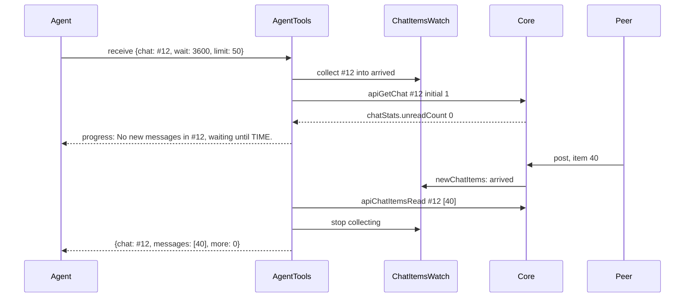
```mermaid
sequenceDiagram
  participant A as Agent
  participant T as AgentTools
  participant W as ChatItemsWatch
  participant C as Core
  participant D as Peer
  A->>T: receive {chat: #35;12, wait: 3600, limit: 50}
  T->>W: collect #35;12 into arrived
  T->>C: apiGetChat #35;12 initial 1
  C-->>T: chatStats.unreadCount 0
  T-->>A: progress: No new messages in #35;12, waiting until TIME.
  D->>C: post, item 40
  C->>W: newChatItems: arrived
  T->>C: apiChatItemsRead #35;12 [40]
  T->>W: stop collecting
  T-->>A: {chat: #35;12, messages: [40], more: 0}
```

Notes:

- With unread items the server reads `around` the first unread item, `count` 0, then pages of `after` the last item, `count` 100, until it holds `limit + 1` unread, non-live messages or a page is short ([messages.ts:289-303](../src/messages.ts#L289-L303)).
- Unread items other than messages in the read pages are marked read with the returned messages ([tools.ts:1306](../src/tools.ts#L1306), [:1324](../src/tools.ts#L1324)).
- `more`: the arrived messages not returned, the overflow and the unread items not read ([tools.ts:1327](../src/tools.ts#L1327)).
- Items received while the pages are read are returned once ([tools.ts:1305-1308](../src/tools.ts#L1305-L1308)).
- Exact progress text: `No new messages in CHAT; waiting until TIME.` ([tools.ts:1313](../src/tools.ts#L1313)).
- Before the wait, the status message of the chat is deleted; when messages are returned in a chat eligible for a status message, a status message is started ([tools.ts:1310-1311](../src/tools.ts#L1310-L1311), [:1326](../src/tools.ts#L1326), [32](#32-status-message-while-the-agent-works)).

Source: [tools.ts:1294-1331](../src/tools.ts#L1294-L1331), [messages.ts:289-335](../src/messages.ts#L289-L335).

---

## 6. `send` under a standing approval, and `/revoke`

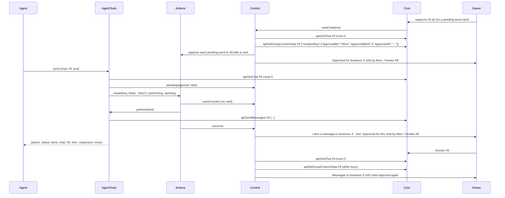
```mermaid
sequenceDiagram
  participant A as Agent
  participant T as AgentTools
  participant X as Actions
  participant K as Control
  participant C as Core
  participant O as Owner
  O->>C: /approve #35;9 all (on a pending send card)
  C->>K: newChatItems
  K->>C: apiGetChat #35;9 count 0
  K->>C: apiSetGroupCustomData #35;9 {"simplexMcp":{"approvedBy":"Alice","approvedById":3,"approvedAt":"..."}}
  K->>X: approve each pending send to #35;9 with a card
  K->>O: Approved for business X (#35;9) by Alice. /'revoke #35;9'
  A->>T: send {chat: #35;9, text}
  T->>C: apiGetChat #35;9 count 0
  T->>K: standingApprover: Alice
  T->>X: create(key, fields, "Alice"): performing, standing
  X->>K: saveCounter (no card)
  X->>T: performSend
  T->>C: apiSendMessages #35;9 [...]
  X->>K: outcome
  K->>O: I sent a message to business X: `text` Approved for this chat by Alice. /'revoke #35;9'
  T-->>A: {action, status: done, chat: #35;9, item, responses, more}
  O->>C: /revoke #35;9
  K->>C: apiGetChat #35;9 count 0
  K->>C: apiSetGroupCustomData #35;9 {other keys}
  K->>O: Messages to business X (#35;9) need approval again.
```

Notes:

- The approval is used in mode `requests` while member `approvedById` is an approver ([control.ts:167-170](../src/control.ts#L167-L170)).
- For sends that were pending at `/approve CHAT all`, the card ends with the plain `Approved by Alice.` ([control.ts:681](../src/control.ts#L681), [:690](../src/control.ts#L690)).
- `connect` and `leave` actions are created without the standing approver, so they stay pending ([tools.ts:762](../src/tools.ts#L762), [:1111](../src/tools.ts#L1111)).
- `/receive CHAT N all` and `/receive CHAT off` work the same way for downloads, with the key `simplexMcpFiles`, except that download N alone is performed, and the other pending downloads of the chat stay pending ([control.ts:27-30](../src/control.ts#L27-L30), [:301-303](../src/control.ts#L301-L303), [tools.ts:1149](../src/tools.ts#L1149)).
- After `/revoke #9`, the status message of #9 is deleted at its next tick, and a `send` with `live: true` to #9 is refused ([status.ts:128-135](../src/status.ts#L128-L135), [tools.ts:960](../src/tools.ts#L960), [32](#32-status-message-while-the-agent-works)).

Source: [control.ts:293-313](../src/control.ts#L293-L313), [:417-419](../src/control.ts#L417-L419), [tools.ts:941-943](../src/tools.ts#L941-L943), [actions.ts:180-215](../src/actions.ts#L180-L215), [:331-349](../src/actions.ts#L331-L349).

---

## 7. `leave`

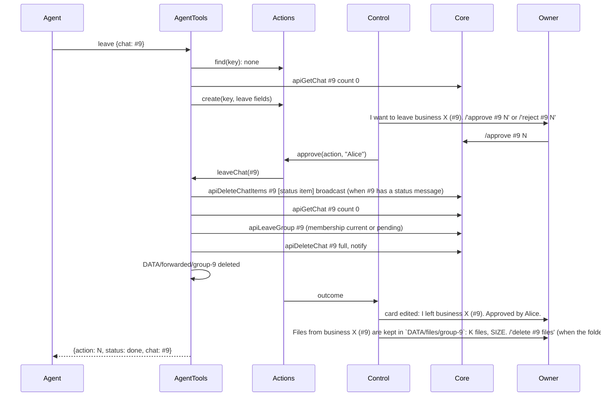
```mermaid
sequenceDiagram
  participant A as Agent
  participant T as AgentTools
  participant X as Actions
  participant K as Control
  participant C as Core
  participant O as Owner
  A->>T: leave {chat: #35;9}
  T->>X: find(key): none
  T->>C: apiGetChat #35;9 count 0
  T->>X: create(key, leave fields)
  K->>O: I want to leave business X (#35;9). /'approve #35;9 N' or /'reject #35;9 N'
  O->>C: /approve #35;9 N
  K->>X: approve(action, "Alice")
  X->>T: leaveChat(#35;9)
  T->>C: apiDeleteChatItems #35;9 [status item] broadcast (when #35;9 has a status message)
  T->>C: apiGetChat #35;9 count 0
  T->>C: apiLeaveGroup #35;9 (membership current or pending)
  T->>C: apiDeleteChat #35;9 full, notify
  T->>T: DATA/forwarded/group-9 deleted
  X->>K: outcome
  K->>O: card edited: I left business X (#35;9). Approved by Alice.
  K->>O: Files from business X (#35;9) are kept in `DATA/files/group-9`: K files, SIZE. /'delete #35;9 files' (when the folder has files)
  T-->>A: {action: N, status: done, chat: #35;9}
```

Notes:

- For a contact, the card text is `I want to delete KIND NAME (@N).`, and the perform step calls `apiDeleteChat` for the contact, full, with notify ([control.ts:722-725](../src/control.ts#L722-L725), [tools.ts:1122](../src/tools.ts#L1122)).
- The delete notifies, so the core notifies the contact or the members ([tools.ts:1122](../src/tools.ts#L1122), [:1126](../src/tools.ts#L1126)).
- The server looks for an attached action before it reads the chat, so a repeated call after the deletion is attached to the done action ([tools.ts:1106-1108](../src/tools.ts#L1106-L1108)).
- From before the status deletion until the chat is deleted, #9 is marked as being left: a `send` with `live: true` to #9 is refused with `No chat #9. list shows the agent's chats.` until the membership is marked left in `apiLeaveGroup`, and after that with `The agent is not connected to #9 and can't post; list shows connected: false.`; a status started meanwhile ends at its first tick without a post ([tools.ts:1118-1130](../src/tools.ts#L1118-L1130), [:931-932](../src/tools.ts#L931-L932), [:956](../src/tools.ts#L956), [:1588](../src/tools.ts#L1588)).

Source: [tools.ts:1104-1132](../src/tools.ts#L1104-L1132), [control.ts:190-197](../src/control.ts#L190-L197), [:352-355](../src/control.ts#L352-L355).

---

## 8. Mode `host`

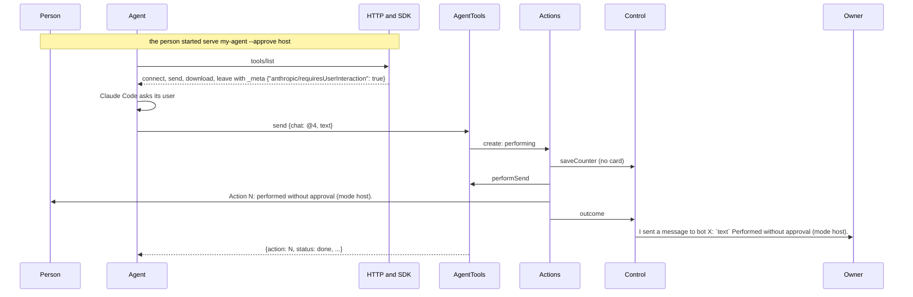
```mermaid
sequenceDiagram
  participant P as Person
  participant A as Agent
  participant H as HTTP and SDK
  participant T as AgentTools
  participant X as Actions
  participant K as Control
  participant O as Owner
  Note over P,H: the person started serve my-agent --approve host
  A->>H: tools/list
  H-->>A: connect, send, download, leave with _meta {"anthropic/requiresUserInteraction": true}
  A->>A: Claude Code asks its user
  A->>T: send {chat: @4, text}
  T->>X: create: performing
  X->>K: saveCounter (no card)
  X->>T: performSend
  X->>P: Action N: performed without approval (mode host).
  X->>K: outcome
  K->>O: I sent a message to bot X: `text` Performed without approval (mode host).
  T-->>A: {action: N, status: done, ...}
```

Notes:

- New actions are still refused unless the control chat has an approver ([control.ts:156-160](../src/control.ts#L156-L160)).
- In mode `host`, `standingApprover` returns `undefined`, so standing approvals are ignored by `send`, `download`, `list` and `/list`, and `/approve CHAT all` stores nothing; downloads get no card, so `/receive CHAT N all` has no card to act on ([control.ts:169](../src/control.ts#L169), [:259](../src/control.ts#L259)).
- A download in mode `host` is received without the approval of unknown servers, and it gets no card and no outcome post ([tools.ts:627](../src/tools.ts#L627), [:1203](../src/tools.ts#L1203), [control.ts:601-603](../src/control.ts#L601-L603)).
- The kept-files message also follows a done `leave` in mode `host` ([control.ts:195-196](../src/control.ts#L195-L196)).

Source: [tools.ts:554-556](../src/tools.ts#L554-L556), [actions.ts:193](../src/actions.ts#L193), [:347](../src/actions.ts#L347), [control.ts:190-197](../src/control.ts#L190-L197), [:681](../src/control.ts#L681).

---

## 9. Expiry

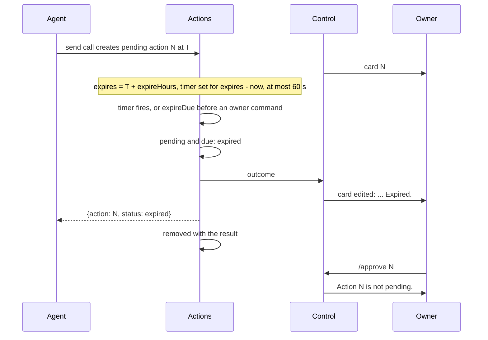
```mermaid
sequenceDiagram
  participant A as Agent
  participant X as Actions
  participant K as Control
  participant O as Owner
  A->>X: send call creates pending action N at T
  K->>O: card N
  Note over X: expires = T + expireHours, timer set for expires - now, at most 60 s
  X->>X: timer fires, or expireDue before an owner command
  X->>X: pending and due: expired
  X->>K: outcome
  K->>O: card edited: ... Expired.
  X-->>A: {action: N, status: expired}
  X->>X: removed with the result
  O->>K: /approve N
  K->>O: Action N is not pending.
```

Notes:

- A decided action with an open count of 0 is removed at its timer, at a later decision or at the close of its last call, once its expiry time has passed ([actions.ts:314-316](../src/actions.ts#L314-L316)). A pending action of `serve` that expires without a call stays until the next owner command, or until its check 60 s later. A repeated call before then attaches to it, and its status is `expired`, as in 0.2 ([:307-309](../src/actions.ts#L307-L309), [:243-247](../src/actions.ts#L243-L247)).
- A timer waits at most 60 s, on the monotonic clock. When it fires before the expiry time, it is set again. So an action whose expiry time passes while the computer sleeps expires within 60 s after the computer wakes ([actions.ts:11](../src/actions.ts#L11), [:305](../src/actions.ts#L305)).
- Expiry times are listed in the `/pending` reply ([control.ts:752-754](../src/control.ts#L752-L754)).
- The server ends the connect wait at `created + 23 h 50 min`, within the 24 hours in which a message can be edited ([tools.ts:159](../src/tools.ts#L159), [:833](../src/tools.ts#L833)).

Source: [actions.ts:190](../src/actions.ts#L190), [:243-247](../src/actions.ts#L243-L247), [:297-316](../src/actions.ts#L297-L316), [control.ts:247](../src/control.ts#L247), [:277](../src/control.ts#L277).

---

## 10. A lost call and its re-attachment

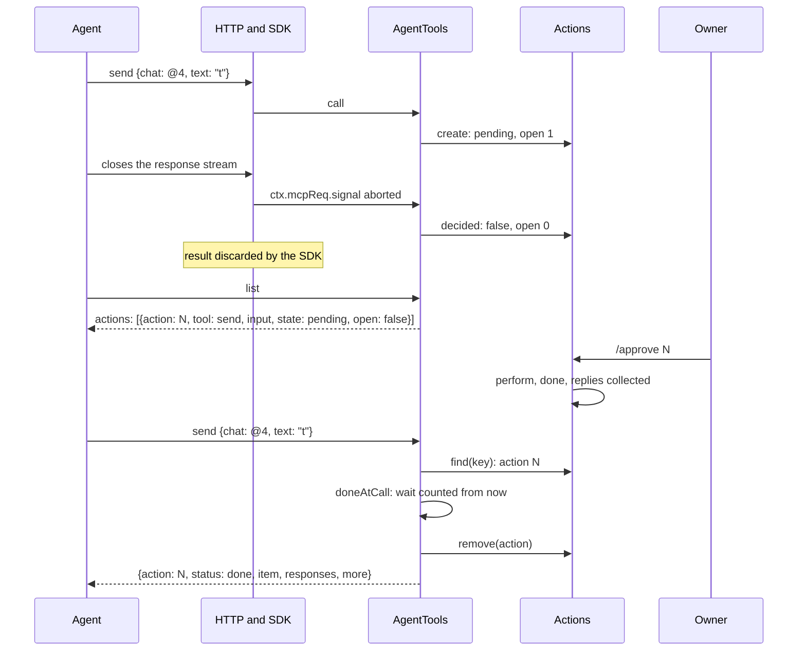
```mermaid
sequenceDiagram
  participant A as Agent
  participant H as HTTP and SDK
  participant T as AgentTools
  participant X as Actions
  participant O as Owner
  A->>H: send {chat: @4, text: "t"}
  H->>T: call
  T->>X: create: pending, open 1
  A->>H: closes the response stream
  H->>T: ctx.mcpReq.signal aborted
  T->>X: decided: false, open 0
  Note over H: result discarded by the SDK
  A->>T: list
  T-->>A: actions: [{action: N, tool: send, input, state: pending, open: false}]
  O->>X: /approve N
  X->>X: perform, done, replies collected
  A->>T: send {chat: @4, text: "t"}
  T->>X: find(key): action N
  T->>T: doneAtCall: wait counted from now
  T->>X: remove(action)
  T-->>A: {action: N, status: done, item, responses, more}
```

Notes:

- The key is made of the session number, `undefined` for `serve`, the tool name and the action fields ([tools.ts:752](../src/tools.ts#L752), [:923](../src/tools.ts#L923), [:1106](../src/tools.ts#L1106), [:1136](../src/tools.ts#L1136), [:1773-1775](../src/tools.ts#L1773-L1775)):
  - `connect`: `target`, `incognito`, `message`
  - `send`: `chat`, `text`, `file`, `as`, `reply_to`, `mention`
  - `download`: `chat`, `item`
  - `leave`: `chat`
- The `wait`, `idle` and `limit` of the attaching call are used ([tools.ts:971](../src/tools.ts#L971)).
- For a call aborted before `create`, the server returns before it creates an action ([tools.ts:761](../src/tools.ts#L761), [:942](../src/tools.ts#L942), [:1110](../src/tools.ts#L1110), [:1150](../src/tools.ts#L1150)).
- Abort path in the SDK: on `res` close the web request is aborted ([node index.cjs:299-303](../node_modules/@modelcontextprotocol/node/dist/index.cjs#L299-L303)); the per-request transport is closed ([server index.cjs:86-90](../node_modules/@modelcontextprotocol/server/dist/index.cjs#L86-L90)); the handler signal is aborted ([src-BhnGYybN.cjs:6425](../node_modules/@modelcontextprotocol/server/dist/src-BhnGYybN.cjs#L6425)).

Source: [tools.ts:780-792](../src/tools.ts#L780-L792), [:968-988](../src/tools.ts#L968-L988), [:1339](../src/tools.ts#L1339), [actions.ts:249-261](../src/actions.ts#L249-L261), [messages.ts:311-325](../src/messages.ts#L311-L325).

---

## 11. Shutdown with pending actions

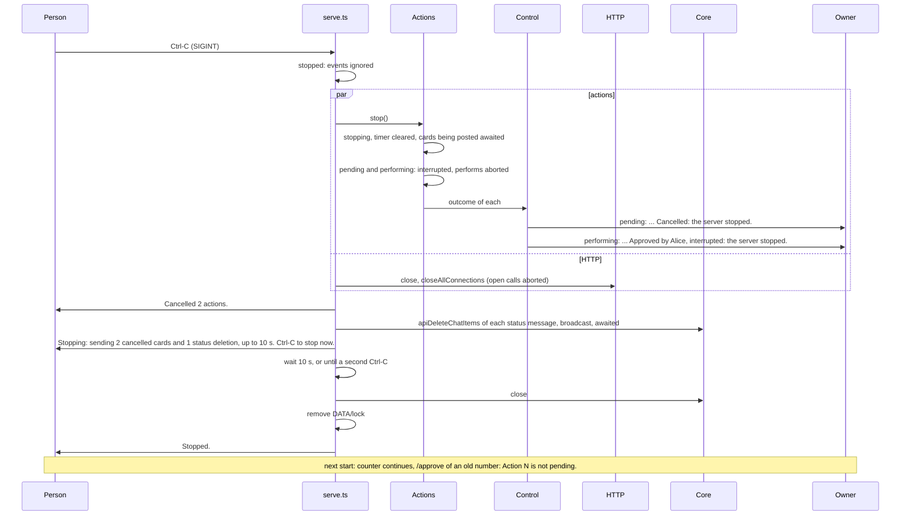
```mermaid
sequenceDiagram
  participant P as Person
  participant S as serve.ts
  participant X as Actions
  participant K as Control
  participant H as HTTP
  participant C as Core
  participant O as Owner
  P->>S: Ctrl-C (SIGINT)
  S->>S: stopped: events ignored
  par actions
    S->>X: stop()
    X->>X: stopping, timer cleared, cards being posted awaited
    X->>X: pending and performing: interrupted, performs aborted
    X->>K: outcome of each
    K->>O: pending: ... Cancelled: the server stopped.
    K->>O: performing: ... Approved by Alice, interrupted: the server stopped.
  and HTTP
    S->>H: close, closeAllConnections (open calls aborted)
  end
  S->>P: Cancelled 2 actions.
  S->>C: apiDeleteChatItems of each status message, broadcast, awaited
  S->>P: Stopping: sending 2 cancelled cards and 1 status deletion, up to 10 s. Ctrl-C to stop now.
  S->>S: wait 10 s, or until a second Ctrl-C
  S->>C: close
  S->>S: remove DATA/lock
  S->>P: Stopped.
  Note over P,O: next start: counter continues, /approve of an old number: Action N is not pending.
```

Notes:

- The interrupted card line is `DECIDER; interrupted: the server stopped.` ([control.ts:688](../src/control.ts#L688)).
- An action of mode `host` or of a standing approval whose counter is being written at the stop is set to `pending` and cancelled without a perform ([actions.ts:331-336](../src/actions.ts#L331-L336)).
- After a crash, the cards of that run are left with their commands; `/approve` of their numbers gets the reply `Action N is not pending.` ([control.ts:277](../src/control.ts#L277)).
- The stop signal of the performs is aborted after the actions are marked interrupted: a `connect` waiting for its connection ends, and an interrupted perform logs no line ([actions.ts:290-291](../src/actions.ts#L290-L291), [:346](../src/actions.ts#L346), [tools.ts:859-860](../src/tools.ts#L859-L860)).
- The status messages are ended after the HTTP server is closed and `Actions.stop` returns; later starts are ignored, and notes are refused ([serve.ts:153-156](../src/serve.ts#L153-L156), [status.ts:88-94](../src/status.ts#L88-L94)).
- The wait applies only when cards were edited or posted at the stop, a `download` without a card excluded, or status messages had a render, and `--stop-wait` is above 0. Cards are counted only while the control chat is not lost ([serve.ts:156-157](../src/serve.ts#L156-L157), [:169-185](../src/serve.ts#L169-L185)).

Source: [serve.ts:49-65](../src/serve.ts#L49-L65), [:150-161](../src/serve.ts#L150-L161), [:169-185](../src/serve.ts#L169-L185), [status.ts:88-94](../src/status.ts#L88-L94), [actions.ts:284-316](../src/actions.ts#L284-L316), [http.ts:57-61](../src/http.ts#L57-L61), [control.ts:679-698](../src/control.ts#L679-L698).

---

## 12. `--owners` setup

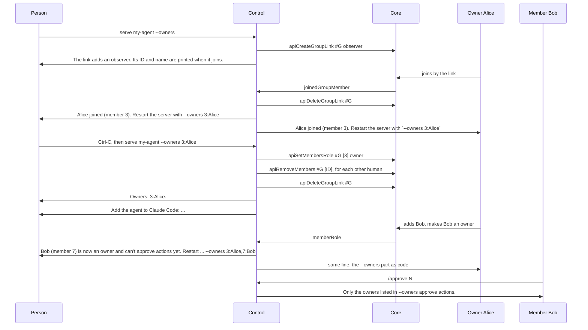
```mermaid
sequenceDiagram
  participant P as Person
  participant K as Control
  participant C as Core
  participant O as Owner Alice
  participant B as Member Bob
  P->>K: serve my-agent --owners
  K->>C: apiCreateGroupLink #35;G observer
  K->>P: The link adds an observer. Its ID and name are printed when it joins.
  O->>C: joins by the link
  C->>K: joinedGroupMember
  K->>C: apiDeleteGroupLink #35;G
  K->>P: Alice joined (member 3). Restart the server with --owners 3:Alice
  K->>O: Alice joined (member 3). Restart the server with `--owners 3:Alice`
  P->>K: Ctrl-C, then serve my-agent --owners 3:Alice
  K->>C: apiSetMembersRole #35;G [3] owner
  K->>C: apiRemoveMembers #35;G [ID], for each other human
  K->>C: apiDeleteGroupLink #35;G
  K->>P: Owners: 3:Alice.
  K->>P: Add the agent to Claude Code: ...
  O->>C: adds Bob, makes Bob an owner
  C->>K: memberRole
  K->>P: Bob (member 7) is now an owner and can't approve actions yet. Restart ... --owners 3:Alice,7:Bob
  K->>O: same line, the --owners part as code
  B->>K: /approve N
  K->>B: Only the owners listed in --owners approve actions.
```

Notes:

- Until the restart with a list, new actions are refused: `The agent has no approving owner. ...` ([control.ts:158-160](../src/control.ts#L158-L160)).
- An entry must match a human by member ID and display name, folded to one line as the restart line prints it, or the server exits with code 2 ([control.ts:434-438](../src/control.ts#L434-L438), [:893-895](../src/control.ts#L893-L895)).
- With `--reset-owners`, the server deletes the control chat for all members and creates a new one with the same counter; the CLI refuses the option with an `--owners` list ([control.ts:642-654](../src/control.ts#L642-L654), [serve.ts:197](../src/serve.ts#L197), [cli.ts:131-133](../src/cli.ts#L131-L133)).
- When a listed owner leaves and none remains: `... is no longer an owner. No owners remain: restart the server with --reset-owners --owners` ([control.ts:473-478](../src/control.ts#L473-L478)).

Source: [control.ts:427-449](../src/control.ts#L427-L449), [:460-479](../src/control.ts#L460-L479), [:486-496](../src/control.ts#L486-L496), [:893-919](../src/control.ts#L893-L919).

---

## 13. `download` with approval

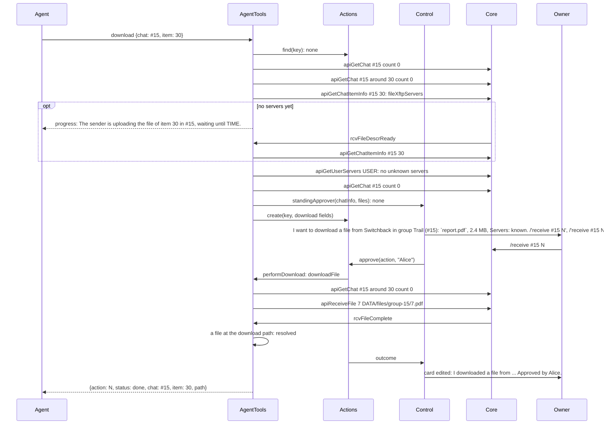
```mermaid
sequenceDiagram
  participant A as Agent
  participant T as AgentTools
  participant X as Actions
  participant K as Control
  participant C as Core
  participant O as Owner
  A->>T: download {chat: #35;15, item: 30}
  T->>X: find(key): none
  T->>C: apiGetChat #35;15 count 0
  T->>C: apiGetChat #35;15 around 30 count 0
  T->>C: apiGetChatItemInfo #35;15 30: fileXftpServers
  opt no servers yet
    T-->>A: progress: The sender is uploading the file of item 30 in #35;15, waiting until TIME.
    C->>T: rcvFileDescrReady
    T->>C: apiGetChatItemInfo #35;15 30
  end
  T->>C: apiGetUserServers USER: no unknown servers
  T->>C: apiGetChat #35;15 count 0
  T->>K: standingApprover(chatInfo, files): none
  T->>X: create(key, download fields)
  K->>O: I want to download a file from Switchback in group Trail (#35;15): `report.pdf`, 2.4 MB, Servers: known. /'receive #35;15 N', /'receive #35;15 N all', /'forward #35;15 N' or /'reject #35;15 N'
  O->>C: /receive #35;15 N
  K->>X: approve(action, "Alice")
  X->>T: performDownload: downloadFile
  T->>C: apiGetChat #35;15 around 30 count 0
  T->>C: apiReceiveFile 7 DATA/files/group-15/7.pdf
  C->>T: rcvFileComplete
  T->>T: a file at the download path: resolved
  X->>K: outcome
  K->>O: card edited: I downloaded a file from ... Approved by Alice.
  T-->>A: {action: N, status: done, chat: #35;15, item: 30, path}
```

Notes:

- A check every 60 s reads the item: a deleted message or chat fails the download; 30 minutes without a rise of `rcvProgress` fail and cancel it ([tools.ts:1208-1235](../src/tools.ts#L1208-L1235)).
- A download still running `wait` seconds after the perform starts returns `status: performing`; the same call again attaches to the action ([tools.ts:1181-1184](../src/tools.ts#L1181-L1184)).
- `/approve #15 N` on a download card gets the reply `Action N is a download: ...` with the card's command line ([control.ts:284](../src/control.ts#L284)).
- A file on unknown servers gets a card that names their hosts and leaves out `/'receive CHAT N all'` ([control.ts:726-731](../src/control.ts#L726-L731), [:745-748](../src/control.ts#L745-L748), [:804-808](../src/control.ts#L804-L808)). Only such a card approves the relays; the core checks the complete description of every other download, which fails at the acceptance, or at the next check when the description completes later ([tools.ts:627](../src/tools.ts#L627), [:1216](../src/tools.ts#L1216)).
- The card of an image or video shows the sender's preview ([control.ts:546-566](../src/control.ts#L546-L566)).
- In a plugin session group, the core refuses a card that the group's preferences do not allow ([control.ts:521-544](../src/control.ts#L521-L544), [:756-760](../src/control.ts#L756-L760), [actions.ts:338-349](../src/actions.ts#L338-L349)):
  - While the group's preference does not allow files and media, a card with a preview is posted as text and edited as text.
  - A card refused by another preference before the decision is replaced by `Action N: ` and the text that names the preference. The action then fails.
  - The outcome card of an action performed in mode `host` or under a standing approval is posted after the decision. When it is refused, it is replaced by `Action N was performed; its card was not posted: ` or `Action N failed; its card was not posted: `, and that text.
  - A refused edit of a card is replaced by `Action N OUTCOME; its card was not updated: ` and that text. OUTCOME is `was performed`, `failed`, `was rejected`, `expired` or `ended`.
  - After the decision, the action is not changed by a refused card.
- A file the core receives without a request, a short voice message, also in a member chat of a group, is moved into the chat's folder at `rcvFileComplete`; one whose transfer started before a restart, only when it has its full size. Its message then shows it as `offered`, and `download` returns its path after the approval ([tools.ts:633-655](../src/tools.ts#L633-L655), [:1255-1264](../src/tools.ts#L1255-L1264), [messages.ts:194-208](../src/messages.ts#L194-L208)).

Source: [tools.ts:1134-1276](../src/tools.ts#L1134-L1276), [control.ts:700-750](../src/control.ts#L700-L750), [tools.ts:684-711](../src/tools.ts#L684-L711).

---

## 14. `/forward`

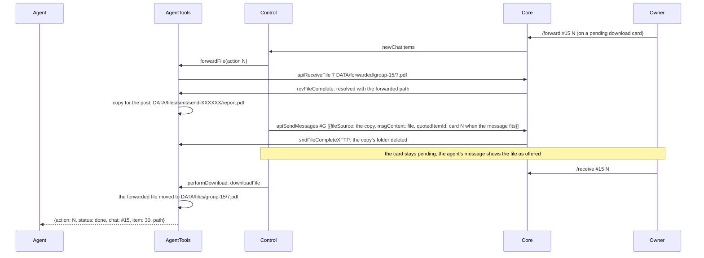
```mermaid
sequenceDiagram
  participant A as Agent
  participant T as AgentTools
  participant K as Control
  participant C as Core
  participant O as Owner
  O->>C: /forward #35;15 N (on a pending download card)
  C->>K: newChatItems
  K->>T: forwardFile(action N)
  T->>C: apiReceiveFile 7 DATA/forwarded/group-15/7.pdf
  C->>T: rcvFileComplete: resolved with the forwarded path
  T->>T: copy for the post: DATA/files/sent/send-XXXXXX/report.pdf
  K->>C: apiSendMessages #35;G [{fileSource: the copy, msgContent: file, quotedItemId: card N when the message fits}]
  C->>T: sndFileCompleteXFTP: the copy's folder deleted
  Note over K,O: the card stays pending#59; the agent's message shows the file as offered
  O->>C: /receive #35;15 N
  K->>T: performDownload: downloadFile
  T->>T: the forwarded file moved to DATA/files/group-15/7.pdf
  T-->>A: {action: N, status: done, chat: #35;15, item: 30, path}
```

Notes:

- `/forward` gets no reply; a download or post that fails is posted as ``Action N: the file was not received: `ERROR`.``, and a failed post deletes the copy ([control.ts:315-334](../src/control.ts#L315-L334)). In a plugin session group, the core may refuse the post with `feature not allowed NAME`, as for `Files and media` or `Voice messages`. Claude then posts `Action N: NAME are off in the group of this session; its owners can turn them on in the group's preferences.`
- The copy is named by the name the sender gave ([tools.ts:1067-1071](../src/tools.ts#L1067-L1071)).
- The post keeps the sender's preview of an image or video; it replies to the card when the message, with the card as its quote, is within 15602 bytes by the length rule of `send` ([control.ts:315-334](../src/control.ts#L315-L334), [tools.ts:1643-1659](../src/tools.ts#L1643-L1659)).
- The download is shared with the agent's: one download per file ID; the move to the download path waits for the copy of the post ([tools.ts:604-631](../src/tools.ts#L604-L631)).
- The forwarded path is outside `DATA/files/`, so `send` refuses the file there; it is deleted when the agent leaves the chat, and by `/delete CHAT files` ([tools.ts:1040-1045](../src/tools.ts#L1040-L1045), [:1078-1096](../src/tools.ts#L1078-L1096), [:1118-1132](../src/tools.ts#L1118-L1132)).

Source: [control.ts:271-289](../src/control.ts#L271-L289), [:315-334](../src/control.ts#L315-L334), [tools.ts:604-621](../src/tools.ts#L604-L621), [:1017-1027](../src/tools.ts#L1017-L1027), [:1067-1071](../src/tools.ts#L1067-L1071).

---

## 15. `send` with a file

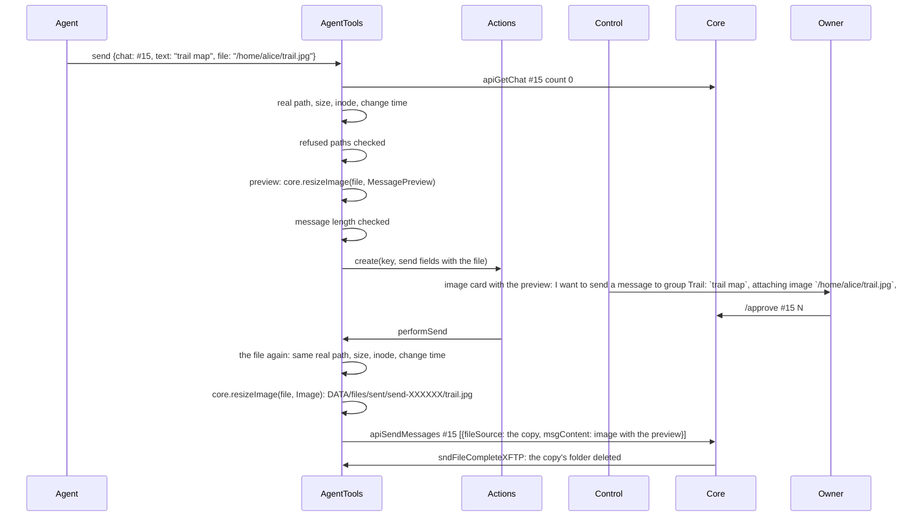
```mermaid
sequenceDiagram
  participant A as Agent
  participant T as AgentTools
  participant X as Actions
  participant K as Control
  participant C as Core
  participant O as Owner
  A->>T: send {chat: #35;15, text: "trail map", file: "/home/alice/trail.jpg"}
  T->>C: apiGetChat #35;15 count 0
  T->>T: real path, size, inode, change time
  T->>T: refused paths checked
  T->>T: preview: core.resizeImage(file, MessagePreview)
  T->>T: message length checked
  T->>X: create(key, send fields with the file)
  K->>O: image card with the preview: I want to send a message to group Trail: `trail map`, attaching image `/home/alice/trail.jpg`, SIZE /'approve #35;15 N', ...
  O->>C: /approve #35;15 N
  X->>T: performSend
  T->>T: the file again: same real path, size, inode, change time
  T->>T: core.resizeImage(file, Image): DATA/files/sent/send-XXXXXX/trail.jpg
  T->>C: apiSendMessages #35;15 [{fileSource: the copy, msgContent: image with the preview}]
  C->>T: sndFileCompleteXFTP: the copy's folder deleted
```

Notes:

- A refused file ends the call with an error, and the refusal is posted to the control chat and logged ([tools.ts:1031-1034](../src/tools.ts#L1031-L1034), [control.ts:199-203](../src/control.ts#L199-L203)).
- A video's preview is the first frame from `ffmpeg` and its duration comes from `ffprobe`; a GIF or WebP gets the fixed preview ([tools.ts:1731-1765](../src/tools.ts#L1731-L1765)).
- A changed file fails the perform: ``file: PATH changed after the request.`` ([tools.ts:1047-1052](../src/tools.ts#L1047-L1052)).
- `sndFileError` deletes the copy too, and the failure is posted to the control chat and logged ([tools.ts:707-709](../src/tools.ts#L707-L709), [serve.ts:140](../src/serve.ts#L140), [control.ts:205-214](../src/control.ts#L205-L214)).

Source: [tools.ts:921-944](../src/tools.ts#L921-L944), [:990-1065](../src/tools.ts#L990-L1065), [control.ts:546-566](../src/control.ts#L546-L566), [:715-721](../src/control.ts#L715-L721).

---

## 16. `/leave` and `/delete CHAT files`

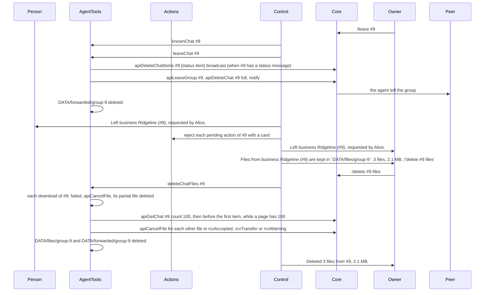
```mermaid
sequenceDiagram
  participant P as Person
  participant T as AgentTools
  participant X as Actions
  participant K as Control
  participant C as Core
  participant O as Owner
  participant D as Peer
  O->>C: /leave #35;9
  K->>T: knownChat #35;9
  K->>T: leaveChat #35;9
  T->>C: apiDeleteChatItems #35;9 [status item] broadcast (when #35;9 has a status message)
  T->>C: apiLeaveGroup #35;9, apiDeleteChat #35;9 full, notify
  C->>D: the agent left the group
  T->>T: DATA/forwarded/group-9 deleted
  K->>P: Left business Ridgeline (#35;9), requested by Alice.
  K->>X: reject each pending action of #35;9 with a card
  K->>O: Left business Ridgeline (#35;9), requested by Alice.
  K->>O: Files from business Ridgeline (#35;9) are kept in `DATA/files/group-9`: 3 files, 2.1 MB. /'delete #35;9 files'
  O->>C: /delete #35;9 files
  K->>T: deleteChatFiles #35;9
  T->>T: each download of #35;9: failed, apiCancelFile, its partial file deleted
  T->>C: apiGetChat #35;9 count 100, then before the first item, while a page has 100
  T->>C: apiCancelFile for each other file in rcvAccepted, rcvTransfer or rcvWarning
  T->>T: DATA/files/group-9 and DATA/forwarded/group-9 deleted
  K->>O: Deleted 3 files from #35;9, 2.1 MB.
```

Notes:

- `/leave` acts at once in both modes, and works for a contact as `Deleted bot X (@4), requested by Alice.` ([control.ts:336-350](../src/control.ts#L336-L350)).
- With `/leave`, the status message of the chat is deleted first, as with `leave` ([7](#7-leave), [tools.ts:1118-1121](../src/tools.ts#L1118-L1121)).
- The line `Left ...` goes to the log and to the owners; the members of #9 see only that the agent left.
- The files message is posted after the reply, and only when the folder has files ([control.ts:347-348](../src/control.ts#L347-L348), [:389-391](../src/control.ts#L389-L391)).
- `/delete CHAT files` works for a current or a left chat; the failed downloads return `Your owner deleted the files of this chat.`, and the reply counts the forwarded files too ([tools.ts:1078-1096](../src/tools.ts#L1078-L1096)).
- The paged reads find the downloads the core continues after a restart, which have no download in memory; for a left chat they find none ([messages.ts:275-283](../src/messages.ts#L275-L283), [tools.ts:1085-1091](../src/tools.ts#L1085-L1091)).

Source: [control.ts:336-360](../src/control.ts#L336-L360), [tools.ts:1073-1096](../src/tools.ts#L1073-L1096), [:1118-1132](../src/tools.ts#L1118-L1132).

---

## Claude Code plugin flows

Participants of the plugin flows:

| Letter | Participant |
|---|---|
| CC | Claude Code |
| HK | a hook, `node dist/cli.js hook ...` in the plugin's folder |
| S | the session process, `simplex-mcp session` |
| D | the service, with its socket routes and entries |
| M | `MainGroup` |
| N | the `Session` of session N, with its `Control` and `Actions` |
| T | the session's `AgentTools` |
| C | the core `_hub` with the profile `Claude` |
| U | `User` with the core `_user` |
| O | an owner in the SimpleX app |

`#M` is the Main group, `#G` the group of session N, ROOT the data root.

---

## 17. First session start and the owner joins

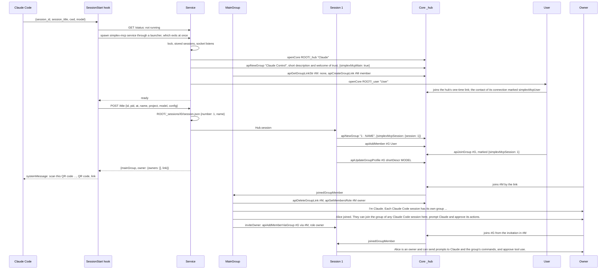
```mermaid
sequenceDiagram
  participant CC as Claude Code
  participant HK as SessionStart hook
  participant D as Service
  participant M as MainGroup
  participant N as Session 1
  participant C as Core _hub
  participant U as User
  participant O as Owner
  CC->>HK: {session_id, session_title, cwd, model}
  HK->>D: GET /status: not running
  HK->>D: spawn simplex-mcp service through a launcher, which exits at once
  D->>D: lock, stored sessions, socket listens
  D->>C: openCore ROOT/_hub "Claude"
  D->>C: apiNewGroup "Claude Control", short description and welcome of trust, {simplexMcpMain: true}
  M->>C: apiGetGroupLinkStr #35;M: none, apiCreateGroupLink #35;M member
  D->>U: openCore ROOT/_user "User"
  U->>C: joins the hub's one-time link#59; the contact of its connection marked simplexMcpUser
  D-->>HK: ready
  HK->>D: POST /title {id, pid, at, name, project, model, config}
  D->>D: ROOT/_sessions/ID/session.json {number: 1, name}
  D->>N: Hub.session
  N->>C: apiNewGroup "1 · NAME", {simplexMcpSession: {session: 1}}
  N->>C: apiAddMember #35;G User
  U->>C: apiJoinGroup #35;G, marked {simplexMcpSession: 1}
  N->>C: apiUpdateGroupProfile #35;G shortDescr MODEL
  D-->>HK: {mainGroup, owner: {owners: [], link}}
  HK-->>CC: systemMessage: scan this QR code ..., QR code, link
  O->>C: joins #35;M by the link
  C->>M: joinedGroupMember
  M->>C: apiDeleteGroupLink #35;M, apiSetMembersRole #35;M owner
  M->>O: I'm Claude. Each Claude Code session has its own group ...
  M->>O: Alice joined. They can join the group of any Claude Code session here, prompt Claude and approve its actions.
  M->>N: inviteOwner: apiAddMemberViaGroup #35;G via #35;M, role owner
  O->>C: joins #35;G from the invitation in #35;M
  C->>N: joinedGroupMember
  N->>O: Alice is an owner and can send prompts to Claude and the group's commands, and approve tool use.
```

Notes:

- Only the person gets the link. It is passed in the hook's `systemMessage`, and it is in no hook context or tool result ([hook.ts:94-96](../src/hook.ts#L94-L96)).
- The service is spawned by a launcher, `node -e LAUNCHER COMMAND ARGS`, which exits at once, so the service is no descendant of the hook. When Claude Code exits during the hook, it ends the hook and the hook's descendants, and the service keeps starting. The service drops its ready line when the hook is gone, and the next session start shows the link ([client.ts:14-18](../src/client.ts#L14-L18), [:79](../src/client.ts#L79), [service.ts:507-513](../src/service.ts#L507-L513)).
- The Main group's name is `main_group`, `Claude Control` by default, followed by ` - MACHINE` when `SIMPLEX_MCP_MACHINE` is set ([config.ts:40](../src/config.ts#L40), [:50-57](../src/config.ts#L50-L57)).
- The service deletes the preset contact of a new profile, in `_hub` and in `_user` ([core.ts:28](../src/core.ts#L28), [:44-52](../src/core.ts#L44-L52)).
- `User` connects only at the first start. At later starts, the service finds the hub's contact marked `simplexMcpUser`, the contact whose connection belongs to the invitation that the hub created. When `User` does not connect within 60 s, the service runs without it, and terminal prompts are not posted ([user.ts:21](../src/user.ts#L21), [:38-48](../src/user.ts#L38-L48), [:60-62](../src/user.ts#L60-L62), [hub.ts:376](../src/hub.ts#L376)).
- At a later start without owners, the service keeps the Main group's link ([main-group.ts:68-76](../src/main-group.ts#L68-L76)).
- Owners are invited to the groups of the open sessions when they join the Main group. The groups of closed sessions are joined with `/join N` ([hub.ts:449-453](../src/hub.ts#L449-L453), [:436-447](../src/hub.ts#L436-L447)).
- The trust given to the Main group's members is stated in the group's short description and welcome message, which Claude sets when it creates the group ([main-group.ts:16-18](../src/main-group.ts#L16-L18), [:195-205](../src/main-group.ts#L195-L205)). Claude also states it in a post at each human's `joinedGroupMember` or `connectedToGroupMember` ([main-group.ts:127-128](../src/main-group.ts#L127-L128)). The joiner is found as in [flow 28](#28-a-member-joins-the-main-group-and-a-sessions-group-and-a-person-is-added-to-it).
- Claude changes only the name and the menu of the Main group's profile, and starts each change from the group's current profile. So the short description, the welcome message and the preferences that owners set are kept ([main-group.ts:57-66](../src/main-group.ts#L57-L66), [control.ts:632-640](../src/control.ts#L632-L640)).
- At each join other than `User`'s, Claude posts in the session group the rights of the joiner's role. For a role that can send, other than owner, the post ends with the command that makes the joiner an observer ([hub.ts:221-228](../src/hub.ts#L221-L228), [:519](../src/hub.ts#L519)).
- The service reads the hub's contact of `User` after `User` opens, so that the sessions recognize `User`'s messages ([hub.ts:377](../src/hub.ts#L377)).

Source: [hook.ts:81-100](../src/hook.ts#L81-L100), [client.ts:40-97](../src/client.ts#L40-L97), [service.ts:93-119](../src/service.ts#L93-L119), [:218-262](../src/service.ts#L218-L262), [hub.ts:368-386](../src/hub.ts#L368-L386), [:407-425](../src/hub.ts#L407-L425), [:478-490](../src/hub.ts#L478-L490), [main-group.ts:117-140](../src/main-group.ts#L117-L140), [user.ts:16-57](../src/user.ts#L16-L57).

---

## 18. Session process start and attach

```mermaid
sequenceDiagram
  participant CC as Claude Code
  participant S as Session process
  participant D as Service
  participant N as Session N
  CC->>S: node dist/cli.js session, with CLAUDE_CODE_SESSION_ID
  CC->>S: initialize
  S-->>CC: tools, instructions, capabilities claude/channel and claude/channel/permission
  S->>D: GET /status, version and protocol
  S->>D: POST /session {id, pid: parent process, project, config}
  D->>D: resolve id: alias#59; id with session.json#59; session of pid, or a wait of up to 10 s for the title of pid
  D->>N: configure, requestMode(approve)
  D-->>S: {number, displayName, owner}
  S->>D: POST /attach {id}
  D-->>S: {version, protocol}
  D->>N: onLine = the entry's writers
  D-->>S: the /attach stream ends: the service stopped
  S->>S: after 1 s, then twice as late after each failure, up to 30 s
  S->>D: GET /status, spawn when none runs, POST /session, POST /attach
```

Notes:

- With an invalid option, or in a run that is not interactive, the session process does not connect to the service, even at a permission request of Claude Code. For every call, it returns the option's error. In a run that is not interactive, the text of [flow 30](#30-a-run-that-is-not-interactive) is returned instead, also with an invalid option ([session.ts:44-51](../src/session.ts#L44-L51), [:57](../src/session.ts#L57), [:59](../src/session.ts#L59), [:66](../src/session.ts#L66)).
- For a session without a folder, the service creates the folder at `/session`, and answers `/attach`, `/call`, `/permission` and `/turn` with 409. After a 409 to a call, the session process registers again in `call` and repeats the call once ([service.ts:392-402](../src/service.ts#L392-L402), [session.ts:120-130](../src/session.ts#L120-L130)).
- When the `/attach` stream ends, or a connection or a spawn fails, the session process drops the connection and connects again. So the channel works again without a tool call. A single timer is set for each attempt, so the delay doubles once per failed attempt. The session process stops retrying at another protocol version, the `ProtocolError`, and at a 403 of `/session` ([session.ts:88-112](../src/session.ts#L88-L112), [:177-183](../src/session.ts#L177-L183), [client.ts:50](../src/client.ts#L50)).

Source: [session.ts:40-67](../src/session.ts#L40-L67), [:160-185](../src/session.ts#L160-L185), [service.ts:201-324](../src/service.ts#L201-L324).

---

## 19. A tool call with approval in the session group

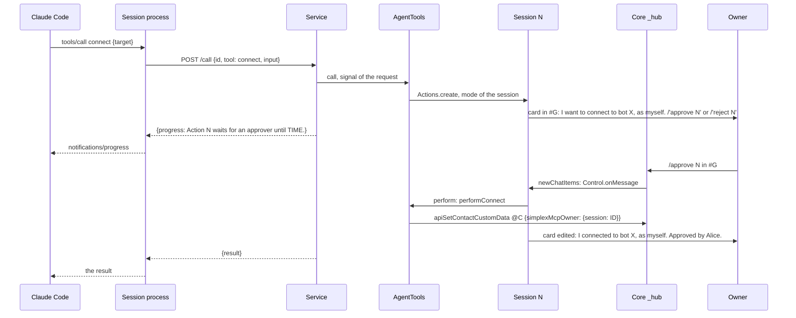
```mermaid
sequenceDiagram
  participant CC as Claude Code
  participant S as Session process
  participant D as Service
  participant T as AgentTools
  participant N as Session N
  participant C as Core _hub
  participant O as Owner
  CC->>S: tools/call connect {target}
  S->>D: POST /call {id, tool: connect, input}
  D->>T: call, signal of the request
  T->>N: Actions.create, mode of the session
  N->>O: card in #35;G: I want to connect to bot X, as myself. /'approve N' or /'reject N'
  D-->>S: {progress: Action N waits for an approver until TIME.}
  S-->>CC: notifications/progress
  O->>C: /approve N in #35;G
  C->>N: newChatItems: Control.onMessage
  N->>T: perform: performConnect
  T->>C: apiSetContactCustomData @C {simplexMcpOwner: {session: ID}}
  N->>O: card edited: I connected to bot X, as myself. Approved by Alice.
  D-->>S: {result}
  S-->>CC: the result
```

Notes:

- Approvers in the session group are its active members with the role `admin` or `owner`, other than Claude and `User`, however they joined ([hub.ts:312-318](../src/hub.ts#L312-L318), [control.ts:580-582](../src/control.ts#L580-L582)).
- Without an approver in `#G`, the action is refused with the text of [API 4.4](api.md#44-tool-results-in-the-plugin).
- The session's ID is set as the owner of the connected chat ([tools.ts:598-602](../src/tools.ts#L598-L602), [:854](../src/tools.ts#L854)).

Source: [service.ts:326-345](../src/service.ts#L326-L345), [hub.ts:69-103](../src/hub.ts#L69-L103), [tools.ts:751-774](../src/tools.ts#L751-L774).

---

## 20. A prompt from the session group

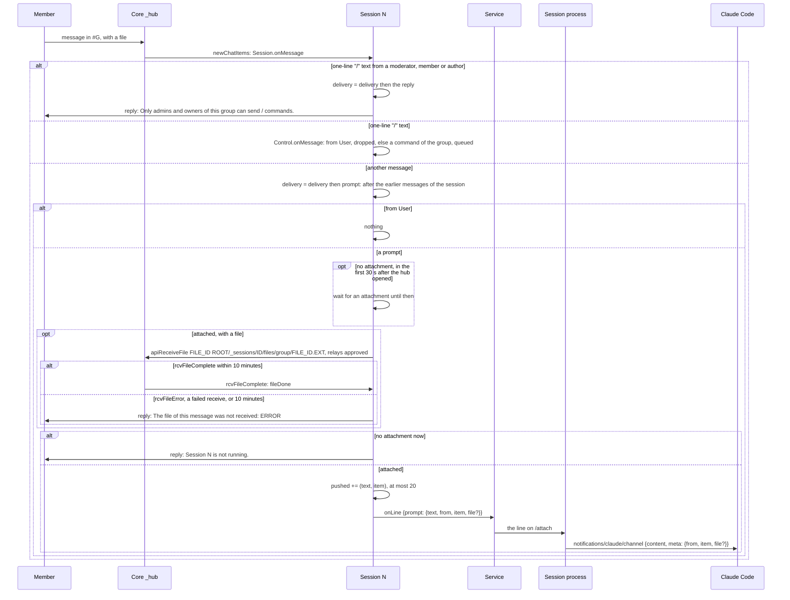
```mermaid
sequenceDiagram
  participant O as Member
  participant C as Core _hub
  participant N as Session N
  participant D as Service
  participant S as Session process
  participant CC as Claude Code
  O->>C: message in #35;G, with a file
  C->>N: newChatItems: Session.onMessage
  alt one-line "/" text from a moderator, member or author
    N->>N: delivery = delivery then the reply
    N->>O: reply: Only admins and owners of this group can send / commands.
  else one-line "/" text
    N->>N: Control.onMessage: from User, dropped, else a command of the group, queued
  else another message
    N->>N: delivery = delivery then prompt: after the earlier messages of the session
    alt from User
      N->>N: nothing
    else a prompt
      opt no attachment, in the first 30 s after the hub opened
        N->>N: wait for an attachment until then
      end
      opt attached, with a file
        N->>C: apiReceiveFile FILE_ID ROOT/_sessions/ID/files/group/FILE_ID.EXT, relays approved
        alt rcvFileComplete within 10 minutes
          C->>N: rcvFileComplete: fileDone
        else rcvFileError, a failed receive, or 10 minutes
          N->>O: reply: The file of this message was not received: ERROR
        end
      end
      alt no attachment now
        N->>O: reply: Session N is not running.
      else attached
        N->>N: pushed += (text, item), at most 20
        N->>D: onLine {prompt: {text, from, item, file?}}
        D->>S: the line on /attach
        S->>CC: notifications/claude/channel {content, meta: {from, item, file?}}
      end
    end
  end
```

Notes:

- Every message of a member other than `User` is a prompt, however the member joined, except a one-line `/` text. Claude answers a one-line `/` text of a moderator, member or author with `Only admins and owners of this group can send / commands.` From an admin or owner, a one-line `/` text is a command of the group. For one outside the group's requests, such as `/model sonnet`, the reply is `Unknown command.` ([hub.ts:153-160](../src/hub.ts#L153-L160), [:230-233](../src/hub.ts#L230-L233), [:308-314](../src/hub.ts#L308-L314), [control.ts:249](../src/control.ts#L249), [:672-677](../src/control.ts#L672-L677)).
- The session handles messages in arrival order. So a prompt is delivered after the file of an earlier prompt. The reply to a one-line `/` text of a moderator, member or author is posted after the earlier prompts ([hub.ts:157](../src/hub.ts#L157), [:159](../src/hub.ts#L159), [:304-306](../src/hub.ts#L304-L306)).
- After a service start, a prompt that arrives before its session attaches again is held up to 30 s from the hub's open. So a prompt sent while the service was stopped is still delivered to the session ([hub.ts:235-237](../src/hub.ts#L235-L237), [:379](../src/hub.ts#L379)).
- In a session started without the channel flag, Claude Code receives the notification and drops it.

Source: [hub.ts:153-160](../src/hub.ts#L153-L160), [:230-259](../src/hub.ts#L230-L259), [service.ts:314](../src/service.ts#L314), [session.ts:53-56](../src/session.ts#L53-L56), [:197-201](../src/session.ts#L197-L201).

---

## 21. A terminal prompt and the answer

```mermaid
sequenceDiagram
  participant P as Person
  participant CC as Claude Code
  participant HK as Turn hook
  participant T as Transcript
  participant D as Service
  participant N as Session N
  participant U as User
  participant C as Core _hub
  participant O as Owner
  P->>CC: prompt typed in the terminal
  CC->>HK: UserPromptSubmit {session_id, transcript_path, prompt_id, prompt}, in the background
  CC->>T: the prompt's entry, with origin human, after the synchronous UserPromptSubmit hooks
  loop up to 600 reads, 100 ms apart, until the entry of prompt_id is found
    HK->>T: read the last 1 MiB and twice the prompt's bytes, a missing file as empty
  end
  HK->>D: ensureService, POST /turn {id, pid, at, prompt, typed}
  D->>N: turn
  N->>N: end pending permissions created before at
  N->>N: no pushed prompt matched: turns += (at, null), unless at is below answeredAt
  N->>U: post(N, parts), when typed and not a "/" command
  U->>O: the prompt in #35;G, from User
  CC->>CC: turn ends
  CC->>HK: Stop {session_id, transcript_path, last_assistant_message, effort}
  CC->>T: the answer's entry, within about 100 ms
  loop up to 20 reads, 100 ms apart, until Claude's last entry is the answer
    HK->>T: read the last 1 MiB and twice the answer's bytes
  end
  HK->>D: ensureService, POST /turn {id, pid, at, answer, model, effort}
  D->>N: turn
  N->>N: end pending permissions created before at
  N->>N: quote = the newest turn record before at#59; it and the older ones leave turns
  N->>N: a changed model or effort, when at is not older than that of the value taken last: description, session.json
  N->>C: apiSendMessages #35;G parts, the first quoting the quote when it came from the group and fits with the first character
  opt the core refuses the quote
    N->>C: apiSendMessages #35;G parts without the quote
  end
  C->>O: the answer, from Claude
  N->>C: apiUpdateGroupProfile #35;G shortDescr MODEL · effort LEVEL, when it changed
```

Notes:

- `at` is `performance.timeOrigin` of the hook process, the hook's start time. In an answer, the hub quotes the newest prompt record whose hook started before the answer's hook. This record is quoted also when the request of the next prompt arrives first, and while the answer's request waits for the short description ([hook.ts:114](../src/hook.ts#L114), [hub.ts:180-186](../src/hub.ts#L180-L186), [:267-276](../src/hub.ts#L267-L276)).
- `User` does not post a prompt that came from the group. The hub matches a pushed prompt to the terminal prompt in either case:
  - its item and its text are in a `<channel source="plugin:simplex:simplex" ... item="I" ...>` tag of the prompt;
  - its text is equal to the raw prompt, and it was pushed in the last 60 s.

  Matched prompts are removed from the pushed prompts, and the oldest of them becomes the item of the turn record ([hub.ts:22](../src/hub.ts#L22), [:27](../src/hub.ts#L27), [:184-186](../src/hub.ts#L184-L186), [:298-302](../src/hub.ts#L298-L302)).
- For an answer without an earlier turn record, the hub quotes the oldest pushed prompt not quoted yet, and marks it quoted. That prompt stays pushed, so the hub still matches it to a prompt request handled after the Stop request, and `User` does not post it ([hub.ts:269-273](../src/hub.ts#L269-L273)).
- For an empty answer, the hub removes the turn record as for any other answer, but posts nothing ([hub.ts:182](../src/hub.ts#L182), [:197](../src/hub.ts#L197)).
- No turn record is made for a prompt request whose hook started before an answer that was already handled. So that prompt is not quoted in a later answer ([hub.ts:183](../src/hub.ts#L183), [:185](../src/hub.ts#L185)).
- The UserPromptSubmit hook runs for every prompt of the session that queries the model, also for Claude Code's own prompts. It marks a prompt as typed only when the prompt's record in the transcript has the origin `human`. Task notifications, messages of other sessions and channel prompts have other origins. The record is the newest one whose text is the prompt: a user entry, or a `queued_command` attachment of a prompt that Claude Code added to a running turn. It is the entry with `prompt_id` as `promptId`, or a record after the first entry with that ID, tool results included, so a long turn whose first entry is out of the tail is found by its tool results. While a `queue-operation` `enqueue` entry with the prompt's text follows the record, the hook waits: the prompt is a later one with that text, still queued. Claude Code writes the entry only after the synchronous UserPromptSubmit hooks end, such as a slow hook in the user's settings, and it creates the transcript file with the session's first entry. So the hook reads the transcript up to 600 times, 100 ms apart, and it treats a missing file as empty. Until the entry with `prompt_id` is in the tail, the hook waits for it; at the last read it takes any record with the prompt's text, and without `prompt_id` it does so at once. Claude Code runs the hook of a person's prompt when it is submitted, and of its own prompts only when they are taken. So at the last read, the hook classifies a record still followed by such an `enqueue` entry by the record, and marks a typed one mid-turn: the queued prompt is the typed prompt itself, or a later prompt with the text of Claude Code's own prompt, as a repeated monitor event. When no record is written within the reads, an `enqueue` entry with the prompt's text after the entry with `prompt_id`, or anywhere without that entry, makes the prompt typed and mid-turn. Otherwise the prompt is typed when an entry with `prompt_id` has the origin `human` ([hook.ts:18-19](../src/hook.ts#L18-L19), [:119](../src/hook.ts#L119), [:147-161](../src/hook.ts#L147-L161), [:187-222](../src/hook.ts#L187-L222)).
- Claude Code adds a prompt that arrives during a turn to that turn, and gives its hook the running turn's prompt ID. The hook sends `midTurn: true` for a prompt whose record is not the entry with `prompt_id`. A mid-turn prompt ends no tool-use card. A prompt adds a turn record only when its hook started no earlier than the hook of the last answer handled (`answeredAt`), and a mid-turn prompt only when it also matched a pushed prompt. So the answer of the turn quotes the turn's prompt, or an owner's prompt added to the turn ([hub.ts:181](../src/hub.ts#L181), [:185](../src/hub.ts#L185)).
- The hook sends `note`, a line about one of Claude Code's own prompts, and Claude posts it without a quote ([hook.ts:217-290](../src/hook.ts#L217-L290), [hub.ts:195](../src/hub.ts#L195)). A typed prompt, a channel prompt and a teammate's prompt of idle notifications only have no note, nor has another record without origin that is not scheduled. The line is cut to 200 characters and ends with `…`. A note that a group preference refuses is replaced by `A note on Claude Code's prompt was not posted: ` and the preference's text.

  | Kind | Record | Line |
  |---|---|---|
  | task notification | origin `task-notification`, or a `queued_command` attachment without origin whose `commandMode` is `task-notification` | an emoji, the first line of `
`, and `: ` with the first line of `<event>` when there is one, with entities decoded. The emoji is ✅ for `<status>` completed, ❌ for failed, ⏹️ for stopped or killed, and without a status 📡 with an event or 🔔 without. Without a `<task-notification>` block: 🔔 and the first line |
  | message of another session | origin `peer` | `✉️ Message from NAME: ` and the first line of `body` |
  | message of a teammate | no origin, a `<teammate-message teammate_id="NAME" ...>` tag after `Another Claude session sent a message` | `✉️ Message from NAME: ` and the tag's `summary`, or the first line of the message, from the first tag that is not an idle notification; nothing for idle notifications only |
  | subagent report | origin `peer` with `handback` | `📋 Report from subagent NAME: ` and the first line of `handbackReportText`, or of `body` |
  | scheduled prompt | no origin, `turnOrigin` `scheduled` | `⏰ Scheduled prompt: ` and the first line |
  | automatic prompt | origin `auto-continuation` | `🔄 Automatic prompt: ` and the first line |
  | another kind | another origin | `⚙️ Claude Code: ` and the first line |
- These terminal prompts are not posted ([hub.ts:196](../src/hub.ts#L196)):
  - a prompt with `typed: false`, such as a notification of a background task. A request without `typed`, from an older plugin, is posted as typed;
  - a blank prompt, which Claude Code sends for a prompt with images only;
  - a prompt made only of this plugin's channel tags, as after the pushed prompts were lost in a service restart;
  - a one-line `/` command, such as `/compact`.
- An answer and a terminal prompt are posted in parts. Each part is the longest run of whole characters that fits in one message, as `send` measures it, and the first part of an answer is measured with its quote. The hub searches each part among the next 15602 characters. No command reply is posted to a part that `User` posts and that starts with `/` ([hub.ts:196](../src/hub.ts#L196), [:278-288](../src/hub.ts#L278-L288), [:532-549](../src/hub.ts#L532-L549), [tools.ts:1643-1646](../src/tools.ts#L1643-L1646), [control.ts:221](../src/control.ts#L221)).
- When the core refuses the quote of an answer with `invalidQuote` or `chatItemNotFound`, as for a deleted prompt, Claude posts the answer without the quote. It does the same when the core refuses the message with the quote as too large, with `largeMsg`. Claude also posts these replies without the quote in the same cases ([hub.ts:290-296](../src/hub.ts#L290-L296), [:551-554](../src/hub.ts#L551-L554)):
  - `Session N is not running.`
  - `The file of this message was not received: ERROR`
  - the reply to a one-line `/` text of a moderator, member or author
- When the core refuses an answer or a terminal prompt with `feature not allowed NAME`, Claude posts a text in its place, and the turn goes on ([hub.ts:196](../src/hub.ts#L196), [:278-288](../src/hub.ts#L278-L288), [:524-526](../src/hub.ts#L524-L526)). NAME is, for example, `SimpleX links` for a SimpleX link while that preference is off. A prompt of `User` is also refused while the preference is on only for roles above that of `User`. The texts are:
  - for an answer, `Claude's answer was not posted: NAME are off in the group of this session; its owners can turn them on in the group's preferences.`, quoting the turn's prompt as the answer would;
  - for a terminal prompt, `User's prompt was not posted: NAME are not allowed for User in the group of this session; its owners can allow them in the group's preferences.`
- The hook cuts a prompt or an answer over 250,000 characters at that length and appends `…`, so that the request fits within the socket's limit of 1 MiB ([hook.ts:16](../src/hook.ts#L16), [:307-309](../src/hook.ts#L307-L309)).
- A card of a tool use that started after the hook stays pending, because the hook's start time `at` is earlier than the card's creation ([hook.ts:114](../src/hook.ts#L114), [hub.ts:204-208](../src/hub.ts#L204-L208)).
- The Stop hook sends the model of its answer ([hook.ts:17](../src/hook.ts#L17), [:19-21](../src/hook.ts#L19-L21), [:118](../src/hook.ts#L118), [:137-145](../src/hook.ts#L137-L145), [:153-185](../src/hook.ts#L153-L185)):
  - The model is the `message.model` of Claude's last entry in the transcript, an entry of type `assistant` without `isSidechain`. It is taken once the text of that entry is equal to the answer.
  - Only the end of the transcript is read, 1 MiB plus twice the answer's size in bytes. The hook reads it up to 20 times, 100 ms apart, as Claude Code writes the transcript every 100 ms.
  - No model is sent for the model `<synthetic>`, for an answer without text, for an empty `transcript_path` or an unreadable transcript, and when the answer's entry is not written within the reads.
- PostModelSwitch sends `{id, pid, at, model, effort}`, with `effort` when the hook's input has it ([hook.ts:118-120](../src/hook.ts#L118-L120)). Nothing is posted for it. When the model or effort changed, the hub writes them to `session.json` and updates the short description ([hub.ts:187-201](../src/hub.ts#L187-L201)).
- The hub takes a model or an effort level only from a request whose `at` is not older than the `at` of the value it took last. It keeps the two times apart, one for the model and one for the effort level. The model of a `/title` comes with the `at` of its SessionStart hook, so a hook that started during the wait of a held title keeps its model ([flow 27](#27-clear---continue-and-resume-in-one-session)). A request without `at` counts as the current time. So when a Stop request that waited for its transcript entry arrives after a later PostModelSwitch request, the model of the switch stays ([hub.ts:261-265](../src/hub.ts#L261-L265)).
- For a Stop request with a changed model or effort, the hub posts the answer before it updates the short description. So the prompt of a request handled meanwhile is posted after the answer. The description is updated also when a post fails ([hub.ts:194-201](../src/hub.ts#L194-L201)).
- A turn hook starts the service when none runs. It repeats a turn refused with 409 up to 15 times, 1 s apart, which is longer than the 10 s wait of a held title. It prints `{}` and logs errors on its stderr ([hook.ts:114-135](../src/hook.ts#L114-L135)). Claude Code gives a hook without `timeout` 600 s, more than the 60 s of a prompt's reads and the 15 s of repeats.

Source: [hooks.json:5-7](../hooks/hooks.json#L5-L7), [hub.ts:180-202](../src/hub.ts#L180-L202), [:267-296](../src/hub.ts#L267-L296), [:532-549](../src/hub.ts#L532-L549), [user.ts:29-32](../src/user.ts#L29-L32).

---

## 22. A tool use approved in the session group

```mermaid
sequenceDiagram
  participant CC as Claude Code
  participant S as Session process
  participant D as Service
  participant N as Session N
  participant O as Owner
  CC->>S: notifications/claude/channel/permission_request {request_id, tool_name, description, input_preview}
  CC->>CC: the terminal dialog stays open
  S->>D: POST /permission {id, requestId, toolName, description, inputPreview}
  D->>N: permission
  N->>O: card in #35;G: I want to use `Bash`: `DESCRIPTION`, preview, /'approve N' or /'reject N'
  O->>N: /approve N
  N->>N: performing
  N->>D: onLine {permission: {requestId, behavior: allow}}
  D->>S: the line on /attach
  S->>CC: notifications/claude/channel/permission {request_id, behavior: allow}
  N->>N: done, removed
  N->>O: card edited: ... Approved by Alice.
```

Notes:

- On `/reject N`, the session pushes `deny`, and the card ends with `Rejected by NAME.` ([hub.ts:172-173](../src/hub.ts#L172-L173)).
- The first answer, in the terminal or in the group, applies. The last line of a card that is still pending becomes `Ended.` at an answer, or at a prompt that is not mid-turn, whose hook started after the card was created, and when the last attachment of the session ends. A prompt that Claude Code adds to the running turn ends no card ([hub.ts:181](../src/hub.ts#L181), [:204-208](../src/hub.ts#L204-L208), [service.ts:321](../src/service.ts#L321), [control.ts:695-696](../src/control.ts#L695-L696)).
- The input preview is cut to fit the card ([control.ts:154](../src/control.ts#L154), [:784-798](../src/control.ts#L784-L798)).
- The card is posted in mode `requests` also for a session in mode `host` ([hub.ts:170](../src/hub.ts#L170)).

Source: [session.ts:58-62](../src/session.ts#L58-L62), [:114-118](../src/session.ts#L114-L118), [service.ts:143-147](../src/service.ts#L143-L147), [hub.ts:169-177](../src/hub.ts#L169-L177), [control.ts:703-706](../src/control.ts#L703-L706).

---

## 23. Mode `host` for a session

```mermaid
sequenceDiagram
  participant S as Session process
  participant D as Service
  participant N as Session N
  participant O as Owner
  S->>D: POST /session {config: {approve: host}}
  D->>N: requestMode(host): requested = host
  alt the group has no approver
    O->>N: joins #35;G as an admin or owner, or gets one of these roles: membership event, Control.onEvent, announceRights, askMode
  end
  N->>O: card in #35;G: I want to run in mode host ... /'approve N' or /'reject N'
  O->>N: /approve N
  N->>N: perform: setMode(host), mode host in the custom data of #35;G
  N->>O: card edited: I run in mode host ... Approved by Alice.
  S->>D: POST /session {config: {approve: requests}}
  D->>N: requestMode(requests): a pending mode card ends with Ended.#59; at once, mode requests in the custom data of #35;G
```

Notes:

- At most one `mode` card is pending at a time. After a card is rejected or expires, the request is forgotten until the next `/session` ([hub.ts:140-151](../src/hub.ts#L140-L151)).
- When a card is rejected, the hub sets `hostDeclined` in `session.json`. While it is set, no card is posted for a `/session` request of `host`, also after a service restart. It is cleared at a `/session` with `requests` ([hub.ts:70-74](../src/hub.ts#L70-L74), [:136](../src/hub.ts#L136), [:141](../src/hub.ts#L141), [:145](../src/hub.ts#L145), [:325-328](../src/hub.ts#L325-L328)).
- When the session opens, the approved mode is read from the custom data of `#G`, and is `requests` when none is stored. No mode is stored in `session.json` ([hub.ts:75](../src/hub.ts#L75), [:320-323](../src/hub.ts#L320-L323)).
- An idle session is closed also while a `mode` card is pending ([hub.ts:119-121](../src/hub.ts#L119-L121)).
- The session process marks the action tools for Claude Code's confirmation by the option read at its own start, before the owner decides ([session.ts:57](../src/session.ts#L57)).

Source: [hub.ts:132-151](../src/hub.ts#L132-L151), [:320-334](../src/hub.ts#L320-L334), [:519](../src/hub.ts#L519), [tools.ts:580-581](../src/tools.ts#L580-L581).

---

## 24. `/give`

```mermaid
sequenceDiagram
  participant O as Owner
  participant K as Control of session 1
  participant T as AgentTools of session 1
  participant C as Core _hub
  O->>K: /give @4 2 in the group of session 1
  K->>T: agentChat @4: a chat of session 1
  K->>K: session 2 has an ID
  K->>T: giveChat @4 ID2
  T->>C: apiSetContactCustomData @4 {simplexMcpOwner: {session: ID2}}
  K->>K: pending actions of @4 with a card rejected by Alice
  K->>O: Gave bot X (@4) to session 2.
```

Source: [control.ts:362-373](../src/control.ts#L362-L373), [tools.ts:585-588](../src/tools.ts#L585-L588), [hub.ts:427-429](../src/hub.ts#L427-L429).

---

## 25. `reset-owners`

```mermaid
sequenceDiagram
  participant P as Person
  participant R as reset-owners
  participant D as Service
  participant M as MainGroup
  participant N as Sessions
  participant O as Owner
  P->>R: npx -y @simplex-chat/mcp@VERSION reset-owners in a terminal
  R->>D: POST /reset-owners
  D->>M: replace, also while owners exist
  M->>O: the Main group deleted for all its members
  M->>M: a new Main group with a link
  Note over M,N: the session groups and the roles of their members stay as they are
  D-->>R: {link}
  alt on a terminal
    R-->>P: "Claude Control" was replaced. Join the new one in the SimpleX app. The link works once:, QR code, link
  else without a terminal, as by Claude's tools
    R-->>P: "Claude Control" was replaced. Run npx -y @simplex-chat/mcp@VERSION link in a terminal to see the link to the new one.
  end
```

Notes:

- VERSION is the plugin's version, so that the command runs the service's version ([owner.ts:7-8](../src/owner.ts#L7-L8)).
- `reset-owners` replaces the group at once, also while owners exist, without their approval. On a terminal, it prints the new link with a QR code. Without a terminal, it names the `link` command instead, so the link is never in Claude's context ([owner.ts:17-20](../src/owner.ts#L17-L20), [:28-33](../src/owner.ts#L28-L33), [hub.ts:403-405](../src/hub.ts#L403-L405)).
- The members who joined the session groups from the old Main group stay there with their roles and the rights of those roles ([hub.ts:312-314](../src/hub.ts#L312-L314)).

Source: [main-group.ts:99-109](../src/main-group.ts#L99-L109).

---

## 26. Idle close, idle stop and a newer version

```mermaid
sequenceDiagram
  participant S as Session process
  participant D as Service
  participant N as Session N
  participant S2 as Session process of a newer plugin
  S->>D: the /attach stream ends with Claude Code
  D->>N: onLine = undefined, endPermissions
  D->>D: idle timer, 10 min
  D->>N: no call, no action in memory: entry closed, open false
  D->>D: no entry: stop timer, 10 min
  D->>D: stop: actions cancelled, cards edited, cores closed, lock released
  S2->>D: GET /status: version lower than its own
  S2->>D: POST /stop
  S2->>D: spawn a service of its version
```

Notes:

- The service cancels the stop timer when it creates an entry for a call or an attachment ([service.ts:357-367](../src/service.ts#L357-L367)).
- A service of a higher version is kept. When the service speaks another protocol version, clients fail with `Restart Claude Code to update the SimpleX plugin.` ([client.ts:40-52](../src/client.ts#L40-L52)).

Source: [service.ts:177-199](../src/service.ts#L177-L199), [:315-323](../src/service.ts#L315-L323), [:404-422](../src/service.ts#L404-L422), [hub.ts:459-469](../src/hub.ts#L459-L469).

---

## 27. `/clear`, `--continue` and `/resume` in one session

Claude Code keeps the session server's `CLAUDE_CODE_SESSION_ID` from its spawn. After `/clear` and `/resume`, it gives the hooks a new `session_id`. With `--continue`, it may spawn the server with a startup ID other than the resumed one. The hooks send `CLAUDE_PID`, and the session server sends its parent process. Both are the same Claude Code process.

```mermaid
sequenceDiagram
  participant CC as Claude Code, process P
  participant S as Session process
  participant HK as Hooks
  participant D as Service
  participant N as Session of A
  Note over CC,N: /clear in session A, the server attached as A
  CC->>HK: SessionStart {session_id: B, source: clear}, CLAUDE_PID P
  HK->>D: POST /title {id: B, pid: P}
  D->>D: B unknown#59; entry A has pid P and is attached: alias B to A, in A's session.json
  D->>N: rename, model
  HK->>D: POST /turn {id: B, pid: P, answer}
  D->>N: turn, posted in A's group
  Note over CC,N: claude --continue: the server spawned with startup ID X, the resumed session R
  CC->>S: CLAUDE_CODE_SESSION_ID X
  S->>D: POST /session {id: X, pid: P}
  D->>D: X unknown, no folder: wait up to 10 s for a /title of P
  CC->>HK: SessionStart {session_id: R, source: resume}, CLAUDE_PID P
  HK->>D: POST /title {id: R, pid: P}
  D->>D: the session of R opened, the title of P recorded
  D->>D: the wait of X ends: alias X to R
  D-->>S: {number of R}
  S->>D: POST /attach {id: X}: the entry of R
  Note over CC,N: /resume R2 in session A, R2 with its own session.json
  CC->>HK: SessionStart {session_id: R2, source: resume}, CLAUDE_PID P
  HK->>D: POST /title {id: R2, pid: P}
  D->>D: R2 has session.json#59; entry A has pid P and is attached: A, without an alias
  HK->>D: POST /turn {id: R2, pid: P, answer}
  D->>N: turn, posted in A's group
  Note over CC,N: later, claude --resume R2 in process Q
  S->>D: POST /session {id: R2, pid: Q}
  D-->>S: {number of R2}: its own group and chats
  Note over CC,N: the title of a new ID F before the server of P registers, as with --fork-session or /clear during a re-attach
  HK->>D: POST /title {id: F, pid: P}
  D->>D: F unknown, no session of P: title of P = F#59; the title is held
  D-->>HK: the reply
  S->>D: POST /session {id: A, pid: P}
  D->>D: A has session.json: A#59; the held title resumes: entry A has pid P: alias F to A
  D->>N: rename, model
```

Notes:

- The service maps a process to the session of its session server while the server is attached, and for 10 s after it detached. It maps a process to the session of its title for 10 s. So a new Claude Code process with a reused PID later starts its own session ([service.ts:283-288](../src/service.ts#L283-L288)).
- The service gives an alias only to an ID without `session.json`. A hook of an ID with `session.json` goes to the session attached from its process, without an alias, or else to its own session. A session server with such an ID registers its own session ([service.ts:268-277](../src/service.ts#L268-L277)).
- The service answers a title of a new ID from a process without a known session at once, and holds the title. It applies the title when the session server of that process registers, or after 10 s without one. In the second case, the service opens a session of its own for the title's ID. So after `/clear` during the re-attach of a session server after a service start, and after `--fork-session` in either order, the new ID is joined to the session that the server registers ([service.ts:201-262](../src/service.ts#L201-L262), [:466-476](../src/service.ts#L466-L476)).
- When a session is created for an ID, the existing aliases of that ID are written to its first `session.json` ([service.ts:397-398](../src/service.ts#L397-L398)).
- Turn hooks of an ID whose title is held get 409, and repeat the turn as in [flow 21](#21-a-terminal-prompt-and-the-answer) ([hook.ts:14](../src/hook.ts#L14)).
- A second title of a process whose title is held is held too. So after two `/clear` within the wait, both new IDs are joined to the session that the server registers. At a stop, the service saves the held title requests in `ROOT/titles.json`, each with its `at`, and at its next start it takes them as new titles ([service.ts:106](../src/service.ts#L106), [:180](../src/service.ts#L180), [:222-232](../src/service.ts#L222-L232)).
- Aliases are read from `session.json` at the service's start, so the service routes later hooks and calls with B or X to the same session ([service.ts:87-91](../src/service.ts#L87-L91), [:290-295](../src/service.ts#L290-L295)).
- Without `CLAUDE_PID`, before Claude Code 2.1.214, a new session server waits the 10 s and then registers its own ID.

Source: [hook.ts:93](../src/hook.ts#L93), [:120](../src/hook.ts#L120), [:311-314](../src/hook.ts#L311-L314), [session.ts:53](../src/session.ts#L53), [service.ts:201-295](../src/service.ts#L201-L295).

---

## 28. A member joins the Main group and a session's group, and a person is added to it

```mermaid
sequenceDiagram
  participant A as Owner Alice
  participant B as Bob
  participant G as Carol
  participant C as Core _hub
  participant M as MainGroup
  participant N as Session N
  A->>B: a group link of #35;M, or an invitation of a contact
  B->>C: joins #35;M
  C->>M: connectedToGroupMember, or joinedGroupMember by the hub's link
  M->>C: apiListMembers #35;M: Bob a current member
  M->>B: Bob joined. They can join the group of any Claude Code session here, prompt Claude and approve its actions.
  B->>M: /join N in #35;M
  M->>N: Hub.join: role admin, or owner for an owner of #35;M
  N->>C: apiAddMemberViaGroup #35;G via #35;M, role admin
  M->>B: Sent you an invitation to "N · NAME".
  B->>C: joins #35;G
  C->>N: joinedGroupMember: Control.onEvent, announceRights, askMode
  N->>B: Bob is an admin and can send prompts to Claude and the group's commands, and approve tool use. You can change role to observer to stop it: /'observer #35;G ID'
  A->>G: a group link of #35;G with role member, or an invitation of a contact with a role
  G->>C: joins #35;G
  C->>N: connectedToGroupMember: Control.onEvent, announceRights, askMode
  N->>B: Carol is a member and can send prompts to Claude ... You can change role to observer to stop it: /'observer #35;G ID'
  G->>C: a message in #35;G, /pending, /!ls
  C->>N: newChatItems: Session.onMessage, a prompt of Carol
  N->>G: to /pending: Only admins and owners of this group can send / commands.
  N->>G: to /!ls: Only admins and owners of this group can send / commands.
  A->>C: Carol's role set to admin in the app
  C->>N: memberRole: Control.onEvent, announceRights, askMode
  N->>A: Carol is an admin and can send prompts to Claude and the group's commands, and approve tool use. You can change role to observer to stop it: /'observer #35;G ID'
  A->>N: /observer #35;G ID of Carol
  N->>C: apiSetMembersRole #35;G [ID] observer, apiListMembers #35;G
  N->>A: Carol is an observer and can't send messages.
  Note over G,C: Carol's app refuses to send as an observer
  Note over A,N: Bob leaves #35;M, is removed from it, or gets another role there
  C->>M: leftMember, deletedMember or memberRole in #35;M
  M->>C: apiListMembers #35;M#59; the session groups stay as they are
```

Notes:

- A member's rights depend on the member's role in the session group, not on the way the member joined or on the member's role in the Main group. Admins and owners approve and send the group's `/` commands. The session groups stay as they are at changes in the Main group ([hub.ts:217-219](../src/hub.ts#L217-L219), [:312-314](../src/hub.ts#L312-L314), [main-group.ts:117-132](../src/main-group.ts#L117-L132)).
- With `/join N`, a member of the Main group gets an invitation as an admin, and an owner of the Main group as an owner ([hub.ts:440](../src/hub.ts#L440)).
- When a member of the group changes a member's role, the core raises `memberRole`, and Claude posts the new rights. For a role change by Claude, as with `/observer`, the core raises no event, and Claude states the observer's rights in its reply to `/observer` ([hub.ts:221-228](../src/hub.ts#L221-L228), [control.ts:384-386](../src/control.ts#L384-L386), [:888-891](../src/control.ts#L888-L891)).
- `/observer #G ID` is accepted from a sender whose role is admin or owner and not below the member's role, as SimpleX requires for a role change. Only a current member's role changes ([control.ts:375-387](../src/control.ts#L375-L387), [tools.ts:1617-1619](../src/tools.ts#L1617-L1619)):
  - For a member with the status `pending_approval` or `pending_review`, Claude replies `NAME's role can't be changed.`
  - `No member ID in this group.` is the reply for a member who is neither current nor pending, such as an invited member who has not joined.

  After the role change, the members are read again. So the standing approvals that the new observer gave are not counted while that member is not an admin or owner. They stay in the chat's custom data and are counted again when the member becomes one again ([control.ts:167-170](../src/control.ts#L167-L170)).
- Claude finds the joiner of the Main group's post among the refreshed members, because in `connectedToGroupMember` the member's status is the one before the connection. The post is made only for a human joiner ([main-group.ts:127-128](../src/main-group.ts#L127-L128)).
- Claude posts nothing when `User` joins a session group or when its role changes ([hub.ts:224](../src/hub.ts#L224), [:316-318](../src/hub.ts#L316-L318)).
- One post is made for each join. For each connection, the core raises one of two events:
  - `joinedGroupMember` for a member who joined through the hub, by its invitation or link;
  - `connectedToGroupMember` for a member whom another member added.

  The end-to-end test counts one post for each join in both groups ([test/e2e/service.test.ts](../test/e2e/service.test.ts)).
- A person added to the group directly has the rights of the role that the adding member set, as a member from the Main group has the rights of its role ([hub.ts:230-233](../src/hub.ts#L230-L233), [:312-314](../src/hub.ts#L312-L314)).
- Claude answers `/join N` from a member of the group of session N with `You are a member of "N · NAME".` ([hub.ts:439-444](../src/hub.ts#L439-L444)).
- At a reset of the owners, the session groups and their members stay as they are ([flow 25](#25-reset-owners)).

Source: [main-group.ts:111-115](../src/main-group.ts#L111-L115), [:117-132](../src/main-group.ts#L117-L132), [hub.ts:217-228](../src/hub.ts#L217-L228), [:436-447](../src/hub.ts#L436-L447), [:519](../src/hub.ts#L519), [control.ts:375-387](../src/control.ts#L375-L387), [:884-891](../src/control.ts#L884-L891).

---

## 29. `reply`

```mermaid
sequenceDiagram
  participant CC as Claude Code
  participant T as AgentTools
  participant N as Session N
  participant C as Core _hub
  participant A as Owner Alice
  CC->>T: reply {file, text}
  T->>T: the file checked, and its message with the caption and the preview by fitsMessage
  T-->>CC: too long: text: too long for a message with this TYPE#59; shorten it.
  T->>C: apiSendMessages #35;G with the file, its caption and its preview
  alt the group's preference for files and media allows the files of Claude's role
    C-->>T: the sent item
    T-->>CC: {item}
  else it does not
    C-->>T: error: feature not allowed Files and media
    T-->>CC: Files and media are off in the group of this session#59; its owners can turn them on in the group's preferences.
  end
  A->>C: the group's preferences changed in the app
  N->>C: a later profile update of #35;G, for the model or the name: apiGetChat #35;G count 0
  N->>C: apiUpdateGroupProfile #35;G, the current profile with Claude's fields changed
```

Notes:

- `reply` creates no action and posts no card, in both modes. It is not an action tool, so Claude Code does not ask before it either ([tools.ts:732-749](../src/tools.ts#L732-L749), [:492](../src/tools.ts#L492)).
- The core checks the preference at the send, by the sender's role. Only owners change the preference.
- At each profile update of `#G`, Claude sends the whole profile. It starts each update from the group's current profile in the chat database, and changes only the name, the short description and the commands. So the owners' preferences are kept ([control.ts:115-140](../src/control.ts#L115-L140), [:632-640](../src/control.ts#L632-L640)).

Source: [tools.ts:732-749](../src/tools.ts#L732-L749), [:564](../src/tools.ts#L564), [hub.ts:93](../src/hub.ts#L93), [control.ts:632-640](../src/control.ts#L632-L640).

---

## 30. A run that is not interactive

```mermaid
sequenceDiagram
  participant CC as Claude Code, claude -p
  participant HK as Hooks
  participant S as Session process
  participant D as Service
  Note over CC,D: claude -p or the Agent SDK: CLAUDE_CODE_ENTRYPOINT sdk-cli, sdk-ts or sdk-py for the hooks and the server
  CC->>HK: SessionStart, UserPromptSubmit, Stop
  HK-->>CC: {}, without a request
  CC->>S: tools/call
  S-->>CC: This Claude Code run is not interactive, so it has no SimpleX group ...
  Note over CC,D: claude -p from a command of a VS Code session: entrypoint claude-vscode#59; the hooks get ATTENDED 0 and CLAUDE_PID P, the server ATTENDED 1 and the parent process P
  CC->>HK: SessionStart
  HK->>D: ensureService, POST /title {id, pid: P, project, config, unattended: true}
  D->>D: marks of 10 s ago and older removed#59; P marked#59; a /session of P waiting for its title ends its wait
  HK-->>CC: {}
  S->>D: POST /session {id, pid: P}, before or after the mark
  D-->>S: 403
  CC->>S: tools/call
  S-->>CC: This Claude Code run is not interactive, so it has no SimpleX group ...
  CC->>HK: UserPromptSubmit, Stop
  HK-->>CC: {}, without a request
```

Notes:

- Claude Code sets `CLAUDE_CODE_ENTRYPOINT` for its hooks and its MCP servers. The value is `sdk-cli` for `claude -p`, and `cli` for an interactive session. The Agent SDK sets `sdk-ts` or `sdk-py`. Claude Code keeps an entrypoint already in the environment, except `cli`. So a `claude -p` run started by a command of a VS Code or desktop-app session keeps `claude-vscode` or `claude-desktop`.
- For its hooks, Claude Code sets `CLAUDE_CODE_SESSION_ATTENDED` to `1` or `0`, and to `0` for a run nobody attends. Its MCP servers get the variable only from the environment of the command that started Claude Code. In the run recorded with Claude Code 2.1.319 in [`claude-p-runs.jsonl`](../test/unit/claude-p-runs.jsonl), the hooks got `0` and a `CLAUDE_PID` equal to the server's parent process. The server got the parent session's `1` and `CLAUDE_PID`.
- The service checks the mark before and after the wait of `/session` for the title of its process. So the session server is refused whether its `/session` arrives before or after the hook's mark. A mark is valid for 10 s, and after that it is removed at the next mark ([service.ts:203-205](../src/service.ts#L203-L205), [:237-248](../src/service.ts#L237-L248)).
- A refused server answers every call with that text, relays no permission request and does not register again ([session.ts:79-80](../src/session.ts#L79-L80), [:92](../src/session.ts#L92), [:115](../src/session.ts#L115), [:127](../src/session.ts#L127), [:162-165](../src/session.ts#L162-L165)).
- A hook without `CLAUDE_PID` sends no mark. A failed mark is logged as `SimpleX MCP session start` ([hook.ts:102-112](../src/hook.ts#L102-L112)).

Source: [config.ts:23-33](../src/config.ts#L23-L33), [hook.ts:81-85](../src/hook.ts#L81-L85), [:115](../src/hook.ts#L115), [service.ts:221](../src/service.ts#L221), [:237-248](../src/service.ts#L237-L248), [session.ts:45](../src/session.ts#L45).

---

## 31. A prompt of Claude Code

```mermaid
sequenceDiagram
  participant CC as Claude Code
  participant HK as UserPromptSubmit hook
  participant T as Transcript
  participant D as Service
  participant N as Session N
  participant O as Owner
  Note over CC,O: at a turn's start
  CC->>HK: {prompt_id of the new turn, prompt: a task notification}
  CC->>T: the prompt's entry, origin task-notification
  HK->>T: the entry with prompt_id whose text is the prompt
  HK->>D: POST /turn {prompt, typed: false, note}
  D->>N: end tool-use cards created before at#59; turns += (at, null), unless at is below answeredAt
  N->>O: Claude: ✅ Background command "Build" completed (exit code 0)
  Note over CC,O: during the turn
  CC->>HK: {prompt_id of the running turn, prompt: a task notification}
  CC->>T: a queued_command attachment with the prompt and its origin
  HK->>T: the attachment after the entry with prompt_id
  HK->>D: POST /turn {prompt, typed: false, note, midTurn: true}
  D->>N: cards stay pending, and a turn record needs a matched pushed prompt
  N->>O: Claude: ❌ Background command "Lint" failed with exit code 1
  CC->>D: Stop hook: POST /turn {answer}
  N->>O: Claude: the answer, without a quote
```

Notes:

- The note is posted before the answer of its turn, in the order in which the hooks' requests arrive. The UserPromptSubmit hook of a turn starts before its Stop hook ([hub.ts:195-197](../src/hub.ts#L195-L197)).
- A mid-turn prompt ends no tool-use card. A prompt adds a turn record only when its hook started no earlier than the hook of the last answer handled (`answeredAt`), and a mid-turn prompt only when it also matched a pushed prompt, an owner's prompt from the group. So the answer quotes the turn's prompt, or an owner's prompt added to the turn ([hub.ts:181](../src/hub.ts#L181), [:185](../src/hub.ts#L185), [:267-276](../src/hub.ts#L267-L276)).
- A person's prompt typed during a turn runs its hook at once. Its record is written later, as a `queued_command` attachment when Claude Code adds it to the running turn, or as the entry of the next turn. `User` posts it as typed and mid-turn ([hook.ts:187-203](../src/hook.ts#L187-L203)).

Source: [hook.ts:147-151](../src/hook.ts#L147-L151), [:187-290](../src/hook.ts#L187-L290), [hub.ts:180-202](../src/hub.ts#L180-L202).

---

## 32. Status message while the agent works

```mermaid
sequenceDiagram
  participant P as Person
  participant A as Agent
  participant T as AgentTools
  participant L as Statuses
  participant I as Inference endpoint
  participant X as Actions
  participant C as Core
  participant O as Owner
  Note over T,O: #35;9 is a group, approved with /approve #35;9 all, the server runs with --inference
  O->>C: summarize README.md (item 40 in #35;9)
  C->>T: newChatItems #35;9 [40]
  T->>T: showsStatus(#35;9) with the chat of the event
  T->>L: queue(#35;9)
  L->>T: allowed(#35;9): knownChat, showsStatus
  L->>C: apiSendMessages #35;9 [◐ received, waiting for the agent · 0:00] live: item S
  A->>T: receive {chat: #35;9, wait: 3600}
  T->>C: apiGetChat #35;9 initial 1, then the unread items
  T->>C: apiChatItemsRead #35;9 [40]
  T->>T: showsStatus(#35;9) with the chat read of the call
  T->>L: start(#35;9): the waiting status taken
  L->>C: apiUpdateChatItem #35;9 S [◓ thinking · 0:02] live
  T-->>A: {chat: #35;9, messages: [40], more: 0}
  loop each tick, a tenth of the age after the previous one, 3 s to 20 s
    L->>T: allowed(#35;9): knownChat, showsStatus
    L->>I: GET /running, then /props and /slots of each allowed proxy, at most once per 3 s
    L->>C: apiUpdateChatItem #35;9 S [◑ generating, 31 tokens/s · 0:18] live
  end
  A->>T: send {chat: #35;9, text: "Reading the file…", live: true}
  T->>C: apiGetChat #35;9 count 0
  T->>T: postingRefusal and statusRefusal: none
  T->>L: show(#35;9, note)
  L->>C: apiUpdateChatItem #35;9 S [◒ generating, 31 tokens/s · 0:21, the note under it] live
  T->>P: Note to group Team (#35;9): Reading the file…
  T-->>A: {status: live, chat: #35;9}
  A->>T: send {chat: #35;9, text: "The README describes …", wait: 0}
  T->>X: create(key, send fields, "Alice"): performing, standing
  X->>T: performSend
  T->>C: apiSendMessages #35;9 [The README describes …]
  T->>L: end(#35;9)
  L->>C: apiDeleteChatItems #35;9 [S] broadcast
  T-->>A: {action: N, status: done, chat: #35;9, item, responses: [], more: 0}
```

Notes:

- Eligibility is read before the first post and at each tick: the agent can post in #9, #9 is a chat with a person, a group or a business chat and is not being left, the mode is `requests`, the control chat is not lost, and #9 has a standing approval of messages ([tools.ts:955-966](../src/tools.ts#L955-L966), [:1591-1598](../src/tools.ts#L1591-L1598), [status.ts:128-135](../src/status.ts#L128-L135)). When #9 is not eligible at the first tick, the status ends without a post.
- A waiting status is queued for any message received in #9 without a status, not live and in the main conversation, whatever its sender, when the chat of the event shows #9 eligible, also while no `receive` of #9 runs ([tools.ts:640-641](../src/tools.ts#L640-L641), [status.ts:52-56](../src/status.ts#L52-L56)).
- The status is started for any message returned by `receive`, or by `send` as a response, whatever its sender, when the chat read of the call, or the chat of the first response, shows the chat eligible. A waiting status is taken: its label is set to `thinking`, and the status is rendered at once while it has 1 to 58 renders; a start in a chat with another status is ignored ([tools.ts:980](../src/tools.ts#L980), [:1326](../src/tools.ts#L1326), [status.ts:58-64](../src/status.ts#L58-L64)).
- The label is read for renders 2 to 49 of a status other than a waiting one, after the inference poll; the labels and their order are in [API 1.10](api.md#110-status-message) ([status.ts:136-140](../src/status.ts#L136-L140), [:156-161](../src/status.ts#L156-L161), [:183-220](../src/status.ts#L183-L220)).
- With the status hooks of `register`, the labels also name the Claude Code tool, permission prompt, subagent or compaction in progress ([33](#33-claude-code-activity-in-the-status-message)).
- At the 50th render, the line is `◌ working since YYYY-MM-DD HH:MM UTC`, or `◌ received, waiting for the agent since YYYY-MM-DD HH:MM UTC` for a waiting status; later ticks are run every 5 min without a render, and notes are rendered up to the 59th render ([status.ts:141-142](../src/status.ts#L141-L142), [:152](../src/status.ts#L152), [:179](../src/status.ts#L179)).
- A note is checked as a `send` up to the role check, then by `statusRefusal`; it is rendered at once without an action, and the result is returned without a wait ([tools.ts:926-933](../src/tools.ts#L926-L933), [:946-953](../src/tools.ts#L946-L953), [status.ts:66-76](../src/status.ts#L66-L76)).
- The answer is a new message; the status message is deleted after `apiSendMessages` returns, and it is kept after a failed answer ([tools.ts:996-1006](../src/tools.ts#L996-L1006)). The outcome of the answer is posted to the control chat as in [6](#6-send-under-a-standing-approval-and-revoke).
- Other deletions: a `receive` of #9 that waits, `leave` and `/leave`, a tick of a chat that is not eligible, 23 hours, 30 minutes without calls from 50 renders, a failed send or update of the status, the stop ([API 1.10](api.md#110-status-message)).
- A render queued while the first send of a status runs is sent after it. When that send fails, a new live item is posted for the queued render, and that item is removed by the deletion queued after it ([api.ts:1187-1189](../../simplex-chat-nodejs/src/api.ts#L1187-L1189), [:1199-1208](../../simplex-chat-nodejs/src/api.ts#L1199-L1208), [status.ts:123-126](../src/status.ts#L123-L126)).
- Polls are shared by all status messages for 3 s; one 1 s deadline is set for all requests of a poll; a failed poll is logged as `inference endpoint: ERROR` unless the previous one failed ([inference.ts:34-48](../src/inference.ts#L34-L48), [status.ts:163-174](../src/status.ts#L163-L174)).

Source: [tools.ts:633-643](../src/tools.ts#L633-L643), [:921-966](../src/tools.ts#L921-L966), [:968-1015](../src/tools.ts#L968-L1015), [:1294-1331](../src/tools.ts#L1294-L1331), [status.ts:32-220](../src/status.ts#L32-L220), [inference.ts:31-107](../src/inference.ts#L31-L107).

---

## 33. Claude Code activity in the status message

```mermaid
sequenceDiagram
  participant A as Agent
  participant CC as Claude Code hooks
  participant H as HTTP
  participant Y as Activity
  participant L as Statuses
  participant C as Core
  Note over A,C: register wrote the status hooks
  A->>CC: tool call mcp__simplex-my-agent__receive {chat: #35;9, wait: 3600}
  CC->>H: curl: POST /hook {hook_event_name: PreToolUse, session_id: S1, tool_name: mcp__simplex-my-agent__receive, tool_use_id: U1}
  H->>Y: record: S1 taken as an agent session, U1 skipped
  H-->>CC: 204
  Note over A,C: receive returns the prompt, and the status message S of #35;9 is taken, as in 32
  A->>CC: tool call Read {file_path: /home/alice/app/README.md}
  CC->>H: POST /hook {PreToolUse, S1, Read, U2, tool_input}
  H->>Y: record: running tool U2 {S1, Read, README.md}
  L->>Y: state, at a tick
  L->>C: apiUpdateChatItem #35;9 S [◐ reading `README.md` · 0:12] live
  CC->>H: POST /hook {PostToolUse, S1, U2}
  H->>Y: record: U2 removed
  A->>CC: tool call Bash {command: npm test}
  CC->>H: POST /hook {PreToolUse, S1, Bash, U3}
  CC->>H: POST /hook {PermissionRequest, S1, Bash}
  H->>Y: record: permission flag of S1 set
  L->>C: apiUpdateChatItem #35;9 S [◑ waiting for permission in Claude Code · 0:18] live
  CC->>H: POST /hook {PostToolUse, S1, U3}
  H->>Y: record: permission flag cleared, U3 removed
  CC->>H: POST /hook {Stop, S1}
  H->>Y: record: the running tools, subagents and flags of S1 removed
```

Notes:

- Claude Code runs the hooks for every session that reads the settings file, without a wait for curl; curl ends within 2 s, and its answer is discarded ([register.ts:63-66](../src/register.ts#L63-L66), [Claude Code hooks: background](https://code.claude.com/docs/en/hooks#run-hooks-in-the-background)).
- A session is taken as an agent session from its first event whose `tool_name` is a tool of this server; events of other sessions are discarded ([activity.ts:39-42](../src/activity.ts#L39-L42)).
- The calls of this server are skipped by `Activity` and shown as `using TOOL` from the running calls of `Statuses` other than `receive` ([activity.ts:46](../src/activity.ts#L46), [status.ts:159](../src/status.ts#L159), [:205](../src/status.ts#L205)).
- `agent_id` is set in the tool events of a subagent; at `PostToolBatch`, only the running tools of the same agent are removed ([activity.ts:56-58](../src/activity.ts#L56-L58)).
- Labels are read at ticks, 3 s to 20 s apart, so a tool call started and ended between two ticks is not shown ([status.ts:136-140](../src/status.ts#L136-L140), [:150-154](../src/status.ts#L150-L154)).
- The posts of one session may be received out of order; for an end event received before its `PreToolUse`, the ID is kept as ended, and the late `PreToolUse` is skipped ([activity.ts:46](../src/activity.ts#L46), [:53-55](../src/activity.ts#L53-L55)).
- While the server is down, curl fails with a refused connection; Claude Code hides the completion notices of async hooks by default ([Claude Code hooks: background](https://code.claude.com/docs/en/hooks#run-hooks-in-the-background)).

Source: [register.ts:10](../src/register.ts#L10), [:63-66](../src/register.ts#L63-L66), [http.ts:26-30](../src/http.ts#L26-L30), [:63-72](../src/http.ts#L63-L72), [serve.ts:109-110](../src/serve.ts#L109-L110), [:120](../src/serve.ts#L120), [activity.ts:24-115](../src/activity.ts#L24-L115), [status.ts:156-161](../src/status.ts#L156-L161), [:202-220](../src/status.ts#L202-L220).
