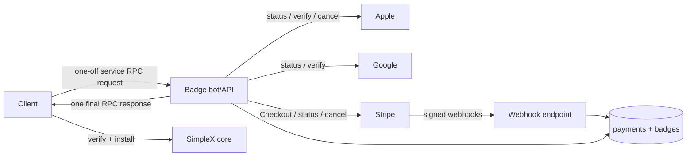
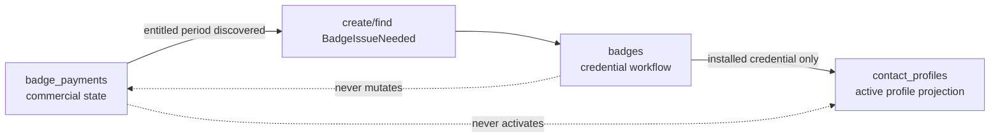
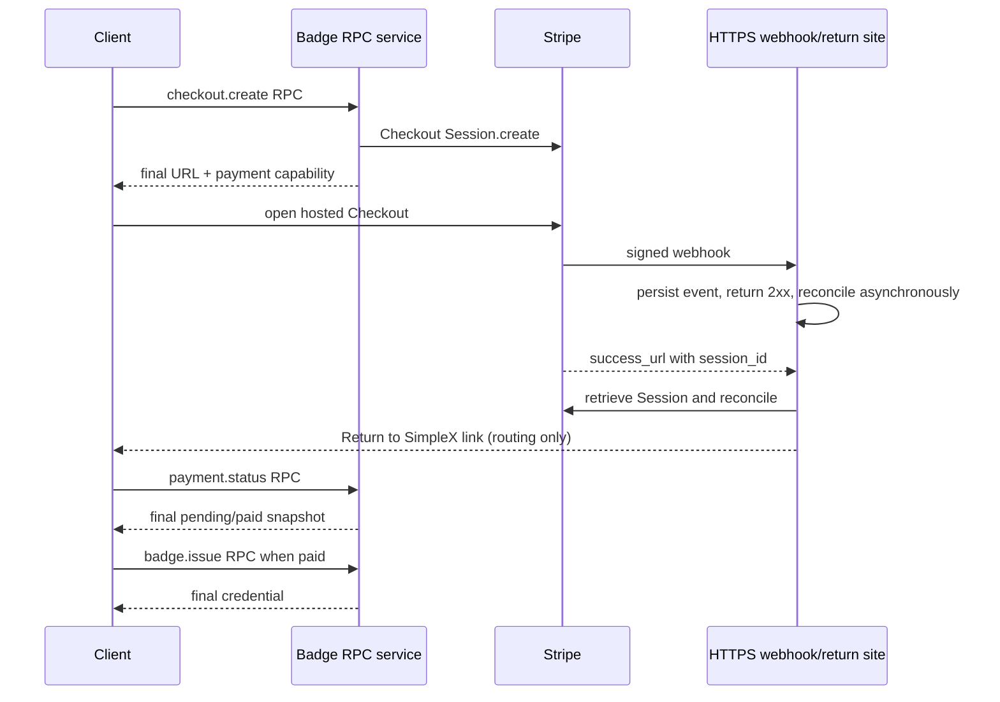
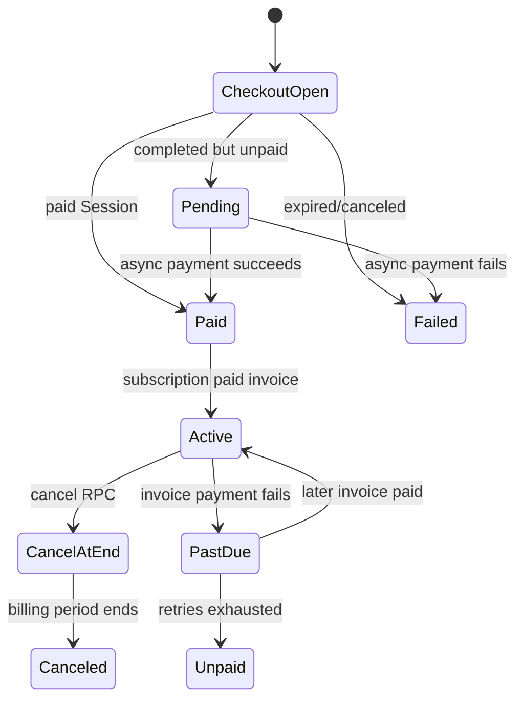

# Supporter Badges v2 — Implementation Plan

**Date:** 2026-07-21
**Status:** implementation-ready design
**Companion:** [Product and UX plan](2026-07-20-supporter-badges-v2-product.md)

This is the normative architecture for client, badge bot, persistence, and Apple/Google/Stripe integrations. It follows the `data CallState` pattern: closed algebraic states with state-specific fields, explicit transition functions, JSON/DB encoding, and invalid-transition errors. Payment and badge are separate state machines joined by stable IDs.


## Contents

- [1. Audit of current code](#1-audit-of-current-code)
- [2. Industry comparison](#2-industry-comparison)
- [3. Architecture and invariants](#3-architecture-and-invariants)
- [4. Persistence and Haskell types](#4-persistence-and-haskell-types)
- [5. Service RPC application protocol](#5-service-rpc-application-protocol)
- [6. Provider flows](#6-provider-flows)
- [7. Client reconciliation](#7-client-reconciliation)
- [8. Errors and retries](#8-errors-and-retries)
- [9. Security, privacy, and concurrency](#9-security-privacy-and-concurrency)
- [10. Delivery plan and tests](#10-delivery-plan-and-tests)
- [11. Code integration checklist](#11-code-integration-checklist)
- [12. Concrete API references](#12-concrete-api-references)

## 1. Audit of current code

The current `badge-service` is a useful issuance prototype, not the required lifecycle service.

| Current code | Keep | Required change |
|---|---|---|
| Apple JWS verification in `apple.py` | certificate/JWS verification | validate bundle/environment/product; persist original transaction and full status; support server status refresh |
| Google `subscriptionsv2.get` in `google.py` | token-only server verification; SKU from verified line item | represent all states, acknowledgement, auto-renew, period, linked-token replacement, and management-link status refresh |
| Stripe Payment Links + session/invoice scanning | price IDs and server-side Stripe key | replace with per-attempt Checkout Sessions, webhook endpoint, subscription/customer persistence, status/cancel/portal operations |
| `customData` maps in `state.py` | request hashing concept | migrate to transactional SQL `payments` and `badges`; RPC has no persistent contact identity, so authorization uses an opaque payment capability |
| `issued_badges` keyed by Apple transaction / Google token | idempotent response cache | key subscription issuance by verified provider period/order; the stable Google token currently blocks renewal badges |
| wire replies in `wire.py` | discriminated union | serialize one application request and one final application response inside SimpleX service RPC |
| `/badge` only; SimpleX install is CLI `/badge add` | keep v1 during migration | add create/attach/status/issue/cancel/portal plus a non-CLI core command that verifies, stores, and returns the updated user |
| no Stripe webhooks | — | mandatory: signed, deduplicated event ingestion; redirects never fulfill |
| no `req` in current models/wire | — | add client-generated application request ID echoed in every response |

## 2. Industry comparison

Provider guidance and official sample integrations lead to these decisions:

| Common production pattern | Before review | Final decision |
|---|---|---|
| Pre-bind purchase to internal state | attach proof after purchase only | `payment.prepare` returns an opaque capability and provider binding; use Apple `appAccountToken`, Google obfuscated IDs, and Stripe `client_reference_id` |
| Verify and own entitlement on a secure backend | partly present | required for every rail; client state is cache/scheduler only |
| Acknowledge/consume Google purchases from backend | client-led | bot performs durable server-side action via retry outbox |
| Provider webhook/notification plus API re-fetch | optional/partial | provider events update server state only; clients discover it exclusively through later RPC status calls |
| Stripe Checkout Session + webhook fulfillment | Payment Links/poller in current bot | Checkout Sessions, signed raw-body webhook, async queue, object re-fetch, event dedupe |
| Redirect is not fulfillment | already corrected | hosted HTTPS completion + app link is UX only |
| Webhooks may duplicate/reorder | covered | dedupe event and object/type; pin API version; monotonic transitions; re-fetch current object |
| Restore/authorization binding | ambiguous | prepared payment capability, explicit recovery policy, no silent cross-payment claim |
| Product choices | repeat purchase was ambiguous | exactly one-time or subscription, with monthly/yearly subscription intervals; one-time does not stack |
| Secrets retained minimally | covered | master key encrypted only client-side; bot hashes after synchronous signing |

## 3. Architecture and invariants

### 3.1 Responsibilities

| Component | Owns |
|---|---|
| Client | payment capability, master secret, installed credential, cached snapshots, native purchase UI, reconciliation schedule |
| SimpleX service RPC | short-lived authenticated request/reply ratchet, transport correlation, bounded replay cache, teardown |
| Bot/API | capability authorization, provider verification, canonical payment state, cancellation, application idempotency, synchronous signing |
| Provider | charge, refund, renewal, subscription truth |
| Core chat | cryptographic badge verification/storage/presentation |



### 3.2 Invariants

1. Only a provider-verified, entitled payment period plus a client-supplied master key can enter badge `Signing`. Provider events create/refresh payment state and mark issuance needed; they cannot sign alone.
2. At most one client and bot badge row exists for `(payment_id, issuance_period_id, master_key_hash)`. Subscription issuance periods are monthly even when provider billing is yearly.
3. A request ID is bound to one canonical request hash. Reuse with another body is rejected.
4. RPC has no stable transport identity. `payment.prepare` returns a random high-entropy capability and provider-signed opaque account binding. Every later request supplies the capability; each provider object binds to exactly one payment. Invalid capabilities return a generic ownership error.
5. Provider event ordering cannot move a payment backward: compare provider event time/version and re-fetch current provider state when ambiguous.
6. Bot payment-period discovery and “issuance needed” state are committed transactionally; a later `badge.issue` RPC supplies the master key and receives the credential in its final response. The credential is cached for idempotent repeats. Client snapshot and installation are independently crash-safe and converge by later RPC calls.
7. Badge validity is calculated only by core from credential signature, trusted key index, and expiry. One-time uses `endOfNextMonth(verified purchase time)`. Subscriptions use monthly issuance slots and `endOfNextMonth(slotStart)`, whether provider billing is monthly or yearly. Never derive expiry from request/retry time.
8. Installing a new credential never replaces an active credential with an earlier expiry for the same tier. If multiple purchasable tiers are enabled, resolve deterministically by configured tier rank, then expiry; otherwise v2 exposes one purchasable tier.
9. Secrets/proofs are encrypted at rest where they must be retained; logs contain hashes/IDs only after redaction.

Subscription slot rule:

- Let `anchor` be the verified subscription start and `paidThrough` the provider billing-period end.
- Slot `n` starts at `addCalendarMonths n anchor`; it is eligible only when `slotStart <= now < paidThrough` and the provider still reports paid entitlement for that interval.
- `issuancePeriodId = hash(subscriptionIdentity, slotStart)`. Its credential expires at `endOfNextMonth(slotStart)`.
- Monthly billing normally adds one slot per paid invoice. Yearly billing pays through a year, but slots become eligible monthly rather than all at once.
- Cancellation permits slots only through the already-paid `paidThrough`; refund/revocation prevents later slots.

### 3.3 Two machines, one join key

The tables are independent state machines living alongside each other:



Rules:

- `paymentId` joins them. Payment state keeps the provider billing period; each badge row uses a distinct monthly `issuancePeriodId`.
- A payment state never contains credential delivery state.
- A badge state never contains subscription status, renewal intent, or billing errors.
- Payment becoming entitled creates/finds `BadgeIssueNeeded`; it does not activate perks.
- Payment expiring/canceling does not delete or shorten an installed credential. The signed badge remains active until its month-aligned expiry, but no later period is issued.
- Badge failure does not roll back a successful payment. It remains retryable independently.
- UI state is derived from `(paymentState, current BadgeStatus, badgeIssueState, operationError)`; it is not persisted as a third state machine.

## 4. Persistence and Haskell types

There are two related stores:

- **Haskell/client DB (required by this feature):** exactly two lifecycle tables, `badge_payments` and `badges`. They survive restart and drive reconciliation/UI.
- **Bot DB (required for verification and Stripe webhooks):** server-side payment/issuance mirrors plus a request/event ledger. Bot state is authoritative for issuance; client state is authoritative only for scheduling and display.

The current credential columns on `contact_profiles` remain the core’s active-credential projection during migration. The new client `badges` table keeps lifecycle/history; installing its newest verified credential calls the existing `setUserBadge` path. Do not make chat `customData` the lifecycle database.

### 4.1 Exact `CallState` pattern to reuse

`CallState` uses the following machinery; badges should copy it directly:

| `CallState` machinery | Badge equivalent |
|---|---|
| `Call` record holds identity/common fields; `CallState` holds variant fields | `BadgePayment` / `BadgeIssuance` records plus their state sums |
| closed sum with record constructors | closed `BadgePaymentState` / `BadgeIssueState` constructors |
| `CallStateTag` + `callStateTag` | separate tag enums + total projection functions |
| `deriveJSON (singleFieldJSON fstToLower)` | same DB JSON encoding |
| `ToField` via `encodeJSON`; `FromField` via `fromTextField_ decodeJSON` | identical typed SQL instances |
| `call_state TEXT NOT NULL` | `payment_state TEXT NOT NULL`, `badge_state TEXT NOT NULL` |
| typed `createCall`, `getCalls`, `deleteCalls` | typed create/get/update/delete functions for both tables |
| startup `restoreCalls` into `TMap` | `restoreBadgePayments` / `restoreBadgeIssuances` |
| `withCurrentCall` + per-contact lock | transition wrappers + per-payment lock |
| `CECallState CallStateTag` | structured payment/badge state errors |
| invalid remote call event is logged and ignored | stale RPC response is logged and followed by status reconciliation |

Do not copy one call-specific optimization: `calls` persists only incoming invitations needed across NSE/app handoff, and deletes that DB row after the invitation state. Badge lifecycles are long-lived, so **every badge/payment transition is persisted**; the `TMap` is a cache restored from DB, never the sole state.

Code evidence:

- [`Simplex.Chat.Call`](../src/Simplex/Chat/Call.hs) — sum, tag projection, JSON derivation, SQL field instances.
- [`Store.Profiles`](../src/Simplex/Chat/Store/Profiles.hs) — typed create/get/delete functions.
- [`Library.Commands`](../src/Simplex/Chat/Library/Commands.hs) — `withCurrentCall`, locking, local guards, map mutation.
- [`Library.Subscriber`](../src/Simplex/Chat/Library/Subscriber.hs) — remote transition validation and log/ignore behavior.
- [`Controller`](../src/Simplex/Chat/Controller.hs) — `TMap` and `CECallState`.
- [`M20220702_calls`](../src/Simplex/Chat/Store/SQLite/Migrations/M20220702_calls.hs) — persisted state column and foreign keys.


### 4.2 Haskell records and state sums

Keep stable identity/common query fields outside the sum and state-specific fields inside it:

```haskell
data BadgePurchaseKind = BadgePurchaseOneTime | BadgePurchaseSubscription
data SubscriptionInterval = SubscriptionMonthly | SubscriptionYearly

data BadgePayment = BadgePayment
  { paymentId :: PaymentId,
    userId :: UserId,
    provider :: BadgePaymentProvider,
    purchaseKind :: BadgePurchaseKind,
    billingInterval :: Maybe SubscriptionInterval, -- Nothing for one-time
    productId :: Text,
    badgeType :: BadgeType,
    providerBinding :: Text,
    providerPurchaseRef :: Maybe Text,
    masterKey :: BadgeMasterKey,
    paymentState :: BadgePaymentState,
    lastVerifiedAt :: Maybe UTCTime,
    nextCheckAt :: Maybe UTCTime,
    lastErrorCode :: Maybe BadgePaymentErrorCode,
    stateVersion :: Int,
    createdAt :: UTCTime,
    updatedAt :: UTCTime
  }

data BadgePaymentState
  = BadgePaymentPrepared {prepareExpiresAt :: UTCTime}
  | BadgePaymentPending {pendingReason :: BadgePaymentPendingReason}
  | BadgePaymentPaidOneTime
      { purchasedAt :: UTCTime,
        paymentPeriodEnd :: UTCTime
      }
  | BadgePaymentSubscriptionActive
      { providerPeriodId :: Text,
        periodStart :: UTCTime,
        periodEnd :: UTCTime
      }
  | BadgePaymentSubscriptionGrace
      { providerPeriodId :: Text,
        periodStart :: UTCTime,
        periodEnd :: UTCTime,
        graceEnd :: Maybe UTCTime
      }
  | BadgePaymentSubscriptionOnHold {periodEnd :: UTCTime}
  | BadgePaymentSubscriptionPaused {resumeAt :: Maybe UTCTime}
  | BadgePaymentSubscriptionCanceled {periodEnd :: UTCTime}
  | BadgePaymentExpired {expiredAt :: UTCTime}
  | BadgePaymentRefunded {refundedAt :: UTCTime}
  | BadgePaymentRevoked {revokedAt :: UTCTime}

data BadgeIssuance = BadgeIssuance
  { badgeId :: BadgeId,
    paymentId :: PaymentId,
    userId :: UserId,
    issuancePeriodId :: Text, -- one-time purchase ID or monthly subscription slot
    badgeState :: BadgeIssueState,
    stateVersion :: Int,
    createdAt :: UTCTime,
    updatedAt :: UTCTime
  }

data BadgeIssueState
  = BadgeIssueNeeded
  | BadgeIssueRequested
      { requestId :: RequestId,
        requestedAt :: UTCTime,
        attempt :: Int
      }
  | BadgeIssueReceived
      { credential :: BadgeCredential,
        receivedAt :: UTCTime
      }
  | BadgeIssueInstalled
      { credential :: BadgeCredential,
        installedAt :: UTCTime
      }
  | BadgeIssueFailedRetryable
      { retryAt :: UTCTime,
        errorCode :: BadgeIssueErrorCode
      }
  | BadgeIssueFailedFinal {errorCode :: BadgeIssueErrorCode}
```

`willRenew` is derived from the constructor: active/grace are renewal states; canceled is not. A transient refresh failure lives in common `lastError`/`nextCheckAt` fields and does not erase the last canonical state. Do not persist a derived UI state. Use a real year/month type for `Month`, not free text.

### 4.3 Tags, JSON, and SQL instances

Mirror `CallStateTag` exactly:

```haskell
data BadgePaymentStateTag
  = BPSTPrepared | BPSTPending | BPSTPaidOneTime
  | BPSTSubscriptionActive | BPSTSubscriptionGrace
  | BPSTSubscriptionOnHold | BPSTSubscriptionPaused
  | BPSTSubscriptionCanceled | BPSTExpired | BPSTRefunded
  | BPSTRevoked
  deriving (Eq, Show)

badgePaymentStateTag :: BadgePaymentState -> BadgePaymentStateTag
badgePaymentStateTag = \case
  BadgePaymentPrepared {} -> BPSTPrepared
  BadgePaymentPending {} -> BPSTPending
  BadgePaymentPaidOneTime {} -> BPSTPaidOneTime
  BadgePaymentSubscriptionActive {} -> BPSTSubscriptionActive
  BadgePaymentSubscriptionGrace {} -> BPSTSubscriptionGrace
  BadgePaymentSubscriptionOnHold {} -> BPSTSubscriptionOnHold
  BadgePaymentSubscriptionPaused {} -> BPSTSubscriptionPaused
  BadgePaymentSubscriptionCanceled {} -> BPSTSubscriptionCanceled
  BadgePaymentExpired {} -> BPSTExpired
  BadgePaymentRefunded {} -> BPSTRefunded
  BadgePaymentRevoked {} -> BPSTRevoked

data BadgeIssueStateTag
  = BISTNeeded | BISTRequested | BISTReceived | BISTInstalled
  | BISTFailedRetryable | BISTFailedFinal
  deriving (Eq, Show)

badgeIssueStateTag :: BadgeIssueState -> BadgeIssueStateTag
badgeIssueStateTag = \case
  BadgeIssueNeeded -> BISTNeeded
  BadgeIssueRequested {} -> BISTRequested
  BadgeIssueReceived {} -> BISTReceived
  BadgeIssueInstalled {} -> BISTInstalled
  BadgeIssueFailedRetryable {} -> BISTFailedRetryable
  BadgeIssueFailedFinal {} -> BISTFailedFinal

$(J.deriveJSON (enumJSON $ dropPrefix "BPST") ''BadgePaymentStateTag)
$(J.deriveJSON (enumJSON $ dropPrefix "BIST") ''BadgeIssueStateTag)
$(J.deriveJSON (singleFieldJSON fstToLower) ''BadgePaymentState)
$(J.deriveJSON (singleFieldJSON fstToLower) ''BadgeIssueState)

instance ToField BadgePaymentState where toField = toField . encodeJSON
instance FromField BadgePaymentState where fromField = fromTextField_ decodeJSON
instance ToField BadgeIssueState where toField = toField . encodeJSON
instance FromField BadgeIssueState where fromField = fromTextField_ decodeJSON
```

This produces the same single-field shape as calls, for example:

```json
{"badgePaymentSubscriptionActive":{"providerPeriodId":"...","periodStart":"...","periodEnd":"..."}}
```

Treat persisted constructor/field names as a migration-sensitive format. Renaming them requires a DB migration or backward-compatible parser.

### 4.4 Client tables

```sql
CREATE TABLE badge_payments (
  payment_id TEXT PRIMARY KEY,
  user_id INTEGER NOT NULL REFERENCES users ON DELETE CASCADE,
  provider TEXT NOT NULL,
  purchase_kind TEXT NOT NULL,
  product_id TEXT NOT NULL,
  badge_type TEXT NOT NULL,
  provider_binding TEXT NOT NULL,
  provider_purchase_ref TEXT,
  master_key BLOB NOT NULL,
  payment_state TEXT NOT NULL,
  state_version INTEGER NOT NULL DEFAULT 0,
  last_verified_at TEXT,
  next_check_at TEXT,
  last_error_code TEXT,
  created_at TEXT NOT NULL,
  updated_at TEXT NOT NULL
);

CREATE TABLE badges (
  badge_id TEXT PRIMARY KEY,
  payment_id TEXT NOT NULL REFERENCES badge_payments ON DELETE CASCADE,
  user_id INTEGER NOT NULL REFERENCES users ON DELETE CASCADE,
  issuance_period_id TEXT NOT NULL,
  badge_state TEXT NOT NULL,
  state_version INTEGER NOT NULL DEFAULT 0,
  created_at TEXT NOT NULL,
  updated_at TEXT NOT NULL,
  UNIQUE (payment_id, issuance_period_id)
);
```

Store provider references and master keys using the project’s protected binary/DB-encryption conventions. Add indexes on `(user_id, next_check_at)` and `(payment_id, issuance_period_id)`. Peer badges remain in contact/profile storage and never enter `badges`. The current own credential columns on `contact_profiles` remain the active-profile projection during migration; the newest resolved `BadgeIssueInstalled` credential is installed through `setUserBadge`.

### 4.5 Store and controller machinery

Add typed store functions beside the existing profile/badge store code:

```haskell
createBadgePayment :: DB.Connection -> BadgePayment -> IO ()
updateBadgePayment :: DB.Connection -> BadgePayment -> IO ()
getBadgePayments :: DB.Connection -> UserId -> IO [BadgePayment]
deleteBadgePayment :: DB.Connection -> UserId -> PaymentId -> IO ()

createBadgeIssuance :: DB.Connection -> BadgeIssuance -> IO ()
updateBadgeIssuance :: DB.Connection -> BadgeIssuance -> IO ()
getBadgeIssuances :: DB.Connection -> UserId -> IO [BadgeIssuance]
deleteBadgeIssuance :: DB.Connection -> UserId -> BadgeId -> IO ()
```

Controller state mirrors `currentCalls`:

```haskell
currentBadgePayments :: TMap PaymentId BadgePayment
currentBadgeIssuances :: TMap BadgeId BadgeIssuance -- nonterminal/current only
```

At controller startup, load active/nonterminal rows into both maps; terminal history stays in DB. All mutation goes through `withBadgePayment` / `withBadgeIssuance`:

1. resolve and verify `userId`/record ownership;
2. acquire a per-payment lock;
3. read current record from the `TMap` (DB is recovery source);
4. pattern-match the current constructor;
5. perform the provider/bot action outside a DB transaction;
6. persist the returned record first;
7. update the `TMap` after DB success;
8. on restart, restore from DB and resume any pending retry.

Unlike calls, local timers and RPC responses may race. Keep the per-payment lock and use `state_version` compare-and-swap if mutations can arrive from more than one controller process.

### 4.6 Transition errors and RPC responses

Local API commands reject illegal transitions exactly like `CECallState`:

```haskell
data ChatError
  = ...
  | CEBadgePaymentState {currentBadgePaymentState :: BadgePaymentStateTag}
  | CEBadgeIssueState {currentBadgeIssueState :: BadgeIssueStateTag}
```

A local handler pattern-matches allowed constructors and otherwise throws the current tag. A stale RPC response must not roll state backward: log the current tag, keep the existing row, and make a fresh `payment.status` RPC. Unknown future constructors fail DB decoding visibly; unknown future response variants follow protocol-version handling.

### 4.7 Bot persistence

The Python bot uses the same transition discipline but its own server states (`Needed → Signing → Issued`); it does **not** deserialize Haskell DB JSON. Use server-side `payment_entitlements` and `badge_issuances`, plus `request_dedup`, `provider_events`, and provider-action outboxes. Stripe webhooks require this durable store; `Contact.customData` is not sufficient. Store only a hash of the payment capability and compare it in constant time.

Bot uniqueness: provider ownership identity → one payment; `(payment_id, issuance_period_id, master_key_hash)` → one cached credential. Haskell and Python share IDs, wire events, and legal lifecycle semantics—not identical local constructors or DB serialization.

### 4.8 Transition table

| From | Event | To | Side effect |
|---|---|---|---|
| none | checkout created | PendingCheckout | return URL |
| PendingCheckout/PendingProvider | provider paid | PaidOneTime/SubscriptionActive | mark current period issuance-needed; no signing yet |
| Active/Grace | next monthly issuance slot is due and paid entitlement covers it | SubscriptionActive | mark slot issuance-needed; await client |
| Active | renewal disabled | SubscriptionCanceled | retain access |
| Active | payment failure | Grace/OnHold | no new issuance unless provider says entitled |
| Grace/OnHold | recovered + paid | Active | mark new paid period issuance-needed |
| any entitled, no row | reconcile | BadgeIssueNeeded | create client issuance row |
| Needed/FailedRetryable | send `badge.issue` | BadgeIssueRequested | persist request ID before send |
| Requested | matching credential | BadgeIssueReceived | verify correlation and credential |
| Received | core install commits | BadgeIssueInstalled | local commit only; no bot acknowledgement |
| Requested | timeout/retryable error | FailedRetryable | schedule retry |
| active/canceled/grace | period ends without entitlement | Expired | notify; no issue |
| any | verified refund/revoke | Refunded/Revoked | no further issue |

### 4.9 Cross-machine reaction matrix

This table is the total reconciliation rule. “Current badge” means the core-verified profile credential, not merely a `badges` row.

| Payment machine | Badge machine / core | Client reaction | Bot reaction |
|---|---|---|---|
| Prepared/Pending | no badge | show pending; repeat status RPC on schedule | verify only; never issue before entitlement |
| Prepared/Pending | active old badge | keep showing old badge; show pending overlay | leave prior issuance unchanged |
| PaidOneTime/SubscriptionActive/Grace and entitled | no current-period row | create `BadgeIssueNeeded` | return canonical period on status |
| entitled | Needed/FailedRetryable and retry due | persist Requested, send `badge.issue` | verify entitlement and sign or return typed error |
| entitled | Requested | wait; retry only after deadline | idempotently return same credential for same period/key |
| entitled | Received | verify/install in core | return the same cached credential on an identical repeat |
| entitled | Installed + same period | no action | return same snapshot/credential if requested |
| new monthly issuance slot under entitled payment | prior Installed badge still active | create new Needed; keep old badge visible until replacement installs | permit one issuance for the slot |
| Canceled with future paid period end | active badge | show “ends on”; do not remove badge | allow monthly slots through prepaid monthly/yearly period; none afterward |
| OnHold/Paused/PastDue | active badge | show payment action; badge remains until signed expiry | no new unpaid-period issuance |
| Expired/Refunded/Revoked | active badge | keep badge until its signed expiry; notify/payment CTA as applicable | no future issuance; never revoke v2 credential remotely |
| any payment state | FailedFinal issuance | keep payment state; show support/update action | preserve payment and operator diagnostics |
| transient refresh/transport error | any | retain last canonical payment + valid badge; schedule retry | do not mutate canonical state |
| unknown/malformed state | any | quarantine response, keep existing state, request status/update app | log safely; return versioned `bad_request`/`unsupported_version` |

### 4.10 Total event-handling rule

Every handler must end in exactly one of four outcomes:

1. **Apply:** legal event; persist state, then update cache/UI.
2. **Idempotent success:** duplicate/already-applied event; return current snapshot or cached credential.
3. **Retry:** transient failure; preserve canonical state and record `lastErrorCode`, attempt, and `nextCheckAt`.
4. **Reject/quarantine:** invalid ownership, proof, signature, version, or illegal transition; preserve state, expose a stable error, and never guess.

There is no default branch that silently changes state. Haskell pattern matches use an explicit fallback returning the current state tag; Python matches have an explicit unknown-event error. New provider states map to `provider_state_unknown`, preserve the last state, and trigger provider-object re-fetch/operator telemetry until a release adds a mapping.

## 5. Service RPC application protocol

Use the `simplexmq` `rpc` branch service-address API. Each operation is one opaque versioned payload passed to `sendServiceRequest`; the bot receives `SREQ` and calls `sendServiceReply final=True` exactly once. The per-request reply queue and ratchet are then removed. There is no persistent client/bot connection, unsolicited bot message, or bot push event.

RPC transport provides a fresh ratchet/reply queue per call, correlation by that queue, and replay of the exact decrypted request payload for its configured 1–24 hour retention. The application must still persist business idempotency beyond that window.

### 5.1 Requests

All payloads are canonical JSON/YAML with `v`, `type`, and a UUID `requestId`. Persist the exact serialized bytes before sending so a transport retry has the same payload hash.

| Request | Required fields | Purpose |
|---|---|---|
| `payment.prepare` | provider, allowlisted plan, kind, monthly/yearly interval when subscribed | create a prepared payment; returns `paymentId`, `paymentCapability`, and Apple/Google account binding |
| `payment.attach` | paymentId, paymentCapability, provider proof | attach and verify an Apple/Google purchase; never includes the badge master key |
| `checkout.create` | allowlisted one-time/monthly/yearly plan, one-time returnToken | create/reuse the Stripe Customer and Checkout Session; never includes the badge master key |
| `payment.status` | paymentId, paymentCapability | return canonical state; for Stripe, reconcile the provider object when pending or stale |
| `badge.issue` | paymentId, paymentCapability, masterKey | synchronously sign or return the cached credential for the current monthly issuance slot |
| `subscription.cancel` | paymentId, paymentCapability | Stripe only: stop renewal at period end and return the refreshed snapshot |
| `subscription.portal` | paymentId, paymentCapability | create a short-lived Stripe Customer Portal URL |

`paymentCapability` is random, at least 256 bits, stored only on the client; the bot stores its hash. It supplies application continuity because RPC deliberately has no stable caller identity. `paymentId` is an identifier, not authorization. Apple/Google account bindings and Stripe `client_reference_id` are separate opaque provider bindings and contain no SimpleX identity.

### 5.2 One final response

Every response echoes `requestId`, includes `serverTime`, and sets exactly one variant:

- `paymentPrepared`: payment ID, capability, provider binding, plan/kind, expiry.
- `checkout`: payment snapshot, capability, Checkout Session ID, hosted URL, expiry.
- `paymentSnapshot`: provider/kind/state, product/tier, paid period, `willRenew`, last verification time, optional `retryAfter`.
- `credential`: payment/period/badge IDs, issuer key index, master key, signature, and badge info.
- `portal`: short-lived HTTPS URL.
- `error`: stable code, retryable flag, and optional retry-after.

There is no `accepted` followed by a later message and no acknowledgement protocol. Long provider work either completes before the RPC deadline or returns `pending`/retryable error; the client makes another RPC later. Do not echo provider proofs or capabilities after preparation/Checkout creation.

### 5.3 Response → client action

| RPC response | Required client reaction |
|---|---|
| `paymentPrepared` / `checkout` | validate request/plan; persist payment ID, capability, binding/session, and master key before opening provider UI |
| `paymentSnapshot: Prepared/Pending` | persist; show pending; schedule a new status RPC |
| `paymentSnapshot: PaidOneTime/Active/Grace` | persist; if this paid period lacks Installed badge, make `badge.issue` RPC |
| `paymentSnapshot: Canceled` | show paid-through end; retain current badge |
| `paymentSnapshot: OnHold/Paused` | show Fix payment/manage action; do not issue for an unpaid period |
| `paymentSnapshot: Expired/Refunded/Revoked` | stop issuance; retain an installed credential until its signed expiry |
| matching `credential` | verify IDs, key, signature, tier, and expiry; persist Received; install atomically; mark Installed locally |
| duplicate `credential` | verify/dedupe and install idempotently; no profile churn |
| retryable `error` / RPC timeout | preserve both machines and exact request bytes; retry on schedule |
| final or malformed response | preserve both machines; quarantine/log redacted; show mapped recovery/update action |

### 5.4 Correlation and idempotency

- The RPC reply queue correlates transport responses. `requestId` identifies the business operation and is echoed for application validation.
- RPC deduplication hashes the exact payload but expires after 1–24 hours. Persist `(requestId, requestHash, finalResponse)` in the bot DB for the business retention period.
- Same request ID and body returns the stored response; same ID with a different body returns `idempotency_mismatch`.
- Stripe POST idempotency keys derive from the business operation/request ID; never generate a new Checkout Session on an uncertain retry.
- Credential issuance dedupes by `(paymentId, issuancePeriodId, masterKeyHash)` and returns the cached credential.
- Status is read-only. Repeated cancel returns the canonical already-canceled snapshot.

### 5.5 Client audit in Chat Console

Every badge service RPC must be visible in **Developer Tools → Chat Console** on all client platforms. Emit one structured console record when an attempt starts and one when it ends as response, rejection, timeout, or cancellation.

Each record includes timestamp, direction, service/operation, `requestId`, non-secret `paymentId`, attempt number, elapsed time, final outcome/error code, and any applied payment/badge state transition. Retries are separate attempts with the same `requestId`, making the entire reconciliation sequence auditable.

Never print raw RPC payloads. Redact `paymentCapability`, master key, Apple JWS, Google purchase token, provider/customer/subscription identifiers, Stripe Checkout and Portal Session URLs, return token, signatures, and personal/payment data. Where correlation is necessary, show only a short keyed hash. Console export and diagnostic reports use the same redaction. Audit output follows normal Chat Console retention and must not create a second secret-bearing history.

## 6. Provider flows

### 6.1 Apple

Client:

1. Call `payment.prepare`; load products and call `Product.purchase(options: [.appAccountToken(bindingUUID)])`. Reject a reply whose prepared plan/kind does not match the selected product.
2. Accept only verified `Transaction`; confirm its product and `appAccountToken`, then send `jwsRepresentation` with the prepared `paymentId`.
3. Observe `Transaction.updates` and query `Transaction.currentEntitlements`/subscription status on launch.
4. Finish only after the bot durably accepts the proof.
5. Cancel/manage using `showManageSubscriptions(in:)`; refresh after return/foreground.

Bot:

1. Verify JWS certificate chain, signature, environment, bundle ID, app Apple ID, product ID, transaction ID, original transaction ID, purchase date, expiry, revocation, and app-account token.
2. Require the signed `appAccountToken` to match the prepared payment. Disable Family Sharing or reject `FAMILY_SHARED`, because the payment capability cannot authorize another purchaser’s entitlement. Map verified product IDs to one-time, monthly, or yearly. A one-time SKU is consumable so it can be bought again after expiry, but `payment.prepare` rejects another one-time purchase while one is active; periods never stack. Finish only after durable attachment. The bot stores the transaction permanently, so recovery queries the bot rather than relying on consumable restoration. A non-consumable must not be used because it implies lifetime ownership.
3. For auto-renewing subscriptions, call App Store Server API `GET /inApps/v1/subscriptions/{transactionId}` to obtain active/expired/billing-retry/grace and renewal intent. Follow Apple’s production/sandbox error routing.
4. Subscription identity is `originalTransactionId`; period identity is the latest verified renewal `transactionId`. One-time identity and period identity are its transaction ID.
5. Compute one-time expiry from verified purchase time. For subscriptions, compute it from the eligible monthly issuance slot, not bot receipt time or billing interval.
6. In production, enable App Store Server Notifications V2, verify signed payloads, dedupe notification UUIDs, and re-fetch current status/history before transitioning. Client polling remains recovery.

Apple cancellation cannot be executed by StoreKit/bot on behalf of the user; use Apple’s management UI. Restore first queries the bot by prepared/account binding and current transaction history. A transaction lacking the expected binding enters an explicit recovery flow; it is never silently assigned to the current contact.

### 6.2 Google

Client:

1. Call `payment.prepare`; query products and launch Play Billing with the returned opaque binding in `setObfuscatedAccountId` (and profile ID if used).
2. Handle `PENDING` without issuance; on `PURCHASED`, send `purchaseToken` with prepared `paymentId`. Do not acknowledge or consume yet.
3. Re-query with `queryPurchasesAsync()` on launch/foreground and listen for purchase updates.
4. The bot normally acknowledges/consumes server-side. The client does not race it; it uses client acknowledgement only as an explicit compatibility fallback instructed by the bot.
5. Provide Play subscription-center fallback.

Bot:

1. For subscriptions call `purchases.subscriptionsv2.get(packageName, token)`. For a **one-time consumable**, use `purchases.productsv2.getproductpurchasev2` (fall back to `purchases.products.get` only if required), verify it, then consume only after durable attachment. `payment.prepare` rejects another one-time purchase while one is active; after expiry, Buy once can be used again.
2. Verify package, product/offer, purchase state, acknowledgement/consumption state, expiry, auto-renew plan, canceled context, linked token, test purchase, and that returned obfuscated account/profile identifiers match the prepared payment.
3. Map `PENDING`, `ACTIVE`, `IN_GRACE_PERIOD`, `ON_HOLD`, `PAUSED`, `CANCELED`, `EXPIRED`, and `PENDING_PURCHASE_CANCELED` without collapsing them to valid/invalid/expired.
4. Use the linked purchase-token chain as subscription identity. Use the current line item’s latest successful order ID plus verified period start/end as period identity. The current bot’s token-only issuance key is incorrect because a token can remain stable across renewals. One-time identity is its purchase token/order.
5. After committing entitlement, enqueue server-side `purchases.products.consume` for a consumable or initial-subscription `purchases.subscriptions.acknowledge`; retry until success and alert before Google’s three-day deadline. Renewals require no acknowledgement.
6. Compute one-time expiry from verified purchase time; compute subscription expiry from the eligible monthly issuance slot, not bot request time.
7. For normal user cancellation, open `https://play.google.com/store/account/subscriptions?sku={productId}&package={packageName}` and call `payment.status` RPC after return/foreground. Keep `purchases.subscriptionsv2.cancel` only as an explicit operator/recovery capability, not the client UX.
8. In production, Real-time Developer Notifications are required: dedupe Pub/Sub `messageId`, use the token only to trigger a fresh provider GET, and reconcile Voided Purchases for refunds/chargebacks. Never grant from the notification payload alone.

### 6.3 Stripe — F-Droid and desktop

Both builds use hosted Stripe Checkout in the system browser. They differ only in the return link: verified Android App Link for F-Droid; universal/custom-scheme link for desktop. No localhost listener is required.



#### Create and return

1. `checkout.create` first inserts `Prepared` payment state and a hashed 256-bit capability, then creates one Checkout Session using a Stripe idempotency key derived from `requestId`.
2. The bot selects an allowlisted Price and sets `mode=payment|subscription`, a reused/created Customer, opaque `client_reference_id=paymentId`, minimal internal metadata, `success_url=https://…/badge/complete?session_id={CHECKOUT_SESSION_ID}&return_token=…`, and a cancel URL. Never accept amount, currency, Price, Customer, or redirect URL from the client.
3. Persist the Session ID/expiry before returning its hosted URL. An uncertain repeat returns the same live Session; an expired/failed attempt requires an explicit new user action and a new request ID.
4. The HTTPS completion page retrieves the Session and invokes the same idempotent reconciliation function as the webhook before rendering, as Stripe recommends. It shows only safe state and a **Return to SimpleX** link. The one-time return token routes to the local payment; it is not payment authorization and never contains the capability.
5. On app return or foreground, the client immediately calls `payment.status`. If pending, use elapsed polling at 5, 15, 30, 60, and 120 seconds, respecting `retryAfter`, then stop. Later foreground and the normal reconciliation timer try again. The bot cannot push completion.

#### Authoritative payment transition

1. Verify `Stripe-Signature` against the raw body and endpoint secret. Persist/dedupe the Event ID, enqueue it, and return 2xx quickly; invalid signatures return 4xx.
2. Do not depend on event order. The worker retrieves the referenced Checkout Session, PaymentIntent, Invoice, and Subscription as required and applies one monotonic transition. Webhook, completion page, and `payment.status` all call this same reconciliation function.
3. One-time issuance requires Checkout `payment_status=paid`; identify the paid period by PaymentIntent/Session.
4. Subscription issuance requires a paid invoice (`invoice.paid`, or a retrieved Invoice with `paid=true`), not merely Subscription `status=active`. Identify each issuance period by invoice ID and its billed line period. Initial Checkout and `invoice.paid` therefore converge without double issuance.
5. `checkout.session.completed` with `payment_status=unpaid` remains Pending. Delayed methods transition only after `checkout.session.async_payment_succeeded` or provider retrieval shows paid; async failure/Session expiry closes only that attempt.
6. A paid period transactionally updates the payment machine. Reconciliation creates/finds `Needed` for the currently due monthly issuance slot covered by that payment. It cannot mint or send a badge: only a later `badge.issue` RPC supplies the master key.
7. Monthly `invoice.paid` advances paid-through and enables the next slot. A yearly invoice advances paid-through by a year; monthly slots inside it become eligible one at a time. The client discovers a due slot on its next status RPC and requests its month-aligned badge. `invoice.payment_failed`, `payment_action_required`, subscription update/delete, refund, dispute, and chargeback update only server state until queried.

#### Status, cancellation, and portal

- `payment.status` normally returns the stored canonical snapshot; while Checkout is pending, after browser return, or when the snapshot is stale, it first retrieves Stripe state. A Stripe timeout returns the last snapshot plus retry metadata rather than guessing.
- `subscription.cancel` verifies the capability, updates the Subscription with `cancel_at_period_end=true` using a Stripe idempotency key, retrieves it, and returns `willRenew=false` plus the provider billing-period end. It does not shorten an issued badge.
- `subscription.portal` verifies the capability and creates a short-lived Customer Portal Session for payment-method changes and invoices only. Disable Portal subscription cancellation. Returning from the Portal triggers `payment.status` RPC.
- Stripe cancellation is only `subscription.cancel` RPC. If RPC or Stripe is unavailable, retain the canonical snapshot and retry later. Never report cancellation until the RPC returns a refreshed Stripe object with renewal disabled.
- Webhook retries, duplicate events, and separate events for the same object are deduped by Event ID and `(event.type, data.object.id)`. Pin the request and event-destination API versions.



### 6.4 Provider event → bot action

| Provider input | Bot action | Client-visible result |
|---|---|---|
| Apple verified initial/renewal transaction | bind/check ownership; upsert paid period | Active snapshot; issuance needed |
| Apple `DID_RENEW` / status active | re-fetch status/history; upsert unseen transaction | new period available |
| Apple grace / billing retry | re-fetch; map without guessing | Grace or OnHold + payment action |
| Apple auto-renew disabled | re-fetch renewal info | Canceled with period end |
| Apple expired/refund/revocation | re-fetch signed transaction/status | Expired/Refunded/Revoked; no future issue |
| Google one-time `PURCHASED` | verify, commit, enqueue consume | PaidOneTime; issuance needed |
| Google initial subscription `ACTIVE` | verify, commit, enqueue acknowledge | Active; issuance needed |
| Google renewal RTDN | dedupe message, GET `subscriptionsv2`, detect order/period | new period available |
| Google grace/on-hold/paused/canceled/expired | GET canonical object and map exact state | corresponding snapshot/action |
| Google pending purchase canceled | preserve any prior linked entitlement; close pending attempt | prior state or Expired |
| Google voided purchase | verify Voided Purchases record | Refunded/Revoked; no future issue |
| Stripe Checkout `open`/expired | persist pending/attempt failure | Continue or start-new-checkout action |
| Stripe completed but unpaid | mark async pending | no issuance |
| Stripe async success / paid one-time | re-fetch Session/PaymentIntent; commit paid period | PaidOneTime; issuance needed |
| Stripe `invoice.paid` | re-fetch invoice/subscription; commit monthly/yearly paid-through period | Active; current monthly slot issuance needed |
| Stripe payment failed / subscription past_due/unpaid/paused | re-fetch subscription | payment-action state; no unpaid issue |
| Stripe subscription cancel-at-end/update/delete | re-fetch subscription | Canceled or Expired snapshot |
| Stripe refund/dispute/chargeback | re-fetch Charge/PaymentIntent | Refunded/Revoked; no future issue |
| duplicate/out-of-order provider event | dedupe, re-fetch current object, apply monotonic transition | no duplicate issuance |
| provider 429/5xx/timeout | record retry only | last canonical snapshot remains |
| unknown provider enum/event | quarantine + telemetry + object re-fetch | `provider_state_unknown`; no state guess |

## 7. Client reconciliation

Persist a small per-user cache: `paymentId`, provider, last snapshot, pending request/checkout, last issued period/badge ID, next check, notification markers. It is disposable and rebuildable.

```text
reconcile(trigger):
  coalesce by paymentId
  render cached snapshot + core badge immediately
  load `badge_payments` and its locally encrypted master key; collect local Apple/Google purchase updates and attach unseen proofs
  request bot `payment.status` for every nonterminal payment and surface pending provider-action failures even when core badge is missing; local expiry only schedules the request and never decides entitlement
  if status is entitled and current period lacks an active badge:
      request badge.issue
  call a new core API built from `addUserBadge`: verify against configured key, insert/update client `badges`, project the resolved active credential with `setUserBadge`, return updated user; no bot acknowledgement
  schedule next check at min(6h, periodEnd-24h, badgeExpiry-24h)
```

Triggers: launch, profile switch, foreground, network restored, store listener, return/deep-link, manual retry, 6-hour jittered timer, and date boundaries. There is no bot-event trigger.

Retry schedule for transient work: 5 s, 30 s, 2 min, 15 min, then 6 h with jitter. Respect provider/bot retry-after. One worker per payment; no parallel issue/cancel/status mutation. Background execution is opportunistic—foreground reconciliation is mandatory.

Derived UX precedence:

1. unknown issuer/protocol → Needs update;
2. active core badge remains visible regardless of refresh error;
3. in-flight payment/issue overlays the prior state;
4. canonical payment snapshot supplies renewal/cancellation/problem labels;
5. entitled + missing/expired badge triggers issue;
6. no entitlement + inactive badge is Expired/No badge.

## 8. Errors and retries

### 8.1 Stable bot errors

| Code | Retry | Client action |
|---|---:|---|
| `bad_request`, `unsupported_version` | no | update/fix client |
| `idempotency_mismatch` | no | generate new ID only for a genuinely new operation |
| `payment_pending` | yes | show pending; poll at supplied interval |
| `payment_not_found` | after restore | resubmit local proof once |
| `payment_not_entitled` | no until provider change | show expired/fix payment |
| `payment_ownership_conflict` | no | generic restore/support message |
| `unknown_product` | no | hide product; operator alert |
| `proof_invalid` | no | restore once; support |
| `provider_rate_limited` | yes | obey retry-after |
| `provider_unavailable`, `temporarily_unavailable` | yes | backoff; keep cache; do not claim cancellation |
| `provider_action_pending` | yes | entitlement is durable; bot retries acknowledge/consume/cancel |
| `ownership_binding_mismatch` | no | do not attach; restore/support flow |
| `cancel_not_supported` | no | open Apple/Google provider management |
| `already_canceled` | success | render returned snapshot |
| `badge_already_issued` | success/read | return cached credential |
| `bad_master_secret` | no | regenerate only through explicit recovery policy |
| `issuer_key_missing/invalid`, `signing_failed` | yes/operator | preserve payment; retry issue |
| `response_lost` | yes | repeat the identical RPC; receive cached application response |
| `internal_error` | yes | generic message + request ID |

### 8.2 Client/provider operation errors

| Signal | Classification | Handling |
|---|---|---|
| Apple `userCancelled` / Play `USER_CANCELED` | user exit | return silently to prior UI; expire unused prepared row later |
| Apple `pending` / Play purchase `PENDING` | pending | persist pending; listen/query later; do not finish, consume, acknowledge, or issue |
| Apple unverified transaction | security/final for that proof | never attach; allow App Store retry/restore; support after repeated failure |
| Apple StoreKit network/system error | transient unless documented otherwise | keep prepared row; retry/backoff; show compact store-unavailable message |
| Play `SERVICE_DISCONNECTED`, `SERVICE_UNAVAILABLE`, `NETWORK_ERROR`, `ERROR` | transient | reconnect/backoff, then query purchases before relaunching flow |
| Play `ITEM_ALREADY_OWNED` | reconciliation signal | query purchases and submit existing token; do not start another charge |
| Play `ITEM_NOT_OWNED` during consume/ack | reconciliation signal | provider GET; treat already-consumed as success, otherwise retry/finalize state |
| Play `ITEM_UNAVAILABLE`, `FEATURE_NOT_SUPPORTED`, `DEVELOPER_ERROR` | final/configuration | hide/disable SKU; operator telemetry; no blind retry |
| Stripe Session `open` | pending | Continue payment; status poll with backoff |
| Stripe Session `complete` + `payment_status=unpaid` | asynchronous pending | await async success/failure webhook; do not issue |
| Stripe Session `expired` / async payment failed | final attempt | mark attempt failed; offer new Checkout Session |
| Browser/deep-link fails | UX-only failure | foreground/status polling discovers payment; never create a second session automatically |
| Provider auth/config 4xx | operator failure | stop automatic rapid retries; alert; preserve payment/proof |
| Provider 429/5xx/timeouts | transient | honor retry-after and exponential backoff with jitter |

### 8.3 Provider mapping

| Provider signal | Payment state | Issue? |
|---|---|---:|
| Apple active/subscribed | Active | yes for unseen transaction period |
| Apple grace | Grace | yes only if Apple still reports entitlement/current transaction |
| Apple billing retry/expired/revoked | OnHold/Expired/Revoked | no |
| Google ACTIVE | Active | yes |
| Google IN_GRACE_PERIOD | Grace | yes while entitled |
| Google ON_HOLD/PAUSED/PENDING | OnHold/Paused/Pending | no |
| Google CANCELED with future expiry | Canceled | monthly slots through the already-paid monthly/yearly period |
| Stripe Checkout/Invoice paid | Paid/Active | yes |
| Stripe incomplete/pending | Pending | no |
| Stripe past_due/unpaid | Grace/OnHold | no new period until invoice paid |
| Any verified refund/revoke | Refunded/Revoked | no future issue |

HTTP/provider 429 and 5xx are retryable; malformed/unauthorized configuration is operator-actionable. Never send raw exception strings to clients.

### 8.4 Crash points

- Crash before provider call: replay request.
- Charge succeeds before response: provider ID + request idempotency key prevents a second Checkout/purchase attach.
- Payment committed before signing: badge remains `Needed`; client reconciliation supplies the master key and retries.
- Credential signed but RPC response lost: cache it by payment/period/key hash; an identical `badge.issue` returns it.
- Response received before client persistence: repeat the identical request and install the same credential.
- Webhook duplicated/out of order: event ID dedupe + provider re-fetch + monotonic transition.
- DB unavailable during webhook: return non-2xx so Stripe retries; do not acknowledge the event.

## 9. Security, privacy, and concurrency

- Verify all provider signatures server-side; never trust client-decoded fields or redirect parameters.
- Use provider idempotency keys for Stripe mutations and DB uniqueness for all mutations.
- Encrypt purchase tokens/JWS/subscription identifiers that must be retained; rotate encryption keys.
- The client encrypts its master key in `badge_payments` so pending and renewal issuance survive restart. The bot stores only its hash after signing and never persists the raw key outside the short signing transaction.
- Validate product allowlist, app/package, environment, currency/price, provider account binding, payment capability, and provider-object ownership. Never send SimpleX contact/user IDs to providers.
- Rate-limit per contact and operation; cap proof/message sizes.
- Serialize mutations per payment with a row lock or compare-and-swap version. Webhook and RPC handlers share the same transition function.
- Use an outbox/worker for provider actions and webhook processing. Badge signing is synchronous within `badge.issue` but outside long DB transactions; cache before returning.
- Retain minimal audit data and define deletion/retention periods. Removing a contact anonymizes or deletes provider linkage subject to financial retention requirements.
- `/issuer_pubkey` is diagnostic only. Clients trust hardcoded issuer keys and prompt update for unknown indices.

## 10. Delivery plan and tests

### Phase 1 — schema and protocol

- Add client migrations for `badge_payments`/`badges`, bot persistence migrations, Haskell state types/codecs/tags, transition functions, request ledger, and v2 union.
- Add adapters around existing signing and a public non-CLI core credential-install command based on `addUserBadge`/`setUserBadge`.
- Golden-test JSON/YAML and DB round trips; property-test legal/illegal transitions; test Chat Console audit records and secret redaction for every RPC variant.

### Phase 2 — Apple and Google

- Expand provider result model beyond `valid/invalid/expired`.
- Implement `payment.prepare` bindings, server status refresh, Apple Notifications V2, Google RTDN/server acknowledgement-consumption and Play management deep link, client StoreKit/Play listeners, and reconciliation.
- Test sandbox/license flows: pending, grace, cancel-active, expiry, restore, linked-token replacement, refund/revoke.

### Phase 3 — Stripe

- Add Checkout Session creation, HTTPS completion page/deep link, raw-body signed webhook endpoint, event ledger, customer/subscription fields, cancel, and portal.
- Test with Stripe CLI/test clocks: async payment, renewal, failure/recovery, cancellation, duplicated/reordered events, closed browser/app, and webhook outage.

### Phase 4 — UX and hardening

- Implement every Product Plan state, notification dedupe, stale/offline UI, telemetry without secrets, migration from `customData`, operational alerts, and cleanup jobs.
- Run crash/restart tests at every side-effect boundary and cross-device capability recovery and cross-payment authorization tests.

Release gates:

- no unresolved state transition or error-code TODOs;
- provider sandbox end-to-end tests pass;
- webhook signature/replay tests pass;
- migration rollback tested;
- store policy/legal review complete;
- dashboards cover pending age, verification failures, signing failures, webhook lag, and RPC errors.

## 11. Code integration checklist

| Code location | Required work |
|---|---|
| new `Simplex.Chat.Badges.Lifecycle` | add records, state sums, tags, codecs, and transition helpers; keep crypto `BadgeStatus` unchanged |
| `Simplex.Chat.Library.Commands.addUserBadge` | expose safe API command for installing the credential returned by RPC; keep verify-before-store behavior |
| RPC client/controller + console output | emit redacted start/result audit records for every badge RPC attempt in Developer Tools → Chat Console |
| new badge store module + SQLite/Postgres migrations | typed stores plus `badge_payments`/`badges`; migrate/project current own credential without touching peer badges |
| Kotlin/Swift models | add payment snapshots and derived UX state; current `BadgeStatus` remains proof-only |
| `badge-service/state.py` | replace contact `customData` aggregate with bot DB repository and transactional transition functions |
| `badge-service/google.py` | add full subscription union, period identity and one-time verification; keep cancel API for operator/recovery use only |
| `badge-service/apple.py` | add server subscription status/renewal identity and consumable one-time policy |
| `badge-service/stripe_api.py` | replace reusable Payment Links/poller with Checkout Sessions, signed webhooks, subscription status/cancel/portal |
| `badge-service/wire.py` | add the v2 RPC payload request/response union while retaining the v1 parser during migration |

## 12. Concrete API references

Normative provider surfaces to implement against current official documentation:

| Provider | Client APIs | Server APIs/events |
|---|---|---|
| Apple | [StoreKit 2](https://developer.apple.com/storekit/): `Product.purchase`, transaction updates/JWS, consumable or non-renewing product type, subscription status, `showManageSubscriptions` | [Get All Subscription Statuses](https://developer.apple.com/documentation/appstoreserverapi/get-all-subscription-statuses), Transaction History; App Store Server Notifications V2 |
| Google | [Play Billing](https://developer.android.com/google/play/billing/integrate): product query, billing flow, purchase listener, `queryPurchasesAsync`, acknowledge/consume | [`productsv2.getproductpurchasev2`](https://developers.google.com/android-publisher/api-ref/rest/v3/purchases.productsv2/getproductpurchasev2), [`subscriptionsv2.get`](https://developers.google.com/android-publisher/api-ref/rest/v3/purchases.subscriptionsv2/get), [`.cancel`](https://developers.google.com/android-publisher/api-ref/rest/v3/purchases.subscriptionsv2/cancel); RTDN |
| Stripe | browser + universal/app link only | [Checkout Session creation](https://docs.stripe.com/api/checkout/sessions/create), [webhook fulfillment](https://docs.stripe.com/checkout/fulfillment), [webhook delivery rules](https://docs.stripe.com/webhooks), [subscription events](https://docs.stripe.com/billing/subscriptions/webhooks), [cancellation](https://docs.stripe.com/billing/subscriptions/cancel), [Customer Portal](https://docs.stripe.com/customer-management/integrate-customer-portal) |

Important API facts verified during this audit:

- SimpleX service RPC is a short-lived request/reply ratchet: the client sends one request, the bot may only respond on that request reply queue, and final response/deadline/cancel removes the exchange. It provides no persistent caller identity and no service-initiated messages. See [`simplexmq` RPC RFC](https://github.com/simplex-chat/simplexmq/blob/rpc/rfcs/2026-07-11-service-rpc.md).
- Apple supports `appAccountToken` for all product types; current entitlements cover subscribed/in-grace subscriptions, and cancellation is managed in Apple UI.
- Google recommends backend verification plus server-side consume/acknowledge and obfuscated account identifiers. `subscriptionsv2` exposes pending, active, grace, on-hold, paused, canceled, and expired states; cancellation supports `USER_REQUESTED_STOP_RENEWALS`.
- Stripe states that webhooks are required for reliable fulfillment; the Checkout success page is not sufficient.
- Stripe Portal Sessions are short-lived. In this design Portal cancellation is disabled; all cancellation uses authenticated bot RPC and changes are reconciled from Stripe subscription events/status.
