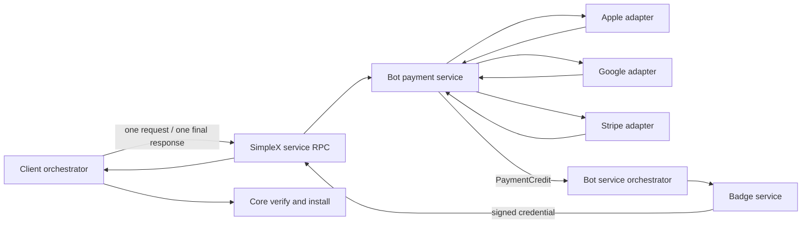
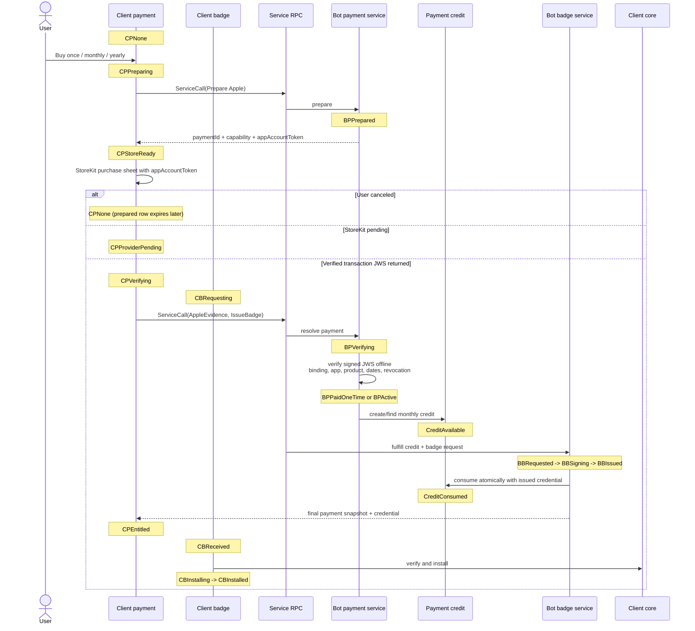
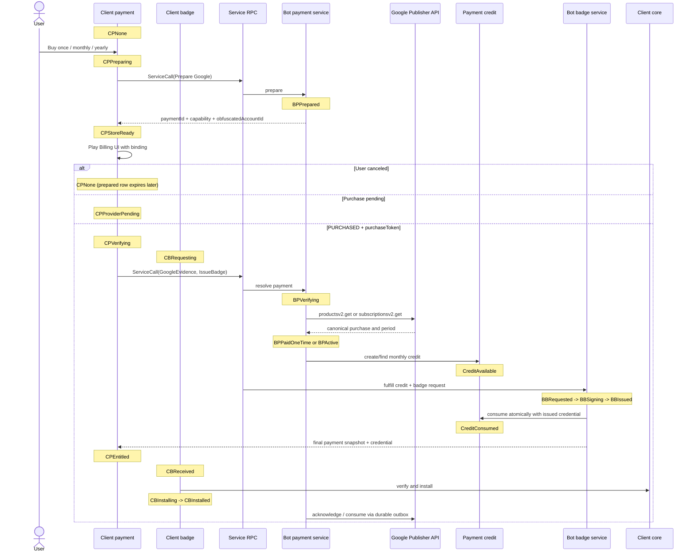
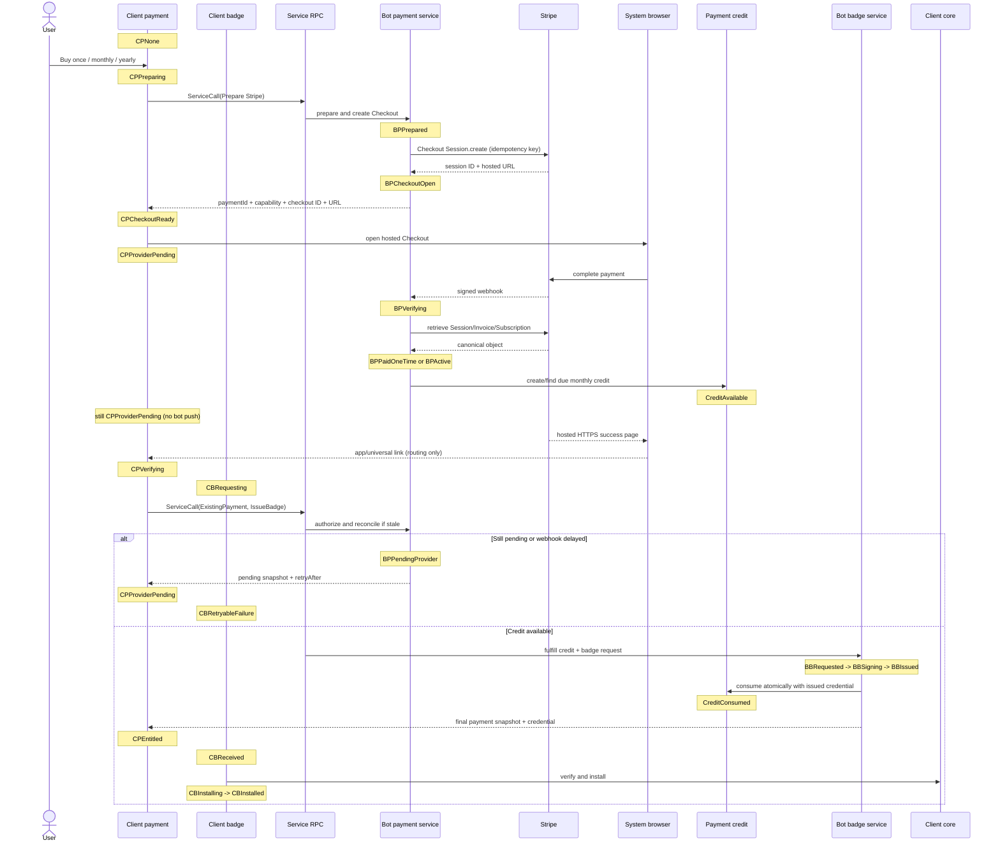
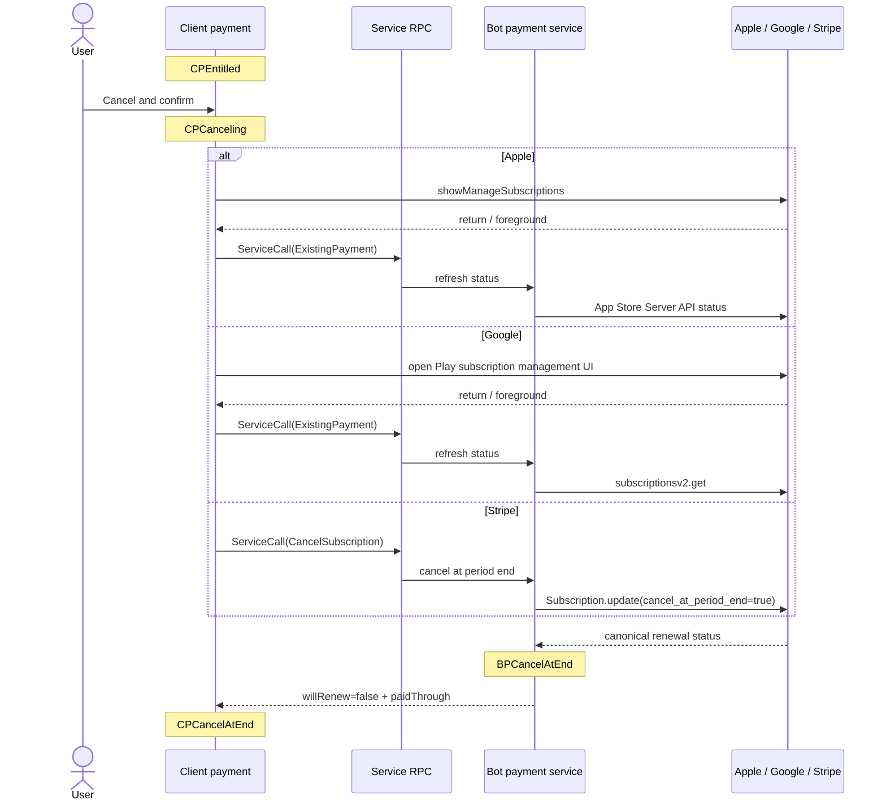

# Supporter Badges v2 — Implementation Plan

**Date:** 2026-07-21
**Status:** implementation-ready design
**Companion:** [Product and UX plan](2026-07-20-supporter-badges-v2-product.md)

Payment and badge issuance are separate state machines. Provider verification produces a provider-neutral `PaymentCredit`; badge issuance consumes it. Every RPC below names the client and bot state transition caused by that message.


## Contents

- [1. Decisions and current gaps](#1-decisions-and-current-gaps)
- [2. Boundaries and invariants](#2-boundaries-and-invariants)
- [3. Canonical states](#3-canonical-states)
- [4. RPC and internal contracts](#4-rpc-and-internal-contracts)
- [5. Message-driven lifecycles](#5-message-driven-lifecycles)
- [6. Persistence and `CallState` machinery](#6-persistence-and-callstate-machinery)
- [7. Reconciliation, errors, and retries](#7-reconciliation-errors-and-retries)
- [8. Provider rules](#8-provider-rules)
- [9. Security and concurrency](#9-security-and-concurrency)
- [10. Delivery and tests](#10-delivery-and-tests)
- [11. Code integration](#11-code-integration)
- [12. API references](#12-api-references)

## 1. Decisions and current gaps

The current `badge-service` is an issuance prototype, not a lifecycle service.

| Current code | Keep | Change |
|---|---|---|
| Apple JWS verification in `apple.py` | offline certificate/JWS verification | validate account binding/product/environment; add subscription status and notifications |
| Google `subscriptionsv2.get` in `google.py` | server verification | model every provider state; add products v2, acknowledgement/consume, RTDN |
| Stripe Payment Links and polling | configured price IDs | use per-attempt Checkout Sessions, signed webhooks, status and cancel APIs |
| `customData` state in `state.py` | request-hash idea | use transactional payment, credit, and badge tables |
| issued badge keyed by transaction/token | cached idempotent response | key by monthly credit and master-key hash; a Google token may survive renewals |
| wire request/reply | discriminated union | carry one application request and one final response over service RPC |
| CLI-only badge install | verification logic | expose a non-CLI core install command |

Provider research confirms the design used below:

- the backend, not local store state or a redirect, owns entitlement truth;
- Apple initial proof is verified offline; Google initial proof requires an Android Publisher API request;
- provider notifications/webhooks only update bot payment state; this RPC transport cannot push to a client;
- Stripe Checkout fulfillment requires a webhook or later API reconciliation; the success redirect is routing only;
- Apple/Google cancellation uses store UI; Stripe cancellation uses the bot RPC.

## 2. Boundaries and invariants

### 2.1 Components



Treat each box as a separate program with a typed interface:

- **Payment service** knows provider proof, product ID, billing status, and service-credit schedule. It never sees the badge master key or credential.
- **Badge service** accepts a valid credit plus a badge request. It never calls a payment provider or interprets billing state.
- **Orchestrator** resolves payment first, then optionally fulfills the requested service in the same RPC.
- **Client payment machine** and **client badge machine** persist and transition independently.
- **Bot payment machine**, **payment credit machine**, and **bot badge machine** persist and transition independently.

### 2.2 `PaymentCredit`

```haskell
data PaymentCreditState = CreditAvailable | CreditConsumed | CreditVoided

data PaymentCredit = PaymentCredit
  { creditId :: CreditId
  , paymentId :: PaymentId
  , productId :: ServiceProductId
  , slotStart :: UTCTime
  , creditState :: PaymentCreditState
  }
```

A credit means only: “this verified payment may request this product once for this monthly slot.” It contains no badge fields, master key, or credential and does not activate perks. The badge service maps `productId` and `slotStart` to its credential policy and expiry.

- One-time: one credit at verified purchase time.
- Monthly subscription: one credit per paid monthly period.
- Yearly subscription: one credit becomes available per monthly slot inside the paid annual period.
- Unique key: `(payment_id, product_id, slot_start)`.
- Consuming a credit and recording the badge result are one idempotent operation keyed by `(credit_id, master_key_hash)`.
- Refund/revocation voids unused credits. v2 does not revoke already-issued credentials; their short expiry bounds exposure.

### 2.3 Time rules

Billing and badge clocks are deliberately different.

- `paidThrough` is the provider billing-period end.
- For subscriptions, `slotStart(n) = addCalendarMonths(n, verifiedSubscriptionAnchor)` and a slot is eligible only when `slotStart <= now < paidThrough`.
- The badge service computes `badgeExpiresAt = startOfMonth(addCalendarMonths(2, slotStart))`.
- Example: pay **21 July** → next monthly bill **21 August**, but the badge expires **1 September 00:00 UTC** and is displayed as valid through **31 August**.
- The **21 August** paid slot produces a badge through **30 September**. A yearly plan still renews billing next July, while credits become available monthly.

### 2.4 Invariants

1. A provider adapter can transition only payment state and create/void credits.
2. Badge signing requires `CreditAvailable` and a client-supplied master key.
3. Payment state never contains signing, delivery, or installation state. Badge state never contains renewal or provider state.
4. Credential signature, issuer key, and expiry are the only badge-validity truth.
5. Provider object IDs bind to exactly one prepared payment capability.
6. Every mutation is idempotent; duplicate RPCs, notifications, and webhooks produce the same state/result.
7. Unknown provider values and illegal transitions preserve the previous state and return a typed error; they are never guessed.
8. RPC has no stable caller identity and no bot-initiated message. Every operation supplies the payment capability and receives exactly one final response.


## 3. Canonical states

These tables are the single state catalog. Every persisted transition and every state marker in section 5 uses these names.

### 3.1 Client payment state

| State | Meaning | Leaves on |
|---|---|---|
| `CPNone` | no local payment | user starts purchase |
| `CPPreparing` | prepare RPC in flight | prepare response/error |
| `CPStoreReady` | Apple/Google binding received | native purchase result |
| `CPCheckoutReady` | Stripe URL and checkout ID received | browser opened/checkout replaced |
| `CPProviderPending` | store approval or Stripe completion pending | proof/status result |
| `CPVerifying` | proof/status RPC in flight | canonical response/error |
| `CPEntitled` | last bot snapshot is paid/eligible | refresh, cancel, provider change |
| `CPCanceling` | Stripe cancel RPC in flight or store UI open | refreshed snapshot/error |
| `CPCancelAtEnd` | renewal off; paid through a future date | resubscribe/expiry |
| `CPProblem` | grace/on-hold/provider/transient failure | retry/recovery |
| `CPExpired` | no remaining entitlement | new purchase |

`CPProblem` stores the last canonical snapshot, typed error, and `nextRetryAt`; it does not erase an active badge.

### 3.2 Bot payment state

| State | Meaning | Typical entry |
|---|---|---|
| `BPPrepared` | payment ID, capability, plan, and account binding stored | prepare RPC |
| `BPCheckoutOpen` | live Stripe Checkout Session stored | Stripe Session creation |
| `BPPendingProvider` | approval/asynchronous payment pending | provider status |
| `BPVerifying` | provider reconciliation claimed by one worker | proof/status/webhook |
| `BPPaidOneTime` | one-time payment verified | provider verification |
| `BPActive` | subscription paid through `periodEnd`, renewal on | provider verification |
| `BPGrace` | provider explicitly grants grace | provider verification |
| `BPOnHold` | payment failed; no new credit | provider verification |
| `BPPaused` | provider paused entitlement | provider verification |
| `BPCancelAtEnd` | renewal off, still paid through `periodEnd` | store status/cancel RPC |
| `BPExpired` | paid period ended | reconciliation |
| `BPRefunded` | verified refund/chargeback | provider event/API |
| `BPRevoked` | provider revoked entitlement | provider event/API |

`BPVerifying` is a recoverable work marker with `previousState`, lease owner, and lease expiry. A crash returns to reconciliation without losing the prior canonical snapshot.

### 3.3 Credit state

| State | Transition |
|---|---|
| `CreditAvailable` | created only from a verified eligible period/slot |
| `CreditConsumed` | badge result durably recorded for the credit/key pair |
| `CreditVoided` | unused credit invalidated by verified refund/revocation |

### 3.4 Client badge state

| State | Meaning |
|---|---|
| `CBNone` | no locally usable credential |
| `CBNeeded` | payment response exposed an available credit |
| `CBRequesting` | service request in flight |
| `CBReceived` | credential response durably cached, not installed |
| `CBInstalling` | core verification/install in progress |
| `CBInstalled` | credential verified and installed |
| `CBRetryableFailure` | transient RPC/sign/install failure; old badge retained |
| `CBFinalFailure` | invalid credential/protocol/key; update or support required |

### 3.5 Bot badge state

| State | Meaning |
|---|---|
| `BBRequested` | credit/key idempotency record created |
| `BBSigning` | signing work claimed by one worker |
| `BBIssued` | credential cached and credit consumed |
| `BBRetryableFailure` | safe to repeat same logical request |
| `BBFinalFailure` | malformed key/product or permanently unsupported request |

No `BBInstalled` exists: installation belongs only to the client.

## 4. RPC and internal contracts

### 4.1 Unified service call

The application payload lets payment resolution and a service request share one roundtrip without coupling their implementations.

```haskell
data ServiceCall = ServiceCall
  { requestId :: RequestId
  , payment :: PaymentInput
  , request :: Maybe ServiceRequest
  }

data PaymentInput
  = Prepare Provider ServiceProductId PurchaseKind
  | AppleEvidence PaymentId Capability SignedTransactionJWS
  | GoogleEvidence PaymentId Capability PurchaseToken
  | ExistingPayment PaymentId Capability
  | CancelSubscription PaymentId Capability
  | CreatePortal PaymentId Capability

data ServiceRequest
  = IssueBadge MasterKey (Maybe CreditId)
```

```haskell
data ServiceResponse = ServiceResponse
  { requestId :: RequestId
  , payment :: PaymentSnapshot
  , credit :: Maybe PaymentCreditSummary
  , service :: Maybe (Either ServiceError BadgeCredential)
  , retryAfter :: Maybe NominalDiffTime
  }
```

Rules:

- `Prepare` cannot include `IssueBadge`; no credit exists yet.
- Apple/Google purchased evidence may include `IssueBadge`, so verification and issuance complete in one RPC.
- Stripe prepare returns `CPCheckoutReady`; after webhook/API reconciliation, `ExistingPayment + IssueBadge` completes issuance in one later RPC.
- If payment is pending, the final response contains the canonical snapshot, no service result, and `retryAfter`.
- A `creditId` is a selector only. The bot independently resolves eligibility and rejects a credit belonging to another payment/product.

### 4.2 Internal program boundary

```haskell
resolvePayment :: PaymentInput -> Transaction PaymentDecision
fulfillBadge  :: PaymentCredit -> BadgeRequest -> Transaction BadgeResult
```

The orchestrator performs:

1. authorize capability and resolve provider-neutral payment decision;
2. commit payment transition and create/find the due credit;
3. if a service request exists, pass only that credit and request to the badge service;
4. persist `BBIssued` and `CreditConsumed` atomically, then return the cached credential.

Provider calls/signing happen outside long DB transactions. Leases plus compare-and-swap versions make crash recovery explicit.

### 4.3 Correlation, replay, and audit

- `requestId` is stable for one logical operation and bound to a canonical request hash. Same ID/body returns the stored response; same ID/different body returns `idempotency_mismatch`.
- The RPC transport separately deduplicates exact encrypted request bytes for its bounded 1–24 hour replay window. Application idempotency outlives that window.
- Stripe mutation idempotency keys derive from `requestId` and operation.
- Every attempt and final result is visible in **Developer Tools → Chat Console** with timestamp, request ID, method, payment ID suffix, state before/after, retry class, and duration.
- Console/log redaction removes capability, JWS, purchase token, checkout URL query, return token, master key, credential bytes, and provider/customer IDs.

## 5. Message-driven lifecycles

State notes show exactly which party changes state. A dashed response never changes bot state unless its preceding bot note says so.

### 5.1 Apple purchase — offline initial verification



The initial Apple transaction is verified offline. Later subscription status/recovery uses App Store Server API and signed Notifications V2.

### 5.2 Google purchase — server API verification



The bot commits entitlement before acknowledgement/consume and retries the provider action durably. The client does not race it unless the bot explicitly requests a compatibility fallback.

### 5.3 Stripe — F-Droid and desktop



No localhost listener is used. The hosted return page works for F-Droid and desktop. If return routing fails, foreground/status reconciliation finds the payment. Poll new RPCs after 5, 15, 30, 60, and 120 seconds, then stop until a normal trigger. The bot never pushes.

Stripe subscription cancellation is only through `CancelSubscription` RPC. Customer Portal may support invoices and payment-method changes, but subscription cancellation is disabled there.

### 5.4 Cancellation and status refresh



Timeout/error leaves the last canonical state intact and moves the client to `CPProblem`; the UI must not claim cancellation until the response confirms `willRenew=false`. “Already canceled” is idempotent success.

## 6. Persistence and `CallState` machinery

### 6.1 Pattern to mirror

The implementation must mirror the existing `data CallState` machinery, not merely copy its naming:

- closed sum constructors carry only fields valid in that state;
- a small tag enum/projection supports SQL queries;
- `deriveJSON (singleFieldJSON fstToLower)` provides stable tagged JSON;
- explicit `ToField`/`FromField` encode SQL `TEXT` and reject unknown tags;
- typed store functions reconstruct the full sum and fail on inconsistent columns;
- the controller keeps runtime `TMap`s and per-payment locks, as calls do;
- command/subscriber transitions pattern-match current state and return a typed invalid-state error;
- migrations add every new tag/column before code can emit it.

Reference implementations in this repository:

- `src/Simplex/Chat/Call.hs` — `CallState`, state tags, JSON/DB instances;
- `src/Simplex/Chat/Store/Profiles.hs` — typed reads/writes;
- `src/Simplex/Chat/Library/Commands.hs` and `Library/Subscriber.hs` — transition sites;
- `src/Simplex/Chat/Controller.hs` — runtime maps and concurrency ownership.

Define separate sums: `ClientPaymentState`, `ClientBadgeState`, `BotPaymentState`, `PaymentCreditState`, and `BotBadgeState`. Do not use one broad record with nullable fields as the state machine.

### 6.2 Client tables

`badge_payments` owns payment state and scheduling:

- payment ID, provider, product/kind/interval, state tag + state payload;
- encrypted capability and master key, provider binding/proof reference;
- canonical `paidThrough`, `willRenew`, last checked, next retry, version.

`badges` owns credential workflow:

- badge row ID, payment ID, credit ID/slot start, master-key hash;
- state tag + state payload, credential cache, expiry, attempt/error, version.

They live alongside each other and join only by `payment_id`/`credit_id`. Active profile projection is updated only after core installation.

### 6.3 Bot tables

| Table | Purpose / important uniqueness |
|---|---|
| `payments` | canonical bot payment sum; unique provider object ownership |
| `payment_credits` | credit sum; unique `(payment_id, product_id, slot_start)` |
| `badge_issuances` | badge sum and cached credential; unique `(credit_id, master_key_hash)` |
| `rpc_requests` | request hash + stored final response; unique request ID |
| `provider_events` | raw-reference/dedupe/result; unique provider event ID |
| `outbox` | acknowledge, consume, notification reconciliation, cleanup |

All mutations use optimistic version checks or a per-payment row lock. A webhook and RPC call share the same transition functions.

## 7. Reconciliation, errors, and retries

### 7.1 Client reconciliation

Triggers: launch, profile switch, foreground, network restored, store purchase update, browser/app-link return, manual retry, six-hour jittered timer, and `paidThrough`/badge-expiry boundaries.

```text
reconcile(paymentId):
  coalesce: one worker per payment
  render cached payment and installed badge independently
  submit unseen Apple/Google evidence
  call ExistingPayment for every nonterminal payment
  if response exposes CreditAvailable and no installed badge covers that slot:
      repeat same logical call with IssueBadge
  if credential is returned:
      cache -> core verify/install -> persist CBInstalled
  schedule next check; never infer payment expiry from the local clock alone
```

Stripe browser-return polling uses elapsed 5 s, 15 s, 30 s, 60 s, and 120 s attempts. Other transient work uses 5 s, 30 s, 2 min, 15 min, then 6 h with jitter. Respect `retryAfter`. Background work is opportunistic; foreground reconciliation is required.

### 7.2 Total response handling

Every input has exactly one of four outcomes:

1. **Apply** a legal transition and return the new snapshot/result.
2. **Idempotent success**: return the already-stored snapshot/result.
3. **Retry**: preserve canonical state, store typed error/next retry, return `retryAfter`.
4. **Reject/quarantine**: preserve canonical state, return a safe final error, alert operators where appropriate.

| Code / signal | Outcome | Client reaction | Bot reaction |
|---|---|---|---|
| `payment_pending` | Retry | `CPProviderPending`; poll/schedule | keep `BPPendingProvider` |
| provider timeout/429/5xx | Retry | `CPProblem`; show cached state | backoff; retain snapshot |
| response lost | Retry | repeat identical request ID/body | return cached response or continue lease |
| `idempotency_mismatch` | Reject | new ID only for genuinely new action | preserve state; security telemetry |
| invalid/foreign capability or binding | Reject | restore/support; no details | preserve state; rate-limit |
| invalid proof / unknown product | Reject | no blind retry; update/support | preserve/quarantine; alert config owner |
| provider unknown enum/event | Reject/quarantine | stale state + retry later | re-fetch object; no guessed transition |
| entitled + `CreditAvailable` | Apply | `CBNeeded`/request issue | fulfill if requested |
| credit already consumed | Idempotent success | install returned cached credential | return matching issuance; reject other key |
| signing/provider temporarily unavailable | Retry | retain old badge; backoff | `BBRetryableFailure`/outbox retry |
| invalid master key/credential/protocol | Reject | `CBFinalFailure`; update/support | `BBFinalFailure`; never consume credit |
| install crash after response | Retry locally | resume `CBReceived -> CBInstalling` | no bot change |
| cancel timeout | Retry | keep renewal label; never say canceled | retain state; reconcile provider |
| already canceled | Idempotent success | `CPCancelAtEnd` | return refreshed `BPCancelAtEnd` |
| user dismisses store UI | Idempotent exit | restore prior client state | prepared row expires later |
| Apple/Google pending purchase | Retry | `CPProviderPending`; listen/query | no credit |
| Stripe Session expired/async failed | Reject attempt | offer a new checkout on user action | close attempt; no credit |
| refund/revocation | Apply | show payment ended; installed badge lives to signed expiry | void unused credits; no future credit |
| DB unavailable during webhook | Retry delivery | no immediate client effect | return non-2xx; provider retries |

Never expose raw provider exceptions. Stable response codes include `bad_request`, `unsupported_version`, `payment_pending`, `payment_not_entitled`, `ownership_conflict`, `proof_invalid`, `provider_rate_limited`, `provider_unavailable`, `idempotency_mismatch`, `badge_already_issued`, `signing_failed`, and `internal_error`.

### 7.3 Crash boundaries

- Before provider call: repeat the same request.
- Provider succeeds before local commit: retrieve by provider idempotency key/object binding and reconcile.
- Payment committed before service fulfillment: credit remains available.
- Credential signed before response: cached `BBIssued` is returned on repeat.
- Response received before client install: resume from `CBReceived` without a new charge.
- Duplicate/out-of-order event: dedupe, re-fetch current object, apply monotonic transition.

## 8. Provider rules

| Rail | Initial verification | Ongoing truth | Cancel UX | Required details |
|---|---|---|---|---|
| Apple | verify StoreKit signed transaction JWS offline | App Store Server API + Notifications V2 | `showManageSubscriptions`; App Store fallback | bind `appAccountToken`; validate chain, bundle, environment, product, transaction, dates, revocation; identity is `originalTransactionId` |
| Google | Android Publisher products v2/subscriptions v2 GET | Publisher API + RTDN | Play subscription-management UI | bind obfuscated account ID; model pending/active/grace/on-hold/paused/canceled/expired; follow linked-token chain; durable acknowledge/consume |
| Stripe | retrieve Checkout Session/PaymentIntent/Invoice | signed webhook + API retrieval | bot `CancelSubscription` RPC only | server-selected allowlisted Price; Checkout idempotency; raw-body signature; paid invoice required for subscription credit |

Additional rules:

- Apple one-time is a consumable/non-renewing product according to App Store configuration; finish only after durable attachment. Initial JWS needs no Apple API roundtrip.
- Google one-time uses `purchases.productsv2.getproductpurchasev2`; subscriptions use `purchases.subscriptionsv2.get`. A token is not a renewal-period ID.
- Stripe uses `mode=payment|subscription`, `client_reference_id=paymentId`, and a hosted HTTPS `success_url`. No amount, Price, Customer, or redirect URL comes from the client.
- Stripe webhook, completion page, and status RPC call the same reconciliation function. `checkout.session.completed` with `payment_status=unpaid` remains pending. Subscription credit requires a paid invoice, not merely `status=active`.
- The Stripe return token routes to a local payment only. It is not authorization and contains no capability.
- Customer Portal cancellation is disabled; portal sessions may be created for invoices/payment methods.
- Normal Google cancellation is UI-driven; the Publisher cancel API is operator/recovery only. Apple cannot be canceled by the bot.

## 9. Security and concurrency

- Verify provider signatures/objects server-side; never trust client-decoded fields or redirect parameters.
- Hash capabilities at rest; encrypt retained JWS/tokens/provider identifiers; rotate keys.
- The raw master key is client-encrypted at rest and exists on the bot only during signing. Store only its hash afterward.
- Allowlist product, app/package, environment, currency/price, and provider account binding.
- Rate-limit by payment/operation and cap payload sizes. RPC has no persistent contact identity.
- Serialize payment mutations with a lock/version. Provider events and RPC use the same transition functions.
- Use transactional outboxes for provider actions and event work. Alert on stale verification leases, acknowledgement deadline, webhook lag, and signing failures.
- Trust issuer keys shipped with the client. Unknown issuer/protocol produces `CBFinalFailure`/update UX.

## 10. Delivery and tests

1. **Schema and protocol:** all five sums/codecs, client and bot migrations, credit boundary, request ledger, redacted Chat Console audit, core install command.
2. **Apple and Google:** prepare binding, evidence verification, complete provider-state mapping, notification/RTDN ingestion, acknowledgement/consume, native purchase and management UI.
3. **Stripe:** Checkout Sessions, hosted completion/deep link, raw-body webhook, API reconciliation, cancel RPC, restricted portal.
4. **UX and hardening:** reconciliation scheduler, every product UX state/error, migrations from existing bot state, telemetry and cleanup.

Required tests:

- JSON/SQL golden roundtrips for every constructor and rejection of unknown/inconsistent rows;
- property tests for every legal/illegal transition in all five machines;
- sequence tests asserting each message changes only the named owner state;
- Apple offline JWS and later status/notification cases;
- Google pending, linked-token renewal, grace/hold/pause/cancel, acknowledge/consume retry;
- Stripe async payment, paid invoice, monthly/yearly credit schedule, cancellation, closed browser/app, delayed/duplicate/reordered webhooks;
- July 21 → August 31 badge expiry and August 21 billing/next-slot boundary;
- crash/replay at every boundary in section 7.3;
- Chat Console coverage and secret-redaction snapshots for every RPC variant;
- cross-payment capability, credit, and master-key isolation.

Release gates: provider sandbox end-to-end tests, webhook signature/replay tests, schema rollback test, store-policy review, no unresolved state/error handling, and operational dashboards.

## 11. Code integration

| Location | Work |
|---|---|
| new `Simplex.Chat.Badges.Lifecycle` | client state sums, tags/codecs, transitions, reconciliation |
| `Simplex.Chat.Library.Commands.addUserBadge` | safe non-CLI credential install returning updated user |
| RPC client/controller and console | unified calls, response handling, redacted audit records |
| client store/migrations | separate `badge_payments` and `badges` typed stores |
| Kotlin/Swift UI | derive Product Plan state from payment snapshot + installed badge |
| bot payment service/repository | replace `customData`; provider adapters, credits, transitions, outbox |
| bot badge service/repository | consume credit, sign, cache idempotent credential; no provider imports |
| `badge-service/apple.py` | offline proof validation plus server subscription reconciliation |
| `badge-service/google.py` | full Publisher mapping, period identity, ack/consume |
| `badge-service/stripe_api.py` | Checkout, webhook, status, cancel, restricted portal |
| `badge-service/wire.py` | versioned `ServiceCall`/`ServiceResponse`; retain v1 during migration |

## 12. API references

| Provider | Client | Server/events |
|---|---|---|
| Apple | [StoreKit](https://developer.apple.com/storekit/) purchase, transaction updates, `showManageSubscriptions` | [Get All Subscription Statuses](https://developer.apple.com/documentation/appstoreserverapi/get-all-subscription-statuses), transaction history, Notifications V2 |
| Google | [Play Billing](https://developer.android.com/google/play/billing/integrate) purchase/query/manage UI | [`productsv2.getproductpurchasev2`](https://developers.google.com/android-publisher/api-ref/rest/v3/purchases.productsv2/getproductpurchasev2), [`subscriptionsv2.get`](https://developers.google.com/android-publisher/api-ref/rest/v3/purchases.subscriptionsv2/get), RTDN |
| Stripe | hosted browser and app/universal link | [Checkout Session create](https://docs.stripe.com/api/checkout/sessions/create), [fulfillment](https://docs.stripe.com/checkout/fulfillment), [webhooks](https://docs.stripe.com/webhooks), [subscription events](https://docs.stripe.com/billing/subscriptions/webhooks), [cancel](https://docs.stripe.com/billing/subscriptions/cancel), [Customer Portal](https://docs.stripe.com/customer-management/integrate-customer-portal) |

SimpleX transport semantics are defined by the [`simplexmq` service RPC RFC](https://github.com/simplex-chat/simplexmq/blob/rpc/rfcs/2026-07-11-service-rpc.md): one short-lived request/reply exchange, no persistent caller identity, and no service-initiated messages.
