# Supporter Badges v2 — Implementation Plan

**Date:** 2026-07-21
**Status:** implementation-ready
**Companion:** [Product and UX plan](2026-07-20-supporter-badges-v2-product.md)

An **order** (`orderId` = client UUID, authenticated by an Ed25519 `orderKey`) carries a `product` and a `payment`. Payment verification creates a provider-neutral `ServiceGrant`; badge issuance fulfills it. Payment and badge are separate state machines on client and bot. Order / product(badge) / payment are decoupled and product-extensible.

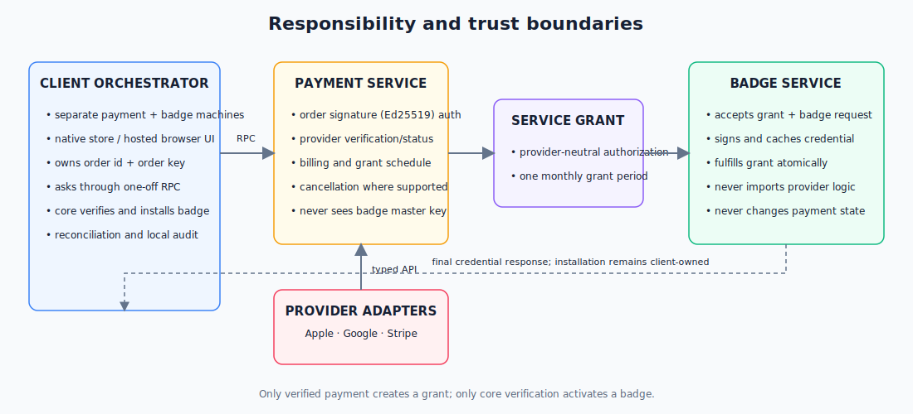

## Contents

- [1. Architecture](#1-architecture)
- [2. State machines](#2-state-machines)
- [3. Contracts](#3-contracts)
- [4. Provider flows](#4-provider-flows)
- [5. Persistence and `CallState` pattern](#5-persistence-and-callstate-pattern)
- [6. Reconciliation and errors](#6-reconciliation-and-errors)
- [7. Provider rules](#7-provider-rules)
- [8. Recovery](#8-recovery)
- [9. Security and concurrency](#9-security-and-concurrency)
- [10. Delivery and tests](#10-delivery-and-tests)
- [11. API references](#11-api-references)
- [12. Open questions](#12-open-questions)

## 1. Architecture

### Responsibilities

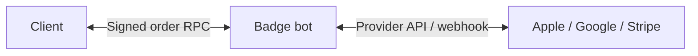

| Component | Owns | Must not own |
|---|---|---|
| Client order | `orderId`, `orderSk` key, purchase UI, cached status, retry schedule | bot/provider truth |
| Client badge | BBS master key, credential receipt and installation | billing state |
| Order service | order key registration, product pin, proof verification, billing state, grant schedule | badge master key, credential |
| Service grant | product and eligible monthly grant period | provider proof, credential |
| Badge service | signing and idempotent credential cache | provider/billing logic |
| Core | signature verification and installed badge | payment status |

Treat these as separate programs with typed interfaces.

### Invariants

1. Provider verification changes payment state only.
2. An order is identified by a client-generated `orderId` (UUID) and authenticated by its Ed25519 `orderKey`, registered on the create request and verified on every request (external envelope). No caller identity, no bot-issued token, no bot push.
3. The `product` is immutable per order: pinned on the first request; a differing product later is rejected.
4. For a badge product, the client supplies only the SKU (`plan`) and `BadgeMasterKey`; the bot derives tier/expiry and assembles `BadgeInfo`. The declared SKU must equal the SKU verified in `payment`.
5. `BadgeMasterKey` (32 random bytes, BBS message 0 via `generateMasterKey`) lives only inside the badge product; it signs the badge and is never an identifier or an auth credential.
6. Only `GrantReady` plus the badge product's master key enters badge signing; grant fulfillment and cached issuance are atomic/idempotent.
7. Payment never activates perks; the verified credential does.
8. Duplicate requests/events return the same result. Unknown states preserve prior state.
9. Provider dates create eligibility; retry/request time never changes badge expiry.

### Time and grant

```haskell
data ServiceGrantState = GrantReady | GrantFulfilled | GrantRevoked

data ServiceGrant = ServiceGrant
  { grantId :: GrantId
  , orderId :: OrderId
  , productId :: ServiceProductId
  , grantPeriodStart :: UTCTime
  , grantState :: ServiceGrantState
  }
```

- One-time: one grant at verified purchase time. Reject another one-time order for the same entitlement while its prior one-time service period is active.
- Subscription: `grantPeriodStart(n) = addCalendarMonths n verifiedAnchor` when `grantPeriodStart(n) <= now < paidThrough`.
- Monthly and yearly plans both expose one grant per eligible month.
- Badge service computes expiry as the start of the month two months after `grantPeriodStart`.
- Unique grant: `(order_id, product_id, grant_period_start)`.
- Example: 21 July grant period → badge expires 1 September; monthly billing renews 21 August.

Grant eligibility by payment state:

| State | New grant |
|---|---|
| `BPPaidOneTime` | its single unissued grant |
| `BPSubscriptionActive` | current due grant period through `paidThrough` |
| `BPGrace` | only while the provider explicitly reports entitlement |
| `BPEndsAtPeriodEnd` | due grant periods until `paidThrough` |
| all other states | none |


## 2. State machines

These names are canonical. Every transition is validated against the current constructor. All five machines hang off one **order** (`orderId`): the bot order aggregates a payment sub-state, a service grant, and a badge sub-state; the client mirrors payment and badge. "Issue" below is the badge-fulfilling step of a `Purchase` operation, not a separate call.

### Client payment

| State | Meaning |
|---|---|
| `CPNone` | no payment |
| `CPPreparing` | prepare RPC running |
| `CPStoreReady` | Apple/Google binding ready |
| `CPCheckoutReady` | Stripe URL ready |
| `CPAwaitingPayment` | payment/approval pending |
| `CPVerifying` | evidence/status RPC running |
| `CPEntitled` | last bot status is paid |
| `CPCanceling` | management/cancel operation running |
| `CPEndsAtPeriodEnd` | renewal off; paid time remains |
| `CPPaymentProblem` | typed error + prior snapshot + retry time |
| `CPExpired` | no entitlement remains |

### Bot payment

| State | Meaning |
|---|---|
| `BPPrepared` | order/key/binding stored |
| `BPCheckoutOpen` | Stripe Session stored |
| `BPAwaitingPayment` | provider not complete |
| `BPVerifying` | reconciliation lease active |
| `BPPaidOneTime` | verified one-time payment |
| `BPSubscriptionActive` | paid subscription, renewal on |
| `BPGrace` | provider grants grace |
| `BPOnHold` | failed payment; no new grant |
| `BPPaused` | provider paused entitlement |
| `BPEndsAtPeriodEnd` | renewal off; paid time remains |
| `BPExpired` | paid time ended |
| `BPRefunded` | verified refund/chargeback |
| `BPRevoked` | provider revoked entitlement |

`BPVerifying` stores prior state, lease owner, and lease expiry.

### Client badge

| State | Meaning |
|---|---|
| `CBNone` | no usable local badge |
| `CBNeeded` | grant available |
| `CBRequesting` | issue RPC running |
| `CBReceived` | response cached, not installed |
| `CBInstalling` | core verification/install running |
| `CBInstalled` | verified and installed |
| `CBRetryableFailure` | retry while retaining old badge |
| `CBFinalFailure` | update/support required |

### Bot badge

| State | Meaning |
|---|---|
| `BBRequested` | grant/key idempotency row created |
| `BBSigning` | signing lease active |
| `BBIssued` | credential cached; grant fulfilled |
| `BBRetryableFailure` | same request can retry |
| `BBFinalFailure` | invalid/permanently unsupported request |

Grant states are `GrantReady`, `GrantFulfilled`, and `GrantRevoked`. There is no bot “installed” state.

### State ownership

Client machines are a **coarse projection of the bot's authoritative state, plus local-only operation and install states**. States overlap only at the RPC boundary; the same suffix on `CP`/`BP` (or `CB`/`BB`) names a projected concept, never one shared mutable value.

Payment:

| Concept | Client | Bot | Scope |
|---|---|---|---|
| no payment | `CPNone` | (no row) | client-only |
| prepare running | `CPPreparing` | — | client-only |
| prepared / ready | `CPStoreReady` / `CPCheckoutReady` | `BPPrepared` / `BPCheckoutOpen` | both |
| awaiting payment | `CPAwaitingPayment` | `BPAwaitingPayment` | both |
| verifying | `CPVerifying` | `BPVerifying` | both (see note) |
| paid | `CPEntitled` | `BPPaidOneTime` / `BPSubscriptionActive` | both |
| grace | → `CPPaymentProblem` | `BPGrace` | bot-only |
| on-hold / paused | → `CPPaymentProblem` | `BPOnHold` / `BPPaused` | bot-only |
| cancel running | `CPCanceling` | — | client-only |
| renewal off | `CPEndsAtPeriodEnd` | `BPEndsAtPeriodEnd` | both |
| ended | `CPExpired` | `BPExpired` | both |
| refund / revoke | → `CPExpired` | `BPRefunded` / `BPRevoked` | bot-only |
| generic problem | `CPPaymentProblem` | (collapses grace/hold/paused/error) | client-only |

Badge:

| Concept | Client | Bot | Scope |
|---|---|---|---|
| none | `CBNone` | (no row) | client-only |
| grant available | `CBNeeded` | `GrantReady` | both |
| issuing | `CBRequesting` | `BBRequested` / `BBSigning` | both |
| issued / received | `CBReceived` | `BBIssued` | both |
| installing | `CBInstalling` | — | client-only |
| installed | `CBInstalled` | — | client-only |
| retryable failure | `CBRetryableFailure` | `BBRetryableFailure` | both |
| final failure | `CBFinalFailure` | `BBFinalFailure` | both |

Projection (bot → client): `BPPrepared`→`CPStoreReady`, `BPCheckoutOpen`→`CPCheckoutReady`, `BPAwaitingPayment`→`CPAwaitingPayment`, `BPVerifying`→`CPVerifying`, `BPPaidOneTime`/`BPSubscriptionActive`→`CPEntitled`, `BPGrace`/`BPOnHold`/`BPPaused`→`CPPaymentProblem`, `BPEndsAtPeriodEnd`→`CPEndsAtPeriodEnd`, `BPExpired`/`BPRefunded`/`BPRevoked`→`CPExpired`; and `GrantReady`(no badge)→`CBNeeded`, `BBRequested`/`BBSigning`→`CBRequesting`, `BBIssued`→`CBReceived`, `BB*Failure`→`CB*Failure`. Client-only states have no bot origin: `CPNone`, `CPPreparing`, `CPCanceling`, `CBNone`, `CBInstalling`, `CBInstalled`.

**Note — `Verifying` is not one event.** `CPVerifying` = a client RPC is in flight; `BPVerifying` = the bot holds a provider-reconciliation lease. Related, but different actors; the prefix disambiguates.

### State types

```haskell
data ClientPaymentState
  = CPNone | CPPreparing | CPStoreReady | CPCheckoutReady | CPAwaitingPayment
  | CPVerifying | CPEntitled | CPCanceling | CPEndsAtPeriodEnd | CPPaymentProblem | CPExpired

data BotPaymentState
  = BPPrepared | BPCheckoutOpen | BPAwaitingPayment | BPVerifying | BPPaidOneTime
  | BPSubscriptionActive | BPGrace | BPOnHold | BPPaused | BPEndsAtPeriodEnd
  | BPExpired | BPRefunded | BPRevoked

data ServiceGrantState = GrantReady | GrantFulfilled | GrantRevoked

data BotBadgeState = BBRequested | BBSigning | BBIssued | BBRetryableFailure | BBFinalFailure

data ClientBadgeState
  = CBNone | CBNeeded | CBRequesting | CBReceived | CBInstalling | CBInstalled
  | CBRetryableFailure | CBFinalFailure
```

Five separate closed sums; no state is shared as a value. A transition is legal only from the listed source constructor.

### Transitions

Bot payment:

| From | On | To |
|---|---|---|
| — | `Purchase` (create order) | `BPPrepared` |
| `BPPrepared` | Stripe Session created | `BPCheckoutOpen` |
| `BPPrepared` | Apple/Google receipt | `BPVerifying` |
| `BPCheckoutOpen` | webhook: paid | `BPVerifying` |
| `BPCheckoutOpen` | webhook: async pending | `BPAwaitingPayment` |
| `BPCheckoutOpen` | Checkout expired | `BPExpired` |
| `BPAwaitingPayment` | webhook/status complete | `BPVerifying` |
| `BPVerifying` | verified one-time | `BPPaidOneTime` |
| `BPVerifying` | verified subscription | `BPSubscriptionActive` |
| `BPVerifying` | not entitled | `BPAwaitingPayment` |
| `BPSubscriptionActive` | renewal invoice paid | `BPSubscriptionActive` |
| `BPSubscriptionActive` | provider grace | `BPGrace` |
| `BPSubscriptionActive` | billing retry, no entitlement | `BPOnHold` |
| `BPSubscriptionActive` | provider paused | `BPPaused` |
| `BPSubscriptionActive` | cancel at period end | `BPEndsAtPeriodEnd` |
| `BPGrace` / `BPOnHold` | recovered | `BPSubscriptionActive` |
| `BPPaused` | resumed | `BPSubscriptionActive` |
| `BPGrace` / `BPOnHold` | exhausted | `BPExpired` |
| `BPEndsAtPeriodEnd` | period end | `BPExpired` |
| `BPPaidOneTime` | service period end | `BPExpired` |
| any paid | refund / chargeback | `BPRefunded` |
| any paid | provider revoke | `BPRevoked` |

Service grant:

| From | On | To |
|---|---|---|
| — | payment enters an eligible state (§1) | `GrantReady` |
| `GrantReady` | credential cached | `GrantFulfilled` |
| `GrantReady` | refund / revoke | `GrantRevoked` |

Bot badge:

| From | On | To |
|---|---|---|
| — | `Purchase` issues on `GrantReady`, badge product master key present | `BBRequested` |
| `BBRequested` | claim signing lease | `BBSigning` |
| `BBSigning` | signed + cached (marks `GrantFulfilled`) | `BBIssued` |
| `BBSigning` | signing unavailable | `BBRetryableFailure` |
| `BBRequested` / `BBSigning` | invalid key / protocol | `BBFinalFailure` |
| `BBRetryableFailure` | retry | `BBSigning` |
| `BBIssued` | duplicate request | `BBIssued` |

Client payment:

| From | On | To |
|---|---|---|
| `CPNone` / `CPExpired` / `CPEndsAtPeriodEnd` | user buys | `CPPreparing` |
| `CPPreparing` | prepared (Apple/Google) | `CPStoreReady` |
| `CPPreparing` | prepared (Stripe) | `CPCheckoutReady` |
| `CPStoreReady` | purchased | `CPVerifying` |
| `CPStoreReady` | store pending | `CPAwaitingPayment` |
| `CPStoreReady` | store canceled | prior state |
| `CPCheckoutReady` | checkout opened | `CPAwaitingPayment` |
| `CPAwaitingPayment` | send `Purchase` (paid evidence) | `CPVerifying` |
| `CPVerifying` | bot paid | `CPEntitled` |
| `CPVerifying` | bot renewal-off | `CPEndsAtPeriodEnd` |
| `CPVerifying` | bot grace/hold/paused/error | `CPPaymentProblem` |
| `CPVerifying` | bot pending | `CPAwaitingPayment` |
| `CPEntitled` | refresh renewal-off | `CPEndsAtPeriodEnd` |
| `CPEntitled` | refresh problem | `CPPaymentProblem` |
| `CPEntitled` | refresh ended | `CPExpired` |
| `CPEntitled` | user cancels (Stripe) | `CPCanceling` |
| `CPCanceling` | bot renewal-off | `CPEndsAtPeriodEnd` |
| `CPCanceling` | error | `CPPaymentProblem` |
| `CPEndsAtPeriodEnd` | period end | `CPExpired` |
| `CPPaymentProblem` | resolved | `CPEntitled` |
| `CPPaymentProblem` | fix → reverify | `CPVerifying` |

Client badge:

| From | On | To |
|---|---|---|
| `CBNone` | grant available | `CBNeeded` |
| `CBInstalled` | new grant period | `CBNeeded` |
| `CBNeeded` | send `Purchase` (issue) | `CBRequesting` |
| `CBRequesting` | credential returned | `CBReceived` |
| `CBRequesting` | retryable | `CBRetryableFailure` |
| `CBRequesting` | final | `CBFinalFailure` |
| `CBReceived` | start install | `CBInstalling` |
| `CBInstalling` | installed | `CBInstalled` |
| `CBInstalling` | crash | `CBReceived` |
| `CBInstalling` | invalid credential | `CBFinalFailure` |
| `CBRetryableFailure` | retry | `CBRequesting` |

### Diagrams

Bot payment:

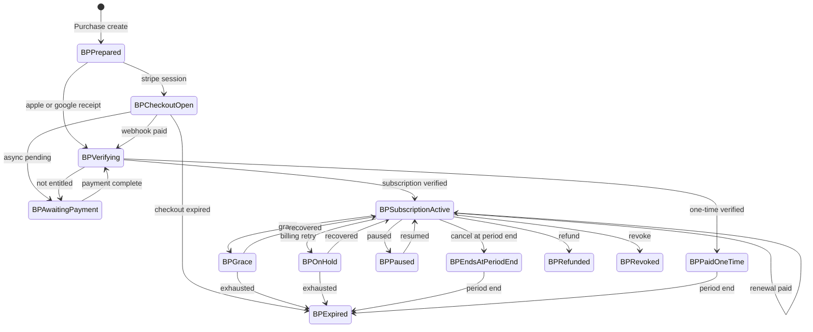

Bot grant and badge (cross-machine):

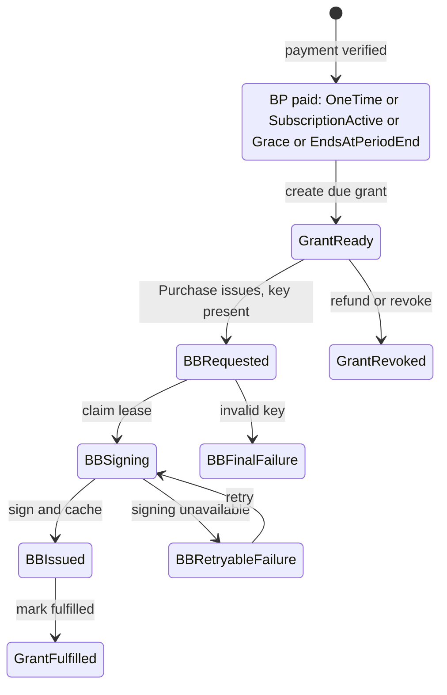

Client payment:

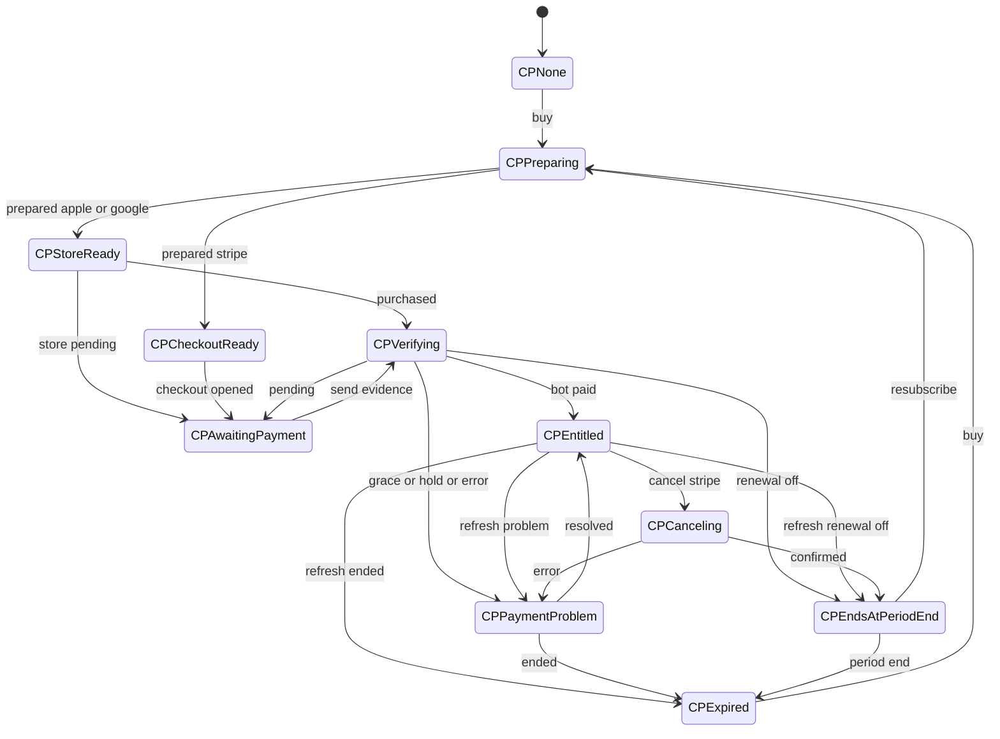

Client badge:

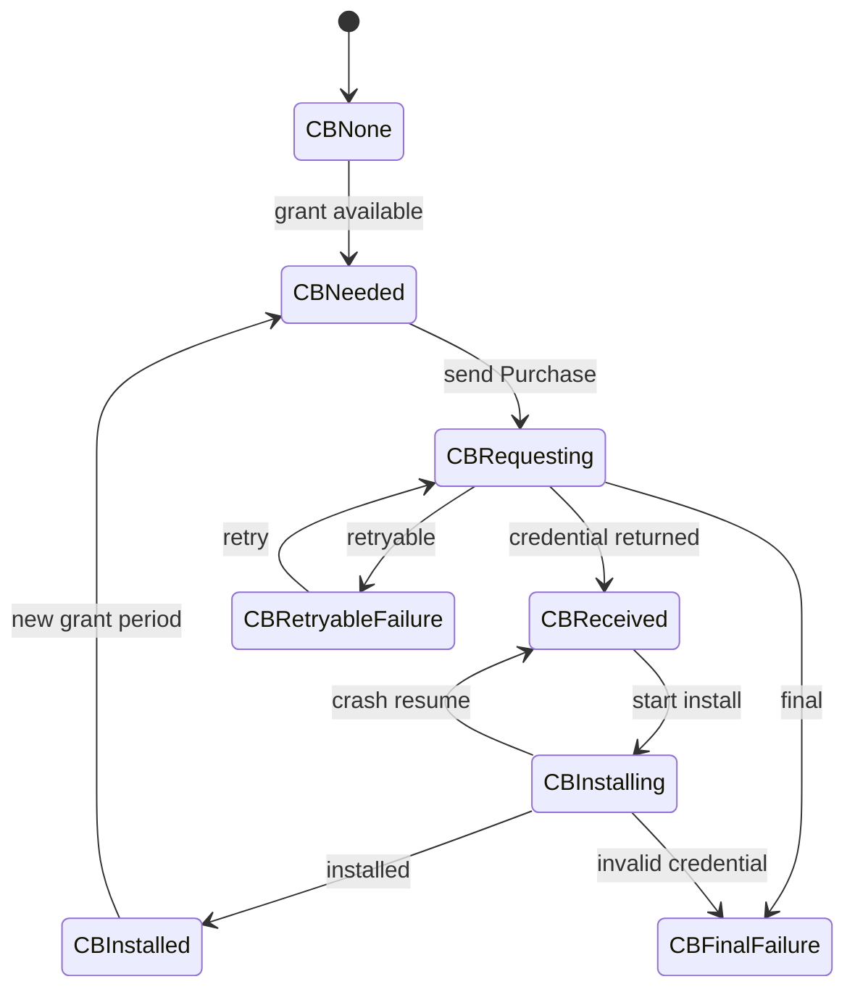

## 3. Contracts

An order is `product + payment`, identified by a client `orderId` and authenticated by an external Ed25519 signature. The command layer never reasons about auth.

### Envelope (external auth layer)

Mirrors the SMP signed transmission — **entity id, signature, body**.

```haskell
newtype OrderId   = OrderId UUID                    -- client-generated, e.g. "b1e2…-uuid"
newtype OrderKey  = OrderKey C.PublicKeyEd25519     -- order public key, registered on create
type    Signature = C.Signature 'C.Ed25519          -- over (orderId ‖ body), made with orderSk

data ServiceEnvelope = ServiceEnvelope
  { orderId   :: OrderId
  , signature :: Signature
  , body      :: ServiceRequest
  }
```

Signing (keygen → sign → verify):

1. On create, the client generates `(orderSk, orderPk)` and the `orderId` UUID, stores `orderSk` encrypted (backed up with the profile), and puts `orderPk` in `body.orderKey`.
2. The bot, seeing no order for `orderId`, treats it as create: stores `orderPk`, verifies the signature.
3. Every request signs `signature = sign(orderSk, orderId ‖ body)`. Later requests may omit `orderKey`; if present it must equal the stored `orderPk`. Mismatch ⇒ `order_auth_invalid`.

No `corrId`: `orderId` already correlates request↔response and keys idempotency (the SimpleX transport handles message delivery). Replay is benign — operations are idempotent by `orderId`, and the signature binds to `orderId` so a signed body cannot move to another order. Signing reuses the SMP `authTransmission` Ed25519 path. `orderSk` (order auth) and `BadgeMasterKey` (badge signing) are two distinct secrets.

### Request / response body

Every referenced type is defined here; existing `Simplex.Chat.Badges` types are reused, not redefined.

```haskell
data ServiceRequest = ServiceRequest
  { orderKey  :: Maybe OrderKey    -- required on create; must equal the stored key thereafter
  , operation :: Operation
  , product   :: Product
  , payment   :: Payment
  }

data Operation = Purchase | Cancel | Status         -- billing period is in the SKU, not here

newtype ServiceProductId = ServiceProductId Text    -- SKU, e.g. "supporter_monthly", "legend_onetime"

data Product = ProductBadge BadgeProduct            -- | ProductName NameProduct ...  (future)
data BadgeProduct = BadgeProduct
  { plan      :: ServiceProductId   -- SKU → tier × period (server-authoritative via badge_types[plan])
  , masterKey :: BadgeMasterKey     -- BBS delivery key; confined here, consumed at issuance
  }

data Payment  = PaymentApple AppleOp | PaymentGoogle GoogleOp | PaymentStripe StripeOp
newtype AppleOp  = AppleReceipt SignedTransactionJWS
newtype GoogleOp = GoogleReceipt PurchaseToken
data    StripeOp = StripeInvoice | StripePaid InvoiceId | StripeManage   -- Manage = cancel/status
newtype InvoiceId = InvoiceId Text

data ServiceResponse
  = RspInvoice    InvoiceRef         -- Stripe Checkout URL, or Apple/Google store binding
  | RspCredential BadgeCredential     -- reuse Simplex.Chat.Badges.BadgeCredential
  | RspStatus     OrderStatus
  | RspPortal     Url                 -- Stripe cancel-flow / management portal link
  | RspError      ServiceError
newtype InvoiceRef = InvoiceRef Text
newtype Url        = Url Text

data OrderStatus = OrderStatus
  { orderState  :: BotPaymentState, badgeState :: Maybe BotBadgeState
  , paidThrough :: Maybe UTCTime,   willRenew  :: Bool }

data ServiceError = ServiceError { code :: ErrorCode, message :: Text, retryAfter :: Maybe NominalDiffTime }
data ErrorCode
  = OrderAuthInvalid | ProductChanged | ProductMismatch
  | PaymentPending | PaymentNotEntitled | ProviderUnavailable | ProviderRateLimited
  | BadgeAlreadyIssued | SigningFailed
  | UnsupportedVersion | BadRequest | InternalError

-- The bot assembles the internal BadgeRequest { masterKey, badgeInfo } where
-- badgeInfo = BadgeInfo { badgeType = badge_types[plan]
--                       , badgeExpiry = Just end_of_next_month, badgeExtra = "" }.
```

Rules:

- **Invoice-or-badge, one order.** A `Purchase` with `StripeInvoice` returns `RspInvoice`; the same `orderId` with `StripePaid`/`AppleReceipt`/`GoogleReceipt` verifies and returns `RspCredential`. Renewals are later `Purchase`/`Status` requests on the same order.
- **Product is pinned per order.** The bot fixes `product` on the first request; a later differing product ⇒ `product_changed` ("invoice for A then claim paid on B ⇒ get lost").
- **Tier/period/expiry are server-derived; only `masterKey` is client-authoritative.** The bot resolves the tier from `badge_types[plan]`, sets `badgeExpiry = end_of_next_month`, `badgeExtra = ""`, and assembles the internal `BadgeRequest`. `badgeType` is never on the wire.
- **Declared SKU must equal the verified SKU** proven by `Payment` (Apple/Google receipt `productId`, Stripe `plan`); divergence ⇒ `product_mismatch`.
- Stripe stays event-driven: a `Purchase` with `StripePaid` may hold the call until the webhook confirms; it responds once after verified payment + issuance, or a terminal payment error.
- Stripe `Cancel`/`Status` (`StripeManage`) return a portal URL in `RspPortal`; the bot never cancels silently. When the order can't be identified, it returns the account-wide portal login page.
- The `BadgeMasterKey` never enters Stripe metadata or a return URL.

### Internal interface

```haskell
resolveOrder :: OrderId -> ServiceRequest -> Transaction OrderDecision
fulfillBadge :: ServiceGrant -> BadgeRequest -> Transaction BadgeResult
```

Order:

1. verify the envelope signature against the order's `orderKey` (create registers it);
2. load/pin the order's product; reject on `product_changed`;
3. resolve/verify payment; check the verified SKU equals the declared SKU (`product_mismatch`);
4. commit payment and create/load the due grant;
5. assemble `BadgeRequest` (masterKey + server-derived `badgeInfo`) and pass grant + request to the badge service;
6. cache issuance and mark grant fulfilled atomically;
7. return the single response.

### Idempotency and audit

- `orderId` keys idempotency: the same operation on the same order returns the stored response; a changed product returns `product_changed`.
- Transport replay dedupe is separate and shorter-lived.
- Stripe mutation idempotency key derives from `orderId` + operation.
- Developer Tools → Chat Console records start/result, order id suffix, operation, before/after states, retry class, and duration.
- Redact the Ed25519 signature, JWS/token, Checkout query/return token, `BadgeMasterKey`, credential, and provider/customer IDs.

## 4. Provider flows

Product outcomes are in the Product Plan. These diagrams show implementation boundaries only.

### Common grant → badge path

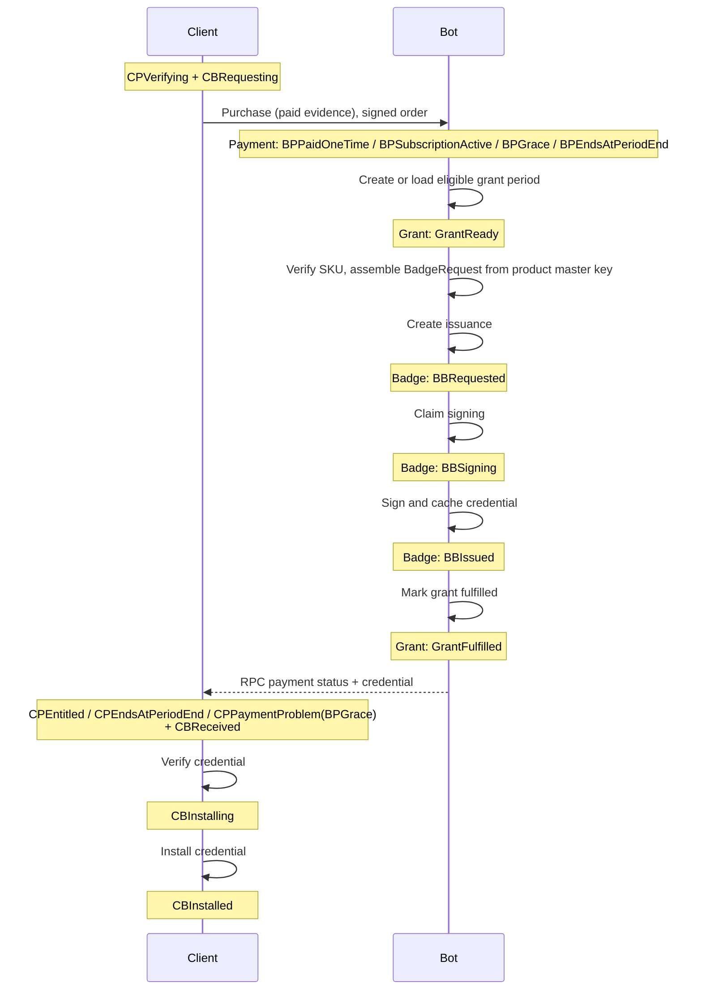

### Apple initial verification

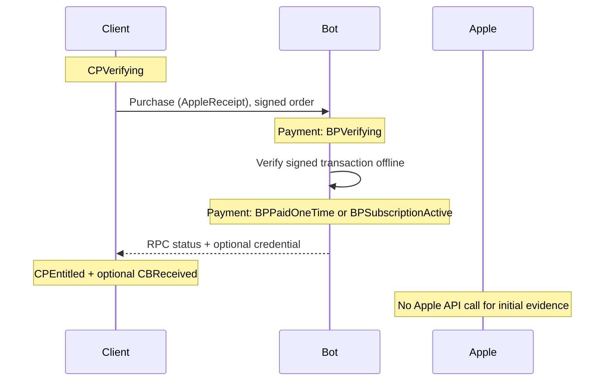

This path is offline. Status/restore uses App Store Server API; Notifications V2 only trigger reconciliation.

### Google verification

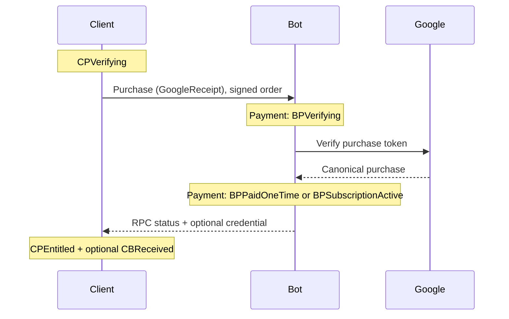

Commit entitlement before outbox acknowledgement/consume. RTDN triggers provider GET; never create a service grant from the notification payload.

### Stripe Checkout and waiting `Purchase`

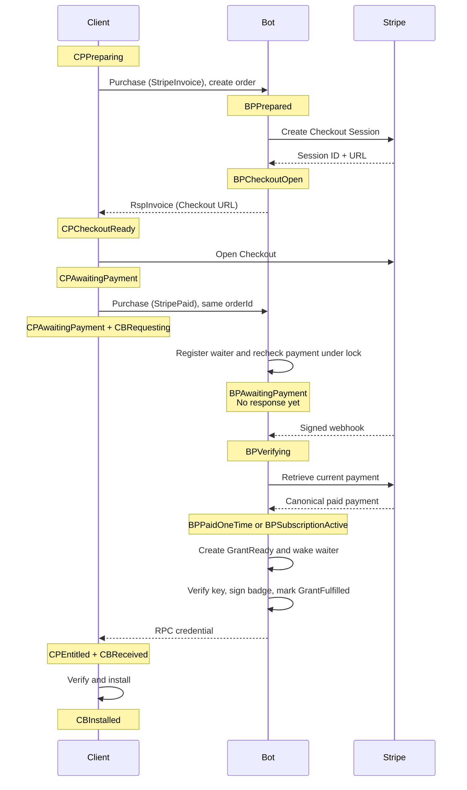

The second `Purchase` (`StripePaid`) has exactly one response. The bot sends it only after verified payment allows issuance, or after a terminal event such as Checkout expiry. Register-and-recheck under the order lock prevents a webhook/request race. If the webhook completed first, the `Purchase` responds immediately.

If Stripe retrieval fails transiently after the webhook, the bot keeps the call open and retries internally. It does not send an intermediate response; only the RPC deadline or a terminal payment result ends the wait.

Persist `orderId`, request hash, and result state; keep the live waiter and raw `BadgeMasterKey` only in memory. Webhook commit wakes live waiters after `GrantReady` is durable. After bot restart, the repeated `Purchase` rechecks persisted payment/grant state and either returns immediately or installs a new waiter.

### Stripe wait interruption

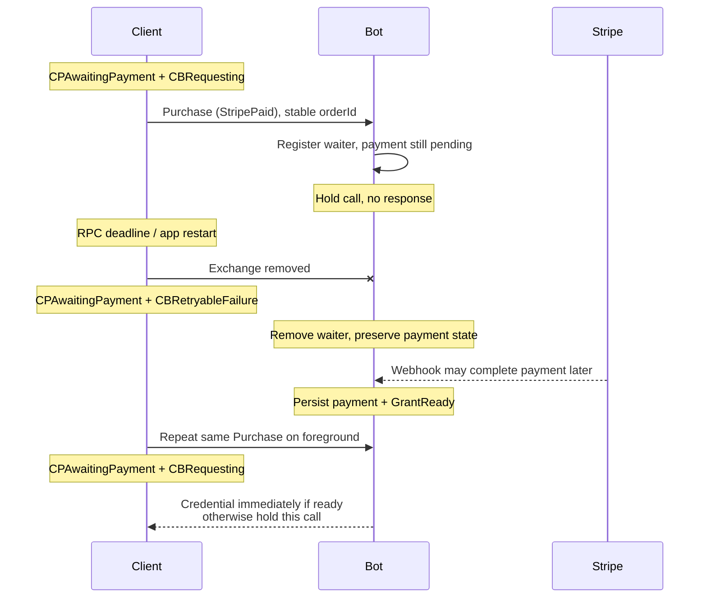

The client persists `orderId`, `orderSk`, and `BadgeMasterKey` before opening Checkout. It retries the same signed `Purchase` only after an interrupted exchange, foreground, or explicit user action—never on a polling timer. A deep link is optional UX; no localhost listener is used.

### Cancellation

| Provider | Client action | Bot action | Confirmed state |
|---|---|---|---|
| Apple | open Apple management UI; status RPC on return | App Store Server API status | `BPEndsAtPeriodEnd` |
| Google | open Play management UI; status RPC on return | `subscriptionsv2.get` | `BPEndsAtPeriodEnd` |
| Stripe | open a browser Customer Portal from a bot-provided link | return a portal link (session or login page); the portal performs the cancel, reconciled via `customer.subscription.updated` webhook | `BPEndsAtPeriodEnd` |

Failure preserves previous state; client shows Retry and still says **Renews on**. “Already canceled” is success. The bot never cancels a Stripe subscription itself: the hosted Customer Portal calls `cancel_at_period_end`, and the bot reconciles it from the webhook.

**Stripe cancel-link selection.** Cancellation is always in the browser portal; the bot chooses which link it returns based on whether the request identifies the customer:

| Client presents | Portal link the bot returns |
|---|---|
| a `Cancel` (`StripeManage`) on a known order (valid `orderKey` signature) | authenticated `billing_portal.Session` with `flow_data.type=subscription_cancel` — opens straight to the cancel flow, no email code |
| no identifiable order (total loss — `orderId`/`orderSk` gone) | the account-wide hosted portal **login page** (`prefilled_email` when the customer email is known), authenticated by email OTP |

The authenticated session link is short-lived and per-customer; the login page is the operator-config account-wide URL and returns no per-customer secret. The bot carries whichever link applies in `RspStatus` so a cancel path is always reachable. The `orderKey` signature is the sole client credential: the client either can sign for the order (session) or cannot (login page).

## 5. Persistence and `CallState` pattern

Mirror existing `data CallState` machinery:

- closed sums with state-specific fields;
- separate tag projection for queries;
- `deriveJSON (singleFieldJSON fstToLower)`;
- explicit SQL `TEXT` `ToField`/`FromField`;
- typed store reconstruction with inconsistent-row failure;
- controller `TMap` + per-payment locks;
- transition pattern matching + typed invalid-state errors;
- migrations before emitting new tags.

References: `Simplex.Chat.Call`, `Store.Profiles`, `Library.Commands`, `Library.Subscriber`, and `Controller`.

Define five separate sums (the `ClientPaymentState` / `BotPaymentState` / `ServiceGrantState` / `BotBadgeState` / `ClientBadgeState` types in §2). Do not encode state as one nullable record.

### Client tables

`orders`: `order_id` (client UUID), encrypted `order_sk` + `order_key`, encrypted `badge_master_key` (one per order, reused each renewal), provider/product SKU, payment state payload, `provider_ref`, `paid_through`, `will_renew`, checked/retry time, version.

`badges`: order id + grant-period + key hash, badge state payload, cached credential, expiry, attempt/error, version.

Join by order id and grant period only (the bot's `GrantId` is internal). Update active profile only after core installation.

### Bot tables

| Table | Unique key / purpose |
|---|---|
| `orders` | `order_id` (client UUID); `order_key`, pinned product SKU; canonical payment sum |
| `entitlements` | provider-object binding (`sub_`/`cus_` \| original-transaction \| token) → order; per-period re-issue counter |
| `service_grants` | order + product + grant period |
| `badge_issuances` | grant + master-key hash; cached credential |
| `rpc_requests` | order id + operation; pending waiter/result + request hash + response |
| `provider_events` | provider event ID; dedupe/result |
| `outbox` | acknowledge, consume, reconciliation, cleanup |

Provider calls/signing run outside long transactions. Leases and compare-and-swap versions recover crashes.

### Schema and types

Shared identifiers and enums:

```haskell
newtype OrderId        = OrderId UUID
newtype GrantId        = GrantId Int64
newtype ServiceProductId = ServiceProductId Text        -- SKU
newtype BadgeMasterKey = BadgeMasterKey ByteString       -- 32 random bytes; badge product only

data Provider = Apple | Google | Stripe
```

Bot tables (**PK** bold, → foreign key, ⊤ unique). The `state` column is a tag plus state-specific fields for the sum named in brackets.

- **`orders`** — one row per order. `order_id` **PK** (client UUID) · `order_key` (Ed25519 pub) · `provider` · `product_sku` (pinned) · `state` [`BotPaymentState`] · `paid_through` · `will_renew` · `version` — no master key: the client re-sends it in each `Purchase` product; the bot uses it in memory only
- **`entitlements`** — `entitlement_id` **PK** · `provider` · `provider_ref` (encrypted) ⊤(`provider`,`provider_ref`) · `order_id` → `orders` · `reissue_count` per (`provider_ref`, period) — bounds total-loss re-binds
- **`service_grants`** — `grant_id` **PK** · `order_id` → `orders` · `product_id` · `grant_period_start` · `state` [`ServiceGrantState`] · ⊤(`order_id`,`product_id`,`grant_period_start`)
- **`badge_issuances`** — `issuance_id` **PK** · `grant_id` → `service_grants` · `master_key_hash` · `state` [`BotBadgeState`] · `credential` (cached) · ⊤(`grant_id`,`master_key_hash`)
- **`rpc_requests`** — (`order_id`,`operation`) **PK** · `request_hash` · `state` (pending waiter | result) · `response` (cached)
- **`provider_events`** — `event_id` **PK** · `kind` · `result` (dedupe)
- **`outbox`** — `id` **PK** · `kind` (ack | consume | reconcile | cleanup) · `payload` · `status` · `attempts`

Client tables (local; the bot's `order_id` is the shared key):

- **`orders`** — `order_id` **PK** · `order_sk` (encrypted) · `order_key` · `badge_master_key` (encrypted, one per order) · `provider` · `product_sku` · `state` [`ClientPaymentState`] · `provider_ref` · `paid_through` · `will_renew` · `checked_at` · `retry_at` · `version`
- **`badges`** — `id` **PK** · `order_id` → `orders` · `grant_period_start` · `master_key_hash` · `state` [`ClientBadgeState`] · `credential` (cached) · `expiry` · `attempt` · `error` · `version` — the client keys a badge by `(order_id, grant_period_start)`; the bot's `GrantId` never crosses the wire

The client encrypts `order_sk` and `badge_master_key` at rest; the bot stores only the `order_key` (public) and never persists the master key — it receives it per `Purchase` and uses it in memory to sign.

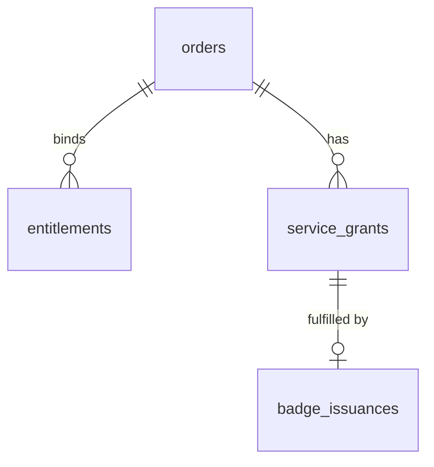

`rpc_requests`, `provider_events`, and `outbox` are keyed by their own ids and reference an order only where relevant.

## 6. Reconciliation and errors

### Client reconciliation

Triggers: launch, foreground, profile switch, network restore, store update, Stripe browser return, manual retry, six-hour jittered timer, and date boundaries.

```text
reconcile(order):
  coalesce to one worker
  render cached payment + installed badge
  submit a signed Purchase for unseen Apple/Google receipts
  for pending Stripe Checkout: ensure one Purchase(StripePaid) is waiting
  otherwise send Status for a nonterminal order
  if GrantReady and no badge covers its grant period: CBNeeded -> Purchase (issue)
  if credential returned: CBReceived -> CBInstalling -> CBInstalled
  schedule next check
```

Never infer provider entitlement from the local clock. Keep an active badge during payment errors.

### Total handling rule

Every input is one of:

1. apply legal transition;
2. return idempotent success;
3. preserve state and retry;
4. preserve state and reject/quarantine.

| Input/result | Class | Client | Bot |
|---|---|---|---|
| Stripe awaiting webhook | wait | `CPAwaitingPayment` + `CBRequesting` | hold `Purchase`; no response |
| timeout/429/5xx in a non-waiting operation | retry | `CPPaymentProblem` with prior snapshot | preserve current `BP…`; return `retryAfter` |
| Stripe verification timeout/429/5xx while `Purchase` waits | wait; retry internally | `CPAwaitingPayment` + `CBRequesting` | preserve canonical payment state; retry Stripe; send no response |
| deadline/restart/lost response | retry on foreground | preserve state; repeat same signed order/op | remove waiter; return cached result or wait again |
| duplicate event/request | idempotent | accept same state/result | preserve state; dedupe/re-fetch |
| product changed for an order | reject | preserve state; a new product needs a new order | `product_changed`; preserve state; telemetry |
| invalid order signature | reject | preserve state; restore/support | `order_auth_invalid`; preserve state; rate-limit |
| declared SKU ≠ verified SKU | reject | `CPPaymentProblem`; no blind retry | `product_mismatch`; preserve `BP…`; quarantine/alert |
| unknown provider state | quarantine | `CPPaymentProblem`; retry later | preserve `BP…`; re-fetch, never guess |
| `GrantReady` | apply | `CBNeeded` → `CBRequesting` | `BBRequested` when requested |
| `GrantFulfilled` | idempotent | `CBReceived` → install | return cached `BBIssued` |
| signing unavailable | retry | `CBRetryableFailure`; keep old badge | `BBRetryableFailure`; grant stays available |
| invalid key/credential/protocol | reject | `CBFinalFailure` | `BBFinalFailure`; do not fulfill grant |
| install crash | local retry | resume `CBReceived` → `CBInstalling` | no bot transition |
| cancel timeout | retry | `CPPaymentProblem`; still show Renews | preserve `BPSubscriptionActive`/`BPEndsAtPeriodEnd` |
| already canceled | idempotent | `CPEndsAtPeriodEnd` | return `BPEndsAtPeriodEnd` |
| user cancels store | exit | restore prior `CP…`/`CB…` | `BPPrepared` expires later |
| Stripe Checkout expired | final attempt | `CPExpired`; new checkout on user action | `BPExpired`; no grant |
| refund/revocation | apply | `CPExpired`; signed badge survives to expiry | `BPRefunded`/`BPRevoked`; mark unused grants `GrantRevoked` |
| webhook DB failure | retry delivery | no transition | no transition; non-2xx |

Stable codes: `bad_request`, `unsupported_version`, `order_auth_invalid`, `product_changed`, `product_mismatch`, `payment_pending`, `payment_not_entitled`, `provider_rate_limited`, `provider_unavailable`, `badge_already_issued`, `signing_failed`, `internal_error`.

### Crash recovery

- Before provider call: repeat request.
- Waiting `Purchase` lost on deadline/restart: remove waiter; repeat the same signed order request on foreground.
- Provider succeeds before commit: retrieve by idempotency key/object binding.
- Payment committed before issuance: `GrantReady` remains unchanged.
- Credential cached before response loss: repeat returns it.
- Response cached before install: resume local installation.
- Duplicate/out-of-order event: dedupe, re-fetch, monotonic transition.

## 7. Provider rules

| Provider | Verify | Identity/period | Notifications | Cancel |
|---|---|---|---|---|
| Apple | offline signed initial transaction; server API later | subscription: original transaction + renewal transaction | Notifications V2 → re-fetch | store UI |
| Google | products v2 / subscriptions v2 GET | linked token chain + order/period | RTDN → re-fetch | Play UI |
| Stripe | retrieve Session/Intent/Invoice/Subscription | one-time intent/session; subscription paid invoice | signed webhook → re-fetch | browser portal (bot-provided link) |

Provider-state mapping:

| Provider state | Canonical bot state |
|---|---|
| Apple active | `BPSubscriptionActive` |
| Apple grace | `BPGrace` while Apple reports entitlement |
| Apple billing retry without entitlement | `BPOnHold` |
| Apple renewal off / expired / refund / revoke | `BPEndsAtPeriodEnd` / `BPExpired` / `BPRefunded` / `BPRevoked` |
| Google pending / active / grace | `BPAwaitingPayment` / `BPSubscriptionActive` / `BPGrace` |
| Google on-hold / paused | `BPOnHold` / `BPPaused` |
| Google canceled with time remaining / expired | `BPEndsAtPeriodEnd` / `BPExpired` |
| Stripe Checkout open or async pending | `BPCheckoutOpen` / `BPAwaitingPayment` |
| Stripe paid one-time / paid subscription invoice | `BPPaidOneTime` / `BPSubscriptionActive` |
| Stripe past-due, unpaid, or paused | `BPOnHold` / `BPPaused` according to retrieved status |
| Stripe cancel-at-end / deleted | `BPEndsAtPeriodEnd` / `BPExpired` |
| Stripe refund / dispute | `BPRefunded` / `BPRevoked` |

Google linked-token replacement changes subscription identity/period data, then maps the retrieved state using this table.

Rules:

- Google initial subscription acknowledgement and one-time consumption run from durable outbox.
- Stripe uses server-selected Price (from `badge_types`/`stripe.plans[plan]`), mode, Customer, `client_reference_id=orderId`, metadata, redirect URLs, and collects customer email so the hosted portal login works.
- Stripe subscription grant requires a paid invoice, not merely active Subscription status.
- Webhook/status/completion page use one reconciliation function; redirects never fulfill.
- All Stripe cancellation, invoices, and payment methods go through the browser Customer Portal — an authenticated `billing_portal.Session` when the customer is identifiable, else the account-wide login page (email OTP) which is also the app-removed path; the bot reconciles portal cancellation from the webhook. Apple/Google normal cancellation is store UI.

## 8. Recovery

Recovery re-establishes order control and the badge after reinstall, device transfer, or local data loss. There is no bot-issued token and no caller identity, so a reinstalled client is a new contact. There are two tiers, by what survives.

### State ownership

| Side | Durable | Lost on client wipe without backup |
|---|---|---|
| Bot | order (keyed by `order_id`), `order_key`, entitlement bindings, `sub_`/`cus_`, grants, cached credential | — |
| Client | — | `order_id`, `order_sk`, `BadgeMasterKey`, cached credential, installed badge |

The bot never loses the order. The client's durable secrets are `order_sk` (order auth) and `BadgeMasterKey` (badge); both belong in the profile backup.

### Tier 1 — restore from backup (normal path)

SimpleX encrypted-profile backup or migration restores `order_id`, `order_sk`, `BadgeMasterKey`, and the cached badge. The client re-attaches to the same order by signing a `Status` request with `order_sk`; if the master key also survived, the cached badge/grant re-issues to it. Nothing new is minted.

### Tier 2 — total loss (no backup)

`order_id`/`order_sk`/`BadgeMasterKey` are all gone. **Apple/Google are still recoverable** because the entitlement lives in the store:

1. The client makes a **fresh order** (new `order_id`/`order_sk`/`BadgeMasterKey`).
2. It re-queries StoreKit `Transaction.currentEntitlements` / Play `queryPurchases` for a fresh receipt of the active subscription.
3. It sends a signed `Purchase` with that receipt → the bot verifies and issues a badge bound to the new master key. The abandoned order/badge expires unused.

This requires the bot to let a *new* order claim an entitlement a prior order already bound. The `entitlements` table binds each provider object to an order but permits re-bind to a new order on a fresh verified receipt, **capped by the per-period `reissue_count` and rate-limited** (BBS badges can't be revoked, so bound the over-issue).

**Stripe has no tier-2 badge recovery** — there is no client-side re-presentable receipt. The hosted portal login (email OTP) can only cancel; a new badge requires a new order/purchase.

### Badge re-issuance

Issuance is idempotent on `(grant, master-key hash)`: within one order the same `BadgeMasterKey` returns the same cached credential — no new charge, no duplicate. A one-time grant already `GrantFulfilled` returns the cached credential.

### Abuse controls

- Verify the order signature (tier 1) or the provider receipt (tier 2) before acting; never act on an unsigned request.
- Rate-limit re-binds per entitlement and per provider object; enforce the per-period `reissue_count` cap.
- Re-binding changes only which order owns an entitlement; it never mutates provider or billing state.

## 9. Security and concurrency

- Verify provider signatures/objects server-side; never trust decoded client/redirect fields.
- Encrypt retained proofs/provider IDs; rotate keys. Authenticate every request by the order's Ed25519 signature and verify provider proof server-side; never act on an unsigned request.
- Keep raw `BadgeMasterKey` client-encrypted and bot-memory-only during signing; the bot stores the `order_key` (public) and never keeps the master key as an identifier.
- Allowlist product, app/package, environment, currency/price, and account binding.
- Rate-limit operation/payment and cap payload sizes.
- Serialize payment mutations with lock/version; events and RPC use the same transitions.
- Use outbox for provider actions/events. Alert on stale leases, acknowledgement deadline, webhook lag, and signing failures.
- Trust client-shipped issuer keys; unknown key/protocol requires update.

## 10. Delivery and tests

1. **Schema/protocol:** five sums/codecs, migrations, grant boundary, request ledger, Chat Console audit, core install API.
2. **Apple/Google:** bindings, verification/status, Notifications V2/RTDN, acknowledge/consume, native UI.
3. **Stripe:** Checkout, waiting `Purchase(StripePaid)`, webhook wake-up, reconciliation, portal link (authenticated session + login-page fallback), portal cancellation + webhook reconciliation.
4. **UX/hardening:** scheduler, all Product states, rollout compatibility, telemetry, cleanup.

Tests:

- JSON/SQL roundtrip and invalid-row tests for every constructor;
- legal/illegal transition properties for all five machines;
- message tests proving only the named owner changes state;
- Apple JWS/status/notification and Google pending/renewal/grace/hold/cancel cases;
- Stripe async payment, invoice renewal, cancellation, closed app/browser, delayed/duplicate/reordered webhook;
- monthly/yearly grant periods and 21 July → 31 August expiry;
- crash/replay at every side-effect boundary;
- order-signature/grant/BBS-owner isolation, product-pin/SKU-match checks, and wrong-`BadgeMasterKey` rejection;
- Chat Console coverage and redaction snapshots.

Release gates: provider sandbox E2E, webhook signature/replay, schema rollback, store-policy review, complete error handling, operational dashboards.

### Code locations

| Location | Change |
|---|---|
| new `Simplex.Chat.Badges.Lifecycle` | client sums/transitions/reconciliation; generate order key + `generateMasterKey` before order create |
| `Library.Commands.addUserBadge` | non-CLI verified install API |
| RPC/controller/console | calls, response handling, redacted audit |
| client store/migrations | separate payment and badge stores |
| Kotlin/Swift | derive Product UX state |
| bot payment repository | replace `customData`; providers, grants, outbox |
| bot badge repository | grant-only signing/cache; no provider imports |
| `badge-service/apple.py` | proof + subscription status |
| `badge-service/google.py` | full mapping + acknowledge/consume |
| `badge-service/stripe_api.py` | Checkout/webhook/status/cancel/Portal |
| `badge-service/wire.py` | versioned call/response; keep existing badge request compatibility during rollout |

## 11. API references

| Provider | References |
|---|---|
| Apple | [StoreKit](https://developer.apple.com/storekit/), [subscription statuses](https://developer.apple.com/documentation/appstoreserverapi/get-all-subscription-statuses), Notifications V2 |
| Google | [Play Billing](https://developer.android.com/google/play/billing/integrate), [`productsv2.getproductpurchasev2`](https://developers.google.com/android-publisher/api-ref/rest/v3/purchases.productsv2/getproductpurchasev2), [`subscriptionsv2.get`](https://developers.google.com/android-publisher/api-ref/rest/v3/purchases.subscriptionsv2/get), RTDN |
| Stripe | [Checkout](https://docs.stripe.com/api/checkout/sessions/create), [fulfillment](https://docs.stripe.com/checkout/fulfillment), [webhooks](https://docs.stripe.com/webhooks), [subscription events](https://docs.stripe.com/billing/subscriptions/webhooks), [cancel](https://docs.stripe.com/billing/subscriptions/cancel), [Portal](https://docs.stripe.com/customer-management/integrate-customer-portal), [hosted portal login](https://docs.stripe.com/customer-management/activate-no-code-customer-portal) |
| RPC | [`simplexmq` service RPC RFC](https://github.com/simplex-chat/simplexmq/blob/rpc/rfcs/2026-07-11-service-rpc.md) |

## 12. Open questions

**Stripe total loss.** Recovery §8 tier 2 shows Apple/Google recover after a full wipe (store re-presents the entitlement) but Stripe cannot — the hosted portal login only cancels, and a new badge needs a new order. Decision: accept this, or add an optional user-held recovery code as a second Stripe order-recovery credential.

**Re-issue cap value.** The per-entitlement, per-period `reissue_count` bounds tier-2 over-issue. Decision: pick the cap (e.g. 2–3 per period) and the rate-limit window.
