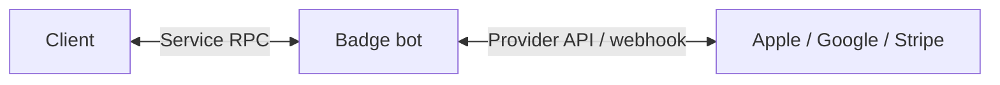
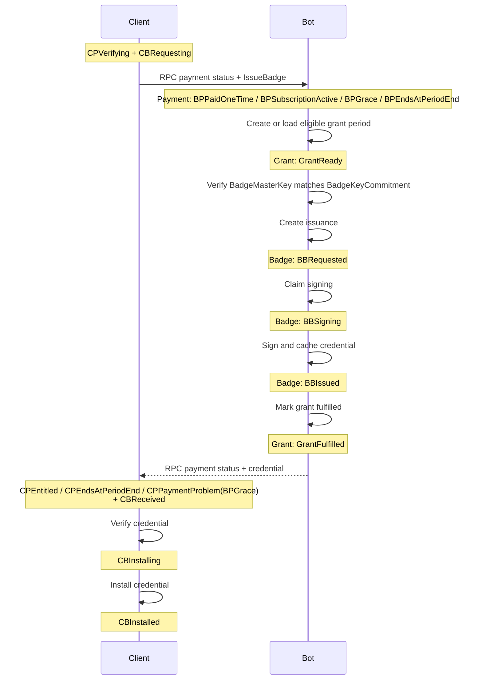
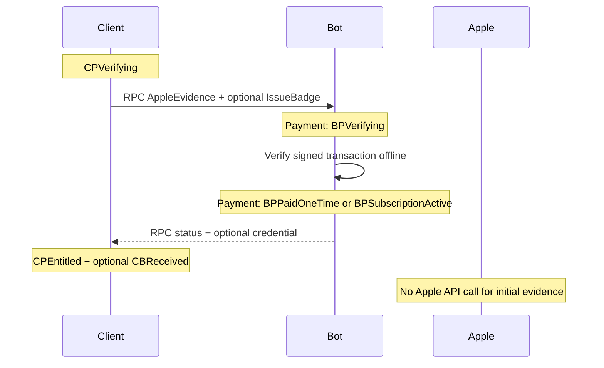
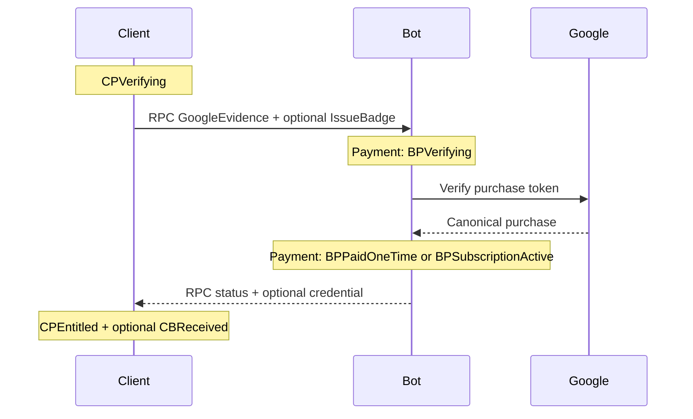
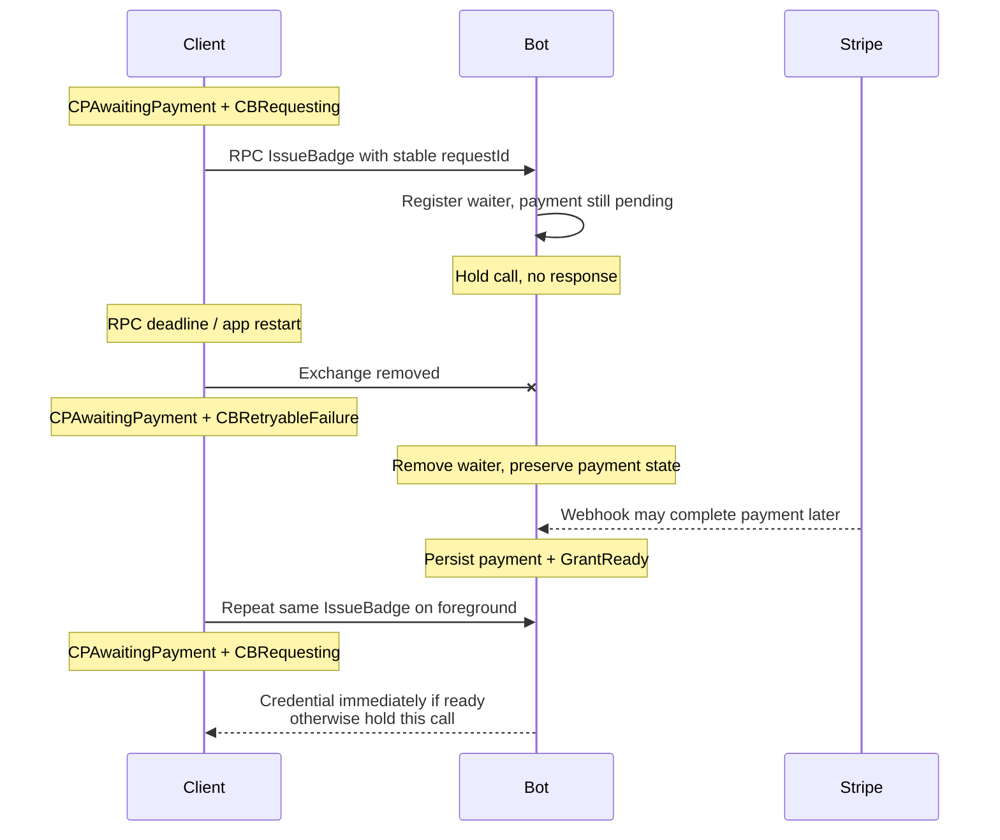

# Supporter Badges v2 — Implementation Plan

**Date:** 2026-07-21
**Status:** implementation-ready
**Companion:** [Product and UX plan](2026-07-20-supporter-badges-v2-product.md)

Payment verification creates a provider-neutral `ServiceGrant`. Badge issuance fulfills it. Payment and badge are separate state machines on client and bot.


## Contents

- [1. Architecture](#1-architecture)
- [2. State machines](#2-state-machines)
- [3. Contracts](#3-contracts)
- [4. Provider flows](#4-provider-flows)
- [5. Persistence and `CallState` pattern](#5-persistence-and-callstate-pattern)
- [6. Reconciliation and errors](#6-reconciliation-and-errors)
- [7. Provider rules](#7-provider-rules)
- [8. Recovery](#8-recovery)
- [9. Security and concurrency](#9-security-and-concurrency)
- [10. Delivery and tests](#10-delivery-and-tests)
- [11. API references](#11-api-references)
- [12. Open questions](#12-open-questions)

## 1. Architecture

### Responsibilities



| Component | Owns | Must not own |
|---|---|---|
| Client payment | BBS master key, purchase UI, cached status, retry schedule | bot/provider truth |
| Client badge | credential receipt and installation | billing state |
| Payment service | BBS owner commitment, proof verification, billing state, grant schedule | raw master key, credential |
| Service grant | product and eligible monthly grant period | provider proof, credential |
| Badge service | signing and idempotent credential cache | provider/billing logic |
| Core | signature verification and installed badge | payment status |

Treat these as separate programs with typed interfaces.

### Invariants

1. Provider verification changes payment state only.
2. Before `Prepare`, client generates one `BadgeMasterKey` with `generateMasterKey`; it is 32 random bytes and BBS message 0.
3. Payment stores `BadgeKeyCommitment = SHA-256("SimpleX badge key commitment v1" || BadgeMasterKey)` and every later issue must match it.
4. Only `GrantReady` plus the matching raw master key enters badge signing.
5. Grant fulfillment and cached issuance result are atomic/idempotent.
6. Payment never activates perks; verified credential does.
7. RPC has no caller identity, no bot-issued token, and no bot push. Each request carries its own credential — a fresh provider proof (Apple/Google) or a `BadgeMasterKey` possession proof (Stripe) — verified against the payment binding.
8. Duplicate RPCs/events return the same result. Unknown states preserve prior state.
9. Provider dates create eligibility; retry/request time never changes badge expiry.

### Time and grant

```haskell
data ServiceGrantState = GrantReady | GrantFulfilled | GrantRevoked

data ServiceGrant = ServiceGrant
  { grantId :: GrantId
  , paymentId :: PaymentId
  , productId :: ServiceProductId
  , grantPeriodStart :: UTCTime
  , grantState :: ServiceGrantState
  }
```

- One-time: one grant at verified purchase time. Reject another one-time prepare while its prior one-time service period is active.
- Subscription: `grantPeriodStart(n) = addCalendarMonths n verifiedAnchor` when `grantPeriodStart(n) <= now < paidThrough`.
- Monthly and yearly plans both expose one grant per eligible month.
- Badge service computes expiry as the start of the month two months after `grantPeriodStart`.
- Unique grant: `(payment_id, product_id, grant_period_start)`.
- Example: 21 July grant period → badge expires 1 September; monthly billing renews 21 August.

Grant eligibility by payment state:

| State | New grant |
|---|---|
| `BPPaidOneTime` | its single unissued grant |
| `BPSubscriptionActive` | current due grant period through `paidThrough` |
| `BPGrace` | only while the provider explicitly reports entitlement |
| `BPEndsAtPeriodEnd` | due grant periods until `paidThrough` |
| all other states | none |


## 2. State machines

These names are canonical. Every transition is validated against the current constructor.

### Client payment

| State | Meaning |
|---|---|
| `CPNone` | no payment |
| `CPPreparing` | prepare RPC running |
| `CPStoreReady` | Apple/Google binding ready |
| `CPCheckoutReady` | Stripe URL ready |
| `CPAwaitingPayment` | payment/approval pending |
| `CPVerifying` | evidence/status RPC running |
| `CPEntitled` | last bot status is paid |
| `CPCanceling` | management/cancel operation running |
| `CPEndsAtPeriodEnd` | renewal off; paid time remains |
| `CPPaymentProblem` | typed error + prior snapshot + retry time |
| `CPExpired` | no entitlement remains |

### Bot payment

| State | Meaning |
|---|---|
| `BPPrepared` | payment/commitment/binding stored |
| `BPCheckoutOpen` | Stripe Session stored |
| `BPAwaitingPayment` | provider not complete |
| `BPVerifying` | reconciliation lease active |
| `BPPaidOneTime` | verified one-time payment |
| `BPSubscriptionActive` | paid subscription, renewal on |
| `BPGrace` | provider grants grace |
| `BPOnHold` | failed payment; no new grant |
| `BPPaused` | provider paused entitlement |
| `BPEndsAtPeriodEnd` | renewal off; paid time remains |
| `BPExpired` | paid time ended |
| `BPRefunded` | verified refund/chargeback |
| `BPRevoked` | provider revoked entitlement |

`BPVerifying` stores prior state, lease owner, and lease expiry.

### Client badge

| State | Meaning |
|---|---|
| `CBNone` | no usable local badge |
| `CBNeeded` | grant available |
| `CBRequesting` | issue RPC running |
| `CBReceived` | response cached, not installed |
| `CBInstalling` | core verification/install running |
| `CBInstalled` | verified and installed |
| `CBRetryableFailure` | retry while retaining old badge |
| `CBFinalFailure` | update/support required |

### Bot badge

| State | Meaning |
|---|---|
| `BBRequested` | grant/key idempotency row created |
| `BBSigning` | signing lease active |
| `BBIssued` | credential cached; grant fulfilled |
| `BBRetryableFailure` | same request can retry |
| `BBFinalFailure` | invalid/permanently unsupported request |

Grant states are `GrantReady`, `GrantFulfilled`, and `GrantRevoked`. There is no bot “installed” state.

## 3. Contracts

### RPC payload

```haskell
data ServiceCall = ServiceCall
  { requestId :: RequestId
  , payment :: PaymentInput
  , request :: Maybe ServiceRequest
  }

data PaymentInput
  = Prepare Provider ServiceProductId PurchaseKind BadgeKeyCommitment
  | AppleEvidence BadgeKeyCommitment SignedTransactionJWS
  | GoogleEvidence BadgeKeyCommitment PurchaseToken
  | StripeStatus BadgeKeyProof
  | StripeCancel BadgeKeyProof
  | StripePortal BadgeKeyProof

-- BadgeKeyProof is the raw BadgeMasterKey, revealed over the E2E channel;
-- the bot re-derives BadgeKeyCommitment = SHA-256(domain || key) and matches.
-- This reuses issuance, which already sends the key, so it exposes nothing new.
--
-- No PaymentId on the wire: each Prepare uses a fresh BadgeMasterKey, so
-- BadgeKeyCommitment is 1:1 with the payment and selects it. Apple/Google
-- carry the commitment and authenticate by fresh store proof; Stripe calls
-- carry a BadgeKeyProof, which both selects (via commitment) and authenticates.
-- PaymentId (below) is an internal primary/foreign key only.
type BadgeKeyProof = BadgeMasterKey
data ServiceRequest = IssueBadge BadgeMasterKey (Maybe GrantId)

data ServiceResponse = ServiceResponse
  { requestId :: RequestId
  , payment :: PaymentSnapshot
  , grant :: Maybe ServiceGrantSummary
  , service :: Maybe (Either ServiceError BadgeCredential)
  , retryAfter :: Maybe NominalDiffTime
  }
```

Rules:

- Each `Prepare` uses a fresh `BadgeMasterKey`; renewals of the same subscription reuse it without a new `Prepare`. So `BadgeKeyCommitment` is unique per payment and is the wire selector; `PaymentId` never appears on the wire.
- Client calls `generateMasterKey` once before `Prepare`, persists it encrypted, computes `BadgeKeyCommitment`, and reuses the key for all renewal badges.
- `Prepare` stores `BadgeKeyCommitment` but cannot issue a badge.
- Apple/Google evidence may include `IssueBadge`.
- Stripe prepare returns Checkout data. The client then sends `IssueBadge`; while payment is pending the bot holds that call and sends no response.
- The waiting call responds once after verified payment and issuance, or with a terminal payment error. Other retryable operations may still return `retryAfter`.
- The `BadgeMasterKey`, its `BadgeKeyProof`, and `BadgeKeyCommitment` never enter Stripe metadata or a return URL.
- `grantId` selects only; bot rechecks payment, owner, product, and eligibility.
- `StripeCancel`/`StripePortal` return a portal URL in the payment snapshot (like the Checkout URL); the bot never cancels silently. `StripeCancel` deep-links to the cancel flow; `StripePortal` opens general management. When the request carries no valid `BadgeKeyProof` (customer cannot be identified), the bot returns the account-wide login page instead of a session.
- There is no bot-issued authorization token and no `PaymentId` on the wire. The payment is selected by `BadgeKeyCommitment` (Apple/Google carry it explicitly; a Stripe `BadgeKeyProof` references it). Each RPC also authenticates: Apple/Google by fresh store proof, Stripe by the `BadgeKeyProof`. The bot resolves and verifies before acting.
- Before signing, orchestrator recomputes `BadgeKeyCommitment` from `BadgeMasterKey`; mismatch returns `ownership_conflict` without fulfilling grant.

### Internal interface

```haskell
resolvePayment :: PaymentInput -> Transaction PaymentDecision
fulfillBadge  :: ServiceGrant -> BadgeRequest -> Transaction BadgeResult
```

Order:

1. select the payment by `BadgeKeyCommitment` and authenticate the request credential (store proof, or `BadgeKeyProof` against that commitment);
2. resolve/verify payment;
3. commit payment and create/load due grant;
4. verify the request key matches the payment `BadgeKeyCommitment`;
5. pass only grant + request to badge service;
6. cache issuance and mark grant fulfilled atomically;
7. return the single response.

### Idempotency and audit

- `requestId` binds to canonical request hash. Same body returns stored response; different body returns `idempotency_mismatch`.
- Transport replay dedupe is separate and shorter-lived.
- Stripe mutation idempotency key derives from request ID + operation.
- Developer Tools → Chat Console records start/result, request ID, method, payment suffix, before/after states, retry class, and duration.
- Redact JWS/token, `BadgeKeyProof`, Checkout query/return token, master key, credential, and provider/customer IDs.

## 4. Provider flows

Product outcomes are in the Product Plan. These diagrams show implementation boundaries only.

### Common grant → badge path



### Apple initial verification



This path is offline. Status/restore uses App Store Server API; Notifications V2 only trigger reconciliation.

### Google verification



Commit entitlement before outbox acknowledgement/consume. RTDN triggers provider GET; never create a service grant from the notification payload.

### Stripe Checkout and waiting `IssueBadge`


The second RPC has exactly one response. The bot sends it only after verified payment allows issuance, or after a terminal event such as Checkout expiry. Register-and-recheck under the payment lock prevents a webhook/request race. If the webhook completed first, `IssueBadge` responds immediately.

If Stripe retrieval fails transiently after the webhook, the bot keeps the call open and retries internally. It does not send an intermediate response; only the RPC deadline or a terminal payment result ends the wait.

Persist request ID, hash, and result state; keep the live waiter and raw `BadgeMasterKey` only in memory. Webhook commit wakes live waiters after `GrantReady` is durable. After bot restart, the repeated request rechecks persisted payment/grant state and either returns immediately or installs a new waiter.

### Stripe wait interruption



The client persists `requestId` and `BadgeMasterKey` before opening Checkout. It retries only after an interrupted exchange, foreground, or explicit user action—never on a polling timer. A deep link is optional UX; no localhost listener is used.

### Cancellation

| Provider | Client action | Bot action | Confirmed state |
|---|---|---|---|
| Apple | open Apple management UI; status RPC on return | App Store Server API status | `BPEndsAtPeriodEnd` |
| Google | open Play management UI; status RPC on return | `subscriptionsv2.get` | `BPEndsAtPeriodEnd` |
| Stripe | open a browser Customer Portal from a bot-provided link | return a portal link (session or login page); the portal performs the cancel, reconciled via `customer.subscription.updated` webhook | `BPEndsAtPeriodEnd` |

Failure preserves previous state; client shows Retry and still says **Renews on**. “Already canceled” is success. The bot never cancels a Stripe subscription itself: the hosted Customer Portal calls `cancel_at_period_end`, and the bot reconciles it from the webhook.

**Stripe cancel-link selection.** Cancellation is always in the browser portal; the bot chooses which link it returns based on whether the request identifies the customer:

| Client presents | Portal link the bot returns |
|---|---|
| valid `BadgeKeyProof` (matches stored `BadgeKeyCommitment`) | authenticated `billing_portal.Session` with `flow_data.type=subscription_cancel` — opens straight to the cancel flow, no email code |
| no valid proof (master key lost with the app) | the account-wide hosted portal **login page** (`prefilled_email` when the customer email is known), authenticated by email OTP |

The authenticated session link is short-lived and per-customer; the login page is the operator-config account-wide URL and returns no per-customer secret. The bot carries whichever link applies in Stripe status responses so a cancel path is always reachable. Because possession of the `BadgeMasterKey` is the sole client credential, there is no intermediate "capability lost" state: the client either can prove key possession (session) or cannot (login page).

## 5. Persistence and `CallState` pattern

Mirror existing `data CallState` machinery:

- closed sums with state-specific fields;
- separate tag projection for queries;
- `deriveJSON (singleFieldJSON fstToLower)`;
- explicit SQL `TEXT` `ToField`/`FromField`;
- typed store reconstruction with inconsistent-row failure;
- controller `TMap` + per-payment locks;
- transition pattern matching + typed invalid-state errors;
- migrations before emitting new tags.

References: `Simplex.Chat.Call`, `Store.Profiles`, `Library.Commands`, `Library.Subscriber`, and `Controller`.

Define five separate sums: client payment, client badge, bot payment, grant, bot badge. Do not encode state as one nullable record.

### Client tables

`badge_payments`: provider/product/plan, payment state payload, encrypted `BadgeMasterKey`, `BadgeKeyCommitment`, binding/proof reference, `paidThrough`, `willRenew`, checked/retry time, version.

`badges`: payment/grant/grant-period/key hash, badge state payload, cached credential, expiry, attempt/error, version.

Join by payment/grant ID only. Update active profile only after core installation.

### Bot tables

| Table | Unique key / purpose |
|---|---|
| `payments` | provider-object ownership + `BadgeKeyCommitment`; canonical payment sum |
| `service_grants` | payment + product + grant period |
| `badge_issuances` | grant + master-key hash; cached credential |
| `rpc_requests` | request ID; pending waiter/result + request hash + response |
| `provider_events` | provider event ID; dedupe/result |
| `outbox` | acknowledge, consume, reconciliation, cleanup |

Provider calls/signing run outside long transactions. Leases and compare-and-swap versions recover crashes.

## 6. Reconciliation and errors

### Client reconciliation

Triggers: launch, foreground, profile switch, network restore, store update, Stripe browser return, manual retry, six-hour jittered timer, and date boundaries.

```text
reconcile(payment):
  coalesce to one worker
  render cached payment + installed badge
  submit unseen Apple/Google evidence
  for pending Stripe Checkout: ensure one IssueBadge call is waiting
  otherwise request status for nonterminal payment
  if GrantReady and no badge covers its grant period: CBNeeded -> request IssueBadge
  if credential returned: CBReceived -> CBInstalling -> CBInstalled
  schedule next check
```

Never infer provider entitlement from the local clock. Keep an active badge during payment errors.

### Total handling rule

Every input is one of:

1. apply legal transition;
2. return idempotent success;
3. preserve state and retry;
4. preserve state and reject/quarantine.

| Input/result | Class | Client | Bot |
|---|---|---|---|
| Stripe awaiting webhook | wait | `CPAwaitingPayment` + `CBRequesting` | hold `IssueBadge`; no response |
| timeout/429/5xx in a non-waiting operation | retry | `CPPaymentProblem` with prior snapshot | preserve current `BP…`; return `retryAfter` |
| Stripe verification timeout/429/5xx while `IssueBadge` waits | wait; retry internally | `CPAwaitingPayment` + `CBRequesting` | preserve canonical payment state; retry Stripe; send no response |
| deadline/restart/lost response | retry on foreground | preserve state; repeat same ID/body | remove waiter; return cached result or wait again |
| duplicate event/request | idempotent | accept same state/result | preserve state; dedupe/re-fetch |
| ID reused with new body | reject | preserve state; new ID only for new action | preserve state; telemetry |
| invalid proof/binding | reject | preserve state; restore/support | preserve state; rate-limit |
| invalid proof/product | reject | `CPPaymentProblem`; no blind retry | preserve `BP…`; quarantine/alert |
| unknown provider state | quarantine | `CPPaymentProblem`; retry later | preserve `BP…`; re-fetch, never guess |
| `GrantReady` | apply | `CBNeeded` → `CBRequesting` | `BBRequested` when requested |
| `GrantFulfilled` | idempotent | `CBReceived` → install | return cached `BBIssued` |
| signing unavailable | retry | `CBRetryableFailure`; keep old badge | `BBRetryableFailure`; grant stays available |
| invalid key/credential/protocol | reject | `CBFinalFailure` | `BBFinalFailure`; do not fulfill grant |
| install crash | local retry | resume `CBReceived` → `CBInstalling` | no bot transition |
| cancel timeout | retry | `CPPaymentProblem`; still show Renews | preserve `BPSubscriptionActive`/`BPEndsAtPeriodEnd` |
| already canceled | idempotent | `CPEndsAtPeriodEnd` | return `BPEndsAtPeriodEnd` |
| user cancels store | exit | restore prior `CP…`/`CB…` | `BPPrepared` expires later |
| Stripe Checkout expired | final attempt | `CPExpired`; new checkout on user action | `BPExpired`; no grant |
| refund/revocation | apply | `CPExpired`; signed badge survives to expiry | `BPRefunded`/`BPRevoked`; mark unused grants `GrantRevoked` |
| webhook DB failure | retry delivery | no transition | no transition; non-2xx |

Stable codes: `bad_request`, `unsupported_version`, `payment_pending`, `payment_not_entitled`, `ownership_conflict`, `proof_invalid`, `provider_rate_limited`, `provider_unavailable`, `idempotency_mismatch`, `badge_already_issued`, `signing_failed`, `internal_error`.

### Crash recovery

- Before provider call: repeat request.
- Waiting `IssueBadge` lost on deadline/restart: remove waiter; repeat the same logical request on foreground.
- Provider succeeds before commit: retrieve by idempotency key/object binding.
- Payment committed before issuance: `GrantReady` remains unchanged.
- Credential cached before response loss: repeat returns it.
- Response cached before install: resume local installation.
- Duplicate/out-of-order event: dedupe, re-fetch, monotonic transition.

## 7. Provider rules

| Provider | Verify | Identity/period | Notifications | Cancel |
|---|---|---|---|---|
| Apple | offline signed initial transaction; server API later | subscription: original transaction + renewal transaction | Notifications V2 → re-fetch | store UI |
| Google | products v2 / subscriptions v2 GET | linked token chain + order/period | RTDN → re-fetch | Play UI |
| Stripe | retrieve Session/Intent/Invoice/Subscription | one-time intent/session; subscription paid invoice | signed webhook → re-fetch | browser portal (bot-provided link) |

Provider-state mapping:

| Provider state | Canonical bot state |
|---|---|
| Apple active | `BPSubscriptionActive` |
| Apple grace | `BPGrace` while Apple reports entitlement |
| Apple billing retry without entitlement | `BPOnHold` |
| Apple renewal off / expired / refund / revoke | `BPEndsAtPeriodEnd` / `BPExpired` / `BPRefunded` / `BPRevoked` |
| Google pending / active / grace | `BPAwaitingPayment` / `BPSubscriptionActive` / `BPGrace` |
| Google on-hold / paused | `BPOnHold` / `BPPaused` |
| Google canceled with time remaining / expired | `BPEndsAtPeriodEnd` / `BPExpired` |
| Stripe Checkout open or async pending | `BPCheckoutOpen` / `BPAwaitingPayment` |
| Stripe paid one-time / paid subscription invoice | `BPPaidOneTime` / `BPSubscriptionActive` |
| Stripe past-due, unpaid, or paused | `BPOnHold` / `BPPaused` according to retrieved status |
| Stripe cancel-at-end / deleted | `BPEndsAtPeriodEnd` / `BPExpired` |
| Stripe refund / dispute | `BPRefunded` / `BPRevoked` |

Google linked-token replacement changes subscription identity/period data, then maps the retrieved state using this table.

Rules:

- Google initial subscription acknowledgement and one-time consumption run from durable outbox.
- Stripe uses server-selected Price, mode, Customer, `client_reference_id=paymentId`, metadata, redirect URLs, and collects customer email so the hosted portal login works.
- Stripe subscription grant requires a paid invoice, not merely active Subscription status.
- Webhook/status/completion page use one reconciliation function; redirects never fulfill.
- All Stripe cancellation, invoices, and payment methods go through the browser Customer Portal — an authenticated `billing_portal.Session` when the customer is identifiable, else the account-wide login page (email OTP) which is also the app-removed path; the bot reconciles portal cancellation from the webhook. Apple/Google normal cancellation is store UI.

## 8. Recovery

Recovery re-establishes payment control and the badge after reinstall, device transfer, or local data loss. There is no bot-issued token and no caller identity, so a reinstalled client is a new contact; it re-attaches by presenting a credential the bot matches to a stored payment.

### State ownership

| Side | Durable | Lost on client wipe without backup |
|---|---|---|
| Bot | payment (keyed by `BadgeKeyCommitment`), provider bindings, `sub_`/`cus_`, grants, cached credential | — |
| Client | — | `BadgeMasterKey` (commitment re-derives from it), cached credential, installed badge |

The bot never loses the payment. `BadgeMasterKey` is the only client secret to protect; all other client state is re-derivable.

### Restore from backup

SimpleX encrypted-profile backup or migration restores `BadgeMasterKey`, `BadgeKeyCommitment`, and the cached badge. No recovery RPC runs. This is the primary path.

### Re-attach when only the master key survives

With `BadgeMasterKey` retained, the client re-derives `BadgeKeyCommitment` and re-attaches by presenting a provider credential (the store proof for Apple/Google, a key-possession proof for Stripe):

| Provider | Credential | Bot match | Result |
|---|---|---|---|
| Apple | signed transaction (`Transaction.currentEntitlements`) | original-transaction binding | re-attached; status/grant refreshed |
| Google | purchase token (`queryPurchases`) | linked-token/order binding | re-attached; status/grant refreshed |
| Stripe | `BadgeKeyProof` | `BadgeKeyCommitment` → `payments` row | re-attached; status/grant refreshed (portal session if requested) |

### Badge re-issuance

Re-attaching does not install a badge. Reconciliation then issues from the eligible or fulfilled grant. Issuance is idempotent on `(grant, master-key hash)`: the same `BadgeMasterKey` returns the same cached credential — no new charge, no duplicate. A one-time grant already `GrantFulfilled` returns the cached credential.

### Lost master key

If `BadgeMasterKey` is lost with no backup, the payment cannot be re-attached:

- Apple/Google: unaffected; the client re-presents store proof and cancellation is store-side.
- Stripe: cancellation falls back to the hosted portal login page (email OTP); billing continues until canceled there or the card lapses.
- Installed badges remain valid to signed expiry; no new issuance against the lost key.

### Abuse controls

- Verify the credential before re-attaching; never re-attach on an unauthenticated selector such as a bare `BadgeKeyCommitment`.
- Rate-limit attempts per `BadgeKeyCommitment` and per provider binding; the `BadgeKeyProof` nonce prevents replay.
- Re-attaching changes only the client association; it never mutates provider or billing state.

## 9. Security and concurrency

- Verify provider signatures/objects server-side; never trust decoded client/redirect fields.
- Encrypt retained proofs/provider IDs; rotate keys. Select the payment by `BadgeKeyCommitment` and authorize only on a verified proof (store proof or `BadgeKeyProof`); never act on an unauthenticated selector.
- Keep raw `BadgeMasterKey` client-encrypted and bot-memory-only during ownership verification/signing; persist only domain-separated `BadgeKeyCommitment`.
- Allowlist product, app/package, environment, currency/price, and account binding.
- Rate-limit operation/payment and cap payload sizes.
- Serialize payment mutations with lock/version; events and RPC use the same transitions.
- Use outbox for provider actions/events. Alert on stale leases, acknowledgement deadline, webhook lag, and signing failures.
- Trust client-shipped issuer keys; unknown key/protocol requires update.

## 10. Delivery and tests

1. **Schema/protocol:** five sums/codecs, migrations, grant boundary, request ledger, Chat Console audit, core install API.
2. **Apple/Google:** bindings, verification/status, Notifications V2/RTDN, acknowledge/consume, native UI.
3. **Stripe:** Checkout, waiting `IssueBadge`, webhook wake-up, reconciliation, portal link (authenticated session + login-page fallback), portal cancellation + webhook reconciliation.
4. **UX/hardening:** scheduler, all Product states, rollout compatibility, telemetry, cleanup.

Tests:

- JSON/SQL roundtrip and invalid-row tests for every constructor;
- legal/illegal transition properties for all five machines;
- message tests proving only the named owner changes state;
- Apple JWS/status/notification and Google pending/renewal/grace/hold/cancel cases;
- Stripe async payment, invoice renewal, cancellation, closed app/browser, delayed/duplicate/reordered webhook;
- monthly/yearly grant periods and 21 July → 31 August expiry;
- crash/replay at every side-effect boundary;
- `BadgeKeyProof`/grant/BBS-owner isolation and wrong-`BadgeMasterKey` rejection;
- Chat Console coverage and redaction snapshots.

Release gates: provider sandbox E2E, webhook signature/replay, schema rollback, store-policy review, complete error handling, operational dashboards.

### Code locations

| Location | Change |
|---|---|
| new `Simplex.Chat.Badges.Lifecycle` | client sums/transitions/reconciliation; call `generateMasterKey` before prepare |
| `Library.Commands.addUserBadge` | non-CLI verified install API |
| RPC/controller/console | calls, response handling, redacted audit |
| client store/migrations | separate payment and badge stores |
| Kotlin/Swift | derive Product UX state |
| bot payment repository | replace `customData`; providers, grants, outbox |
| bot badge repository | grant-only signing/cache; no provider imports |
| `badge-service/apple.py` | proof + subscription status |
| `badge-service/google.py` | full mapping + acknowledge/consume |
| `badge-service/stripe_api.py` | Checkout/webhook/status/cancel/Portal |
| `badge-service/wire.py` | versioned call/response; keep existing badge request compatibility during rollout |

## 11. API references

| Provider | References |
|---|---|
| Apple | [StoreKit](https://developer.apple.com/storekit/), [subscription statuses](https://developer.apple.com/documentation/appstoreserverapi/get-all-subscription-statuses), Notifications V2 |
| Google | [Play Billing](https://developer.android.com/google/play/billing/integrate), [`productsv2.getproductpurchasev2`](https://developers.google.com/android-publisher/api-ref/rest/v3/purchases.productsv2/getproductpurchasev2), [`subscriptionsv2.get`](https://developers.google.com/android-publisher/api-ref/rest/v3/purchases.subscriptionsv2/get), RTDN |
| Stripe | [Checkout](https://docs.stripe.com/api/checkout/sessions/create), [fulfillment](https://docs.stripe.com/checkout/fulfillment), [webhooks](https://docs.stripe.com/webhooks), [subscription events](https://docs.stripe.com/billing/subscriptions/webhooks), [cancel](https://docs.stripe.com/billing/subscriptions/cancel), [Portal](https://docs.stripe.com/customer-management/integrate-customer-portal), [hosted portal login](https://docs.stripe.com/customer-management/activate-no-code-customer-portal) |
| RPC | [`simplexmq` service RPC RFC](https://github.com/simplex-chat/simplexmq/blob/rpc/rfcs/2026-07-11-service-rpc.md) |

## 12. Open questions

**Lost key.** Recovery §8 defines the behavior when `BadgeMasterKey` is lost with no backup (Stripe cancellation falls back to the portal login page; badge expires normally; Apple/Google unaffected). Decision: accept this, or add an optional user-held recovery code as a second Stripe recovery credential.
