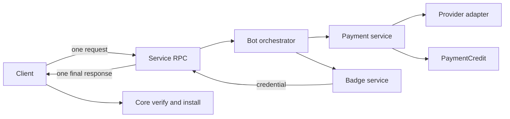
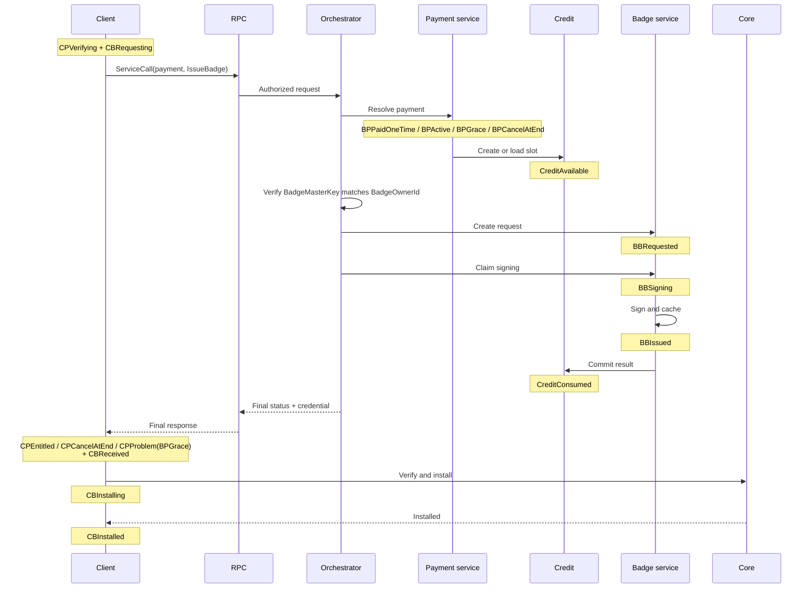
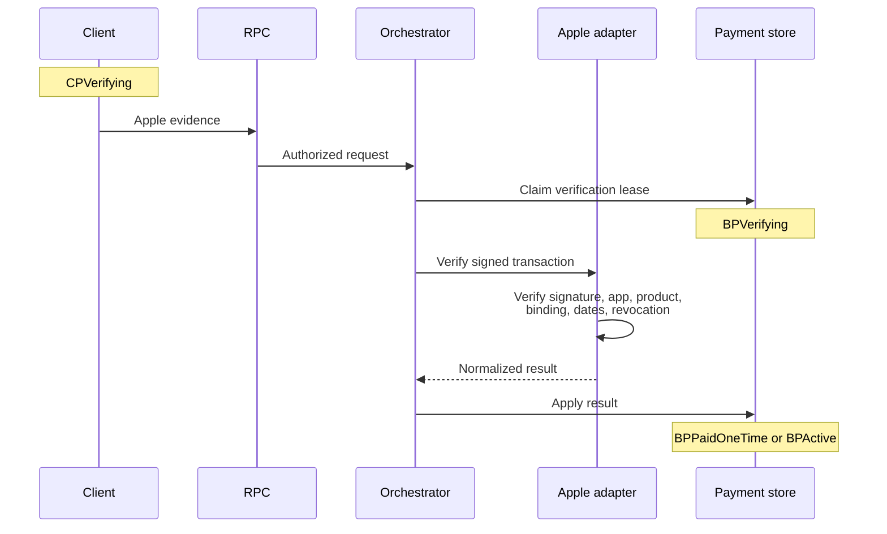
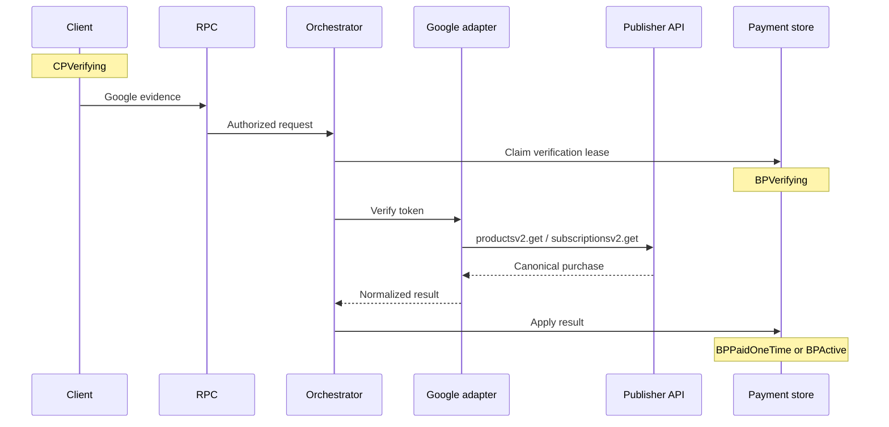
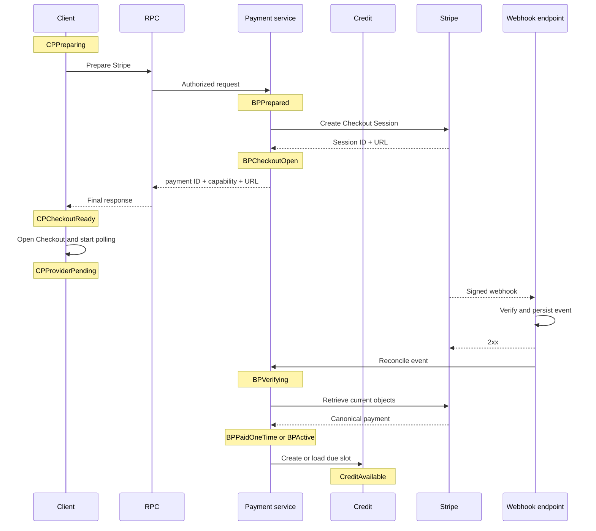
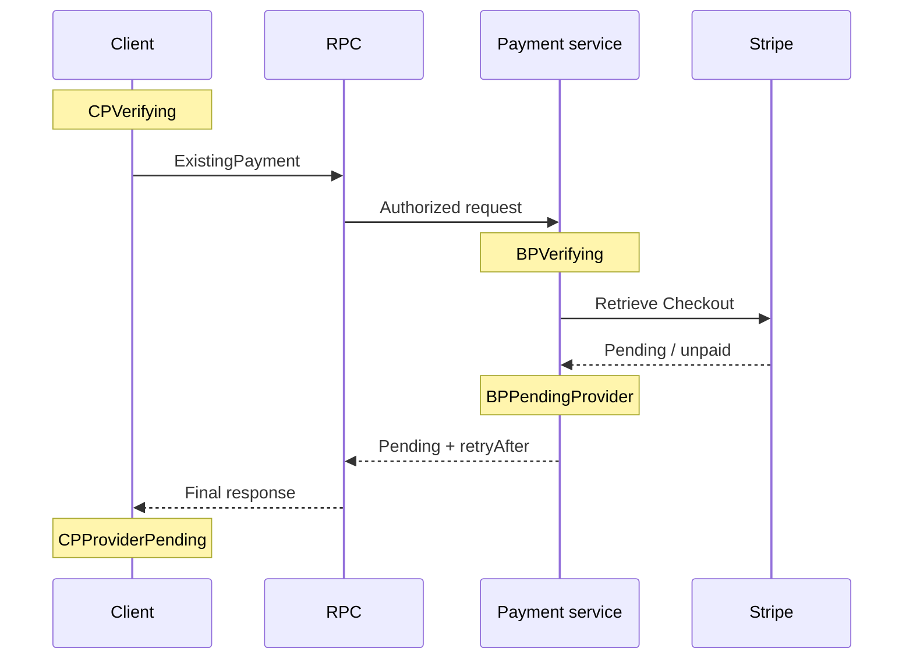

# Supporter Badges v2 — Implementation Plan

**Date:** 2026-07-21
**Status:** implementation-ready
**Companion:** [Product and UX plan](2026-07-20-supporter-badges-v2-product.md)

Payment verification creates a provider-neutral `PaymentCredit`. Badge issuance consumes it. Payment and badge are separate state machines on client and bot.


## Contents

- [1. Architecture](#1-architecture)
- [2. State machines](#2-state-machines)
- [3. Contracts](#3-contracts)
- [4. Provider flows](#4-provider-flows)
- [5. Persistence and `CallState` pattern](#5-persistence-and-callstate-pattern)
- [6. Reconciliation and errors](#6-reconciliation-and-errors)
- [7. Provider rules](#7-provider-rules)
- [8. Security and concurrency](#8-security-and-concurrency)
- [9. Delivery and tests](#9-delivery-and-tests)
- [10. API references](#10-api-references)
- [11. Open question](#11-open-question)

## 1. Architecture

### Responsibilities



| Component | Owns | Must not own |
|---|---|---|
| Client payment | BBS master key, capability, purchase UI, cached status, retry schedule | bot/provider truth |
| Client badge | credential receipt and installation | billing state |
| Payment service | BBS owner commitment, proof verification, billing state, credit schedule | raw master key, credential |
| Payment credit | product and eligible monthly slot | provider proof, credential |
| Badge service | signing and idempotent credential cache | provider/billing logic |
| Core | signature verification and installed badge | payment status |

Treat these as separate programs with typed interfaces.

### Invariants

1. Provider verification changes payment state only.
2. Before `Prepare`, client generates one `BadgeMasterKey` with `generateMasterKey`; it is 32 random bytes and BBS message 0.
3. Payment stores `BadgeOwnerId = SHA-256("SimpleX badge payment owner v1" || BadgeMasterKey)` and every later issue must match it.
4. Only `CreditAvailable` plus the matching raw master key enters badge signing.
5. Credit consumption and cached issuance result are atomic/idempotent.
6. Payment never activates perks; verified credential does.
7. RPC has no caller identity or bot push. Capability authorizes each payment request.
8. Duplicate RPCs/events return the same result. Unknown states preserve prior state.
9. Provider dates create eligibility; retry/request time never changes badge expiry.

### Time and credit

```haskell
data PaymentCreditState = CreditAvailable | CreditConsumed | CreditVoided

data PaymentCredit = PaymentCredit
  { creditId :: CreditId
  , paymentId :: PaymentId
  , productId :: ServiceProductId
  , slotStart :: UTCTime
  , creditState :: PaymentCreditState
  }
```

- One-time: one credit at verified purchase time. Reject another one-time prepare while its prior one-time service period is active.
- Subscription: `slotStart(n) = addCalendarMonths n verifiedAnchor` when `slotStart <= now < paidThrough`.
- Monthly and yearly plans both expose one credit per eligible month.
- Badge service computes expiry as the start of the month two months after `slotStart`.
- Unique credit: `(payment_id, product_id, slot_start)`.
- Example: 21 July slot → badge expires 1 September; monthly billing renews 21 August.

Credit eligibility by payment state:

| State | New credit |
|---|---|
| `BPPaidOneTime` | its single unissued credit |
| `BPActive` | current due slot through `paidThrough` |
| `BPGrace` | only while the provider explicitly reports entitlement |
| `BPCancelAtEnd` | due slots until `paidThrough` |
| all other states | none |


## 2. State machines

These names are canonical. Every transition is validated against the current constructor.

### Client payment

| State | Meaning |
|---|---|
| `CPNone` | no payment |
| `CPPreparing` | prepare RPC running |
| `CPStoreReady` | Apple/Google binding ready |
| `CPCheckoutReady` | Stripe URL ready |
| `CPProviderPending` | payment/approval pending |
| `CPVerifying` | evidence/status RPC running |
| `CPEntitled` | last bot status is paid |
| `CPCanceling` | management/cancel operation running |
| `CPCancelAtEnd` | renewal off; paid time remains |
| `CPProblem` | typed error + prior snapshot + retry time |
| `CPExpired` | no entitlement remains |

### Bot payment

| State | Meaning |
|---|---|
| `BPPrepared` | payment/capability/binding stored |
| `BPCheckoutOpen` | Stripe Session stored |
| `BPPendingProvider` | provider not complete |
| `BPVerifying` | reconciliation lease active |
| `BPPaidOneTime` | verified one-time payment |
| `BPActive` | paid subscription, renewal on |
| `BPGrace` | provider grants grace |
| `BPOnHold` | failed payment; no new credit |
| `BPPaused` | provider paused entitlement |
| `BPCancelAtEnd` | renewal off; paid time remains |
| `BPExpired` | paid time ended |
| `BPRefunded` | verified refund/chargeback |
| `BPRevoked` | provider revoked entitlement |

`BPVerifying` stores prior state, lease owner, and lease expiry.

### Client badge

| State | Meaning |
|---|---|
| `CBNone` | no usable local badge |
| `CBNeeded` | credit available |
| `CBRequesting` | issue RPC running |
| `CBReceived` | response cached, not installed |
| `CBInstalling` | core verification/install running |
| `CBInstalled` | verified and installed |
| `CBRetryableFailure` | retry while retaining old badge |
| `CBFinalFailure` | update/support required |

### Bot badge

| State | Meaning |
|---|---|
| `BBRequested` | credit/key idempotency row created |
| `BBSigning` | signing lease active |
| `BBIssued` | credential cached; credit consumed |
| `BBRetryableFailure` | same request can retry |
| `BBFinalFailure` | invalid/permanently unsupported request |

Credit states are `CreditAvailable`, `CreditConsumed`, and `CreditVoided`. There is no bot “installed” state.

## 3. Contracts

### RPC payload

```haskell
data ServiceCall = ServiceCall
  { requestId :: RequestId
  , payment :: PaymentInput
  , request :: Maybe ServiceRequest
  }

data PaymentInput
  = Prepare Provider ServiceProductId PurchaseKind BadgeOwnerId
  | AppleEvidence PaymentId Capability SignedTransactionJWS
  | GoogleEvidence PaymentId Capability PurchaseToken
  | ExistingPayment PaymentId Capability
  | CancelSubscription PaymentId Capability
  | CreatePortal PaymentId Capability

data ServiceRequest = IssueBadge BadgeMasterKey (Maybe CreditId)

data ServiceResponse = ServiceResponse
  { requestId :: RequestId
  , payment :: PaymentSnapshot
  , credit :: Maybe PaymentCreditSummary
  , service :: Maybe (Either ServiceError BadgeCredential)
  , retryAfter :: Maybe NominalDiffTime
  }
```

Rules:

- Client calls `generateMasterKey` once before `Prepare`, persists it encrypted, computes `BadgeOwnerId`, and reuses the key for all renewal badges.
- `Prepare` stores `BadgeOwnerId` but cannot issue a badge.
- Apple/Google evidence may include `IssueBadge`.
- Stripe prepare returns Checkout data; a later `ExistingPayment + IssueBadge` issues.
- Pending response has no credit/result and includes `retryAfter`.
- Capability and `BadgeOwnerId` never enter Stripe metadata or a return URL.
- `creditId` selects only; bot rechecks payment, owner, product, and eligibility.
- Before signing, orchestrator recomputes `BadgeOwnerId` from `BadgeMasterKey`; mismatch returns `ownership_conflict` without consuming credit.

### Internal interface

```haskell
resolvePayment :: PaymentInput -> Transaction PaymentDecision
fulfillBadge  :: PaymentCredit -> BadgeRequest -> Transaction BadgeResult
```

Order:

1. authorize capability;
2. resolve/verify payment;
3. commit payment and create/load due credit;
4. verify the request key matches the payment `BadgeOwnerId`;
5. pass only credit + request to badge service;
6. cache issuance and consume credit atomically;
7. return one final response.

### Idempotency and audit

- `requestId` binds to canonical request hash. Same body returns stored response; different body returns `idempotency_mismatch`.
- Transport replay dedupe is separate and shorter-lived.
- Stripe mutation idempotency key derives from request ID + operation.
- Developer Tools → Chat Console records start/result, request ID, method, payment suffix, before/after states, retry class, and duration.
- Redact capability, JWS/token, Checkout query/return token, master key, credential, and provider/customer IDs.

## 4. Provider flows

Product outcomes are in the Product Plan. These diagrams show implementation boundaries only.

### Common credit → badge path



### Apple initial verification



This path is offline. Status/restore uses App Store Server API; Notifications V2 only trigger reconciliation.

### Google verification



Commit entitlement before outbox acknowledgement/consume. RTDN triggers provider GET; never grant from notification payload.

### Stripe Checkout and webhook



Webhook handler verifies the raw body, persists/deduplicates event ID, returns `2xx`, then workers reconcile. Client remains pending until its next RPC.

### Stripe status while pending



Poll from Checkout open and on return/foreground at 5, 15, 30, 60, 120 seconds. Then use normal reconciliation. Deep links are optional; no localhost listener.

### Cancellation

| Provider | Client action | Bot action | Confirmed state |
|---|---|---|---|
| Apple | open Apple management UI; status RPC on return | App Store Server API status | `BPCancelAtEnd` |
| Google | open Play management UI; status RPC on return | `subscriptionsv2.get` | `BPCancelAtEnd` |
| Stripe | `CancelSubscription` RPC | set `cancel_at_period_end=true`, retrieve Subscription | `BPCancelAtEnd` |

Failure preserves previous state; client shows Retry and still says **Renews on**. “Already canceled” is success. Stripe Portal cancellation is disabled.

## 5. Persistence and `CallState` pattern

Mirror existing `data CallState` machinery:

- closed sums with state-specific fields;
- separate tag projection for queries;
- `deriveJSON (singleFieldJSON fstToLower)`;
- explicit SQL `TEXT` `ToField`/`FromField`;
- typed store reconstruction with inconsistent-row failure;
- controller `TMap` + per-payment locks;
- transition pattern matching + typed invalid-state errors;
- migrations before emitting new tags.

References: `Simplex.Chat.Call`, `Store.Profiles`, `Library.Commands`, `Library.Subscriber`, and `Controller`.

Define five separate sums: client payment, client badge, bot payment, credit, bot badge. Do not encode state as one nullable record.

### Client tables

`badge_payments`: provider/product/plan, payment state payload, encrypted capability and `BadgeMasterKey`, `BadgeOwnerId`, binding/proof reference, `paidThrough`, `willRenew`, checked/retry time, version.

`badges`: payment/credit/slot/key hash, badge state payload, cached credential, expiry, attempt/error, version.

Join by payment/credit ID only. Update active profile only after core installation.

### Bot tables

| Table | Unique key / purpose |
|---|---|
| `payments` | provider-object ownership + `BadgeOwnerId`; canonical payment sum |
| `payment_credits` | payment + product + slot |
| `badge_issuances` | credit + master-key hash; cached credential |
| `rpc_requests` | request ID; request hash + final response |
| `provider_events` | provider event ID; dedupe/result |
| `outbox` | acknowledge, consume, reconciliation, cleanup |

Provider calls/signing run outside long transactions. Leases and compare-and-swap versions recover crashes.

## 6. Reconciliation and errors

### Client reconciliation

Triggers: launch, foreground, profile switch, network restore, store update, Stripe browser return, manual retry, six-hour jittered timer, and date boundaries.

```text
reconcile(paymentId):
  coalesce to one worker
  render cached payment + installed badge
  submit unseen Apple/Google evidence
  request status for nonterminal payment
  if CreditAvailable and no badge covers its slot: CBNeeded -> request IssueBadge
  if credential returned: CBReceived -> CBInstalling -> CBInstalled
  schedule next check
```

Never infer provider entitlement from the local clock. Keep an active badge during payment errors.

### Total handling rule

Every input is one of:

1. apply legal transition;
2. return idempotent success;
3. preserve state and retry;
4. preserve state and reject/quarantine.

| Input/result | Class | Client | Bot |
|---|---|---|---|
| payment pending | retry | `CPProviderPending`; schedule | `BPPendingProvider`; no credit |
| timeout/429/5xx | retry | `CPProblem` with prior snapshot | preserve current `BP…`; return `retryAfter` |
| lost response | retry | preserve state; repeat same ID/body | return cached result/state |
| duplicate event/request | idempotent | accept same state/result | preserve state; dedupe/re-fetch |
| ID reused with new body | reject | preserve state; new ID only for new action | preserve state; telemetry |
| invalid capability/binding | reject | preserve state; restore/support | preserve state; rate-limit |
| invalid proof/product | reject | `CPProblem`; no blind retry | preserve `BP…`; quarantine/alert |
| unknown provider state | quarantine | `CPProblem`; retry later | preserve `BP…`; re-fetch, never guess |
| `CreditAvailable` | apply | `CBNeeded` → `CBRequesting` | `BBRequested` when requested |
| `CreditConsumed` | idempotent | `CBReceived` → install | return cached `BBIssued` |
| signing unavailable | retry | `CBRetryableFailure`; keep old badge | `BBRetryableFailure`; credit stays available |
| invalid key/credential/protocol | reject | `CBFinalFailure` | `BBFinalFailure`; do not consume credit |
| install crash | local retry | resume `CBReceived` → `CBInstalling` | no bot transition |
| cancel timeout | retry | `CPProblem`; still show Renews | preserve `BPActive`/`BPCancelAtEnd` |
| already canceled | idempotent | `CPCancelAtEnd` | return `BPCancelAtEnd` |
| user cancels store | exit | restore prior `CP…`/`CB…` | `BPPrepared` expires later |
| Stripe Checkout expired | final attempt | `CPExpired`; new checkout on user action | `BPExpired`; no credit |
| refund/revocation | apply | `CPExpired`; signed badge survives to expiry | `BPRefunded`/`BPRevoked`; void unused credits |
| webhook DB failure | retry delivery | no transition | no transition; non-2xx |

Stable codes: `bad_request`, `unsupported_version`, `payment_pending`, `payment_not_entitled`, `ownership_conflict`, `proof_invalid`, `provider_rate_limited`, `provider_unavailable`, `idempotency_mismatch`, `badge_already_issued`, `signing_failed`, `internal_error`.

### Crash recovery

- Before provider call: repeat request.
- Provider succeeds before commit: retrieve by idempotency key/object binding.
- Payment committed before issuance: `CreditAvailable` remains unchanged.
- Credential cached before response loss: repeat returns it.
- Response cached before install: resume local installation.
- Duplicate/out-of-order event: dedupe, re-fetch, monotonic transition.

## 7. Provider rules

| Provider | Verify | Identity/period | Notifications | Cancel |
|---|---|---|---|---|
| Apple | offline signed initial transaction; server API later | subscription: original transaction + renewal transaction | Notifications V2 → re-fetch | store UI |
| Google | products v2 / subscriptions v2 GET | linked token chain + order/period | RTDN → re-fetch | Play UI |
| Stripe | retrieve Session/Intent/Invoice/Subscription | one-time intent/session; subscription paid invoice | signed webhook → re-fetch | bot RPC |

Provider-state mapping:

| Provider state | Canonical bot state |
|---|---|
| Apple active | `BPActive` |
| Apple grace | `BPGrace` while Apple reports entitlement |
| Apple billing retry without entitlement | `BPOnHold` |
| Apple renewal off / expired / refund / revoke | `BPCancelAtEnd` / `BPExpired` / `BPRefunded` / `BPRevoked` |
| Google pending / active / grace | `BPPendingProvider` / `BPActive` / `BPGrace` |
| Google on-hold / paused | `BPOnHold` / `BPPaused` |
| Google canceled with time remaining / expired | `BPCancelAtEnd` / `BPExpired` |
| Stripe Checkout open or async pending | `BPCheckoutOpen` / `BPPendingProvider` |
| Stripe paid one-time / paid subscription invoice | `BPPaidOneTime` / `BPActive` |
| Stripe past-due, unpaid, or paused | `BPOnHold` / `BPPaused` according to retrieved status |
| Stripe cancel-at-end / deleted | `BPCancelAtEnd` / `BPExpired` |
| Stripe refund / dispute | `BPRefunded` / `BPRevoked` |

Google linked-token replacement changes subscription identity/period data, then maps the retrieved state using this table.

Rules:

- Google initial subscription acknowledgement and one-time consumption run from durable outbox.
- Stripe uses server-selected Price, mode, Customer, `client_reference_id=paymentId`, metadata, and redirect URLs.
- Stripe subscription credit requires a paid invoice, not merely active Subscription status.
- Webhook/status/completion page use one reconciliation function; redirects never fulfill.
- Portal is for invoices/payment methods only. Apple/Google normal cancellation is store UI.

## 8. Security and concurrency

- Verify provider signatures/objects server-side; never trust decoded client/redirect fields.
- Hash capabilities; encrypt retained proofs/provider IDs; rotate keys.
- Keep raw `BadgeMasterKey` client-encrypted and bot-memory-only during ownership verification/signing; persist only domain-separated `BadgeOwnerId`.
- Allowlist product, app/package, environment, currency/price, and account binding.
- Rate-limit operation/payment and cap payload sizes.
- Serialize payment mutations with lock/version; events and RPC use the same transitions.
- Use outbox for provider actions/events. Alert on stale leases, acknowledgement deadline, webhook lag, and signing failures.
- Trust client-shipped issuer keys; unknown key/protocol requires update.

## 9. Delivery and tests

1. **Schema/protocol:** five sums/codecs, migrations, credit boundary, request ledger, Chat Console audit, core install API.
2. **Apple/Google:** bindings, verification/status, Notifications V2/RTDN, acknowledge/consume, native UI.
3. **Stripe:** Checkout, completion page, webhook, reconciliation, cancel RPC, restricted Portal.
4. **UX/hardening:** scheduler, all Product states, rollout compatibility, telemetry, cleanup.

Tests:

- JSON/SQL roundtrip and invalid-row tests for every constructor;
- legal/illegal transition properties for all five machines;
- message tests proving only the named owner changes state;
- Apple JWS/status/notification and Google pending/renewal/grace/hold/cancel cases;
- Stripe async payment, invoice renewal, cancellation, closed app/browser, delayed/duplicate/reordered webhook;
- monthly/yearly slots and 21 July → 31 August expiry;
- crash/replay at every side-effect boundary;
- capability/credit/BBS-owner isolation and wrong-`BadgeMasterKey` rejection;
- Chat Console coverage and redaction snapshots.

Release gates: provider sandbox E2E, webhook signature/replay, schema rollback, store-policy review, complete error handling, operational dashboards.

### Code locations

| Location | Change |
|---|---|
| new `Simplex.Chat.Badges.Lifecycle` | client sums/transitions/reconciliation; call `generateMasterKey` before prepare |
| `Library.Commands.addUserBadge` | non-CLI verified install API |
| RPC/controller/console | calls, response handling, redacted audit |
| client store/migrations | separate payment and badge stores |
| Kotlin/Swift | derive Product UX state |
| bot payment repository | replace `customData`; providers, credits, outbox |
| bot badge repository | credit-only signing/cache; no provider imports |
| `badge-service/apple.py` | proof + subscription status |
| `badge-service/google.py` | full mapping + acknowledge/consume |
| `badge-service/stripe_api.py` | Checkout/webhook/status/cancel/Portal |
| `badge-service/wire.py` | versioned call/response; keep existing badge request compatibility during rollout |

## 10. API references

| Provider | References |
|---|---|
| Apple | [StoreKit](https://developer.apple.com/storekit/), [subscription statuses](https://developer.apple.com/documentation/appstoreserverapi/get-all-subscription-statuses), Notifications V2 |
| Google | [Play Billing](https://developer.android.com/google/play/billing/integrate), [`productsv2.getproductpurchasev2`](https://developers.google.com/android-publisher/api-ref/rest/v3/purchases.productsv2/getproductpurchasev2), [`subscriptionsv2.get`](https://developers.google.com/android-publisher/api-ref/rest/v3/purchases.subscriptionsv2/get), RTDN |
| Stripe | [Checkout](https://docs.stripe.com/api/checkout/sessions/create), [fulfillment](https://docs.stripe.com/checkout/fulfillment), [webhooks](https://docs.stripe.com/webhooks), [subscription events](https://docs.stripe.com/billing/subscriptions/webhooks), [cancel](https://docs.stripe.com/billing/subscriptions/cancel), [Portal](https://docs.stripe.com/customer-management/integrate-customer-portal) |
| RPC | [`simplexmq` service RPC RFC](https://github.com/simplex-chat/simplexmq/blob/rpc/rfcs/2026-07-11-service-rpc.md) |

## 11. Open question

**Capability recovery:** if the client still has its BBS `BadgeMasterKey` but loses the payment capability after reinstall or device transfer, should key possession recover/rotate that capability? Define the recovery RPC, provider re-verification, rate limits, and user confirmation before implementation. Until then, do not automatically reassign a payment.
