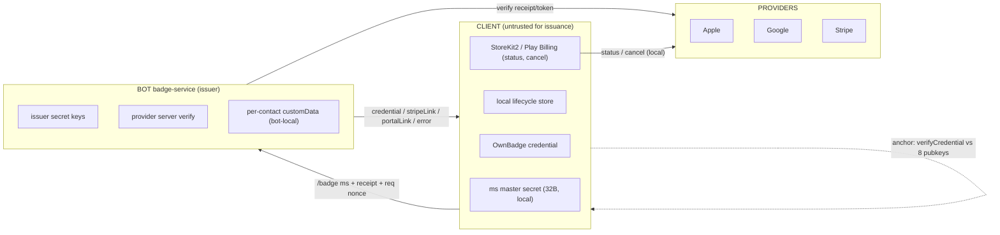
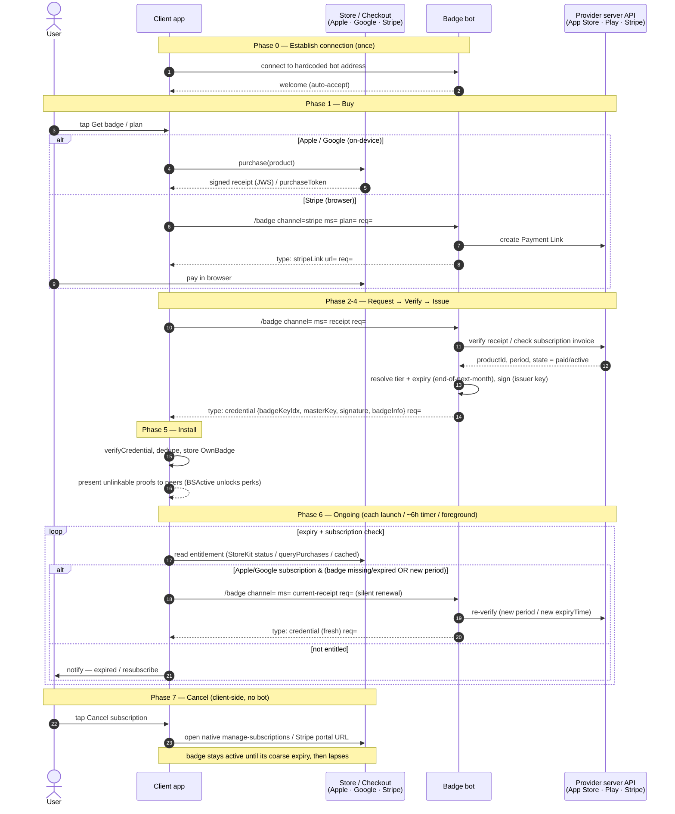
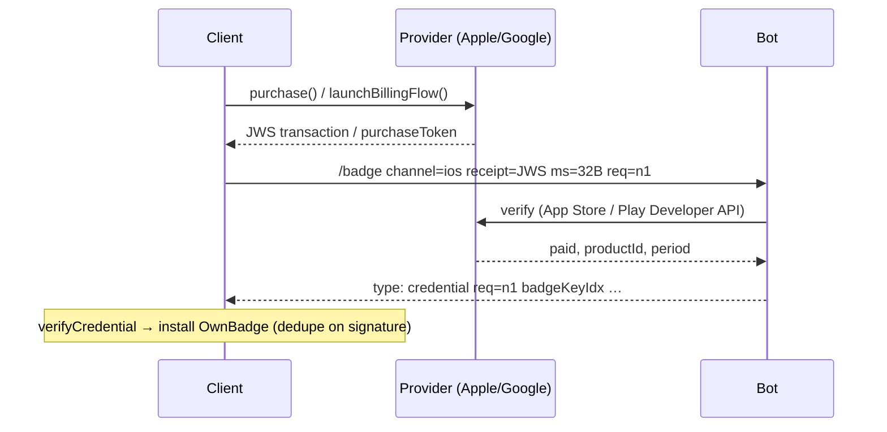
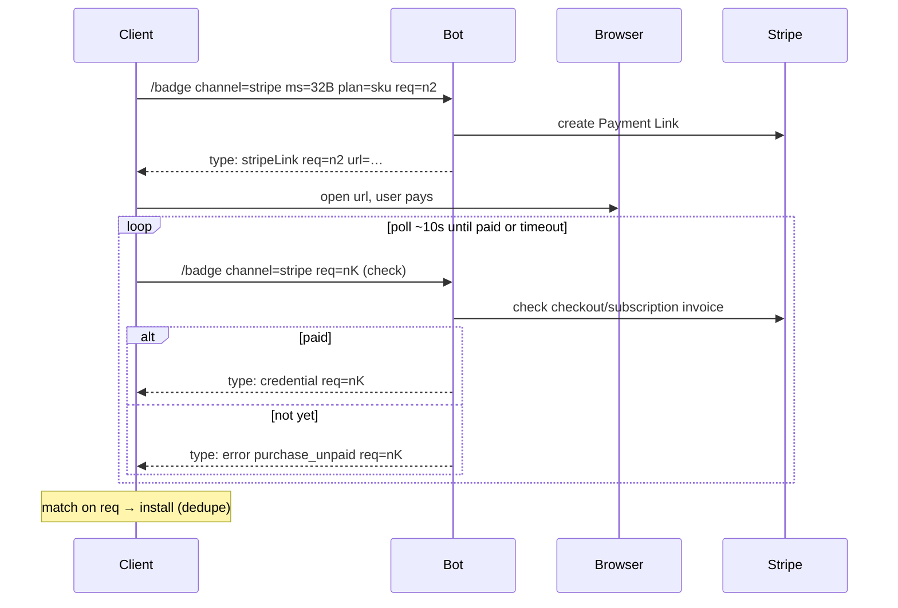
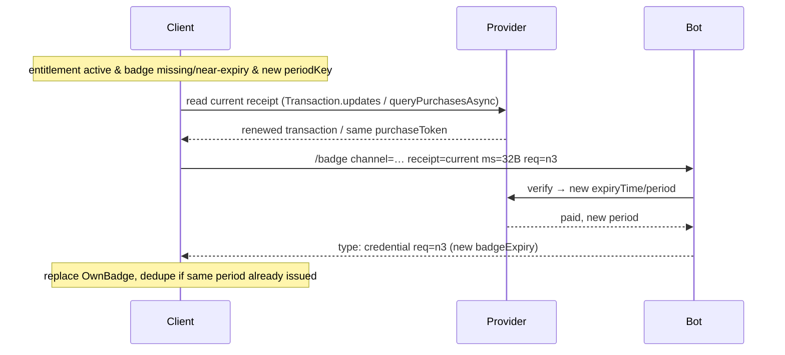
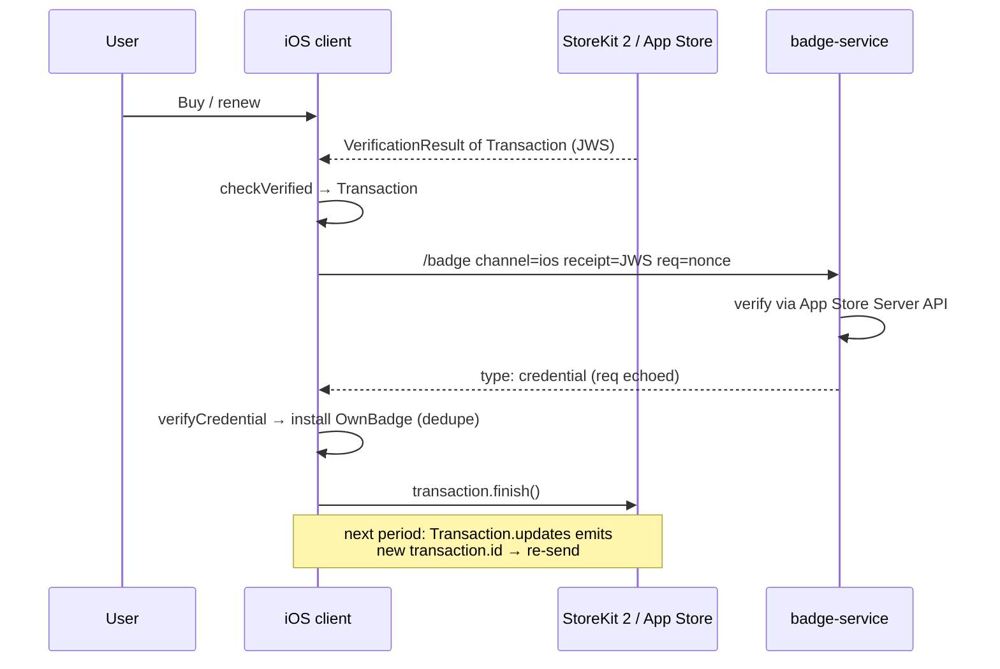
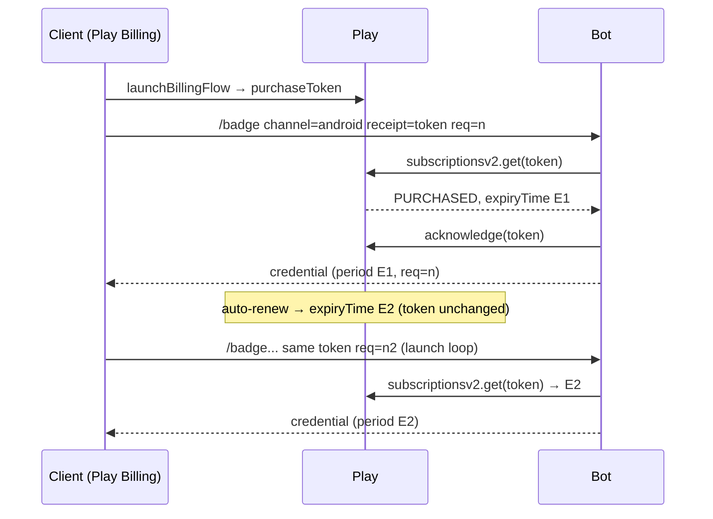
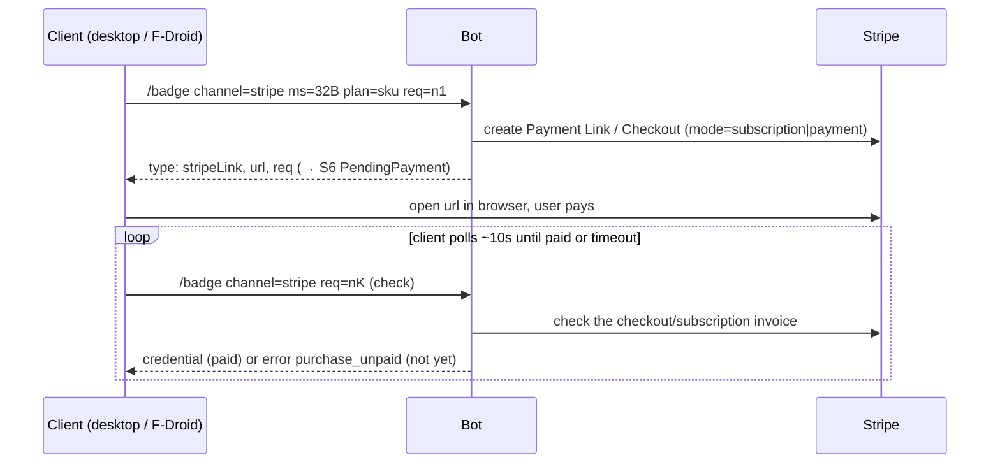
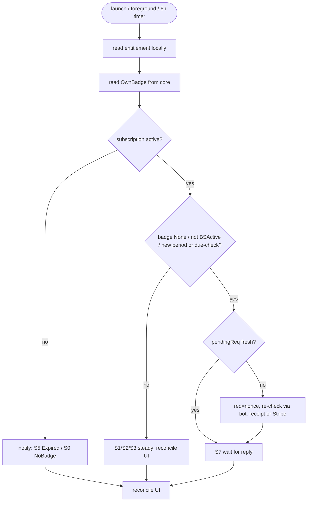
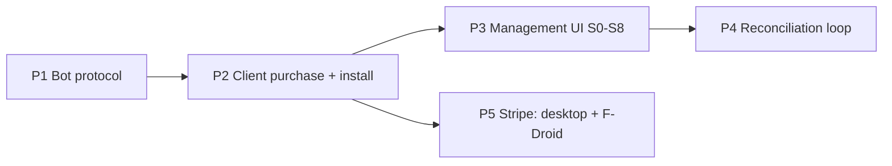

# Supporter Badges v2 — Implementation Plan

> Engineering plan: how the client, bot, and provider APIs implement the badge commercial lifecycle. Companion to the [Product Plan](2026-07-20-supporter-badges-v2-product.md) — go there for UX states, screens, product rules, and rationale. **v2 of** [`2026-06-01-supporter-badges-v1.md`](2026-06-01-supporter-badges-v1.md) (verification only).

**Date:** 2026-07-20 · **Status:** draft for review

> **Greenfield.** The client is display-only today: issuance is terminal-only (`/badge add <json>`, `Commands.hs:5717`) and unexposed in mobile/desktop. Everything below — purchase, install, reconciliation, provider integration — is new.

> Diagrams use Mermaid + SVG (a deliberate deviation from the ASCII-only house style, per request). SVG sources live in [`assets/`](assets/).

---

## Contents

- [1. Architecture & Roles](#1-architecture--roles)
- [2. Client ↔ Bot Protocol](#2-client--bot-protocol)
- [3. Client State Model](#3-client-state-model)
- [4. Provider Integration](#4-provider-integration)
- [5. Client Runtime & Reconciliation](#5-client-runtime--reconciliation)
- [6. Error Catalog & Handling](#6-error-catalog--handling)
- [7. Implementation Roadmap](#7-implementation-roadmap)
- [8. Open Technical Decisions](#8-open-technical-decisions)

---

## 1. Architecture & Roles

Technical companion to Product Plan §2 (How Badges Work). Subscription lifecycle is fully client-side; the core `BadgeStatus` enum is unchanged (see §3).

### 1.1 Trust boundary

Three parties, one hard trust line. The **client** is untrusted for issuance: it can neither pick its tier/expiry nor forge a badge. The **bot** (badge-service) is the sole issuer and the only party that talks to provider server APIs. **Providers** (Apple, Google, Stripe) are the payment authorities the bot verifies against.

Key split:
- **Status & Cancel are client-side.** The client reads subscription status locally (StoreKit2 / Play Billing / cached Stripe) and initiates cancel locally (App Store / Play UI, or a Stripe portal URL). The bot is never asked for status and never executes a cancel.
- **Issue & Renew are bot-side.** Only the bot holds issuer secret keys, verifies receipts/tokens server-side, and signs credentials. For Stripe it also mints checkout + customer-portal URLs (client has no Stripe key).


<sub>See also `assets/badge-v2-roles.svg`.</sub>

### 1.2 Capability matrix

| Capability | Client | Bot | Provider |
|---|---|---|---|
| Hold BBS master secret `ms` | ✅ owns (local) | ✖ sees per request, never persists | ✖ |
| Choose tier / expiry | ✖ | ✅ derives from verified productId | ✖ authority |
| Verify receipt / token | ✖ | ✅ server API | ✅ source |
| Hold issuer secret keys / sign credential | ✖ | ✅ | ✖ |
| Read subscription **status** | ✅ local | ✖ | ✅ source |
| Execute **cancel** | ✅ (store UI / portal) | ✖ (only mints Stripe URL) | ✅ executes |
| Drive **renewal** | ✅ client re-checks each period (all rails) | ✅ verifies payment for the period → issues (reactive; no push/webhook) | ✅ |
| Verify credential vs trust anchor | ✅ `verifyCredential` | n/a | ✖ |
| Present proof to peers | ✅ | ✖ | ✖ |

The bot is **reactive** and near-stateless — its per-contact `customData` (incl. the Stripe subscription id) is **bot-local and invisible to the client** (§1.4).

### 1.3 Trust anchor

The client's only issuance-trust input is a hardcoded set of **8 issuer BBS public keys** (idx 1–8) in `defaultChatConfig.badgePublicKeys` at `src/Simplex/Chat.hs:69-79`. Every credential carries `badgeKeyIdx`; the core verifies via `verifyCredential badgePublicKeys[idx]` (`src/Simplex/Chat/Badges.hs:306`). An unknown index → `BSUnknownKey` → "update app". Key rotation is an app release, not a runtime negotiation.

### 1.4 customData is bot-local → client keeps its own store

`Contact.customData` is JSON local to **each** side; the bot's record about a customer (issued badges, pending Stripe, subscription id) is **not synced** to the client, and vice versa. Consequences:

- The client **cannot** read the bot's issuance history — so subscription lifecycle **cannot** live on the bot for the client's benefit.
- The client keeps its **own** client-local lifecycle store (`lastIssued`, `pendingReq`, `entitlementCache`; see §3), populated from provider APIs + installed credentials, never from the bot's customData.
- Transport has no request/response correlation id, so the client embeds a `req` nonce echoed in every bot reply for matching/dedupe.

This asymmetry is the reason status/cancel/renewal reconciliation is client-driven: the client is the only party that can see both its provider entitlement and its installed badge.

*Provider capability summary (what's local vs. what needs the bot) lives in Product Plan §6; API detail is in §4.*

---

## 2. Client ↔ Bot Protocol

The bot's entire wire surface is the single `/badge` command plus `/issuer_pubkey` (badge-service `models.py:3`); v2 adds `/portal` and a `req` correlation nonce. Replies are bare, `type`-tagged YAML documents (`wire.py:84-99`) — no slash prefix.

### 2.1 End-to-end sequence

The complete lifecycle in one view: connect to the bot → buy on Apple/Google/Stripe → the bot verifies and issues → the client installs and shows the badge → on every launch/timer the client checks its own expiry + subscription and renews or notifies → cancel is client-side. `ms` = the client's 32-byte BBS master secret; `req` = a per-request correlation nonce. Message-level detail follows in §2.2–§2.7; the reconciliation loop is in §5.



### 2.2 Request grammar

```
/badge channel=ios|android|stripe ms=<32B b64url>
 req=<nonce> # v2: client correlation nonce, echoed in reply
 [plan=<sku>] [store=<cc>] [idem=<key>] [receipt=<...>]
/portal channel=stripe req=<nonce> # v2: mint Customer Portal URL (no ms — bot IDs the customer)
/issuer_pubkey # → issuerKeys {defaultKey, keys[]}
```

| channel | `receipt` payload | issue path |
|---|---|---|
| `ios` | StoreKit2 JWS signed transaction | verify via App Store Server API → credential |
| `android` | Play `purchaseToken` (stable across renewals) | verify via Play Developer API → credential |
| `stripe` | none | mint Payment Link → later push credential |

Each client uses **only the channel for its platform**: iOS → `ios`, Android → `android`, desktop → `stripe`. `stripe` (and `/portal`) are used by desktop and the F-Droid/no-GMS Android build; the Play Android and iOS builds never send them. `idem` is an optional purchase-level idempotency key, distinct from `req` (reply correlation, §2.4 / §8, Decision #4).

Server-authoritative: tier from verified productId, expiry = end-of-next-month cohort. Client-supplied `badgeType`/`badgeExpiry` are ignored (`models.py:62-66`).

> **Trust note.** `/issuer_pubkey` is an **operator diagnostic only**, never a client trust source. The client verifies every credential against the **8 issuer public keys hardcoded in `Chat.hs`** (§1.3) and must never trust a key fetched from the bot. There is no client-side verify/status FFI (§5.6).

### 2.3 Reply variants (all echo `req`)

`req` is added to every variant so the client can match a (possibly delayed) reply back to the request that started it.

```yaml
type: credential # Apple/Google now, or Stripe after payment
req: <nonce>
badgeKeyIdx: 1 # which of the 8 hardcoded issuer keys signed it
masterKey: <b64url 32B>
signature: <b64url>        # 80-byte BBS+ signature
badgeInfo: { badgeType: supporter, badgeExpiry: '2026-08-01T00:00:00Z', badgeExtra: '' }
```
```yaml
type: stripeLink # first Stripe message: open in browser to pay
req: <nonce>
url: https://checkout.stripe.com/c/pay/...
```
```yaml
type: portalLink # v2: hosted portal for status + user-driven cancel
req: <nonce>
url: https://billing.stripe.com/p/session/...
```
```yaml
type: error
req: <nonce>
code: purchase_unpaid # stable, machine-switchable; see error catalog
message: purchase is not paid
```

### 2.4 Correlation, delivery & idempotency

- **No transport correlation id.** SimpleX has no request/response id; the Python side matches only on sender `contact_id` + FIFO. Every credential is a **reply to a client request** (issuance, a pending-checkout poll, or a renewal re-check), but the reply can arrive late/out of order → the client matches on echoed **`req`**.
- **At-least-once delivery.** The agent de-dupes at the crypto layer, but a duplicate chat item can still surface. The client installs credentials **idempotently**, keyed on `(badgeKeyIdx, signature)`; a second copy is dropped.
- **Delayed replies.** Server message TTL = **21 days** (`simplexmq` STM.hs:223), so a bot reply survives weeks of client downtime; push-wake (APNS/WorkManager) TTL is only **24h** but the message is re-delivered on next foreground/resubscribe. The client re-checks on startup and each billing period (and polls while a Stripe checkout is pending); it dedupes replies on `(badgeKeyIdx, signature)` / `req`.

### 2.5 Apple / Google issuance



### 2.6 Stripe purchase (client-polled)

Checkout completes asynchronously in a browser, so the **client polls the bot** for issuance (the bot checks Stripe on each poll and issues once paid). No bot background poller, no push.



### 2.7 Renewal re-request

Client-driven on every rail. On startup and each billing period the client asks the bot to re-issue for the current period. **Apple/Google:** the client reads its current receipt/token and sends it (below). **Stripe:** the client sends a re-check for its stored subscription — no receipt (§4.3). Idempotency is keyed to the **period**, not the delivery.



---

## 3. Client State Model

Subscription lifecycle (purchase kind, auto-renew, grace, pending issuance) has **no representation in the core** — `BadgeStatus` is a fixed, crypto-derived, fieldless enum. All of it lives in a **new client-local store** layered on top. The nine user-facing states **S0–S8** and their UX are defined in the Product Plan (§2 How Badges Work); this section is the technical model behind them. This is the technical companion to that section.

### 3.1 Why lifecycle can't live in `BadgeStatus`

| Constraint | Consequence |
|---|---|
| `BadgeStatus = BSActive \| BSExpired \| BSExpiredOld \| BSFailed \| BSUnknownKey` — no fields, no pending/renewing/grace (`Badges.hs:112`) | Lifecycle needs richer, mutable state → keep it out of core. |
| Status is **recomputed** from the signed credential on every load via `mkBadgeStatus now verified {badgeExpiry}` (`Badges.hs:130`); never persisted as display state | Client cannot "write" a status; it can only hold a credential + its own side state. |
| Issuer sets tier + coarse expiry (end-of-next-month cohort); client cannot influence them | "Auto-renew", "canceled-but-active", "period end" are **provider** facts, not badge facts → read from StoreKit2 / Play / Stripe, not the credential. |
| 31-day window = visibility only (dim→hidden), not extra validity | UI must distinguish "entitled" (provider) from "shown/valid" (badge) independently. |

So each client state = **(core badge status) × (locally-read entitlement) × (pending request)**. The badge answers *"do I have a valid proof to show peers?"*; the entitlement answers *"am I still paying / covered?"*. They can disagree (e.g. paid but credential not yet delivered → S7).

Entitlement kinds (read locally from provider): `none | onetime(expiry) | subActive | subCanceledActive | graceOrRetry | lapsed`.

### 3.2 Client-local state store

New per-user store (app-local; see §8, Decision #2). Drives S0–S8; never trusted for crypto (the credential is the source of truth for proof).

| Field | Shape | Purpose |
|---|---|---|
| `lastIssued` | `{provider, periodKey, badgeExpiry, badgeKeyIdx}` | Detect renewal: `periodKey` = Apple `transactionId` / Google purchase period / Stripe invoice-or-period id. Re-request iff `ent.periodKey != lastIssued.periodKey`. |
| `pendingReq` | `{req, channel, startedAt} \| null` | In-flight `/badge` request; `req` nonce echoed by bot for reply correlation (transport has no correlation id, at-least-once). Drives S6/S7; cleared on install/timeout. |
| `entitlementCache` | `{kind, autoRenew, currentPeriodEnd, providerState}` | Last provider read (StoreKit2 `currentEntitlements` / Play `queryPurchasesAsync` / Stripe portal-cached), so UI renders offline. |

State is computed each render as `reconcile(coreBadge, entitlement, pendingReq)`; nothing here overrides `mkBadgeStatus`. Credential installs are **idempotent**, keyed on `(badgeKeyIdx, signature)` and the echoed `req`, so a duplicate or delayed push resolves the same state without double-issuing. The bot's own `customData` is invisible to the client (§1.4).

### 3.3 State → (BadgeStatus × entitlement) mapping

The technical composition behind the UX states (Product Plan §2.2):

| State | Core `BadgeStatus` | Entitlement |
|---|---|---|
| S0 NoBadge | none / `BSExpiredOld` | none |
| S1 ActiveOneTime | `BSActive` | onetime |
| S2 ActiveSubscription | `BSActive` | subActive |
| S3 SubCanceledActive | `BSActive` | subCanceledActive (period future) |
| S4 GraceOrBillingRetry | `BSActive` (grace) or `BSExpired` (on-hold) | graceOrRetry |
| S5 Expired | `BSExpired`→`BSExpiredOld` / none | lapsed / none |
| S6 PendingPayment | prior | none yet |
| S7 PendingIssuance | prior | active |
| S8 RecoverNeeded | none / `BSExpired` / `BSFailed` / `BSUnknownKey` | active |

Perks: only `BSActive` unlocks the larger XFTP file cap (`maxXFTPFileSize`, `Badges.hs:190` — 2 GB, or 5 GB for `legend`); a lapsed badge loses it (Product Plan §5.4).

---

## 4. Provider Integration

One rail per platform/flavor (iOS → Apple; Android Play → Google; Android F-Droid + desktop → Stripe); the user never picks a provider. UX meaning of each state referenced below is in Product Plan §5 (Product Rules).

### 4.1 Apple (StoreKit 2)

iOS uses **StoreKit 2** (`import StoreKit`). All purchases yield a signed, on-device-verified `Transaction` (JWS); the client forwards its `jwsRepresentation` to the bot as `channel=ios`. Status and cancel are read/performed locally — the bot is never queried for either.

**Purchase**

| Step | API | Notes |
|---|---|---|
| 1. Load product | `Product.products(for:)` | subscription SKU, or one-time as a **consumable** (so Extend can re-buy; a consumable is not in `currentEntitlements`, so the loop won't re-mint it) |
| 2. Buy | `try await product.purchase()` | returns `Product.PurchaseResult`; handle `.success`, `.userCancelled`, `.pending` (Ask to Buy / SCA) |
| 3. Verify | `case.success(let verificationResult)` | `VerificationResult<Transaction>` — StoreKit verified the Apple signature on-device |
| 4. Unwrap | `let transaction = try checkVerified(verificationResult)` | reject `.unverified(_, error)` |
| 5. Send to bot | `POST /badge channel=ios ms=<b64url> receipt=<transaction.jwsRepresentation> req=<nonce>` | bot re-verifies via **App Store Server API** and signs the BBS credential → S7 PendingIssuance |
| 6. Finish | `await transaction.finish()` | only after credential installed (or verify failure), so unfinished transactions replay on next launch |

The JWS is the receipt; there is no separate `appAccountToken` requirement, but one MAY be set at purchase to bind the transaction to the user.

**Status on device (client-local)**

Read from `Product.SubscriptionInfo.Status` (via `product.subscription?.status`), pick the entry for the user's `subscriptionGroupID`, then inspect `renewalInfo` and `transaction`.

| Signal | API | Entitled? |
|---|---|---|
| `.subscribed` | `Product.SubscriptionInfo.RenewalState` | yes |
| `.inGracePeriod` | same | yes (badge stays BSActive) → S4 overlay |
| `.inBillingRetryPeriod` | same | no (may still resolve) → S4 |
| `.expired` / `.revoked` | same | no → S5 / refunded |
| Auto-renew flag | `renewalInfo.willAutoRenew` | true→S2, false→S3 SubCanceledActive |
| Period end | `transaction.expirationDate` | drives `nextRenewal`; badgeExpiry is issuer-coarse (Product Plan §5.1) |

Maps to lifecycle states S1–S5.

**Cancel (client-side, no programmatic API)**

StoreKit 2 has **no** cancel API. The client only opens Apple's UI:

- In-app sheet: `try await AppStore.showManageSubscriptions(in: scene)` (needs a `UIWindowScene`), or SwiftUI `.manageSubscriptionsSheet(isPresented:)`.
- Fallback deep link: `https://apps.apple.com/account/subscriptions`.

The user cancels there; the app detects the result via `willAutoRenew=false` on next status read (→ S3).

**Renewal → bot (client-driven pull)**

Renewals produce a **new** `Transaction` each period with a new `id`. Detect and re-send at launch/foreground:

- On launch, drain `Transaction.updates` (background stream) and read `Transaction.currentEntitlements`.
- For each current entitlement, if `transaction.id != lastIssued.periodKey` **or** badge missing/expired → re-send that transaction's `jwsRepresentation` (Purchase, step 5) → S7.
- **Idempotency:** key on `transactionId`/`expirationDate`, not delivery; dedupe per §2.4.



**Refund, conversion, server path**

- **Refund:** `try await transaction.beginRefundRequest(in: scene)` opens Apple's refund UI. No revocation list on the badge — a granted badge stands until its coarse expiry; refunded/`.revoked` state just stops renewal (policy, §6.3).
- **One-time → subscription:** no conversion API — it is a **new** `Product.purchase()` of the subscription SKU (full flow). Overlapping coverage is allowed; coarse expiry dedupes (S1 "Subscribe" button).
- **Optional server path (not required):** **App Store Server Notifications v2** (`DID_RENEW`, `EXPIRED`, `DID_CHANGE_RENEWAL_STATUS`) could push renewals to the bot, but the bot is stateless/anonymous per user, so the **primary** signal is client pull (Renewal → bot, above). Server notifications are an optimization only.

### 4.2 Google (Play Billing)

Play Billing Library (client) sends only a `purchaseToken`; the bot verifies it server-side via the Play Developer API (`purchases.subscriptionsv2.get`). Status and cancel are client-side; issuance is periodic and keyed on `expiryTime`, not the token.

**Purchase**

| Step | Call | Result |
|---|---|---|
| Launch flow | `BillingClient.launchBillingFlow(activity, params)` with the product/offer | user pays in Play sheet |
| Read result | `PurchasesUpdatedListener` → `Purchase.getPurchaseToken()` | opaque token |
| Send to bot | `/badge channel=android ms=<32B> plan=<productId> receipt=<purchaseToken> req=<nonce>` | `type: credential` |

- `Purchase.getPurchaseState()`: `PURCHASED` → send to bot. `PENDING` (slow/cash/ask-to-buy) → **do NOT** send; wait for the state to flip to `PURCHASED` (re-check on launch, Status on device below), then send. Never grant entitlement on `PENDING`.

**Acknowledgement (MUST ack ≤ 3 days)**

Google auto-refunds any purchase not acknowledged within **3 days**.

- **Recommendation: the bot acknowledges** (`purchases.subscriptions.acknowledge` / `subscriptionsv2` ack) *after* it verifies the token and signs the credential — one authority, no double-ack, and the badge is guaranteed issued before ack.
- **Alternative:** client `BillingClient.acknowledgePurchase(...)` on `credential` receipt. Riskier — if the bot never issues, the purchase is still acknowledged (no auto-refund) and the user is out of pocket. Use only as a fallback if the bot ack path is unavailable.
- Idempotent: acking an already-acked purchase is a no-op; check `Purchase.isAcknowledged()` before re-acking.

**Status on device**

- `BillingClient.queryPurchasesAsync(SUBS)` → active `Purchase` list. Fields available client-side: `purchaseState`, `isAcknowledged`, `isAutoRenewing()`.
- **Limitation — call out:** Play Billing gives **no exact renewal/expiry date and no fine-grained subscription state on-device**. `isAutoRenewing()` is the only renewal signal. The precise `expiryTime`, `subscriptionState`, and grace/hold detail come from the **Play Developer API (server-side only)** — i.e. the bot. So exact `nextRenewal`/`periodEnd` for UI state S2 must come from the bot's verify response, or the UI shows coarse text ("renews via Google Play"). Do not attempt to compute expiry on-device.

**Cancel**

- **No client cancel API.** Deep-link to Play's subscription center:
 `https://play.google.com/store/account/subscriptions?sku=<productId>&package=<packageName>`
- The user cancels in Play. On return, re-run `queryPurchasesAsync` — `isAutoRenewing()` flips to `false` while the sub stays entitled until `expiryTime` (UI state S3, "active until period end").

**Renewal → bot**

The `purchaseToken` is **stable across auto-renewals** — a renewal does not mint a new token.

- Reconciliation loop re-sends the **same token** when badge is missing/near-expiry and entitlement is active.
- Bot `subscriptionsv2.get` sees the new `expiryTime`/`lineItems[].expiryTime` and issues a fresh credential.
- **Key issuance is on `expiryTime`/billing period, NOT the token.** Re-sending an unchanged token whose period has not advanced ⇒ bot returns the same period's credential (dedupe by `periodKey` = period end); no double issuance.



**subscriptionState → entitlement**

Bot maps Play Developer API `subscriptionState` (client cannot see this directly):

| subscriptionState | Entitled? | UI state |
|---|---|---|
| `SUBSCRIPTION_STATE_ACTIVE` | yes | S2 ActiveSubscription |
| `SUBSCRIPTION_STATE_IN_GRACE_PERIOD` | yes (grace) | S4 GraceOrBillingRetry |
| `SUBSCRIPTION_STATE_ON_HOLD` | no | S4 → S5 |
| `SUBSCRIPTION_STATE_PAUSED` | no | S5 Expired |
| `SUBSCRIPTION_STATE_EXPIRED` | no | S5 Expired |
| `SUBSCRIPTION_STATE_CANCELED` (auto-renew off, still in period) | yes until `expiryTime` | S3 SubCanceledActive |

Only `ACTIVE`/`IN_GRACE_PERIOD` justify (re-)issuing a badge; the coarse core `BadgeStatus` stays `BSActive` through grace because expiry is end-of-next-month cohort, not the Play period.

**RTDN (optional)**

Real-time Developer Notifications (Pub/Sub `SubscriptionNotification`: renewed, canceled, on-hold, grace, revoked) are a **server-side optimization only**. They would let the bot pre-issue on renewal, but the bot is stateless/anonymous per user, so **primary flow stays client-pull** (re-present token at launch, Renewal → bot above). RTDN is not required for v2; if added, use only to prompt re-verify, never as the sole entitlement source.

**Android build flavors (Play vs F-Droid / no-GMS)**

SimpleX Android is built in two flavors, and badge purchase **must** be gated on the flavor:

| Flavor | Google Mobile Services | Play Billing | Badge purchase |
|---|---|---|---|
| **Play** (Play Store) | yes | yes → `channel=android` | Play Billing. Google policy *requires* Play Billing for digital goods sold in the Play build. |
| **F-Droid / no-GMS** (reproducible / direct APK) | **no** | **unavailable** | **Stripe** browser checkout (`channel=stripe`) — same rail as desktop; keeps the FOSS APK free of proprietary Play Billing (see §4.3) |

**Build requirement:** Play Billing must live in a **`google`-flavor-only source set / dependency**, so the FOSS APK compiles without any Google Play blob. The core badge display/verification (v1) is flavor-independent — only *purchase/renew* is gated.

**Consequence — the no-GMS flavor uses Stripe** (`channel=stripe`), the same browser-checkout rail as desktop (see §4.3), since it can't bundle Play Billing. Play Billing stays in the `google`-flavor source set; the Stripe/browser path is flavor-independent, so the FOSS APK carries no Google blob. (Stripe renewal here is client-driven like every rail — see §4.3.)

### 4.3 Stripe (Desktop/Web)

Stripe is the rail for **desktop and the F-Droid / no-GMS Android build** (neither can use StoreKit/Play Billing); the Play Android and iOS builds never use it. The client has **no Stripe key**: all Stripe API calls run on the bot. The client only opens hosted URLs (Checkout, Customer Portal) in a browser, and polls the bot for issuance; it installs the credential the bot returns.

**Purchase (client-polled)**

Checkout completes asynchronously in a browser, so the client opens the link and then **polls the bot** until the invoice is paid and the badge is returned. The bot does no background polling and never pushes.



| Step | Detail |
|------|--------|
| Mode | `mode=subscription` for auto-renew; `mode=payment` for one-time (Extend). Tier derived server-side from `plan` sku, not client. |
| Confirm | The **client polls** the bot; the bot checks Stripe on each poll and returns the credential once paid — no bot background poller, no push. |
| Correlation | `req` nonce echoed in every reply; each is a reply to the client's poll. |
| Stable `ms` | Client MUST reuse the **same `ms` for the whole pending checkout** (persist `pendingReq.ms`); the credential is signed over that master secret, so a regenerated `ms` would not match. Clear only after install or timeout. |
| Timeout | If not paid within the client's poll window, S6 → prior state; the `pending_stripe` link persists (bot-side) so a re-open reuses it (no duplicate subscription). |

**Status + Cancel via hosted Customer Portal**

Stripe has no on-device entitlement API, so status/cancel go through Stripe's **hosted Customer Portal**. The bot mints the URL (it holds the Stripe key); the **user** self-cancels in the portal — the bot never executes the cancel.

- Client sends `/portal channel=stripe req=<nonce>` → bot creates `billing_portal/sessions` → replies `type: portalLink, url, req`.
- Client opens the URL; user views invoices, updates payment method, or cancels.
- Cancel sets **`cancel_at_period_end=true`** (reversible until period end) — badge stays `BSActive` through `current_period_end`, then lapses. This maps to UI **S3 SubCanceledActive** (Resubscribe = reopen portal or new Checkout).

`subscription.status` → client entitlement:

| Stripe status | Entitlement | UI |
|---------------|-------------|-----|
| `incomplete` | none yet (first payment pending) | S6 PendingPayment |
| `incomplete_expired` | none (checkout abandoned) | S0 / S5 |
| `active` | subActive (autoRenew on) | S2 |
| `active` + `cancel_at_period_end` | subCanceledActive | S3 |
| `trialing` | subActive | S2 |
| `past_due` | graceOrRetry (badge may still be active) | S4 |
| `unpaid` | lapsed | S5 |
| `canceled` | lapsed / none | S5 / S0 |
| `paused` | lapsed | S5 |

> **FLAG — API Basil (2025-03-31):** `current_period_end` was **removed from the subscription object** and now lives per-item at **`subscription.items.data[].current_period_end`**. The bot must read the item, not `subscription.current_period_end` (null on Basil). This is the period-end / next-renewal date shown in S2/S3. Verify the bot's pinned Stripe API version and read the field accordingly.

**Renewal (client-driven)**

Like every rail, the client drives it — on startup and each billing period it sends a **re-check** request; the bot uses the stored subscription id to look up Stripe.

- The client can't read Stripe status locally, so it re-checks on a schedule (startup + each billing period); the bot compares the subscription's current invoice/period (`billing_reason=subscription_cycle`). If a new period is paid it issues a fresh credential (next coarse expiry) as the reply; otherwise it returns the current one.
- The re-check **must not** open a new checkout — it targets the **existing** subscription (the bot holds its id per contact), a distinct request from the initial purchase.
- Idempotency: key the badge to the **period** (`invoice`/period id), not delivery; dedupe per §2.4. A mid-period re-check returns the current badge unchanged.
- Failed renewal → `past_due`/`unpaid`: portal deep-link to fix payment method (S4). No revocation list — a refunded/canceled sub simply lapses at period end.

---

## 5. Client Runtime & Reconciliation

The client is display-only today: it mirrors `BadgeInfo`/`BadgeStatus` (crypto-free) and can only present proofs. v2 adds a **reconciliation loop** that reads local entitlement + `OwnBadge`, and a **request-issuance + install-credential** path. Subscription lifecycle lives entirely client-local (§3).

### 5.1 The loop (launch / foreground / ~6h timer)

Runs on `onLaunch`, `onForeground`, a coarse `~6h` timer, and once per billing period. For every rail the client asks the bot to re-issue for the current period; while a Stripe checkout is pending it polls the bot until issued.

```
onStartup / onForeground / timer(~6h) / new-billing-period:
 badge = core.ownBadge()                          # {info, status} or None
 sub   = knownSubscription()                      # rail + how to re-check; or one-time / none
 if sub is subscription:
   if sub.rail in {apple, google}:                # local status available
     ent = readEntitlement()                      # currentEntitlements / queryPurchasesAsync
     if ent.active and (badge is None or badge.status != BSActive
                        or ent.periodKey != state.lastIssued.periodKey):
       reCheck(sub.rail, currentReceipt(ent))     # bot verifies the receipt for the period
   else:                                          # stripe — no local status
     if badge is None or badge.status != BSActive or duePeriodCheck(state.lastIssued):
       reCheck(stripe)                            # bot re-checks the stored subscription
 elif sub is one-time:
   pass                                           # never auto-renews; expiry → S5 → Extend
 else:                                            # nothing active
   if badge missing/expired: notifyUser(S5 Expired / S0 NoBadge)
 reconcileUI(badge, sub, state.pendingReq)        # -> S0..S8

 # reCheck: req = newNonce(); guarded by pendingReq (no overlapping in-flight).
 #          Bot replies credential (cached if same period, fresh if new) or purchase_unpaid.
```

**Renewal detection.** Apple = new JWS `transactionId`; Google = same stable `purchaseToken`, bot sees new `expiryTime`; **Stripe** has no local `periodKey`, so the client re-checks on a schedule and the **bot** decides (returns cached-or-fresh for the period). Key badges to the **period, not the delivery**.

- **One-time badges never auto-renew:** an expired one-time badge → S5, and **Extend** is a fresh *consumable* purchase. This prevents re-minting a new coarse-expiry badge forever from a single purchase. A one-time credential lost locally (reinstall) is not restorable — the user re-buys.
- **Stripe status** for the UI comes from the hosted portal + `entitlementCache` (no local API).

### 5.2 Flowchart



### 5.3 Credential install (idempotent)

Credential replies arrive as (possibly delayed) replies to the client's requests, handled by one `@on_message`-style handler:

1. Match reply to request via echoed `req` nonce (transport has no correlation id; at-least-once → dedupe).
2. `verifyCredential badgePublicKeys[badgeKeyIdx]` — the 8 issuer pubkeys are hardcoded in `src/Simplex/Chat.hs:69` (`badgePublicKeys`). Unknown idx → `BSUnknownKey` → prompt "update app" (S8).
3. Install via `addUserBadge` (`Library/Commands.hs:5078`, which calls `setUserBadge` in `Store/Profiles.hs`) as `OwnBadge {master_key, signature, key_idx}`.
4. **Dedupe** per §2.4 (`(badgeKeyIdx, signature)`): re-applying an installed credential is a no-op, safe against duplicate chat items.

Status is recomputed by `mkBadgeStatus` on every load, never stored.

### 5.4 Delivery reliance

Bot replies rely on store-and-forward: messages persist **21 days** (`STM.hs:223`); push-wake TTL is 24h but the message is re-delivered on next foreground/resubscribe. The client sends re-checks on its schedule (startup + each billing period) and polls only while a Stripe checkout is pending — never a spin timer; `pendingReq` guards against overlapping in-flight requests, and duplicate replies dedupe (§2.4).

### 5.5 Client-local state

Fields defined in §3.2 (`lastIssued`, `pendingReq`, `entitlementCache`) — app-local storage; the bot's own customData is invisible to the client (§1.4).

### 5.6 New client APIs / FFIs

Client is display-only today (only terminal `/badge add <json>` at `Commands.hs:5717` → `AddBadge` reaches `addUserBadge`; not exposed in mobile).

| Need | Today | v2 addition |
|---|---|---|
| Request issuance | none | Send `/badge … req=<nonce>` via existing `APISendMessages`; provider receipt gathered in Swift/Kotlin |
| Install credential | terminal `/badge add` only | Mobile-facing API wrapping `verifyCredential` + `addUserBadge` (reuse core path; expose over the chat FFI) |
| Read own badge | `JSONBadge` on load | reuse (unchanged) |
| Persist lifecycle state | none writable | app-local store, or `APISetContactCustomData` (`/_set custom`) on bot-contact |
| Receive delayed credential | `CRNewChatItems` stream | route to install handler (§5.3) |

No new verify/status FFI on the client: verification stays inside core (`verifyCredential`); the client only supplies `req` + receipt and consumes `JSONBadge {badge, status}`.

---

## 6. Error Catalog & Handling

Every failure the client can surface, grouped by origin. Retryable = safe to auto-retry (backoff); "no-op" = success masquerading as error. Idempotency rule throughout: key the badge to the **period**, not the delivery, and dedupe credentials on `(badgeKeyIdx, signature)` / echoed `req` nonce.

### 6.1 Bot domain errors (`type: error` reply)

Codes are the fixed bot set. Reply always echoes `req` so the client matches it to the in-flight request.

| Error | Origin | Meaning | Client UX handling | Retryable? |
|---|---|---|---|---|
| `bad_request` | bot parse | Malformed `/badge` args | Client bug: log, fix request, no toast | No |
| `purchase_not_found` | bot ↔ provider verify | No purchase/token matches receipt (stale, wrong channel, or provider propagation lag) | Retry w/ backoff; if persists → "couldn't verify purchase, retry / contact support" | Yes (limited) |
| `purchase_unpaid` | bot ↔ provider | Payment pending/unpaid (Google PENDING, unpaid invoice) | S6/S7 "waiting for payment"; do not re-issue; resolve when entitlement flips PURCHASED | No (auto on pay) |
| `already_issued` | bot idempotency | Badge already signed for this period | Treat as success; ensure local badge present, else re-request same `idem` | No-op |
| `idempotency_mismatch` | bot idempotency | Same `idem`/`req` reused with different content | Client bug/nonce collision: regenerate nonce, resubmit | No (fix first) |
| `bad_master_secret` | bot input | `ms` not valid 32B b64url | Client bug: regenerate `ms`, retry | Yes (after fix) |
| `unknown_badge_type` | bot config | Verified productId maps to no `badge_types` row | Server misconfig: "temporarily unavailable", contact support; no re-purchase | No |
| `invalid_badge_type` | bot config | Badge type present but invalid/misconfigured | Same as above → support | No |
| `stripe_config` | bot config | Stripe not configured on bot | Desktop/web only: "payments unavailable, try later" | Yes (later) |
| `stripe_upstream` | bot ↔ Stripe | Stripe API error/5xx | Retry w/ backoff | Yes |
| `issuer_key_missing` | bot signing | Issuer secret for `badgeKeyIdx` unavailable | "Couldn't finalize, retry"; ops issue → retry later | Yes (later) |
| `issuer_key_invalid` | bot signing | Issuer key present but invalid | Ops issue: "temporarily unavailable", support; no client retry | No |
| `temporarily_unavailable` | bot backpressure | Maintenance / rate limit | Retry w/ backoff, honor delay | Yes |
| `internal_error` | bot unhandled | Unexpected bot exception | Retry once w/ backoff → then support | Yes (limited) |

### 6.2 Transport (simplexmq, at-least-once)

Correlation is the echoed `req` nonce (§2.4).

| Error | Origin | Meaning | Client UX handling | Retryable? |
|---|---|---|---|---|
| Bot offline | SMP queue | Request queued; sender retries 2d (7d if recipient quota-full), msg TTL 21d | Stay in S7 "finalizing"; no user action; reply arrives when bot returns | Auto |
| Client offline | SMP queue | Credential reply queued for offline client | Delivered on reopen/resubscribe; reconciliation installs it | Auto |
| Duplicate delivery | at-least-once | Same credential/chat item surfaces twice | Dedupe per §2.4; ignore dup | N/A |
| No reply / timeout | no correlation id | Reply lost or not yet arrived | Keep `pendingReq`, show "finalizing"; re-request **only** via reconciliation loop, never spam | Auto (loop) |
| Push wake TTL | APNS/WorkManager | Push wake TTL 24h < msg TTL 21d | Credential still delivered on next foreground even if push expired; do not treat as lost | Auto |

### 6.3 Provider client-side (StoreKit2 / Play Billing / Stripe)

| Error | Origin | Meaning | Client UX handling | Retryable? |
|---|---|---|---|---|
| User-cancelled purchase | StoreKit `userCancelled` / Play `USER_CANCELED` | User dismissed the purchase sheet | Silent: return to prior state, no error toast | N/A |
| Deferred / pending | Apple ask-to-buy / Google `PENDING` | Awaiting family approval or slow payment | "Pending approval"; do **not** send receipt yet; proceed on `Transaction.updates` / `queryPurchasesAsync` → PURCHASED | Auto on resolve |
| Network failure | provider / SMP | Purchase or receipt-send failed on network | Retry w/ backoff; keep local purchase for re-send | Yes |
| Store unavailable | StoreKit/Billing init | Billing service down / not signed in | "Store unavailable, try later" | Yes (later) |
| Already-owned | StoreKit/Billing | Item already owned (reinstall, prior buy) | Not an error: fetch existing transaction/token, (re)send to bot → S7 | Yes (recover) |
| Refunded / revoked | `Transaction.revoked` / Play refund | Entitlement revoked after issue | No revocation list; badge stays valid until its signed expiry, then lapses; client may hide on detecting revoked entitlement | N/A (policy) |
| Grace / billing-retry | Apple `.inGracePeriod`/`.inBillingRetryPeriod`, Google `IN_GRACE_PERIOD`/`ON_HOLD` | Renewal payment failing | S4 overlay "payment issue — fix payment method" → deep link store/Stripe portal | Auto on fix |
| `BSUnknownKey` (app too old) | core verify | Credential `badgeKeyIdx` not in client's hardcoded keys | Hold credential; "Update app to display your badge"; re-verify after update | No (update) |
| `BSFailed` (bad signature) | core verify | Credential fails `verifyCredential` (corrupt/tampered, not unknown key) | Drop it, log; re-request issuance via the loop (§5.1) | Yes (re-request) |

### 6.4 Edge cases & policy

| Case | Origin | Meaning | Client UX handling | Retryable? |
|---|---|---|---|---|
| One-time + sub overlap | client flow | User subscribes while one-time still active (double coverage) | Allow; coarse end-of-next-month expiry dedupes; badge just gains later expiry (S1→S2) | N/A |
| Cancel then resubscribe | client flow | `subCanceledActive` then user resubscribes | S3 "Resubscribe" = new subscription purchase; no gap if within period | N/A |
| Multi-device (unlinkable) | client model | Each device has own `ms` + credential, badges unlinkable | Issuance on one device does NOT propagate; each device must re-purchase/restore + re-request independently | N/A |
| Refund after issuance | policy | Badge already signed for the period; no revocation list | Irrevocable: badge expires naturally at period end; accepted financial-loss policy | No (policy) |

**Cross-cutting rules:** (1) A success-shaped error (`already_issued`) must never block the UI — reconcile against the local badge. (2) All retries go through the launch/timer reconciliation loop, not per-error retry storms. (3) Server/config errors (`unknown_badge_type`, `invalid_badge_type`, `issuer_key_invalid`, `stripe_config`) are **not** the user's fault — never prompt re-purchase, route to support.

---

## 7. Implementation Roadmap

Phased so each phase ships independently and unblocks the next. "Greenfield" = no code exists today.

### 7.1 Phasing overview



### 7.2 Phase 1 — Bot protocol additions (badge-service)

| Item | Repo / file | Status |
|---|---|---|
| Echo `req=<nonce>` in every reply (credential/stripeLink/error) | badge-service wire handler | Greenfield (add field to existing replies) |
| `/portal channel=stripe` → `type: portalLink, url` (billing_portal/sessions) | badge-service | Greenfield |
| Renewal via existing `/badge` re-verify (no new command) | badge-service | Exists; confirm Apple/Google server re-verify path |

No `/status`, no `/cancel` — those stay client-side.

### 7.3 Phase 2 — Client purchase + credential install

| Item | Repo / file | Status |
|---|---|---|
| New `ChatCommand` + FFI to submit receipt/token and install credential | core `Library/Commands.hs` (today only terminal `AddBadge`, Commands.hs:5717), `Mobile/Badges.hs` | Greenfield (mobile-exposed path) |
| StoreKit2 purchase → JWS → `channel=ios` | apps/ios | Greenfield |
| Play Billing `launchBillingFlow` → token → `channel=android` | apps/multiplatform (android) | Greenfield |
| Idempotent install: dedupe on `(badgeKeyIdx, signature)` / echoed `req` | core `addUserBadge` reuse | Extend existing |
| Isolate Play Billing to the **`google`-flavor source set**; the F-Droid/no-GMS flavor uses Stripe browser checkout instead (§4.2/§4.3) | apps/multiplatform android `build.gradle` + flavor source sets | Greenfield |

### 7.4 Phase 3 — Badge management UI (states S0-S8)

| Item | Repo / file | Status |
|---|---|---|
| Management screen rendering S0-S8 + CTAs | apps/ios, apps/multiplatform | Greenfield |
| Badge glyph display (dim/hide/warn) | `NameBadge.swift`, Kotlin `ChatInfoImage.kt`/`Utils.kt` | Exists — reuse |
| Client-local lifecycle store (lastIssued/pendingReq/entitlementCache) | client-local — see §8, Decision #2 | Greenfield |

### 7.5 Phase 4 — Reconciliation loop

| Item | Repo / file | Status |
|---|---|---|
| onLaunch/onForeground/timer(~6h): read entitlement, compare periodKey, re-request | apps/ios, apps/multiplatform | Greenfield |
| Single `@on_message`-style credential handler (solicited + delayed push) | client receive path (`CRNewChatItems`) | Greenfield |
| Status read: StoreKit2 `currentEntitlements`, Play `queryPurchasesAsync` | client | Greenfield |

### 7.6 Phase 5 — Stripe (desktop + F-Droid Android)

| Item | Repo / file | Status |
|---|---|---|
| Open Payment Link (S6) + Customer Portal (`/portal`) in a browser | apps desktop (Kotlin) + Android F-Droid flavor | Greenfield |
| Client-polled purchase: link now, client polls the bot until the invoice is paid and the badge is returned; **re-check-existing-subscription** request for renewal (no new checkout) | badge-service + client handler | Greenfield (client poll; drop bot background poller/push) |

---

## 8. Open Technical Decisions

Product-facing decisions (catalog shape) live in Product Plan §7. The technical ones:

| # | Question | Recommended default |
|---|---|---|
| 1 | Google renewal-date precision without the Play Developer server API? | Accept **client-coarse** expiry (badge expiry is already coarse end-of-next-month); do not block on exact `expiryTime`. Let the bot's `subscriptionsv2.get` set authoritative expiry at issue. |
| 2 | Where does client-local lifecycle state live — app-local storage vs `customData` on bot-contact? | **App-local** (Keychain/DataStore). `customData` is per-side and not synced; no multi-device benefit and adds a write API dependency. |
| 3 | Google purchase acknowledgement — client or bot? | **Bot acknowledges** after server verify (single authority, avoids 3-day-refund race if client is offline). |
| 4 | Correlation: new `req` nonce per request vs reuse existing `idem`? | **New `req` nonce** per request for reply-matching; keep `idem` for purchase-level idempotency. They serve different purposes — do not overload one. |