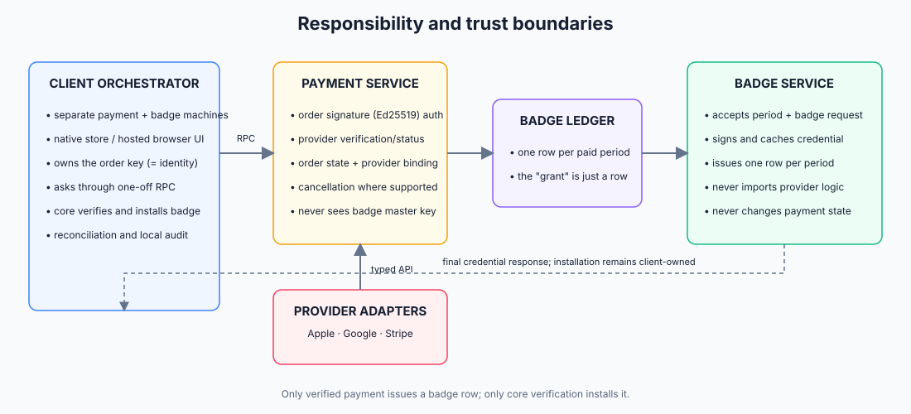
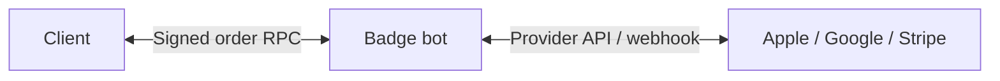
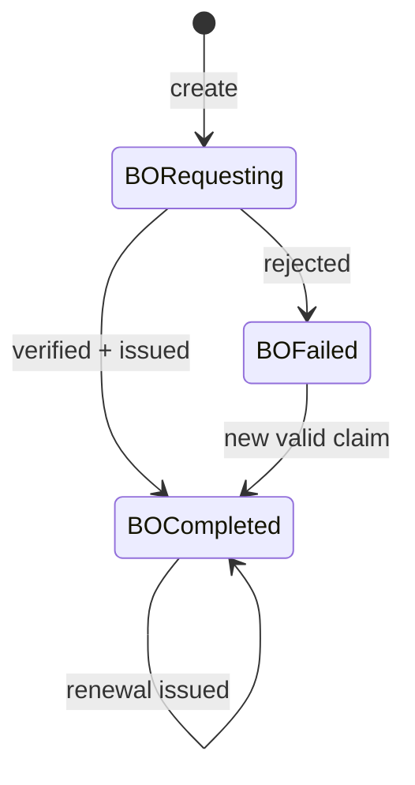
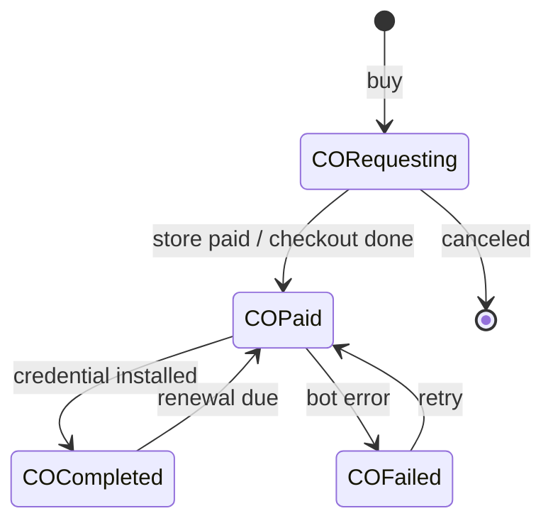
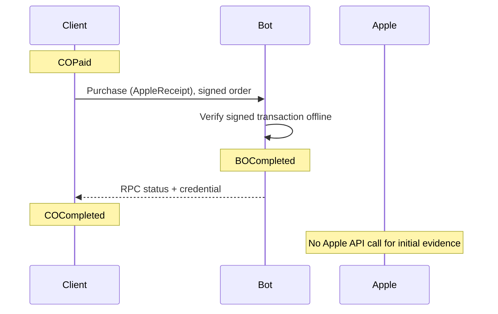
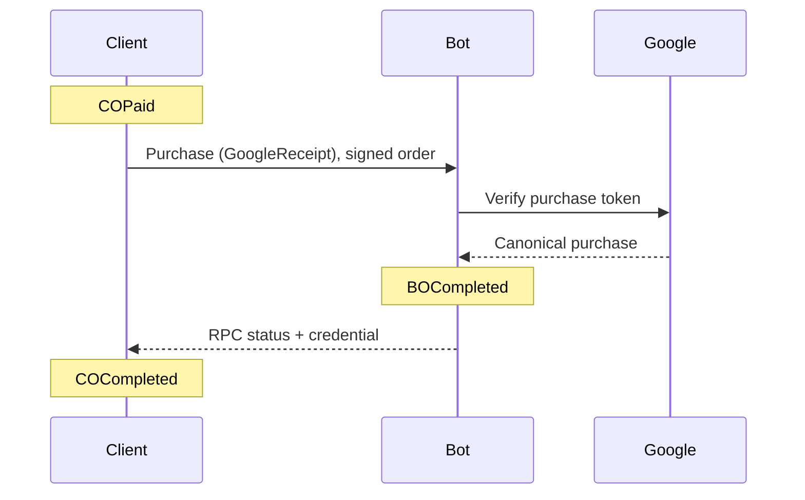
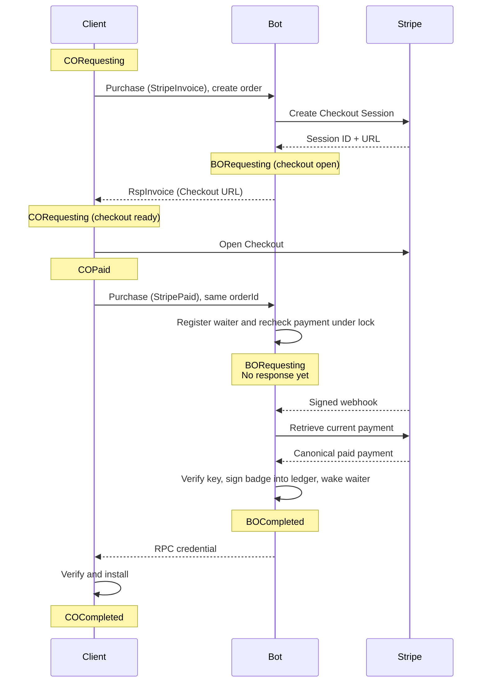
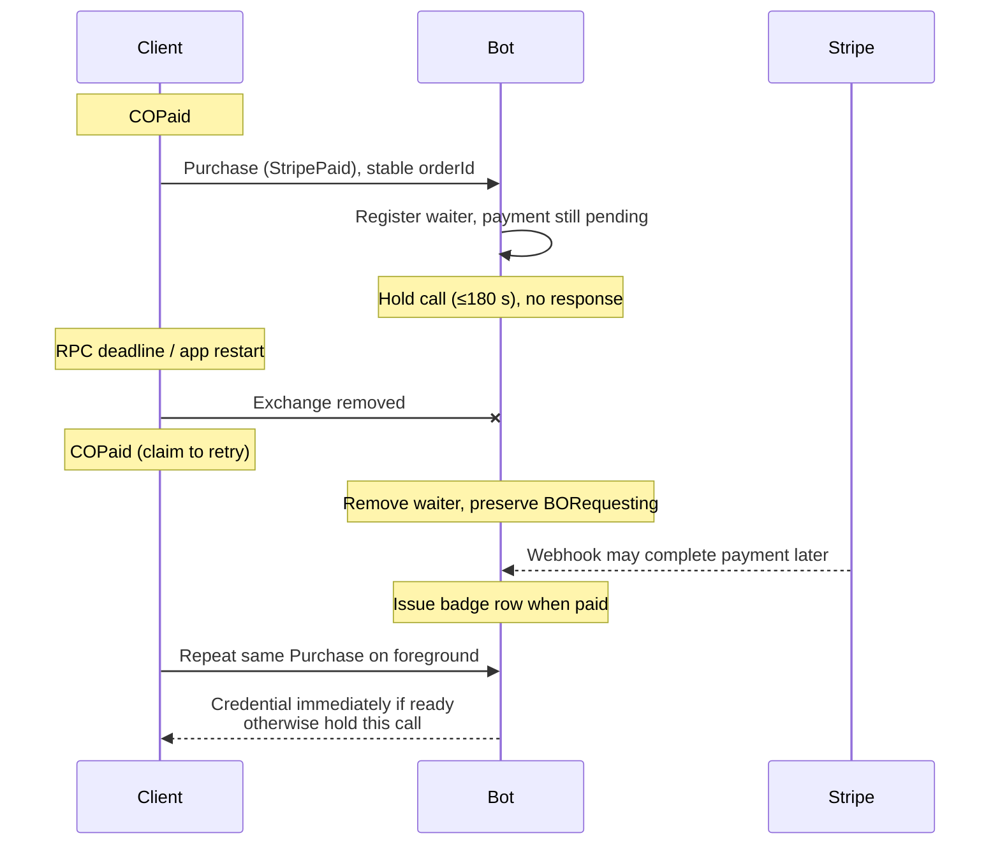
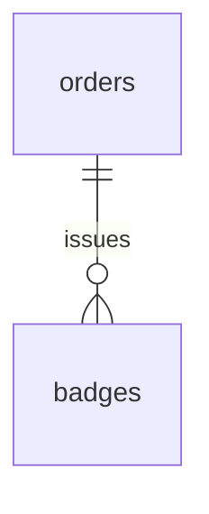

# Supporter Badges v2 — Implementation Plan

**Date:** 2026-07-21
**Status:** implementation-ready
**Companion:** [Product and UX plan](2026-07-20-supporter-badges-v2-product.md)

An **order** (`orderId` = client UUID, authenticated by an Ed25519 `orderKey`) carries a `product` and a `payment`. It has three persisted states — **requesting → completed | failed** — and issued badges are rows in a separate `badges` ledger (one per paid period). Current provider/subscription status is re-derived on each request, never stored. Order / product(badge) / payment are decoupled and product-extensible.



## Contents

- [1. Architecture](#1-architecture)
- [2. State machines](#2-state-machines)
- [3. Contracts](#3-contracts)
- [4. Provider flows](#4-provider-flows)
- [5. Persistence](#5-persistence)
- [6. Reconciliation and errors](#6-reconciliation-and-errors)
- [7. Provider rules](#7-provider-rules)
- [8. Recovery](#8-recovery)
- [9. Security and concurrency](#9-security-and-concurrency)
- [10. Delivery and tests](#10-delivery-and-tests)
- [11. API references](#11-api-references)
- [12. Open questions](#12-open-questions)

## 1. Architecture

### Responsibilities


```mermaid
flowchart LR
  C[Client] <-->|Signed order RPC| B[Badge bot]
  B <-->|Provider API / webhook| S[Apple / Google / Stripe]
```

| Component | Owns | Must not own |
|---|---|---|
| Client order | `orderId`, `orderSk` key, purchase UI, cached status, retry schedule | bot/provider truth |
| Client badge | BBS master key, credential receipt and installation | billing state |
| Order service | order key registration, product pin, proof verification, order state, provider binding | badge master key, credential |
| Badge ledger | one issued badge per paid period (the "grant" is just a row) | provider/billing logic |
| Badge service | signing and idempotent credential cache | provider/billing logic |
| Core | signature verification and installed badge | payment status |

Treat these as separate programs with typed interfaces.

### Invariants

1. Provider verification changes the order's payment outcome only; it never signs or installs the badge.
2. An order is identified by a client-generated `orderId` (UUID) and authenticated by its `orderKey` — the transport's agent-verified Ed25519 signer key, registered on create and equality-checked on every request. The bot does no signature crypto. No caller identity, no bot-issued token, no bot push.
3. The `product` is immutable per order: pinned on the first request; a differing product later is rejected.
4. For a badge product, the client supplies only the SKU (`plan`) and `BadgeMasterKey`; the bot derives tier/expiry and assembles `BadgeInfo`. The declared SKU must equal the SKU verified in `payment`.
5. `BadgeMasterKey` (32 random bytes, BBS message 0 via `generateMasterKey`) lives only inside the badge product; it signs the badge and is never an identifier or an auth credential.
6. A badge is issued only for a period the provider confirms paid; issuance into the `badges` ledger is idempotent on `(order, period, master-key hash)`.
7. Payment never activates perks; the verified credential does.
8. Duplicate requests/events return the same result. Unknown states preserve prior state.
9. Provider dates create eligibility; retry/request time never changes badge expiry.

### Issuance periods

A paid order yields one badge per eligible month. Eligibility is **derived from the provider on each request, never stored as a state**:

- One-time: one period at the verified purchase time. Reject another one-time order for the same provider binding while its period is active.
- Subscription: period `n` starts at `addCalendarMonths n verifiedAnchor`, eligible while `periodStart(n) <= now < paidThrough`.
- Monthly and yearly plans both expose one period per eligible month.
- Badge expiry is the start of the month two months after the period start.
- A `badges` row is unique on `(order_id, period_start)`; the master-key hash binds it to the client key.
- Example: 21 July period → badge expires 1 September; monthly billing renews 21 August.

On each request the bot asks the provider which periods are paid, then issues a badge for any eligible period with no row yet. Refund/revoke simply removes future eligibility (an already-issued BBS badge stands to its expiry); it is never a stored order state.

## 2. State machines

Only **persisted** states are modelled here; everything else (a request in flight, a checkout screen open, an install running) is transient UI or per-request code, not a stored state. Two tiny machines, plus a `badges` issuance ledger that is a table, not a machine.

### Bot order

| State | Meaning |
|---|---|
| `BORequesting` | order created; invoice/link/receipt-slot issued; awaiting a valid payment claim |
| `BOCompleted` | payment verified; badge issued for the due period (a `badges` row exists) |
| `BOFailed` | a payment claim was verified and rejected |

`BOCompleted` is not terminal for subscriptions: each renewed month becomes a new eligible period and a new `badges` row; the order stays `BOCompleted`. Current subscription status (active/grace/canceled/refunded) is re-derived from the provider on each `Status`, never stored.

### Client order

| State | Meaning |
|---|---|
| `CORequesting` | before/at store payment, or awaiting the Stripe link |
| `COPaid` | store payment done / checkout completed; receipt held; claim pending or to retry |
| `COCompleted` | credential received and installed |
| `COFailed` | bot rejected the payment |

The client adds `COPaid` — it knows it paid before the bot confirms — whereas the bot verifies and issues atomically, so it has no "paid-but-not-delivered" state. Transient UI (preparing, checkout open, canceling, a payment problem) is computed from (the local op in flight) + (the last bot answer), not persisted.

### Types

```haskell
data BotOrderState    = BORequesting | BOCompleted | BOFailed
data ClientOrderState = CORequesting | COPaid | COCompleted | COFailed
```

Two closed sums. A badge is a row in `badges` (§5), not a state; the client marks install with an `installed` flag on that row. A transition is legal only from a listed source constructor.

### Transitions

Bot order:

| From | On | To |
|---|---|---|
| — | create (invoice / link / receipt slot) | `BORequesting` |
| `BORequesting` | payment claim verified, badge issued | `BOCompleted` |
| `BORequesting` | payment claim rejected | `BOFailed` |
| `BOFailed` | a new valid claim | `BOCompleted` |
| `BOCompleted` | subscription renewal, new period issued | `BOCompleted` |

Client order:

| From | On | To |
|---|---|---|
| — | user buys | `CORequesting` |
| `CORequesting` | store paid / checkout done | `COPaid` |
| `CORequesting` | user cancels before paying | (row deleted) |
| `COPaid` | credential returned and installed | `COCompleted` |
| `COPaid` | bot error | `COFailed` |
| `COCompleted` | new period due (renewal) | `COPaid` |
| `COFailed` | retry | `COPaid` |

Badge issuance is not a machine: a `badges` row is created (idempotently) when a credential is delivered, and the client sets its `installed` flag after core verifies it.

### Diagrams

Bot order:


```mermaid
stateDiagram-v2
  [*] --> BORequesting: create
  BORequesting --> BOCompleted: verified + issued
  BORequesting --> BOFailed: rejected
  BOFailed --> BOCompleted: new valid claim
  BOCompleted --> BOCompleted: renewal issued
```

Client order:


```mermaid
stateDiagram-v2
  [*] --> CORequesting: buy
  CORequesting --> COPaid: store paid / checkout done
  CORequesting --> [*]: canceled
  COPaid --> COCompleted: credential installed
  COPaid --> COFailed: bot error
  COCompleted --> COPaid: renewal due
  COFailed --> COPaid: retry
```

## 3. Contracts

An order is `product + payment`, identified by a client `orderId`. **Authentication is provided by the transport — we define no envelope and do no signature cryptography.**

### Transport and auth

The bot runs over the SimpleX **service RPC** (branch `rpc`, merged `d2b63cd46`; `plans/2026-07-22-service-rpc-chat.md`; simplexmq pin `a82b487a`): one request → one response over a double-ratchet contact address, JSON-object payloads both ways. A request may be signed with an Ed25519 key; the **agent constructs and verifies that signature** and hands the service the request plus the *already-verified* signer public key (`CEvtServiceRequest.signerKey :: Maybe C.PublicKeyEd25519`), or `Nothing` if unsigned. An invalid signature, a malformed (non-JSON-object) body, or a request to an instance with processing off never reaches the service — the agent/chat layer discards it (`ASEBadSignature`, or a silent drop the client observes as `ASETimeout`) with no request delivered. So the bot only ever handles well-formed, signature-checked requests.

**Prerequisites.** The bot publishes a double-ratchet address (`/_address … pq_ratchet=on`) and starts with service processing enabled (`/_start … service_requests=on`); a plain address yields `ASENotDRAddress` and an instance with processing off silently drops the request. The bot may rotate its address ratchet keys (`APIRotateAddressRatchetKeys`) without changing the address identity or invalidating stored `orderKey`s.

**Timing.** The client blocks up to `requestTimeout` (agent default 30 s, overridable per call); the bot must answer within `serviceResponseTimeout` (agent default 180 s, operator-tunable) or the request is discarded and the reply fails. This bounds any held call (Stripe, §4). The bot answers with `APISendServiceResponse` → `CRServiceReplyAccepted {connectionId}`, and learns delivery via `CEvtServiceReplySent {connectionId}`. The transport carries no order identity across requests — only the per-request `AgentInvId` routes one response — so the body's `orderId` is the sole cross-request correlation key.

```haskell
newtype OrderId  = OrderId UUID          -- client-generated, carried in the request body
type    OrderKey = C.PublicKeyEd25519    -- the transport's verified signer key; NOT a body field
```

- We never define or transmit a signature field and never verify one. `orderKey` is just the verified `signerKey` the transport delivers.
- The client holds the matching private key (`orderSk`) and gives it to its agent to sign each request (`APISendServiceRequest.signKey`). `orderSk` is a client secret, backed up with the profile.
- **Auth = key equality.** On the first (create) request the bot records the order's `orderKey`. Every later request must arrive with a signer key equal to the stored one — a plain equality check, no crypto. A mismatch, or a missing key on a management operation, gives `order_auth_invalid`.
- `orderKey` is **optional**: an unsigned order (`signerKey = Nothing`) is allowed for a one-shot purchase but cannot be managed or recovered.
- `orderId` (in the body) is the correlation + idempotency key; it lets the bot pair the two Stripe steps (invoice then paid) even when unsigned. The transport's per-request id (`AgentInvId`) routes the single response; there is no `corrId` of ours.

### Request / response body

Every referenced type is defined here; existing `Simplex.Chat.Badges` types are reused, not redefined.

```haskell
data ServiceRequest = ServiceRequest
  { orderId   :: OrderId       -- client UUID; correlation + idempotency (auth is the transport signer key)
  , operation :: Operation
  , product   :: Product
  , payment   :: Payment
  }

data Operation = Purchase | Cancel | Status         -- billing period is in the SKU, not here

newtype ServiceProductId = ServiceProductId Text    -- SKU, e.g. "supporter_monthly", "legend_onetime"

data Product = ProductBadge BadgeProduct            -- | ProductName NameProduct ...  (future)
data BadgeProduct = BadgeProduct
  { plan      :: ServiceProductId   -- SKU → tier × period (server-authoritative via badge_types[plan])
  , masterKey :: BadgeMasterKey     -- BBS delivery key; confined here, consumed at issuance
  }

data Payment  = PaymentApple AppleOp | PaymentGoogle GoogleOp | PaymentStripe StripeOp
newtype AppleOp  = AppleReceipt SignedTransactionJWS
newtype GoogleOp = GoogleReceipt PurchaseToken
data    StripeOp = StripeInvoice | StripePaid InvoiceId | StripeManage   -- Manage = cancel/status
newtype InvoiceId = InvoiceId Text

data ServiceResponse
  = RspInvoice    InvoiceRef         -- Stripe Checkout URL, or Apple/Google store binding
  | RspCredential BadgeCredential     -- reuse Simplex.Chat.Badges.BadgeCredential
  | RspStatus     OrderStatus
  | RspPortal     Url                 -- Stripe cancel-flow / management portal link
  | RspError      ServiceError
newtype InvoiceRef = InvoiceRef Text
newtype Url        = Url Text

data OrderStatus = OrderStatus
  { orderState  :: BotOrderState, badgeIssued :: Bool     -- badge for the current period issued?
  , paidThrough :: Maybe UTCTime, willRenew   :: Bool }   -- subscription status, re-derived per request

data ServiceError = ServiceError { code :: ErrorCode, message :: Text, retryAfter :: Maybe NominalDiffTime }
data ErrorCode
  = OrderAuthInvalid | ProductChanged | ProductMismatch
  | PaymentPending | PaymentNotEntitled | ProviderUnavailable | ProviderRateLimited
  | BadgeAlreadyIssued | SigningFailed
  | UnsupportedVersion | BadRequest | InternalError

-- The bot assembles the internal BadgeRequest { masterKey, badgeInfo } where
-- badgeInfo = BadgeInfo { badgeType = badge_types[plan]
--                       , badgeExpiry = Just end_of_next_month, badgeExtra = "" }.
```

Rules:

- **Invoice-or-badge, one order.** A `Purchase` with `StripeInvoice` returns `RspInvoice`; the same `orderId` with `StripePaid`/`AppleReceipt`/`GoogleReceipt` verifies and returns `RspCredential`. Renewals are later `Purchase`/`Status` requests on the same order.
- **Product is pinned per order.** The bot fixes `product` on the first request; a later differing product ⇒ `product_changed` ("invoice for A then claim paid on B ⇒ get lost").
- **Tier/period/expiry are server-derived; only `masterKey` is client-authoritative.** The bot resolves the tier from `badge_types[plan]`, sets `badgeExpiry = end_of_next_month`, `badgeExtra = ""`, and assembles the internal `BadgeRequest`. `badgeType` is never on the wire.
- **Declared SKU must equal the verified SKU** proven by `Payment` (Apple/Google receipt `productId`, Stripe `plan`); divergence ⇒ `product_mismatch`.
- Stripe stays event-driven: a `Purchase` with `StripePaid` holds the call until the webhook confirms, but only within `serviceResponseTimeout` (≤180 s); it responds once after verified payment + issuance, a terminal payment error, or the deadline (after which the client re-requests, §4).
- Stripe `Cancel`/`Status` (`StripeManage`) return a portal URL in `RspPortal`; the bot never cancels silently. When the order can't be identified, it returns the account-wide portal login page.
- The `BadgeMasterKey` never enters Stripe metadata or a return URL.

### Internal interface

```haskell
-- signerKey is the transport-verified key (from CEvtServiceRequest.signerKey), not a body field
resolveOrder :: Maybe OrderKey -> ServiceRequest -> Transaction OrderDecision
issueBadge   :: OrderId -> UTCTime -> BadgeRequest -> Transaction BadgeResult   -- period; idempotent
```

Order:

1. match the transport-verified signer key to the order's stored `orderKey` by equality (create registers it); reject on mismatch/absence;
2. load/pin the order's product; reject on `product_changed`;
3. resolve/verify payment with the provider; check the verified SKU equals the declared SKU (`product_mismatch`);
4. for each eligible unissued period (§1), assemble `BadgeRequest` (masterKey + server-derived `badgeInfo`) and issue a badge into the `badges` ledger — idempotent on `(order_id, period, master-key hash)` — and set `BOCompleted`;
5. return the single response (credential + derived status).

### Idempotency and audit

- `orderId` keys idempotency: the same operation on the same order returns the stored response; a changed product returns `product_changed`.
- Transport replay dedupe is separate and shorter-lived.
- Stripe mutation idempotency key derives from `orderId` + operation.
- Developer Tools → Chat Console records start/result, order id suffix, operation, before/after states, retry class, and duration.
- Redact JWS/token, Checkout query/return token, `BadgeMasterKey`, credential, and provider/customer IDs. (The order signer key is public; the signature is handled by the transport, not logged here.)

## 4. Provider flows

Product outcomes are in the Product Plan. These diagrams show implementation boundaries only.

### Common payment → badge path

```mermaid
sequenceDiagram
  participant C as Client
  participant B as Bot
  Note over C: COPaid
  C->>B: Purchase (paid evidence), signed order
  B->>B: Verify payment with provider; derive eligible periods
  B->>B: Verify SKU, assemble BadgeRequest from product master key
  B->>B: Sign + cache credential into badges ledger (idempotent)
  Note over B: BOCompleted
  B-->>C: RPC derived status + credential
  C->>C: Verify + install credential
  Note over C: COCompleted
```

### Apple initial verification


```mermaid
sequenceDiagram
  participant C as Client
  participant B as Bot
  participant A as Apple
  Note over C: COPaid
  C->>B: Purchase (AppleReceipt), signed order
  B->>B: Verify signed transaction offline
  Note over B: BOCompleted
  B-->>C: RPC status + credential
  Note over C: COCompleted
  Note over A: No Apple API call for initial evidence
```

This path is offline. Status/restore uses App Store Server API; Notifications V2 only trigger reconciliation.

### Google verification


```mermaid
sequenceDiagram
  participant C as Client
  participant B as Bot
  participant G as Google
  Note over C: COPaid
  C->>B: Purchase (GoogleReceipt), signed order
  B->>G: Verify purchase token
  G-->>B: Canonical purchase
  Note over B: BOCompleted
  B-->>C: RPC status + credential
  Note over C: COCompleted
```

Commit the order before acknowledgement/consume. RTDN triggers a provider GET; never issue from the notification payload.

### Stripe Checkout and waiting `Purchase`


```mermaid
sequenceDiagram
  participant C as Client
  participant B as Bot
  participant S as Stripe
  Note over C: CORequesting
  C->>B: Purchase (StripeInvoice), create order
  B->>S: Create Checkout Session
  S-->>B: Session ID + URL
  Note over B: BORequesting (checkout open)
  B-->>C: RspInvoice (Checkout URL)
  Note over C: CORequesting (checkout ready)
  C->>S: Open Checkout
  Note over C: COPaid
  C->>B: Purchase (StripePaid), same orderId
  B->>B: Register waiter and recheck payment under lock
  Note over B: BORequesting<br/>No response yet
  S-->>B: Signed webhook
  B->>S: Retrieve current payment
  S-->>B: Canonical paid payment
  B->>B: Verify key, sign badge into ledger, wake waiter
  Note over B: BOCompleted
  B-->>C: RPC credential
  C->>C: Verify and install
  Note over C: COCompleted
```

The second `Purchase` (`StripePaid`) has exactly one response. The bot sends it only after verified payment allows issuance, or after a terminal event such as Checkout expiry. Register-and-recheck under the order lock prevents a webhook/request race. If the webhook completed first, the `Purchase` responds immediately.

The hold is bounded by `serviceResponseTimeout` (≤180 s). A `checkout.session.completed` webhook normally lands within seconds, so the common case answers on the held call. If Stripe retrieval fails transiently after the webhook, the bot retries internally within that window and sends no intermediate response. If the window elapses first (or payment is still pending), the call ends without a badge and the client re-requests the same signed `Purchase` on foreground (see wait interruption below) — genuinely async/long-settlement payments always take this path.

Persist the order (`BORequesting`) and any issued `badges` row; keep the live waiter and raw `BadgeMasterKey` only in memory. Webhook commit wakes live waiters after the badge row is durable. After bot restart, the repeated `Purchase` rechecks persisted order state (and re-derives payment from the provider) and either returns the cached credential immediately or installs a new waiter.

### Stripe wait interruption


```mermaid
sequenceDiagram
  participant C as Client
  participant B as Bot
  participant S as Stripe
  Note over C: COPaid
  C->>B: Purchase (StripePaid), stable orderId
  B->>B: Register waiter, payment still pending
  Note over B: Hold call (≤180 s), no response
  Note over C: RPC deadline / app restart
  C-xB: Exchange removed
  Note over C: COPaid (claim to retry)
  Note over B: Remove waiter, preserve BORequesting
  S-->>B: Webhook may complete payment later
  Note over B: Issue badge row when paid
  C->>B: Repeat same Purchase on foreground
  B-->>C: Credential immediately if ready<br/>otherwise hold this call
```

The client persists `orderId`, `orderSk`, and `BadgeMasterKey` before opening Checkout. It retries the same signed `Purchase` only after an interrupted exchange, foreground, or explicit user action—never on a polling timer. A deep link is optional UX; no localhost listener is used.

### Cancellation

| Provider | Client action | Bot action | Confirmed (derived) |
|---|---|---|---|
| Apple | open Apple management UI; status RPC on return | App Store Server API status | `willRenew=false` |
| Google | open Play management UI; status RPC on return | `subscriptionsv2.get` | `willRenew=false` |
| Stripe | open a browser Customer Portal from a bot-provided link | return a portal link (session or login page); the portal performs the cancel, reconciled via `customer.subscription.updated` webhook | `willRenew=false` |

Failure preserves previous state; client shows Retry and still says **Renews on**. “Already canceled” is success. The bot never cancels a Stripe subscription itself: the hosted Customer Portal calls `cancel_at_period_end`, and the bot reconciles it from the webhook.

**Stripe cancel-link selection.** Cancellation is always in the browser portal; the bot chooses which link it returns based on whether the request identifies the customer:

| Client presents | Portal link the bot returns |
|---|---|
| a `Cancel` (`StripeManage`) whose signer key matches the order's `orderKey` | authenticated `billing_portal.Session` with `flow_data.type=subscription_cancel` — opens straight to the cancel flow, no email code |
| no identifiable order (total loss — `orderId`/`orderSk` gone) | the account-wide hosted portal **login page** (`prefilled_email` when the customer email is known), authenticated by email OTP |

The authenticated session link is short-lived and per-customer; the login page is the operator-config account-wide URL and returns no per-customer secret. The bot carries whichever link applies in `RspStatus` so a cancel path is always reachable. Signing for the order (holding `orderSk`, verified by the transport) is the sole client credential: the client either can sign as the order's `orderKey` (session) or cannot (login page).

## 5. Persistence

Mirror the existing `data CallState` machinery for the two order-state sums:

- closed sums with state-specific fields; separate tag projection for queries;
- `deriveJSON (singleFieldJSON fstToLower)`; explicit SQL `TEXT` `ToField`/`FromField`;
- typed store reconstruction with inconsistent-row failure; per-order lock (controller `TMap`);
- transition pattern matching + typed invalid-state errors; migrations before emitting new tags.

References: `Simplex.Chat.Call`, `Store.Profiles`, `Library.Commands`, `Library.Subscriber`, `Controller`.

Two tables per side; a badge is a row, not a state.

### Shared identifiers

```haskell
newtype OrderId          = OrderId UUID
newtype ServiceProductId = ServiceProductId Text        -- SKU
newtype BadgeMasterKey   = BadgeMasterKey ByteString     -- 32 random bytes; badge product only
data    Provider         = Apple | Google | Stripe
```

### Bot tables (**PK** bold, → foreign key, ⊤ unique)

- **`orders`** — `order_id` **PK** (client UUID) · `order_key` (Ed25519 pub, null = unsigned one-shot) · `order_type` (`badge`) · `product_sku` (pinned) · `provider` · `provider_ref` (encrypted binding: original-transaction | purchase token | Stripe sub/customer; null until known) · `state` [`BotOrderState`] · `paid_through` · `created_at`/`updated_at` — no master key: the client re-sends it per `Purchase`; the bot uses it in memory only
- **`badges`** — `order_id` → `orders` · `period_start` · `master_key_hash` · `credential` (cached BBS credential) · `issued_at` · ⊤(`order_id`,`period_start`) — the issuance ledger; the "grant" is this row

`provider_ref` doubles as the entitlement binding: to check whether a provider object is already bound, query `orders` by `(provider, provider_ref)`. Webhook/RTDN dedupe and Google acknowledge/consume use a small auxiliary bookkeeping table (`provider_events`), not order state; provider calls/signing run outside long transactions. Product detail is keyed by `order_type` — for `badge` it is the `badges` ledger; a future product type adds its own detail table without touching `orders`.

### Client tables (local; `order_id` is the shared key)

- **`orders`** — `order_id` **PK** · `order_sk` (encrypted) · `order_key` · `badge_master_key` (encrypted, one per order, reused each renewal) · `provider` · `product_sku` · `state` [`ClientOrderState`] · `provider_ref` (receipt/token, to re-claim) · `paid_through` · `created_at`/`updated_at`
- **`badges`** — `order_id` → `orders` · `period_start` · `master_key_hash` · `credential` (cached) · `expiry` · `installed` (bool) · ⊤(`order_id`,`period_start`)

The client encrypts `order_sk` and `badge_master_key` at rest; the bot stores only the public `order_key` and never persists the master key. Update the active profile only after core installs the credential.


```mermaid
erDiagram
  orders ||--o{ badges : issues
```

## 6. Reconciliation and errors

### Client reconciliation

Triggers: launch, foreground, profile switch, network restore, store update, Stripe browser return, manual retry, six-hour jittered timer, and date boundaries.

```text
reconcile(order):
  coalesce to one worker
  render cached order state + installed badge
  submit a signed Purchase for unseen Apple/Google receipts
  for a pending Stripe checkout: ensure one Purchase(StripePaid) is waiting
  otherwise send Status for a non-completed or renewing order
  if a credential returned but its badges row is not installed: verify + install (set installed)
  schedule next check
```

Never infer provider entitlement from the local clock. Keep an active badge during payment errors.

### Total handling rule

Every input is one of:

1. apply legal transition;
2. return idempotent success;
3. preserve state and retry;
4. preserve state and reject/quarantine.

| Input/result | Class | Client | Bot |
|---|---|---|---|
| Stripe awaiting webhook | wait | `COPaid` | hold `Purchase` up to `serviceResponseTimeout` (≤180 s); no response |
| timeout/429/5xx in a non-waiting operation | retry | keep last state; show retry | preserve order state; return `retryAfter` |
| Stripe verification timeout/429/5xx while `Purchase` waits | wait; retry internally | `COPaid` | preserve `BORequesting`; retry Stripe within the response window; send no response |
| deadline/restart/lost response | retry on foreground | preserve state; repeat same signed order/op | re-derive from provider; return cached result or wait again |
| duplicate event/request | idempotent | accept same state/result | preserve state; dedupe/re-fetch |
| product changed for an order | reject | preserve state; a new product needs a new order | `product_changed`; preserve state; telemetry |
| signer key mismatch / missing on management op | reject | preserve state; restore/support | `order_auth_invalid`; preserve state; rate-limit |
| declared SKU ≠ verified SKU | reject | `COFailed`; no blind retry | `product_mismatch`; preserve state; quarantine/alert |
| unknown provider state | quarantine | keep state; retry later | preserve state; re-fetch, never guess |
| eligible unissued period | apply | re-claim (`COPaid`) | issue badge row → `BOCompleted` |
| period already issued | idempotent | install cached credential | return cached credential |
| signing unavailable | retry | keep old badge; retry | preserve `BORequesting`; period stays eligible |
| invalid key/credential/protocol | reject | `COFailed` | `BOFailed`; issue nothing |
| install crash | local retry | resume install | no bot transition |
| cancel timeout | retry | keep state; still show Renews | preserve order; renewal unchanged |
| already canceled | idempotent | show renewal off | report `willRenew=false` |
| user cancels store | exit | restore prior state | `BORequesting` expires later |
| Stripe Checkout expired | final attempt | new checkout on user action | no badge; reissue invoice on next request |
| refund/revocation | apply | signed badge survives to expiry | stop future issuance; report not entitled |
| webhook DB failure | retry delivery | no transition | no transition; non-2xx |

Stable codes: `bad_request`, `unsupported_version`, `order_auth_invalid`, `product_changed`, `product_mismatch`, `payment_pending`, `payment_not_entitled`, `provider_rate_limited`, `provider_unavailable`, `badge_already_issued`, `signing_failed`, `internal_error`.

### Crash recovery

- Before provider call: repeat request.
- Waiting `Purchase` lost on deadline/restart: remove waiter; the client repeats the same signed order request on foreground.
- Provider succeeds before commit: re-derive by object binding / idempotency key.
- Payment recorded before issuance: the next request re-derives the eligible period and issues the badge.
- Credential cached before response loss: repeat returns it.
- Response cached before install: resume local installation.
- Duplicate/out-of-order event: dedupe, re-fetch, monotonic transition.

## 7. Provider rules

| Provider | Verify | Identity/period | Notifications | Cancel |
|---|---|---|---|---|
| Apple | offline signed initial transaction; server API later | subscription: original transaction + renewal transaction | Notifications V2 → re-fetch | store UI |
| Google | products v2 / subscriptions v2 GET | linked token chain + order/period | RTDN → re-fetch | Play UI |
| Stripe | retrieve Session/Intent/Invoice/Subscription | one-time intent/session; subscription paid invoice | signed webhook → re-fetch | browser portal (bot-provided link) |

Provider status is **derived on each request** and reported via `OrderStatus`, never stored as an order state:

| Provider state (any provider) | Reported (derived) |
|---|---|
| active | entitled now; `willRenew=true`; `paid_through` = next renewal |
| grace | entitled while the provider reports it; `willRenew=true` |
| billing retry / on-hold / paused, no entitlement | not entitled now; no new issuance; retry later |
| renewal off, time remaining | entitled to `paid_through`; `willRenew=false` |
| expired | not entitled; no new issuance |
| refund / chargeback / revoke | not entitled; stop future issuance (an issued badge stands to expiry) |
| Stripe checkout open / async pending | order `BORequesting`; awaiting webhook |
| paid one-time / paid subscription invoice | issue the eligible period → `BOCompleted` |

Google linked-token replacement changes subscription identity/period data, then reports the retrieved state per this table.

Rules:

- Google initial subscription acknowledgement and one-time consumption run from durable retry (the auxiliary `provider_events` bookkeeping), not from order state.
- Stripe uses server-selected Price (from `badge_types`/`stripe.plans[plan]`), mode, Customer, `client_reference_id=orderId`, metadata, redirect URLs, and collects customer email so the hosted portal login works.
- Stripe issuance requires a paid invoice, not merely active Subscription status.
- Webhook/status/completion page use one reconciliation function; redirects never fulfill.
- All Stripe cancellation, invoices, and payment methods go through the browser Customer Portal — an authenticated `billing_portal.Session` when the customer is identifiable, else the account-wide login page (email OTP) which is also the app-removed path; the bot reconciles portal cancellation from the webhook. Apple/Google normal cancellation is store UI.

## 8. Recovery

Recovery re-establishes order control and the badge after reinstall, device transfer, or local data loss. There is no bot-issued token and no caller identity, so a reinstalled client is a new contact. There are two tiers, by what survives.

### State ownership

| Side | Durable | Lost on client wipe without backup |
|---|---|---|
| Bot | order (keyed by `order_id`), `order_key`, provider binding (`provider_ref`), issued badges (ledger) | — |
| Client | — | `order_id`, `order_sk`, `BadgeMasterKey`, cached credential, installed badge |

The bot never loses the order. The client's durable secrets are `order_sk` (order auth) and `BadgeMasterKey` (badge); both belong in the profile backup.

### Tier 1 — restore from backup (normal path)

SimpleX encrypted-profile backup or migration restores `order_id`, `order_sk`, `BadgeMasterKey`, and the cached badge. The client re-attaches to the same order by signing a `Status` request with `order_sk`; if the master key also survived, the cached badge re-installs. Nothing new is minted.

### Tier 2 — total loss (no backup)

`order_id`/`order_sk`/`BadgeMasterKey` are all gone. **Apple/Google are still recoverable** because the entitlement lives in the store:

1. The client makes a **fresh order** (new `order_id`/`order_sk`/`BadgeMasterKey`).
2. It re-queries StoreKit `Transaction.currentEntitlements` / Play `queryPurchases` for a fresh receipt of the active subscription.
3. It sends a signed `Purchase` with that receipt → the bot verifies and issues a badge bound to the new master key. The abandoned order/badge expires unused.

This requires the bot to let a *new* order claim an entitlement a prior order already bound. The `orders.provider_ref` binding (looked up by `(provider, provider_ref)`) permits re-bind to a new order on a fresh verified receipt, **capped per (provider object, period) and rate-limited** (BBS badges can't be revoked, so bound the over-issue).

**Stripe has no tier-2 badge recovery** — there is no client-side re-presentable receipt. The hosted portal login (email OTP) can only cancel; a new badge requires a new order/purchase.

### Badge re-issuance

Issuance is idempotent on `(order, period, master-key hash)`: within one order the same `BadgeMasterKey` returns the same cached `badges` row — no new charge, no duplicate. A period already issued returns the cached credential.

### Abuse controls

- Match the order's signer key (tier 1) or verify the provider receipt (tier 2) before acting; never act on a management op without a matching signer key.
- Rate-limit re-binds per provider object; enforce a per-(provider object, period) re-issue cap.
- Re-binding changes only which order owns a provider binding; it never mutates provider or billing state.

## 9. Security and concurrency

- Verify provider signatures/objects server-side; never trust decoded client/redirect fields.
- Encrypt retained proofs/provider IDs; rotate keys. Order auth is the transport's verified signer key (equality-check, no crypto in the bot); verify provider proof server-side; never act on a management op without a matching signer key.
- Keep raw `BadgeMasterKey` client-encrypted and bot-memory-only during signing; the bot stores the `order_key` (public) and never keeps the master key as an identifier.
- Allowlist product, app/package, environment, currency/price, and account binding.
- Rate-limit operation/payment and cap payload sizes.
- Serialize payment mutations with lock/version; events and RPC use the same transitions.
- Use durable retry (the auxiliary `provider_events` bookkeeping) for provider actions/events. Alert on stale leases, acknowledgement deadline, webhook lag, and signing failures.
- Trust client-shipped issuer keys; unknown key/protocol requires update.

## 10. Delivery and tests

1. **Schema/protocol:** two order-state sums/codecs, migrations, issuance ledger, Chat Console audit, core install API.
2. **Apple/Google:** bindings, verification/status, Notifications V2/RTDN, acknowledge/consume, native UI.
3. **Stripe:** Checkout, waiting `Purchase(StripePaid)`, webhook wake-up, reconciliation, portal link (authenticated session + login-page fallback), portal cancellation + webhook reconciliation.
4. **UX/hardening:** scheduler, all Product states, rollout compatibility, telemetry, cleanup.

Tests:

- JSON/SQL roundtrip and invalid-row tests for every constructor;
- legal/illegal transition properties for both order machines;
- message tests proving only the named owner changes state;
- Apple JWS/status/notification and Google pending/renewal/grace/hold/cancel cases;
- Stripe async payment, invoice renewal, cancellation, closed app/browser, delayed/duplicate/reordered webhook;
- response-deadline (`serviceResponseTimeout` ≤180 s) elapsing mid-wait → client re-requests the same signed `Purchase`; non-DR address (`ASENotDRAddress`) and processing-off (silent drop → `ASETimeout`) prerequisites;
- monthly/yearly issuance periods and 21 July → 31 August expiry;
- crash/replay at every side-effect boundary;
- order-signature/issuance/BBS-owner isolation, product-pin/SKU-match checks, and wrong-`BadgeMasterKey` rejection;
- Chat Console coverage and redaction snapshots.

Release gates: provider sandbox E2E, webhook signature/replay, schema rollback, store-policy review, complete error handling, operational dashboards.

### Code locations

| Location | Change |
|---|---|
| new `Simplex.Chat.Badges.Lifecycle` | client order-state sum + badge ledger, transitions, reconciliation; generate order key + `generateMasterKey` before order create |
| `Library.Commands.addUserBadge` | non-CLI verified install API |
| RPC/controller/console | calls, response handling, redacted audit |
| client store/migrations | separate order and badge stores |
| Kotlin/Swift | derive Product UX state |
| bot order repository | provider verification, provider binding, issuance ledger |
| bot badge signing | ledger-only signing/cache; no provider imports |
| `badge-service/apple.py` | proof + subscription status |
| `badge-service/google.py` | full mapping + acknowledge/consume |
| `badge-service/stripe_api.py` | Checkout/webhook/status/cancel/Portal |
| `badge-service/wire.py` | versioned call/response; keep existing badge request compatibility during rollout |

## 11. API references

| Provider | References |
|---|---|
| Apple | [StoreKit](https://developer.apple.com/storekit/), [subscription statuses](https://developer.apple.com/documentation/appstoreserverapi/get-all-subscription-statuses), Notifications V2 |
| Google | [Play Billing](https://developer.android.com/google/play/billing/integrate), [`productsv2.getproductpurchasev2`](https://developers.google.com/android-publisher/api-ref/rest/v3/purchases.productsv2/getproductpurchasev2), [`subscriptionsv2.get`](https://developers.google.com/android-publisher/api-ref/rest/v3/purchases.subscriptionsv2/get), RTDN |
| Stripe | [Checkout](https://docs.stripe.com/api/checkout/sessions/create), [fulfillment](https://docs.stripe.com/checkout/fulfillment), [webhooks](https://docs.stripe.com/webhooks), [subscription events](https://docs.stripe.com/billing/subscriptions/webhooks), [cancel](https://docs.stripe.com/billing/subscriptions/cancel), [Portal](https://docs.stripe.com/customer-management/integrate-customer-portal), [hosted portal login](https://docs.stripe.com/customer-management/activate-no-code-customer-portal) |
| RPC | service RPC in `simplex-chat` branch `rpc` (merged `d2b63cd46`; `plans/2026-07-22-service-rpc-chat.md`). Bot side: `CEvtServiceRequest {signerKey :: Maybe C.PublicKeyEd25519, requestData}` → `APISendServiceResponse` → `CRServiceReplyAccepted {connectionId}` → `CEvtServiceReplySent {connectionId}`. Requester: `APISendServiceRequest {signKey :: Maybe (C.StoredPrivateKey 'Ed25519), requestTimeout}`. Agent-side Ed25519 sign+verify (binding `sha3_256("SimpleXService" <> rcAD)`), errors `ASETimeout`/`ASENotDRAddress`/`ASEBadSignature`; simplexmq pin `a82b487a` |

## 12. Open questions

**Stripe total loss.** Recovery §8 tier 2 shows Apple/Google recover after a full wipe (store re-presents the entitlement) but Stripe cannot — the hosted portal login only cancels, and a new badge needs a new order. Decision: accept this, or add an optional user-held recovery code as a second Stripe order-recovery credential.

**Re-issue cap value.** A per-(provider object, period) re-issue counter bounds tier-2 over-issue. Decision: pick the cap (e.g. 2–3 per period) and the rate-limit window.
