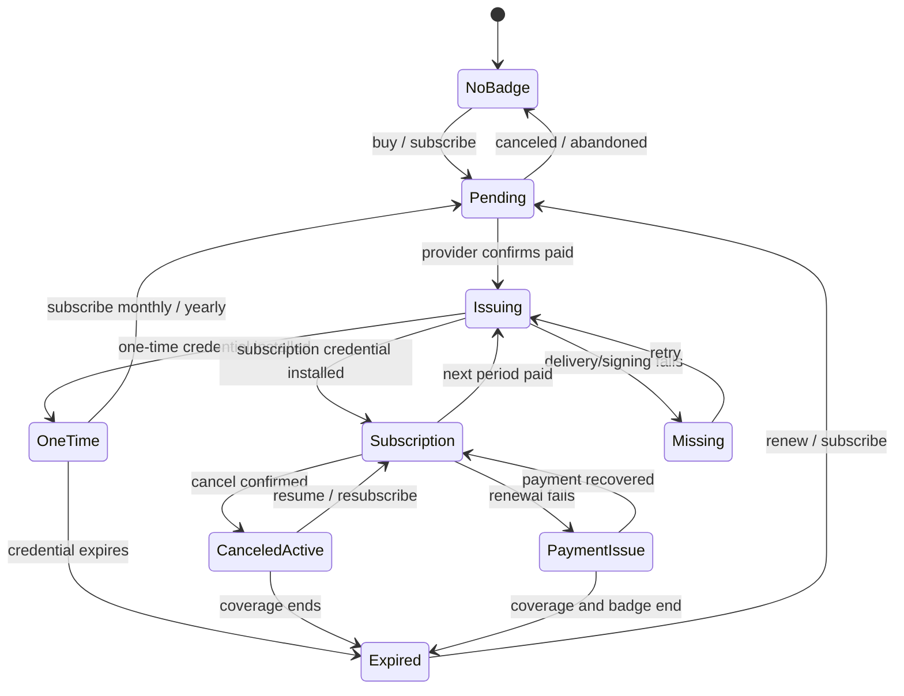
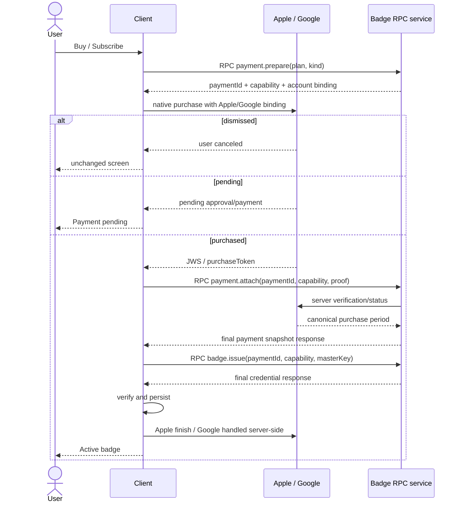
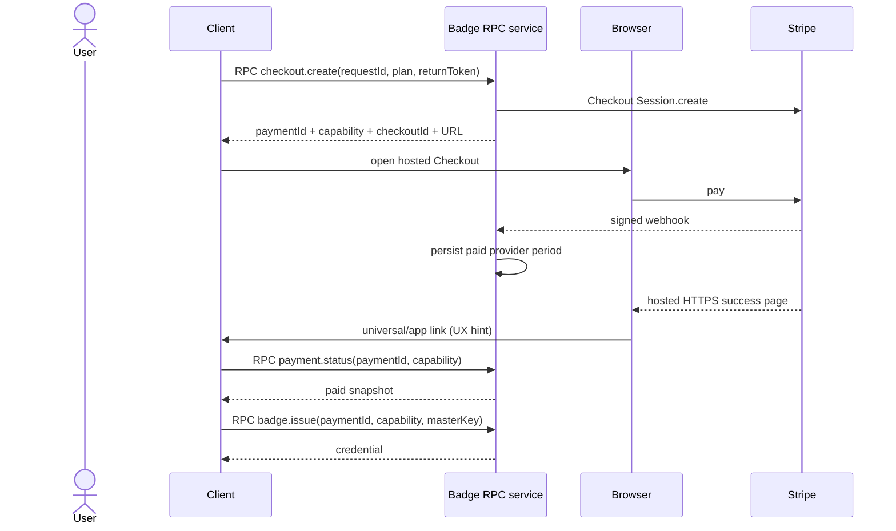
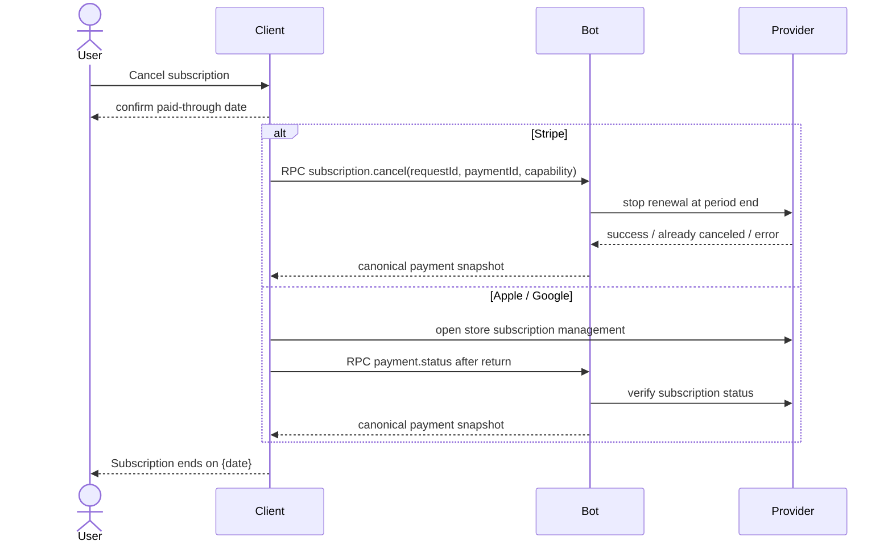

# Supporter Badges v2 — Product and UX Plan

**Date:** 2026-07-21
**Status:** implementation-ready
**Companion:** [Implementation plan](2026-07-20-supporter-badges-v2-implementation.md)

A badge is a short-lived signed credential. A payment is a separate provider entitlement. The UI combines both, but never treats payment status as proof that a badge is valid.

## Contents

- [1. Rules](#1-rules)
- [2. UX states](#2-ux-states)
- [3. Badge screen](#3-badge-screen)
- [4. Purchase and cancellation flows](#4-purchase-and-cancellation-flows)
- [5. Refresh and notification](#5-refresh-and-notification)
- [6. Error UX](#6-error-ux)
- [7. Acceptance criteria](#7-acceptance-criteria)

## 1. Rules

### 1.1 Payment rail

| Build | Rail | Purchase | Cancel/manage |
|---|---|---|---|
| iOS | Apple | StoreKit 2 sheet | `showManageSubscriptions`; App Store fallback |
| Android Play | Google | Play Billing sheet | Play subscription-management UI |
| Android non-Play / desktop | Stripe | hosted Checkout | bot cancellation RPC only |

The build chooses the rail. Apple/Google purchases are prepared with an opaque provider account binding before the native sheet opens; this prevents a forwarded receipt/token from being attached to another prepared payment. Store-policy approval for Stripe digital purchases is a release gate for every distributed build and region.

### 1.2 Dates

Badge and billing use different clocks:

| Event | Billing date | Badge validity |
|---|---|---|
| Monthly subscription starts **21 July** | next payment **21 August** | valid through **31 August**; expires `1 September 00:00 UTC` |
| Monthly renewal / yearly monthly slot **21 August** | monthly bills **21 September**; yearly still bills **21 July next year** | new badge valid through **30 September**; expires `1 October 00:00 UTC` |
| Cancel monthly before 21 August | subscription ends **21 August** | already-issued badge remains valid through **31 August** |
| Cancel yearly after 21 July payment | subscription ends **21 July next year** | monthly badge slots continue through the paid annual period |

Rules:

- Subscription billing is monthly or yearly and follows the provider’s actual `currentPeriodEnd`.
- Badge issuance remains monthly for both subscription intervals. Each monthly slot uses `endOfNextMonth(slotStart)`; billing and badge clocks remain separate.
- After cancellation, label the billing date **Subscription ends on**, not **Renews on**.
- Perks require a cryptographically active badge. Payment status alone never unlocks them.

### 1.3 Purchase type

- The purchase choices are exactly: **One-time**, **Monthly subscription**, and **Yearly subscription**.
- One-time buys one non-renewing badge period and does not stack. Buy once becomes available again after that badge expires.
- Monthly and yearly subscriptions renew until canceled. Both create monthly badge issuance slots while the provider reports paid entitlement.
- Subscribing from an active one-time badge starts a normal monthly/yearly purchase flow. There is no conversion API; the existing badge remains until the subscription badge installs.
- Cancellation stops future renewal; already-paid access remains until the provider period end. v2 does not revoke an already-issued badge after refund/revocation; short badge expiry bounds the exposure.

### 1.4 Truth and privacy

- Credential signature + expiry are authoritative for badge validity.
- Bot/provider verification is authoritative for payment and issuance eligibility.
- StoreKit/Play local reads are fast UI hints only.
- The bot binds provider purchases to a prepared payment capability. RPC supplies no persistent caller identity. The bot stores opaque provider IDs/tokens, never payment-card details.
- Receipts, tokens, provider IDs, and master secrets never appear in logs or user errors.

## 2. UX states

The view state is derived from the persisted payment machine, badge machine, and current operation.

| State | Condition | Display | Actions |
|---|---|---|---|
| **No badge** | no entitlement; no active badge | one-time, monthly, yearly prices | Buy once, Subscribe monthly/yearly |
| **Payment pending** | provider not yet paid/approved | old badge if still valid | Continue payment, Check again |
| **Paid, issuing** | entitled; issue in progress | old badge + progress | automatic retry; Retry after delay |
| **Active one-time** | active badge + one-time payment | tier; badge expiry | Subscribe monthly/yearly |
| **Active subscription** | active badge + `willRenew` | Monthly/Yearly; badge expiry; renewal date | Cancel subscription |
| **Canceled, active** | active badge; renewal off; future period end | badge expiry; ends date | Resume/Resubscribe |
| **Payment issue** | grace/retry/on-hold/past-due | valid badge until its own expiry | Fix payment, Check again |
| **Entitled, badge missing** | paid period; no usable badge | temporarily unavailable | automatic issue, Retry |
| **Expired** | no entitlement; no active badge | expired badge per core retention rule | Buy once, Subscribe monthly/yearly |
| **Needs update** | unknown issuer key/protocol | badge unavailable | Update app |
| **Offline/stale** | refresh failed; cache available | last known state + check time | Retry |

## 3. Badge screen

Use one stable layout:

1. badge artwork, tier, and proof status;
2. **Badge valid until**;
3. payment type and **Renews on** or **Subscription ends on**;
4. one primary action and one secondary manage/recovery action;
5. compact error banner and **Last checked …** only when relevant.

| Action | Behavior |
|---|---|
| Buy once | start one-time payment flow; available only without an active one-time entitlement |
| Subscribe / Resubscribe | choose Monthly or Yearly, then start that subscription flow |
| Cancel subscription | confirm → Apple/Google store management or Stripe RPC → refresh |
| Manage / Fix payment | open native management or Stripe Customer Portal |
| Check again | immediate coalesced status sync; rate-limit repeated taps |

Cancellation copy: **“Cancel renewal? Your subscription stays active until {date}. You won’t be charged again.”**

## 4. Purchase and cancellation flows

### 4.1 Apple / Google purchase

Every client/bot exchange is a one-off SimpleX service RPC: the client asks, the bot returns one final response, and the reply queue is removed. There is no persistent bot connection or bot-initiated event. If a response is lost, the app repeats the identical logical request and receives the same result.

### 4.2 Stripe checkout

Do not spawn a localhost server. A hosted HTTPS success page works across desktop/mobile and offers **Return to SimpleX** using a universal/app link with custom-scheme fallback. Redirects are not payment proof. On return/foreground the client calls `payment.status`; while Checkout remains pending it polls by making new status RPCs at 5, 15, 30, 60, and 120 seconds, then stops. Later foreground/timer reconciliation recovers closed apps and delayed webhooks. The bot never pushes state. The client supplies its master key only in the subsequent `badge.issue` RPC.

### 4.3 Cancel

Apple uses `showManageSubscriptions`; Google opens the specific Play subscription-management URL. Stripe sets `cancel_at_period_end=true` through RPC. After any store/portal return, the client refreshes by RPC. “Already canceled” is success.

Stripe cancellation has no browser fallback. If `subscription.cancel` RPC or Stripe is unavailable, keep the subscription state unchanged, show the retryable error, and retry later. Customer Portal may be used for payment methods and invoices, but its cancellation feature must be disabled.

## 5. Refresh and notification

Refresh on app start, profile switch, foreground, connectivity restoration, provider purchase updates, return from management, a foreground timer every 6 hours (±15% jitter), 24 hours before the nearer of payment/badge expiry, and at that boundary.

Rules:

1. Check payment even when no badge exists.
2. If entitled and the current monthly issuance slot has no valid badge, request issuance automatically.
3. Coalesce triggers: one sync per payment at a time.
4. Retry transient failures after 5 s, 30 s, 2 min, 15 min, then 6 h, with jitter. Reset after success, foreground, or manual retry.
5. Never calculate credential validity locally. Offline keeps a still-valid badge and cached status.
6. Each RPC has one final response. Repeating an identical issue request returns the cached credential and installs idempotently using payment/period/badge IDs. A provider event alone cannot mint a badge because the bot does not retain the master key.
7. Notify once per event: 7 days before one-time expiry, first payment problem, expiration without entitlement, and confirmed cancellation. Do not notify every poll.

## 6. Error UX

| Class | Examples | Handling |
|---|---|---|
| User action | sheet/browser dismissed | return silently to prior state |
| Pending | Ask to Buy, Play pending, open Checkout | persistent pending state; no new badge |
| Network | offline, timeout, 429, provider 5xx | retain valid badge/cache; retry with backoff |
| Payment | declined, grace, on hold, past due | show Fix payment and exact dates |
| Proof | malformed, wrong app/package, unknown SKU, ownership conflict | restore/refresh once; then support code |
| Credential | bad signature/master key | reject and retry once; unknown key → Update app |
| Cancel conflict | already canceled | treat as success; refresh |
| Stripe cancel failed | bot RPC or Stripe unavailable/rejected | keep current state; retry later; never claim cancellation |
| Service/config | provider credentials or issuer key unavailable | preserve paid state; retry issuance |
| Local storage | full/corrupt/write failure | do not finish/acknowledge until processing is durable; rebuild cache |

A user message may include only the stable error code and request ID, never raw upstream details.

## 7. Acceptance criteria

- Every UX state has a tested entry, exit, action, and recovery path.
- Restarting at any step does not duplicate charge or issuance.
- A paid user with no badge is found and re-issued automatically.
- Cancel is idempotent, shows the paid-through date, and does not remove a valid badge.
- Stripe works if the redirect never occurs, the app is closed, or webhooks are duplicated, delayed, or out of order.
- Payment and badge expiry may disagree without corrupting either machine.
- Monthly and yearly subscriptions both issue one badge per eligible monthly slot; yearly cancellation continues slots only through the paid annual end.
- All retryable failures preserve last-known UI and converge after recovery.
