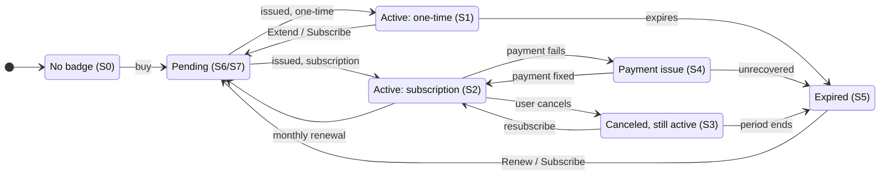
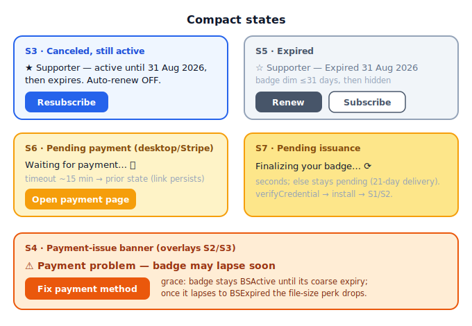
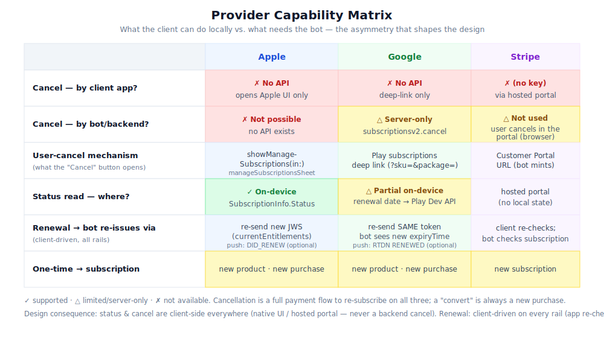

# Supporter Badges v2 — Product Plan

> What a paying supporter sees and does: buy a badge on Apple / Google / Stripe, receive it over chat, and keep it renewed — with status and cancellation handled entirely on-device.

> **Companion:** [Implementation Plan](2026-07-20-supporter-badges-v2-implementation.md) — wire protocol, provider APIs, client state model, error catalog, and roadmap. This doc owns UX and product rules; it cross-refs the Implementation Plan for anything technical.

> **v2 of** [`2026-06-01-supporter-badges-v1.md`](2026-06-01-supporter-badges-v1.md) (which shipped badge *verification* only). This plan covers the commercial lifecycle: purchase, issuance, renewal, cancellation.

**Date:** 2026-07-20  ·  **Status:** draft for review

> Diagrams use Mermaid + SVG (a deliberate deviation from the ASCII-only house style, per request). SVG sources live in [`assets/`](assets/).

---

## Contents

- [1. Overview & Scope](#1-overview--scope)
- [2. How Badges Work](#2-how-badges-work)
- [3. Screens](#3-screens)
- [4. End-to-End Journey](#4-end-to-end-journey)
- [5. Product Rules](#5-product-rules)
- [6. Provider Capability Summary](#6-provider-capability-summary)
- [7. Open Product Decisions](#7-open-product-decisions)

---

## 1. Overview & Scope

### 1.1 What

Supporter Badges **v1** shipped verification only: clients can display and cryptographically verify badges, but there is no way to *buy* one. **v2** productizes the full commercial lifecycle:

> **purchase → issue → present → renew → cancel / lapse**

across three payment rails. **One rail per platform — never a user choice of provider:**

| Platform | Rail | Purchase surface |
|---|---|---|
| iOS | Apple (StoreKit 2) | in-app |
| Android — Play build | Google (Play Billing) | in-app |
| Android — F-Droid / no-GMS | **Stripe** | browser (Checkout + portal) |
| Desktop | **Stripe** | browser (Checkout + portal) |

Desktop has no Apple/Google in-app purchase. Android ships in **two build flavors with different rails**: the **Play build** uses Play Billing; the **F-Droid / no-GMS build** — which can't bundle proprietary Play Billing — uses **Stripe** browser checkout, the same rail as desktop. So Stripe serves desktop *and* the F-Droid Android build.

### 1.2 Why

The crypto, credential format, trust anchors, and proof presentation are done and stable. What is missing is everything a paying user touches: a purchase flow, a subscription that auto-renews, a way to see and cancel it, and automatic re-issuance when a period rolls over. Without this, badges cannot ship as a revenue feature.

### 1.3 For Whom

Paying supporters on **iOS, Android, and desktop**. Every UI surface and the reconciliation loop are client-side — **the client drives everything**. The bot is anonymous and **reactive**: it verifies payment and issues a badge for the current period only when the client asks (on startup and each billing period). It never pushes, background-polls, or uses webhooks; for Stripe it keeps the subscription id per contact so it can re-check on request.

### 1.4 Scope

| In scope | Non-goals |
|---|---|
| Purchase flows (Apple / Google / Stripe) | Bot-side status/cancel commands — client-local instead |
| Client-local subscription **status** (read from provider) | Badge **revocation** / revocation lists (badges expire, never revoked) |
| Client-local **cancel** (App Store / Play UI, Stripe portal) | Apple/Google server push as *primary* renewal signal — optional only |
| Client-driven **renewal** (re-check on startup + each billing period) | New badge **types** or tier logic (issuer-fixed) |
| Client-local lifecycle **state** + reconciliation loop | Multi-device credential sync (each device its own secret, unlinkable by design) |
| Minimal bot protocol additions (see Implementation Plan) | Changing the core `BadgeStatus` enum |

**Renewal is client-driven on every rail** (see §5.4): on app startup and each billing period the app asks the bot to check the current period and re-issue. Apple/Google re-present their on-device receipt; Stripe asks the bot to re-check its stored subscription. The bot never reaches out on its own.

### 1.5 Relationship to v1

This is **v2 of** [`2026-06-01-supporter-badges-v1.md`](2026-06-01-supporter-badges-v1.md) (verification only). That v1 plan is **stale vs shipped code** on several load-bearing points — trust the code, not the v1 doc:

| v1 plan says | Shipped code |
|---|---|
| badge types `supporter` / `business` / `legend` / `cf_investor` | `supporter` / `legend` / `investor` (+ `unknown` tag) |
| 3 signed messages `[ms, expiry, level]` | **4** messages `[masterKey, expiry, type, extra]`, `extra` reserved `""` |
| single hardcoded server pubkey | **8** issuer pubkeys (idx 1–8); credential carries `badgeKeyIdx` |
| badge stored on contact **and** group-member profiles | badge columns on `contact_profiles` **only**; one badge per profile |

Subscription lifecycle (renewing, grace, canceled-but-active, pending) has **no representation in the core** — the core `BadgeStatus` is a fixed fieldless enum. All of v2's lifecycle therefore lives client-local, layered over the unchanged core badge (see the Implementation Plan, §Client State Model).

---

## 2. How Badges Work

A badge answers one question — *"do I have a valid proof to show peers?"* — while a separate **entitlement** (read locally from the store) answers *"am I still paying / covered?"*. They can disagree (e.g. paid but the credential hasn't been delivered yet), so the app tracks both and shows one of nine states, S0–S8.

### 2.1 Three user variants → nine states

The three headline user cases map onto the state set as:

- **Variant 1 — no badge yet:** `S0 NoBadge` (buy), plus check-even-without-badge handled by `S8 RecoverNeeded`.
- **Variant 2 — one-time purchase:** `S1 ActiveOneTime` (extend / upgrade-to-subscription).
- **Variant 3 — subscription:** `S2 ActiveSubscription`, `S3 SubCanceledActive`, `S4 GraceOrBillingRetry`.

Terminal/transitional states shared by all variants: `S5 Expired`, `S6 PendingPayment`, `S7 PendingIssuance`, `S8 RecoverNeeded`.

### 2.2 States

| State | Badge shown to peers | Primary actions |
|---|---|---|
| **S0** NoBadge | hidden | Choose plan → buy |
| **S1** ActiveOneTime | full (tier + expiry) | Extend (buy period); Subscribe (new sub purchase) |
| **S2** ActiveSubscription | full (tier, expiry, next renewal) | Cancel (store UI / Stripe portal) |
| **S3** SubCanceledActive | full + "active until <periodEnd>" | Resubscribe |
| **S4** GraceOrBillingRetry | dim or full | Fix payment method → deep-link store/portal |
| **S5** Expired | dim ≤31d, then hidden | Renew; Subscribe |
| **S6** PendingPayment (Stripe) | prior | Open checkout link; "waiting" (timeout → prior) |
| **S7** PendingIssuance | prior | Spinner "finalizing"; resolves on credential/error |
| **S8** RecoverNeeded | none | auto re-request → S7; if app too old → "Update app" |

Notes:
- **S4** is an **overlay** on S2/S3 (a payment problem while nominally subscribed). Badge stays valid during grace only; if the payment problem outlasts the badge's coarse expiry, the badge lapses and its perk is lost — even while the store still reports grace/retry (see §5.4).
- **S8** covers "check even when no badge is present yet": entitlement is active but there is no valid local proof, so the app silently re-requests issuance. If the credential was signed by an issuer key this app version doesn't know, it's unrecoverable in-app → prompt update.
- **One-time (S1) never auto-renews:** at expiry it goes to S5; **Extend** is a new purchase (see §5.3).

### 2.3 Lifecycle at a glance

Simplified lifecycle (S6 PendingPayment + S7 PendingIssuance shown as one **Pending**; the SVG below has the full detail including the Stripe two-step and S8 auto-recovery).

The full nine-state machine (S0–S8), colour-coded, with every transition:

*Green = valid proof shown, amber = attention needed, grey = no badge.*

---

## 3. Screens

A single badge-management screen renders one of S0–S8 (§2) from the badge, the local entitlement, and any in-flight request. Buttons name the transition they trigger. The payment rail is fixed by platform/flavor (**iOS → Apple; Android Play → Google; Android F-Droid + desktop → Stripe**); the user chooses a plan/tier, never a provider. The Stripe-specific mocks (S6 PendingPayment, portal cancel) appear on **desktop and the F-Droid Android build**.

### 3.1 No badge (S0)

| Button | Trigger |
|---|---|
| Subscribe | subscription purchase (Apple/Google) or Stripe Payment Link → S6/S7 |
| Buy once | same, one-time SKU → S6/S7 |

### 3.2 Active one-time (S1)

| Button | Trigger |
|---|---|
| Extend | buy another one-time period (full payment flow) → S7 |
| Subscribe | NEW subscription purchase (auto-renew) → S7; not a convert (see §5.3) |

### 3.3 Active subscription (S2)

This screen shows **two different dates** — badge expiry vs next renewal. They are deliberately distinct; see §5.1 for the rule and worked example.

| Button | Trigger |
|---|---|
| Cancel subscription | client-side only: Apple manage-subscriptions sheet / Play deep-link / Stripe portal — user cancels there → S3 (see §5.2) |

### 3.4 Compact mocks

- **Subscription canceled, still active (S3)** — Resubscribe → new subscription purchase → S2.
- **Expired (S5)** — badge dim ≤31d, hidden after. Renew → re-buy one-time; Subscribe → new sub. Both → S7.
- **Pending payment — Stripe (S6)** — Open page → Stripe Payment Link URL. The app polls the bot until it's paid → S7/S2; timeout (~15 min) → prior state (the pending link persists for re-open).
- **Pending issuance (S7)** — no buttons. Awaiting the bot's credential (seconds; if delayed it stays pending — delivery is trusted). On install → S1/S2; on error → prior state + toast.
- **Payment-issue banner (S4, overlays S2/S3)** — shown for store grace/billing-retry/past_due. Fix → store/Play/Stripe portal deep-link. Badge stays valid during grace only; on-hold/retry-failed → S5.

> S8 RecoverNeeded (entitlement active, badge missing/invalid) is not a screen: reconciliation auto re-requests issuance (→ S7). If the app is too old to verify the issuer key, show inline "Update app to display your badge."

---

## 4. End-to-End Journey

The complete lifecycle in one view: connect to the bot → buy on Apple/Google/Stripe → the bot verifies and issues → the app installs and shows the badge → on every launch/timer the app checks its own expiry and subscription and renews or notifies → cancel is client-side.

**Narrative.**

1. **Connect (once).** The app connects to the hardcoded badge bot address; the bot auto-accepts.
2. **Buy.** The user taps a plan. On iOS/Android the purchase happens in the native store sheet; on desktop the app opens a Stripe Checkout page in the browser.
3. **Get badge.** The app sends its purchase receipt to the bot; the bot verifies it with the provider, derives the tier and expiry, signs the credential, and returns it. The app verifies and installs the badge, which then unlocks perks and can be shown to peers.
4. **Renew.** On startup, foreground, coarse timer, and each billing period, the app re-checks. Apple/Google re-present the current receipt; for Stripe the app asks the bot to re-check its stored subscription. Either way the bot returns the next period's badge, so an active subscriber's badge never visibly lapses mid-cycle (see §5.4).
5. **Cancel.** The user cancels in the native store UI or the Stripe portal — never through the bot. The badge stays active until its coarse expiry, then lapses (see §5.2).

> The message-level sequence diagrams (request → response between app, bot, and provider) live in the [Implementation Plan](2026-07-20-supporter-badges-v2-implementation.md), §Client ↔ Bot Protocol.

---

## 5. Product Rules

The cross-cutting rules, each stated once. Screens and provider sections reference these.

### 5.1 Two dates: badge expiry vs renewal

A subscriber's screen shows two dates that are set independently:

| | Alignment | How it's set | Example: bought **July 20** |
|---|---|---|---|
| **Badge expiry** | **month-aligned, coarse** | issuer sets it to the **end of the month after purchase** (`end_of_next_month`), shared by everyone who buys that month so the *disclosed* value can't fingerprint the holder | valid through **end of August** (expires `2026-09-01T00:00:00Z`) |
| **Renewal / next billing** | **subscription-aligned** | the store's real period end, read locally (Apple `expirationDate` / Play `expiryTime` / Stripe item period end) | **renews August 20** |

The renewal (Aug 20) deliberately falls **before** the badge expiry (end of Aug): at renewal the app re-issues and gets the *next* month's cohort expiry, so an active subscriber's badge never visibly lapses mid-cycle. Badge expiry comes from the signed credential; the renewal date from the store.

### 5.2 Cancellation is user-driven and store-side

There is **no bot or backend cancel**. The app only opens the store's own UI, and the user cancels there:

- **Apple:** the native manage-subscriptions sheet (`showManageSubscriptions`), fallback deep-link to the account subscriptions page.
- **Google:** deep-link to the Play subscription center.
- **Stripe:** the bot mints a hosted Customer Portal URL; the user self-cancels there (`cancel_at_period_end`, reversible until period end).

After cancelling, the badge **stays active until its coarse expiry, then lapses** (S2 → S3 → S5). The app detects the cancel on its next status read (auto-renew flag flips off).

### 5.3 One-time vs subscription

- **One-time** never auto-renews. At expiry it goes to S5; **Extend** is a fresh purchase of a new one-time period. A one-time credential lost locally (reinstall) is not restorable — the user re-buys.
- **Subscription** auto-renews until cancelled; the primary action is **Cancel** (§5.2).
- **"Convert" is not a special API.** Upgrading one-time → subscription (S1 "Subscribe") is simply a **new subscription purchase**. Overlapping coverage is allowed; the coarse end-of-next-month expiry dedupes it, and the badge just gains the later expiry.

### 5.4 Renewal is automatic and invisible

The app re-issues the badge on renewal with no user action:

- **On startup and each billing period,** the app asks the bot to check the current period and re-issue.
- **Apple / Google:** the app re-presents its on-device receipt/token.
- **Stripe:** the app has no local subscription state, so it asks the bot to re-check the stored subscription (no new checkout).
- The bot verifies payment for the period and returns the badge — the same one if the period hasn't advanced, a fresh one (next cohort expiry) if it has.

**Perks require an active badge.** The 2 GB / 5 GB file-size cap unlocks only while the badge is active and drops the instant the badge leaves that state. If a payment problem (S4) outlasts the badge's coarse expiry, the badge lapses and the perk is lost even while the store still reports grace/retry.

### 5.5 Availability by platform

- **iOS → Apple; Android Play build → Google; Android F-Droid/no-GMS build → Stripe; desktop → Stripe.** Stripe serves desktop **and** the F-Droid Android build; there is no Apple/Google purchase on desktop.
- **Android F-Droid / no-GMS build has no Play Billing** — the FOSS APK must stay free of proprietary billing code, so it uses **Stripe** (browser checkout + portal) instead, the same rail as desktop. Badge display/verification (v1) works on every flavor; only the *purchase rail* differs (Play → Play Billing, F-Droid → Stripe).

---

## 6. Provider Capability Summary

What the app can do locally on each rail vs. what needs the bot:

| Provider | Platform | Cancel mechanism | Renewal model |
|---|---|---|---|
| Apple (StoreKit 2) | iOS | native manage-subscriptions sheet | app re-presents receipt each period (client-driven) |
| Google (Play Billing) | Android (Play flavor) | Play subscription-center deep-link | app re-presents token each period (client-driven) |
| Stripe | Desktop + Android (F-Droid) | hosted Customer Portal URL | app asks the bot to re-check the subscription each period (client-driven) |

Status is read locally on Apple/Google and via the hosted portal on Stripe; **cancel is user-driven store-side** on all three (§5.2). Provider API detail (StoreKit 2, Play Developer API, Stripe Checkout/portal, error handling) is in the [Implementation Plan](2026-07-20-supporter-badges-v2-implementation.md), §Provider Integration.

---

## 7. Open Product Decisions

Product-level decisions still open; technical decisions are in the [Implementation Plan](2026-07-20-supporter-badges-v2-implementation.md), §Open Technical Decisions.

| # | Question | Recommended default |
|---|---|---|
| 1 | Product catalog: offer a one-time non-subscription badge, or subscription-only, on Apple/Google? | Offer **both** (one-time "Extend" + auto-renew "Subscribe"); coarse end-of-next-month expiry dedupes overlap. Revisit if catalog upkeep is too costly. |