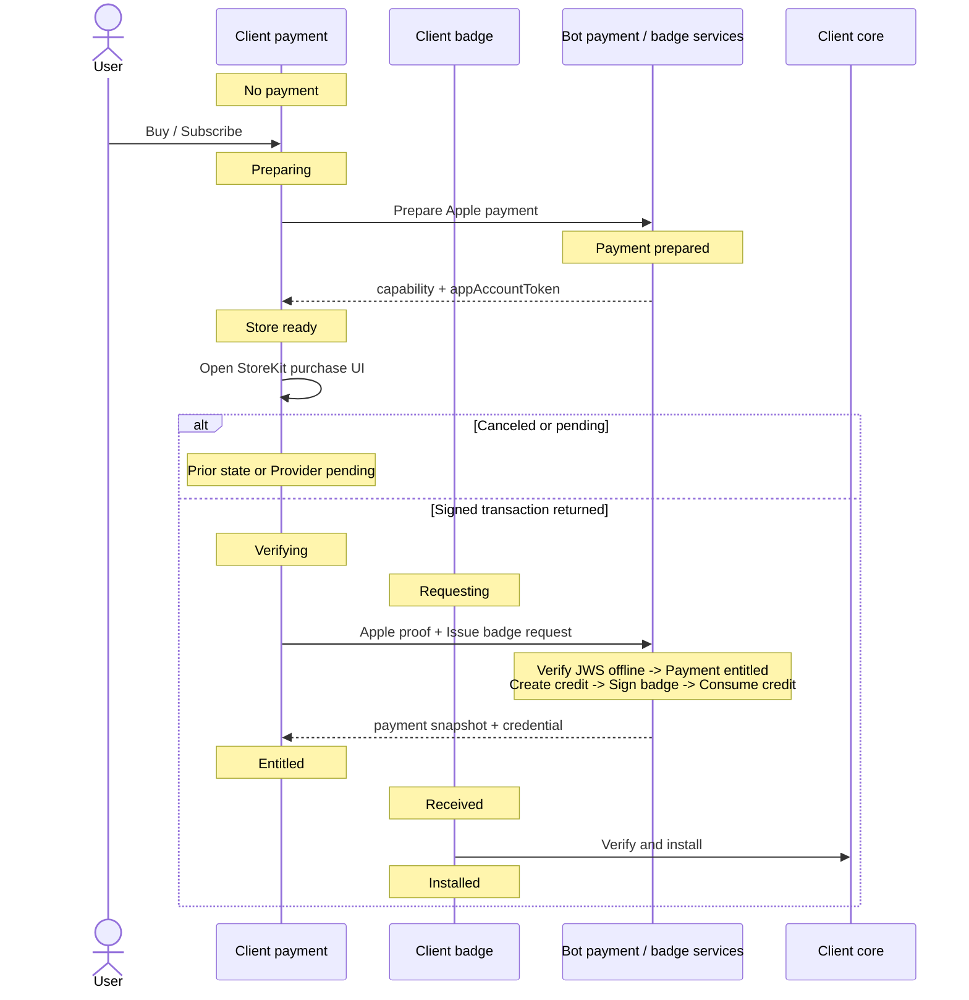
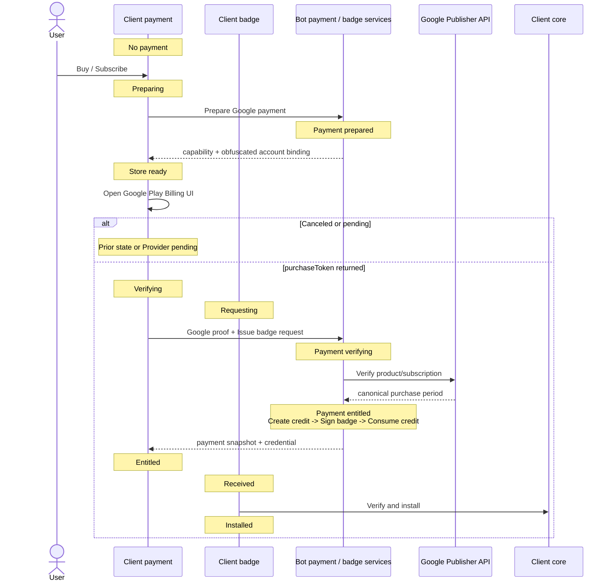
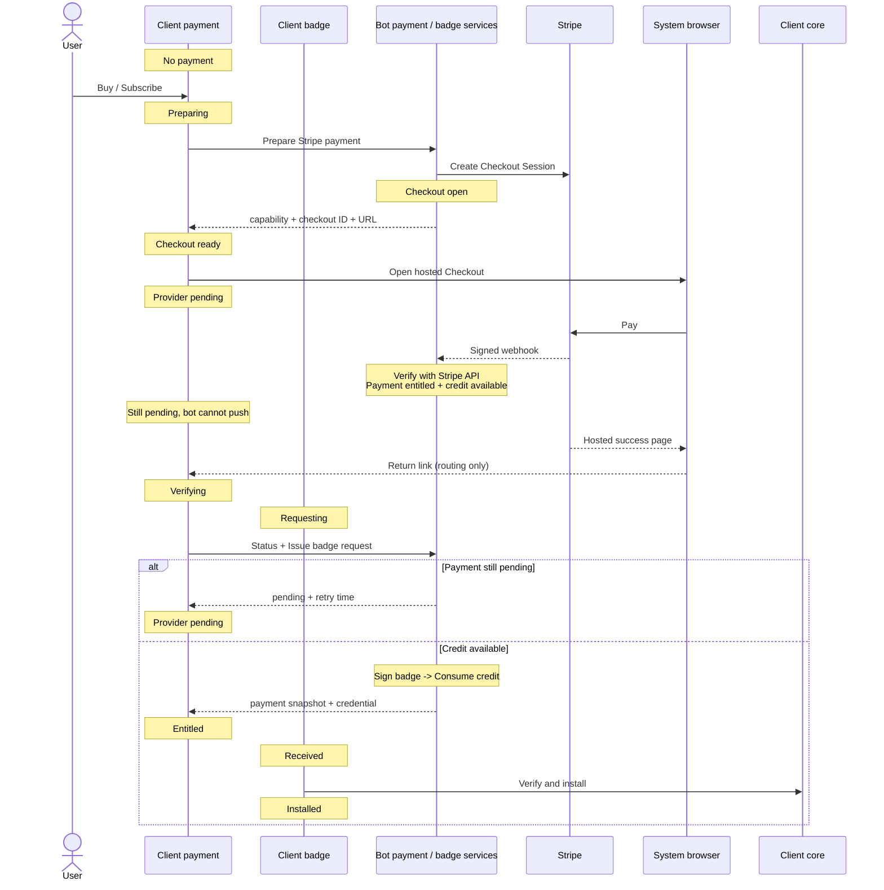
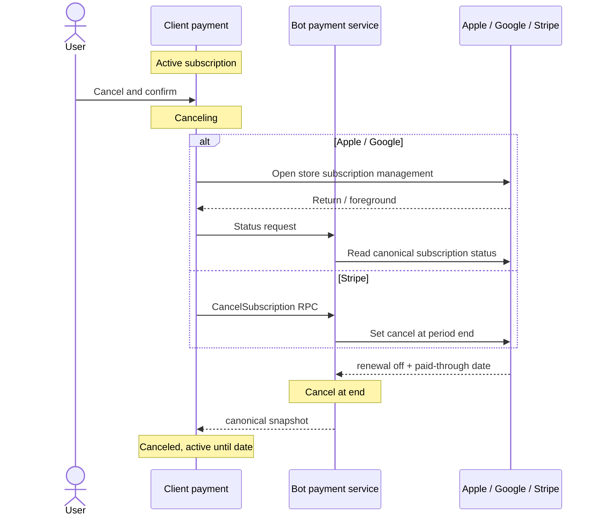

# Supporter Badges v2 — Product and UX Plan

**Date:** 2026-07-21
**Status:** implementation-ready
**Companion:** [Implementation plan](2026-07-20-supporter-badges-v2-implementation.md)

A payment grants a provider-neutral monthly service credit. That credit can issue one badge credential. Payment, badge issuance, and local badge installation remain separate states even when one RPC completes several steps.

## Contents

- [1. Product rules](#1-product-rules)
- [2. UX states](#2-ux-states)
- [3. Badge screen](#3-badge-screen)
- [4. Message-driven flows](#4-message-driven-flows)
- [5. Refresh and notification](#5-refresh-and-notification)
- [6. Error UX](#6-error-ux)
- [7. Acceptance criteria](#7-acceptance-criteria)

## 1. Product rules

### 1.1 Payment rails

| Build | Purchase | Cancel/manage |
|---|---|---|
| iOS | Apple StoreKit UI | Apple subscription-management UI |
| Android Play | Google Play Billing UI | Google Play subscription-management UI |
| Android non-Play / desktop | Stripe hosted Checkout | cancellation through bot RPC; portal for invoices/payment methods |

The build selects the rail. There are exactly three choices: **One-time**, **Monthly subscription**, and **Yearly subscription**. There is no Extend action.

- One-time buys one non-renewing badge period and does not stack. It becomes purchasable again after expiry.
- Subscribing while a one-time badge is active starts a normal new payment flow; stores do not convert that purchase.
- Monthly/yearly subscriptions renew until canceled and create a new badge credit each eligible month.
- Cancellation stops future renewal but does not shorten an already-issued badge.
- Stripe Checkout, Customer Portal, and app links use the system browser. No localhost HTTP service is used.
- Store-policy approval for Stripe digital purchases is a release gate for every build/region where it is offered.

### 1.2 Dates

Billing and badge validity use separate clocks:

| Event | Billing | Badge |
|---|---|---|
| Payment **21 July** | monthly renewal **21 August**; yearly renewal **21 July next year** | valid through **31 August**; expires `1 September 00:00 UTC` |
| Monthly slot **21 August** | monthly renewal **21 September**; yearly billing date unchanged | new badge valid through **30 September** |
| Cancel before the next bill | access remains through provider `paidThrough` | already-issued badge remains valid to its signed expiry |

The UI labels these separately as **Badge valid until** and **Renews on**. After cancellation, use **Subscription ends on**.

### 1.3 Truth and privacy

- Core signature verification + credential expiry decides whether the badge is active.
- Bot/provider verification decides payment status and whether a service credit exists.
- StoreKit/Play local state and Stripe redirects are UI hints, never payment proof.
- The bot returns one final response to each client RPC and cannot initiate a client message.
- Capabilities, receipts, tokens, provider IDs, master keys, and credentials are redacted from logs and Chat Console.

## 2. UX states

The screen derives its state from two independent sources: the last payment snapshot and the locally installed badge.

| UX state | Payment / badge condition | Display | Actions |
|---|---|---|---|
| **No badge** | no entitlement; no active badge | prices and plan choices | Buy once; Subscribe monthly/yearly |
| **Payment pending** | provider approval/payment pending | old badge if valid; pending message | Continue payment; Check again |
| **Paid, issuing** | credit available; badge request/install in progress | old badge + progress | automatic retry; Retry |
| **Active one-time** | one-time paid; badge active | tier; badge expiry | Subscribe monthly/yearly |
| **Active subscription** | subscription paid and renewing; badge active | interval; badge expiry; renewal date | Cancel subscription; Manage payment |
| **Canceled, active** | renewal off; paid period or badge still active | badge expiry; subscription end | Resubscribe |
| **Payment issue** | grace/on-hold/paused/provider failure | active badge until its own expiry | Fix payment; Check again |
| **Badge missing** | payment credit exists; no usable badge | issuance unavailable/retrying | Retry |
| **Expired** | no entitlement; no active badge | prior badge per retention rules | Buy once; Subscribe monthly/yearly |
| **Needs update** | unknown issuer/protocol | badge unavailable | Update app |
| **Offline/stale** | refresh failed; cache exists | last known state + check time | Retry |

An active installed badge remains visible during payment refresh, cancellation, or network failures. Payment state alone never activates perks.

## 3. Badge screen

Use one stable layout:

1. badge artwork, tier, and proof status;
2. **Badge valid until**;
3. One-time/Monthly/Yearly and **Renews on** or **Subscription ends on**;
4. one primary action and one secondary manage/recovery action;
5. compact error banner and **Last checked …** only when relevant.

| Action | Behavior |
|---|---|
| Buy once | start the build’s one-time payment UI; disabled while one-time entitlement is active |
| Subscribe / Resubscribe | choose Monthly or Yearly, then start a new subscription payment |
| Cancel subscription | confirm → Apple/Google management UI or Stripe cancel RPC → refresh |
| Manage / Fix payment | Apple/Google management UI or Stripe Customer Portal |
| Check again | immediate coalesced status RPC; rate-limit repeated taps |

Cancellation copy: **“Cancel renewal? Your subscription stays active until {date}. You won’t be charged again.”**

## 4. Message-driven flows

Each state note names its owner. Detailed persisted state definitions are in the implementation plan.

### 4.1 Apple purchase

### 4.2 Google purchase

Apple and Google intentionally use separate flows: Apple verifies the initial signed transaction offline; Google asks the Publisher API.

### 4.3 Stripe — F-Droid and desktop

The return link is not proof. On return/foreground the app asks the bot; if still pending it polls at 5, 15, 30, 60, and 120 seconds, then waits for normal reconciliation. If the link fails, foreground refresh still recovers the purchase.

### 4.4 Cancellation

A timeout keeps the previous state and shows Retry. The app never says canceled until the bot confirms renewal is off. Stripe cancellation is through bot RPC only.

## 5. Refresh and notification

The client asks; the bot only responds. There are no bot events to the client.

Refresh on:

- launch, foreground, profile switch, network restored;
- StoreKit/Play purchase update;
- Stripe return link or browser return;
- manual Check again;
- six-hour jittered timer;
- 24 hours before payment end or badge expiry.

After refresh:

- payment pending → keep pending and schedule retry;
- credit available + badge absent for that slot → request issuance;
- credential returned → cache, verify, install, then update UI;
- no subscription and badge expired → show available purchase choices;
- cancellation/refund → stop future issuance; keep a cryptographically active installed badge until its expiry.

Notify once per payment/slot for: payment action required, badge expiring soon without renewal, subscription ending, and badge issuance repeatedly failing. Do not notify merely because the app was offline.

## 6. Error UX

| Condition | User message/action |
|---|---|
| Store UI dismissed | return silently to prior screen |
| Payment pending | “Payment pending”; Continue/Check again |
| Network/provider unavailable | keep cached badge; “Couldn’t refresh”; Retry |
| Stripe return link fails | no special failure; foreground polling/status recovers |
| Payment confirmed, badge issue failed | “Payment confirmed. Badge is being prepared”; automatic retry |
| Cancellation request failed | keep **Renews on**; “Couldn’t cancel”; Retry |
| Payment method/grace/on-hold | keep badge while valid; Fix payment/Manage |
| Invalid proof or ownership conflict | generic restore/support message; no sensitive details |
| Unknown issuer/protocol | “Update SimpleX to use this badge” |
| Invalid returned credential | do not install; retain old badge; retry/support |
| Duplicate request/response loss | no duplicate charge/badge; repeat returns same result |

Every error preserves the last known payment snapshot and installed badge. Errors are classified as retryable, final user/configuration, or operator/security; raw provider messages are never shown.

## 7. Acceptance criteria

- The three top-level badge states are clear: no badge, active one-time, active subscription.
- Monthly and yearly subscription choices are explicit; no Extend subscription action exists.
- A 21 July payment displays badge validity through 31 August while billing remains 21 August/monthly or 21 July next year/yearly.
- Apple, Google, and Stripe flows show separate client and bot state markers and the message causing each transition.
- Apple initial proof is offline; Google initial proof uses its server API; Stripe uses Checkout + webhook/API reconciliation.
- Payment verification yields a provider-neutral credit; badge issuance does not import provider logic.
- Payment and badge tables are separate state machines on both client and bot.
- RPC is client-request/bot-response only; response loss is recovered idempotently.
- Stripe works without localhost and cancellation is bot RPC only.
- Every response/error has a client reaction, bot reaction, and retry/final classification in the implementation plan.
- Every badge RPC attempt/result is auditable in Developer Tools → Chat Console with secrets redacted.
